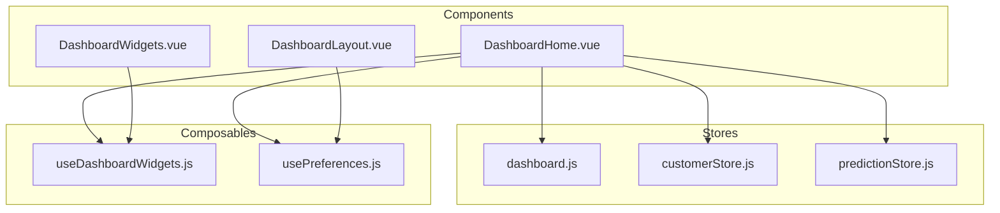
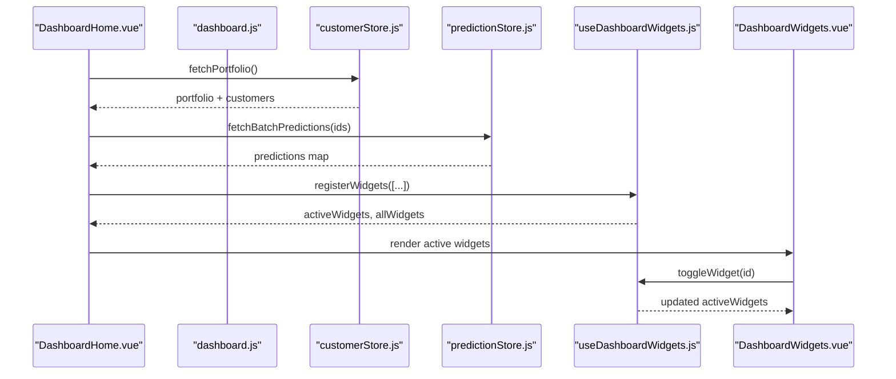
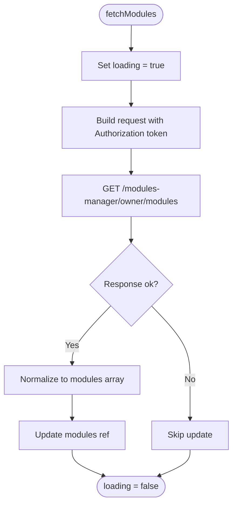
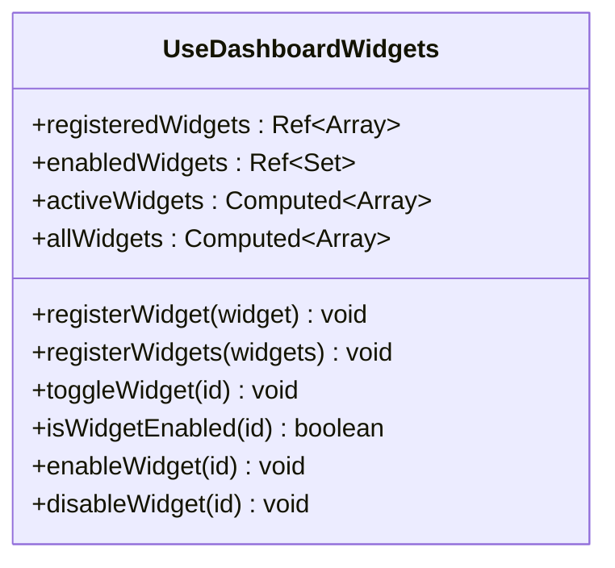
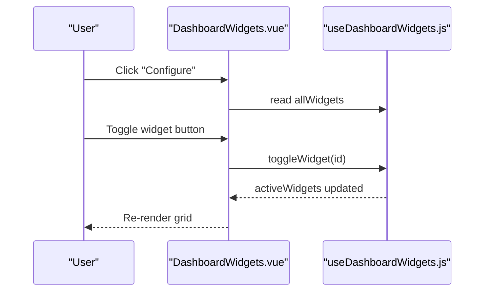
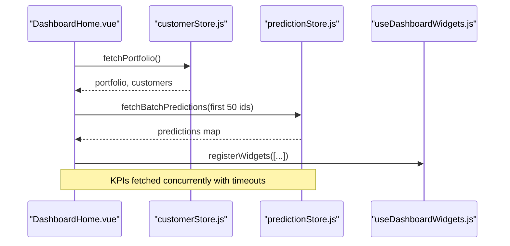
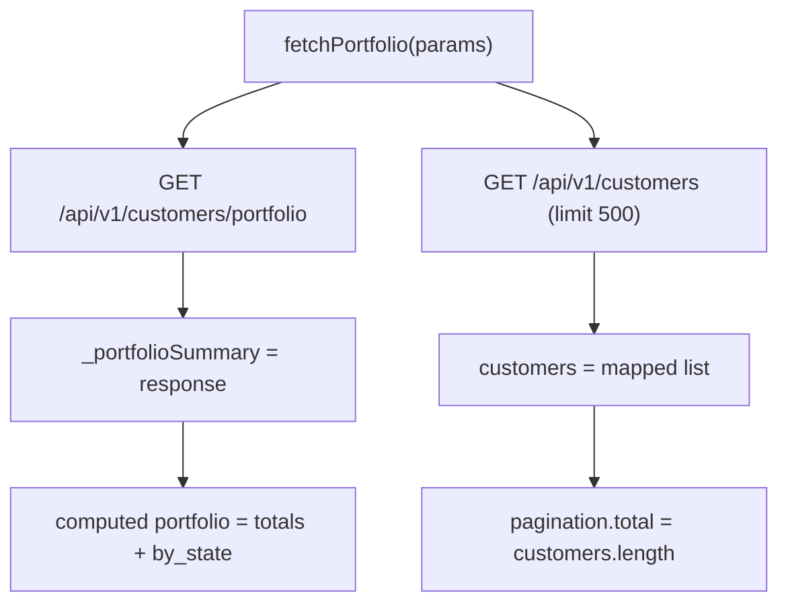
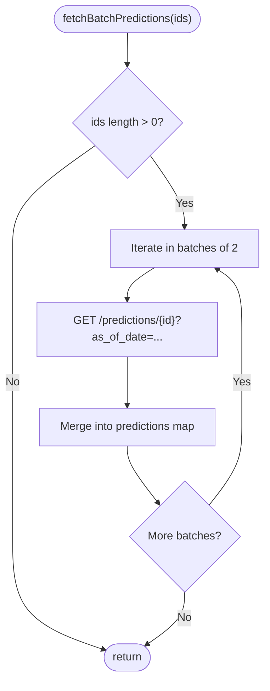
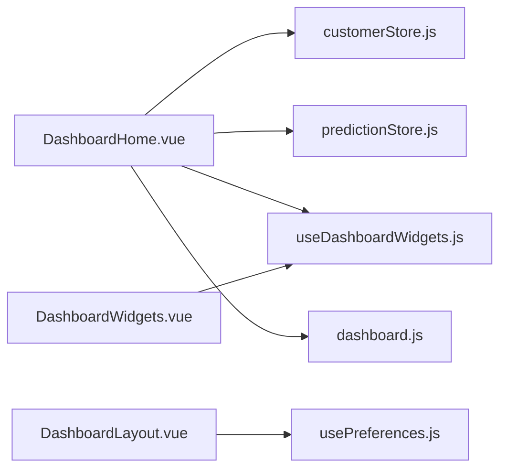

# Dashboard Store (dashboard.js)

<cite>
**Referenced Files in This Document**
- [dashboard.js](file://src/stores/dashboard.js)
- [useDashboardWidgets.js](file://src/composables/useDashboardWidgets.js)
- [DashboardWidgets.vue](file://src/components/ui/DashboardWidgets.vue)
- [DashboardHome.vue](file://src/views/DashboardHome.vue)
- [customerStore.js](file://src/stores/customerStore.js)
- [predictionStore.js](file://src/stores/predictionStore.js)
- [DashboardLayout.vue](file://src/components/layouts/DashboardLayout.vue)
- [usePreferences.js](file://src/config/usePreferences.js)
</cite>

## Table of Contents
1. [Introduction](#introduction)
2. [Project Structure](#project-structure)
3. [Core Components](#core-components)
4. [Architecture Overview](#architecture-overview)
5. [Detailed Component Analysis](#detailed-component-analysis)
6. [Dependency Analysis](#dependency-analysis)
7. [Performance Considerations](#performance-considerations)
8. [Troubleshooting Guide](#troubleshooting-guide)
9. [Conclusion](#conclusion)
10. [Appendices](#appendices)

## Introduction
This document explains the dashboard store and its ecosystem that manages UI metrics, widget configuration, and dashboard layout state for the main dashboard interface. It covers how widget visibility is controlled, how metric calculations are derived from stores, how real-time data updates flow into the UI, and how components subscribe to state changes. It also documents the integration between the dashboard store and the useDashboardWidgets composable for widget lifecycle management, as well as the role of other stores and composables in managing performance metrics and user preferences.

## Project Structure
The dashboard experience is composed of:
- A Pinia store for modules and loading state
- A composable for widget registration, persistence, and visibility control
- A widgets container component that renders active widgets and a settings panel
- The main dashboard view that orchestrates KPIs, customer portfolio, predictions, and widgets
- Supporting stores for customer portfolio and predictions
- Layout and preference utilities

**Diagram sources**
- [dashboard.js:1-29](file://src/stores/dashboard.js#L1-L29)
- [customerStore.js:1-187](file://src/stores/customerStore.js#L1-L187)
- [predictionStore.js:1-171](file://src/stores/predictionStore.js#L1-L171)
- [useDashboardWidgets.js:1-88](file://src/composables/useDashboardWidgets.js#L1-L88)
- [DashboardWidgets.vue:1-71](file://src/components/ui/DashboardWidgets.vue#L1-L71)
- [DashboardHome.vue:271-723](file://src/views/DashboardHome.vue#L271-L723)
- [DashboardLayout.vue:1-299](file://src/components/layouts/DashboardLayout.vue#L1-L299)
- [usePreferences.js:1-111](file://src/config/usePreferences.js#L1-L111)

**Section sources**
- [dashboard.js:1-29](file://src/stores/dashboard.js#L1-L29)
- [DashboardHome.vue:271-723](file://src/views/DashboardHome.vue#L271-L723)

## Core Components
- Dashboard store: Provides module list and loading state; fetches subscribed modules from the backend.
- Widget composable: Registers widgets, persists enabled/disabled state to localStorage, exposes computed lists of active and all widgets, and toggles.
- Widgets container: Renders a configurable grid of active widgets and a settings panel to toggle visibility.
- Dashboard view: Orchestrates KPI fetching, customer portfolio load, prediction batching, and registers widgets at mount.
- Customer store: Loads portfolio summary and customer list; computes derived metrics like totals and percentages.
- Prediction store: Fetches churn probabilities, health scores, CLV percentiles, and supports batched loads.
- Preferences composable: Manages branding and theme preferences with local caching and remote sync.

**Section sources**
- [dashboard.js:1-29](file://src/stores/dashboard.js#L1-L29)
- [useDashboardWidgets.js:1-88](file://src/composables/useDashboardWidgets.js#L1-L88)
- [DashboardWidgets.vue:1-71](file://src/components/ui/DashboardWidgets.vue#L1-L71)
- [DashboardHome.vue:271-723](file://src/views/DashboardHome.vue#L271-L723)
- [customerStore.js:1-187](file://src/stores/customerStore.js#L1-L187)
- [predictionStore.js:1-171](file://src/stores/predictionStore.js#L1-L171)
- [usePreferences.js:1-111](file://src/config/usePreferences.js#L1-L111)

## Architecture Overview
The dashboard composes multiple reactive sources:
- Module availability from the dashboard store
- Portfolio metrics from the customer store
- Predictive insights from the prediction store
- Widget visibility and lifecycle from the widget composable
- Branding and preferences from the preferences composable

**Diagram sources**
- [DashboardHome.vue:329-371](file://src/views/DashboardHome.vue#L329-L371)
- [customerStore.js:91-114](file://src/stores/customerStore.js#L91-L114)
- [predictionStore.js:110-138](file://src/stores/predictionStore.js#L110-L138)
- [useDashboardWidgets.js:24-86](file://src/composables/useDashboardWidgets.js#L24-L86)
- [DashboardWidgets.vue:51-58](file://src/components/ui/DashboardWidgets.vue#L51-L58)

## Detailed Component Analysis

### Dashboard Store (dashboard.js)
Responsibilities:
- Maintain modules and loading state
- Fetch subscribed modules from the backend with authorization header
- Normalize response shape to an array of module identifiers

Key behaviors:
- Sets loading flag during network request
- Handles both modules array and subscribed_modules fallback
- Catches and logs errors without breaking the app

Integration points:
- Used by views or layouts to determine available modules
- Complements RBAC and subscription checks elsewhere

**Diagram sources**
- [dashboard.js:9-25](file://src/stores/dashboard.js#L9-L25)

**Section sources**
- [dashboard.js:1-29](file://src/stores/dashboard.js#L1-L29)

### Widget Lifecycle Management (useDashboardWidgets.js)
Responsibilities:
- Register single or multiple widgets
- Persist enabled widget IDs to localStorage
- Provide reactive sets and computed lists for active and all widgets
- Toggle enable/disable states

Key behaviors:
- Uses markRaw to avoid making component references reactive
- Persists on every change to enabled set
- Exposes helpers for programmatic control

**Diagram sources**
- [useDashboardWidgets.js:1-88](file://src/composables/useDashboardWidgets.js#L1-L88)

**Section sources**
- [useDashboardWidgets.js:1-88](file://src/composables/useDashboardWidgets.js#L1-L88)

### Widgets Container (DashboardWidgets.vue)
Responsibilities:
- Render a settings panel to toggle widget visibility
- Render active widgets dynamically using Vue’s dynamic component
- Show empty state when no widgets are enabled

Subscription pattern:
- Subscribes to activeWidgets and allWidgets via the composable
- Calls toggleWidget on user interaction, which updates persisted state and re-renders

**Diagram sources**
- [DashboardWidgets.vue:1-71](file://src/components/ui/DashboardWidgets.vue#L1-L71)
- [useDashboardWidgets.js:24-86](file://src/composables/useDashboardWidgets.js#L24-L86)

**Section sources**
- [DashboardWidgets.vue:1-71](file://src/components/ui/DashboardWidgets.vue#L1-L71)

### Dashboard Home (DashboardHome.vue)
Responsibilities:
- Load portfolio and predictions on mount
- Define and fetch KPIs concurrently with timeouts
- Register widgets at runtime
- Manage pagination for ledger table
- Handle offline/online events and module expiration checks

Real-time updates:
- Uses Promise.allSettled for KPI fetching to tolerate partial failures
- Batches prediction requests to avoid overwhelming the backend
- Updates UI reactively through refs and computed values

**Diagram sources**
- [DashboardHome.vue:329-371](file://src/views/DashboardHome.vue#L329-L371)
- [customerStore.js:91-114](file://src/stores/customerStore.js#L91-L114)
- [predictionStore.js:110-138](file://src/stores/predictionStore.js#L110-L138)

**Section sources**
- [DashboardHome.vue:271-723](file://src/views/DashboardHome.vue#L271-L723)

### Customer Store (customerStore.js)
Responsibilities:
- Fetch portfolio summary and customer list
- Compute derived metrics such as total, counts, and percentages
- Support filtering and pagination

Metric calculation highlights:
- Derived portfolio object aggregates counts and percentages from backend summary
- Actions due computed as sum of at-risk and dormant counts

**Diagram sources**
- [customerStore.js:91-114](file://src/stores/customerStore.js#L91-L114)
- [customerStore.js:32-51](file://src/stores/customerStore.js#L32-L51)

**Section sources**
- [customerStore.js:1-187](file://src/stores/customerStore.js#L1-L187)

### Prediction Store (predictionStore.js)
Responsibilities:
- Fetch churn probability, health score, full prediction per customer
- Batch fetch predictions efficiently
- Retrieve Markov matrix and churn drivers

Real-time considerations:
- Batching uses small concurrent batches to protect backend
- Stores results keyed by customerId for O(1) access

**Diagram sources**
- [predictionStore.js:110-138](file://src/stores/predictionStore.js#L110-L138)

**Section sources**
- [predictionStore.js:1-171](file://src/stores/predictionStore.js#L1-L171)

### Preferences (usePreferences.js)
Responsibilities:
- Load and apply branding preferences
- Cache locally and sync with backend
- Expose loading and error states

Role in dashboard:
- Applied globally to CSS variables for consistent theming across dashboard components

**Section sources**
- [usePreferences.js:1-111](file://src/config/usePreferences.js#L1-L111)

## Dependency Analysis
- DashboardHome depends on:
  - customerStore for portfolio and customer data
  - predictionStore for predictive metrics
  - useDashboardWidgets for widget lifecycle
  - DashboardWidgets for rendering active widgets
- DashboardLayout depends on preferences for branding and navigation
- Dashboard store provides module availability used by views and layouts

**Diagram sources**
- [DashboardHome.vue:271-723](file://src/views/DashboardHome.vue#L271-L723)
- [DashboardWidgets.vue:1-71](file://src/components/ui/DashboardWidgets.vue#L1-L71)
- [DashboardLayout.vue:1-299](file://src/components/layouts/DashboardLayout.vue#L1-L299)
- [customerStore.js:1-187](file://src/stores/customerStore.js#L1-L187)
- [predictionStore.js:1-171](file://src/stores/predictionStore.js#L1-L171)
- [dashboard.js:1-29](file://src/stores/dashboard.js#L1-L29)
- [usePreferences.js:1-111](file://src/config/usePreferences.js#L1-L111)

**Section sources**
- [DashboardHome.vue:271-723](file://src/views/DashboardHome.vue#L271-L723)
- [DashboardWidgets.vue:1-71](file://src/components/ui/DashboardWidgets.vue#L1-L71)
- [DashboardLayout.vue:1-299](file://src/components/layouts/DashboardLayout.vue#L1-L299)

## Performance Considerations
- Concurrent KPI fetching with timeouts prevents long waits and partial failures degrade gracefully
- Batched prediction requests limit concurrency to reduce backend pressure
- LocalStorage persistence for widget visibility avoids repeated user configuration
- Reactive computed properties minimize unnecessary recalculations
- Using markRaw for widget components prevents overhead from deep reactivity on static components

[No sources needed since this section provides general guidance]

## Troubleshooting Guide
Common issues and resolutions:
- Modules not loading:
  - Verify Authorization header presence and token validity
  - Check backend endpoint availability and response shape
  - Inspect console warnings for fetch failures
- KPIs not updating:
  - Confirm API endpoints return expected fields
  - Ensure timeouts do not abort too early under slow networks
  - Validate that Promise.allSettled handles rejected promises correctly
- Predictions missing:
  - Ensure customer IDs are valid and passed to batch fetch
  - Check backend rate limits and adjust batch size if necessary
- Widgets not appearing:
  - Confirm widgets are registered before rendering
  - Verify localStorage has enabled widget IDs
  - Check that dynamic component names match registered components
- Preferences not applied:
  - Ensure preferences are loaded before theme-dependent components mount
  - Validate CORS and backend availability for preferences endpoints

**Section sources**
- [dashboard.js:9-25](file://src/stores/dashboard.js#L9-L25)
- [DashboardHome.vue:468-525](file://src/views/DashboardHome.vue#L468-L525)
- [predictionStore.js:110-138](file://src/stores/predictionStore.js#L110-L138)
- [useDashboardWidgets.js:8-22](file://src/composables/useDashboardWidgets.js#L8-L22)
- [usePreferences.js:34-66](file://src/config/usePreferences.js#L34-L66)

## Conclusion
The dashboard store and its surrounding ecosystem provide a robust foundation for managing UI metrics, widget configuration, and dashboard layout state. The store focuses on module availability while related stores handle portfolio and predictive metrics. The widget composable centralizes lifecycle and persistence, enabling flexible dashboards where users can tailor their workspace. Components subscribe reactively to these sources to keep the UI synchronized with real-time data and user preferences.

[No sources needed since this section summarizes without analyzing specific files]

## Appendices

### Example: How Dashboard Components Subscribe to State Changes
- DashboardHome subscribes to customerStore.portfolio and predictionStore.predictions to render KPIs and ledger rows
- DashboardWidgets subscribes to useDashboardWidgets.activeWidgets to render only enabled widgets
- DashboardLayout applies preferences to update global theme variables

**Section sources**
- [DashboardHome.vue:329-371](file://src/views/DashboardHome.vue#L329-L371)
- [DashboardWidgets.vue:51-58](file://src/components/ui/DashboardWidgets.vue#L51-L58)
- [usePreferences.js:22-32](file://src/config/usePreferences.js#L22-L32)