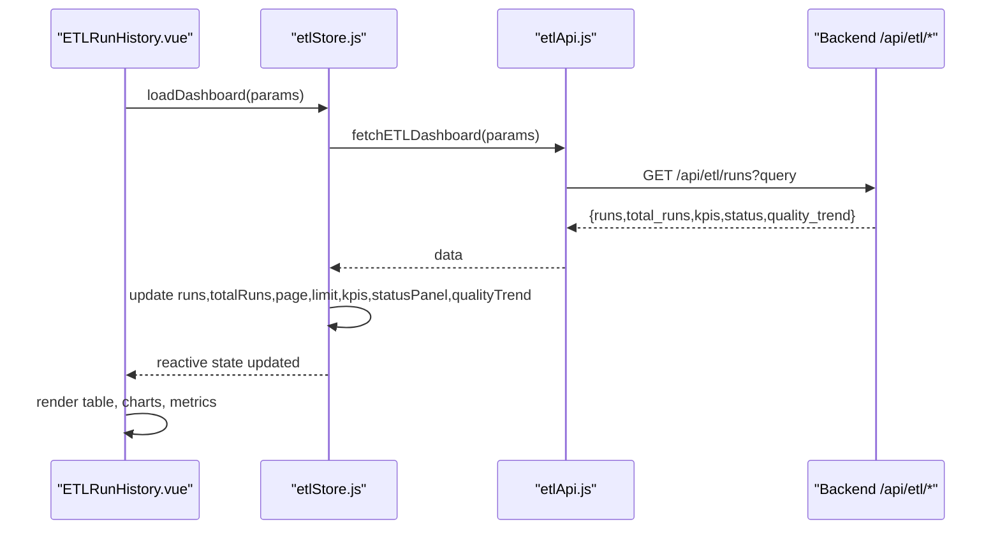
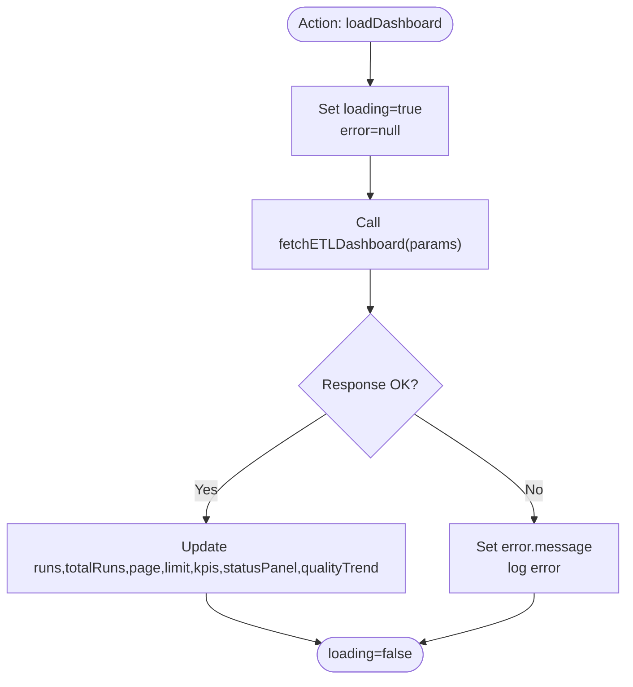
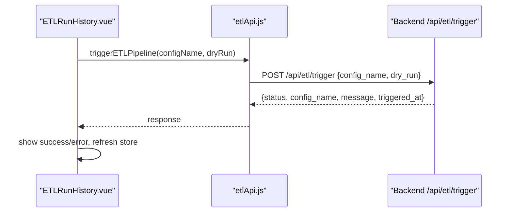
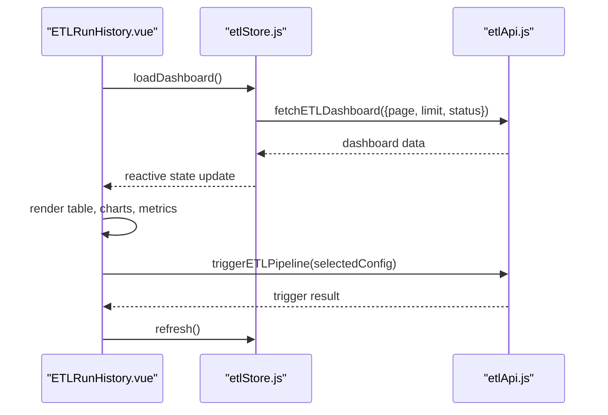
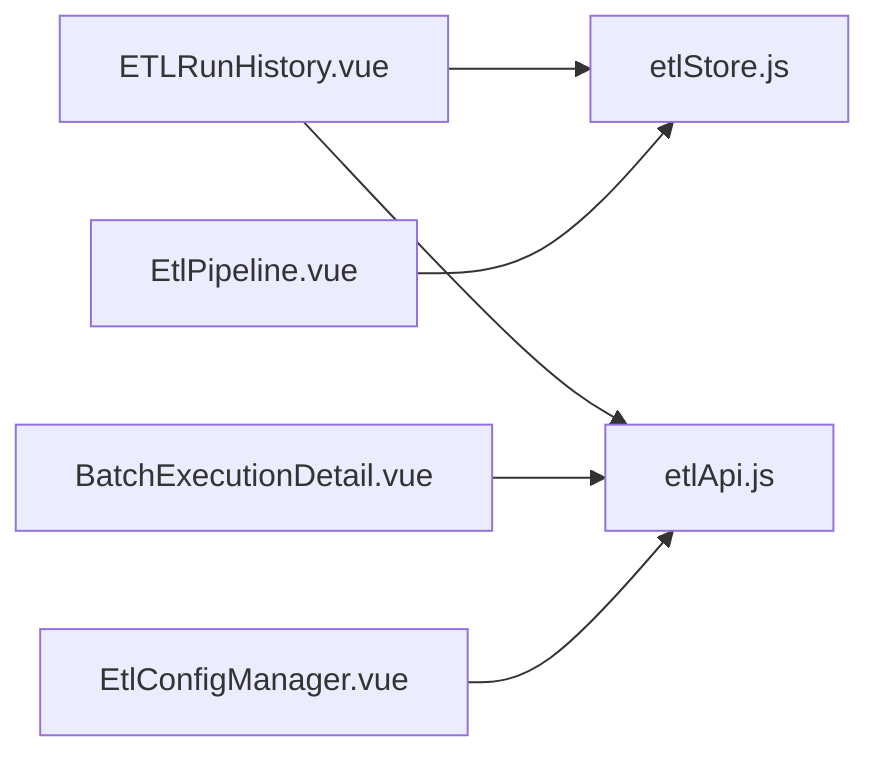

# ETL Pipeline Store (etlStore.js)

<cite>
**Referenced Files in This Document**
- [etlStore.js](file://src/stores/etlStore.js)
- [etlApi.js](file://src/services/etlApi.js)
- [EtlPipeline.vue](file://src/views/Modules/datapipeline/EtlPipeline.vue)
- [ETLRunHistory.vue](file://src/views/Modules/datapipeline/ETLRunHistory.vue)
- [BatchExecutionDetail.vue](file://src/views/Modules/datapipeline/BatchExecutionDetail.vue)
- [EtlConfigManager.vue](file://src/views/Modules/datapipeline/EtlConfigManager.vue)
</cite>

## Table of Contents
1. Introduction
2. Project Structure
3. Core Components
4. Architecture Overview
5. Detailed Component Analysis
6. Dependency Analysis
7. Performance Considerations
8. Troubleshooting Guide
9. Conclusion

## Introduction
This document explains the ETL pipeline store that manages data pipeline configurations, batch execution states, and run history. It covers how the store handles pipeline definitions, execution monitoring, result tracking, integration with the etlApi.js service for pipeline operations, and relationships with ETL UI components. It also documents lifecycle events, error handling, progress tracking, and state management for concurrent executions and resource allocation.

## Project Structure
The ETL feature is implemented across a Pinia store, an API service, and several Vue components:
- Store: centralizes reactive state for runs, pagination, filters, KPIs, status panel, quality trend, loading, and errors.
- Service: HTTP client functions to fetch dashboard data, run details, configs, and trigger pipelines.
- Views: dashboards and detail pages that consume the store and service to render UI and drive user actions.

```mermaid
graph TB
subgraph "UI"
A["EtlPipeline.vue"]
B["ETLRunHistory.vue"]
C["BatchExecutionDetail.vue"]
D["EtlConfigManager.vue"]
end
subgraph "State"
S["etlStore.js"]
end
subgraph "API"
API["etlApi.js"]
end
A --> S
B --> S
B --> API
C --> API
D --> API
S --> API
```

**Diagram sources**
- [etlStore.js:1-96](file://src/stores/etlStore.js#L1-L96)
- [etlApi.js:1-115](file://src/services/etlApi.js#L1-L115)
- [EtlPipeline.vue:217-288](file://src/views/Modules/datapipeline/EtlPipeline.vue#L217-L288)
- [ETLRunHistory.vue:267-397](file://src/views/Modules/datapipeline/ETLRunHistory.vue#L267-L397)
- [BatchExecutionDetail.vue:1-151](file://src/views/Modules/datapipeline/BatchExecutionDetail.vue#L1-L151)
- [EtlConfigManager.vue:1-148](file://src/views/Modules/datapipeline/EtlConfigManager.vue#L1-L148)

**Section sources**
- [etlStore.js:1-96](file://src/stores/etlStore.js#L1-L96)
- [etlApi.js:1-115](file://src/services/etlApi.js#L1-L115)
- [EtlPipeline.vue:217-288](file://src/views/Modules/datapipeline/EtlPipeline.vue#L217-L288)
- [ETLRunHistory.vue:267-397](file://src/views/Modules/datapipeline/ETLRunHistory.vue#L267-L397)
- [BatchExecutionDetail.vue:1-151](file://src/views/Modules/datapipeline/BatchExecutionDetail.vue#L1-L151)
- [EtlConfigManager.vue:1-148](file://src/views/Modules/datapipeline/EtlConfigManager.vue#L1-L148)

## Core Components
- ETL Store (Pinia): Holds reactive state for runs, totalRuns, page, limit, statusFilter, kpis, statusPanel, qualityTrend, loading, error. Provides actions to load dashboard data, paginate, filter by status, and refresh.
- ETL API Service: Encapsulates HTTP calls to backend endpoints for dashboard, run details, config listing, and triggering pipelines. Includes request sanitization, headers, and response handling.
- UI Components:
  - EtlPipeline.vue: Displays system health cards, quality trend chart, and execution history table using store state.
  - ETLRunHistory.vue: Full run history view with pagination, filtering, trigger modal, and footer metrics derived from store.
  - BatchExecutionDetail.vue: Loads detailed run info via API and renders timeline, logs, audit trail, and rejection analysis.
  - EtlConfigManager.vue: Manages local configuration list and editor; integrates with API for listing and triggering pipelines.

Key responsibilities:
- Data fetching and normalization into store state.
- Pagination and filtering driven by UI interactions.
- Error and loading state propagation to UI.
- Triggering pipeline runs and refreshing results.

**Section sources**
- [etlStore.js:12-95](file://src/stores/etlStore.js#L12-L95)
- [etlApi.js:10-115](file://src/services/etlApi.js#L10-L115)
- [EtlPipeline.vue:217-288](file://src/views/Modules/datapipeline/EtlPipeline.vue#L217-L288)
- [ETLRunHistory.vue:267-397](file://src/views/Modules/datapipeline/ETLRunHistory.vue#L267-L397)
- [BatchExecutionDetail.vue:1-151](file://src/views/Modules/datapipeline/BatchExecutionDetail.vue#L1-L151)
- [EtlConfigManager.vue:1-148](file://src/views/Modules/datapipeline/EtlConfigManager.vue#L1-L148)

## Architecture Overview
The architecture follows a clear separation of concerns:
- UI components react to store state changes and dispatch actions.
- The store coordinates data fetching via the API service and updates reactive state.
- The API service handles HTTP requests, authentication headers, parameter sanitization, and error mapping.



**Diagram sources**
- [ETLRunHistory.vue:394-397](file://src/views/Modules/datapipeline/ETLRunHistory.vue#L394-L397)
- [etlStore.js:33-57](file://src/stores/etlStore.js#L33-L57)
- [etlApi.js:68-75](file://src/services/etlApi.js#L68-L75)

**Section sources**
- [etlStore.js:33-57](file://src/stores/etlStore.js#L33-L57)
- [etlApi.js:68-75](file://src/services/etlApi.js#L68-L75)
- [ETLRunHistory.vue:394-397](file://src/views/Modules/datapipeline/ETLRunHistory.vue#L394-L397)

## Detailed Component Analysis

### ETL Store (etlStore.js)
Responsibilities:
- State:
  - runs: array of pipeline runs
  - totalRuns: total count for pagination
  - page, limit: pagination controls
  - statusFilter: optional status filter
  - kpis: aggregated metrics
  - statusPanel: current system status snapshot
  - qualityTrend: time series of quality scores
  - loading, error: UI state flags
- Computed:
  - totalPages: derived from totalRuns and limit
  - isEmpty: convenience flag for empty datasets while not loading
- Actions:
  - loadDashboard(params): fetches dashboard data, normalizes fields, sets loading/error flags
  - setPage(p): updates page and reloads dashboard
  - setStatusFilter(status): resets page to 1 and reloads with filter
  - refresh(): triggers re-fetch

Error handling:
- Catches network or server errors, sets error message, logs to console, ensures loading is reset.

Concurrency considerations:
- Single source of truth for dashboard state; multiple components can call refresh concurrently without conflicts because the store serializes async updates per action invocation.

Performance characteristics:
- Pagination handled on the backend; store only holds current page’s runs.
- Minimal recomputation via computed properties.

Integration points:
- Consumes fetchETLDashboard from etlApi.js.
- Used by EtlPipeline.vue and ETLRunHistory.vue to display dashboard and run history.



**Diagram sources**
- [etlStore.js:33-57](file://src/stores/etlStore.js#L33-L57)

**Section sources**
- [etlStore.js:12-95](file://src/stores/etlStore.js#L12-L95)

### ETL API Service (etlApi.js)
Endpoints and capabilities:
- GET /api/etl/runs: Dashboard data including runs, totals, KPIs, status panel, quality trend.
- GET /api/etl/runs/{runId}: Run detail for BatchExecutionDetail.vue.
- GET /api/etl/configs: List extraction specs for trigger modal.
- POST /api/etl/trigger: Trigger a pipeline run with config name and optional dry run.

Request handling:
- _headers(): attaches Authorization header using token from localStorage.
- _sanitizeParams(): removes undefined/null/empty string parameters before building query strings.
- _handleRes(): parses JSON responses, maps non-ok responses to Error objects with status and data payload.

Usage patterns:
- UI components call these functions directly for specific tasks (e.g., trigger modal).
- Store uses fetchETLDashboard for dashboard data.



**Diagram sources**
- [ETLRunHistory.vue:375-391](file://src/views/Modules/datapipeline/ETLRunHistory.vue#L375-L391)
- [etlApi.js:107-114](file://src/services/etlApi.js#L107-L114)

**Section sources**
- [etlApi.js:10-115](file://src/services/etlApi.js#L10-L115)

### ETL Run History View (ETLRunHistory.vue)
Features:
- Loads dashboard via store on mount.
- Displays system health cards, quality trend chart, execution history table, and footer metrics.
- Provides pagination controls bound to store.page and store.totalPages.
- Offers a trigger modal to select and run a pipeline configuration.

Lifecycle and state:
- onMounted triggers store.loadDashboard().
- Uses computed properties to derive UI-friendly structures from store state.
- Handles trigger modal loading, selection, confirmation, success/error banners, and auto-refresh after trigger.

Progress tracking:
- Loading skeletons during initial load and modal operations.
- Status indicators for running/completed/failed runs.

Error handling:
- Shows error messages in banner when trigger fails.
- Retries available via modal retry button.

Concurrency and resource allocation:
- Pagination reduces memory footprint by loading one page at a time.
- Trigger modal prevents duplicate submissions via disabled states and spinner.



**Diagram sources**
- [ETLRunHistory.vue:394-397](file://src/views/Modules/datapipeline/ETLRunHistory.vue#L394-L397)
- [ETLRunHistory.vue:375-391](file://src/views/Modules/datapipeline/ETLRunHistory.vue#L375-L391)
- [etlStore.js:33-57](file://src/stores/etlStore.js#L33-L57)
- [etlApi.js:68-75](file://src/services/etlApi.js#L68-L75)

**Section sources**
- [ETLRunHistory.vue:267-397](file://src/views/Modules/datapipeline/ETLRunHistory.vue#L267-L397)

### ETL Pipeline Health View (EtlPipeline.vue)
Features:
- Displays system health cards (PostgreSQL, Redis, API Gateway), quality score trend chart, and execution history table.
- Reads store.kpis, store.statusPanel, store.qualityTrend, and store.runs to compute derived values.

Lifecycle:
- onMounted calls store.loadDashboard() to populate data.

Progress and error handling:
- Uses LoadingSkeleton while loading.
- Computes quality classes and status classes for visual feedback.

**Section sources**
- [EtlPipeline.vue:217-288](file://src/views/Modules/datapipeline/EtlPipeline.vue#L217-L288)

### Batch Execution Detail View (BatchExecutionDetail.vue)
Features:
- Fetches run detail via fetchETLRunDetail(runId).
- Renders execution timeline, logs, audit trail, and rejection analysis.
- Derives logs and audit entries from run metadata.

Lifecycle:
- onMounted loads detail data and updates timeline statuses based on run outcome.

Error handling:
- Sets error state and provides back navigation if fetch fails.

**Section sources**
- [BatchExecutionDetail.vue:1-151](file://src/views/Modules/datapipeline/BatchExecutionDetail.vue#L1-L151)

### ETL Config Manager (EtlConfigManager.vue)
Features:
- Local editor and list for YAML extraction specs.
- Tabbed interface between configurations and run history placeholder.
- Integrates with API for listing configs and triggering runs via ETLRunHistory.vue.

Note:
- Configuration editing is currently local; persistence and sync are not shown here.

**Section sources**
- [EtlConfigManager.vue:1-148](file://src/views/Modules/datapipeline/EtlConfigManager.vue#L1-L148)

## Dependency Analysis
Component-to-store/service relationships:
- ETLRunHistory.vue depends on etlStore.js for dashboard state and on etlApi.js for trigger operations.
- EtlPipeline.vue depends on etlStore.js for dashboard state.
- BatchExecutionDetail.vue depends on etlApi.js for run detail.
- EtlConfigManager.vue interacts with etlApi.js indirectly through other views for trigger flows.



**Diagram sources**
- [ETLRunHistory.vue:267-397](file://src/views/Modules/datapipeline/ETLRunHistory.vue#L267-L397)
- [EtlPipeline.vue:217-288](file://src/views/Modules/datapipeline/EtlPipeline.vue#L217-L288)
- [BatchExecutionDetail.vue:1-151](file://src/views/Modules/datapipeline/BatchExecutionDetail.vue#L1-L151)
- [EtlConfigManager.vue:1-148](file://src/views/Modules/datapipeline/EtlConfigManager.vue#L1-L148)
- [etlStore.js:12-95](file://src/stores/etlStore.js#L12-L95)
- [etlApi.js:10-115](file://src/services/etlApi.js#L10-L115)

**Section sources**
- [ETLRunHistory.vue:267-397](file://src/views/Modules/datapipeline/ETLRunHistory.vue#L267-L397)
- [EtlPipeline.vue:217-288](file://src/views/Modules/datapipeline/EtlPipeline.vue#L217-L288)
- [BatchExecutionDetail.vue:1-151](file://src/views/Modules/datapipeline/BatchExecutionDetail.vue#L1-L151)
- [EtlConfigManager.vue:1-148](file://src/views/Modules/datapipeline/EtlConfigManager.vue#L1-L148)
- [etlStore.js:12-95](file://src/stores/etlStore.js#L12-L95)
- [etlApi.js:10-115](file://src/services/etlApi.js#L10-L115)

## Performance Considerations
- Pagination: The store uses page and limit to fetch only the current page’s runs, reducing memory usage and improving rendering performance.
- Reactive updates: Computed properties minimize unnecessary recalculations for derived UI values like quality trends and status classes.
- Request optimization: Parameter sanitization avoids sending invalid queries, reducing server-side processing overhead.
- Concurrency: Multiple components can call refresh concurrently; the store’s single source of truth prevents inconsistent state, though excessive rapid refreshes may cause redundant network calls. Debouncing could be considered if needed.

[No sources needed since this section provides general guidance]

## Troubleshooting Guide
Common issues and resolutions:
- Network or server errors:
  - The API service maps non-ok responses to Error objects with status and data. The store catches these errors, sets an error message, and logs details. Check browser console and network tab for status codes and payloads.
- Empty or missing data:
  - If runs are empty, verify backend availability and ensure correct pagination parameters. Use setStatusFilter to narrow results.
- Trigger failures:
  - The trigger modal shows error banners when API returns failure. Retry by reopening the modal or checking configuration validity.
- Stale data:
  - After triggering a pipeline, call store.refresh() to update the dashboard and run history.

Error handling locations:
- Store loadDashboard error path.
- API _handleRes error mapping.
- UI error banners and retry buttons.

**Section sources**
- [etlStore.js:51-56](file://src/stores/etlStore.js#L51-L56)
- [etlApi.js:18-38](file://src/services/etlApi.js#L18-L38)
- [ETLRunHistory.vue:375-391](file://src/views/Modules/datapipeline/ETLRunHistory.vue#L375-L391)

## Conclusion
The ETL pipeline store provides a robust, reactive foundation for managing pipeline run history, dashboard metrics, and execution monitoring. It integrates cleanly with the etlApi.js service and supports key UI workflows such as pagination, filtering, triggering runs, and viewing detailed run information. Its design emphasizes clarity, maintainability, and scalability, making it suitable for evolving pipeline operations and richer observability features.

[No sources needed since this section summarizes without analyzing specific files]