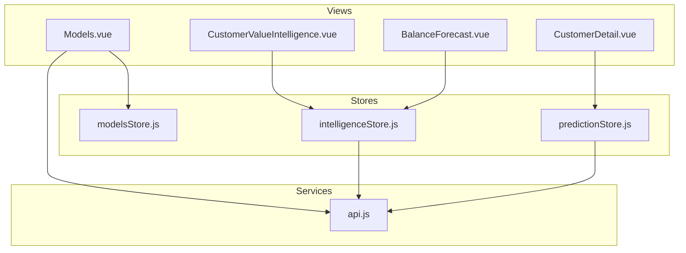
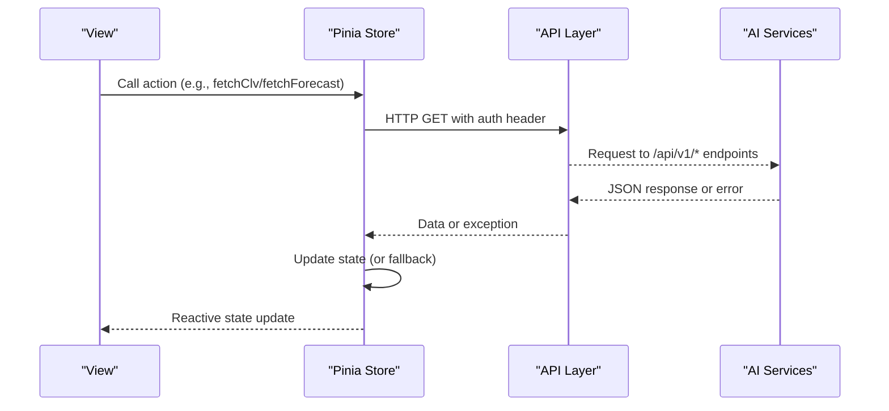
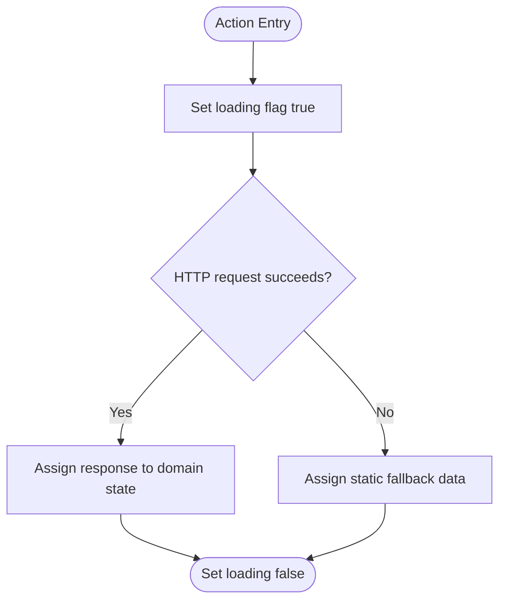
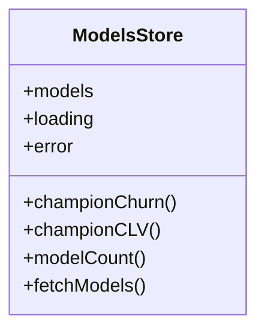
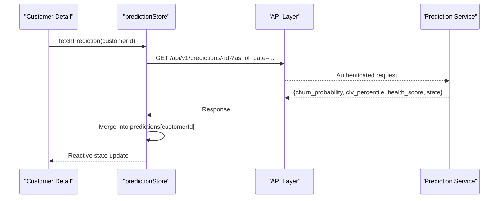
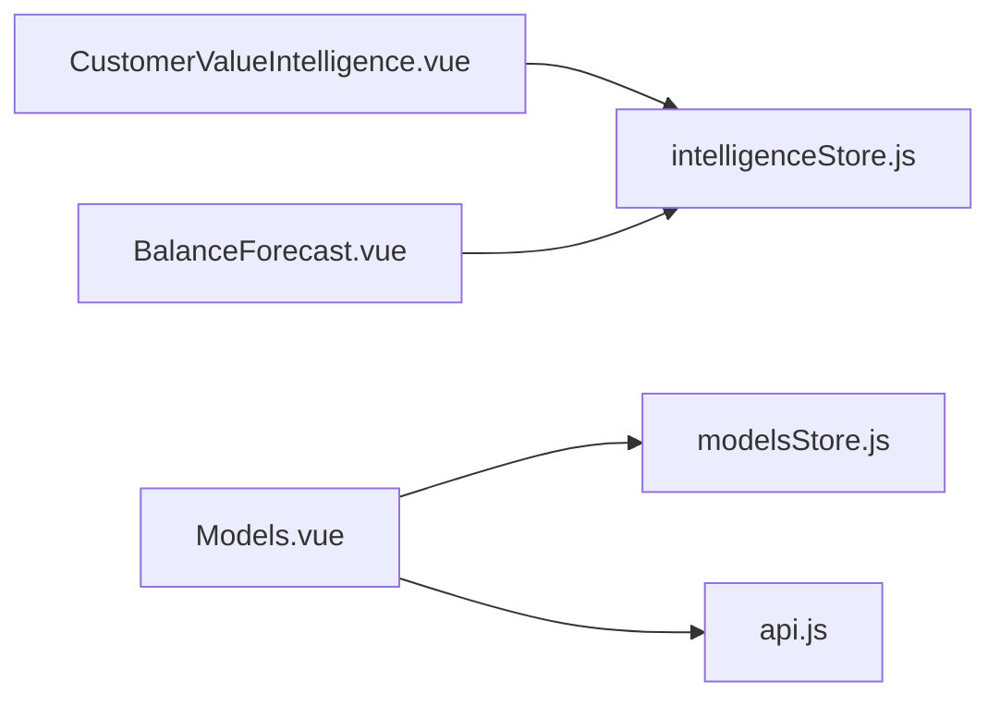
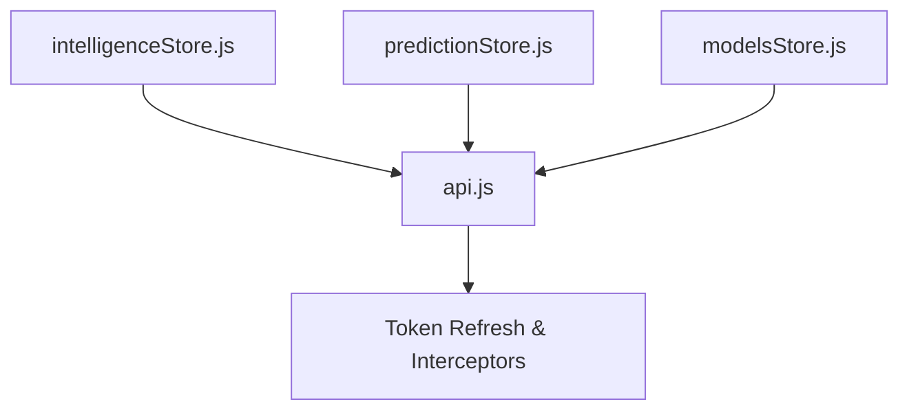

# Intelligence Store (intelligenceStore.js)

<cite>
**Referenced Files in This Document**
- [intelligenceStore.js](file://src/stores/intelligenceStore.js)
- [modelsStore.js](file://src/stores/modelsStore.js)
- [predictionStore.js](file://src/stores/predictionStore.js)
- [api.js](file://src/services/api.js)
- [Models.vue](file://src/views/Modules/aiagents/Models.vue)
- [CustomerValueIntelligence.vue](file://src/views/Modules/intelligence/CustomerValueIntelligence.vue)
- [BalanceForecast.vue](file://src/views/Modules/intelligence/BalanceForecast.vue)
- [CustomerDetail.vue](file://src/views/CustomerDetail.vue)
</cite>

## Table of Contents
1. [Introduction](#introduction)
2. [Project Structure](#project-structure)
3. [Core Components](#core-components)
4. [Architecture Overview](#architecture-overview)
5. [Detailed Component Analysis](#detailed-component-analysis)
6. [Dependency Analysis](#dependency-analysis)
7. [Performance Considerations](#performance-considerations)
8. [Troubleshooting Guide](#troubleshooting-guide)
9. [Conclusion](#conclusion)
10. [Appendices](#appendices)

## Introduction
This document explains the intelligence store and its role in managing AI/ML model state, predictions, and analytics data across the application. It details how the store coordinates with modelsStore.js for model definitions and predictionStore.js for ML inference results, and how it integrates with backend AI services for training, evaluation, and deployment workflows. It also covers examples of model versioning, prediction caching, real-time analytics updates, and state management for performance metrics and feature importance tracking.

## Project Structure
The intelligence layer is implemented as a set of Pinia stores and Vue views:
- Stores:
  - intelligenceStore.js: Centralized analytics and forecasting state with fallbacks when APIs are unavailable.
  - modelsStore.js: Model registry and champion selection for churn and CLV models.
  - predictionStore.js: Inference results per customer, including churn probability, health scores, Markov matrix, and churn drivers.
- Services:
  - api.js: Axios configuration, base URL resolution, token injection, and token refresh handling.
- Views:
  - Models.vue: Model monitoring, drift, governance, and live prediction logs.
  - CustomerValueIntelligence.vue: CLV distribution, segments, priority matrix, and top customers.
  - BalanceForecast.vue: AUM forecasts by scenario, segment breakdown, sensitivity analysis, and confidence intervals.
  - CustomerDetail.vue: Per-customer model version and feature usage insights.

**Diagram sources**
- [intelligenceStore.js:234-295](file://src/stores/intelligenceStore.js#L234-L295)
- [modelsStore.js:15-53](file://src/stores/modelsStore.js#L15-L53)
- [predictionStore.js:17-170](file://src/stores/predictionStore.js#L17-L170)
- [api.js:64-146](file://src/services/api.js#L64-L146)
- [Models.vue:623-861](file://src/views/Modules/aiagents/Models.vue#L623-L861)
- [CustomerValueIntelligence.vue:553-697](file://src/views/Modules/intelligence/CustomerValueIntelligence.vue#L553-L697)
- [BalanceForecast.vue:298-399](file://src/views/Modules/intelligence/BalanceForecast.vue#L298-L399)
- [CustomerDetail.vue:612-640](file://src/views/CustomerDetail.vue#L612-L640)

**Section sources**
- [intelligenceStore.js:234-295](file://src/stores/intelligenceStore.js#L234-L295)
- [modelsStore.js:15-53](file://src/stores/modelsStore.js#L15-L53)
- [predictionStore.js:17-170](file://src/stores/predictionStore.js#L17-L170)
- [api.js:64-146](file://src/services/api.js#L64-L146)
- [Models.vue:623-861](file://src/views/Modules/aiagents/Models.vue#L623-L861)
- [CustomerValueIntelligence.vue:553-697](file://src/views/Modules/intelligence/CustomerValueIntelligence.vue#L553-L697)
- [BalanceForecast.vue:298-399](file://src/views/Modules/intelligence/BalanceForecast.vue#L298-L399)
- [CustomerDetail.vue:612-640](file://src/views/CustomerDetail.vue#L612-L640)

## Core Components
- intelligenceStore.js
  - Manages analytics and forecasting state: CLV summary/bands/top customers, lifecycle stages and transitions, balance forecast scenarios and confidence intervals, outcomes ROI and retention performance.
  - Provides actions to fetch each dataset from backend endpoints; on failure, falls back to static datasets to keep UI responsive.
  - Tracks loading states per domain and error objects for user feedback.
- modelsStore.js
  - Loads model registry from /api/v1/models and exposes computed champion models for churn and CLV.
  - Normalizes model entries into id/type/status/metrics/method and tracks loading/error.
- predictionStore.js
  - Holds per-customer predictions, health scores, Markov transition matrix, and churn drivers.
  - Offers single and batched prediction fetching, convenience getters, and driver retrieval for recommendation engines.

**Section sources**
- [intelligenceStore.js:234-295](file://src/stores/intelligenceStore.js#L234-L295)
- [modelsStore.js:15-53](file://src/stores/modelsStore.js#L15-L53)
- [predictionStore.js:17-170](file://src/stores/predictionStore.js#L17-L170)

## Architecture Overview
The intelligence architecture orchestrates three primary flows:
- Model Registry Flow: The Models view loads model definitions via modelsStore and displays performance, drift, governance, and logs.
- Analytics Flow: Intelligence views consume intelligenceStore to render CLV, lifecycle, forecast, and outcomes dashboards.
- Prediction Flow: Customer-facing features use predictionStore to fetch per-customer churn probabilities, health scores, and Markov matrices, with batch support for lists.

**Diagram sources**
- [intelligenceStore.js:242-288](file://src/stores/intelligenceStore.js#L242-L288)
- [modelsStore.js:31-50](file://src/stores/modelsStore.js#L31-L50)
- [predictionStore.js:27-152](file://src/stores/predictionStore.js#L27-L152)
- [api.js:64-146](file://src/services/api.js#L64-L146)

## Detailed Component Analysis

### intelligenceStore.js
- Responsibilities
  - Fetches CLV, lifecycle, forecast, and outcomes data from dedicated endpoints.
  - Maintains per-domain loading flags and error objects.
  - Provides robust fallbacks when backend is unavailable to ensure UI continuity.
- Key State
  - clvData, lifecycleData, forecastData, outcomesData: reactive refs holding domain-specific analytics.
  - loading: object with booleans per domain.
  - error: object with null or error messages per domain.
- Actions
  - fetchClv: GET /api/v1/customers/clv-summary with as_of_date.
  - fetchLifecycle: GET /api/v1/customers/lifecycle-stages with as_of_date.
  - fetchForecast: GET /api/v1/forecasts/balance with as_of_date.
  - fetchOutcomes: GET /api/v1/outcomes/retention-roi with as_of_date.
- Fallback Strategy
  - Static datasets for CLV bands/top customers, lifecycle distributions/transitions, forecast scenarios/confidence intervals, and outcomes ROI/retention metrics.

**Diagram sources**
- [intelligenceStore.js:242-288](file://src/stores/intelligenceStore.js#L242-L288)

**Section sources**
- [intelligenceStore.js:13-195](file://src/stores/intelligenceStore.js#L13-L195)
- [intelligenceStore.js:234-295](file://src/stores/intelligenceStore.js#L234-L295)

### modelsStore.js
- Responsibilities
  - Loads model registry and normalizes entries.
  - Exposes computed champion models for churn and CLV.
- Key State
  - models: array of normalized model entries.
  - loading, error: standard status tracking.
- Actions
  - fetchModels: GET /api/v1/models; maps backend fields to id/type/status/metrics/method.
- Integration Points
  - Used by Models.vue to display champion model metrics and monitoring tabs.

**Diagram sources**
- [modelsStore.js:15-53](file://src/stores/modelsStore.js#L15-L53)

**Section sources**
- [modelsStore.js:15-53](file://src/stores/modelsStore.js#L15-L53)
- [Models.vue:623-861](file://src/views/Modules/aiagents/Models.vue#L623-L861)

### predictionStore.js
- Responsibilities
  - Manages per-customer predictions, health scores, Markov matrix, and churn drivers.
  - Supports single and batched prediction fetching with controlled concurrency.
- Key State
  - predictions: map of customerId → prediction object.
  - healthScores: map of customerId → health score object.
  - markovMatrix: current transition matrix.
  - churnDrivers: list of top churn drivers for recommendations.
  - loading, error: status tracking.
- Actions
  - fetchChurnProbability, fetchHealthScore, fetchPrediction: per-customer endpoints with as_of_date.
  - fetchMarkovMatrix: GET /api/v1/predictions/markov-matrix.
  - fetchBatchPredictions: batches requests (size 2) using Promise.allSettled to avoid overwhelming backend.
  - fetchChurnDrivers: GET /api/v1/churn-intel/drivers.
  - getChurnProbability, getHealthScore: convenience getters.

**Diagram sources**
- [predictionStore.js:59-79](file://src/stores/predictionStore.js#L59-L79)
- [api.js:64-146](file://src/services/api.js#L64-L146)

**Section sources**
- [predictionStore.js:17-170](file://src/stores/predictionStore.js#L17-L170)
- [CustomerDetail.vue:612-640](file://src/views/CustomerDetail.vue#L612-L640)

### Views Integration Examples
- CustomerValueIntelligence.vue
  - Uses intelligenceStore to load CLV data and renders KPIs, band distributions, and priority matrix.
  - Calls store.fetchClv on mount to populate state.
- BalanceForecast.vue
  - Uses intelligenceStore to load forecast data and renders scenario charts, segment breakdowns, and sensitivity tables.
  - Calls store.fetchForecast on mount and re-renders charts on data changes.
- Models.vue
  - Uses modelsStore to load model registry and displays performance history, feature drift, and prediction logs via direct API calls to monitoring endpoints.

**Diagram sources**
- [CustomerValueIntelligence.vue:553-697](file://src/views/Modules/intelligence/CustomerValueIntelligence.vue#L553-L697)
- [BalanceForecast.vue:298-399](file://src/views/Modules/intelligence/BalanceForecast.vue#L298-L399)
- [Models.vue:623-861](file://src/views/Modules/aiagents/Models.vue#L623-L861)

**Section sources**
- [CustomerValueIntelligence.vue:553-697](file://src/views/Modules/intelligence/CustomerValueIntelligence.vue#L553-L697)
- [BalanceForecast.vue:298-399](file://src/views/Modules/intelligence/BalanceForecast.vue#L298-L399)
- [Models.vue:623-861](file://src/views/Modules/aiagents/Models.vue#L623-L861)

## Dependency Analysis
- Store-to-API Dependencies
  - All stores create an axios instance with baseURL from api.js and inject Authorization headers via interceptors.
  - api.js centralizes token refresh and redirects on 401 responses.
- Cross-Store Relationships
  - intelligenceStore and predictionStore operate independently but serve complementary domains: analytics vs inference.
  - modelsStore provides model metadata used by Models.vue; not directly consumed by other stores.
- External Integrations
  - Backend endpoints include model registry, predictions, monitoring, and analytics endpoints.
  - WebSocket notifications are defined in requirements but not yet implemented in these stores.

**Diagram sources**
- [intelligenceStore.js:1-11](file://src/stores/intelligenceStore.js#L1-L11)
- [predictionStore.js:1-12](file://src/stores/predictionStore.js#L1-L12)
- [modelsStore.js:1-12](file://src/stores/modelsStore.js#L1-L12)
- [api.js:64-146](file://src/services/api.js#L64-L146)

**Section sources**
- [api.js:64-146](file://src/services/api.js#L64-L146)
- [intelligenceStore.js:1-11](file://src/stores/intelligenceStore.js#L1-L11)
- [predictionStore.js:1-12](file://src/stores/predictionStore.js#L1-L12)
- [modelsStore.js:1-12](file://src/stores/modelsStore.js#L1-L12)

## Performance Considerations
- Batch Predictions
  - predictionStore uses Promise.allSettled with a small batch size (2) to avoid overloading the backend while fetching multiple predictions concurrently.
- Fallback Data
  - intelligenceStore provides static fallbacks to maintain UI responsiveness during backend outages.
- Token Refresh
  - api.js handles 401 errors by refreshing tokens and retrying requests, reducing failed requests due to expired sessions.
- Chart Rendering
  - BalanceForecast.vue re-renders charts only when forecast data changes or tab switches occur, minimizing unnecessary redraws.

[No sources needed since this section provides general guidance]

## Troubleshooting Guide
- Authentication Issues
  - If requests fail with 401, api.js attempts to refresh the token; if refresh fails, users are redirected to login.
- Network Errors
  - Stores log warnings and set error state; users can see error messages in console and UI where applicable.
- Missing Data
  - When backend endpoints are unavailable, intelligenceStore falls back to static datasets; verify endpoint availability if dynamic data is required.
- Prediction Caching
  - predictionStore caches predictions per customerId; ensure unique IDs to avoid cross-customer state collisions.

**Section sources**
- [api.js:90-146](file://src/services/api.js#L90-L146)
- [predictionStore.js:27-152](file://src/stores/predictionStore.js#L27-L152)
- [intelligenceStore.js:242-288](file://src/stores/intelligenceStore.js#L242-L288)

## Conclusion
The intelligence store system provides a cohesive framework for managing AI/ML model state, predictions, and analytics data. It coordinates between modelsStore.js for model definitions and predictionStore.js for inference results, integrating with backend AI services through a robust API layer. The design supports model versioning, prediction caching, and real-time analytics updates, with strong fallback strategies and performance optimizations to ensure reliable user experiences.

[No sources needed since this section summarizes without analyzing specific files]

## Appendices

### Model Versioning and Feature Importance Tracking
- Model Versioning
  - CustomerDetail.vue derives model versions from health scores or predictions, enabling traceability of which model produced a given result.
- Feature Importance
  - Models.vue includes feature drift monitoring and alerting based on PSI thresholds, indicating shifts in feature distributions that may affect model performance.

**Section sources**
- [CustomerDetail.vue:612-640](file://src/views/CustomerDetail.vue#L612-L640)
- [Models.vue:623-861](file://src/views/Modules/aiagents/Models.vue#L623-L861)

### Real-Time Analytics Updates
- WebSocket Protocol
  - Requirements define a WebSocket protocol for real-time notifications such as state changes, health drops, and model drift alerts. While not implemented in the current stores, this provides a foundation for future real-time updates.

**Section sources**
- [FRONTEND-REQUIREMENTS-V2.md:428-479](file://docs/FRONTEND-REQUIREMENTS-V2.md#L428-L479)