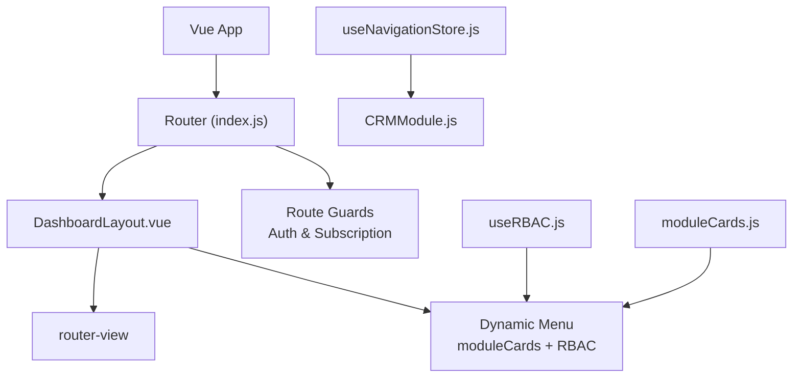
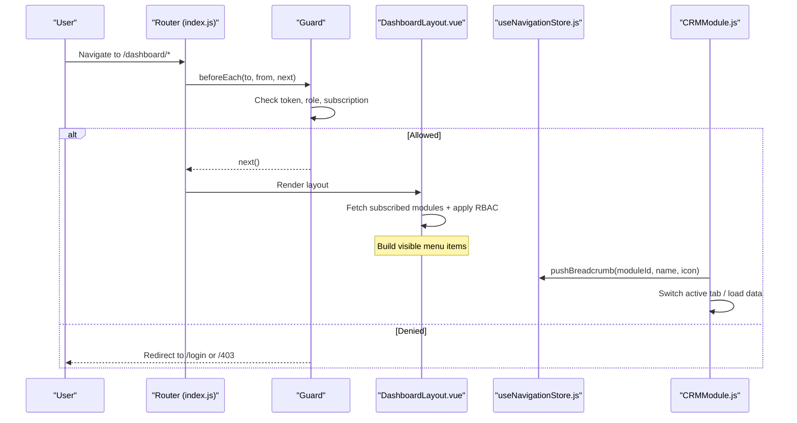
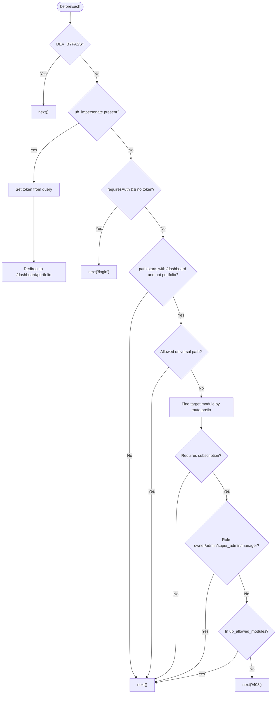
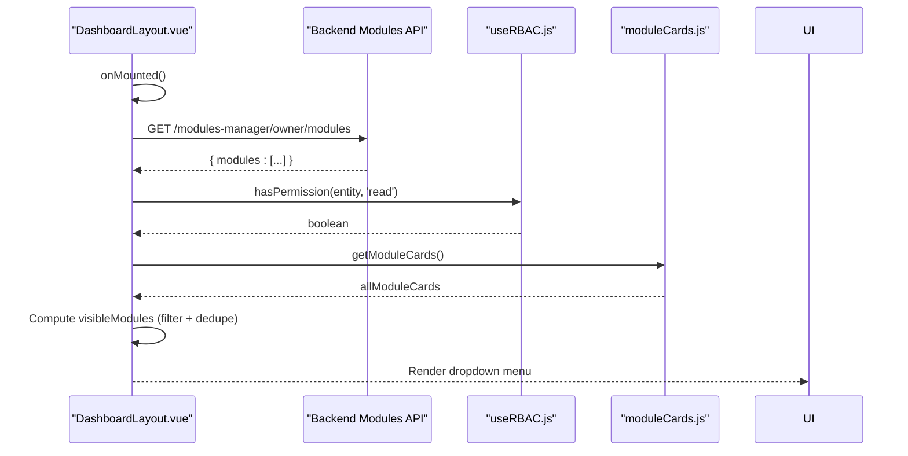
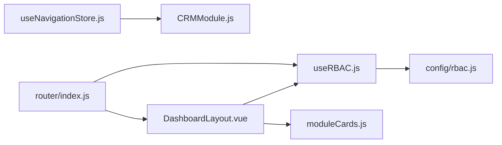

# Navigation Store (useNavigationStore.js)

<cite>
**Referenced Files in This Document**
- [useNavigationStore.js](file://src/stores/useNavigationStore.js)
- [index.js](file://src/router/index.js)
- [DashboardLayout.vue](file://src/components/layouts/DashboardLayout.vue)
- [CRMModule.js](file://src/views/Modules/crm/composables/CRMModule.js)
- [moduleCards.js](file://src/config/moduleCards.js)
- [rbac.js](file://src/config/rbac.js)
- [useRBAC.js](file://src/composables/useRBAC.js)
</cite>

## Table of Contents
1. [Introduction](#introduction)
2. [Project Structure](#project-structure)
3. [Core Components](#core-components)
4. [Architecture Overview](#architecture-overview)
5. [Detailed Component Analysis](#detailed-component-analysis)
6. [Dependency Analysis](#dependency-analysis)
7. [Performance Considerations](#performance-considerations)
8. [Troubleshooting Guide](#troubleshooting-guide)
9. [Conclusion](#conclusion)

## Introduction
This document explains the navigation store and how it participates in application routing state, breadcrumb management, and menu visibility. It covers:
- How route guards enforce authentication and subscription-based access
- How navigation history is managed via breadcrumbs
- How dynamic menus are generated based on user permissions and subscriptions
- Integration with Vue Router for programmatic navigation
- Relationship with DashboardLayout for sidebar/menu rendering
- Permission-based navigation logic and route-level state management

The navigation store provides a minimal Pinia store to track the current module and breadcrumb trail. Route guards centralize auth and subscription checks. The dashboard layout composes RBAC and module configuration to render permission-aware menus.

## Project Structure
Key files involved in navigation and access control:
- Navigation store: src/stores/useNavigationStore.js
- Routing and guards: src/router/index.js
- Layout and dynamic menu: src/components/layouts/DashboardLayout.vue
- CRM usage of navigation store: src/views/Modules/crm/composables/CRMModule.js
- Module definitions and available modules: src/config/moduleCards.js
- RBAC configuration and helpers: src/config/rbac.js, src/composables/useRBAC.js

**Diagram sources**
- [index.js:196-274](file://src/router/index.js#L196-L274)
- [DashboardLayout.vue:99-232](file://src/components/layouts/DashboardLayout.vue#L99-L232)
- [useNavigationStore.js:4-22](file://src/stores/useNavigationStore.js#L4-L22)
- [CRMModule.js:104-278](file://src/views/Modules/crm/composables/CRMModule.js#L104-L278)
- [moduleCards.js:13-50](file://src/config/moduleCards.js#L13-L50)
- [useRBAC.js:55-137](file://src/composables/useRBAC.js#L55-L137)

**Section sources**
- [index.js:196-274](file://src/router/index.js#L196-L274)
- [DashboardLayout.vue:99-232](file://src/components/layouts/DashboardLayout.vue#L99-L232)
- [useNavigationStore.js:4-22](file://src/stores/useNavigationStore.js#L4-L22)
- [CRMModule.js:104-278](file://src/views/Modules/crm/composables/CRMModule.js#L104-L278)
- [moduleCards.js:13-50](file://src/config/moduleCards.js#L13-L50)
- [useRBAC.js:55-137](file://src/composables/useRBAC.js#L55-L137)

## Core Components
- Navigation store (Pinia): Holds current module and breadcrumbs; exposes setters to update them.
- Router and guards: Centralized beforeEach guard enforces authentication and subscription rules for dashboard routes.
- DashboardLayout: Renders header and dynamic menu using module cards and RBAC; fetches subscribed modules and filters by permissions.
- CRMModule: Uses the navigation store to push breadcrumbs and navigate between internal tabs/modules.

**Section sources**
- [useNavigationStore.js:4-22](file://src/stores/useNavigationStore.js#L4-L22)
- [index.js:201-272](file://src/router/index.js#L201-L272)
- [DashboardLayout.vue:169-232](file://src/components/layouts/DashboardLayout.vue#L169-L232)
- [CRMModule.js:262-278](file://src/views/Modules/crm/composables/CRMModule.js#L262-L278)

## Architecture Overview
The navigation flow combines route-level guards, a lightweight navigation store, and a permission-aware layout.

**Diagram sources**
- [index.js:201-272](file://src/router/index.js#L201-L272)
- [DashboardLayout.vue:169-232](file://src/components/layouts/DashboardLayout.vue#L169-L232)
- [CRMModule.js:262-278](file://src/views/Modules/crm/composables/CRMModule.js#L262-L278)

## Detailed Component Analysis

### Navigation Store (useNavigationStore.js)
Responsibilities:
- Track current module context
- Maintain breadcrumb trail for intra-module navigation
- Provide simple setters to update state

State:
- currentModule: ref(null)
- breadcrumbs: ref([])

Actions:
- setCurrentModule(module)
- setBreadcrumbs(crumbs)

Notes:
- CRMModule references additional methods (pushBreadcrumb, goBack) that are not present in the current store implementation. These would need to be added to support full breadcrumb push/pop semantics within the CRM module.

**Section sources**
- [useNavigationStore.js:4-22](file://src/stores/useNavigationStore.js#L4-L22)
- [CRMModule.js:104-278](file://src/views/Modules/crm/composables/CRMModule.js#L104-L278)

### Router and Route Guards (index.js)
Responsibilities:
- Define routes under /dashboard and other public/auth routes
- Enforce authentication via token presence
- Enforce subscription and module access for non-public dashboard paths
- Handle admin impersonation token from URL query param

Key behaviors:
- Public routes bypass auth checks
- Dashboard routes require token; certain subpaths are allowed universally (profile/settings/subaccounts/portfolio)
- For paid modules, the guard consults local storage for allowed modules when roles do not grant implicit access
- Unauthorized attempts redirect to /login or /403

**Diagram sources**
- [index.js:201-272](file://src/router/index.js#L201-L272)

**Section sources**
- [index.js:34-194](file://src/router/index.js#L34-L194)
- [index.js:201-272](file://src/router/index.js#L201-L272)

### DashboardLayout and Dynamic Menu
Responsibilities:
- Render header and dynamic menu
- Fetch subscribed modules from backend
- Filter menu items based on:
  - Admin-only pages exclusion
  - Primary nav exclusions
  - Free essentials always shown
  - Subscription list and RBAC permissions

Integration points:
- Uses decodeJWT for user info
- Uses useRBAC for permission checks
- Uses getModuleCards for module metadata and routes

**Diagram sources**
- [DashboardLayout.vue:169-232](file://src/components/layouts/DashboardLayout.vue#L169-L232)
- [moduleCards.js:13-50](file://src/config/moduleCards.js#L13-L50)
- [useRBAC.js:55-137](file://src/composables/useRBAC.js#L55-L137)

**Section sources**
- [DashboardLayout.vue:99-232](file://src/components/layouts/DashboardLayout.vue#L99-L232)
- [moduleCards.js:13-50](file://src/config/moduleCards.js#L13-L50)
- [useRBAC.js:55-137](file://src/composables/useRBAC.js#L55-L137)

### CRMModule Usage of Navigation Store
Responsibilities:
- Manage internal CRM navigation across tabs/modules
- Push breadcrumbs when switching modules
- Support back navigation to previous breadcrumb

Current integration:
- Imports useNavigationStore
- Calls pushBreadcrumb and goBack (methods not yet implemented in the store)
- Updates activeTab and loads module data accordingly

Recommendation:
- Implement pushBreadcrumb and goBack in the navigation store to fully support CRM’s breadcrumb workflow.

**Section sources**
- [CRMModule.js:104-278](file://src/views/Modules/crm/composables/CRMModule.js#L104-L278)

## Dependency Analysis
- Navigation store depends on Pinia and Vue reactivity
- Router depends on JWT decoding and dev flags
- DashboardLayout depends on RBAC, module cards, and JWT decoding
- CRMModule depends on navigation store and CRM APIs

**Diagram sources**
- [useNavigationStore.js:4-22](file://src/stores/useNavigationStore.js#L4-L22)
- [CRMModule.js:104-278](file://src/views/Modules/crm/composables/CRMModule.js#L104-L278)
- [index.js:201-272](file://src/router/index.js#L201-L272)
- [DashboardLayout.vue:169-232](file://src/components/layouts/DashboardLayout.vue#L169-L232)
- [useRBAC.js:55-137](file://src/composables/useRBAC.js#L55-L137)
- [moduleCards.js:13-50](file://src/config/moduleCards.js#L13-L50)
- [rbac.js:658-671](file://src/config/rbac.js#L658-L671)

**Section sources**
- [useNavigationStore.js:4-22](file://src/stores/useNavigationStore.js#L4-L22)
- [index.js:201-272](file://src/router/index.js#L201-L272)
- [DashboardLayout.vue:169-232](file://src/components/layouts/DashboardLayout.vue#L169-L232)
- [CRMModule.js:104-278](file://src/views/Modules/crm/composables/CRMModule.js#L104-L278)
- [rbac.js:658-671](file://src/config/rbac.js#L658-L671)

## Performance Considerations
- Route guards run on every navigation; keep checks minimal and rely on cached tokens and local storage where appropriate
- DashboardLayout fetches subscribed modules once per mount; consider caching results if frequently revisited
- Avoid heavy computations in computed properties for menu filtering; ensure arrays are small and memoized
- Debounce or throttle any search/filter operations in layouts or modules

[No sources needed since this section provides general guidance]

## Troubleshooting Guide
Common issues and resolutions:
- Navigation store methods missing: CRMModule calls pushBreadcrumb/goBack which are not implemented in the current store. Add these methods to support breadcrumb push/pop.
- Unauthorized redirects: Ensure token exists and roles/permissions align with module requirements; check ub_allowed_modules and subscription cache
- Menu not showing expected modules: Verify subscribed modules response and RBAC permissions; confirm free essentials and primary nav exclusions are correct
- Development bypass: DEV_BYPASS can mask permission issues; disable in production to validate real behavior

**Section sources**
- [CRMModule.js:262-278](file://src/views/Modules/crm/composables/CRMModule.js#L262-L278)
- [index.js:201-272](file://src/router/index.js#L201-L272)
- [DashboardLayout.vue:169-232](file://src/components/layouts/DashboardLayout.vue#L169-L232)

## Conclusion
The navigation system combines a lightweight navigation store, centralized route guards, and a permission-aware dashboard layout to manage routing state, breadcrumbs, and dynamic menus. While the navigation store currently exposes basic state and setters, extending it with pushBreadcrumb and goBack will enable robust intra-module navigation. Route guards enforce authentication and subscription policies, while DashboardLayout renders menus based on module configurations and RBAC permissions. Together, these components provide a cohesive navigation experience aligned with user permissions and application context.

[No sources needed since this section summarizes without analyzing specific files]