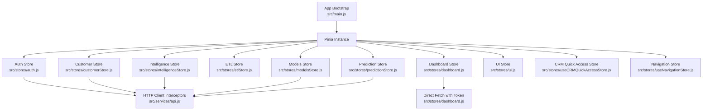
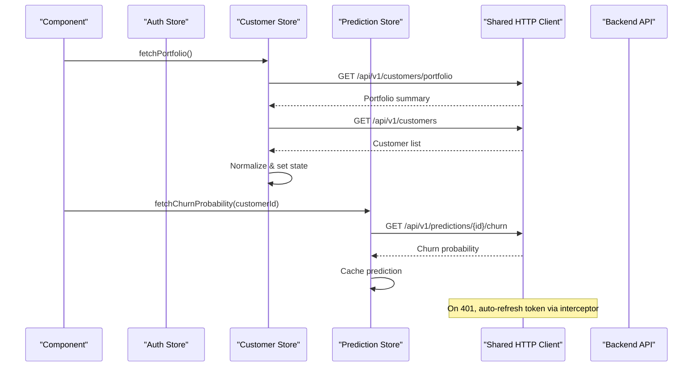
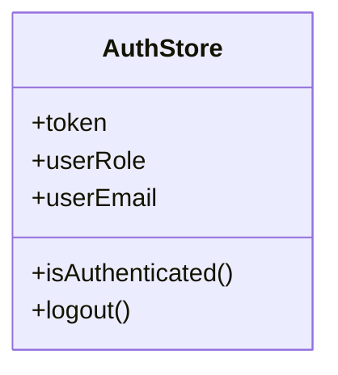
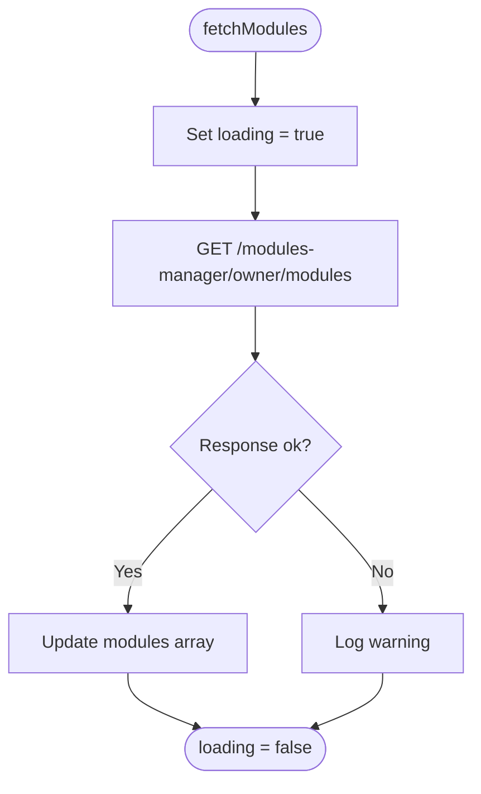
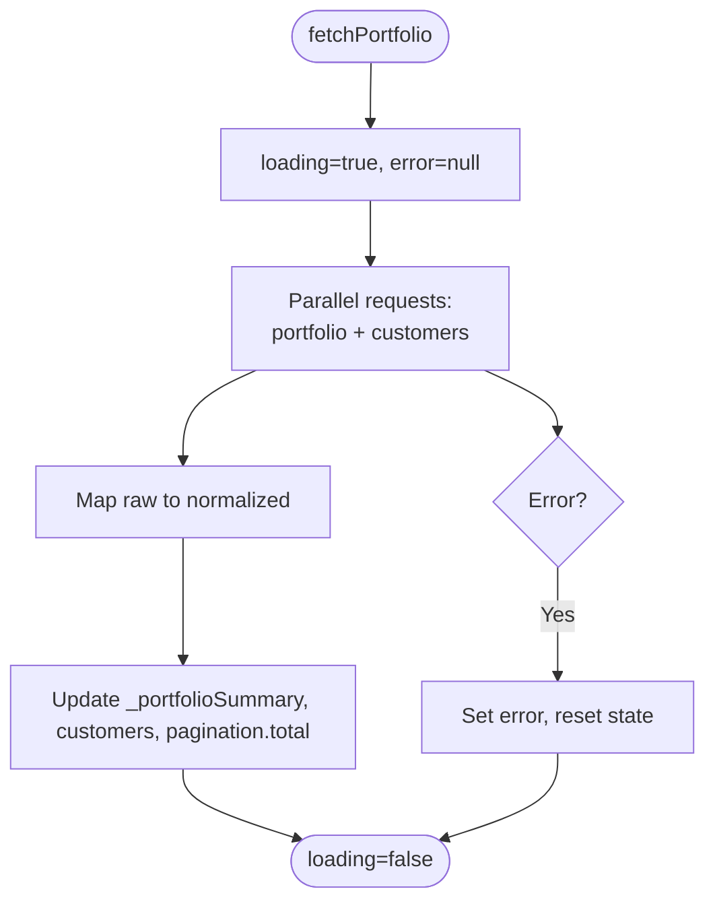
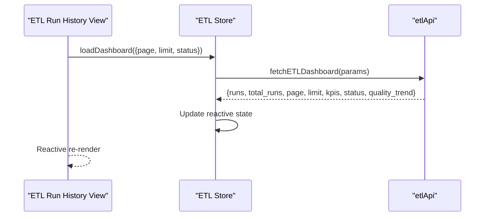
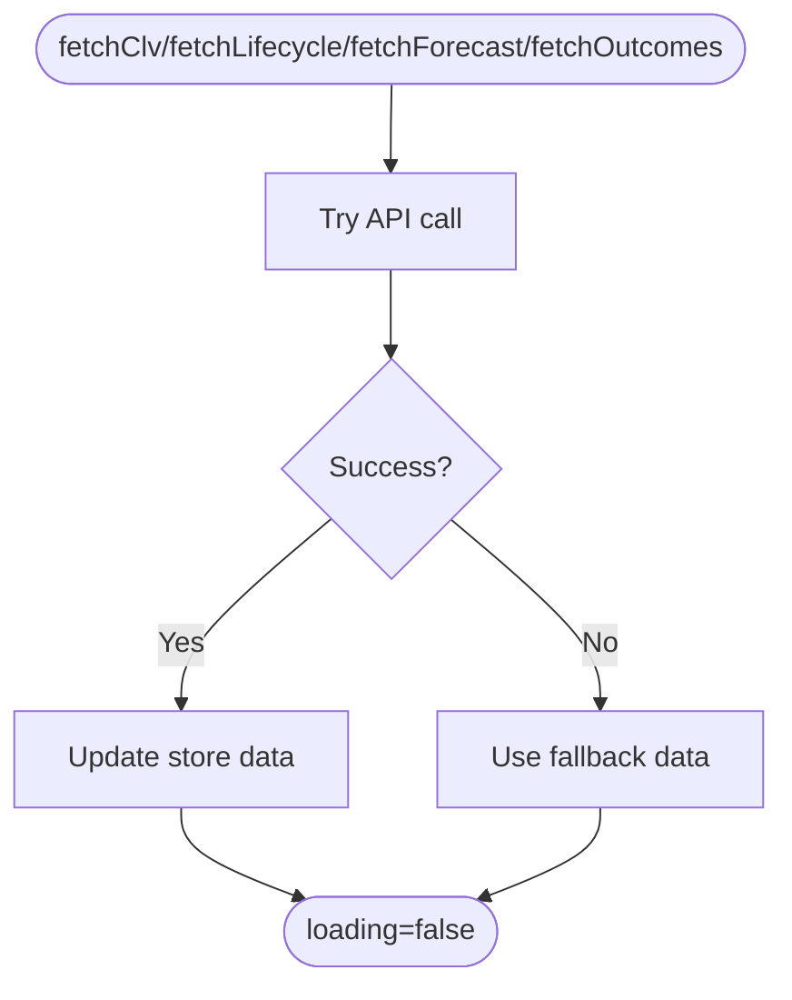
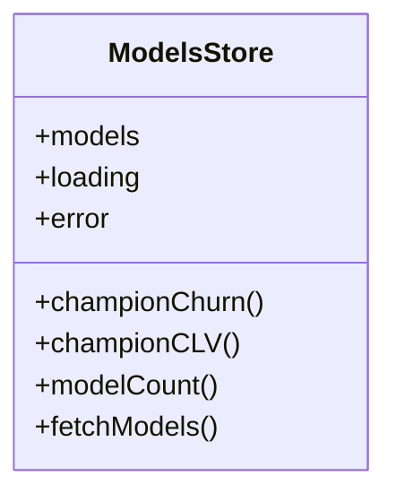
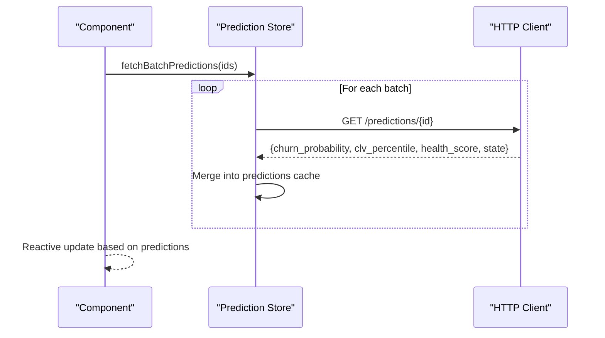
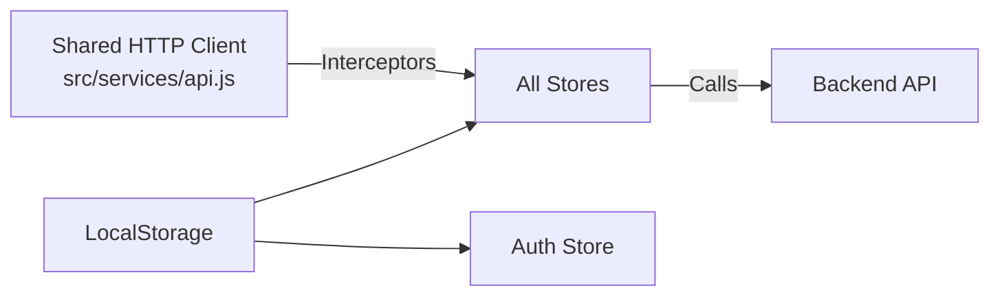

# Pinia Store Architecture

<cite>
**Referenced Files in This Document**
- [main.js](file://src/main.js)
- [api.js](file://src/services/api.js)
- [auth.js](file://src/stores/auth.js)
- [dashboard.js](file://src/stores/dashboard.js)
- [customerStore.js](file://src/stores/customerStore.js)
- [etlStore.js](file://src/stores/etlStore.js)
- [intelligenceStore.js](file://src/stores/intelligenceStore.js)
- [modelsStore.js](file://src/stores/modelsStore.js)
- [predictionStore.js](file://src/stores/predictionStore.js)
- [ui.js](file://src/stores/ui.js)
- [useCRMQuickAccessStore.js](file://src/stores/useCRMQuickAccessStore.js)
- [useNavigationStore.js](file://src/stores/useNavigationStore.js)
</cite>

## Table of Contents
1. [Introduction](#introduction)
2. [Project Structure](#project-structure)
3. [Core Components](#core-components)
4. [Architecture Overview](#architecture-overview)
5. [Detailed Component Analysis](#detailed-component-analysis)
6. [Dependency Analysis](#dependency-analysis)
7. [Performance Considerations](#performance-considerations)
8. [Troubleshooting Guide](#troubleshooting-guide)
9. [Conclusion](#conclusion)

## Introduction
This document explains the Pinia store architecture used in ABSA Foundry Frontend. It covers modern reactive state management patterns across all stores, including authentication, dashboard metrics, CRM data, ETL pipeline state, AI/ML model state, model definitions, ML predictions, global UI state, CRM shortcuts, and navigation state. It also documents store composition patterns, state normalization strategies, data flow between stores, initialization, dependency injection, cross-store communication, and examples of reactive updates, computed properties, and actions that modify shared state.

## Project Structure
The application initializes a single Pinia instance at app bootstrap and mounts it globally so any component or store can access shared reactive state. Stores are organized by feature area under src/stores and use either Options API style (defineStore with options object) or Composition API style (defineStore with a function returning refs). HTTP clients are configured per store or via a shared service module to attach authentication headers and handle token refresh.

**Diagram sources**
- [main.js:70-75](file://src/main.js#L70-L75)
- [auth.js:1-22](file://src/stores/auth.js#L1-L22)
- [dashboard.js:1-29](file://src/stores/dashboard.js#L1-L29)
- [customerStore.js:1-187](file://src/stores/customerStore.js#L1-L187)
- [etlStore.js:1-96](file://src/stores/etlStore.js#L1-L96)
- [intelligenceStore.js:1-296](file://src/stores/intelligenceStore.js#L1-L296)
- [modelsStore.js:1-54](file://src/stores/modelsStore.js#L1-L54)
- [predictionStore.js:1-171](file://src/stores/predictionStore.js#L1-L171)
- [ui.js:1-22](file://src/stores/ui.js#L1-L22)
- [useCRMQuickAccessStore.js:1-29](file://src/stores/useCRMQuickAccessStore.js#L1-L29)
- [useNavigationStore.js:1-23](file://src/stores/useNavigationStore.js#L1-L23)
- [api.js:64-146](file://src/services/api.js#L64-L146)

**Section sources**
- [main.js:70-75](file://src/main.js#L70-L75)

## Core Components
- Authentication store manages session tokens and user identity derived from localStorage and provides an authenticated getter and logout action.
- Dashboard store fetches modules for the owner and exposes loading state.
- Customer store normalizes customer data, computes portfolio summaries, filters, and pagination, and fetches details, timeline, and features.
- ETL store loads pipeline run history with pagination and status filtering, exposing KPIs and quality trends.
- Intelligence store loads CLV, lifecycle stages, forecasts, and outcomes with fallback data when APIs are unavailable.
- Models store lists models and derives champion models for churn and CLV.
- Prediction store caches per-customer predictions, health scores, Markov matrix, and churn drivers; supports batch fetching.
- UI store centralizes toast notifications (currently console-based).
- CRM quick access store tracks active module and quick access data.
- Navigation store tracks current module and breadcrumbs.

Key patterns observed:
- Composition API stores using ref() for reactive state and computed() for derived values.
- Per-store axios instances with request interceptors to inject Authorization headers.
- Centralized token refresh and 401 handling in the shared HTTP client.
- Normalization helpers to map raw API responses into stable domain objects.
- Pagination and filter state encapsulated within stores.

**Section sources**
- [auth.js:1-22](file://src/stores/auth.js#L1-L22)
- [dashboard.js:1-29](file://src/stores/dashboard.js#L1-L29)
- [customerStore.js:1-187](file://src/stores/customerStore.js#L1-L187)
- [etlStore.js:1-96](file://src/stores/etlStore.js#L1-L96)
- [intelligenceStore.js:1-296](file://src/stores/intelligenceStore.js#L1-L296)
- [modelsStore.js:1-54](file://src/stores/modelsStore.js#L1-L54)
- [predictionStore.js:1-171](file://src/stores/predictionStore.js#L1-L171)
- [ui.js:1-22](file://src/stores/ui.js#L1-L22)
- [useCRMQuickAccessStore.js:1-29](file://src/stores/useCRMQuickAccessStore.js#L1-L29)
- [useNavigationStore.js:1-23](file://src/stores/useNavigationStore.js#L1-L23)
- [api.js:64-146](file://src/services/api.js#L64-L146)

## Architecture Overview
Stores communicate indirectly through shared services and local storage for authentication. Cross-store coordination is typically achieved by components invoking multiple stores or by composing actions that trigger side effects. The shared HTTP client enforces consistent auth header injection and automatic token refresh on 401 errors.

**Diagram sources**
- [customerStore.js:91-114](file://src/stores/customerStore.js#L91-L114)
- [predictionStore.js:27-41](file://src/stores/predictionStore.js#L27-L41)
- [api.js:64-146](file://src/services/api.js#L64-L146)

## Detailed Component Analysis

### Authentication Store
Responsibilities:
- Persist and expose token, role, and email from localStorage.
- Provide isAuthenticated getter.
- Clear session on logout.

Reactive updates:
- State resets on logout to null values.

Cross-store usage:
- Other stores read token from localStorage directly or rely on shared HTTP client interceptors.

**Diagram sources**
- [auth.js:3-21](file://src/stores/auth.js#L3-L21)

**Section sources**
- [auth.js:1-22](file://src/stores/auth.js#L1-L22)

### Dashboard Store
Responsibilities:
- Fetch modules for the logged-in owner.
- Expose loading state and modules list.

Data flow:
- Uses direct fetch with Authorization header built from localStorage token.

**Diagram sources**
- [dashboard.js:9-25](file://src/stores/dashboard.js#L9-L25)

**Section sources**
- [dashboard.js:1-29](file://src/stores/dashboard.js#L1-L29)

### Customer Store
Responsibilities:
- Manage customer list, selected customer, filters, pagination, timeline, and features.
- Compute normalized portfolio summary and filtered/paginated customer views.
- Fetch portfolio, detail, timeline, and features with error handling.

Normalization strategy:
- Maps raw API fields to stable domain fields (e.g., customer_id → customerId).

Computed properties:
- portfolio aggregates counts and percentages by state.
- filteredCustomers applies search and state filters with pagination.

**Diagram sources**
- [customerStore.js:91-114](file://src/stores/customerStore.js#L91-L114)
- [customerStore.js:32-69](file://src/stores/customerStore.js#L32-L69)

**Section sources**
- [customerStore.js:1-187](file://src/stores/customerStore.js#L1-L187)

### ETL Store
Responsibilities:
- Load ETL run history with pagination and status filtering.
- Expose KPIs, status panel, and quality trend.

Computed properties:
- totalPages derived from totalRuns and limit.
- isEmpty indicates no runs after loading.

Actions:
- loadDashboard, setPage, setStatusFilter, refresh.

**Diagram sources**
- [etlStore.js:33-57](file://src/stores/etlStore.js#L33-L57)

**Section sources**
- [etlStore.js:1-96](file://src/stores/etlStore.js#L1-L96)

### Intelligence Store
Responsibilities:
- Load CLV summary, lifecycle stages, balance forecast, and retention outcomes.
- Provide fallback static data when APIs fail.

Error resilience:
- Each fetch sets loading flags and falls back to predefined constants on error.

**Diagram sources**
- [intelligenceStore.js:242-288](file://src/stores/intelligenceStore.js#L242-L288)

**Section sources**
- [intelligenceStore.js:1-296](file://src/stores/intelligenceStore.js#L1-L296)

### Models Store
Responsibilities:
- List models and derive champion models for churn and CLV.
- Normalize model entries to include id, type, status, metrics, method.

Computed properties:
- championChurn, championCLV, modelCount.

**Diagram sources**
- [modelsStore.js:15-52](file://src/stores/modelsStore.js#L15-L52)

**Section sources**
- [modelsStore.js:1-54](file://src/stores/modelsStore.js#L1-L54)

### Prediction Store
Responsibilities:
- Cache per-customer predictions, health scores, Markov matrix, and churn drivers.
- Support single and batch fetching with controlled concurrency.

Reactive caching:
- predictions and healthScores are keyed by customerId.

Batching strategy:
- Processes batches of size 2 using Promise.allSettled to avoid overwhelming the backend.

**Diagram sources**
- [predictionStore.js:110-138](file://src/stores/predictionStore.js#L110-L138)

**Section sources**
- [predictionStore.js:1-171](file://src/stores/predictionStore.js#L1-L171)

### UI Store
Responsibilities:
- Provide methods to show success, error, and info toasts (currently console-based).

Usage pattern:
- Components can call these methods to emit UI feedback without coupling to specific toast libraries.

**Section sources**
- [ui.js:1-22](file://src/stores/ui.js#L1-L22)

### CRM Quick Access Store
Responsibilities:
- Track active module and quick access data.
- Placeholder actions for recording clicks and loading data.

**Section sources**
- [useCRMQuickAccessStore.js:1-29](file://src/stores/useCRMQuickAccessStore.js#L1-L29)

### Navigation Store
Responsibilities:
- Track current module and breadcrumbs.
- Simple setters to update navigation context.

**Section sources**
- [useNavigationStore.js:1-23](file://src/stores/useNavigationStore.js#L1-L23)

## Dependency Analysis
- Shared HTTP client:
  - Centralized base URL resolution and default Axios interceptors for Authorization header injection and 401 token refresh.
  - Some stores create their own axios instances but still attach Authorization via interceptors.
- LocalStorage:
  - Stores read/write token and related keys directly; auth store clears them on logout.
- Store independence:
  - Stores do not import each other directly; cross-store communication occurs via components or shared services.

**Diagram sources**
- [api.js:64-146](file://src/services/api.js#L64-L146)
- [auth.js:13-19](file://src/stores/auth.js#L13-L19)
- [customerStore.js:8-12](file://src/stores/customerStore.js#L8-L12)
- [intelligenceStore.js:7-11](file://src/stores/intelligenceStore.js#L7-L11)
- [modelsStore.js:8-12](file://src/stores/modelsStore.js#L8-L12)
- [predictionStore.js:8-12](file://src/stores/predictionStore.js#L8-L12)

**Section sources**
- [api.js:1-209](file://src/services/api.js#L1-L209)
- [auth.js:1-22](file://src/stores/auth.js#L1-L22)
- [customerStore.js:1-187](file://src/stores/customerStore.js#L1-L187)
- [intelligenceStore.js:1-296](file://src/stores/intelligenceStore.js#L1-L296)
- [modelsStore.js:1-54](file://src/stores/modelsStore.js#L1-L54)
- [predictionStore.js:1-171](file://src/stores/predictionStore.js#L1-L171)

## Performance Considerations
- Batched predictions:
  - Prediction store uses small batches (size 2) with Promise.allSettled to reduce backend load while maintaining responsiveness.
- Parallel requests:
  - Customer store fetches portfolio and customer list concurrently to minimize latency.
- Computed properties:
  - Derived state (e.g., portfolio, filteredCustomers, totalPages) avoids redundant computations and keeps UI responsive.
- Error resilience:
  - Intelligence store provides fallback data to keep UI functional during outages.
- Token refresh:
  - Centralized 401 handling prevents repeated failed requests and reduces unnecessary network traffic.

[No sources needed since this section provides general guidance]

## Troubleshooting Guide
Common issues and where to investigate:
- 401 Unauthorized:
  - Check shared HTTP client response interceptor for token refresh logic and queue processing.
  - Verify localStorage contains valid tokens and that stores attach Authorization headers.
- Failed data loads:
  - Inspect store-specific try/catch blocks and error state assignments.
  - For ETL, check etlStore error message and ensure etlApi endpoint availability.
  - For customer data, verify API endpoints and response shapes; normalize mapping may need adjustment if schema changes.
- Empty states:
  - Ensure loading flags are cleared in finally blocks and that pagination/filter state resets appropriately.

**Section sources**
- [api.js:78-146](file://src/services/api.js#L78-L146)
- [etlStore.js:51-56](file://src/stores/etlStore.js#L51-L56)
- [customerStore.js:105-113](file://src/stores/customerStore.js#L105-L113)
- [intelligenceStore.js:247-251](file://src/stores/intelligenceStore.js#L247-L251)
- [modelsStore.js:43-49](file://src/stores/modelsStore.js#L43-L49)
- [predictionStore.js:35-40](file://src/stores/predictionStore.js#L35-L40)

## Conclusion
The Pinia store architecture in ABSA Foundry Frontend follows a clean separation of concerns with feature-scoped stores, centralized HTTP configuration, and robust error handling. Stores leverage modern Composition API patterns, computed properties for derived state, and normalization to maintain stable domain models. Cross-store communication is intentionally decoupled, relying on components to orchestrate multi-store interactions. This design promotes testability, scalability, and maintainability across the application’s diverse domains such as CRM, ETL, and AI/ML features.

[No sources needed since this section summarizes without analyzing specific files]