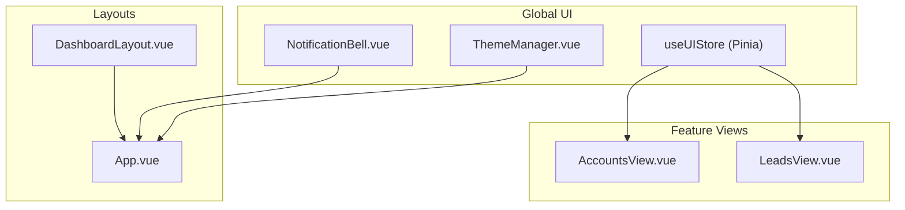
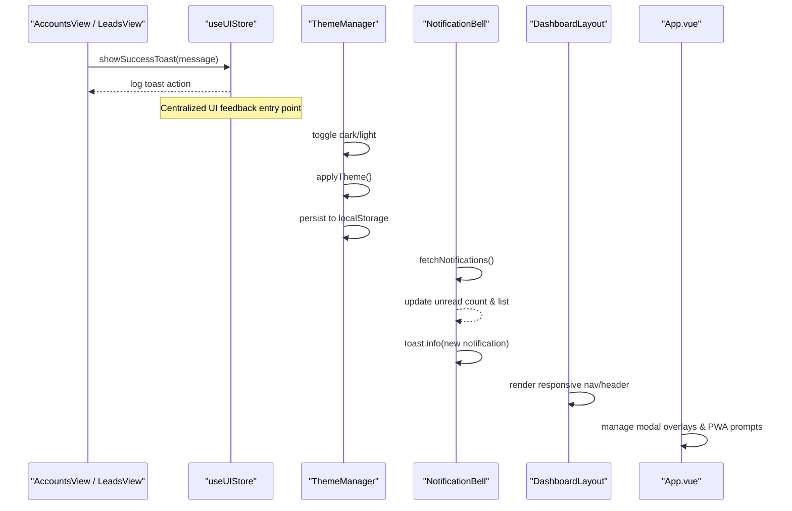
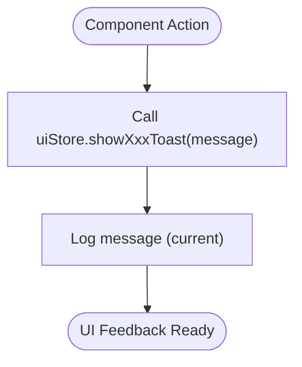
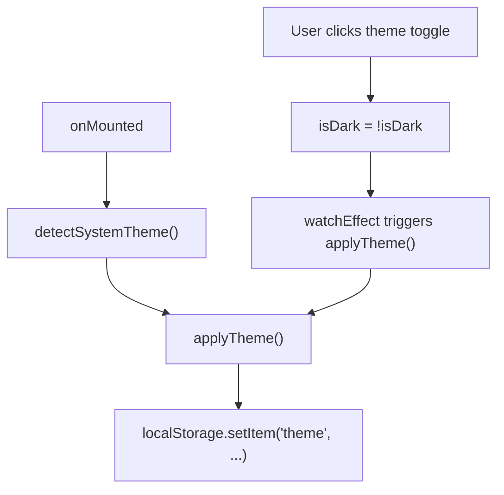
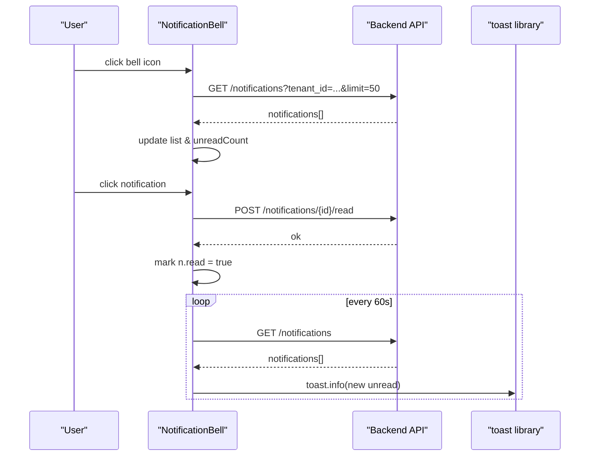
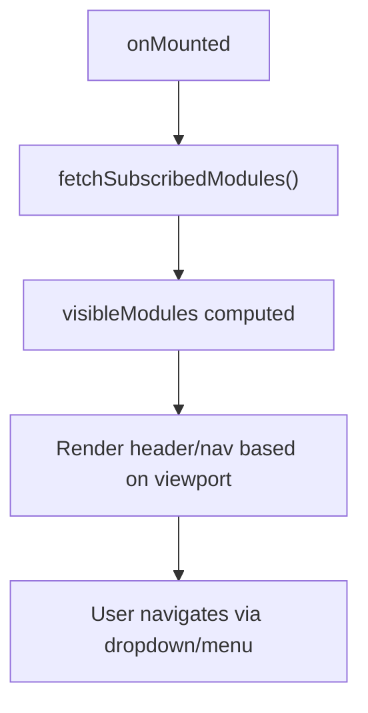
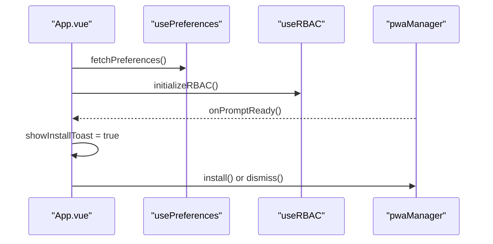
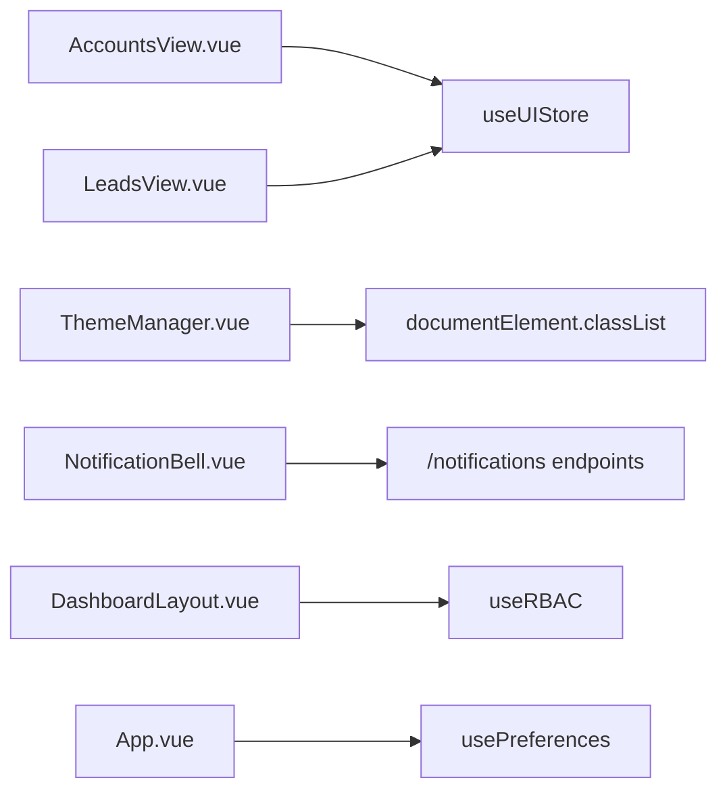

# UI State Store (ui.js)

<cite>
**Referenced Files in This Document**
- [ui.js](file://src/stores/ui.js)
- [ThemeManager.vue](file://src/components/ThemeManager.vue)
- [NotificationBell.vue](file://src/components/NotificationBell.vue)
- [DashboardLayout.vue](file://src/components/layouts/DashboardLayout.vue)
- [App.vue](file://src/App.vue)
- [AccountsView.vue](file://src/views/Modules/crm/components/AccountsView.vue)
- [LeadsView.vue](file://src/views/Modules/crm/components/LeadsView.vue)
</cite>

## Table of Contents
1. [Introduction](#introduction)
2. [Project Structure](#project-structure)
3. [Core Components](#core-components)
4. [Architecture Overview](#architecture-overview)
5. [Detailed Component Analysis](#detailed-component-analysis)
6. [Dependency Analysis](#dependency-analysis)
7. [Performance Considerations](#performance-considerations)
8. [Troubleshooting Guide](#troubleshooting-guide)
9. [Conclusion](#conclusion)

## Introduction
This document explains the global UI state store and how it coordinates application-wide UI concerns such as theme settings, notifications, modal visibility, and user interface preferences. It also covers responsive design behavior, sidebar navigation patterns, and global UI feedback mechanisms. You will learn how components subscribe to UI state changes, interact with ThemeManager for theme switching, and use NotificationBell for system notifications. The goal is to provide a clear mental model of how consistent UI behavior is maintained across the application.

## Project Structure
The UI state management spans several layers:
- Global store: Pinia-based store that centralizes UI actions like toast feedback.
- Theme management: A component that toggles dark/light mode and persists preference.
- Notifications: A bell component that fetches, displays, and manages notification state.
- Layouts: Responsive top-level layouts that adapt navigation and content based on viewport.
- App shell: Root component that orchestrates app-level UI behaviors like modals and overlays.

**Diagram sources**
- [ui.js:1-21](file://src/stores/ui.js#L1-L21)
- [ThemeManager.vue:1-46](file://src/components/ThemeManager.vue#L1-L46)
- [NotificationBell.vue:1-272](file://src/components/NotificationBell.vue#L1-L272)
- [DashboardLayout.vue:1-299](file://src/components/layouts/DashboardLayout.vue#L1-L299)
- [App.vue:1-293](file://src/App.vue#L1-L293)
- [AccountsView.vue:590-789](file://src/views/Modules/crm/components/AccountsView.vue#L590-L789)
- [LeadsView.vue:1030-1229](file://src/views/Modules/crm/components/LeadsView.vue#L1030-L1229)

**Section sources**
- [ui.js:1-21](file://src/stores/ui.js#L1-L21)
- [ThemeManager.vue:1-46](file://src/components/ThemeManager.vue#L1-L46)
- [NotificationBell.vue:1-272](file://src/components/NotificationBell.vue#L1-L272)
- [DashboardLayout.vue:1-299](file://src/components/layouts/DashboardLayout.vue#L1-L299)
- [App.vue:1-293](file://src/App.vue#L1-L293)
- [AccountsView.vue:590-789](file://src/views/Modules/crm/components/AccountsView.vue#L590-L789)
- [LeadsView.vue:1030-1229](file://src/views/Modules/crm/components/LeadsView.vue#L1030-L1229)

## Core Components
- Global UI Store (Pinia): Provides centralized methods for showing success, error, and info toasts. Currently logs messages; can be extended to integrate with a toast library or global event bus.
- ThemeManager: Manages dark/light theme by toggling a class on the root element and persisting the choice in localStorage. Detects system preference and listens for changes.
- NotificationBell: Fetches notifications from the backend, renders a popover list, marks items read/dismissed, and shows toast alerts when new unread notifications arrive via polling.
- DashboardLayout: Implements responsive navigation using a dropdown menu on mobile and a header with search and user controls on larger screens.
- App.vue: Hosts global UI elements such as PWA install prompts and modal overlays, and initializes global services at startup.

**Section sources**
- [ui.js:1-21](file://src/stores/ui.js#L1-L21)
- [ThemeManager.vue:1-46](file://src/components/ThemeManager.vue#L1-L46)
- [NotificationBell.vue:1-272](file://src/components/NotificationBell.vue#L1-L272)
- [DashboardLayout.vue:1-299](file://src/components/layouts/DashboardLayout.vue#L1-L299)
- [App.vue:1-293](file://src/App.vue#L1-L293)

## Architecture Overview
The UI state architecture separates concerns into a small global store for UI feedback, a dedicated theme manager component, and a notification component that owns its own local state while integrating with the rest of the app through events and API calls. Layouts handle responsive presentation, and the root app component provides global overlays and lifecycle hooks.

**Diagram sources**
- [ui.js:1-21](file://src/stores/ui.js#L1-L21)
- [ThemeManager.vue:1-46](file://src/components/ThemeManager.vue#L1-L46)
- [NotificationBell.vue:1-272](file://src/components/NotificationBell.vue#L1-L272)
- [DashboardLayout.vue:1-299](file://src/components/layouts/DashboardLayout.vue#L1-L299)
- [App.vue:1-293](file://src/App.vue#L1-L293)

## Detailed Component Analysis

### Global UI Store (useUIStore)
- Purpose: Provide a single place to trigger UI feedback (toasts) across the app.
- Current implementation: Exposes three methods—showSuccessToast, showErrorToast, showInfoToast—that log messages. These can be extended to integrate with a toast library or emit global events.
- Usage examples:
  - AccountsView uses the store to report success or error after account deletion.
  - LeadsView uses the store to inform users about auto-assign results and errors.

**Diagram sources**
- [ui.js:1-21](file://src/stores/ui.js#L1-L21)
- [AccountsView.vue:590-789](file://src/views/Modules/crm/components/AccountsView.vue#L590-L789)
- [LeadsView.vue:1030-1229](file://src/views/Modules/crm/components/LeadsView.vue#L1030-L1229)

**Section sources**
- [ui.js:1-21](file://src/stores/ui.js#L1-L21)
- [AccountsView.vue:590-789](file://src/views/Modules/crm/components/AccountsView.vue#L590-L789)
- [LeadsView.vue:1030-1229](file://src/views/Modules/crm/components/LeadsView.vue#L1030-L1229)

### ThemeManager
- Purpose: Manage application-wide theme (light/dark), persist user preference, and respect system theme.
- Behavior:
  - Toggles a class on the document root to switch themes.
  - Stores selected theme in localStorage.
  - On mount, reads stored theme or system preference and applies it.
  - Listens for system theme changes to keep UI in sync.

**Diagram sources**
- [ThemeManager.vue:1-46](file://src/components/ThemeManager.vue#L1-L46)

**Section sources**
- [ThemeManager.vue:1-46](file://src/components/ThemeManager.vue#L1-L46)

### NotificationBell
- Purpose: Display system notifications, track unread counts, mark items as read/dismissed, and alert users to new notifications.
- Key flows:
  - Fetch notifications from backend and render them in a popover.
  - Poll periodically to detect new unread notifications and show a toast.
  - Mark individual or all notifications as read.
  - Dismiss notifications and remove them locally.

**Diagram sources**
- [NotificationBell.vue:1-272](file://src/components/NotificationBell.vue#L1-L272)

**Section sources**
- [NotificationBell.vue:1-272](file://src/components/NotificationBell.vue#L1-L272)

### DashboardLayout (Responsive Navigation)
- Purpose: Provide a responsive layout with a dropdown navigation on smaller screens and a full header with search and user controls on larger screens.
- Behavior:
  - Uses Tailwind responsive classes to adjust layout and visibility.
  - Dynamically loads module cards and filters visible modules based on subscription and permissions.
  - Integrates with RBAC and JWT decoding to personalize the header.

**Diagram sources**
- [DashboardLayout.vue:1-299](file://src/components/layouts/DashboardLayout.vue#L1-L299)

**Section sources**
- [DashboardLayout.vue:1-299](file://src/components/layouts/DashboardLayout.vue#L1-L299)

### App.vue (Global UI Shell)
- Purpose: Orchestrate global UI behaviors such as PWA install prompts and modal overlays.
- Behavior:
  - Initializes preferences and RBAC on startup.
  - Manages a modal overlay for MFE portal sharing and handles copy-to-clipboard interactions.
  - Applies global styles including dark mode background gradient.

**Diagram sources**
- [App.vue:1-293](file://src/App.vue#L1-L293)

**Section sources**
- [App.vue:1-293](file://src/App.vue#L1-L293)

## Dependency Analysis
- useUIStore is imported by feature views to surface consistent UI feedback.
- ThemeManager operates independently but affects global styling via root class and localStorage.
- NotificationBell depends on backend APIs and a toast library to communicate updates to the user.
- DashboardLayout integrates with JWT decoding and RBAC to tailor navigation.
- App.vue initializes global services and hosts overlays that affect the entire application.

**Diagram sources**
- [ui.js:1-21](file://src/stores/ui.js#L1-L21)
- [AccountsView.vue:590-789](file://src/views/Modules/crm/components/AccountsView.vue#L590-L789)
- [LeadsView.vue:1030-1229](file://src/views/Modules/crm/components/LeadsView.vue#L1030-L1229)
- [ThemeManager.vue:1-46](file://src/components/ThemeManager.vue#L1-L46)
- [NotificationBell.vue:1-272](file://src/components/NotificationBell.vue#L1-L272)
- [DashboardLayout.vue:1-299](file://src/components/layouts/DashboardLayout.vue#L1-L299)
- [App.vue:1-293](file://src/App.vue#L1-L293)

**Section sources**
- [ui.js:1-21](file://src/stores/ui.js#L1-L21)
- [AccountsView.vue:590-789](file://src/views/Modules/crm/components/AccountsView.vue#L590-L789)
- [LeadsView.vue:1030-1229](file://src/views/Modules/crm/components/LeadsView.vue#L1030-L1229)
- [ThemeManager.vue:1-46](file://src/components/ThemeManager.vue#L1-L46)
- [NotificationBell.vue:1-272](file://src/components/NotificationBell.vue#L1-L272)
- [DashboardLayout.vue:1-299](file://src/components/layouts/DashboardLayout.vue#L1-L299)
- [App.vue:1-293](file://src/App.vue#L1-L293)

## Performance Considerations
- Notification polling interval: The bell component polls every 60 seconds. Ensure this aligns with server load and user expectations. Consider debouncing or adaptive intervals if needed.
- Local storage usage: Theme persistence uses localStorage; avoid excessive writes by batching or only writing on change.
- Computed properties: Use Vue’s computed properties for derived UI state (e.g., unread counts, visible modules) to minimize re-renders.
- Modal overlays: Keep z-index values predictable to avoid stacking issues, especially with third-party iframes or portals.

[No sources needed since this section provides general guidance]

## Troubleshooting Guide
- Toasts not appearing:
  - Verify that the store methods are called and check console logs for messages. Extend the store to integrate with a toast library if needed.
- Theme not applying:
  - Confirm that the root element has the correct class applied and that CSS rules target the .dark context appropriately.
- Notifications not updating:
  - Check network requests to the notifications endpoint and ensure tenant ID is present. Validate CORS and authentication headers if applicable.
- Responsive layout issues:
  - Inspect Tailwind breakpoints and ensure classes are correctly applied. Test on various screen sizes and confirm that dropdown navigation appears on small screens.

**Section sources**
- [ui.js:1-21](file://src/stores/ui.js#L1-L21)
- [ThemeManager.vue:1-46](file://src/components/ThemeManager.vue#L1-L46)
- [NotificationBell.vue:1-272](file://src/components/NotificationBell.vue#L1-L272)
- [DashboardLayout.vue:1-299](file://src/components/layouts/DashboardLayout.vue#L1-L299)

## Conclusion
The global UI state store provides a centralized entry point for UI feedback, while ThemeManager and NotificationBell encapsulate their respective concerns. Layouts ensure responsive behavior, and the root app component orchestrates global UI features. Together, these pieces maintain consistent UI behavior across the application, enabling reliable theme switching, notification handling, and responsive navigation. Extending the store to integrate with a toast library and refining polling strategies will further improve user experience and performance.

[No sources needed since this section summarizes without analyzing specific files]