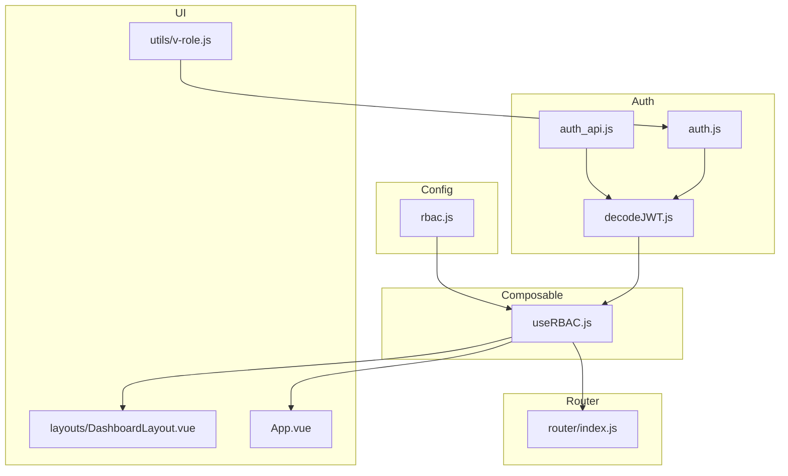
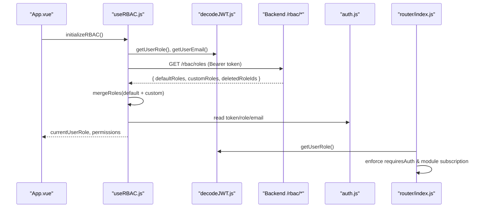
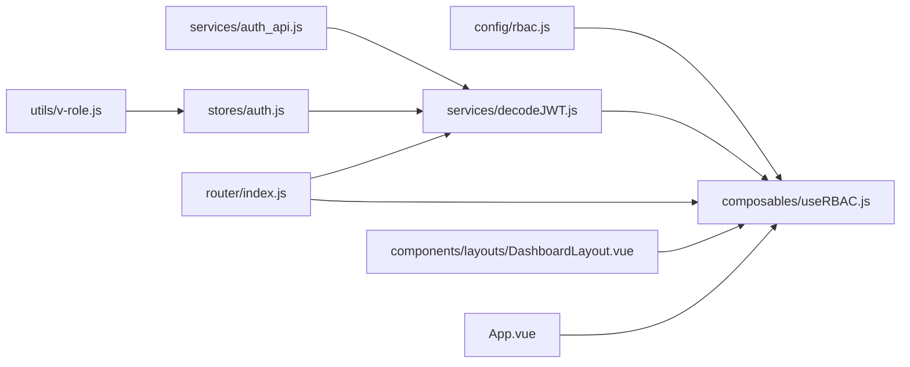

# Role-Based Access Control Implementation

<cite>
**Referenced Files in This Document**
- [rbac.js](file://src/config/rbac.js)
- [useRBAC.js](file://src/composables/useRBAC.js)
- [auth.js](file://src/stores/auth.js)
- [auth_api.js](file://src/services/auth_api.js)
- [decodeJWT.js](file://src/services/decodeJWT.js)
- [v-role.js](file://src/utils/v-role.js)
- [index.js](file://src/router/index.js)
- [App.vue](file://src/App.vue)
- [DashboardLayout.vue](file://src/components/layouts/DashboardLayout.vue)
</cite>

## Table of Contents
1. [Introduction](#introduction)
2. [Project Structure](#project-structure)
3. [Core Components](#core-components)
4. [Architecture Overview](#architecture-overview)
5. [Detailed Component Analysis](#detailed-component-analysis)
6. [Dependency Analysis](#dependency-analysis)
7. [Performance Considerations](#performance-considerations)
8. [Troubleshooting Guide](#troubleshooting-guide)
9. [Conclusion](#conclusion)
10. [Appendices](#appendices)

## Introduction
This document explains the Role-Based Access Control (RBAC) implementation in ABSA Foundry Frontend. It covers:
- RBAC configuration structure for roles, permissions, and module access rules
- The useRBAC composable for reactive permission checks, role validation, and dynamic UI rendering
- Integration with authentication via token-based authorization
- Permission inheritance, role hierarchies, and dynamic assignment
- Examples for protecting routes, conditionally rendering UI, and enforcing API-level security
- Debugging, testing, and extending the system

## Project Structure
The RBAC system is composed of:
- Configuration: role definitions, entities, and helpers
- Composable: centralized permission logic and tenant data management
- Auth integration: JWT decoding, token handling, and session lifecycle
- Router guards: route-level protection and module visibility
- UI directives: quick role-based DOM control
- Layouts and views: practical usage patterns

**Diagram sources**
- [rbac.js:1-753](file://src/config/rbac.js#L1-L753)
- [useRBAC.js:1-783](file://src/composables/useRBAC.js#L1-L783)
- [decodeJWT.js:1-164](file://src/services/decodeJWT.js#L1-L164)
- [auth_api.js:1-190](file://src/services/auth_api.js#L1-L190)
- [auth.js:1-22](file://src/stores/auth.js#L1-L22)
- [index.js:1-275](file://src/router/index.js#L1-L275)
- [v-role.js:1-12](file://src/utils/v-role.js#L1-L12)
- [DashboardLayout.vue:100-299](file://src/components/layouts/DashboardLayout.vue#L100-L299)
- [App.vue:95-168](file://src/App.vue#L95-L168)

**Section sources**
- [rbac.js:1-753](file://src/config/rbac.js#L1-L753)
- [useRBAC.js:1-783](file://src/composables/useRBAC.js#L1-L783)
- [decodeJWT.js:1-164](file://src/services/decodeJWT.js#L1-L164)
- [auth_api.js:1-190](file://src/services/auth_api.js#L1-L190)
- [auth.js:1-22](file://src/stores/auth.js#L1-L22)
- [index.js:1-275](file://src/router/index.js#L1-L275)
- [v-role.js:1-12](file://src/utils/v-role.js#L1-L12)
- [DashboardLayout.vue:100-299](file://src/components/layouts/DashboardLayout.vue#L100-L299)
- [App.vue:95-168](file://src/App.vue#L95-L168)

## Core Components
- rbac.js: Defines permission types, entities, default roles, helper functions to check permissions, merge custom roles, and validate roles.
- useRBAC.js: Provides reactive state for current user role and permissions, permission checking methods, tenant role fetching and merging, organization management, UI preferences, and initialization flow.
- decodeJWT.js: Decodes JWT tokens, extracts role/email/user info, handles expiration and logout.
- auth_api.js: Handles login, refresh, signup, profile fetch, and updates role; attaches Bearer token automatically.
- auth.js: Pinia store holding token, role, email; provides logout action.
- v-role.js: Vue directive to remove elements if the user’s role does not match allowed roles.
- router/index.js: Global navigation guard that enforces authentication and module subscription checks.
- App.vue and DashboardLayout.vue: Initialize RBAC at app start and filter modules based on permissions.

**Section sources**
- [rbac.js:1-753](file://src/config/rbac.js#L1-L753)
- [useRBAC.js:1-783](file://src/composables/useRBAC.js#L1-L783)
- [decodeJWT.js:1-164](file://src/services/decodeJWT.js#L1-L164)
- [auth_api.js:1-190](file://src/services/auth_api.js#L1-L190)
- [auth.js:1-22](file://src/stores/auth.js#L1-L22)
- [v-role.js:1-12](file://src/utils/v-role.js#L1-L12)
- [index.js:1-275](file://src/router/index.js#L1-L275)
- [App.vue:95-168](file://src/App.vue#L95-L168)
- [DashboardLayout.vue:100-299](file://src/components/layouts/DashboardLayout.vue#L100-L299)

## Architecture Overview
The RBAC architecture combines static defaults with dynamic tenant roles, enforced by a composable that reads from JWT and backend APIs.

**Diagram sources**
- [App.vue:95-168](file://src/App.vue#L95-L168)
- [useRBAC.js:144-226](file://src/composables/useRBAC.js#L144-L226)
- [decodeJWT.js:11-51](file://src/services/decodeJWT.js#L11-L51)
- [auth_api.js:20-27](file://src/services/auth_api.js#L20-L27)
- [index.js:201-272](file://src/router/index.js#L201-L272)

## Detailed Component Analysis

### RBAC Configuration (rbac.js)
- Permission types: read, write, edit, delete, assign, approve, export.
- Entities: list of modules/entities that can have permissions applied.
- Default roles: owner, manager, cashier, accountant, auditor, attendant, hotel_attendant, plus asset-related roles with explicit permissions and optional scopes.
- Helper functions:
  - hasPermission(role, entity, permission): checks if a role grants a specific permission on an entity.
  - hasAnyPermission(role, entity): checks if any permission exists for an entity.
  - getDefaultRole(roleId), createEmptyRole(), mergeRoles(custom, base), validateRole(role).
- Healthcare-specific role IDs set for conditional visibility.

Key behaviors:
- Owner/admin/super_admin bypass checks in the composable.
- Custom roles override or extend defaults via mergeRoles.
- Entity-specific permissions can be extended beyond common types.

**Section sources**
- [rbac.js:6-77](file://src/config/rbac.js#L6-L77)
- [rbac.js:79-337](file://src/config/rbac.js#L79-L337)
- [rbac.js:655-753](file://src/config/rbac.js#L655-L753)

### useRBAC Composable (useRBAC.js)
Responsibilities:
- Reactive state: current user role, permissions, organizations, tenant roles, UI preferences, loading/error states.
- Permission checks:
  - hasPermission(entity, permission)
  - hasAnyPermission(entity)
  - canRead, canWrite, canEdit, canDelete, canAssign, canApprove, canExport
  - isSuperAdmin, isAdmin, canManageRoles
- Tenant role management:
  - fetchRoles(): calls /rbac/roles with Bearer token, merges default and custom roles, removes deleted ones, syncs healthcare permissions to localStorage.
  - createRole, updateRole, deleteRole with error handling and optimistic updates.
- Organization management: fetch/add/update/remove organizations via /rbac/organizations.
- UI preferences: fetch/update/apply theme, fonts, colors, radii, elevation, pattern intensity, visual style presets.
- Initialization:
  - initializeRBAC(): resolves current role from JWT against tenant/default roles, loads cached UI prefs, then fetches roles, organizations, and preferences in parallel, re-evaluates role after load.

Important notes:
- DEV_BYPASS allows skipping checks in development.
- Super-admin-like roles are whitelisted for full access.
- Healthcare permissions are derived and persisted for faster UI decisions.

**Section sources**
- [useRBAC.js:37-138](file://src/composables/useRBAC.js#L37-L138)
- [useRBAC.js:144-226](file://src/composables/useRBAC.js#L144-L226)
- [useRBAC.js:228-347](file://src/composables/useRBAC.js#L228-L347)
- [useRBAC.js:349-488](file://src/composables/useRBAC.js#L349-L488)
- [useRBAC.js:490-661](file://src/composables/useRBAC.js#L490-L661)
- [useRBAC.js:663-783](file://src/composables/useRBAC.js#L663-L783)

### Authentication Integration (auth_api.js, decodeJWT.js, auth.js)
- Token handling:
  - Login stores access_token and refresh_token; subsequent requests attach Authorization header automatically via axios interceptor.
  - Refresh endpoint rotates tokens; failure clears local storage.
  - Logout clears relevant keys and navigates away.
- JWT decoding:
  - Extracts role, email, name, id, branch info.
  - Validates expiration; logs out on expiry or decode errors.
  - Supports dev bypass payload when configured.
- Pinia store:
  - Holds token, role, email; provides isAuthenticated getter and logout action.

Integration points:
- useRBAC uses decodeJWT to get current role/email and relies on stored token for API calls.
- Router guard uses decodeJWT to determine access and redirect unauthenticated users.

**Section sources**
- [auth_api.js:1-143](file://src/services/auth_api.js#L1-L143)
- [auth_api.js:145-190](file://src/services/auth_api.js#L145-L190)
- [decodeJWT.js:1-164](file://src/services/decodeJWT.js#L1-L164)
- [auth.js:1-22](file://src/stores/auth.js#L1-L22)

### Route Protection and Module Visibility
- Global beforeEach guard:
  - Enforces authentication for routes marked requiresAuth.
  - For dashboard routes, checks module subscriptions and role-based allowances.
  - Supports impersonation via query parameter to inject token and navigate to dashboard.
- Module visibility:
  - DashboardLayout filters visible modules based on subscription and hasPermission checks for non-admin roles.

Examples:
- Protecting routes: mark meta.requiresAuth and rely on the global guard.
- Conditional UI: use hasPermission('entity', 'read') to show/hide sections.
- Sidebar filtering: compute visibleModules using hasPermission per module.

**Section sources**
- [index.js:201-272](file://src/router/index.js#L201-L272)
- [DashboardLayout.vue:167-232](file://src/components/layouts/DashboardLayout.vue#L167-L232)

### Directive-Based UI Control (v-role.js)
- Removes element from DOM if the current user’s role is not included in the allowed roles array passed to the directive.
- Uses auth store to read userRole.

Usage example concept:
- 
...
 renders only for those roles.

**Section sources**
- [v-role.js:1-12](file://src/utils/v-role.js#L1-L12)
- [auth.js:1-22](file://src/stores/auth.js#L1-L22)

### App Initialization and RBAC Bootstrapping
- App.vue initializes preferences and RBAC concurrently on mount.
- Ensures RBAC state is ready before rendering protected UI.

**Section sources**
- [App.vue:95-168](file://src/App.vue#L95-L168)

## Dependency Analysis

**Diagram sources**
- [rbac.js:1-753](file://src/config/rbac.js#L1-L753)
- [useRBAC.js:1-783](file://src/composables/useRBAC.js#L1-L783)
- [decodeJWT.js:1-164](file://src/services/decodeJWT.js#L1-L164)
- [auth_api.js:1-190](file://src/services/auth_api.js#L1-L190)
- [auth.js:1-22](file://src/stores/auth.js#L1-L22)
- [index.js:1-275](file://src/router/index.js#L1-L275)
- [v-role.js:1-12](file://src/utils/v-role.js#L1-L12)
- [DashboardLayout.vue:100-299](file://src/components/layouts/DashboardLayout.vue#L100-L299)
- [App.vue:95-168](file://src/App.vue#L95-L168)

**Section sources**
- [useRBAC.js:1-783](file://src/composables/useRBAC.js#L1-L783)
- [rbac.js:1-753](file://src/config/rbac.js#L1-L753)
- [decodeJWT.js:1-164](file://src/services/decodeJWT.js#L1-L164)
- [auth_api.js:1-190](file://src/services/auth_api.js#L1-L190)
- [auth.js:1-22](file://src/stores/auth.js#L1-L22)
- [index.js:1-275](file://src/router/index.js#L1-L275)
- [v-role.js:1-12](file://src/utils/v-role.js#L1-L12)
- [DashboardLayout.vue:100-299](file://src/components/layouts/DashboardLayout.vue#L100-L299)
- [App.vue:95-168](file://src/App.vue#L95-L168)

## Performance Considerations
- Parallel initialization: useRBAC.initializeRBAC fetches roles, organizations, and UI preferences concurrently to reduce startup time.
- Local caching: UI preferences are cached in localStorage and applied immediately on boot, then updated from server.
- Minimal re-renders: readonly exposure of reactive state prevents accidental mutations and reduces unnecessary updates.
- Efficient permission checks: hasPermission delegates to lightweight helpers; super-admin bypass avoids repeated lookups.

[No sources needed since this section provides general guidance]

## Troubleshooting Guide
Common issues and resolutions:
- Token expired or invalid:
  - decodeJWT detects expiration and triggers logout; ensure refresh flow is handled by auth_api.refreshToken when needed.
- Missing permissions after login:
  - Verify that useRBAC.initializeRBAC was called and that /rbac/roles returns expected default/custom roles.
  - Check merged roles in tenantRoles and confirm currentUserRole resolution matches JWT role.
- UI not updating:
  - Ensure hasPermission is used reactively in templates or computed properties.
  - Confirm DEV_BYPASS is disabled in production so checks apply.
- Route still accessible without permission:
  - Confirm route meta.requiresAuth is set and router guard runs.
  - For dashboard modules, verify subscription cache and role checks in DashboardLayout.
- Directive not working:
  - v-role depends on auth store userRole; ensure it is set after login and not cleared prematurely.

Debugging tips:
- Log currentUserRole and currentUserPermissions after initializeRBAC.
- Inspect localStorage for token, role, email, and cached preferences.
- Use browser network tab to verify /rbac/roles and /rbac/preferences responses.
- Temporarily enable DEV_BYPASS to isolate UI vs. permission issues.

**Section sources**
- [decodeJWT.js:11-96](file://src/services/decodeJWT.js#L11-L96)
- [useRBAC.js:663-719](file://src/composables/useRBAC.js#L663-L719)
- [index.js:201-272](file://src/router/index.js#L201-L272)
- [DashboardLayout.vue:198-232](file://src/components/layouts/DashboardLayout.vue#L198-L232)
- [v-role.js:1-12](file://src/utils/v-role.js#L1-L12)

## Conclusion
The RBAC system in ABSA Foundry Frontend combines a robust configuration layer with a reactive composable that integrates tightly with JWT-based authentication and backend role services. It supports dynamic role merging, fine-grained permission checks, and flexible UI adaptation. With clear separation of concerns across config, composable, auth, router, and UI layers, the system is extensible for custom requirements while maintaining secure defaults and developer-friendly debugging.

[No sources needed since this section summarizes without analyzing specific files]

## Appendices

### Permission Inheritance and Role Hierarchies
- Built-in hierarchy: owner/admin/super_admin bypass checks and effectively inherit all permissions.
- Merging strategy: custom roles override or extend defaults via mergeRoles, allowing tenant-specific adjustments.
- Entity-scoped permissions: each entity defines its own permission arrays; some entities support additional actions like assign/approve/export.

**Section sources**
- [rbac.js:79-337](file://src/config/rbac.js#L79-L337)
- [rbac.js:655-713](file://src/config/rbac.js#L655-L713)
- [useRBAC.js:63-78](file://src/composables/useRBAC.js#L63-L78)

### Dynamic Permission Assignment
- Roles fetched from /rbac/roles include defaultRoles and customRoles; deleted roles are removed by ID.
- After merge, currentUserRole is resolved against tenant roles, ensuring runtime accuracy.
- Healthcare permissions are derived and cached for fast UI decisions.

**Section sources**
- [useRBAC.js:144-226](file://src/composables/useRBAC.js#L144-L226)
- [useRBAC.js:663-719](file://src/composables/useRBAC.js#L663-L719)

### Examples: Protecting Routes, Rendering UI, Enforcing API Security
- Protect routes:
  - Set meta.requiresAuth on route definitions and rely on the global guard to redirect unauthenticated users.
- Conditionally render UI:
  - Use hasPermission('entity', 'action') in components or computed properties to show/hide features.
  - Use v-role directive for quick role-based DOM removal.
- Enforce API-level security:
  - All authenticated requests attach Bearer token via axios interceptor; ensure endpoints require valid tokens on the backend.

**Section sources**
- [index.js:201-272](file://src/router/index.js#L201-L272)
- [useRBAC.js:63-138](file://src/composables/useRBAC.js#L63-L138)
- [v-role.js:1-12](file://src/utils/v-role.js#L1-L12)
- [auth_api.js:20-27](file://src/services/auth_api.js#L20-L27)

### Testing RBAC Scenarios
- Unit tests:
  - Test hasPermission and hasAnyPermission with various roles and entities.
  - Validate mergeRoles behavior for overriding defaults.
- Integration tests:
  - Mock /rbac/roles and /rbac/preferences to verify initialization and UI preference application.
  - Assert route guard redirects for unauthorized paths.
- E2E scenarios:
  - Simulate login flows, role changes, and module visibility changes post-login.

[No sources needed since this section provides general guidance]

### Extending the Permission System
- Add new entities:
  - Extend PERMISSION_ENTITIES and define default permissions in DEFAULT_ROLES as needed.
- Add new permission types:
  - Update PERMISSION_TYPES and adjust helper functions and UI labels accordingly.
- Create custom roles:
  - Define new entries in DEFAULT_ROLES or provide them via backend customRoles.
- Integrate new modules:
  - Map module IDs to permission entities in DashboardLayout filtering logic.

**Section sources**
- [rbac.js:6-77](file://src/config/rbac.js#L6-L77)
- [rbac.js:79-337](file://src/config/rbac.js#L79-L337)
- [useRBAC.js:144-226](file://src/composables/useRBAC.js#L144-L226)
- [DashboardLayout.vue:198-232](file://src/components/layouts/DashboardLayout.vue#L198-L232)