# State Management Design

<cite>
**Referenced Files in This Document**
- [main.js](file://src/main.js)
- [package.json](file://package.json)
- [auth.js](file://src/stores/auth.js)
- [dashboard.js](file://src/stores/dashboard.js)
- [customerStore.js](file://src/stores/customerStore.js)
- [etlStore.js](file://src/stores/etlStore.js)
- [intelligenceStore.js](file://src/stores/intelligenceStore.js)
- [modelsStore.js](file://src/stores/modelsStore.js)
- [predictionStore.js](file://src/stores/predictionStore.js)
- [ui.js](file://src/stores/ui.js)
- [useRBAC.js](file://src/composables/useRBAC.js)
- [rbac.js](file://src/config/rbac.js)
- [useNetworkStatus.js](file://src/composables/useNetworkStatus.js)
- [useActivityTracker.js](file://src/config/useActivityTracker.js)
</cite>

## Table of Contents
1. [Introduction](#introduction)
2. [Project Structure](#project-structure)
3. [Core Components](#core-components)
4. [Architecture Overview](#architecture-overview)
5. [Detailed Component Analysis](#detailed-component-analysis)
6. [Dependency Analysis](#dependency-analysis)
7. [Performance Considerations](#performance-considerations)
8. [Troubleshooting Guide](#troubleshooting-guide)
9. [Conclusion](#conclusion)
10. [Appendices](#appendices)

## Introduction
This document explains the state management design for the ABSA Foundry Frontend, focusing on the migration from Vuex to Pinia 3.0.3 and how modern reactive patterns are applied across stores and composables. It documents:
- Store architecture for authentication, dashboard metrics, CRM data, and ETL pipeline management
- Role-based access control (RBAC) via composables and configuration
- State persistence strategies, caching mechanisms, and real-time update considerations
- Synchronization patterns between components, stores, and external APIs
- Debugging techniques, inspection tools, and performance monitoring approaches

The project uses Vue 3 with Vite and integrates Pinia as the central state management solution. The application initializes a single Pinia instance at app bootstrap and distributes store modules by feature area.

**Section sources**
- [main.js:1-129](file://src/main.js#L1-L129)
- [package.json:13-63](file://package.json#L13-L63)

## Project Structure
At a high level, state is organized into:
- Feature-specific Pinia stores under src/stores
- Business logic and reusable stateful behavior in src/composables
- RBAC configuration and utilities in src/config
- API services and interceptors for authenticated requests
- Network status and offline sync composable for resilience

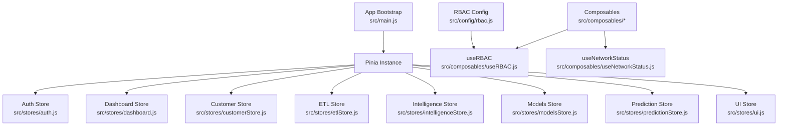

**Diagram sources**
- [main.js:70-75](file://src/main.js#L70-L75)
- [auth.js:1-22](file://src/stores/auth.js#L1-L22)
- [dashboard.js:1-29](file://src/stores/dashboard.js#L1-L29)
- [customerStore.js:1-187](file://src/stores/customerStore.js#L1-L187)
- [etlStore.js:1-96](file://src/stores/etlStore.js#L1-L96)
- [intelligenceStore.js:1-296](file://src/stores/intelligenceStore.js#L1-L296)
- [modelsStore.js:1-54](file://src/stores/modelsStore.js#L1-L54)
- [predictionStore.js:1-171](file://src/stores/predictionStore.js#L1-L171)
- [ui.js:1-21](file://src/stores/ui.js#L1-L21)
- [useRBAC.js:1-783](file://src/composables/useRBAC.js#L1-L783)
- [rbac.js:1-753](file://src/config/rbac.js#L1-L753)
- [useNetworkStatus.js:1-227](file://src/composables/useNetworkStatus.js#L1-L227)

**Section sources**
- [main.js:70-75](file://src/main.js#L70-L75)
- [package.json:50-62](file://package.json#L50-L62)

## Core Components
- Authentication state: token, role, email; persisted to localStorage; provides logout action
- Dashboard state: module list and loading flag; fetches owner modules via API
- Customer CRM state: portfolio summary, customer list, filters, pagination, timeline, features; computed portfolio metrics and filtered lists
- ETL pipeline state: runs, totals, pagination, status filter, KPIs, quality trend; loads dashboard data
- Intelligence state: CLV, lifecycle, forecast, outcomes with fallback data when API unavailable
- Models state: model registry with champion selection and counts
- Prediction state: per-customer predictions, health scores, Markov matrix, churn drivers, batch fetching
- UI state: placeholder toast helpers
- RBAC: composable providing permission checks, role/organization management, UI preferences, and initialization flow
- Network status: online/offline tracking, sync status, auto-sync on reconnect

Key benefits of Pinia over Vuex:
- Composition API style with refs and computed for intuitive reactivity
- Type-safe and tree-shakeable stores without boilerplate mutations/actions
- Simpler setup and better developer experience with devtools integration
- Natural separation of concerns with composables for cross-cutting logic

**Section sources**
- [auth.js:1-22](file://src/stores/auth.js#L1-L22)
- [dashboard.js:1-29](file://src/stores/dashboard.js#L1-L29)
- [customerStore.js:1-187](file://src/stores/customerStore.js#L1-L187)
- [etlStore.js:1-96](file://src/stores/etlStore.js#L1-L96)
- [intelligenceStore.js:1-296](file://src/stores/intelligenceStore.js#L1-L296)
- [modelsStore.js:1-54](file://src/stores/modelsStore.js#L1-L54)
- [predictionStore.js:1-171](file://src/stores/predictionStore.js#L1-L171)
- [ui.js:1-21](file://src/stores/ui.js#L1-L21)
- [useRBAC.js:1-783](file://src/composables/useRBAC.js#L1-L783)
- [useNetworkStatus.js:1-227](file://src/composables/useNetworkStatus.js#L1-L227)

## Architecture Overview
The application bootstraps a Pinia instance and mounts it globally. Stores encapsulate domain state and expose actions to fetch data from backend APIs. Axios instances are configured per store with base URLs and request interceptors that attach Bearer tokens from localStorage. Composables like useRBAC provide cross-cutting concerns such as permissions and UI preferences, while useNetworkStatus handles connectivity and offline synchronization.

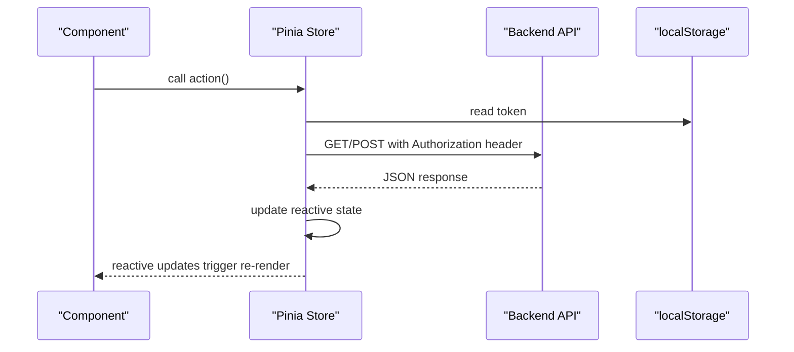

**Diagram sources**
- [customerStore.js:6-12](file://src/stores/customerStore.js#L6-L12)
- [modelsStore.js:6-12](file://src/stores/modelsStore.js#L6-L12)
- [predictionStore.js:6-12](file://src/stores/predictionStore.js#L6-L12)
- [intelligenceStore.js:6-11](file://src/stores/intelligenceStore.js#L6-L11)

**Section sources**
- [main.js:70-75](file://src/main.js#L70-L75)
- [customerStore.js:6-12](file://src/stores/customerStore.js#L6-L12)
- [modelsStore.js:6-12](file://src/stores/modelsStore.js#L6-L12)
- [predictionStore.js:6-12](file://src/stores/predictionStore.js#L6-L12)
- [intelligenceStore.js:6-11](file://src/stores/intelligenceStore.js#L6-L11)

## Detailed Component Analysis

### Authentication Store (auth.js)
Responsibilities:
- Holds token, user role, and email
- Provides isAuthenticated getter
- Clears persistent storage on logout

Persistence strategy:
- Token and identity fields are read from localStorage on store init
- Logout removes multiple keys from localStorage and resets state

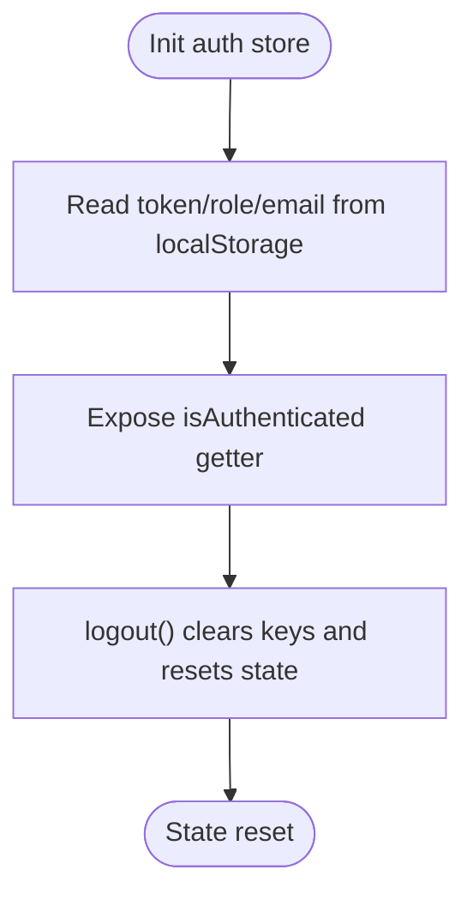

**Diagram sources**
- [auth.js:4-20](file://src/stores/auth.js#L4-L20)

**Section sources**
- [auth.js:1-22](file://src/stores/auth.js#L1-L22)

### Dashboard Store (dashboard.js)
Responsibilities:
- Tracks modules and loading state
- Fetches modules for the current owner using a direct fetch with Authorization header

Data flow:
- Action sets loading, calls API, maps response to modules, clears loading

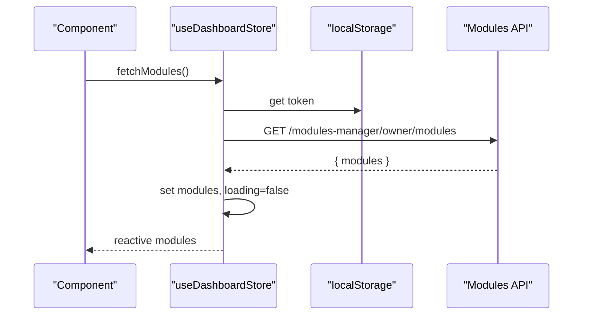

**Diagram sources**
- [dashboard.js:5-28](file://src/stores/dashboard.js#L5-L28)

**Section sources**
- [dashboard.js:1-29](file://src/stores/dashboard.js#L1-L29)

### Customer Store (customerStore.js)
Responsibilities:
- Manages portfolio summary, customer list, filters, pagination, timeline, features
- Computes portfolio metrics and filtered views
- Uses an axios instance with Authorization interceptor

Key algorithms:
- Portfolio computed aggregates counts and percentages by state
- Filtered customers apply state, search, and pagination slicing

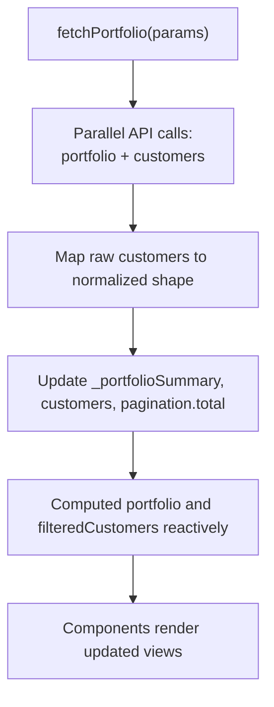

**Diagram sources**
- [customerStore.js:17-187](file://src/stores/customerStore.js#L17-L187)

**Section sources**
- [customerStore.js:1-187](file://src/stores/customerStore.js#L1-L187)

### ETL Store (etlStore.js)
Responsibilities:
- Loads ETL run history and dashboard KPIs
- Supports pagination and status filtering
- Exposes computed totalPages and isEmpty

Flow:
- loadDashboard calls etlApi, updates runs, totalRuns, page, limit, KPIs, status panel, quality trend

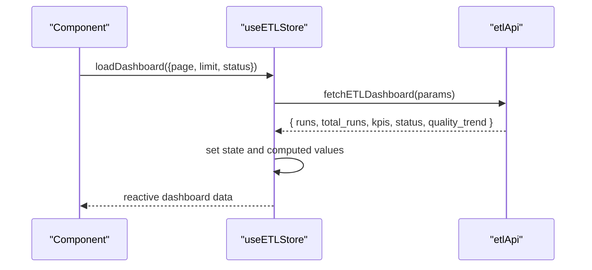

**Diagram sources**
- [etlStore.js:12-96](file://src/stores/etlStore.js#L12-L96)

**Section sources**
- [etlStore.js:1-96](file://src/stores/etlStore.js#L1-L96)

### Intelligence Store (intelligenceStore.js)
Responsibilities:
- Fetches CLV, lifecycle stages, balance forecasts, and retention outcomes
- Falls back to static datasets when API is unavailable
- Uses axios with Authorization interceptor

Resilience pattern:
- Each fetch wraps try/catch and assigns fallback data on error

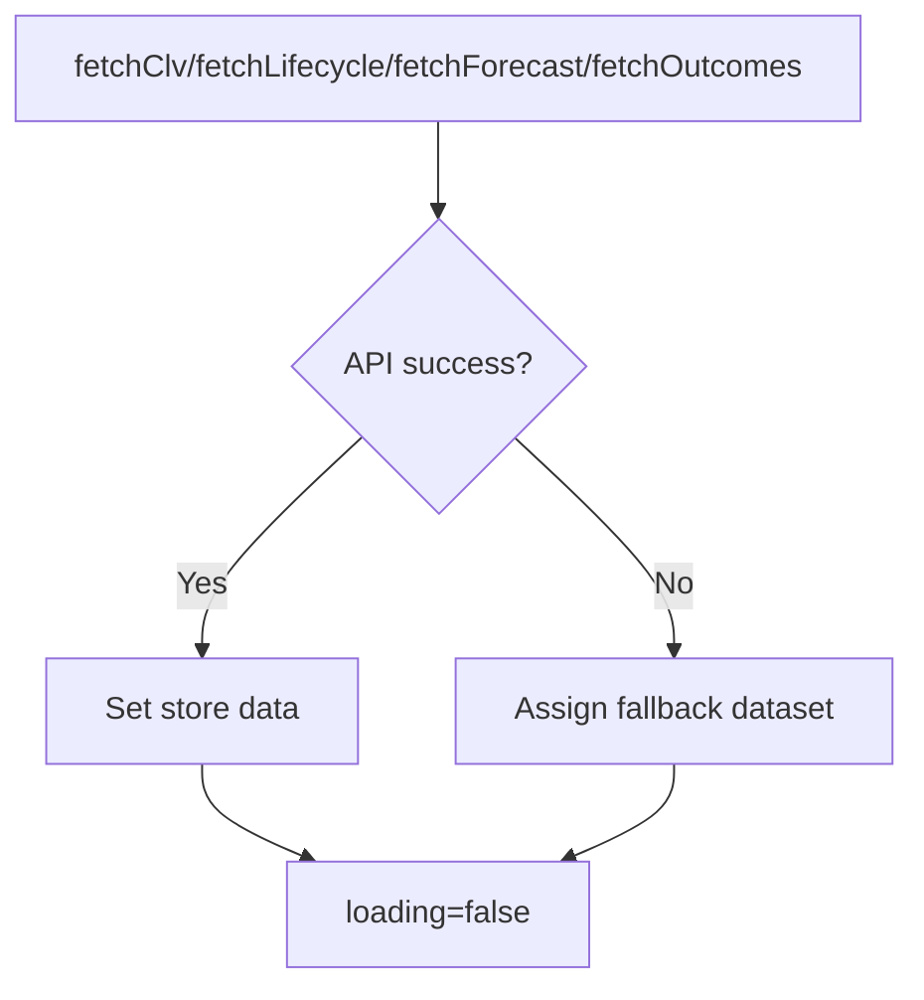

**Diagram sources**
- [intelligenceStore.js:234-296](file://src/stores/intelligenceStore.js#L234-L296)

**Section sources**
- [intelligenceStore.js:1-296](file://src/stores/intelligenceStore.js#L1-L296)

### Models Store (modelsStore.js)
Responsibilities:
- Loads models and exposes computed champion selections and counts
- Normalizes model entries and tracks loading/error states

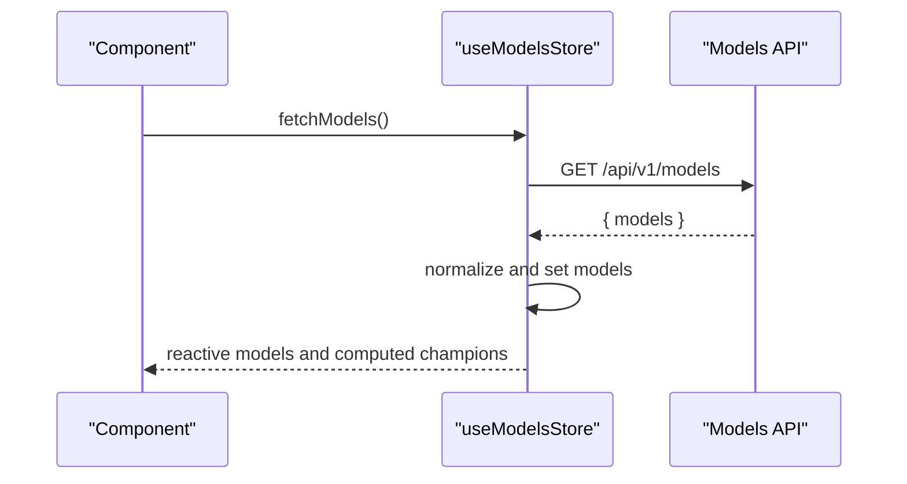

**Diagram sources**
- [modelsStore.js:15-54](file://src/stores/modelsStore.js#L15-L54)

**Section sources**
- [modelsStore.js:1-54](file://src/stores/modelsStore.js#L1-L54)

### Prediction Store (predictionStore.js)
Responsibilities:
- Per-customer predictions, health scores, Markov matrix, churn drivers
- Batch fetching with controlled concurrency
- Convenience getters for churn probability and health score

Concurrency pattern:
- Batch fetch splits IDs into small batches and uses Promise.allSettled to avoid overwhelming the backend

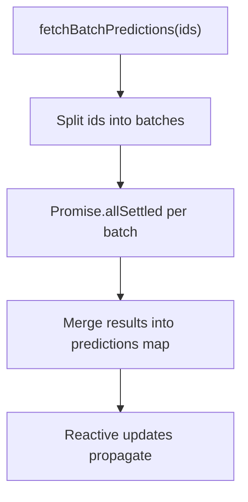

**Diagram sources**
- [predictionStore.js:17-171](file://src/stores/predictionStore.js#L17-L171)

**Section sources**
- [predictionStore.js:1-171](file://src/stores/predictionStore.js#L1-L171)

### RBAC Composable and Configuration (useRBAC.js, rbac.js)
Responsibilities:
- Permission checking functions and shortcuts (canRead, canWrite, etc.)
- Role and organization management via API
- UI preferences loading, applying, and persistence
- Initialization flow that merges tenant roles with defaults and resolves current user role

Key behaviors:
- DEV_BYPASS allows skipping checks in development
- Healthcare role permissions are derived and synced to localStorage
- UI preferences are applied as CSS variables and classes

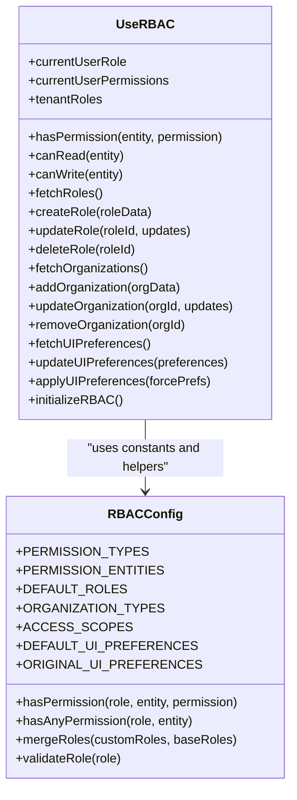

**Diagram sources**
- [useRBAC.js:1-783](file://src/composables/useRBAC.js#L1-L783)
- [rbac.js:1-753](file://src/config/rbac.js#L1-L753)

**Section sources**
- [useRBAC.js:1-783](file://src/composables/useRBAC.js#L1-L783)
- [rbac.js:1-753](file://src/config/rbac.js#L1-L753)

### Network Status and Offline Sync (useNetworkStatus.js)
Responsibilities:
- Tracks online/offline status and sync queue
- Auto-sync on reconnect
- Debounced network event handling
- Notification support for offline state

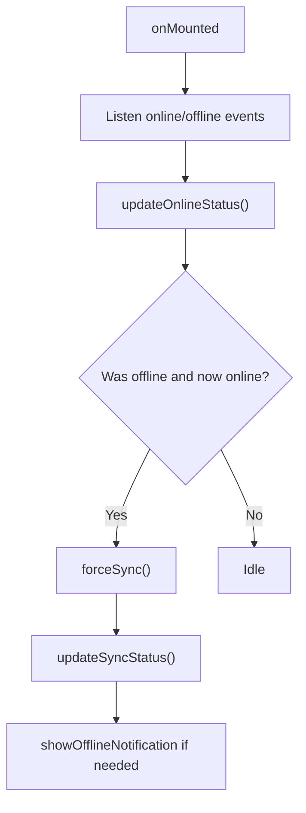

**Diagram sources**
- [useNetworkStatus.js:10-227](file://src/composables/useNetworkStatus.js#L10-L227)

**Section sources**
- [useNetworkStatus.js:1-227](file://src/composables/useNetworkStatus.js#L1-L227)

### Activity Tracking (useActivityTracker.js)
Responsibilities:
- Tracks last activity via mouse, keyboard, click, focus
- Sends heartbeat to server periodically if active within a time window

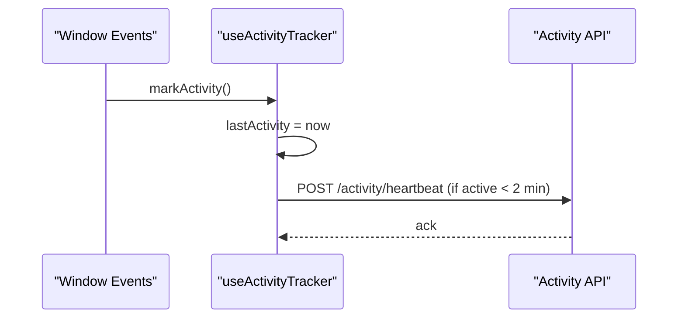

**Diagram sources**
- [useActivityTracker.js:4-58](file://src/config/useActivityTracker.js#L4-L58)

**Section sources**
- [useActivityTracker.js:1-58](file://src/config/useActivityTracker.js#L1-L58)

## Dependency Analysis
Stores depend on:
- LocalStorage for tokens and preferences
- API services for data retrieval
- Composables for cross-cutting concerns (RBAC, network status)
- Router and UI plugins for navigation and notifications

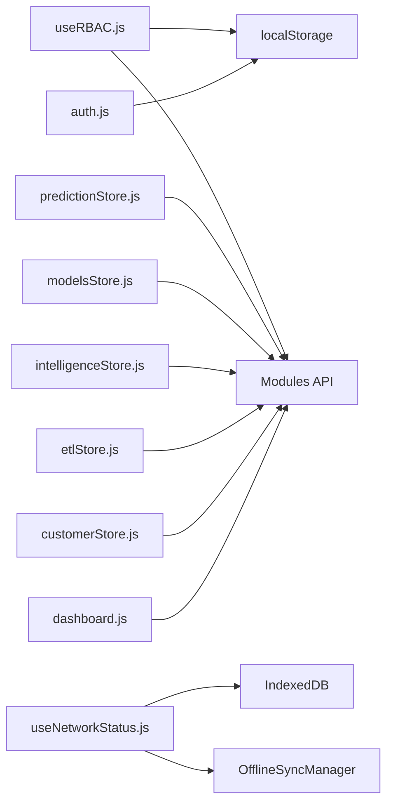

**Diagram sources**
- [auth.js:4-20](file://src/stores/auth.js#L4-L20)
- [dashboard.js:9-25](file://src/stores/dashboard.js#L9-L25)
- [customerStore.js:6-12](file://src/stores/customerStore.js#L6-L12)
- [etlStore.js:33-57](file://src/stores/etlStore.js#L33-L57)
- [intelligenceStore.js:6-11](file://src/stores/intelligenceStore.js#L6-L11)
- [modelsStore.js:6-12](file://src/stores/modelsStore.js#L6-L12)
- [predictionStore.js:6-12](file://src/stores/predictionStore.js#L6-L12)
- [useRBAC.js:144-226](file://src/composables/useRBAC.js#L144-L226)
- [useNetworkStatus.js:46-91](file://src/composables/useNetworkStatus.js#L46-L91)

**Section sources**
- [auth.js:4-20](file://src/stores/auth.js#L4-L20)
- [dashboard.js:9-25](file://src/stores/dashboard.js#L9-L25)
- [customerStore.js:6-12](file://src/stores/customerStore.js#L6-L12)
- [etlStore.js:33-57](file://src/stores/etlStore.js#L33-L57)
- [intelligenceStore.js:6-11](file://src/stores/intelligenceStore.js#L6-L11)
- [modelsStore.js:6-12](file://src/stores/modelsStore.js#L6-L12)
- [predictionStore.js:6-12](file://src/stores/predictionStore.js#L6-L12)
- [useRBAC.js:144-226](file://src/composables/useRBAC.js#L144-L226)
- [useNetworkStatus.js:46-91](file://src/composables/useNetworkStatus.js#L46-L91)

## Performance Considerations
- Prefer parallel API calls where safe (e.g., portfolio and customer list)
- Use computed properties for derived data to minimize recomputation
- Batch API requests with controlled concurrency to reduce load (e.g., prediction batch fetching)
- Cache responses locally when appropriate (e.g., UI preferences in localStorage)
- Debounce network events to avoid excessive updates
- Leverage Pinia’s lightweight store structure for efficient reactivity

[No sources needed since this section provides general guidance]

## Troubleshooting Guide
Common issues and debugging techniques:
- Authentication failures: verify token presence and Authorization headers in store interceptors
- API errors: inspect store error state and console logs; ensure fallback data is assigned when needed
- RBAC misconfigurations: check DEV_BYPASS flags and role merging logic; validate tenant roles against defaults
- Offline sync problems: review sync status and pending operations; force sync on reconnect
- Performance bottlenecks: monitor large computed recalculations and batch sizes

Tools:
- Vue DevTools for Pinia store inspection
- Browser Network tab for API request/response analysis
- Console logging in stores and composables for tracing flows

**Section sources**
- [customerStore.js:91-114](file://src/stores/customerStore.js#L91-L114)
- [intelligenceStore.js:242-288](file://src/stores/intelligenceStore.js#L242-L288)
- [useRBAC.js:144-226](file://src/composables/useRBAC.js#L144-L226)
- [useNetworkStatus.js:75-91](file://src/composables/useNetworkStatus.js#L75-L91)

## Conclusion
The ABSA Foundry Frontend has migrated to Pinia 3.0.3, adopting modern reactive patterns through composition-style stores and composables. Stores encapsulate domain state and API interactions, while composables handle cross-cutting concerns like RBAC and network status. Persistence is achieved via localStorage and IndexedDB, with robust fallbacks and offline sync. The architecture supports scalable feature growth, clear separation of concerns, and maintainable state flows.

[No sources needed since this section summarizes without analyzing specific files]

## Appendices

### Migration Notes: Vuex to Pinia
- Replaced Vuex store usage with createPinia instance in main.js
- Converted modules to Pinia defineStore with refs and computed
- Leveraged composables for shared logic previously held in Vuex modules or plugins
- Maintained backward compatibility where necessary (Vuex dependency remains but unused)

**Section sources**
- [main.js:10-16](file://src/main.js#L10-L16)
- [main.js:70-75](file://src/main.js#L70-L75)
- [package.json:50-62](file://package.json#L50-L62)