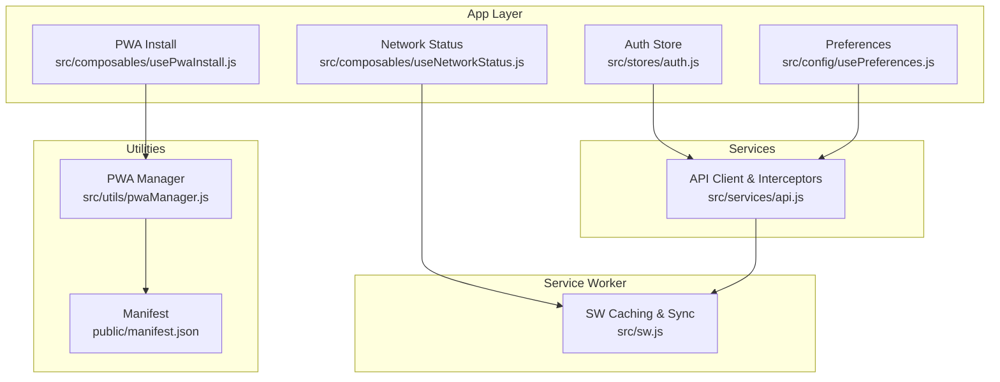
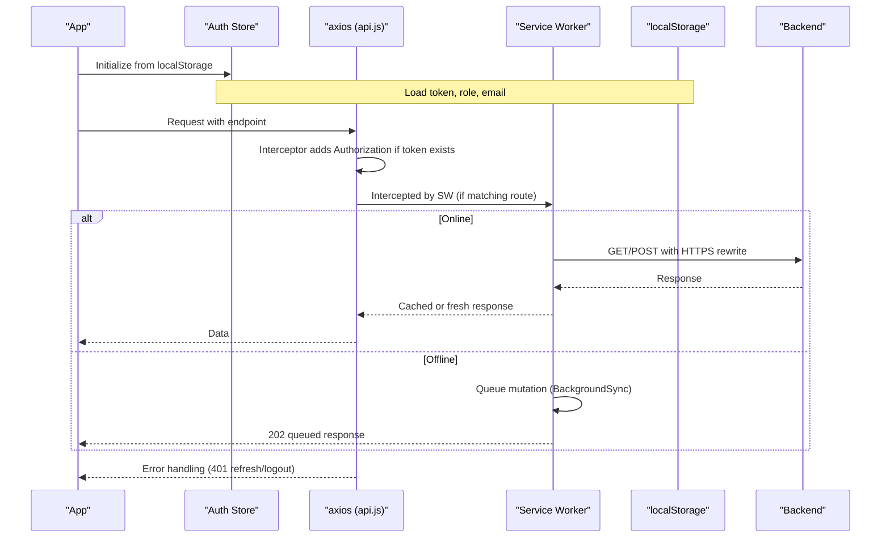
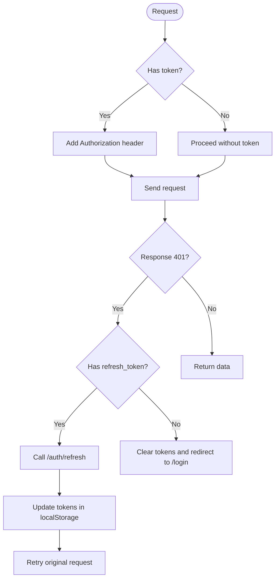
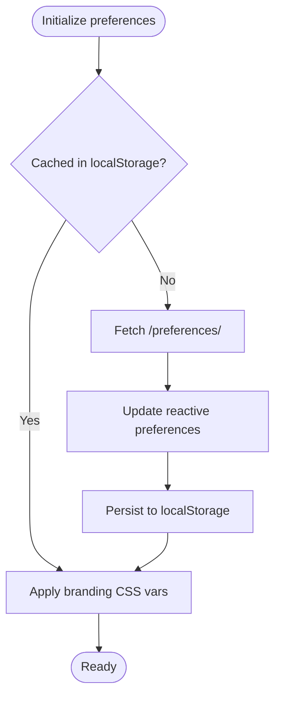
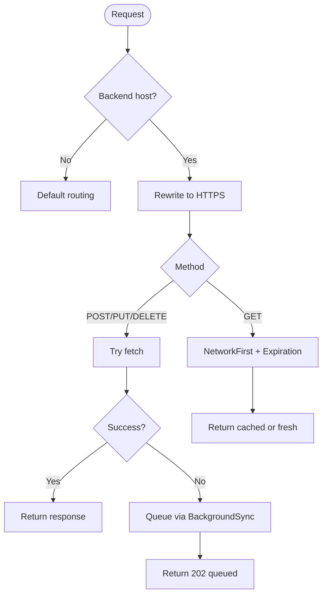
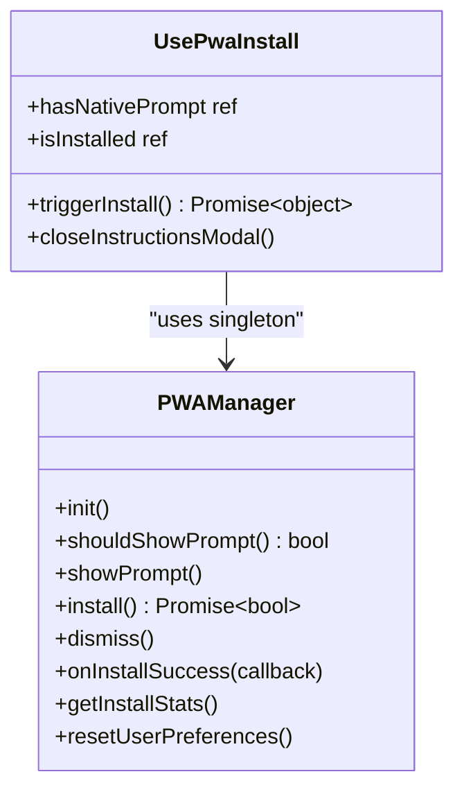
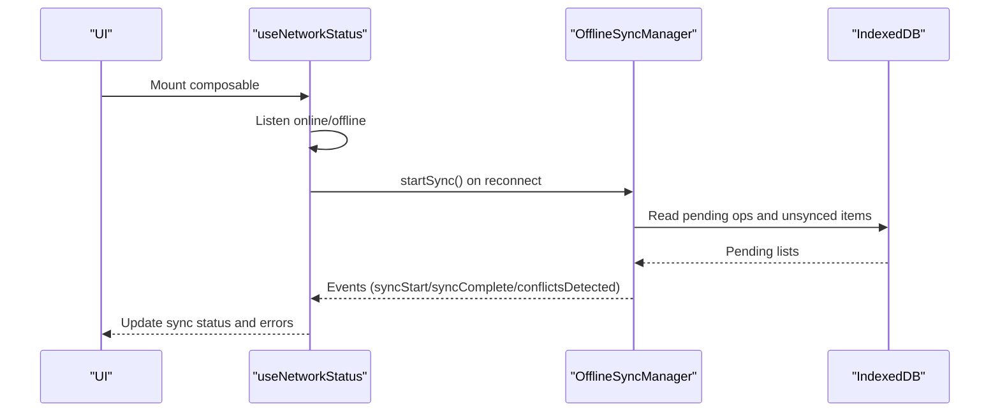
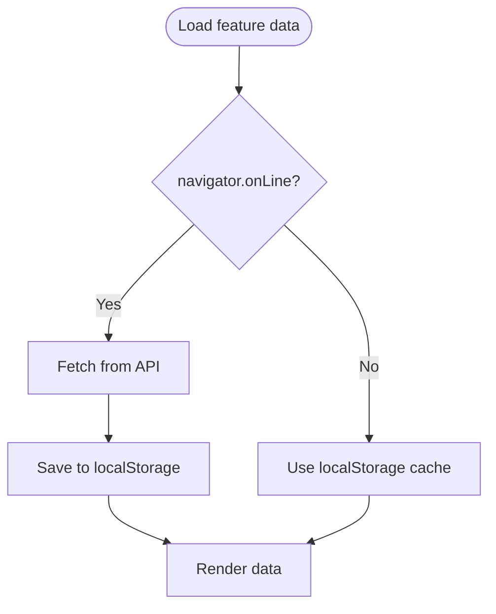
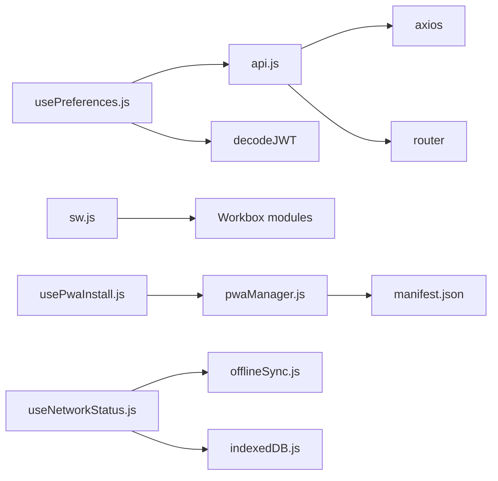

# State Persistence and Caching

<cite>
**Referenced Files in This Document**
- [api.js](file://src/services/api.js)
- [usePreferences.js](file://src/config/usePreferences.js)
- [auth.js](file://src/stores/auth.js)
- [sw.js](file://src/sw.js)
- [pwaManager.js](file://src/utils/pwaManager.js)
- [usePwaInstall.js](file://src/composables/usePwaInstall.js)
- [manifest.json](file://public/manifest.json)
- [update-sw-cache.js](file://scripts/update-sw-cache.js)
- [useNetworkStatus.js](file://src/composables/useNetworkStatus.js)
- [StrategicManagementModule.js](file://src/views/Modules/strategic/composables/StrategicManagementModule.js)
</cite>

## Table of Contents
1. [Introduction](#introduction)
2. [Project Structure](#project-structure)
3. [Core Components](#core-components)
4. [Architecture Overview](#architecture-overview)
5. [Detailed Component Analysis](#detailed-component-analysis)
6. [Dependency Analysis](#dependency-analysis)
7. [Performance Considerations](#performance-considerations)
8. [Troubleshooting Guide](#troubleshooting-guide)
9. [Conclusion](#conclusion)
10. [Appendices](#appendices)

## Introduction
This document explains how ABSA Foundry Frontend persists state across browser sessions and caches data for performance and offline resilience. It covers:
- Authentication persistence via localStorage and token refresh flows
- Preference management with usePreferences.js, including local caching and server synchronization
- PWA integration using a service worker for offline support, background sync, and asset/API caching
- API response caching strategies and request handling in api.js (interceptors, 401 handling, token refresh)
- Memory management techniques, state cleanup procedures, and performance considerations for large datasets
- Examples for implementing custom caching layers, handling cache conflicts, and debugging persistence issues

## Project Structure
The persistence and caching logic spans several layers:
- Services: HTTP client configuration, interceptors, auth helpers
- Stores: Pinia store for auth state
- Config: Preferences composable with local-first caching
- Service Worker: Workbox-based caching, background sync, offline queue
- Utilities: PWA install manager and network status composable
- Views/Composables: Feature-specific local caching patterns

**Diagram sources**
- [auth.js:1-22](file://src/stores/auth.js#L1-L22)
- [usePreferences.js:1-111](file://src/config/usePreferences.js#L1-L111)
- [useNetworkStatus.js:1-228](file://src/composables/useNetworkStatus.js#L1-L228)
- [usePwaInstall.js:1-111](file://src/composables/usePwaInstall.js#L1-L111)
- [api.js:1-209](file://src/services/api.js#L1-L209)
- [sw.js:1-224](file://src/sw.js#L1-L224)
- [pwaManager.js:1-236](file://src/utils/pwaManager.js#L1-L236)
- [manifest.json:1-24](file://public/manifest.json#L1-L24)

**Section sources**
- [auth.js:1-22](file://src/stores/auth.js#L1-L22)
- [usePreferences.js:1-111](file://src/config/usePreferences.js#L1-L111)
- [api.js:1-209](file://src/services/api.js#L1-L209)
- [sw.js:1-224](file://src/sw.js#L1-L224)
- [pwaManager.js:1-236](file://src/utils/pwaManager.js#L1-L236)
- [usePwaInstall.js:1-111](file://src/composables/usePwaInstall.js#L1-L111)
- [manifest.json:1-24](file://public/manifest.json#L1-L24)

## Core Components
- Authentication state persistence:
  - Token storage in localStorage and Pinia store initialization from localStorage
  - Automatic Authorization header injection via axios interceptor
  - 401 handling with refresh token flow and logout on failure
- Preferences:
  - Local-first load from localStorage key for fast startup
  - Server fetch to hydrate and persist preferences back to localStorage
  - Branding application via CSS variables
- Service Worker:
  - Precache assets, NetworkFirst for API GETs, CacheFirst for static assets
  - BackgroundSync for POST/PUT/DELETE when offline
  - HTTPS rewrite for backend requests to avoid mixed content
- PWA:
  - Intelligent install prompt timing and user preference tracking
  - Composable wrapper for reactive install UI

**Section sources**
- [api.js:20-146](file://src/services/api.js#L20-L146)
- [auth.js:1-22](file://src/stores/auth.js#L1-L22)
- [usePreferences.js:18-111](file://src/config/usePreferences.js#L18-L111)
- [sw.js:14-118](file://src/sw.js#L14-L118)
- [pwaManager.js:7-236](file://src/utils/pwaManager.js#L7-L236)
- [usePwaInstall.js:1-111](file://src/composables/usePwaInstall.js#L1-L111)

## Architecture Overview
The system combines multiple caching layers:
- Browser storage (localStorage) for tokens and preferences
- In-memory state (Pinia) derived from storage
- Service Worker caches for API responses and static assets
- Background sync queue for offline mutations

**Diagram sources**
- [api.js:64-146](file://src/services/api.js#L64-L146)
- [sw.js:38-118](file://src/sw.js#L38-L118)
- [auth.js:1-22](file://src/stores/auth.js#L1-L22)

## Detailed Component Analysis

### Authentication State Persistence
- Tokens are stored in localStorage under specific keys
- Axios interceptor automatically attaches Authorization headers
- On 401, the system attempts token refresh; if it fails, clears tokens and redirects to login
- Logout clears all relevant keys and navigates away

**Diagram sources**
- [api.js:64-146](file://src/services/api.js#L64-L146)

**Section sources**
- [api.js:20-146](file://src/services/api.js#L20-L146)
- [auth.js:1-22](file://src/stores/auth.js#L1-L22)

### Preferences Management (usePreferences.js)
- Loads cached preferences from localStorage first for speed
- Fetches server preferences and updates both in-memory state and localStorage
- Applies branding by setting CSS variables on the root element
- Save flow writes to server and persists to localStorage

**Diagram sources**
- [usePreferences.js:18-111](file://src/config/usePreferences.js#L18-L111)

**Section sources**
- [usePreferences.js:18-111](file://src/config/usePreferences.js#L18-L111)

### Service Worker Caching and Offline Strategy
- Precaches app shell assets
- Rewrites backend requests to HTTPS to prevent mixed content
- GET requests: NetworkFirst with short timeout and expiration policy
- Mutations (POST/PUT/DELETE): Attempt online; if offline, enqueue via BackgroundSync and return queued acknowledgment
- Static assets: StaleWhileRevalidate or CacheFirst with expiration policies
- Activation cleans old caches and claims clients immediately

**Diagram sources**
- [sw.js:38-118](file://src/sw.js#L38-L118)

**Section sources**
- [sw.js:14-118](file://src/sw.js#L14-L118)
- [sw.js:120-190](file://src/sw.js#L120-L190)
- [update-sw-cache.js:1-34](file://scripts/update-sw-cache.js#L1-L34)

### PWA Integration
- Manifest defines app metadata and icons
- pwaManager handles beforeinstallprompt, cooldowns, dismissal counts, and installation outcomes
- usePwaInstall provides reactive UI state and fallback instructions when native prompts are unavailable

**Diagram sources**
- [pwaManager.js:7-236](file://src/utils/pwaManager.js#L7-L236)
- [usePwaInstall.js:1-111](file://src/composables/usePwaInstall.js#L1-L111)
- [manifest.json:1-24](file://public/manifest.json#L1-L24)

**Section sources**
- [pwaManager.js:7-236](file://src/utils/pwaManager.js#L7-L236)
- [usePwaInstall.js:1-111](file://src/composables/usePwaInstall.js#L1-L111)
- [manifest.json:1-24](file://public/manifest.json#L1-L24)

### Network-Aware Sync and Offline Queues
- useNetworkStatus tracks online/offline events and triggers auto-sync on reconnect
- Integrates with an offline sync manager and IndexedDB to surface pending operations and unsynced items
- Provides UI feedback via toast notifications and exposes force sync capability

**Diagram sources**
- [useNetworkStatus.js:1-228](file://src/composables/useNetworkStatus.js#L1-L228)

**Section sources**
- [useNetworkStatus.js:1-228](file://src/composables/useNetworkStatus.js#L1-L228)

### Feature-Level Local Caching Patterns
- Some features implement tenant-scoped localStorage caching for quick loads and offline fallbacks
- Example: strategic module caches vision/mission and goals per tenant ID, falling back to cached values when offline

**Diagram sources**
- [StrategicManagementModule.js:167-210](file://src/views/Modules/strategic/composables/StrategicManagementModule.js#L167-L210)

**Section sources**
- [StrategicManagementModule.js:167-210](file://src/views/Modules/strategic/composables/StrategicManagementModule.js#L167-L210)

## Dependency Analysis
- api.js depends on axios and router; injects auth headers and handles 401 flows
- usePreferences depends on decodeJWT and API_BASE_URL; reads/writes localStorage
- sw.js depends on Workbox modules; manages precache, routes, and background sync
- pwaManager and usePwaInstall coordinate install UX and state
- useNetworkStatus integrates with offline sync manager and IndexedDB

**Diagram sources**
- [api.js:1-209](file://src/services/api.js#L1-L209)
- [usePreferences.js:1-111](file://src/config/usePreferences.js#L1-L111)
- [sw.js:1-224](file://src/sw.js#L1-L224)
- [pwaManager.js:1-236](file://src/utils/pwaManager.js#L1-L236)
- [usePwaInstall.js:1-111](file://src/composables/usePwaInstall.js#L1-L111)
- [useNetworkStatus.js:1-228](file://src/composables/useNetworkStatus.js#L1-L228)

**Section sources**
- [api.js:1-209](file://src/services/api.js#L1-L209)
- [usePreferences.js:1-111](file://src/config/usePreferences.js#L1-L111)
- [sw.js:1-224](file://src/sw.js#L1-L224)
- [pwaManager.js:1-236](file://src/utils/pwaManager.js#L1-L236)
- [usePwaInstall.js:1-111](file://src/composables/usePwaInstall.js#L1-L111)
- [useNetworkStatus.js:1-228](file://src/composables/useNetworkStatus.js#L1-L228)

## Performance Considerations
- Prefer local-first loading for preferences to reduce perceived latency
- Use NetworkFirst with short timeouts for API GETs to balance freshness and speed
- Expire caches aggressively for volatile data; longer TTL for stable assets
- Avoid redundant requests by leveraging axios interceptors and SW caching
- For large datasets:
  - Paginate and virtualize lists
  - Debounce search and filter inputs
  - Offload heavy computations to Web Workers where feasible
  - Clear unused references and event listeners on component unmount
- Monitor memory usage and consider periodic cache pruning for long-lived sessions

[No sources needed since this section provides general guidance]

## Troubleshooting Guide
- Authentication issues:
  - Verify token presence in localStorage and correct Authorization header injection
  - Check 401 handling path and refresh token availability
  - Ensure logout clears all relevant keys
- Preferences not applying:
  - Confirm localStorage key is set and JSON parse succeeds
  - Validate CSS variable application on root element
- Service Worker caching problems:
  - Inspect SW logs for HTTPS rewrite and strategy execution
  - Clear SW caches via message handler if needed
  - Validate cache versioning and activation cleanup
- Offline behavior:
  - Confirm BackgroundSync queues mutations and replays on reconnect
  - Use useNetworkStatus to trigger manual sync and inspect pending counts
- PWA install:
  - Ensure manifest is valid and served correctly
  - Handle cases where native prompt is unavailable by showing manual instructions

**Section sources**
- [api.js:64-146](file://src/services/api.js#L64-L146)
- [usePreferences.js:34-111](file://src/config/usePreferences.js#L34-L111)
- [sw.js:155-224](file://src/sw.js#L155-L224)
- [useNetworkStatus.js:75-91](file://src/composables/useNetworkStatus.js#L75-L91)
- [pwaManager.js:123-178](file://src/utils/pwaManager.js#L123-L178)

## Conclusion
ABSA Foundry Frontend employs a layered approach to state persistence and caching:
- Robust authentication persistence with automatic token refresh and secure header injection
- Fast, resilient preferences management with local-first caching and server synchronization
- Comprehensive PWA support via a service worker that caches assets, optimizes API access, and queues offline mutations
- Practical patterns for feature-level caching and network-aware syncing
Adhering to these strategies ensures responsive, reliable experiences even under poor connectivity while maintaining security and performance.

[No sources needed since this section summarizes without analyzing specific files]

## Appendices

### Implementing Custom Caching Layers
- Define a cache key strategy based on request parameters and entity IDs
- Implement a read-through cache: check local storage or in-memory map before issuing network requests
- On write, invalidate dependent caches and optionally queue mutations for later sync
- Use expiration policies aligned with data volatility

[No sources needed since this section provides general guidance]

### Handling Cache Conflicts
- Use timestamps or version fields to detect stale entries
- On conflict, prefer server authority and update local cache accordingly
- Provide user-facing resolution flows for critical data conflicts

[No sources needed since this section provides general guidance]

### Debugging Persistence Issues
- Inspect localStorage keys and values during runtime
- Log interceptor behavior and SW interception paths
- Use SW message handlers to clear caches and verify behavior changes
- Validate PWA manifest and install prompt lifecycle

**Section sources**
- [api.js:64-146](file://src/services/api.js#L64-L146)
- [sw.js:202-224](file://src/sw.js#L202-L224)
- [pwaManager.js:194-236](file://src/utils/pwaManager.js#L194-L236)