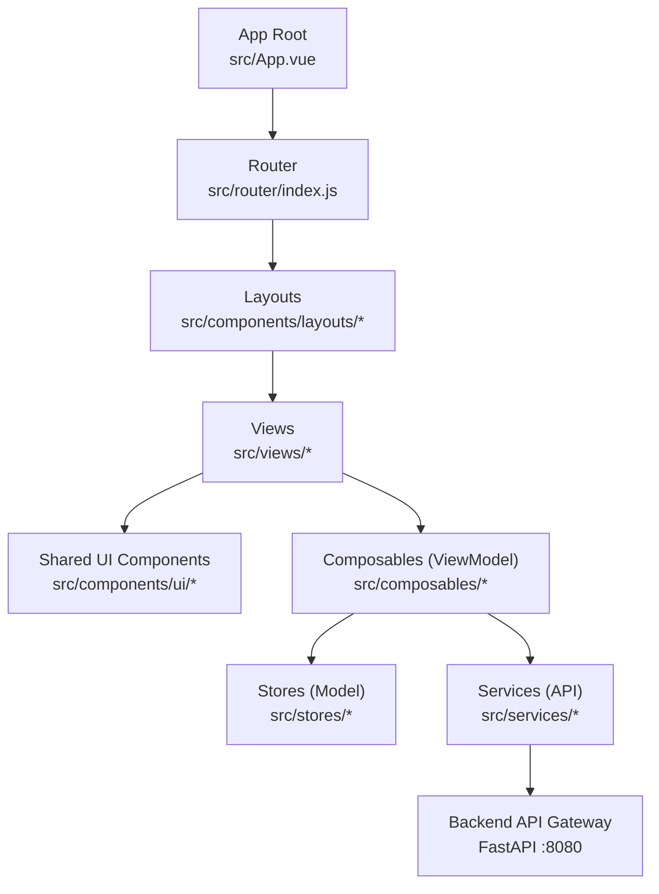
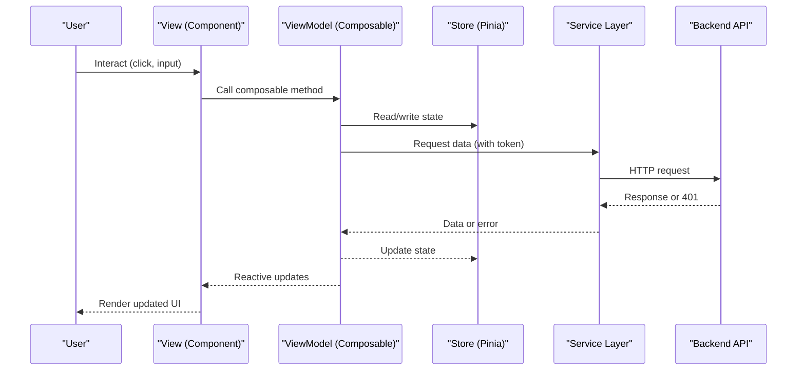
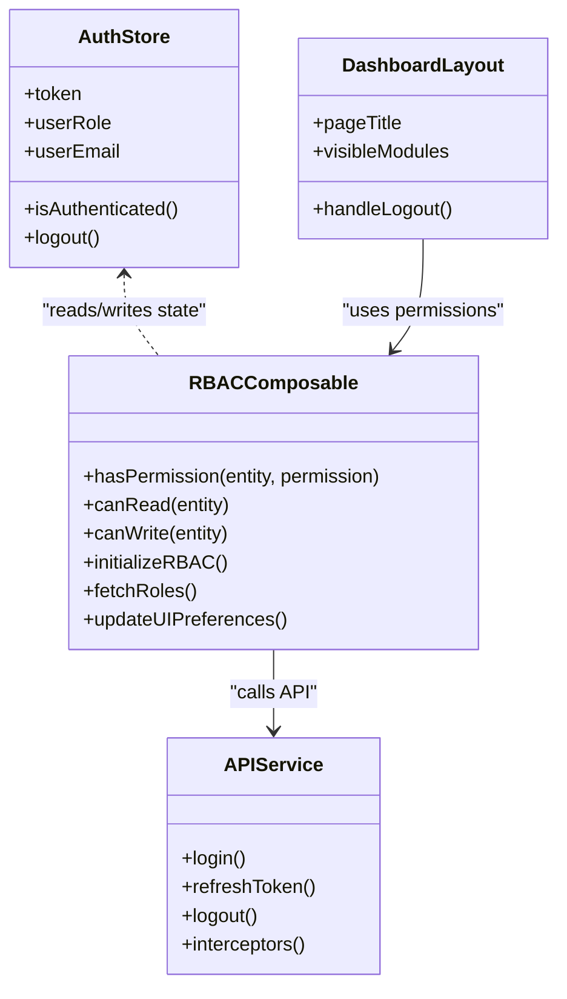
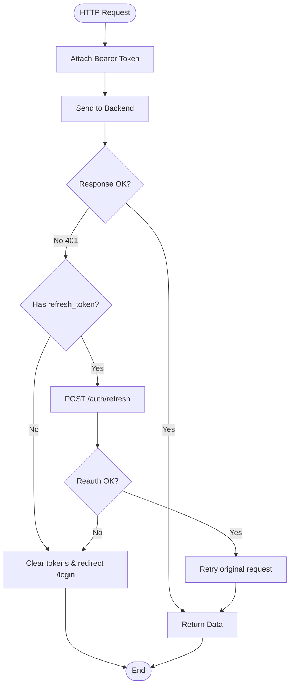
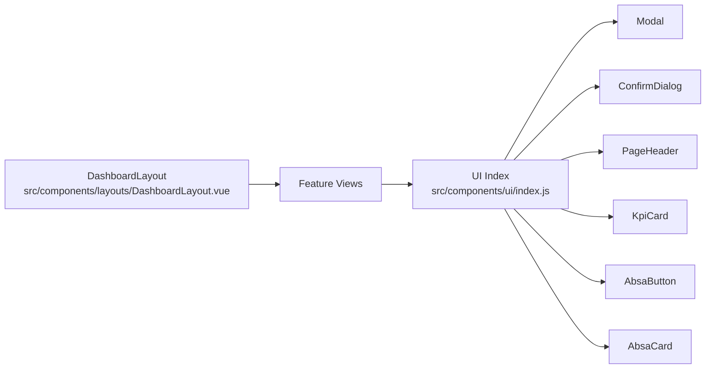
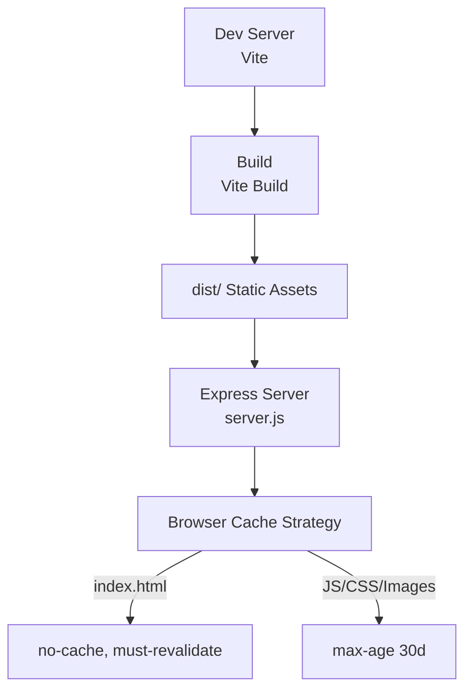
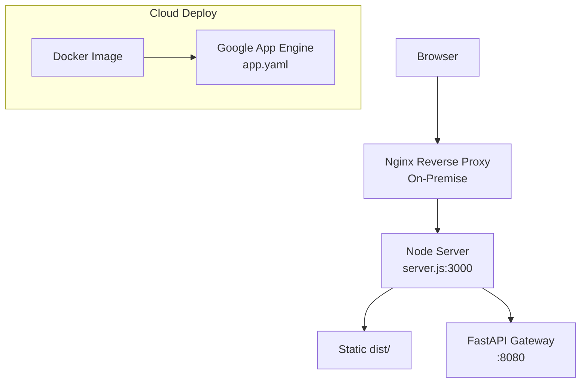
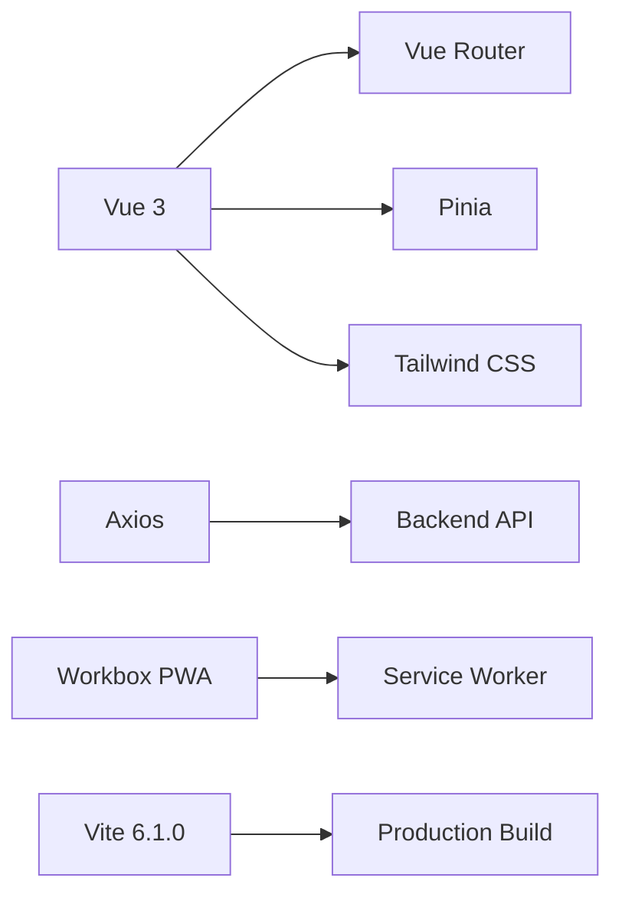

# System Architecture

<cite>
**Referenced Files in This Document**
- [package.json](file://package.json)
- [vite.config.js](file://vite.config.js)
- [Dockerfile](file://Dockerfile)
- [README.md](file://README.md)
- [src/main.js](file://src/main.js)
- [src/App.vue](file://src/App.vue)
- [src/router/index.js](file://src/router/index.js)
- [src/services/api.js](file://src/services/api.js)
- [src/services/auth_api.js](file://src/services/auth_api.js)
- [src/stores/auth.js](file://src/stores/auth.js)
- [src/composables/useRBAC.js](file://src/composables/useRBAC.js)
- [src/components/layouts/DashboardLayout.vue](file://src/components/layouts/DashboardLayout.vue)
- [src/components/ui/index.js](file://src/components/ui/index.js)
- [src/config/moduleCards.js](file://src/config/moduleCards.js)
- [server.js](file://server.js)
- [app.yaml](file://app.yaml)
- [cloudbuild.yaml](file://cloudbuild.yaml)
</cite>

## Table of Contents
1. Introduction
2. Project Structure
3. Core Components
4. Architecture Overview
5. Detailed Component Analysis
6. Dependency Analysis
7. Performance Considerations
8. Troubleshooting Guide
9. Conclusion
10. Appendices

## Introduction
This document describes the system architecture of the ABSA Foundry Frontend, an enterprise-grade Vue 3 application built with the Composition API and Vite. It explains how the MVVM pattern is implemented through Model (stores/services), View (components/views), and ViewModel (composables), details the service-oriented architecture for backend communication, outlines component-based design principles, documents the build pipeline and asset optimization, and provides deployment guidance including Nginx reverse proxy patterns, Docker containerization, and air-gapped on-premise considerations. It also covers scalability patterns suitable for enterprise banking workloads with multiple concurrent users and large datasets.

## Project Structure
The frontend follows a layered, feature-oriented structure:
- Views and layouts define user-facing pages and shells.
- Shared UI components live under src/components/ui; layout components under src/components/layouts.
- Composables encapsulate reusable logic (ViewModel layer).
- Stores manage global state (Model layer).
- Services abstract HTTP calls to the backend (API services).
- Configuration centralizes routing metadata, RBAC definitions, and module cards.

**Diagram sources**
- [src/App.vue:90-170](file://src/App.vue#L90-L170)
- [src/router/index.js:196-275](file://src/router/index.js#L196-L275)
- [src/components/layouts/DashboardLayout.vue:99-170](file://src/components/layouts/DashboardLayout.vue#L99-L170)
- [src/composables/useRBAC.js:55-120](file://src/composables/useRBAC.js#L55-L120)
- [src/stores/auth.js:1-22](file://src/stores/auth.js#L1-L22)
- [src/services/api.js:1-40](file://src/services/api.js#L1-L40)

**Section sources**
- [README.md:47-148](file://README.md#L47-L148)
- [src/components/ui/index.js:1-22](file://src/components/ui/index.js#L1-L22)

## Core Components
- Application bootstrap and PWA registration: The app initializes Pinia, router, plugins, and registers the service worker based on environment flags.
- Root shell and global behaviors: The root component orchestrates session checks, currency initialization, preferences, RBAC setup, and PWA prompts.
- Routing and guards: Centralized route guard enforces authentication and subscription/module access rules.
- Service layer: Axios interceptors attach tokens, handle 401 refresh flows, and provide centralized auth endpoints.
- State management: Pinia store holds token and user context; legacy Vuex references remain but are not active.
- RBAC composable: Provides role-based permission checks, tenant roles/organizations, and UI preferences management.
- Layouts: Dashboard layout renders header, navigation, and page content with dynamic module visibility.

**Section sources**
- [src/main.js:1-129](file://src/main.js#L1-L129)
- [src/App.vue:90-170](file://src/App.vue#L90-L170)
- [src/router/index.js:201-275](file://src/router/index.js#L201-L275)
- [src/services/api.js:64-146](file://src/services/api.js#L64-L146)
- [src/stores/auth.js:1-22](file://src/stores/auth.js#L1-L22)
- [src/composables/useRBAC.js:55-120](file://src/composables/useRBAC.js#L55-L120)
- [src/components/layouts/DashboardLayout.vue:99-170](file://src/components/layouts/DashboardLayout.vue#L99-L170)

## Architecture Overview
The application implements an MVVM-like separation using Vue 3 Composition API:
- Model: Pinia stores and service modules encapsulate data and backend interactions.
- View: Vue components and views render UI; shared UI primitives ensure consistency.
- ViewModel: Composables provide reactive state and business logic bridging View and Model.

**Diagram sources**
- [src/composables/useRBAC.js:55-120](file://src/composables/useRBAC.js#L55-L120)
- [src/services/api.js:64-146](file://src/services/api.js#L64-L146)
- [src/stores/auth.js:1-22](file://src/stores/auth.js#L1-L22)

## Detailed Component Analysis

### MVVM Pattern Implementation
- Model (Stores + Services):
  - Pinia store maintains authentication state and user attributes.
  - Services centralize HTTP requests, token handling, and error strategies.
- View (Components + Views):
  - Shared UI components provide consistent primitives.
  - Layouts compose page shells; views implement feature-specific screens.
- ViewModel (Composables):
  - useRBAC encapsulates permissions, roles, organizations, and UI preferences.
  - Other composables offer cross-cutting concerns like export, network status, and PWA install.

**Diagram sources**
- [src/stores/auth.js:1-22](file://src/stores/auth.js#L1-L22)
- [src/services/api.js:166-209](file://src/services/api.js#L166-L209)
- [src/composables/useRBAC.js:55-120](file://src/composables/useRBAC.js#L55-L120)
- [src/components/layouts/DashboardLayout.vue:99-170](file://src/components/layouts/DashboardLayout.vue#L99-L170)

**Section sources**
- [src/stores/auth.js:1-22](file://src/stores/auth.js#L1-L22)
- [src/services/api.js:1-40](file://src/services/api.js#L1-L40)
- [src/composables/useRBAC.js:55-120](file://src/composables/useRBAC.js#L55-L120)
- [src/components/layouts/DashboardLayout.vue:99-170](file://src/components/layouts/DashboardLayout.vue#L99-L170)

### Service-Oriented Architecture
- Centralized API base URL resolution supports local dev and hosted backends.
- Axios interceptors add Authorization headers and handle 401 refresh flows with queuing to avoid race conditions.
- Dedicated auth service exposes login, refresh, signup, and profile operations.
- Module configuration drives dynamic navigation and subscription gating.

**Diagram sources**
- [src/services/api.js:64-146](file://src/services/api.js#L64-L146)
- [src/services/auth_api.js:1-143](file://src/services/auth_api.js#L1-L143)

**Section sources**
- [src/services/api.js:1-40](file://src/services/api.js#L1-L40)
- [src/services/auth_api.js:1-143](file://src/services/auth_api.js#L1-L143)

### Component-Based Design Principles
- Shared UI components:
  - Exported via a single index for easy imports across modules.
  - Include modals, dialogs, KPI cards, section headers, and brand elements.
- Layout components:
  - DashboardLayout provides top navigation, search, user info, and dynamic module visibility.
- Module-specific components:
  - Scoped within feature folders (e.g., CRM, AI Agents, Strategic Management) to maintain loose coupling.

**Diagram sources**
- [src/components/ui/index.js:1-22](file://src/components/ui/index.js#L1-L22)
- [src/components/layouts/DashboardLayout.vue:99-170](file://src/components/layouts/DashboardLayout.vue#L99-L170)

**Section sources**
- [src/components/ui/index.js:1-22](file://src/components/ui/index.js#L1-L22)
- [src/components/layouts/DashboardLayout.vue:99-170](file://src/components/layouts/DashboardLayout.vue#L99-L170)

### Build Pipeline and Asset Optimization
- Vite configuration:
  - Uses Vue plugin, dev tools, and PWA injection manifest strategy.
  - Sets alias for @ to src, optimizes specific dependencies, and configures build targets.
  - Disables minification and CSS code splitting in build settings for this project’s needs.
- PWA:
  - Injects manifest and service worker; includes icons and assets; supports auto-update and periodic sync.
- Production server:
  - Express serves static dist with aggressive caching for hashed assets and no-cache for index.html to ensure fresh loads.

**Diagram sources**
- [vite.config.js:7-40](file://vite.config.js#L7-L40)
- [server.js:22-61](file://server.js#L22-L61)

**Section sources**
- [vite.config.js:7-40](file://vite.config.js#L7-L40)
- [server.js:22-61](file://server.js#L22-L61)

### Deployment Architecture
- Containerization:
  - Multi-stage Docker build installs build-time deps, sets npm registry/retries, builds the app, and runs a Node server serving dist.
- App Engine:
  - app.yaml serves static files from dist and falls back to index.html for SPA routing.
- CI/CD:
  - cloudbuild.yaml installs dependencies, builds without cache, and deploys to Google App Engine.
- On-premise/Nginx:
  - README indicates Ubuntu + Nginx serving dist with reverse proxy to FastAPI Gateway (:8080).

**Diagram sources**
- [Dockerfile:1-71](file://Dockerfile#L1-L71)
- [app.yaml:1-12](file://app.yaml#L1-L12)
- [cloudbuild.yaml:1-19](file://cloudbuild.yaml#L1-L19)
- [README.md:527-536](file://README.md#L527-L536)

**Section sources**
- [Dockerfile:1-71](file://Dockerfile#L1-L71)
- [app.yaml:1-12](file://app.yaml#L1-L12)
- [cloudbuild.yaml:1-19](file://cloudbuild.yaml#L1-L19)
- [README.md:527-536](file://README.md#L527-L536)

## Dependency Analysis
- Framework and tooling:
  - Vue 3, Vue Router, Pinia, Tailwind CSS, Chart.js, Axios, Workbox PWA, Vite 6.1.0.
- Key runtime dependencies:
  - Authentication and JWT decoding utilities.
  - PDF/Excel generation libraries for reporting.
  - Barcode detection and scanning libraries.
- Build-time dependencies:
  - Vite plugins for Vue, PWA, and federation support.
  - Testing tools (Vitest, Playwright, Vue Test Utils).

**Diagram sources**
- [package.json:13-88](file://package.json#L13-L88)

**Section sources**
- [package.json:13-88](file://package.json#L13-L88)

## Performance Considerations
- Code splitting:
  - Route-level lazy loading reduces initial bundle size and improves time-to-interactive.
- Caching strategy:
  - index.html served with no-cache to always fetch latest asset references; other assets cached aggressively due to content hashing.
- PWA:
  - Service worker enables offline readiness and background sync where supported.
- Network resilience:
  - Token refresh queue prevents duplicate refresh attempts during concurrent 401 responses.
- Build optimizations:
  - Target esnext, disable minification per config, and optimize specific heavy dependencies.

[No sources needed since this section provides general guidance]

## Troubleshooting Guide
- Authentication issues:
  - Ensure token and refresh_token are present; verify 401 handling redirects to login when refresh fails.
- Service Worker problems:
  - Use DEV_BYPASS flag to skip SW registration in development; clear existing registrations and caches if necessary.
- Version mismatches:
  - Check version.json at startup to trigger SW update when new version detected.
- Module access errors:
  - Verify RBAC roles and subscriptions; confirm allowed modules list and role-based visibility.

**Section sources**
- [src/services/api.js:90-146](file://src/services/api.js#L90-L146)
- [src/main.js:35-67](file://src/main.js#L35-L67)
- [src/App.vue:105-122](file://src/App.vue#L105-L122)
- [src/router/index.js:227-265](file://src/router/index.js#L227-L265)

## Conclusion
The ABSA Foundry Frontend employs a robust MVVM-like architecture using Vue 3 Composition API, with clear separation between Model (stores/services), View (components/views), and ViewModel (composables). The service-oriented API layer centralizes authentication, token refresh, and backend communication. Component-based design ensures reusability and maintainability through shared UI primitives and scoped feature modules. The build pipeline leverages Vite 6.1.0 with PWA support, while deployment options include Docker containerization, Google App Engine, and on-premise Nginx setups. Scalability patterns such as route-based code splitting, efficient caching, and resilient network handling support enterprise banking workloads with high concurrency and large datasets.

[No sources needed since this section summarizes without analyzing specific files]

## Appendices

### Environment Variables and Configuration
- VITE_API_BASE_URL: Backend API base URL used by services.
- VITE_DEV_BYPASS: Skips service worker registration and certain auth checks in development.
- VITE_GOOGLE_CLIENT_ID: Optional OAuth client ID for Google login integration.

**Section sources**
- [README.md:486-494](file://README.md#L486-L494)
- [vite.config.js:11-35](file://vite.config.js#L11-L35)

### Module Navigation and Subscription Control
- Module cards define routes, titles, and subscription requirements.
- Dashboard layout filters visible modules based on subscriptions and permissions.

**Section sources**
- [src/config/moduleCards.js:13-51](file://src/config/moduleCards.js#L13-L51)
- [src/components/layouts/DashboardLayout.vue:169-232](file://src/components/layouts/DashboardLayout.vue#L169-L232)