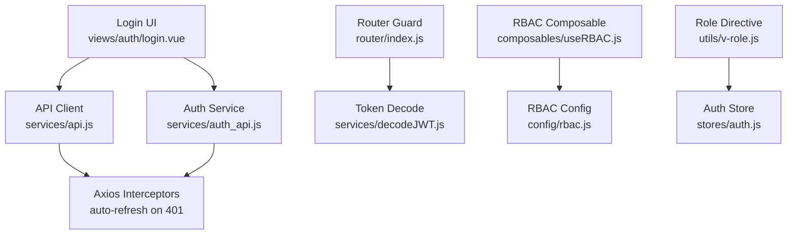
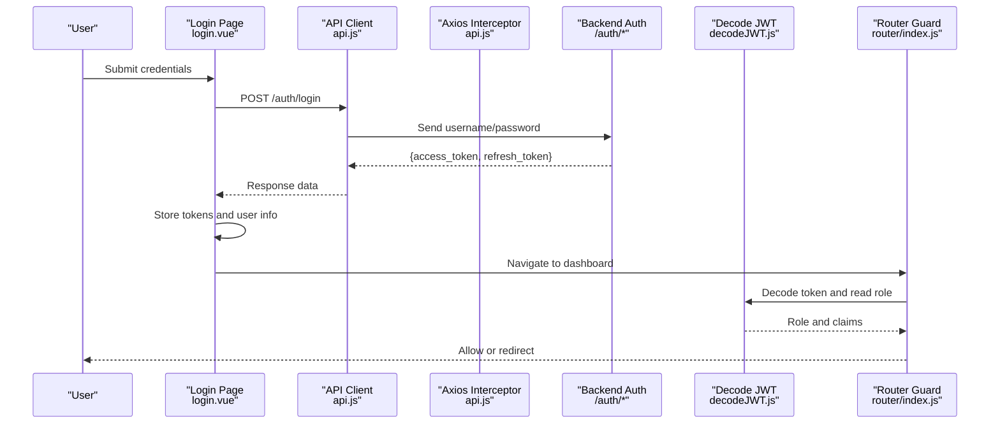
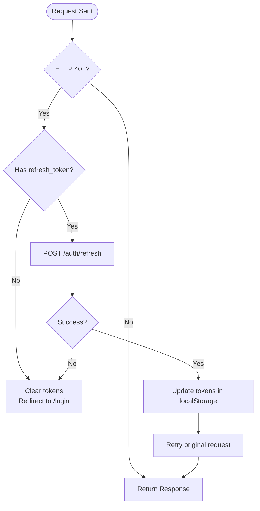
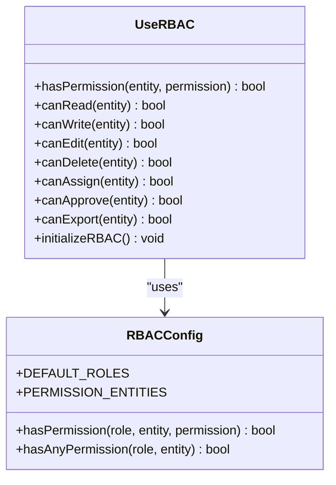
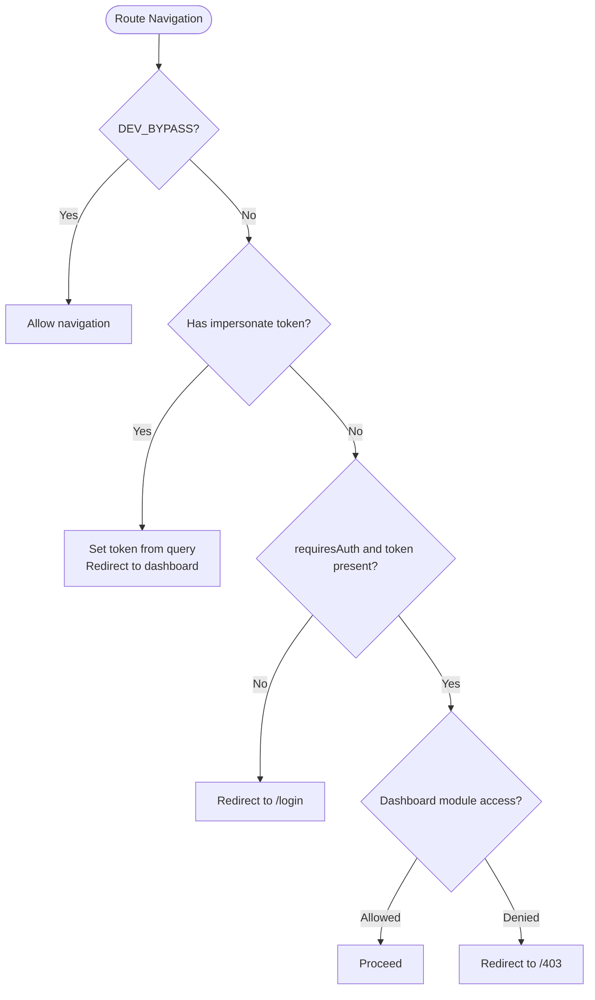
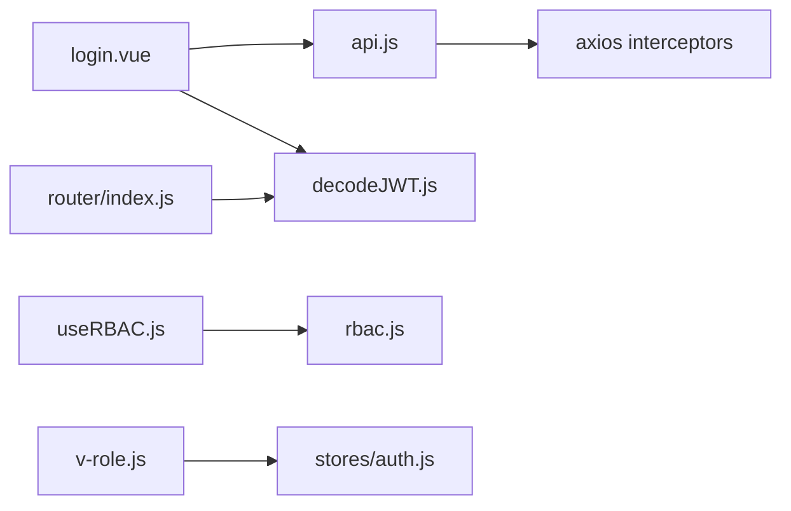

# Authentication & Authorization

<cite>
**Referenced Files in This Document**
- [login.vue](file://src/views/auth/login.vue)
- [api.js](file://src/services/api.js)
- [auth_api.js](file://src/services/auth_api.js)
- [decodeJWT.js](file://src/services/decodeJWT.js)
- [index.js](file://src/router/index.js)
- [useRBAC.js](file://src/composables/useRBAC.js)
- [rbac.js](file://src/config/rbac.js)
- [v-role.js](file://src/utils/v-role.js)
- [devFlags.js](file://src/config/devFlags.js)
- [AUTH-INTEGRATION.md](file://docs/AUTH-INTEGRATION.md)
</cite>

## Table of Contents
1. Introduction
2. Project Structure
3. Core Components
4. Architecture Overview
5. Detailed Component Analysis
6. Dependency Analysis
7. Performance Considerations
8. Troubleshooting Guide
9. Conclusion
10. Appendices

## Introduction
This document explains the ABSA Foundry Frontend authentication and authorization system. It covers JWT-based login/logout, token storage and automatic refresh, session persistence, role-based access control (RBAC), route guards, permission checks, security considerations, and guidance for extending or customizing flows. Where applicable, it references concrete implementation files to help you locate the code quickly.

## Project Structure
Authentication and authorization are implemented across several layers:
- Login UI and flow: views/auth/login.vue
- API clients and interceptors: services/api.js, services/auth_api.js
- Token decoding and logout helpers: services/decodeJWT.js
- Route-level guards: router/index.js
- RBAC configuration and utilities: config/rbac.js, composables/useRBAC.js
- Role-based directive: utils/v-role.js
- Development bypass flags: config/devFlags.js
- Integration spec and examples: docs/AUTH-INTEGRATION.md

**Diagram sources**
- [login.vue:180-248](file://src/views/auth/login.vue#L180-L248)
- [api.js:64-146](file://src/services/api.js#L64-L146)
- [auth_api.js:36-87](file://src/services/auth_api.js#L36-L87)
- [decodeJWT.js:11-96](file://src/services/decodeJWT.js#L11-L96)
- [index.js:201-272](file://src/router/index.js#L201-L272)
- [useRBAC.js:55-137](file://src/composables/useRBAC.js#L55-L137)
- [rbac.js:85-337](file://src/config/rbac.js#L85-L337)
- [v-role.js:1-12](file://src/utils/v-role.js#L1-L12)

**Section sources**
- [login.vue:180-248](file://src/views/auth/login.vue#L180-L248)
- [api.js:64-146](file://src/services/api.js#L64-L146)
- [auth_api.js:36-87](file://src/services/auth_api.js#L36-L87)
- [decodeJWT.js:11-96](file://src/services/decodeJWT.js#L11-L96)
- [index.js:201-272](file://src/router/index.js#L201-L272)
- [useRBAC.js:55-137](file://src/composables/useRBAC.js#L55-L137)
- [rbac.js:85-337](file://src/config/rbac.js#L85-L337)
- [v-role.js:1-12](file://src/utils/v-role.js#L1-L12)

## Core Components
- Login flow: The login page validates inputs, calls the backend /auth/login, stores tokens and user metadata, then navigates to the dashboard.
- Token management: Axios request/response interceptors attach the Bearer token and automatically refresh on 401 using a queue mechanism.
- Session persistence: Tokens and user info are persisted in localStorage; decoded claims are used throughout the app.
- RBAC: Centralized role definitions and permission checks via a composable that reads roles from the backend and merges with defaults.
- Route guards: Router-level checks enforce authentication and module-level access rules before rendering protected routes.
- Directive-based visibility: A simple v-role directive can hide DOM nodes based on the current user’s role.

**Section sources**
- [login.vue:180-248](file://src/views/auth/login.vue#L180-L248)
- [api.js:64-146](file://src/services/api.js#L64-L146)
- [auth_api.js:36-87](file://src/services/auth_api.js#L36-L87)
- [decodeJWT.js:11-96](file://src/services/decodeJWT.js#L11-L96)
- [index.js:201-272](file://src/router/index.js#L201-L272)
- [useRBAC.js:55-137](file://src/composables/useRBAC.js#L55-L137)
- [rbac.js:85-337](file://src/config/rbac.js#L85-L337)
- [v-role.js:1-12](file://src/utils/v-role.js#L1-L12)

## Architecture Overview
The authentication architecture follows a layered approach:
- UI layer triggers login and displays errors/success states.
- Services layer handles HTTP requests, token storage, and auto-refresh.
- Router enforces navigation-level access control.
- RBAC provides fine-grained permissions per entity and role.
- Utilities provide helper functions for token decoding and role-based directives.

**Diagram sources**
- [login.vue:180-248](file://src/views/auth/login.vue#L180-L248)
- [api.js:166-200](file://src/services/api.js#L166-L200)
- [api.js:64-146](file://src/services/api.js#L64-L146)
- [decodeJWT.js:11-96](file://src/services/decodeJWT.js#L11-L96)
- [index.js:201-272](file://src/router/index.js#L201-L272)

## Detailed Component Analysis

### JWT-Based Authentication Flow
- Login: The login form calls the backend /auth/login endpoint and stores both access and refresh tokens along with user metadata.
- Token attachment: An axios request interceptor adds the Authorization header for all subsequent requests.
- Automatic refresh: On receiving a 401, the response interceptor attempts to refresh the token using the stored refresh token. If successful, it retries the original request; otherwise, it clears tokens and redirects to login.
- Logout: Multiple logout paths exist:
  - decodeJWT.logout() revokes the token on the backend and clears local state.
  - api.js logout calls the backend and clears localStorage.
  - auth_api.js logout clears email and token and redirects.

**Diagram sources**
- [api.js:64-146](file://src/services/api.js#L64-L146)
- [api.js:166-200](file://src/services/api.js#L166-L200)
- [decodeJWT.js:66-96](file://src/services/decodeJWT.js#L66-L96)
- [auth_api.js:64-87](file://src/services/auth_api.js#L64-L87)

**Section sources**
- [login.vue:180-248](file://src/views/auth/login.vue#L180-L248)
- [api.js:64-146](file://src/services/api.js#L64-L146)
- [api.js:166-200](file://src/services/api.js#L166-L200)
- [decodeJWT.js:66-96](file://src/services/decodeJWT.js#L66-L96)
- [auth_api.js:36-87](file://src/services/auth_api.js#L36-L87)

### Token Storage and Session Persistence
- Tokens are stored in localStorage under keys such as token and refresh_token.
- User metadata (role, email, user_id, name, company_name, tenant_id) is also persisted after login.
- The auth store initializes state from localStorage and exposes an isAuthenticated getter.
- decodeJWT provides helpers to extract claims and perform logout, including clearing branch-related data.

Security note: Storing tokens in localStorage is convenient but susceptible to XSS if untrusted content is rendered. Prefer HttpOnly cookies where possible and ensure strict CSP and sanitization.

**Section sources**
- [login.vue:213-218](file://src/views/auth/login.vue#L213-L218)
- [auth_api.js:45-51](file://src/services/auth_api.js#L45-L51)
- [api.js:166-200](file://src/services/api.js#L166-L200)
- [decodeJWT.js:66-96](file://src/services/decodeJWT.js#L66-L96)
- [auth.js:1-22](file://src/stores/auth.js#L1-L22)

### Role-Based Access Control (RBAC)
- Roles and permissions are defined centrally in rbac.js with default roles and entities.
- useRBAC composable loads tenant-specific roles from the backend, merges with defaults, and exposes permission-checking methods like hasPermission, canRead, canWrite, etc.
- Special handling exists for owner/admin/super_admin roles to bypass checks when appropriate.
- The v-role directive can remove elements from the DOM if the current user’s role does not include the required role.

**Diagram sources**
- [useRBAC.js:55-137](file://src/composables/useRBAC.js#L55-L137)
- [rbac.js:85-337](file://src/config/rbac.js#L85-L337)

**Section sources**
- [useRBAC.js:55-137](file://src/composables/useRBAC.js#L55-L137)
- [rbac.js:85-337](file://src/config/rbac.js#L85-L337)
- [v-role.js:1-12](file://src/utils/v-role.js#L1-L12)

### Route Guards and Module-Level Access Control
- The router guard enforces authentication for routes marked requiresAuth and performs module-level checks for dashboard sub-routes.
- It decodes the JWT to determine the user role and consults available modules and allowed modules stored locally to decide access.
- Impersonation support allows setting a token via URL query parameter for development/testing.

**Diagram sources**
- [index.js:201-272](file://src/router/index.js#L201-L272)
- [decodeJWT.js:11-96](file://src/services/decodeJWT.js#L11-L96)

**Section sources**
- [index.js:201-272](file://src/router/index.js#L201-L272)
- [decodeJWT.js:11-96](file://src/services/decodeJWT.js#L11-L96)

### Security Considerations
- Token storage: Tokens are stored in localStorage. For enhanced security, consider using HttpOnly cookies and CSRF protection at the server level.
- XSS prevention: Avoid rendering untrusted HTML; sanitize user input; implement a strict Content Security Policy.
- CSRF protection: Ensure the backend enforces CSRF validation for state-changing endpoints and uses SameSite cookies where applicable.
- Secure API communication: All API calls use HTTPS in production; the base URL resolves to a hosted backend outside localhost.
- Dev bypass: Development mode can bypass auth checks; ensure this flag is disabled in production.

**Section sources**
- [api.js:1-18](file://src/services/api.js#L1-L18)
- [devFlags.js:1-28](file://src/config/devFlags.js#L1-L28)

### Google OAuth Integration
- No explicit Google OAuth integration was found in the analyzed files.
- To add Google OAuth:
  - Create a new login method that redirects to Google’s OAuth endpoint and handles the callback.
  - Exchange the authorization code for tokens via your backend and store them similarly to the existing JWT flow.
  - Update the router guard and RBAC initialization to handle OAuth-derived roles and permissions.
  - Extend the login UI to offer a “Sign in with Google” option.

[No sources needed since this section proposes conceptual changes without analyzing specific files]

### Practical Examples

#### Implementing a Custom Authentication Flow
- Add a new service function to call your provider’s login endpoint and store tokens consistently with the existing pattern.
- Update the login UI to call the new service and handle success/failure states.
- Ensure the router guard recognizes the new token format and role claims.

**Section sources**
- [login.vue:180-248](file://src/views/auth/login.vue#L180-L248)
- [api.js:166-200](file://src/services/api.js#L166-L200)
- [index.js:201-272](file://src/router/index.js#L201-L272)

#### Extending RBAC Permissions
- Define new permission types and entities in rbac.js.
- Update default roles or allow backend-provided custom roles to override defaults.
- Use useRBAC’s hasPermission and related helpers in components to gate features.

**Section sources**
- [rbac.js:8-41](file://src/config/rbac.js#L8-L41)
- [useRBAC.js:55-137](file://src/composables/useRBAC.js#L55-L137)

#### Handling Authentication Errors
- Login errors are displayed in the login UI with user-friendly messages.
- Token refresh failures clear tokens and redirect to login.
- Route guards redirect unauthorized users to /login or /403 as appropriate.

**Section sources**
- [login.vue:241-248](file://src/views/auth/login.vue#L241-L248)
- [api.js:90-146](file://src/services/api.js#L90-L146)
- [index.js:222-265](file://src/router/index.js#L222-L265)

## Dependency Analysis
Key dependencies and relationships:
- Login UI depends on API client and decodeJWT for token handling and navigation.
- API client depends on axios interceptors for token attachment and refresh logic.
- Router guard depends on decodeJWT to read roles and claims.
- RBAC composable depends on rbac configuration and fetches tenant roles from the backend.
- v-role directive depends on the auth store to check roles.

**Diagram sources**
- [login.vue:180-248](file://src/views/auth/login.vue#L180-L248)
- [api.js:64-146](file://src/services/api.js#L64-L146)
- [decodeJWT.js:11-96](file://src/services/decodeJWT.js#L11-L96)
- [index.js:201-272](file://src/router/index.js#L201-L272)
- [useRBAC.js:55-137](file://src/composables/useRBAC.js#L55-L137)
- [rbac.js:85-337](file://src/config/rbac.js#L85-L337)
- [v-role.js:1-12](file://src/utils/v-role.js#L1-L12)

**Section sources**
- [login.vue:180-248](file://src/views/auth/login.vue#L180-L248)
- [api.js:64-146](file://src/services/api.js#L64-L146)
- [decodeJWT.js:11-96](file://src/services/decodeJWT.js#L11-L96)
- [index.js:201-272](file://src/router/index.js#L201-L272)
- [useRBAC.js:55-137](file://src/composables/useRBAC.js#L55-L137)
- [rbac.js:85-337](file://src/config/rbac.js#L85-L337)
- [v-role.js:1-12](file://src/utils/v-role.js#L1-L12)

## Performance Considerations
- Minimize redundant refresh calls by queuing concurrent requests during token refresh.
- Cache roles and UI preferences locally to reduce network calls on startup.
- Use lazy loading for routes and components to reduce initial bundle size.
- Avoid heavy computations in route guards; keep checks lightweight and rely on cached roles.

[No sources needed since this section provides general guidance]

## Troubleshooting Guide
Common issues and debugging techniques:
- Invalid credentials: Verify username/password and ensure the backend returns expected claims.
- Token expired: Check that refresh_token exists and the /auth/refresh endpoint responds correctly.
- Unauthorized access: Confirm route meta flags and module permissions; verify role claims in the token.
- Dev bypass: Ensure DEV_BYPASS is disabled in production to avoid unintended access.

Use browser dev tools to inspect:
- Network tab for /auth/* requests and responses.
- LocalStorage for token and user metadata.
- Console logs for decodeJWT warnings and errors.

**Section sources**
- [login.vue:241-248](file://src/views/auth/login.vue#L241-L248)
- [api.js:90-146](file://src/services/api.js#L90-L146)
- [decodeJWT.js:11-96](file://src/services/decodeJWT.js#L11-L96)
- [devFlags.js:1-28](file://src/config/devFlags.js#L1-L28)

## Conclusion
The ABSA Foundry Frontend implements a robust JWT-based authentication and RBAC system with automatic token refresh, centralized role management, and route-level guards. While Google OAuth is not currently integrated, the architecture supports adding alternative authentication methods. Security should be reinforced by moving tokens to HttpOnly cookies and enforcing strict XSS/CSRF protections. RBAC can be extended through backend-provided roles and frontend permission checks.

[No sources needed since this section summarizes without analyzing specific files]

## Appendices

### API Endpoints Reference
- Login: POST /auth/login
- Refresh: POST /auth/refresh
- Logout: GET/POST /auth/logout (varies by implementation)

For detailed request/response formats and error codes, see the integration guide.

**Section sources**
- [AUTH-INTEGRATION.md:14-73](file://docs/AUTH-INTEGRATION.md#L14-L73)