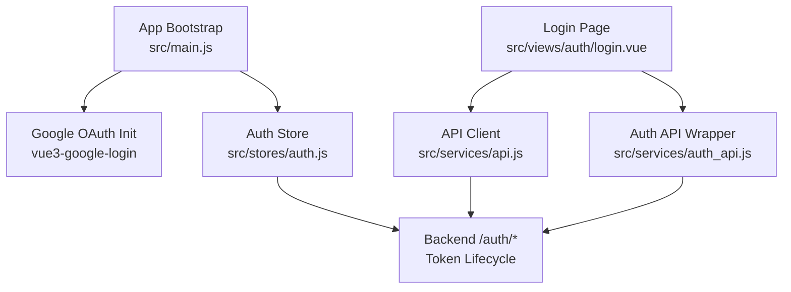
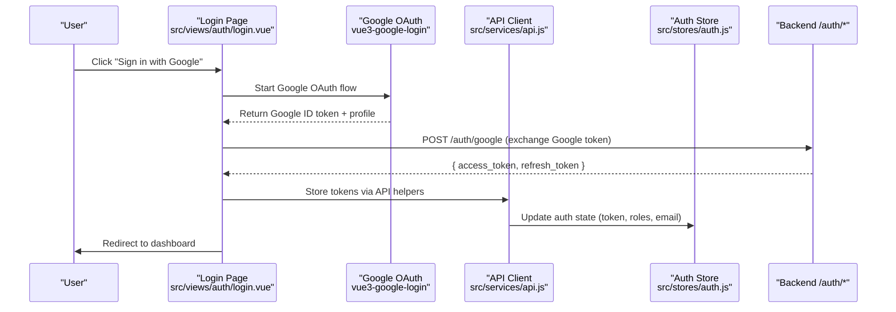
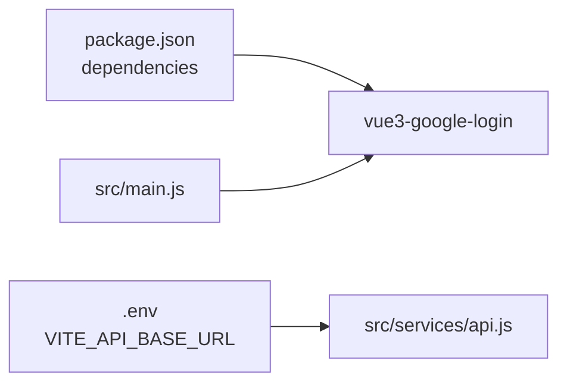

# Google OAuth Integration

<cite>
**Referenced Files in This Document**
- [main.js](file://src/main.js)
- [login.vue](file://src/views/auth/login.vue)
- [api.js](file://src/services/api.js)
- [auth_api.js](file://src/services/auth_api.js)
- [auth.js](file://src/stores/auth.js)
- [.env](file://.env)
- [package.json](file://package.json)
- [AUTH-INTEGRATION.md](file://docs/AUTH-INTEGRATION.md)
</cite>

## Table of Contents
1. [Introduction](#introduction)
2. [Project Structure](#project-structure)
3. [Core Components](#core-components)
4. [Architecture Overview](#architecture-overview)
5. [Detailed Component Analysis](#detailed-component-analysis)
6. [Dependency Analysis](#dependency-analysis)
7. [Performance Considerations](#performance-considerations)
8. [Troubleshooting Guide](#troubleshooting-guide)
9. [Conclusion](#conclusion)
10. [Appendices](#appendices)

## Introduction
This document explains how to implement Google OAuth 2.0 integration for the ABSA Foundry Frontend. It covers:
- Client-side authentication using a Google Sign-In button
- Token exchange with the backend’s existing /auth endpoints
- User profile retrieval from Google services after successful login
- Configuration requirements for Google Cloud Console (client ID, redirect URIs, scopes)
- Security considerations (state validation, CSRF protection, secure token handling)
- Step-by-step setup instructions and troubleshooting guidance

The frontend already includes the Google OAuth library and initializes it at app startup. The current login flow uses username/password against the backend; this guide shows how to extend it to support Google OAuth while preserving the existing token lifecycle and session management.

## Project Structure
Key files involved in OAuth integration:
- App bootstrap and Google SDK initialization: src/main.js
- Login UI and flow: src/views/auth/login.vue
- API client and token handling: src/services/api.js, src/services/auth_api.js
- Auth state store: src/stores/auth.js
- Environment configuration: .env
- Dependencies: package.json
- Backend auth spec and patterns: docs/AUTH-INTEGRATION.md

**Diagram sources**
- [main.js:78-82](file://src/main.js#L78-L82)
- [login.vue:133-247](file://src/views/auth/login.vue#L133-L247)
- [api.js:64-146](file://src/services/api.js#L64-L146)
- [auth_api.js:1-143](file://src/services/auth_api.js#L1-L143)
- [auth.js:1-22](file://src/stores/auth.js#L1-L22)

**Section sources**
- [main.js:78-82](file://src/main.js#L78-L82)
- [login.vue:133-247](file://src/views/auth/login.vue#L133-L247)
- [api.js:64-146](file://src/services/api.js#L64-L146)
- [auth_api.js:1-143](file://src/services/auth_api.js#L1-L143)
- [auth.js:1-22](file://src/stores/auth.js#L1-L22)

## Core Components
- Google OAuth initialization: The app registers vue3-google-login with a client ID sourced from environment variables or a fallback value.
- Login page: Handles form validation, error/success banners, and redirects after successful authentication.
- API client: Axios interceptors attach Authorization headers and handle 401 flows by refreshing tokens via /auth/refresh.
- Auth store: Maintains token, role, and email state and provides logout actions that clear local storage.
- Environment: Base backend URL is configured via VITE_API_BASE_URL.

These components provide the foundation to add a Google Sign-In button on the login page and route the resulting Google token to the backend for exchange into an application access token.

**Section sources**
- [main.js:78-82](file://src/main.js#L78-L82)
- [login.vue:133-247](file://src/views/auth/login.vue#L133-L247)
- [api.js:64-146](file://src/services/api.js#L64-L146)
- [auth_api.js:1-143](file://src/services/auth_api.js#L1-L143)
- [auth.js:1-22](file://src/stores/auth.js#L1-L22)
- [.env:1-4](file://.env#L1-L4)

## Architecture Overview
High-level OAuth 2.0 flow for Google Sign-In integrated with the existing backend:

Notes:
- The backend must expose an endpoint to accept the Google ID token and return application tokens consistent with the existing /auth/login response shape.
- The frontend will reuse the existing token storage and interceptor logic to manage subsequent requests.

[No sources needed since this diagram shows conceptual workflow, not actual code structure]

## Detailed Component Analysis

### Google OAuth Initialization
- The app imports and configures vue3-google-login with a client ID from environment variables or a hardcoded fallback.
- Ensure the environment variable VITE_GOOGLE_CLIENT_ID is set in your deployment environment.

Implementation references:
- Registration and configuration occur during app bootstrap.

**Section sources**
- [main.js:78-82](file://src/main.js#L78-L82)
- [package.json:59](file://package.json#L59)

### Login Page Enhancements for Google Sign-In
- Add a Google Sign-In button to the login view alongside the existing username/password form.
- On click, invoke the Google OAuth flow provided by vue3-google-login.
- On success, extract the Google ID token and call the backend to exchange it for application tokens.
- On failure, display user-friendly errors and keep the user on the login page.

Integration points:
- Use existing API helpers to store tokens consistently.
- Reuse the existing error/success banner UI for feedback.

**Section sources**
- [login.vue:133-247](file://src/views/auth/login.vue#L133-L247)
- [api.js:166-200](file://src/services/api.js#L166-L200)

### API Client and Token Lifecycle
- Axios request interceptor attaches Authorization header when a token exists.
- Response interceptor handles 401 by attempting to refresh tokens via /auth/refresh; if refresh fails, clears tokens and redirects to login.
- Existing login and refreshToken functions store tokens in localStorage and return data for further processing.

Security implications:
- Tokens are stored in localStorage; ensure HTTPS in production and consider additional protections such as short-lived access tokens and secure cookie usage on the backend.

**Section sources**
- [api.js:64-146](file://src/services/api.js#L64-L146)
- [api.js:166-200](file://src/services/api.js#L166-L200)
- [auth_api.js:1-143](file://src/services/auth_api.js#L1-L143)

### Auth Store
- Pinia store maintains token, role, and email state.
- Logout action clears sensitive keys from localStorage and resets store state.

Use this store to reflect authenticated state across the app after Google OAuth completes.

**Section sources**
- [auth.js:1-22](file://src/stores/auth.js#L1-L22)

### Backend Integration Points
- The backend must accept a Google ID token and validate it with Google’s token introspection or verification endpoints.
- Upon successful validation, issue application access and refresh tokens matching the existing /auth/login response format.
- The frontend will then use its existing token lifecycle (interceptors, refresh flow) without changes.

Reference patterns for token handling and responses are documented in the auth integration guide.

**Section sources**
- [AUTH-INTEGRATION.md:10-128](file://docs/AUTH-INTEGRATION.md#L10-L128)

## Dependency Analysis
External dependency for Google OAuth:
- vue3-google-login is declared in dependencies and used in main.js.

Environment and base URLs:
- VITE_API_BASE_URL defines the backend base URL used by API clients.

**Diagram sources**
- [package.json:59](file://package.json#L59)
- [main.js:78-82](file://src/main.js#L78-L82)
- [.env:1-4](file://.env#L1-L4)
- [api.js:4-18](file://src/services/api.js#L4-L18)

**Section sources**
- [package.json:59](file://package.json#L59)
- [main.js:78-82](file://src/main.js#L78-L82)
- [.env:1-4](file://.env#L1-L4)
- [api.js:4-18](file://src/services/api.js#L4-L18)

## Performance Considerations
- Keep Google OAuth client-side calls minimal; only exchange the ID token once per session.
- Leverage existing axios interceptors to avoid redundant token refresh attempts.
- Avoid storing large payloads in localStorage; rely on short-lived access tokens and refresh tokens managed by the backend.

[No sources needed since this section provides general guidance]

## Troubleshooting Guide
Common issues and resolutions:
- Missing or incorrect Google Client ID:
  - Ensure VITE_GOOGLE_CLIENT_ID is set in your environment. If absent, the app falls back to a hardcoded value which may be invalid for your domain.
  - Verify the client ID matches the authorized JavaScript origins and redirect URIs in Google Cloud Console.
- Redirect URI mismatch:
  - Configure the correct redirect URI in Google Cloud Console to match your deployed frontend domain.
- Scope permissions:
  - Request only necessary scopes (e.g., openid, email, profile). Excessive scopes can cause consent screen warnings or rejections.
- State parameter and CSRF:
  - Validate state returned by Google to prevent CSRF attacks. Ensure state is generated server-side or securely stored client-side before initiating the flow.
- Token handling:
  - Confirm that the backend returns tokens in the expected format and that the frontend stores them consistently.
  - Check that axios interceptors correctly attach Authorization headers and handle 401 flows.

Debugging techniques:
- Inspect network requests in the browser DevTools to verify Google OAuth redirects and token exchange calls.
- Log errors from the login component and API client to identify failures early.
- Validate JWT contents using a decoder to ensure claims are present and valid.

**Section sources**
- [main.js:78-82](file://src/main.js#L78-L82)
- [login.vue:133-247](file://src/views/auth/login.vue#L133-L247)
- [api.js:64-146](file://src/services/api.js#L64-L146)

## Conclusion
The ABSA Foundry Frontend is ready to integrate Google OAuth 2.0 by adding a Sign-In button to the login page and exchanging the Google ID token with the backend. The existing token lifecycle, axios interceptors, and auth store simplify post-authentication flows. Follow the setup steps below to configure Google Cloud Console credentials, define scopes, and ensure secure token handling.

[No sources needed since this section summarizes without analyzing specific files]

## Appendices

### Step-by-Step Setup Instructions

1. Create a Google Cloud Project and OAuth Consent Screen
   - In Google Cloud Console, create a new project or select an existing one.
   - Configure the OAuth consent screen:
     - Choose user type (Internal or External).
     - Add required scopes: openid, email, profile.
     - Provide app name, support email, and developer contact information.
     - Add test users if using External user type.

2. Create OAuth 2.0 Client ID
   - Create an OAuth 2.0 Client ID for a Web application.
   - Authorized JavaScript origins:
     - Add your frontend domain(s), e.g., https://your-domain.com and http://localhost:5173 for development.
   - Authorized redirect URIs:
     - Add the exact redirect URI your app will use after Google authentication. For example: https://your-domain.com/auth/callback.

3. Set Environment Variables
   - Add VITE_GOOGLE_CLIENT_ID to your environment configuration so the app can initialize the Google OAuth client.
   - Ensure VITE_API_BASE_URL points to your backend where the token exchange endpoint will be implemented.

4. Implement Google Sign-In Button
   - Add a Google Sign-In button to the login page using vue3-google-login.
   - On success, capture the Google ID token and send it to the backend to exchange for application tokens.

5. Backend Token Exchange Endpoint
   - Implement a backend endpoint to accept the Google ID token, validate it with Google, and return application access and refresh tokens in the same format as /auth/login.
   - Ensure the endpoint validates the issuer, audience, expiration, and scope.

6. Post-Authentication Flow
   - After receiving application tokens, store them using existing API helpers.
   - Update the auth store and redirect the user to the dashboard.

7. Security Checklist
   - Validate state parameter to prevent CSRF.
   - Use HTTPS in production.
   - Request minimal scopes.
   - Store tokens securely and rotate refresh tokens as needed.

[No sources needed since this section provides procedural guidance]