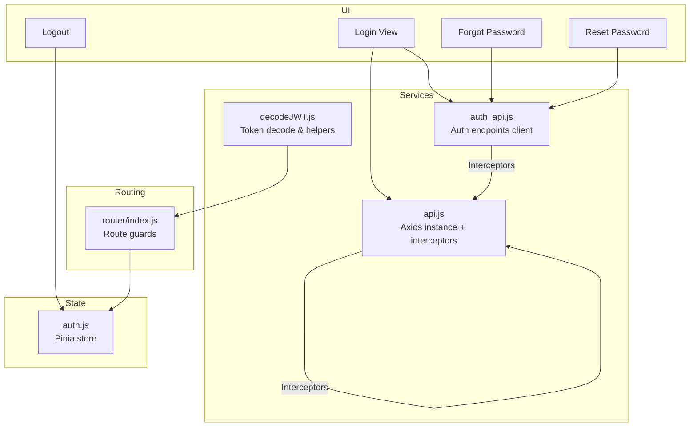
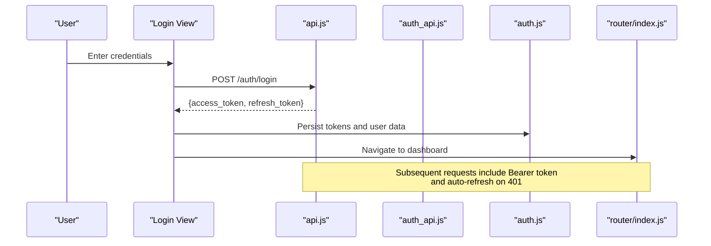
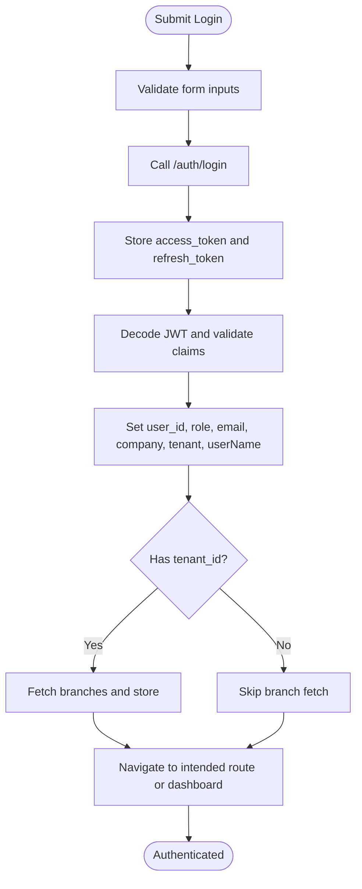
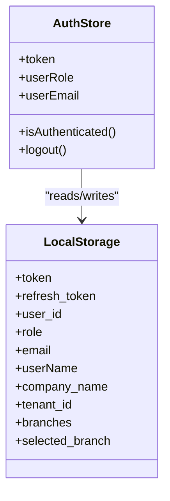
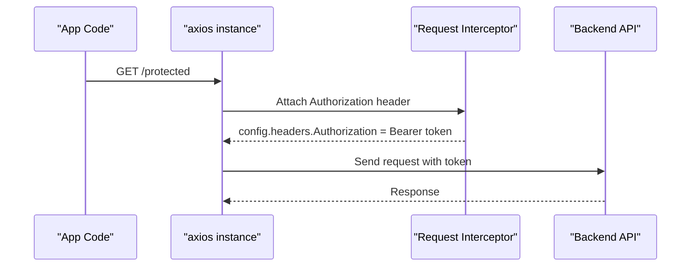
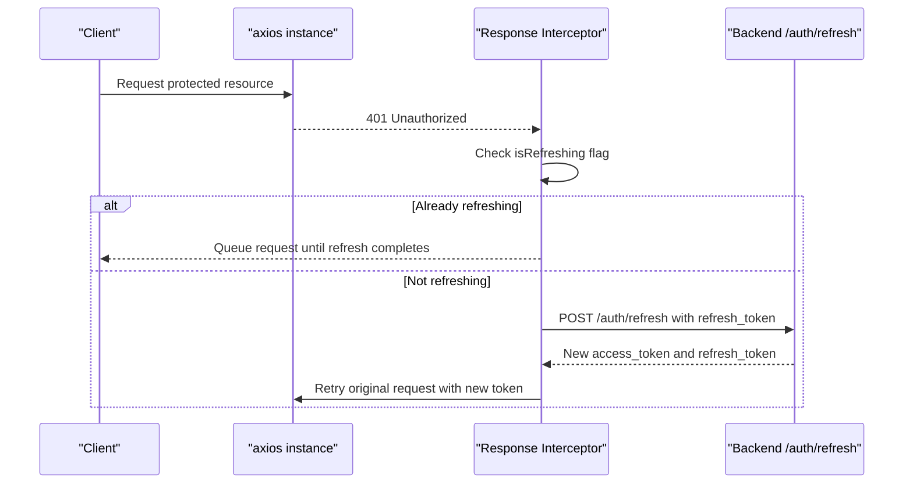
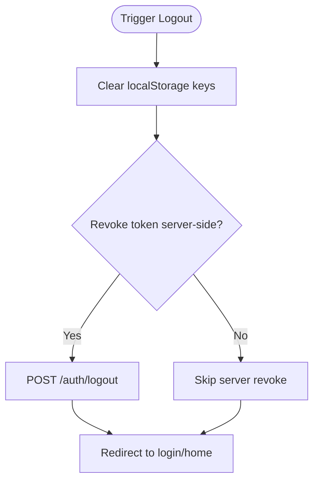
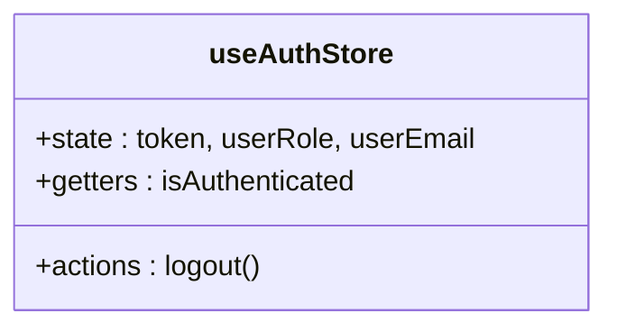
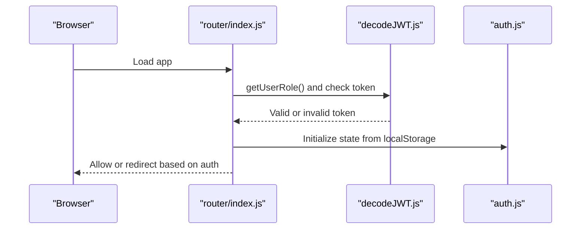
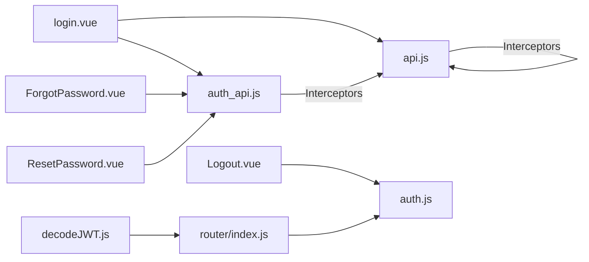

# JWT Authentication Flow

<cite>
**Referenced Files in This Document**
- [auth.js](file://src/stores/auth.js)
- [api.js](file://src/services/api.js)
- [auth_api.js](file://src/services/auth_api.js)
- [decodeJWT.js](file://src/services/decodeJWT.js)
- [login.vue](file://src/views/auth/login.vue)
- [Logout.vue](file://src/views/auth/Logout.vue)
- [ForgotPassword.vue](file://src/views/auth/ForgotPassword.vue)
- [ResetPassword.vue](file://src/views/auth/ResetPassword.vue)
- [index.js](file://src/router/index.js)
- [AUTH-INTEGRATION.md](file://docs/AUTH-INTEGRATION.md)
</cite>

## Table of Contents
1. [Introduction](#introduction)
2. [Project Structure](#project-structure)
3. [Core Components](#core-components)
4. [Architecture Overview](#architecture-overview)
5. [Detailed Component Analysis](#detailed-component-analysis)
6. [Dependency Analysis](#dependency-analysis)
7. [Performance Considerations](#performance-considerations)
8. [Troubleshooting Guide](#troubleshooting-guide)
9. [Conclusion](#conclusion)
10. [Appendices](#appendices)

## Introduction
This document explains the complete JWT authentication lifecycle in ABSA Foundry Frontend, including login, token storage in localStorage, automatic token attachment to API requests via axios interceptors, logout, and automatic token refresh on expiration. It also covers authentication state management in the Pinia auth store, session persistence across page reloads, practical examples for custom flows, error handling patterns, debugging techniques, and security considerations such as token storage best practices, XSS prevention, and secure API communication.

## Project Structure
The authentication system spans several layers:
- UI views handle user input and navigation (login, password reset, logout).
- Services provide HTTP clients with request/response interceptors for token handling and refresh logic.
- A Pinia store maintains minimal auth state and provides a centralized logout action.
- The router enforces route-level access control based on tokens and roles.
- A JWT decoding utility validates tokens and supports safe logout and branch context management.

**Diagram sources**
- [login.vue:133-248](file://src/views/auth/login.vue#L133-L248)
- [ForgotPassword.vue:156-196](file://src/views/auth/ForgotPassword.vue#L156-L196)
- [ResetPassword.vue:207-296](file://src/views/auth/ResetPassword.vue#L207-L296)
- [api.js:64-146](file://src/services/api.js#L64-L146)
- [auth_api.js:1-143](file://src/services/auth_api.js#L1-L143)
- [decodeJWT.js:11-96](file://src/services/decodeJWT.js#L11-L96)
- [auth.js:3-21](file://src/stores/auth.js#L3-L21)
- [index.js:201-272](file://src/router/index.js#L201-L272)

**Section sources**
- [login.vue:133-248](file://src/views/auth/login.vue#L133-L248)
- [api.js:64-146](file://src/services/api.js#L64-L146)
- [auth_api.js:1-143](file://src/services/auth_api.js#L1-L143)
- [decodeJWT.js:11-96](file://src/services/decodeJWT.js#L11-L96)
- [auth.js:3-21](file://src/stores/auth.js#L3-L21)
- [index.js:201-272](file://src/router/index.js#L201-L272)

## Core Components
- Login flow: Validates credentials, stores tokens and user metadata in localStorage, decodes claims, sets additional context (role, email, branches), and navigates to dashboard or intended route.
- Token storage: Access and refresh tokens are persisted under specific keys; user context is stored alongside tokens for quick reads.
- Axios interceptors: Automatically attach Authorization headers to outgoing requests and handle 401 responses by refreshing tokens and retrying requests.
- Logout: Clears local storage and redirects to login or home.
- Router guard: Protects routes requiring authentication and enforces module access rules based on roles and subscription flags.
- JWT decoding: Validates token expiry, extracts user info, and provides safe logout that revokes tokens server-side when possible.

**Section sources**
- [login.vue:180-248](file://src/views/auth/login.vue#L180-L248)
- [api.js:20-38](file://src/services/api.js#L20-L38)
- [api.js:64-146](file://src/services/api.js#L64-L146)
- [auth_api.js:36-87](file://src/services/auth_api.js#L36-L87)
- [decodeJWT.js:11-96](file://src/services/decodeJWT.js#L11-L96)
- [auth.js:3-21](file://src/stores/auth.js#L3-L21)
- [index.js:201-272](file://src/router/index.js#L201-L272)

## Architecture Overview
The authentication architecture combines UI-driven flows with service-layer interceptors and router guards to ensure seamless, secure, and resilient user sessions.

**Diagram sources**
- [login.vue:180-248](file://src/views/auth/login.vue#L180-L248)
- [api.js:166-180](file://src/services/api.js#L166-L180)
- [auth_api.js:36-57](file://src/services/auth_api.js#L36-L57)
- [auth.js:3-21](file://src/stores/auth.js#L3-L21)
- [index.js:201-272](file://src/router/index.js#L201-L272)

## Detailed Component Analysis

### Login Process
- The login view collects username/email and password, validates inputs, and calls the login function from the API service.
- On success, it stores both access and refresh tokens along with user metadata (user_id, role, email, company_name, tenant_id, userName) in localStorage.
- It decodes the JWT to validate claims and enrich response fields if missing.
- For sub-account users, it persists active subaccount context.
- If a tenant_id exists, it fetches and stores branch information.
- Finally, it navigates to the intended route or defaults to the dashboard portfolio.

**Diagram sources**
- [login.vue:180-248](file://src/views/auth/login.vue#L180-L248)
- [api.js:166-180](file://src/services/api.js#L166-L180)

**Section sources**
- [login.vue:180-248](file://src/views/auth/login.vue#L180-L248)
- [api.js:166-180](file://src/services/api.js#L166-L180)

### Token Storage in localStorage
- Tokens and user context are stored under well-known keys:
  - Access token: token (and sometimes access_token)
  - Refresh token: refresh_token
  - User context: user_id, role, email, company_name, tenant_id, userName
  - Sub-account context: active_subaccount_id, active_subaccount_email, active_subaccount_name
  - Branches: branches (JSON array), selected_branch (JSON object)
- The Pinia auth store initializes its state from localStorage and exposes an isAuthenticated getter and a logout action that clears relevant keys.

**Diagram sources**
- [auth.js:3-21](file://src/stores/auth.js#L3-L21)
- [login.vue:213-225](file://src/views/auth/login.vue#L213-L225)
- [decodeJWT.js:98-146](file://src/services/decodeJWT.js#L98-L146)

**Section sources**
- [auth.js:3-21](file://src/stores/auth.js#L3-L21)
- [login.vue:213-225](file://src/views/auth/login.vue#L213-L225)
- [decodeJWT.js:98-146](file://src/services/decodeJWT.js#L98-L146)

### Automatic Token Attachment via Axios Interceptors
- Two axios-based clients attach tokens automatically:
  - api.js global axios instance adds Authorization header using token from localStorage.
  - auth_api.js creates a dedicated client with baseURL and request interceptor to add Authorization header.
- Both ensure outgoing requests carry the current token without manual per-call configuration.

**Diagram sources**
- [api.js:64-76](file://src/services/api.js#L64-L76)
- [auth_api.js:21-27](file://src/services/auth_api.js#L21-L27)

**Section sources**
- [api.js:64-76](file://src/services/api.js#L64-L76)
- [auth_api.js:21-27](file://src/services/auth_api.js#L21-L27)

### Token Refresh Mechanism
- When a protected API returns 401, the response interceptor attempts to refresh the access token using the stored refresh_token.
- It queues concurrent requests during refresh to avoid race conditions and retries them after obtaining a new token.
- If no refresh_token is available or refresh fails, it clears tokens and redirects to login.
- The auth_api.js also exposes a refreshToken method that updates both access and refresh tokens upon successful exchange.

**Diagram sources**
- [api.js:78-146](file://src/services/api.js#L78-L146)
- [auth_api.js:64-87](file://src/services/auth_api.js#L64-L87)

**Section sources**
- [api.js:78-146](file://src/services/api.js#L78-L146)
- [auth_api.js:64-87](file://src/services/auth_api.js#L64-L87)

### Logout Functionality
- Multiple logout paths exist:
  - Router-based logout view clears specific keys and navigates to login.
  - API service logout calls backend endpoint and clears all local storage before redirecting.
  - decodeJWT logout revokes token server-side when possible and clears local storage, then navigates to login.
  - Pinia store logout clears known keys and resets store state.

**Diagram sources**
- [Logout.vue:7-15](file://src/views/auth/Logout.vue#L7-L15)
- [api.js:202-208](file://src/services/api.js#L202-L208)
- [decodeJWT.js:66-96](file://src/services/decodeJWT.js#L66-L96)
- [auth.js:13-19](file://src/stores/auth.js#L13-L19)

**Section sources**
- [Logout.vue:7-15](file://src/views/auth/Logout.vue#L7-L15)
- [api.js:202-208](file://src/services/api.js#L202-L208)
- [decodeJWT.js:66-96](file://src/services/decodeJWT.js#L66-L96)
- [auth.js:13-19](file://src/stores/auth.js#L13-L19)

### Authentication State Management in Auth Store
- The Pinia store initializes token, role, and email from localStorage.
- Provides an isAuthenticated getter based on token presence.
- Offers a logout action that removes tokens and related user data from localStorage and resets store state.

**Diagram sources**
- [auth.js:3-21](file://src/stores/auth.js#L3-L21)

**Section sources**
- [auth.js:3-21](file://src/stores/auth.js#L3-L21)

### Session Persistence Across Page Reloads
- On app start, the router guard checks for a token and uses decodeJWT to validate it.
- If a token exists but is expired, decodeJWT triggers logout.
- The router guard also supports impersonation tokens via query parameters, storing them into localStorage and navigating to the dashboard.
- The auth store restores state from localStorage, enabling immediate recognition of authenticated sessions.

**Diagram sources**
- [index.js:201-272](file://src/router/index.js#L201-L272)
- [decodeJWT.js:11-96](file://src/services/decodeJWT.js#L11-L96)
- [auth.js:3-21](file://src/stores/auth.js#L3-L21)

**Section sources**
- [index.js:201-272](file://src/router/index.js#L201-L272)
- [decodeJWT.js:11-96](file://src/services/decodeJWT.js#L11-L96)
- [auth.js:3-21](file://src/stores/auth.js#L3-L21)

### Practical Examples: Custom Authentication Flows
- Implementing a custom protected API call:
  - Use the provided getAuthHeaders helper to attach Authorization headers to fetch-based requests.
  - Leverage the authFetch wrapper to simplify authenticated fetch calls.
- Handling authentication errors:
  - Catch 401 responses and rely on the response interceptor to refresh tokens automatically.
  - For non-retryable endpoints (login/refresh), clear tokens and redirect to login.
- Debugging token-related issues:
  - Inspect localStorage keys for token presence and validity.
  - Use console logs around interceptor execution to verify header attachment and refresh behavior.
  - Validate JWT payload structure and expiration using decodeJWT utilities.

**Section sources**
- [api.js:20-38](file://src/services/api.js#L20-L38)
- [api.js:78-146](file://src/services/api.js#L78-L146)
- [decodeJWT.js:11-96](file://src/services/decodeJWT.js#L11-L96)

### Security Considerations
- Token storage best practices:
  - Store tokens in localStorage with explicit keys and ensure they are cleared on logout.
  - Avoid storing sensitive data beyond what is necessary; prefer decoding tokens for user info rather than persisting full payloads.
- XSS prevention:
  - Do not render raw tokens in templates; always sanitize outputs.
  - Use proper content security policies and avoid inline scripts where possible.
- Secure API communication:
  - Ensure HTTPS in production environments.
  - Use withCredentials only when necessary and configure CORS appropriately on the backend.
  - Rely on interceptors to attach tokens consistently and handle 401 responses securely.

[No sources needed since this section provides general guidance]

## Dependency Analysis
The authentication system has clear dependencies between components:
- Views depend on services for API calls and token operations.
- Services depend on axios and localStorage for token handling.
- The router depends on decodeJWT and the auth store for access control.
- The auth store depends on localStorage for persistence.

**Diagram sources**
- [login.vue:133-248](file://src/views/auth/login.vue#L133-L248)
- [ForgotPassword.vue:156-196](file://src/views/auth/ForgotPassword.vue#L156-L196)
- [ResetPassword.vue:207-296](file://src/views/auth/ResetPassword.vue#L207-L296)
- [Logout.vue:7-15](file://src/views/auth/Logout.vue#L7-L15)
- [api.js:64-146](file://src/services/api.js#L64-L146)
- [auth_api.js:21-27](file://src/services/auth_api.js#L21-L27)
- [decodeJWT.js:11-96](file://src/services/decodeJWT.js#L11-L96)
- [index.js:201-272](file://src/router/index.js#L201-L272)
- [auth.js:3-21](file://src/stores/auth.js#L3-L21)

**Section sources**
- [login.vue:133-248](file://src/views/auth/login.vue#L133-L248)
- [api.js:64-146](file://src/services/api.js#L64-L146)
- [auth_api.js:21-27](file://src/services/auth_api.js#L21-L27)
- [decodeJWT.js:11-96](file://src/services/decodeJWT.js#L11-L96)
- [index.js:201-272](file://src/router/index.js#L201-L272)
- [auth.js:3-21](file://src/stores/auth.js#L3-L21)

## Performance Considerations
- Minimize redundant refresh calls by queuing requests during refresh to prevent multiple concurrent refresh attempts.
- Avoid excessive localStorage reads/writes; batch operations where possible.
- Use lazy loading for routes and components to reduce initial bundle size and improve perceived performance.
- Prefer server-side validation and authorization to reduce client-side overhead.

[No sources needed since this section provides general guidance]

## Troubleshooting Guide
Common issues and resolutions:
- 401 Unauthorized:
  - Verify refresh_token exists in localStorage.
  - Check that the response interceptor is correctly configured to call /auth/refresh.
  - Ensure the backend accepts the refresh_token and returns new tokens.
- Token not attached to requests:
  - Confirm request interceptor is adding Authorization header.
  - Check that token key matches expected storage key (token vs access_token).
- Logout not clearing state:
  - Ensure all relevant keys are removed from localStorage.
  - Verify router navigation occurs after cleanup.
- Invalid token format:
  - Validate JWT structure and expiration using decodeJWT utilities.
  - Handle decoding errors gracefully and trigger logout.

**Section sources**
- [api.js:78-146](file://src/services/api.js#L78-L146)
- [auth_api.js:64-87](file://src/services/auth_api.js#L64-L87)
- [decodeJWT.js:11-96](file://src/services/decodeJWT.js#L11-L96)
- [auth.js:13-19](file://src/stores/auth.js#L13-L19)

## Conclusion
The ABSA Foundry Frontend implements a robust JWT authentication flow with clear separation of concerns across UI, services, state, and routing. Tokens are securely stored, automatically attached to requests, and refreshed seamlessly on expiration. The system supports comprehensive logout flows, session persistence, and role-based access control. By following the documented patterns and security guidelines, developers can implement custom authentication flows confidently while maintaining a secure and performant user experience.

[No sources needed since this section summarizes without analyzing specific files]

## Appendices
- Backend API reference for authentication endpoints and token structures is available in the integration guide.

**Section sources**
- [AUTH-INTEGRATION.md:10-128](file://docs/AUTH-INTEGRATION.md#L10-L128)
- [AUTH-INTEGRATION.md:174-196](file://docs/AUTH-INTEGRATION.md#L174-L196)
- [AUTH-INTEGRATION.md:747-778](file://docs/AUTH-INTEGRATION.md#L747-L778)