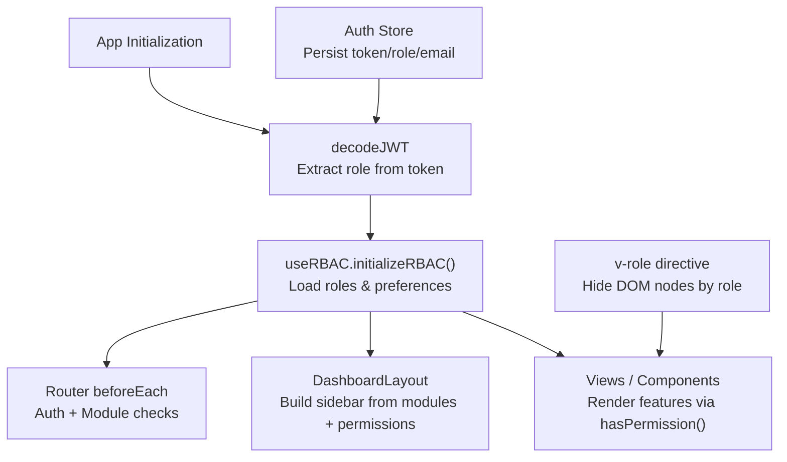
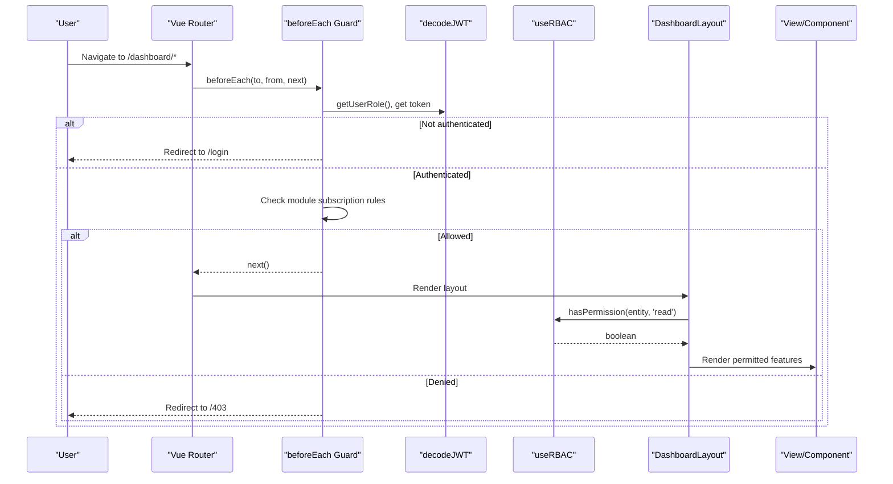
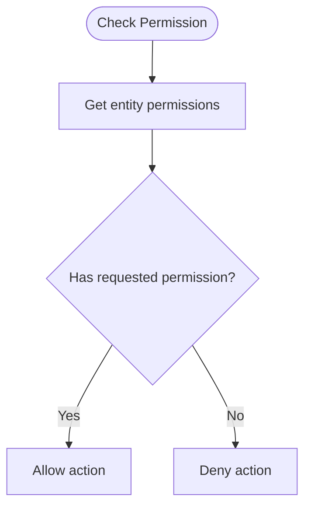
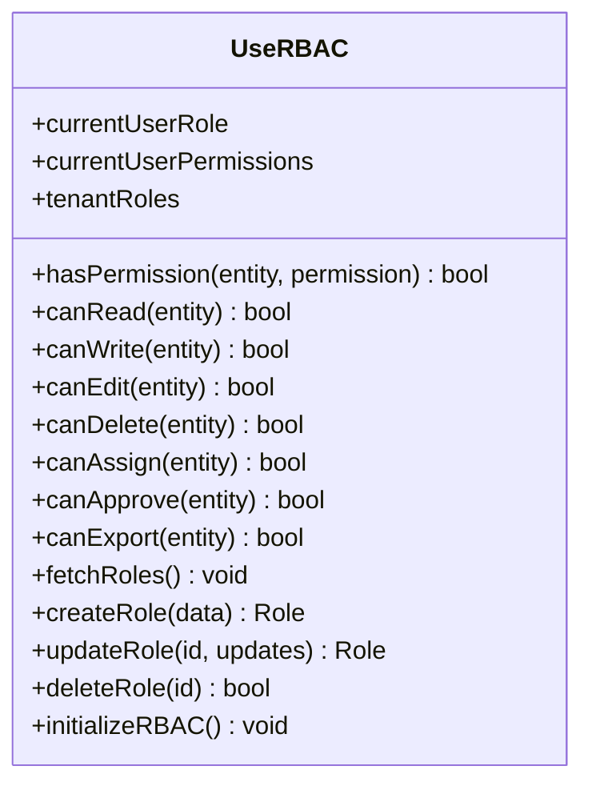
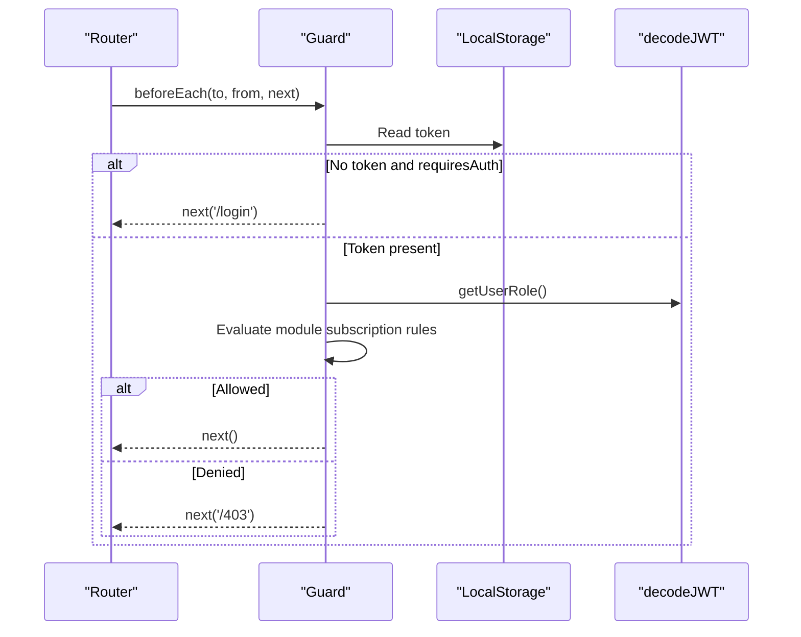
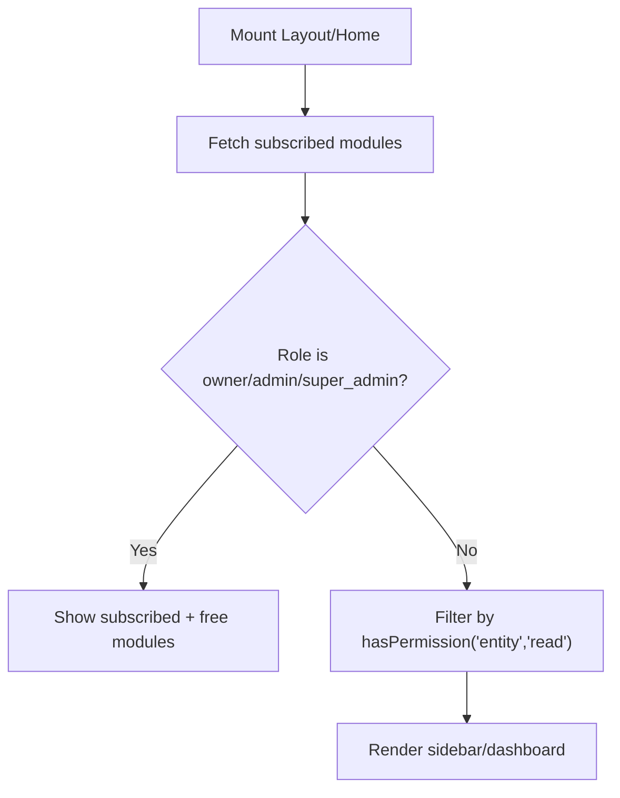
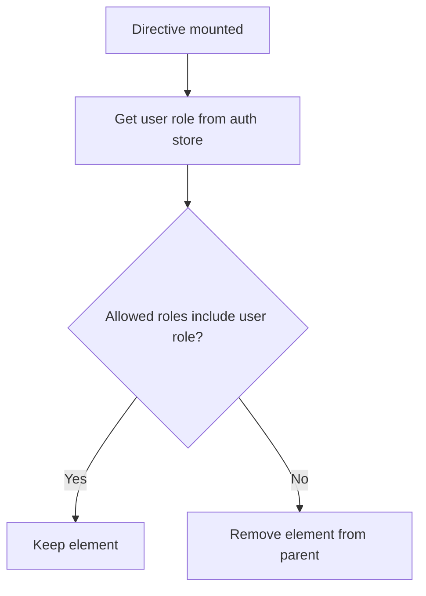
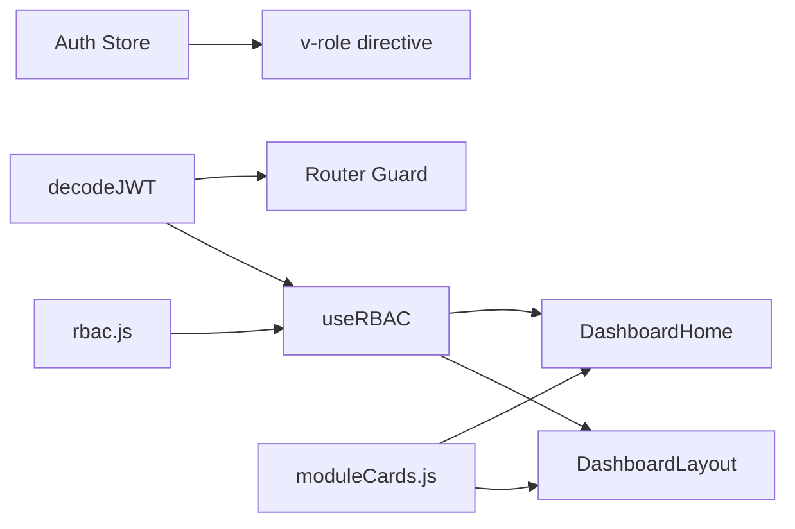

# Role-Based Access Control (RBAC)

<cite>
**Referenced Files in This Document**
- [rbac.js](file://src/config/rbac.js)
- [useRBAC.js](file://src/composables/useRBAC.js)
- [v-role.js](file://src/utils/v-role.js)
- [index.js](file://src/router/index.js)
- [auth.js](file://src/stores/auth.js)
- [decodeJWT.js](file://src/services/decodeJWT.js)
- [DashboardLayout.vue](file://src/components/layouts/DashboardLayout.vue)
- [DashboardHome.vue](file://src/views/DashboardHome.vue)
- [moduleCards.js](file://src/config/moduleCards.js)
</cite>

## Table of Contents
1. [Introduction](#introduction)
2. [Project Structure](#project-structure)
3. [Core Components](#core-components)
4. [Architecture Overview](#architecture-overview)
5. [Detailed Component Analysis](#detailed-component-analysis)
6. [Dependency Analysis](#dependency-analysis)
7. [Performance Considerations](#performance-considerations)
8. [Troubleshooting Guide](#troubleshooting-guide)
9. [Conclusion](#conclusion)
10. [Appendices](#appendices)

## Introduction
This document explains the Role-Based Access Control (RBAC) system implemented in ABSA Foundry Frontend. It covers:
- The permission model and entities
- How roles are defined, merged with tenant-specific overrides, and enforced at multiple layers
- How Vue Router guards, component-level checks, and dynamic UI rendering enforce access
- Practical guidance for extending RBAC with custom roles, building role-aware navigation, and creating permission-aware components
- Common scenarios such as conditional route access, protected API endpoints, and dynamic permission evaluation

Note on predefined roles: The repository defines a set of default roles and permission entities. While the documentation objective references six specific roles (Relationship Manager, Branch Manager, Data Scientist, AI Operator, Data Engineer, Super Admin), the codebase implements a broader, extensible role model. The following sections describe how to map those roles to the existing permission model and how to add or customize roles to match your organization’s needs.

## Project Structure
The RBAC system is implemented across configuration, composables, utilities, routing, stores, and views:
- Configuration: Permission types, entities, and default roles
- Composable: Centralized permission checking, role management, and initialization
- Utilities: Directive-based visibility control
- Router: Global guards for authentication and module access
- Stores: Lightweight auth state and user role persistence
- Views/Layouts: Dynamic UI based on permissions and subscriptions

**Diagram sources**
- [decodeJWT.js:11-62](file://src/services/decodeJWT.js#L11-L62)
- [useRBAC.js:668-719](file://src/composables/useRBAC.js#L668-L719)
- [index.js:201-272](file://src/router/index.js#L201-L272)
- [DashboardLayout.vue:167-232](file://src/components/layouts/DashboardLayout.vue#L167-L232)
- [v-role.js:1-12](file://src/utils/v-role.js#L1-L12)
- [auth.js:1-22](file://src/stores/auth.js#L1-L22)

**Section sources**
- [rbac.js:13-77](file://src/config/rbac.js#L13-L77)
- [useRBAC.js:55-137](file://src/composables/useRBAC.js#L55-L137)
- [index.js:201-272](file://src/router/index.js#L201-L272)
- [DashboardLayout.vue:167-232](file://src/components/layouts/DashboardLayout.vue#L167-L232)
- [moduleCards.js:13-50](file://src/config/moduleCards.js#L13-L50)

## Core Components
- Permission model:
  - Permission types include read, write, edit, delete, assign, approve, export
  - Entities define feature areas (e.g., crm, ai, settings, reports)
  - Entity-specific permissions can extend common sets
- Default roles:
  - Roles define per-entity permission arrays
  - System roles cannot be deleted; custom roles can override defaults
- RBAC composable:
  - Provides reactive state for current role and permissions
  - Exposes helpers like hasPermission, canRead, canWrite, canEdit, canDelete, canAssign, canApprove, canExport
  - Initializes roles from JWT and merges with tenant-specific roles from backend
- Router guard:
  - Enforces authentication and subscription-based module access
  - Uses local storage and decoded role to decide navigation
- Directive v-role:
  - Removes elements from DOM if user role does not match allowed list
- Auth store:
  - Persists token, role, email and provides logout action

**Section sources**
- [rbac.js:13-77](file://src/config/rbac.js#L13-L77)
- [rbac.js:85-337](file://src/config/rbac.js#L85-L337)
- [useRBAC.js:55-137](file://src/composables/useRBAC.js#L55-L137)
- [index.js:201-272](file://src/router/index.js#L201-L272)
- [v-role.js:1-12](file://src/utils/v-role.js#L1-L12)
- [auth.js:1-22](file://src/stores/auth.js#L1-L22)

## Architecture Overview
The RBAC architecture enforces access at three layers:
- Route-level: Global router guard checks authentication and module subscription
- Component-level: useRBAC helpers gate UI actions and features
- DOM-level: v-role directive hides unauthorized elements

**Diagram sources**
- [index.js:201-272](file://src/router/index.js#L201-L272)
- [decodeJWT.js:43-62](file://src/services/decodeJWT.js#L43-L62)
- [useRBAC.js:63-113](file://src/composables/useRBAC.js#L63-L113)
- [DashboardLayout.vue:167-232](file://src/components/layouts/DashboardLayout.vue#L167-L232)

## Detailed Component Analysis

### Permission Model and Entities
- Permission types: read, write, edit, delete, assign, approve, export
- Entities: CRM, AI, Settings, Reports, Finance, HR, etc.
- Entity-specific permissions: Some entities support additional actions like assign or approve
- Helper functions:
  - hasPermission(role, entity, permission): checks explicit permission
  - hasAnyPermission(role, entity): checks if any permission exists for an entity
  - mergeRoles(customRoles, baseRoles): merges tenant overrides with defaults
  - createEmptyRole(): template for new roles

**Diagram sources**
- [rbac.js:658-671](file://src/config/rbac.js#L658-L671)
- [rbac.js:701-713](file://src/config/rbac.js#L701-L713)

**Section sources**
- [rbac.js:13-77](file://src/config/rbac.js#L13-L77)
- [rbac.js:658-713](file://src/config/rbac.js#L658-L713)

### RBAC Composable (useRBAC)
- State:
  - currentUserRole: resolved role object from JWT and tenant roles
  - currentUserPermissions: flattened permissions for quick checks
  - tenantRoles: merged roles from backend and defaults
- Permission helpers:
  - hasPermission(entity, permission): includes dev bypass and admin shortcuts
  - canRead/canWrite/canEdit/canDelete/canAssign/canApprove/canExport: typed wrappers
- Role management:
  - fetchRoles(): loads roles from backend, merges with defaults, handles deletions
  - createRole/updateRole/deleteRole: CRUD operations for roles
- Organization management:
  - fetchOrganizations/addOrganization/updateOrganization/removeOrganization
- UI preferences:
  - fetchUIPreferences/updateUIPreferences/applyUIPreferences: theme, fonts, colors, visual style tokens
- Initialization:
  - initializeRBAC(): resolves role, applies cached UI prefs, then fetches roles/orgs/preferences

**Diagram sources**
- [useRBAC.js:55-137](file://src/composables/useRBAC.js#L55-L137)
- [useRBAC.js:144-347](file://src/composables/useRBAC.js#L144-L347)
- [useRBAC.js:495-661](file://src/composables/useRBAC.js#L495-L661)
- [useRBAC.js:668-719](file://src/composables/useRBAC.js#L668-L719)

**Section sources**
- [useRBAC.js:55-137](file://src/composables/useRBAC.js#L55-L137)
- [useRBAC.js:144-347](file://src/composables/useRBAC.js#L144-L347)
- [useRBAC.js:495-661](file://src/composables/useRBAC.js#L495-L661)
- [useRBAC.js:668-719](file://src/composables/useRBAC.js#L668-L719)

### Vue Router Guards
- Authentication check:
  - If requiresAuth is true and no token, redirect to login
- Subscription enforcement:
  - For dashboard routes, identify target module and check subscription requirements
  - Non-admin/non-manager roles must have module in allowed list stored locally
- Impersonation flow:
  - Query param ub_impersonate sets token and redirects to dashboard

**Diagram sources**
- [index.js:201-272](file://src/router/index.js#L201-L272)
- [decodeJWT.js:43-62](file://src/services/decodeJWT.js#L43-L62)

**Section sources**
- [index.js:201-272](file://src/router/index.js#L201-L272)

### Component-Level Permission Checks and Dynamic UI
- DashboardLayout:
  - Builds visible modules based on subscriptions and permissions
  - Filters out admin-only pages unless appropriate role
  - Uses hasPermission to determine visibility for non-admin users
- DashboardHome:
  - Fetches subscribed modules and filters by permissions
  - Determines settings access via isAdmin/isSuperAdmin or settings read permission

**Diagram sources**
- [DashboardLayout.vue:167-232](file://src/components/layouts/DashboardLayout.vue#L167-L232)
- [DashboardHome.vue:528-575](file://src/views/DashboardHome.vue#L528-L575)

**Section sources**
- [DashboardLayout.vue:167-232](file://src/components/layouts/DashboardLayout.vue#L167-L232)
- [DashboardHome.vue:528-575](file://src/views/DashboardHome.vue#L528-L575)

### Directive v-role
- Behavior:
  - On mount, checks if element’s allowed roles include current user role
  - Removes element from DOM if not allowed
- Usage:
  - Apply v-role="[role1, role2]" to hide/show UI elements conditionally

**Diagram sources**
- [v-role.js:1-12](file://src/utils/v-role.js#L1-L12)
- [auth.js:1-22](file://src/stores/auth.js#L1-L22)

**Section sources**
- [v-role.js:1-12](file://src/utils/v-role.js#L1-L12)
- [auth.js:1-22](file://src/stores/auth.js#L1-L22)

### Predefined Roles and Mapping to Business Roles
- The codebase defines a comprehensive set of default roles and permission entities. To align with business roles:
  - Relationship Manager: Map to a role that grants read/write/edit on CRM and related entities; ensure assignment capability if needed
  - Branch Manager: Grant broader read access across modules and analytics; restrict destructive actions
  - Data Scientist: Provide read access to AI models and analytics; enable approvals where applicable
  - AI Operator: Enable chatbot configuration and monitoring; allow export for reporting
  - Data Engineer: Full access to data pipeline and ETL configuration; allow execute and backfill actions
  - Super Admin: Full administrative control over assets, configuration, governance, and all modules
- Implementation approach:
  - Define or override roles in tenant-specific configuration via backend API
  - Use mergeRoles to combine static defaults with custom overrides
  - Ensure each role’s permissions map to the required entities and actions

**Section sources**
- [rbac.js:85-337](file://src/config/rbac.js#L85-L337)
- [useRBAC.js:144-226](file://src/composables/useRBAC.js#L144-L226)

## Dependency Analysis
- decodeJWT supplies role, email, name, id, branch info
- useRBAC depends on rbac config and decodeJWT; manages role merging and UI preferences
- Router guard depends on decodeJWT and local storage for token and allowed modules
- DashboardLayout and DashboardHome depend on useRBAC and moduleCards for dynamic navigation
- v-role depends on auth store for current role

**Diagram sources**
- [decodeJWT.js:43-62](file://src/services/decodeJWT.js#L43-L62)
- [useRBAC.js:55-137](file://src/composables/useRBAC.js#L55-L137)
- [index.js:201-272](file://src/router/index.js#L201-L272)
- [DashboardLayout.vue:167-232](file://src/components/layouts/DashboardLayout.vue#L167-L232)
- [DashboardHome.vue:528-575](file://src/views/DashboardHome.vue#L528-L575)
- [v-role.js:1-12](file://src/utils/v-role.js#L1-L12)
- [moduleCards.js:13-50](file://src/config/moduleCards.js#L13-L50)

**Section sources**
- [decodeJWT.js:43-62](file://src/services/decodeJWT.js#L43-L62)
- [useRBAC.js:55-137](file://src/composables/useRBAC.js#L55-L137)
- [index.js:201-272](file://src/router/index.js#L201-L272)
- [DashboardLayout.vue:167-232](file://src/components/layouts/DashboardLayout.vue#L167-L232)
- [DashboardHome.vue:528-575](file://src/views/DashboardHome.vue#L528-L575)
- [v-role.js:1-12](file://src/utils/v-role.js#L1-L12)
- [moduleCards.js:13-50](file://src/config/moduleCards.js#L13-L50)

## Performance Considerations
- Minimize repeated permission checks by caching results in component state when appropriate
- Use computed properties for derived permissions to avoid recalculations
- Debounce heavy operations like fetching roles and preferences; leverage background loading during initialization
- Avoid unnecessary DOM manipulations with v-role; prefer higher-level permission gating for large lists
- Prefer lazy-loading modules and views to reduce initial bundle size

[No sources needed since this section provides general guidance]

## Troubleshooting Guide
Common issues and resolutions:
- Token expired or invalid:
  - decodeJWT logs warnings and triggers logout; ensure refresh flow is handled by backend
- Role not found:
  - initializeRBAC falls back to defaults; verify tenant roles are correctly merged
- Module access denied:
  - Check router guard logic and allowed modules in local storage; confirm subscription status
- UI elements hidden unexpectedly:
  - Verify v-role bindings and current user role; ensure auth store has correct role
- Permissions not applied:
  - Confirm role permissions in rbac config and backend overrides; re-fetch roles after changes

**Section sources**
- [decodeJWT.js:66-96](file://src/services/decodeJWT.js#L66-L96)
- [useRBAC.js:144-226](file://src/composables/useRBAC.js#L144-L226)
- [index.js:201-272](file://src/router/index.js#L201-L272)
- [v-role.js:1-12](file://src/utils/v-role.js#L1-L12)

## Conclusion
The RBAC system in ABSA Foundry Frontend provides a robust, layered approach to access control:
- Centralized permission model with flexible entities and actions
- Extensible role definitions with tenant-specific overrides
- Multi-layer enforcement through router guards, component checks, and DOM directives
- Dynamic UI rendering based on permissions and subscriptions
To implement the six business roles, define or override roles to match required permissions, integrate with backend role management, and apply permission checks consistently across routes, components, and UI elements.

[No sources needed since this section summarizes without analyzing specific files]

## Appendices

### Practical Examples

#### Extending RBAC with Custom Roles
- Create a custom role via backend API using createRole endpoint
- Override default roles using mergeRoles to tailor permissions per tenant
- Validate roles using validateRole before submission

**Section sources**
- [useRBAC.js:231-269](file://src/composables/useRBAC.js#L231-L269)
- [rbac.js:718-735](file://src/config/rbac.js#L718-L735)

#### Implementing Role-Based Navigation Menus
- Use getModuleCards to build menu items
- Filter by subscriptions and permissions using hasPermission
- Hide admin-only pages unless authorized

**Section sources**
- [moduleCards.js:13-50](file://src/config/moduleCards.js#L13-L50)
- [DashboardLayout.vue:167-232](file://src/components/layouts/DashboardLayout.vue#L167-L232)

#### Creating Permission-Aware Components
- Wrap sensitive actions with hasPermission checks
- Use v-role for quick DOM-level visibility toggles
- Leverage canRead/canWrite/etc. helpers for clarity

**Section sources**
- [useRBAC.js:63-113](file://src/composables/useRBAC.js#L63-L113)
- [v-role.js:1-12](file://src/utils/v-role.js#L1-L12)

#### Conditional Route Access
- Mark routes with meta.requiresAuth
- Use router guard to enforce authentication and module subscription
- Redirect to /403 or /login as appropriate

**Section sources**
- [index.js:201-272](file://src/router/index.js#L201-L272)

#### Protected API Endpoints
- Attach Authorization header with token when calling APIs
- Handle errors and token expiration gracefully
- Gate server-side responses based on role and permissions

**Section sources**
- [useRBAC.js:144-226](file://src/composables/useRBAC.js#L144-L226)
- [decodeJWT.js:66-96](file://src/services/decodeJWT.js#L66-L96)

#### Dynamic Permission Evaluation
- Compute permissions reactively using computed properties
- Cache results to avoid redundant checks
- Update state when roles or permissions change

**Section sources**
- [useRBAC.js:55-137](file://src/composables/useRBAC.js#L55-L137)
- [DashboardLayout.vue:167-232](file://src/components/layouts/DashboardLayout.vue#L167-L232)