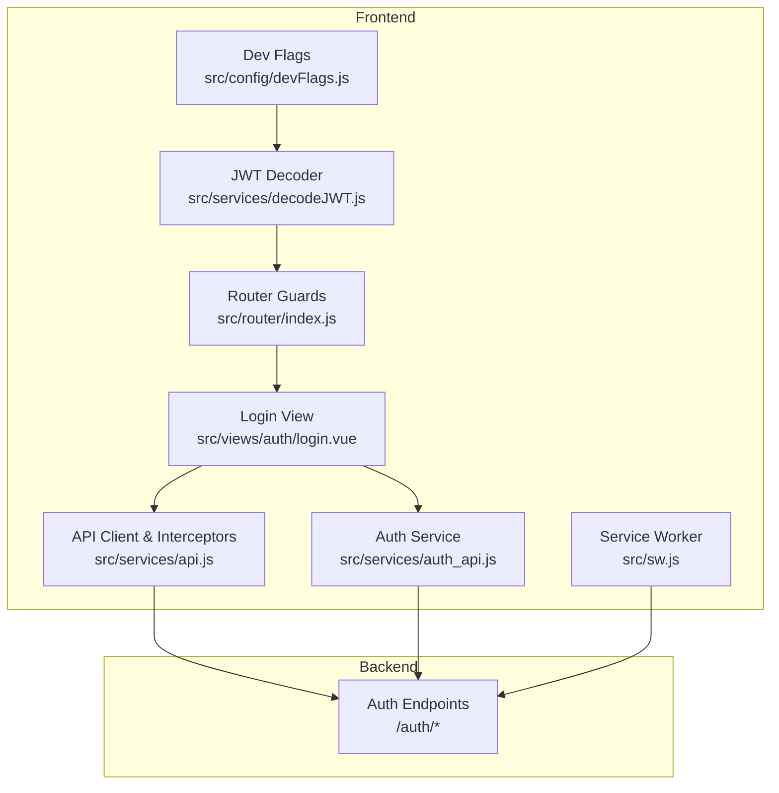
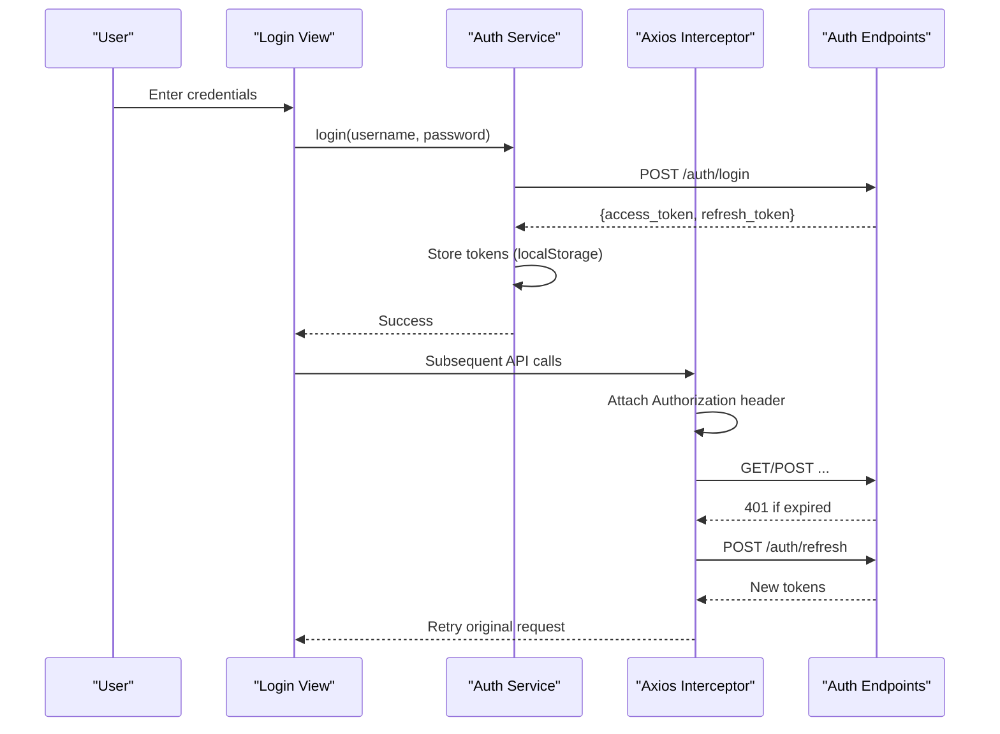
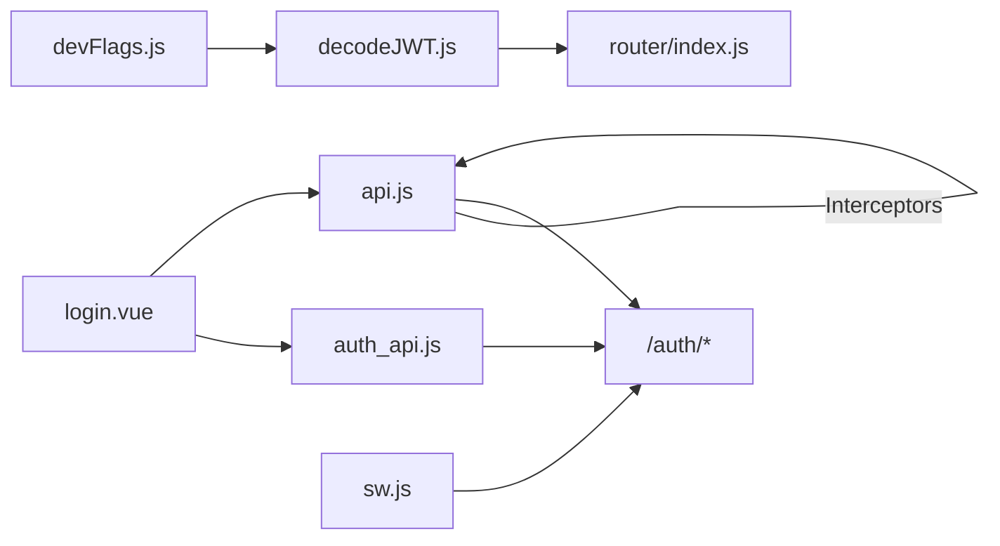

# Security Best Practices

<cite>
**Referenced Files in This Document**
- [auth_api.js](file://src/services/auth_api.js)
- [api.js](file://src/services/api.js)
- [decodeJWT.js](file://src/services/decodeJWT.js)
- [login.vue](file://src/views/auth/login.vue)
- [index.js](file://src/router/index.js)
- [devFlags.js](file://src/config/devFlags.js)
- [AUTH-INTEGRATION.md](file://docs/AUTH-INTEGRATION.md)
- [server.js](file://server.js)
- [sw.js](file://src/sw.js)
- [vite.config.js](file://vite.config.js)
</cite>

## Table of Contents
1. [Introduction](#introduction)
2. [Project Structure](#project-structure)
3. [Core Components](#core-components)
4. [Architecture Overview](#architecture-overview)
5. [Detailed Component Analysis](#detailed-component-analysis)
6. [Dependency Analysis](#dependency-analysis)
7. [Performance Considerations](#performance-considerations)
8. [Troubleshooting Guide](#troubleshooting-guide)
9. [Conclusion](#conclusion)
10. [Appendices](#appendices)

## Introduction
This document provides comprehensive security guidance for the ABSA Foundry Frontend, focusing on authentication and authorization best practices. It covers token lifecycle management, secure storage and transmission, input validation and sanitization, CSRF protection considerations, secure HTTP headers, API communication patterns, sensitive data handling, logging practices, and incident response procedures. The content is grounded in the current codebase and highlights both existing controls and recommended improvements.

## Project Structure
The frontend implements a Vue 3 application with:
- Centralized authentication services and interceptors for token handling
- Router guards to enforce access control
- JWT decoding utilities and role extraction
- A service worker that enforces HTTPS for backend requests
- A minimal Express server used for serving static assets during development

**Diagram sources**
- [login.vue:133-264](file://src/views/auth/login.vue#L133-L264)
- [auth_api.js:1-143](file://src/services/auth_api.js#L1-L143)
- [api.js:1-209](file://src/services/api.js#L1-L209)
- [decodeJWT.js:1-164](file://src/services/decodeJWT.js#L1-L164)
- [index.js:196-275](file://src/router/index.js#L196-L275)
- [devFlags.js:1-28](file://src/config/devFlags.js#L1-L28)
- [sw.js:36-65](file://src/sw.js#L36-L65)

**Section sources**
- [login.vue:133-264](file://src/views/auth/login.vue#L133-L264)
- [auth_api.js:1-143](file://src/services/auth_api.js#L1-L143)
- [api.js:1-209](file://src/services/api.js#L1-L209)
- [decodeJWT.js:1-164](file://src/services/decodeJWT.js#L1-L164)
- [index.js:196-275](file://src/router/index.js#L196-L275)
- [devFlags.js:1-28](file://src/config/devFlags.js#L1-L28)
- [sw.js:36-65](file://src/sw.js#L36-L65)

## Core Components
- Authentication flows: login, refresh, logout via dedicated services and interceptors
- Token storage: tokens stored in localStorage; roles and user info persisted alongside
- Authorization: router-level checks and role-based UI gating
- Secure transport: service worker rewrites backend requests to HTTPS
- Development bypass: optional dev flags to mock auth for local development

Key responsibilities:
- Token lifecycle: issuance, storage, refresh, revocation, and cleanup
- Request interception: automatic Authorization header injection and 401 handling
- Route protection: redirect unauthenticated users and enforce module access rules
- Input handling: form validation before submission and safe rendering practices

**Section sources**
- [auth_api.js:36-143](file://src/services/auth_api.js#L36-L143)
- [api.js:64-209](file://src/services/api.js#L64-L209)
- [index.js:201-275](file://src/router/index.js#L201-L275)
- [sw.js:36-65](file://src/sw.js#L36-L65)

## Architecture Overview
The authentication architecture combines client-side token management with server-side enforcement:

**Diagram sources**
- [login.vue:180-248](file://src/views/auth/login.vue#L180-L248)
- [auth_api.js:36-87](file://src/services/auth_api.js#L36-L87)
- [api.js:64-146](file://src/services/api.js#L64-L146)

## Detailed Component Analysis

### Authentication Flow and Token Lifecycle
- Login:
  - Credentials are validated by the backend; on success, access and refresh tokens are stored in localStorage.
  - Additional user metadata (role, email, tenant_id, etc.) is persisted for session context.
- Refresh:
  - On 401 responses, an interceptor attempts to refresh using the stored refresh token.
  - If refresh fails, tokens are cleared and the user is redirected to login.
- Logout:
  - Tokens and related user data are removed from localStorage; navigation redirects to home or login.

Security notes:
- Tokens are sent over HTTPS when served through the service worker’s rewrite logic.
- The Authorization header is attached automatically for all authenticated requests.
- Refresh endpoints are excluded from retry loops to prevent infinite loops.

Recommendations:
- Prefer HttpOnly cookies for tokens where feasible to mitigate XSS exposure.
- Implement short-lived access tokens with proactive refresh before expiry.
- Add CSRF protection for state-changing endpoints if using cookies.

**Section sources**
- [auth_api.js:36-143](file://src/services/auth_api.js#L36-L143)
- [api.js:64-209](file://src/services/api.js#L64-L209)
- [login.vue:180-248](file://src/views/auth/login.vue#L180-L248)

### Authorization and Access Control
- Router guards enforce authentication and module-level access based on roles and subscription status.
- Impersonation flow allows setting a token via URL query parameter for development/testing; ensure this is disabled in production.
- Role-based UI elements can be gated using decoded roles from JWT.

Security notes:
- Public routes are explicitly marked; protected routes require authentication.
- Module access checks rely on cached permissions; consider server-side verification for critical operations.

Recommendations:
- Enforce fine-grained authorization on the backend for all sensitive actions.
- Avoid storing impersonation tokens in URLs in production.

**Section sources**
- [index.js:201-275](file://src/router/index.js#L201-L275)
- [decodeJWT.js:43-62](file://src/services/decodeJWT.js#L43-L62)

### Secure Transport and Headers
- Service worker rewrites backend requests to HTTPS to ensure secure transmission.
- The Express server serves static assets with caching headers but does not set security headers such as CSP or HSTS.

Recommendations:
- Configure Content-Security-Policy, Strict-Transport-Security, X-Content-Type-Options, Referrer-Policy, and Permissions-Policy at the reverse proxy or CDN layer.
- Ensure all external resources are loaded over HTTPS and avoid inline scripts/styles unless strictly necessary.

**Section sources**
- [sw.js:36-65](file://src/sw.js#L36-L65)
- [server.js:28-51](file://server.js#L28-L51)

### Input Validation and Sanitization
- Login form performs basic client-side validation (required fields).
- No explicit HTML sanitization library usage was found in the analyzed files.

Recommendations:
- Validate inputs server-side with strict schemas.
- Use a trusted sanitization library to sanitize any user-generated content before rendering.
- Avoid v-html or innerHTML with unsanitized content; prefer text interpolation.

**Section sources**
- [login.vue:161-178](file://src/views/auth/login.vue#L161-L178)

### CSRF Protection
- Current implementation uses Authorization headers rather than cookie-based sessions.
- For same-origin APIs behind the same domain, CSRF risk is reduced; however, if cookies are used, implement CSRF tokens.

Recommendations:
- If switching to cookie-based sessions, add CSRF tokens and validate them server-side.
- Ensure SameSite cookie attributes are configured appropriately.

[No sources needed since this section provides general guidance]

### Sensitive Data Handling and Logging
- Tokens and user identifiers are stored in localStorage.
- Debug logs may include request details; ensure no secrets are logged.

Recommendations:
- Minimize sensitive data in logs; redact tokens and PII.
- Consider using memory-only stores for short-lived tokens in high-security contexts.
- Implement structured logging with severity levels and centralized log aggregation.

**Section sources**
- [api.js:20-38](file://src/services/api.js#L20-L38)
- [auth_api.js:21-27](file://src/services/auth_api.js#L21-L27)

### Development Bypass and Mock Auth
- Dev flags allow bypassing authentication locally for faster iteration.
- Ensure these flags are disabled in production builds.

Recommendations:
- Gate dev features behind environment variables and build-time flags.
- Audit configuration to prevent accidental inclusion in production artifacts.

**Section sources**
- [devFlags.js:1-28](file://src/config/devFlags.js#L1-L28)

## Dependency Analysis
Authentication-related dependencies and interactions:

**Diagram sources**
- [login.vue:133-264](file://src/views/auth/login.vue#L133-L264)
- [auth_api.js:1-143](file://src/services/auth_api.js#L1-L143)
- [api.js:1-209](file://src/services/api.js#L1-L209)
- [decodeJWT.js:1-164](file://src/services/decodeJWT.js#L1-L164)
- [index.js:196-275](file://src/router/index.js#L196-L275)
- [sw.js:36-65](file://src/sw.js#L36-L65)
- [devFlags.js:1-28](file://src/config/devFlags.js#L1-L28)

**Section sources**
- [auth_api.js:1-143](file://src/services/auth_api.js#L1-L143)
- [api.js:1-209](file://src/services/api.js#L1-L209)
- [decodeJWT.js:1-164](file://src/services/decodeJWT.js#L1-L164)
- [index.js:196-275](file://src/router/index.js#L196-L275)
- [sw.js:36-65](file://src/sw.js#L36-L65)
- [devFlags.js:1-28](file://src/config/devFlags.js#L1-L28)

## Performance Considerations
- Token refresh batching prevents multiple concurrent refreshes by queuing failed requests until a single refresh completes.
- Aggressive caching of static assets improves load performance; ensure index.html remains uncached to fetch latest bundles.

Recommendations:
- Monitor network requests to avoid excessive refresh calls.
- Use service worker caching strategies judiciously to balance freshness and performance.

**Section sources**
- [api.js:78-146](file://src/services/api.js#L78-L146)
- [server.js:28-51](file://server.js#L28-L51)

## Troubleshooting Guide
Common issues and resolutions:
- 401 Unauthorized:
  - Ensure refresh token exists; if missing, clear tokens and redirect to login.
  - Verify backend /auth/refresh endpoint availability and correctness.
- Token expiration:
  - Proactively check token expiry and refresh before making API calls.
- CORS errors:
  - Confirm backend allows required origins and methods; service worker forces HTTPS which may affect local dev setups.

Operational steps:
- Clear localStorage tokens and re-authenticate.
- Check browser console for detailed error messages.
- Validate environment variables for API base URLs.

**Section sources**
- [api.js:90-146](file://src/services/api.js#L90-L146)
- [auth_api.js:64-87](file://src/services/auth_api.js#L64-L87)
- [decodeJWT.js:66-96](file://src/services/decodeJWT.js#L66-L96)

## Conclusion
The ABSA Foundry Frontend implements a robust authentication and authorization framework with token lifecycle management, secure transport via service worker, and route-level access control. To further harden the application:
- Adopt HttpOnly cookies for tokens and implement CSRF protections if applicable.
- Enforce comprehensive security headers at the edge.
- Strengthen input validation and sanitization across all user inputs.
- Enhance logging hygiene and monitoring for security events.
- Regularly audit configurations to prevent development bypasses in production.

[No sources needed since this section summarizes without analyzing specific files]

## Appendices

### Security Audit Checklist
- Authentication
  - Tokens issued with short expiry; refresh mechanism implemented and tested
  - Logout clears all tokens and session data
  - Rate limiting and account lockout enforced server-side
- Authorization
  - Router guards protect sensitive routes
  - Role checks consistent with backend permissions
- Transport and Headers
  - All backend requests use HTTPS
  - Security headers configured at reverse proxy/CDN
- Input and Output
  - Server-side validation for all inputs
  - Sanitization applied before rendering user content
- Storage
  - Sensitive data minimized in localStorage; consider HttpOnly cookies
  - Secrets not embedded in client code
- Logging and Monitoring
  - No sensitive data in logs
  - Alerts for suspicious activity and failed auth attempts
- Incident Response
  - Procedures for token revocation and forced logout
  - Playbooks for credential compromise and session hijacking

[No sources needed since this section provides general guidance]

### Penetration Testing Recommendations
- Focus areas:
  - Token theft via XSS and mitigation strategies
  - CSRF attacks on state-changing endpoints
  - Insecure direct object references (IDOR)
  - Privilege escalation through role manipulation
- Tools:
  - OWASP ZAP, Burp Suite for dynamic analysis
  - Static analysis tools for dependency vulnerabilities
- Scope:
  - Authentication flows, token handling, API endpoints, and admin functions

[No sources needed since this section provides general guidance]

### Incident Response Procedures for Authentication Incidents
- Immediate actions:
  - Revoke active tokens and force logout for affected users
  - Rotate secrets and API keys if compromised
  - Temporarily disable impersonation flows
- Investigation:
  - Review logs for anomalous login patterns
  - Identify attack vectors (phishing, XSS, CSRF)
- Recovery:
  - Reset compromised credentials
  - Patch vulnerabilities and update security headers
- Post-incident:
  - Update policies and training
  - Conduct lessons learned and improve controls

[No sources needed since this section provides general guidance]