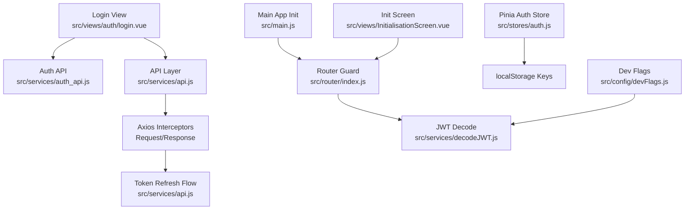
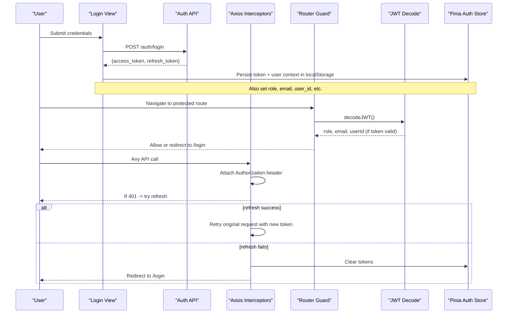
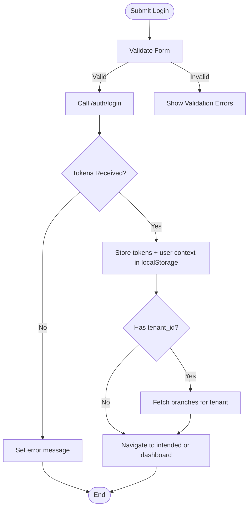
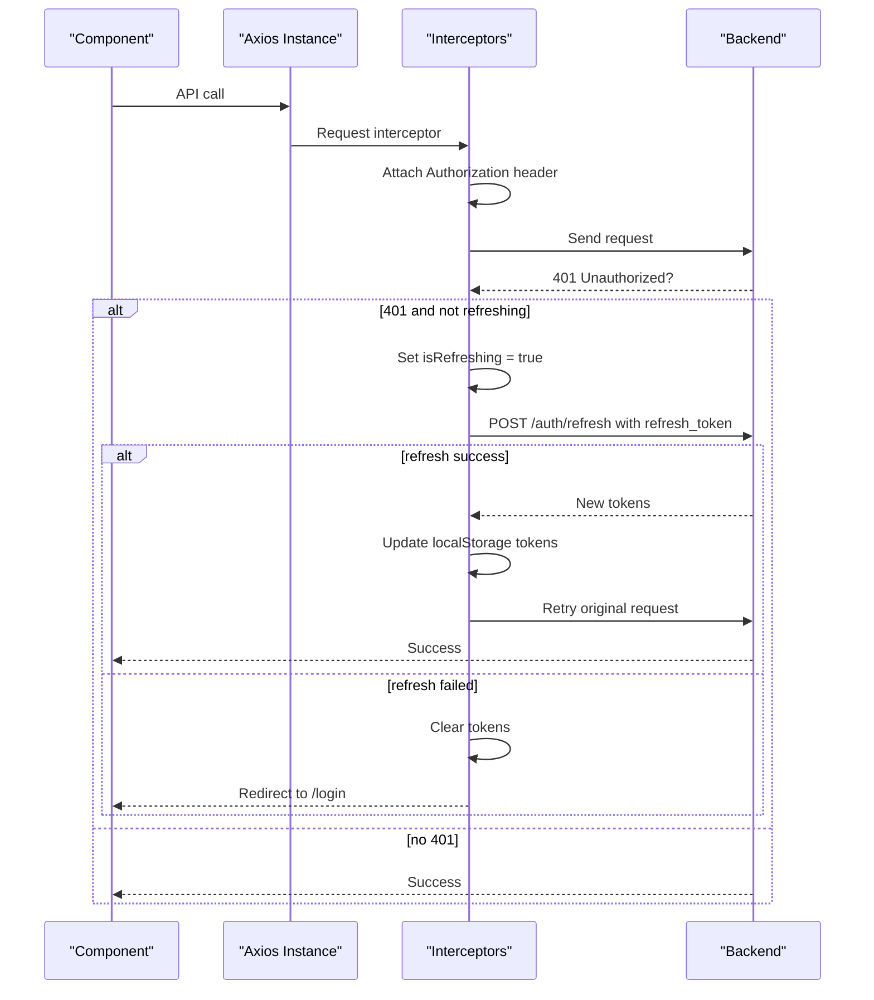
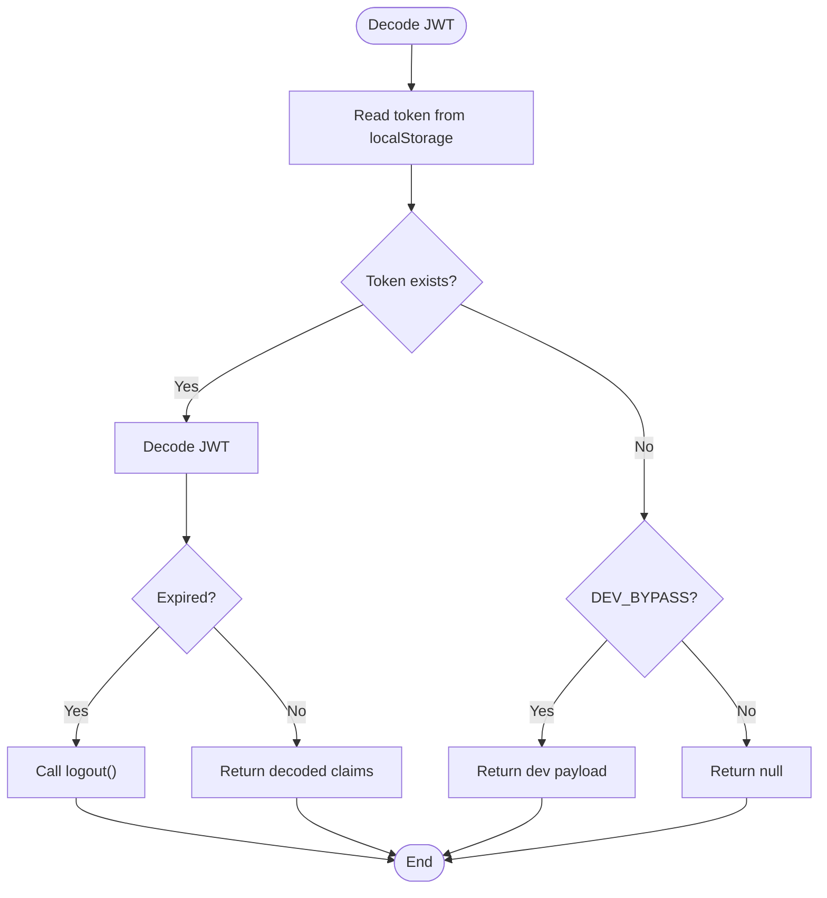
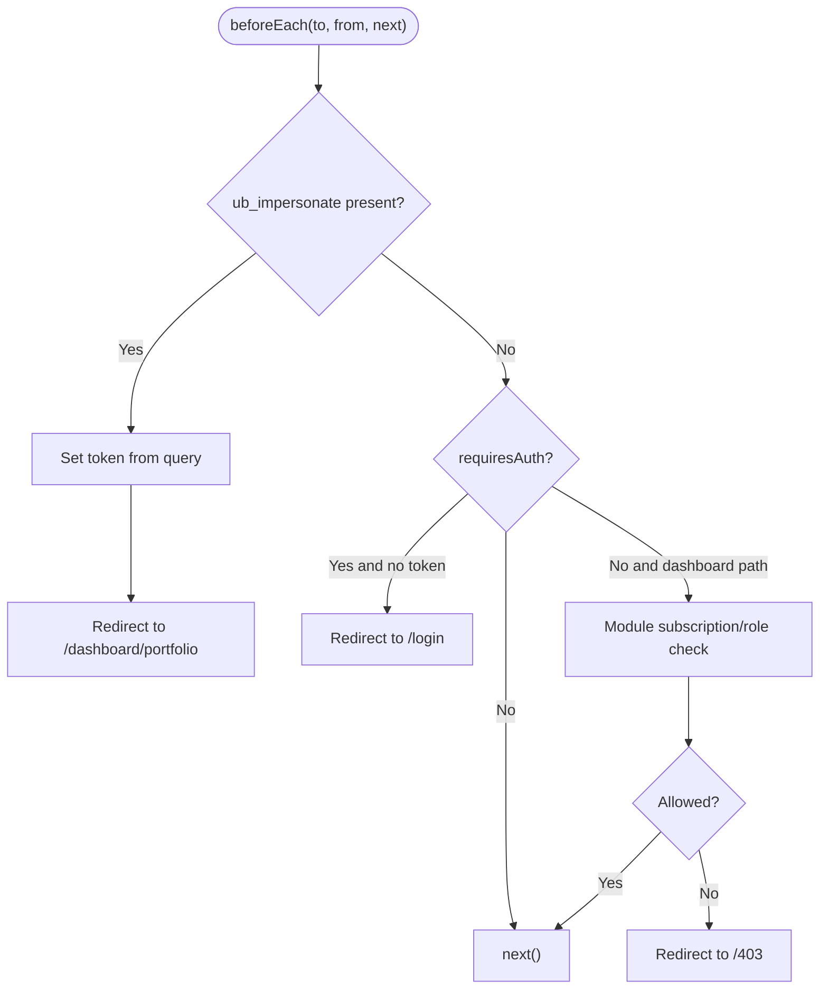
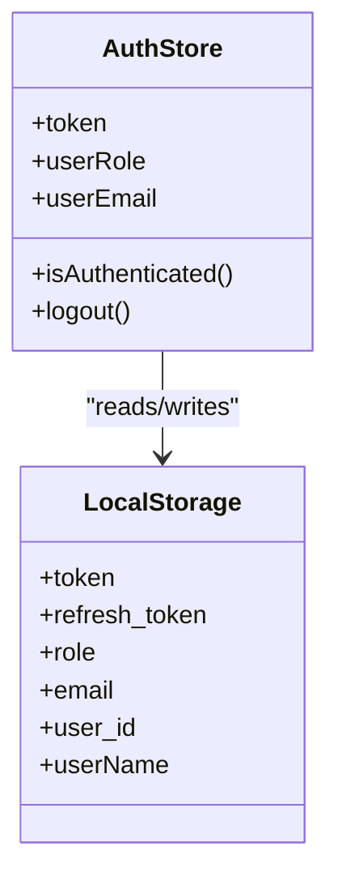
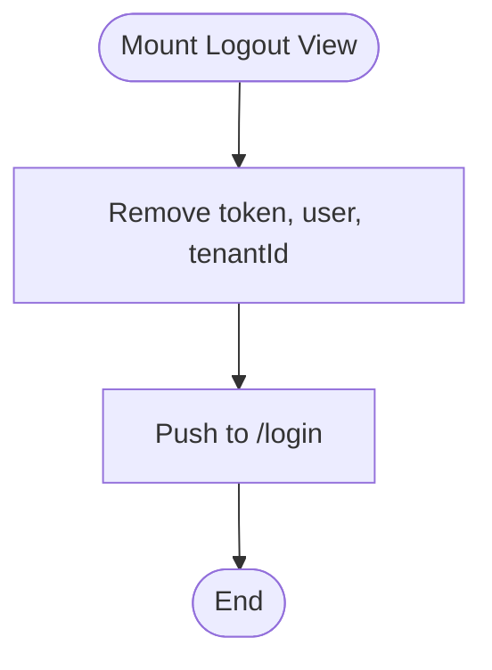
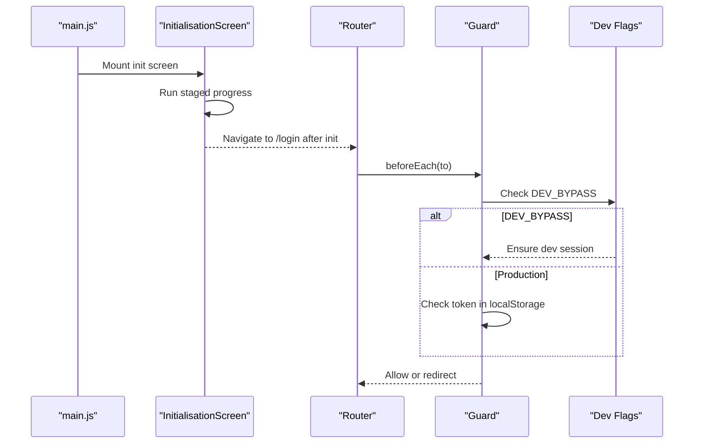
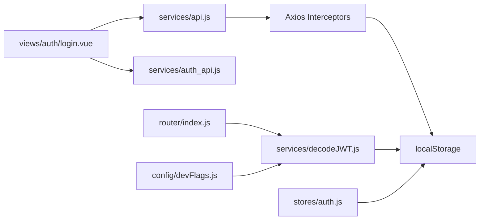

# Session Management & Persistence

<cite>
**Referenced Files in This Document**
- [src/stores/auth.js](file://src/stores/auth.js)
- [src/services/api.js](file://src/services/api.js)
- [src/services/auth_api.js](file://src/services/auth_api.js)
- [src/services/decodeJWT.js](file://src/services/decodeJWT.js)
- [src/router/index.js](file://src/router/index.js)
- [src/views/auth/login.vue](file://src/views/auth/login.vue)
- [src/views/auth/Logout.vue](file://src/views/auth/Logout.vue)
- [src/views/InitialisationScreen.vue](file://src/views/InitialisationScreen.vue)
- [src/main.js](file://src/main.js)
- [src/config/devFlags.js](file://src/config/devFlags.js)
</cite>

## Table of Contents
1. [Introduction](#introduction)
2. [Project Structure](#project-structure)
3. [Core Components](#core-components)
4. [Architecture Overview](#architecture-overview)
5. [Detailed Component Analysis](#detailed-component-analysis)
6. [Dependency Analysis](#dependency-analysis)
7. [Performance Considerations](#performance-considerations)
8. [Troubleshooting Guide](#troubleshooting-guide)
9. [Conclusion](#conclusion)

## Introduction
This document explains how ABSA Foundry Frontend manages user sessions and persists them across browser sessions using localStorage. It covers session creation at login, validation on each request, automatic token refresh, expiration handling, logout cleanup, and synchronization between components. It also provides guidance for debugging, monitoring session health, and optimizing performance.

## Project Structure
The session management spans several layers:
- UI flows (login/logout)
- Router guards for access control
- Axios interceptors for request/response handling and token refresh
- JWT decoding utilities for claims and expiry checks
- Pinia store for reactive auth state
- Dev flags for development-only bypass behavior

**Diagram sources**
- [src/views/auth/login.vue:180-248](file://src/views/auth/login.vue#L180-L248)
- [src/services/auth_api.js:36-87](file://src/services/auth_api.js#L36-L87)
- [src/services/api.js:64-146](file://src/services/api.js#L64-L146)
- [src/router/index.js:201-272](file://src/router/index.js#L201-L272)
- [src/services/decodeJWT.js:11-96](file://src/services/decodeJWT.js#L11-L96)
- [src/stores/auth.js:3-20](file://src/stores/auth.js#L3-L20)
- [src/config/devFlags.js:1-28](file://src/config/devFlags.js#L1-L28)
- [src/main.js:70-76](file://src/main.js#L70-L76)
- [src/views/InitialisationScreen.vue:89-116](file://src/views/InitialisationScreen.vue#L89-L116)

**Section sources**
- [src/router/index.js:201-272](file://src/router/index.js#L201-L272)
- [src/services/api.js:64-146](file://src/services/api.js#L64-L146)
- [src/services/auth_api.js:36-87](file://src/services/auth_api.js#L36-L87)
- [src/services/decodeJWT.js:11-96](file://src/services/decodeJWT.js#L11-L96)
- [src/stores/auth.js:3-20](file://src/stores/auth.js#L3-L20)
- [src/views/auth/login.vue:180-248](file://src/views/auth/login.vue#L180-L248)
- [src/views/auth/Logout.vue:7-15](file://src/views/auth/Logout.vue#L7-L15)
- [src/views/InitialisationScreen.vue:89-116](file://src/views/InitialisationScreen.vue#L89-L116)
- [src/main.js:70-76](file://src/main.js#L70-L76)
- [src/config/devFlags.js:1-28](file://src/config/devFlags.js#L1-L28)

## Core Components
- Login flow: validates credentials, stores tokens and user context in localStorage, navigates to dashboard or intended route.
- Request pipeline: Axios interceptors attach Authorization headers and handle 401 responses by refreshing tokens or redirecting to login.
- JWT decoding: decodes tokens, checks expiry, and exposes helpers for role/email/user identity; triggers logout on invalid/expired tokens.
- Router guard: enforces authentication and module access based on stored tokens and roles.
- Pinia auth store: maintains reactive token and user data derived from localStorage.
- Logout: clears local session data and redirects.

**Section sources**
- [src/views/auth/login.vue:180-248](file://src/views/auth/login.vue#L180-L248)
- [src/services/api.js:64-146](file://src/services/api.js#L64-L146)
- [src/services/decodeJWT.js:11-96](file://src/services/decodeJWT.js#L11-L96)
- [src/router/index.js:201-272](file://src/router/index.js#L201-L272)
- [src/stores/auth.js:3-20](file://src/stores/auth.js#L3-L20)
- [src/views/auth/Logout.vue:7-15](file://src/views/auth/Logout.vue#L7-L15)

## Architecture Overview
The application uses a hybrid approach:
- Token persistence: access_token and refresh_token are stored in localStorage under specific keys.
- Automatic header injection: Axios interceptors add Authorization headers to every request.
- Silent refresh: On 401, the app attempts to refresh tokens once; if successful, it retries the original request; otherwise, it clears session and redirects to login.
- Route protection: The router guard checks for a valid token before allowing navigation to protected routes.
- JWT-based claims: Decoding utilities validate token expiry and extract user metadata.

**Diagram sources**
- [src/views/auth/login.vue:180-248](file://src/views/auth/login.vue#L180-L248)
- [src/services/auth_api.js:36-87](file://src/services/auth_api.js#L36-L87)
- [src/services/api.js:64-146](file://src/services/api.js#L64-L146)
- [src/router/index.js:201-272](file://src/router/index.js#L201-L272)
- [src/services/decodeJWT.js:11-96](file://src/services/decodeJWT.js#L11-L96)
- [src/stores/auth.js:3-20](file://src/stores/auth.js#L3-L20)

## Detailed Component Analysis

### Login Flow and Session Creation
- The login view validates input, calls the login endpoint, and upon success stores both access and refresh tokens along with user metadata (role, email, user_id, company_name, tenant_id, name).
- After storing tokens, it optionally fetches branch information for the tenant and navigates to the intended route or default dashboard.

**Diagram sources**
- [src/views/auth/login.vue:180-248](file://src/views/auth/login.vue#L180-L248)

**Section sources**
- [src/views/auth/login.vue:180-248](file://src/views/auth/login.vue#L180-L248)

### Request Interceptors and Automatic Token Refresh
- Every outgoing request includes an Authorization header built from the stored token.
- On receiving a 401 response:
  - If already retrying or hitting auth endpoints, clear tokens and reject.
  - If not currently refreshing, attempt to refresh using the stored refresh token.
  - On success, update tokens and retry the original request.
  - On failure, clear tokens and redirect to login.

**Diagram sources**
- [src/services/api.js:64-146](file://src/services/api.js#L64-L146)

**Section sources**
- [src/services/api.js:64-146](file://src/services/api.js#L64-L146)

### JWT Decoding and Expiry Handling
- The JWT decoder reads the token from localStorage, decodes it, and checks expiry.
- If expired or decoding fails, it triggers logout (clears relevant keys and navigates to login).
- Provides helpers to read role, email, username, user ID, and branch-related info.

**Diagram sources**
- [src/services/decodeJWT.js:11-96](file://src/services/decodeJWT.js#L11-L96)

**Section sources**
- [src/services/decodeJWT.js:11-96](file://src/services/decodeJWT.js#L11-L96)

### Router Guard and Access Control
- The global beforeEach guard enforces authentication for protected routes.
- It supports admin impersonation via query parameter, sets the token, and redirects to dashboard.
- For dashboard modules requiring subscriptions or roles, it checks stored roles and allowed modules.

**Diagram sources**
- [src/router/index.js:201-272](file://src/router/index.js#L201-L272)

**Section sources**
- [src/router/index.js:201-272](file://src/router/index.js#L201-L272)

### Pinia Auth Store and State Synchronization
- The Pinia store initializes its state from localStorage (token, role, email).
- Provides an isAuthenticated getter and a logout action that clears multiple keys and resets state.
- Ensures reactive UI updates when session changes.

**Diagram sources**
- [src/stores/auth.js:3-20](file://src/stores/auth.js#L3-L20)

**Section sources**
- [src/stores/auth.js:3-20](file://src/stores/auth.js#L3-L20)

### Logout and Cleanup
- Dedicated logout view clears selected keys and navigates back to login.
- Additional logout paths exist in services and JWT utilities to ensure consistent cleanup.

**Diagram sources**
- [src/views/auth/Logout.vue:7-15](file://src/views/auth/Logout.vue#L7-L15)

**Section sources**
- [src/views/auth/Logout.vue:7-15](file://src/views/auth/Logout.vue#L7-L15)

### Application Initialization and Session Validation
- The initialization screen runs a staged loading sequence and then navigates to login.
- The main app mounts the router and plugins; the router guard will enforce authentication on subsequent navigation.
- In development mode, dev flags can inject mock sessions to bypass backend auth.

**Diagram sources**
- [src/main.js:70-76](file://src/main.js#L70-L76)
- [src/views/InitialisationScreen.vue:89-116](file://src/views/InitialisationScreen.vue#L89-L116)
- [src/router/index.js:201-272](file://src/router/index.js#L201-L272)
- [src/config/devFlags.js:1-28](file://src/config/devFlags.js#L1-L28)

**Section sources**
- [src/main.js:70-76](file://src/main.js#L70-L76)
- [src/views/InitialisationScreen.vue:89-116](file://src/views/InitialisationScreen.vue#L89-L116)
- [src/router/index.js:201-272](file://src/router/index.js#L201-L272)
- [src/config/devFlags.js:1-28](file://src/config/devFlags.js#L1-L28)

## Dependency Analysis
Key dependencies and relationships:
- Login view depends on API services to authenticate and persist tokens.
- Axios interceptors depend on localStorage for token retrieval and mutation.
- JWT decoder depends on jwt-decode and dev flags for development behavior.
- Router guard depends on JWT decoder and localStorage to enforce access.
- Pinia store depends on localStorage to initialize reactive state.

**Diagram sources**
- [src/views/auth/login.vue:180-248](file://src/views/auth/login.vue#L180-L248)
- [src/services/api.js:64-146](file://src/services/api.js#L64-L146)
- [src/services/auth_api.js:36-87](file://src/services/auth_api.js#L36-L87)
- [src/router/index.js:201-272](file://src/router/index.js#L201-L272)
- [src/services/decodeJWT.js:11-96](file://src/services/decodeJWT.js#L11-L96)
- [src/stores/auth.js:3-20](file://src/stores/auth.js#L3-L20)
- [src/config/devFlags.js:1-28](file://src/config/devFlags.js#L1-L28)

**Section sources**
- [src/services/api.js:64-146](file://src/services/api.js#L64-L146)
- [src/router/index.js:201-272](file://src/router/index.js#L201-L272)
- [src/services/decodeJWT.js:11-96](file://src/services/decodeJWT.js#L11-L96)
- [src/stores/auth.js:3-20](file://src/stores/auth.js#L3-L20)
- [src/config/devFlags.js:1-28](file://src/config/devFlags.js#L1-L28)

## Performance Considerations
- Minimize redundant token writes: Token updates occur only on successful login/refresh; avoid frequent rewrites.
- Batch operations: When possible, group requests to reduce refresh attempts; the queue mechanism in interceptors helps serialize retries.
- Avoid heavy work in route guards: Keep beforeEach lightweight; rely on localStorage and fast JWT decoding.
- Use lazy-loaded routes: Already implemented for many views to reduce initial bundle size.
- Monitor network latency: Token refresh adds latency; consider pre-warming critical requests after login.

[No sources needed since this section provides general guidance]

## Troubleshooting Guide
Common issues and diagnostics:
- Stuck on login after refresh:
  - Verify refresh_token exists in localStorage and is valid.
  - Check axios response interceptor for 401 handling and redirection logic.
- Unexpected logout:
  - Inspect JWT expiry checks in decodeJWT; expired tokens trigger logout.
  - Confirm that dev flags are not interfering in production builds.
- Requests failing with 401:
  - Ensure Authorization header is attached by request interceptor.
  - Confirm that token keys match what interceptors read (token vs access_token).
- Role-based access denied:
  - Check router guard logic for module permissions and stored roles.
  - Validate that role is correctly persisted during login.

Debugging steps:
- Open browser DevTools > Application > Local Storage to inspect keys: token, refresh_token, role, email, user_id, userName, branches, selected_branch.
- Use Network tab to observe requests and responses, especially /auth/login, /auth/refresh, and protected endpoints.
- Add console logs around key points:
  - Login submission and token storage
  - Axios request/response interceptors
  - Router guard decisions
  - JWT decode results and expiry checks

Monitoring session health:
- Track token presence and expiry time in localStorage.
- Log refresh attempts and outcomes.
- Record navigation events and whether they were allowed or redirected.

Optimizations:
- Consolidate token storage keys to avoid duplication (e.g., prefer one canonical key for access_token).
- Debounce rapid successive requests to reduce refresh storms.
- Cache non-sensitive user metadata locally to avoid repeated profile fetches.

**Section sources**
- [src/services/api.js:64-146](file://src/services/api.js#L64-L146)
- [src/services/decodeJWT.js:11-96](file://src/services/decodeJWT.js#L11-L96)
- [src/router/index.js:201-272](file://src/router/index.js#L201-L272)
- [src/stores/auth.js:3-20](file://src/stores/auth.js#L3-L20)

## Conclusion
ABSA Foundry Frontend implements a robust session management strategy centered on localStorage for token persistence, Axios interceptors for automatic header injection and silent token refresh, and a centralized router guard for access control. JWT decoding ensures token validity and drives logout on expiration. The system supports concurrent requests safely through a refresh queue and provides clear pathways for debugging and optimization. By following the guidance above, teams can maintain secure, performant sessions and quickly resolve session-related issues.