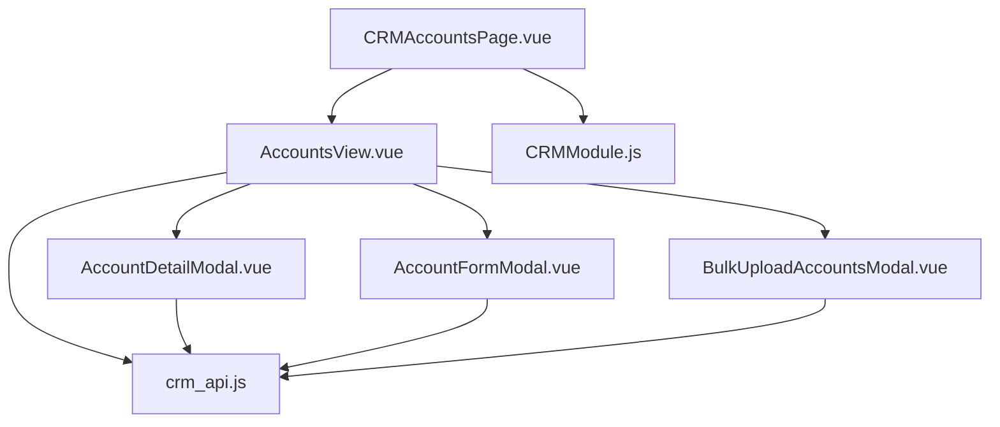
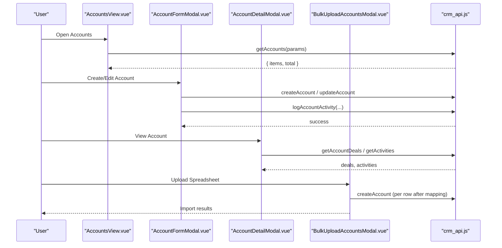
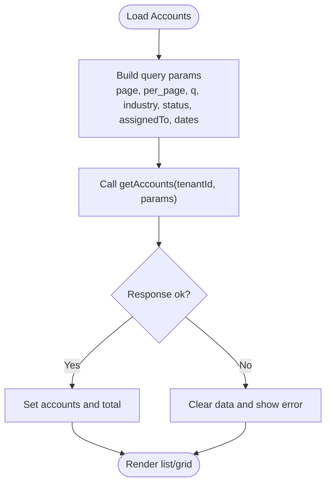
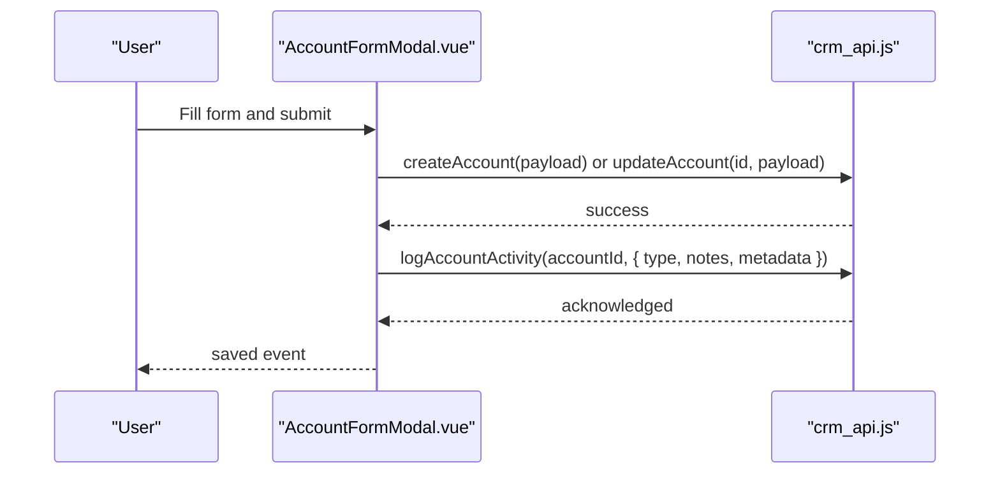
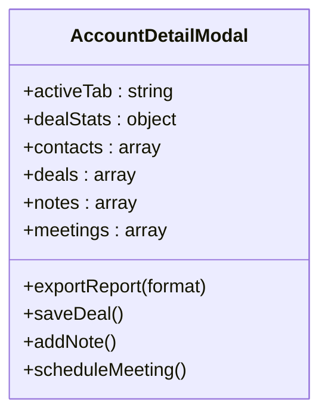
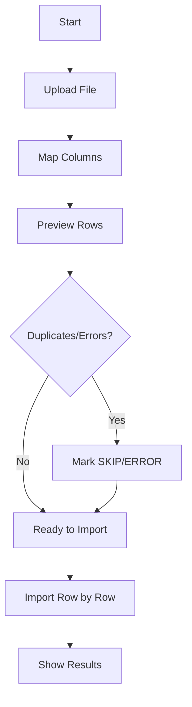
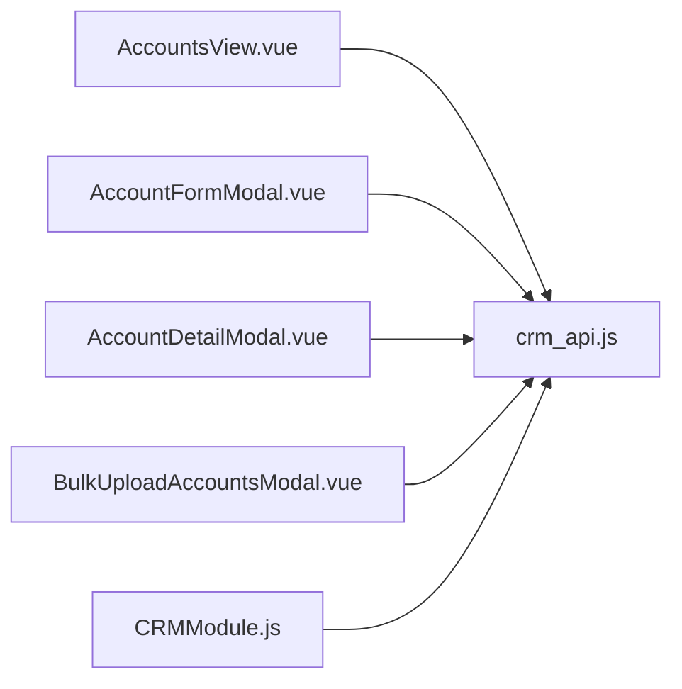

# Account Management

<cite>
**Referenced Files in This Document**
- [CRMAccountsPage.vue](file://src/views/Modules/crm/CRMAccountsPage.vue)
- [AccountsView.vue](file://src/views/Modules/crm/components/AccountsView.vue)
- [AccountDetailModal.vue](file://src/views/Modules/crm/components/AccountDetailModal.vue)
- [AccountFormModal.vue](file://src/views/Modules/crm/components/AccountFormModal.vue)
- [BulkUploadAccountsModal.vue](file://src/views/Modules/crm/components/BulkUploadAccountsModal.vue)
- [crm_api.js](file://src/services/crm_api.js)
- [CRMModule.js](file://src/views/Modules/crm/composables/CRMModule.js)
</cite>

## Table of Contents
1. Introduction
2. Project Structure
3. Core Components
4. Architecture Overview
5. Detailed Component Analysis
6. Dependency Analysis
7. Performance Considerations
8. Troubleshooting Guide
9. Conclusion

## Introduction
This document explains the account management capabilities implemented in the CRM module. It covers how accounts are created, edited, viewed, and organized; how associated contacts, deals, activities, and financial metrics are presented; and how bulk import/export, permissions, and integrations work. It also provides guidance on customizing fields, types, and external directory integration based on the existing codebase patterns.

## Project Structure
The account management feature is centered around a page that hosts an accounts registry view, modals for creating/editing accounts, a detailed account modal with tabs for contacts, deals, notes, meetings, and a bulk upload wizard. The UI calls shared API helpers to perform CRUD operations and related actions.

**Diagram sources**
- [CRMAccountsPage.vue:1-112](file://src/views/Modules/crm/CRMAccountsPage.vue#L1-L112)
- [AccountsView.vue:1-120](file://src/views/Modules/crm/components/AccountsView.vue#L1-L120)
- [AccountFormModal.vue:1-120](file://src/views/Modules/crm/components/AccountFormModal.vue#L1-L120)
- [AccountDetailModal.vue:1-120](file://src/views/Modules/crm/components/AccountDetailModal.vue#L1-L120)
- [BulkUploadAccountsModal.vue:1-120](file://src/views/Modules/crm/components/BulkUploadAccountsModal.vue#L1-L120)
- [crm_api.js:370-412](file://src/services/crm_api.js#L370-L412)
- [CRMModule.js:1-120](file://src/views/Modules/crm/composables/CRMModule.js#L1-L120)

**Section sources**
- [CRMAccountsPage.vue:1-112](file://src/views/Modules/crm/CRMAccountsPage.vue#L1-L112)
- [AccountsView.vue:1-120](file://src/views/Modules/crm/components/AccountsView.vue#L1-L120)

## Core Components
- Accounts list and registry: Provides search, filters (industry, status, assignee, date range), grid/list views, pagination, selection, and bulk actions (assign, delete).
- Account form: Creates or updates accounts with company info, addresses, social links, assignment, and lead association. Logs activity on create/update.
- Account detail: Tabbed view showing overview, contacts, deals, notes, meetings, and quick actions (call, WhatsApp, email, website). Includes export options and CMA/CAC tracking.
- Bulk upload: Step-by-step wizard to upload spreadsheets, map columns, preview, deduplicate by name/email, and import.

Key responsibilities:
- Data fetching and filtering via crm_api.js
- UI orchestration and state via AccountsView.vue and AccountDetailModal.vue
- Form handling and audit logging via AccountFormModal.vue
- Import workflow via BulkUploadAccountsModal.vue

**Section sources**
- [AccountsView.vue:166-250](file://src/views/Modules/crm/components/AccountsView.vue#L166-L250)
- [AccountFormModal.vue:32-85](file://src/views/Modules/crm/components/AccountFormModal.vue#L32-L85)
- [AccountDetailModal.vue:104-310](file://src/views/Modules/crm/components/AccountDetailModal.vue#L104-L310)
- [BulkUploadAccountsModal.vue:23-151](file://src/views/Modules/crm/components/BulkUploadAccountsModal.vue#L23-L151)

## Architecture Overview
The flow from user action to data persistence uses Vue components calling centralized API functions.

**Diagram sources**
- [AccountsView.vue:765-788](file://src/views/Modules/crm/components/AccountsView.vue#L765-L788)
- [AccountFormModal.vue:552-682](file://src/views/Modules/crm/components/AccountFormModal.vue#L552-L682)
- [AccountDetailModal.vue:403-693](file://src/views/Modules/crm/components/AccountDetailModal.vue#L403-L693)
- [BulkUploadAccountsModal.vue:265-308](file://src/views/Modules/crm/components/BulkUploadAccountsModal.vue#L265-L308)
- [crm_api.js:129-143](file://src/services/crm_api.js#L129-L143)
- [crm_api.js:370-412](file://src/services/crm_api.js#L370-L412)
- [crm_api.js:647-654](file://src/services/crm_api.js#L647-L654)

## Detailed Component Analysis

### Accounts Registry (List, Filters, Bulk Actions)
- Search and filters: text search, industry, status, assignee, date range; debounced search triggers reload.
- Views: grid cards and list table with inline Excel-like editing mode.
- Selection and bulk: multi-select, bulk assign to a user, bulk delete with confirmation.
- KPIs: totals, contacts linked, converted from leads, this month, pipeline value, won revenue, average CAC, maintenance cancellations.

**Diagram sources**
- [AccountsView.vue:765-788](file://src/views/Modules/crm/components/AccountsView.vue#L765-L788)
- [crm_api.js:370-375](file://src/services/crm_api.js#L370-L375)

**Section sources**
- [AccountsView.vue:166-250](file://src/views/Modules/crm/components/AccountsView.vue#L166-L250)
- [AccountsView.vue:649-713](file://src/views/Modules/crm/components/AccountsView.vue#L649-L713)
- [AccountsView.vue:749-762](file://src/views/Modules/crm/components/AccountsView.vue#L749-L762)

### Account Creation and Editing
- Fields: name, website, industry, phone, email, employees, annual revenue, billing/shipping addresses, social links, description, assignment.
- Lead association: link one or more leads to become contacts under the account.
- Activity logging: logs creation and field-level changes with structured metadata.

**Diagram sources**
- [AccountFormModal.vue:552-682](file://src/views/Modules/crm/components/AccountFormModal.vue#L552-L682)
- [crm_api.js:129-143](file://src/services/crm_api.js#L129-L143)
- [crm_api.js:647-654](file://src/services/crm_api.js#L647-L654)

**Section sources**
- [AccountFormModal.vue:32-85](file://src/views/Modules/crm/components/AccountFormModal.vue#L32-L85)
- [AccountFormModal.vue:104-142](file://src/views/Modules/crm/components/AccountFormModal.vue#L104-L142)
- [AccountFormModal.vue:144-213](file://src/views/Modules/crm/components/AccountFormModal.vue#L144-L213)
- [AccountFormModal.vue:215-258](file://src/views/Modules/crm/components/AccountFormModal.vue#L215-L258)
- [AccountFormModal.vue:552-682](file://src/views/Modules/crm/components/AccountFormModal.vue#L552-L682)

### Account Detail View
- Tabs: Overview (metrics, attributes, addresses, notes, CMA tracker), Contacts (link leads), Deals (pipeline stats, add/edit/archive), Notes, Meetings.
- Quick actions: call, WhatsApp, email, website.
- Export: PDF, DOCX, XLSX report export from header menu.

**Diagram sources**
- [AccountDetailModal.vue:104-310](file://src/views/Modules/crm/components/AccountDetailModal.vue#L104-L310)
- [AccountDetailModal.vue:403-693](file://src/views/Modules/crm/components/AccountDetailModal.vue#L403-L693)

**Section sources**
- [AccountDetailModal.vue:104-310](file://src/views/Modules/crm/components/AccountDetailModal.vue#L104-L310)
- [AccountDetailModal.vue:403-693](file://src/views/Modules/crm/components/AccountDetailModal.vue#L403-L693)

### Bulk Upload Accounts
- Steps: upload file (.xlsx/.xls/.csv), map columns to fields, preview rows with duplicate/error flags, execute import with duplicate checks by email/name.
- Template download provided for correct format.

**Diagram sources**
- [BulkUploadAccountsModal.vue:23-151](file://src/views/Modules/crm/components/BulkUploadAccountsModal.vue#L23-L151)
- [BulkUploadAccountsModal.vue:265-308](file://src/views/Modules/crm/components/BulkUploadAccountsModal.vue#L265-L308)

**Section sources**
- [BulkUploadAccountsModal.vue:23-151](file://src/views/Modules/crm/components/BulkUploadAccountsModal.vue#L23-L151)
- [BulkUploadAccountsModal.vue:198-205](file://src/views/Modules/crm/components/BulkUploadAccountsModal.vue#L198-L205)
- [BulkUploadAccountsModal.vue:241-248](file://src/views/Modules/crm/components/BulkUploadAccountsModal.vue#L241-L248)
- [BulkUploadAccountsModal.vue:265-308](file://src/views/Modules/crm/components/BulkUploadAccountsModal.vue#L265-L308)

### Financial Metrics and Segmentation
- KPIs in Accounts view include pipeline value, won revenue, average CAC, and maintenance cancellations.
- Segment by industry, status, assignee, and date range.
- Deal stage filters and archived toggle in Account detail deals tab.

**Section sources**
- [AccountsView.vue:749-762](file://src/views/Modules/crm/components/AccountsView.vue#L749-L762)
- [AccountsView.vue:166-250](file://src/views/Modules/crm/components/AccountsView.vue#L166-L250)
- [AccountDetailModal.vue:403-693](file://src/views/Modules/crm/components/AccountDetailModal.vue#L403-L693)

### Permissions and Sharing
- Assignment controls are gated by RBAC; when not allowed, assignment is locked to current scope.
- Bulk assign and deal assignment use the same permission check.

**Section sources**
- [AccountFormModal.vue:87-102](file://src/views/Modules/crm/components/AccountFormModal.vue#L87-L102)
- [AccountDetailModal.vue:467-470](file://src/views/Modules/crm/components/AccountDetailModal.vue#L467-L470)
- [CRMModule.js:41-44](file://src/views/Modules/crm/composables/CRMModule.js#L41-L44)

### Hierarchy and Organization
- Parent-child hierarchy is not explicitly modeled in the UI shown here. Accounts can be filtered by branch via the CRM module’s branch selector, which scopes data across modules.
- Use branch filtering to organize accounts by organizational unit.

**Section sources**
- [CRMAccountsPage.vue:16-24](file://src/views/Modules/crm/CRMAccountsPage.vue#L16-L24)
- [CRMModule.js:46-67](file://src/views/Modules/crm/composables/CRMModule.js#L46-L67)

### Customization and Integration
- Field customization: Add new fields in AccountFormModal and ensure they are persisted via update/create payloads and logged in activity if needed.
- Types: Industry is a select field; extend options to support additional types.
- External directories: Integrate by adding lookup/search logic similar to lead/contact/deal searches and populate fields before save.

**Section sources**
- [AccountFormModal.vue:46-83](file://src/views/Modules/crm/components/AccountFormModal.vue#L46-L83)
- [AccountFormModal.vue:104-142](file://src/views/Modules/crm/components/AccountFormModal.vue#L104-L142)
- [AccountFormModal.vue:552-682](file://src/views/Modules/crm/components/AccountFormModal.vue#L552-L682)

## Dependency Analysis
- UI components depend on crm_api.js for all backend interactions.
- CRMModule.js centralizes shared state and utilities used across CRM pages, including branch scoping and events.
- AccountDetailModal consumes deals and activities APIs to render tabs.

**Diagram sources**
- [AccountsView.vue:585-608](file://src/views/Modules/crm/components/AccountsView.vue#L585-L608)
- [AccountFormModal.vue:294-318](file://src/views/Modules/crm/components/AccountFormModal.vue#L294-L318)
- [AccountDetailModal.vue:1-120](file://src/views/Modules/crm/components/AccountDetailModal.vue#L1-L120)
- [BulkUploadAccountsModal.vue:157-167](file://src/views/Modules/crm/components/BulkUploadAccountsModal.vue#L157-L167)
- [CRMModule.js:1-20](file://src/views/Modules/crm/composables/CRMModule.js#L1-L20)

**Section sources**
- [crm_api.js:370-412](file://src/services/crm_api.js#L370-L412)
- [CRMModule.js:1-20](file://src/views/Modules/crm/composables/CRMModule.js#L1-L20)

## Performance Considerations
- Debounced search reduces unnecessary API calls during typing.
- Pagination limits data transferred per load; consider increasing per_page judiciously.
- Bulk operations process row-by-row; for very large imports, consider server-side batching to reduce client overhead.
- Avoid loading excessive entities at once; the form loads up to 1000 leads/contacts/deals for association—ensure backend supports it.

[No sources needed since this section provides general guidance]

## Troubleshooting Guide
- Loading failures: Check network errors and tenant ID availability; the API helper throws structured errors with status and message.
- Duplicate imports: Bulk upload marks duplicates by email/name; verify mappings and deduplication logic.
- Permission issues: If assignment is locked, confirm RBAC role allows CRM assignment.
- Activity logging: Ensure logAccountActivity succeeds; failures are logged but do not block saves.

**Section sources**
- [crm_api.js:11-32](file://src/services/crm_api.js#L11-L32)
- [BulkUploadAccountsModal.vue:241-248](file://src/views/Modules/crm/components/BulkUploadAccountsModal.vue#L241-L248)
- [AccountFormModal.vue:552-682](file://src/views/Modules/crm/components/AccountFormModal.vue#L552-L682)

## Conclusion
The CRM module provides a robust account management experience with comprehensive listing, filtering, creation/editing, detailed views with integrated contacts, deals, notes, and meetings, and a guided bulk import workflow. Permissions are enforced through RBAC, and financial metrics help segment and prioritize accounts. To extend functionality, add fields and types in the form, integrate external lookups similarly to existing associations, and leverage branch scoping for hierarchical organization.