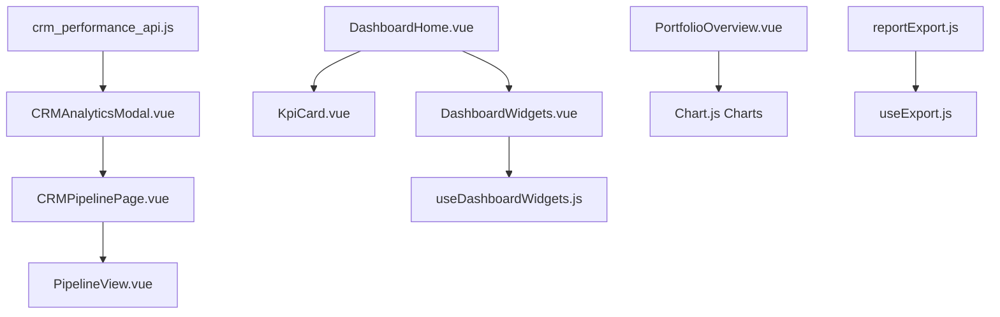
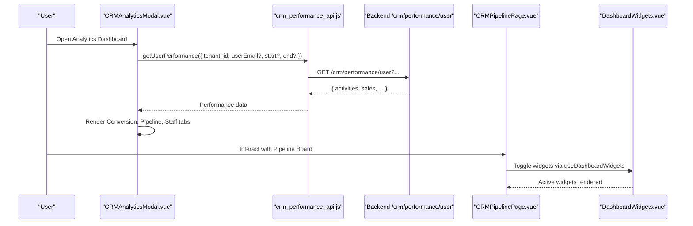
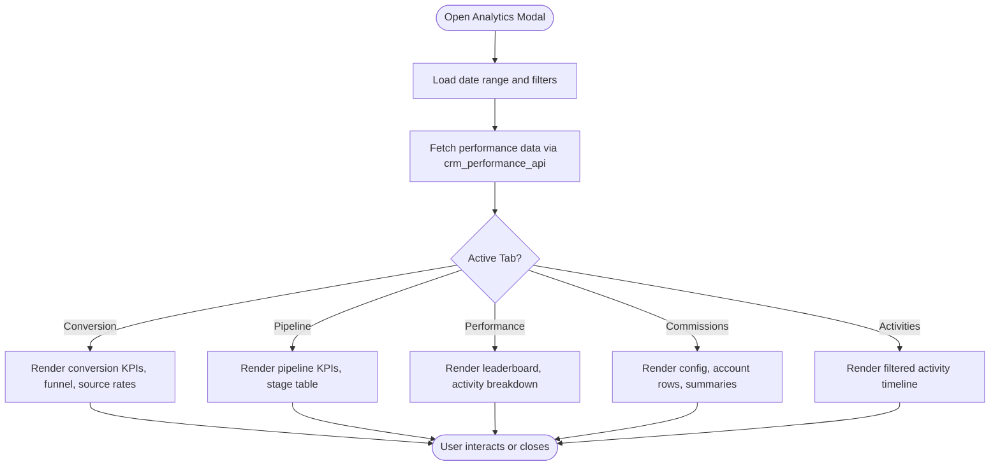
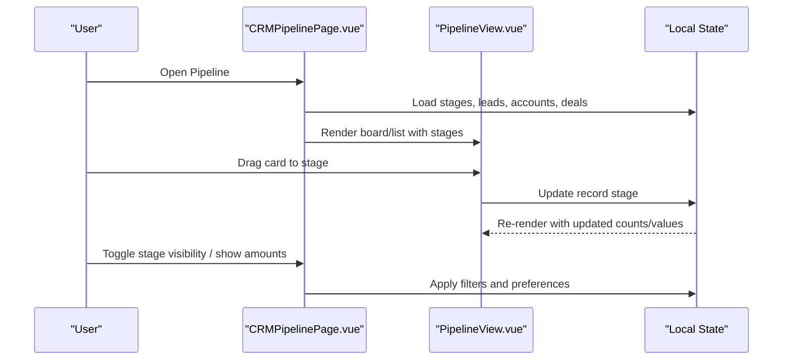
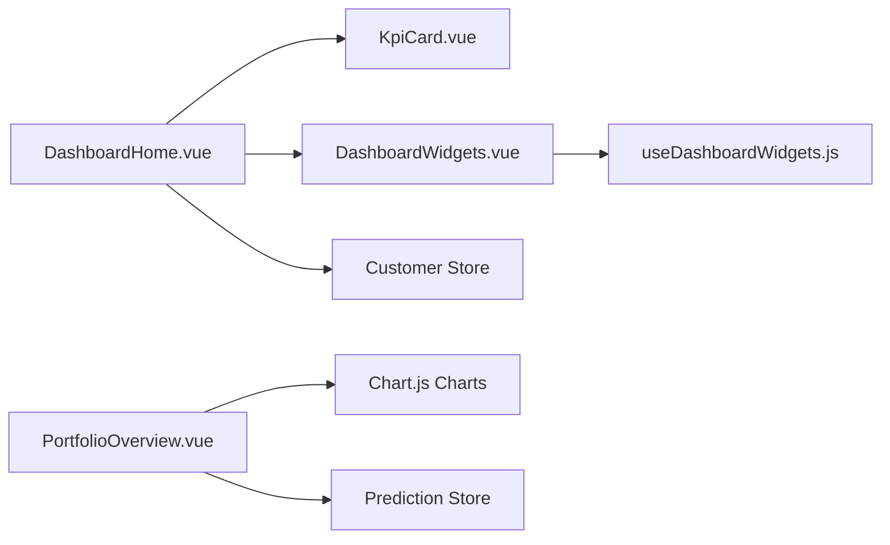
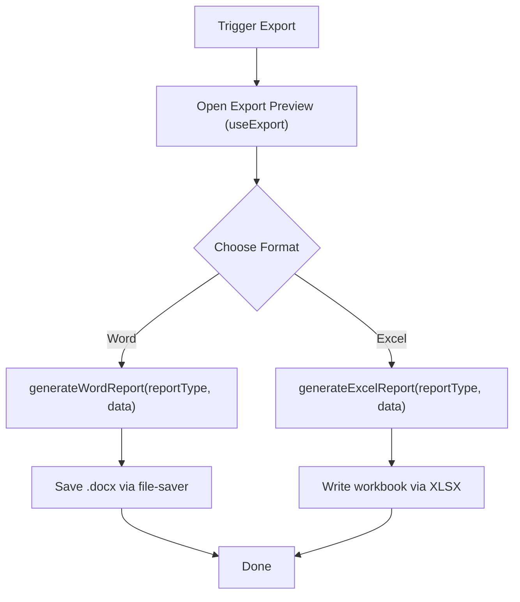
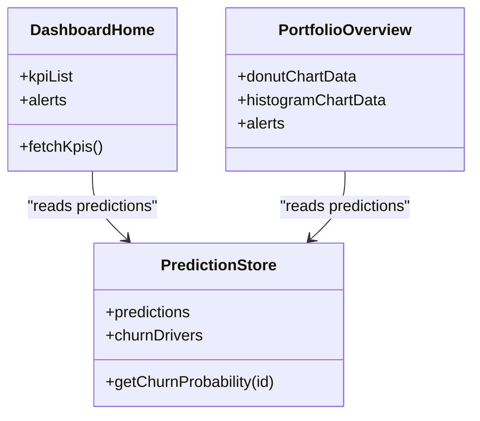
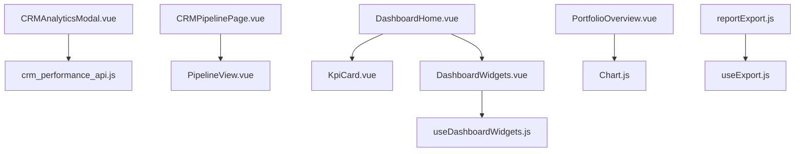

# Analytics & Reporting

<cite>
**Referenced Files in This Document**
- [CRMAnalyticsModal.vue](file://src/views/Modules/crm/components/CRMAnalyticsModal.vue)
- [CRMPipelinePage.vue](file://src/views/Modules/crm/CRMPipelinePage.vue)
- [PipelineView.vue](file://src/views/Modules/crm/components/PipelineView.vue)
- [DashboardHome.vue](file://src/views/DashboardHome.vue)
- [PortfolioOverview.vue](file://src/views/PortfolioOverview.vue)
- [KpiCard.vue](file://src/components/ui/KpiCard.vue)
- [DashboardWidgets.vue](file://src/components/ui/DashboardWidgets.vue)
- [useDashboardWidgets.js](file://src/composables/useDashboardWidgets.js)
- [crm_performance_api.js](file://src/services/crm_performance_api.js)
- [reportExport.js](file://src/utils/reportExport.js)
- [useExport.js](file://src/composables/useExport.js)
</cite>

## Table of Contents
1. Introduction
2. Project Structure
3. Core Components
4. Architecture Overview
5. Detailed Component Analysis
6. Dependency Analysis
7. Performance Considerations
8. Troubleshooting Guide
9. Conclusion
10. Appendices

## Introduction
This document explains the CRM analytics and reporting capabilities implemented in the frontend. It covers performance dashboards, conversion metrics, sales pipeline analytics with real-time visualization and trend analysis, report generation and export functionality, customizable dashboard widgets, portfolio analysis, customer segmentation insights, predictive analytics integration, and guidance for creating custom reports, defining new metrics, and integrating with external BI tools. Where applicable, concrete examples reference actual components and services in the codebase.

## Project Structure
The analytics and reporting features are primarily implemented across:
- CRM analytics modal and tabs (conversion, pipeline, staff performance, commissions, activities)
- Pipeline views (Kanban board and list view)
- Dashboard home and portfolio overview pages with KPIs and charts
- Reusable UI components (KPI cards, dashboard widgets)
- Export utilities for Word and Excel
- Composables for widget management and export flows
- Services to fetch performance data

**Diagram sources**
- [CRMAnalyticsModal.vue:1-800](file://src/views/Modules/crm/components/CRMAnalyticsModal.vue#L1-L800)
- [CRMPipelinePage.vue:1-800](file://src/views/Modules/crm/CRMPipelinePage.vue#L1-L800)
- [PipelineView.vue:1-441](file://src/views/Modules/crm/components/PipelineView.vue#L1-L441)
- [DashboardHome.vue:1-800](file://src/views/DashboardHome.vue#L1-L800)
- [KpiCard.vue:1-130](file://src/components/ui/KpiCard.vue#L1-L130)
- [DashboardWidgets.vue:1-71](file://src/components/ui/DashboardWidgets.vue#L1-L71)
- [useDashboardWidgets.js:1-88](file://src/composables/useDashboardWidgets.js#L1-L88)
- [crm_performance_api.js:1-19](file://src/services/crm_performance_api.js#L1-L19)
- [reportExport.js:1-574](file://src/utils/reportExport.js#L1-L574)
- [useExport.js:1-36](file://src/composables/useExport.js#L1-L36)

**Section sources**
- [CRMAnalyticsModal.vue:1-800](file://src/views/Modules/crm/components/CRMAnalyticsModal.vue#L1-L800)
- [CRMPipelinePage.vue:1-800](file://src/views/Modules/crm/CRMPipelinePage.vue#L1-L800)
- [PipelineView.vue:1-441](file://src/views/Modules/crm/components/PipelineView.vue#L1-L441)
- [DashboardHome.vue:1-800](file://src/views/DashboardHome.vue#L1-L800)
- [PortfolioOverview.vue:1-509](file://src/views/PortfolioOverview.vue#L1-L509)
- [KpiCard.vue:1-130](file://src/components/ui/KpiCard.vue#L1-L130)
- [DashboardWidgets.vue:1-71](file://src/components/ui/DashboardWidgets.vue#L1-L71)
- [useDashboardWidgets.js:1-88](file://src/composables/useDashboardWidgets.js#L1-L88)
- [crm_performance_api.js:1-19](file://src/services/crm_performance_api.js#L1-L19)
- [reportExport.js:1-574](file://src/utils/reportExport.js#L1-L574)
- [useExport.js:1-36](file://src/composables/useExport.js#L1-L36)

## Core Components
- CRM Analytics Modal: Central hub for conversion metrics, pipeline stats, staff performance, commissions, and activity timeline. Includes date range selection and tabbed navigation.
- Pipeline Views: Kanban-style board and list view for leads/accounts/deals with drag-and-drop stage movement, stage visibility controls, and per-stage value aggregation.
- Dashboard Home: KPI cards with trends, alerts panel, predictive lifecycle ledger, and modular widgets.
- Portfolio Overview: State distribution donut chart, health score histogram, critical alerts, and AI churn intelligence.
- Reusable UI: KpiCard for consistent metric display; DashboardWidgets for enabling/disabling widgets persisted locally.
- Export Utilities: Word and Excel report generation with multiple sections/sheets; composable for preview and error handling.
- Performance API: Service to fetch user performance details including activities and sales metrics.

**Section sources**
- [CRMAnalyticsModal.vue:1-800](file://src/views/Modules/crm/components/CRMAnalyticsModal.vue#L1-L800)
- [CRMPipelinePage.vue:1-800](file://src/views/Modules/crm/CRMPipelinePage.vue#L1-L800)
- [PipelineView.vue:1-441](file://src/views/Modules/crm/components/PipelineView.vue#L1-L441)
- [DashboardHome.vue:1-800](file://src/views/DashboardHome.vue#L1-L800)
- [PortfolioOverview.vue:1-509](file://src/views/PortfolioOverview.vue#L1-L509)
- [KpiCard.vue:1-130](file://src/components/ui/KpiCard.vue#L1-L130)
- [DashboardWidgets.vue:1-71](file://src/components/ui/DashboardWidgets.vue#L1-L71)
- [useDashboardWidgets.js:1-88](file://src/composables/useDashboardWidgets.js#L1-L88)
- [reportExport.js:1-574](file://src/utils/reportExport.js#L1-L574)
- [useExport.js:1-36](file://src/composables/useExport.js#L1-L36)
- [crm_performance_api.js:1-19](file://src/services/crm_performance_api.js#L1-L19)

## Architecture Overview
The analytics system is a Vue-based frontend composed of page-level views, reusable components, composables for state and behavior, and service calls to backend endpoints. Data flows from services into views and components, which render charts, tables, and KPIs. Export utilities transform data into downloadable documents.

**Diagram sources**
- [CRMAnalyticsModal.vue:1-800](file://src/views/Modules/crm/components/CRMAnalyticsModal.vue#L1-L800)
- [crm_performance_api.js:1-19](file://src/services/crm_performance_api.js#L1-L19)
- [CRMPipelinePage.vue:1-800](file://src/views/Modules/crm/CRMPipelinePage.vue#L1-L800)
- [DashboardWidgets.vue:1-71](file://src/components/ui/DashboardWidgets.vue#L1-L71)

## Detailed Component Analysis

### CRM Analytics Modal
- Tabs: Conversion, Pipeline, Staff Performance, Commissions, Activities.
- Conversion Metrics: Conversion rate, average conversion time, average CAC, stale leads threshold, funnel visualization, conversion by source.
- Pipeline Stats: Pipeline value, weighted value, deals won/lost, stage breakdown table with count, value, avg age, win probability.
- Staff Performance: Leaderboard with leads assigned, converted, activities, revenue, conversion rate bar; expandable per-user activity breakdown; auto-assign button for admins.
- Commissions: Configurable base rate, bonus threshold/rate, period, calculation scope; account rows with linked deals; summary by staff member; history log.
- Activities: Timeline feed with filters by source, type, user; duration/outcome metadata.

**Diagram sources**
- [CRMAnalyticsModal.vue:1-800](file://src/views/Modules/crm/components/CRMAnalyticsModal.vue#L1-L800)
- [crm_performance_api.js:1-19](file://src/services/crm_performance_api.js#L1-L19)

**Section sources**
- [CRMAnalyticsModal.vue:1-800](file://src/views/Modules/crm/components/CRMAnalyticsModal.vue#L1-L800)
- [crm_performance_api.js:1-19](file://src/services/crm_performance_api.js#L1-L19)

### Pipeline Views (Board and List)
- Kanban board with columns per stage, draggable cards, stage visibility toggles, amount display, and search/filter by assigned user.
- Mobile list view with stage grouping and card actions.
- Stage configuration modal to add custom stages with entity type and position.
- Per-stage KPIs: lead counts and stage values.

**Diagram sources**
- [CRMPipelinePage.vue:1-800](file://src/views/Modules/crm/CRMPipelinePage.vue#L1-L800)
- [PipelineView.vue:1-441](file://src/views/Modules/crm/components/PipelineView.vue#L1-L441)

**Section sources**
- [CRMPipelinePage.vue:1-800](file://src/views/Modules/crm/CRMPipelinePage.vue#L1-L800)
- [PipelineView.vue:1-441](file://src/views/Modules/crm/components/PipelineView.vue#L1-L441)

### Dashboard Home and Portfolio Overview
- Dashboard Home:
  - KPI cards with trends and actions (revenue, expenses, invoices, payroll, POS today, inventory).
  - Alerts panel and predictive lifecycle ledger showing churn probability and CLV percentiles.
  - Widgets area using DashboardWidgets and useDashboardWidgets for enabling/disabling modules.
- Portfolio Overview:
  - Donut chart for state distribution and bar chart for health score distribution.
  - Critical alerts derived from prediction store and portfolio metrics.
  - AI churn intelligence section listing top drivers.

**Diagram sources**
- [DashboardHome.vue:1-800](file://src/views/DashboardHome.vue#L1-L800)
- [KpiCard.vue:1-130](file://src/components/ui/KpiCard.vue#L1-L130)
- [DashboardWidgets.vue:1-71](file://src/components/ui/DashboardWidgets.vue#L1-L71)
- [useDashboardWidgets.js:1-88](file://src/composables/useDashboardWidgets.js#L1-L88)
- [PortfolioOverview.vue:1-509](file://src/views/PortfolioOverview.vue#L1-L509)

**Section sources**
- [DashboardHome.vue:1-800](file://src/views/DashboardHome.vue#L1-L800)
- [PortfolioOverview.vue:1-509](file://src/views/PortfolioOverview.vue#L1-L509)
- [KpiCard.vue:1-130](file://src/components/ui/KpiCard.vue#L1-L130)
- [DashboardWidgets.vue:1-71](file://src/components/ui/DashboardWidgets.vue#L1-L71)
- [useDashboardWidgets.js:1-88](file://src/composables/useDashboardWidgets.js#L1-L88)

### Report Generation and Export
- Word Reports: Sections for assets, revenue, capital, liabilities, and financial health; generated via docx library and saved using file-saver.
- Excel Reports: Multiple sheets for assets, revenue, capital, liabilities, and health metrics; written via XLSX compatibility layer.
- Export Flow: Preview modal with columns/rows/title; handle export function wraps format-specific exporters with error toast.

**Diagram sources**
- [reportExport.js:1-574](file://src/utils/reportExport.js#L1-L574)
- [useExport.js:1-36](file://src/composables/useExport.js#L1-L36)

**Section sources**
- [reportExport.js:1-574](file://src/utils/reportExport.js#L1-L574)
- [useExport.js:1-36](file://src/composables/useExport.js#L1-L36)

### Portfolio Analysis, Customer Segmentation, Predictive Analytics
- Portfolio Analysis:
  - State distribution (donut) and health score histogram (bar) visualize segmentation across states and health ranges.
  - Critical alerts highlight high churn risk customers and portfolio-level anomalies.
- Predictive Analytics Integration:
  - Churn probability and CLV percentile displayed in ledger and overview.
  - Churn drivers surfaced in AI intelligence panel.
- Customization:
  - Snapshot selector allows viewing historical portfolio snapshots.

**Diagram sources**
- [DashboardHome.vue:1-800](file://src/views/DashboardHome.vue#L1-L800)
- [PortfolioOverview.vue:1-509](file://src/views/PortfolioOverview.vue#L1-L509)

**Section sources**
- [DashboardHome.vue:1-800](file://src/views/DashboardHome.vue#L1-L800)
- [PortfolioOverview.vue:1-509](file://src/views/PortfolioOverview.vue#L1-L509)

## Dependency Analysis
- CRMAnalyticsModal depends on crm_performance_api to fetch performance data and renders internal computed metrics and tables.
- CRMPipelinePage composes PipelineView for rendering and manages local state for stages, leads, accounts, and deals.
- DashboardHome integrates KpiCard for consistent KPI presentation and uses DashboardWidgets with useDashboardWidgets for widget persistence.
- PortfolioOverview uses Chart.js components for visualizations and reads from stores for live data.
- reportExport provides standalone generators used by any feature needing Word/Excel exports; useExport composes preview and error handling.

**Diagram sources**
- [CRMAnalyticsModal.vue:1-800](file://src/views/Modules/crm/components/CRMAnalyticsModal.vue#L1-L800)
- [crm_performance_api.js:1-19](file://src/services/crm_performance_api.js#L1-L19)
- [CRMPipelinePage.vue:1-800](file://src/views/Modules/crm/CRMPipelinePage.vue#L1-L800)
- [PipelineView.vue:1-441](file://src/views/Modules/crm/components/PipelineView.vue#L1-L441)
- [DashboardHome.vue:1-800](file://src/views/DashboardHome.vue#L1-L800)
- [KpiCard.vue:1-130](file://src/components/ui/KpiCard.vue#L1-L130)
- [DashboardWidgets.vue:1-71](file://src/components/ui/DashboardWidgets.vue#L1-L71)
- [useDashboardWidgets.js:1-88](file://src/composables/useDashboardWidgets.js#L1-L88)
- [PortfolioOverview.vue:1-509](file://src/views/PortfolioOverview.vue#L1-L509)
- [reportExport.js:1-574](file://src/utils/reportExport.js#L1-L574)
- [useExport.js:1-36](file://src/composables/useExport.js#L1-L36)

**Section sources**
- [CRMAnalyticsModal.vue:1-800](file://src/views/Modules/crm/components/CRMAnalyticsModal.vue#L1-L800)
- [CRMPipelinePage.vue:1-800](file://src/views/Modules/crm/CRMPipelinePage.vue#L1-L800)
- [DashboardHome.vue:1-800](file://src/views/DashboardHome.vue#L1-L800)
- [PortfolioOverview.vue:1-509](file://src/views/PortfolioOverview.vue#L1-L509)
- [reportExport.js:1-574](file://src/utils/reportExport.js#L1-L574)
- [useExport.js:1-36](file://src/composables/useExport.js#L1-L36)

## Performance Considerations
- Use tabbed analytics to avoid rendering all content at once; only compute visible tab data.
- Debounce or throttle pipeline drag operations and stage updates to reduce re-renders.
- For large datasets in Portfolio Overview, paginate ledger rows and batch prediction requests as implemented.
- Prefer computed properties for chart data to minimize recalculations.
- Export operations should be triggered after data stabilization to avoid redundant work.

[No sources needed since this section provides general guidance]

## Troubleshooting Guide
- Analytics data not loading:
  - Verify tenant_id and optional filters passed to getUserPerformance.
  - Check network requests to /crm/performance/user and ensure authentication headers are present.
- Export failures:
  - Ensure data structure matches expected fields for Word/Excel sections.
  - Review error toast from useExport.handleExport for specific failure messages.
- Widget visibility issues:
  - Confirm localStorage persistence key and that registered widgets have unique IDs.
  - Reset browser storage if widget state becomes inconsistent.

**Section sources**
- [crm_performance_api.js:1-19](file://src/services/crm_performance_api.js#L1-L19)
- [reportExport.js:1-574](file://src/utils/reportExport.js#L1-L574)
- [useExport.js:1-36](file://src/composables/useExport.js#L1-L36)
- [useDashboardWidgets.js:1-88](file://src/composables/useDashboardWidgets.js#L1-L88)

## Conclusion
The frontend implements a comprehensive CRM analytics and reporting suite with interactive dashboards, conversion and pipeline metrics, staff performance tracking, commission calculations, and activity timelines. Real-time visualization is achieved through dynamic charts and reactive components. Export capabilities support Word and Excel outputs. The system integrates predictive analytics for churn and CLV insights and offers customizable widgets for tailored dashboards. Extending the system involves adding new tabs, metrics, and export sections while leveraging existing composables and services.

[No sources needed since this section summarizes without analyzing specific files]

## Appendices

### Creating Custom Reports
- Add a new section generator in reportExport.js for your domain data.
- Wire a trigger in relevant views to call generateWordReport or generateExcelReport with appropriate reportType and data payload.
- Use useExport.openExportPreview to provide a preview before download.

**Section sources**
- [reportExport.js:1-574](file://src/utils/reportExport.js#L1-L574)
- [useExport.js:1-36](file://src/composables/useExport.js#L1-L36)

### Defining New Metrics
- Extend CRMAnalyticsModal tabs with new KPI cards and computations based on fetched performance data.
- Use KpiCard for consistent display with trends and formatting options.
- Persist user preferences for metric visibility via useDashboardWidgets if needed.

**Section sources**
- [CRMAnalyticsModal.vue:1-800](file://src/views/Modules/crm/components/CRMAnalyticsModal.vue#L1-L800)
- [KpiCard.vue:1-130](file://src/components/ui/KpiCard.vue#L1-L130)
- [useDashboardWidgets.js:1-88](file://src/composables/useDashboardWidgets.js#L1-L88)

### Integrating with External BI Tools
- Expose stable endpoints for performance and pipeline data via crm_performance_api and corresponding backend services.
- Provide CSV/JSON export hooks alongside Word/Excel for BI ingestion.
- Standardize field names and units for metrics like conversion rate, pipeline value, and staff activities.

**Section sources**
- [crm_performance_api.js:1-19](file://src/services/crm_performance_api.js#L1-L19)
- [reportExport.js:1-574](file://src/utils/reportExport.js#L1-L574)