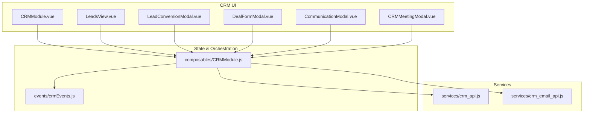
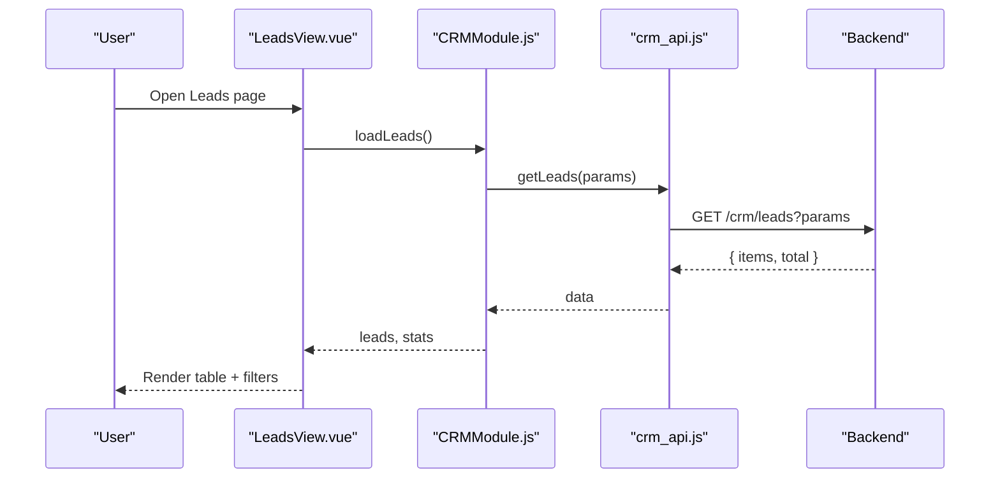
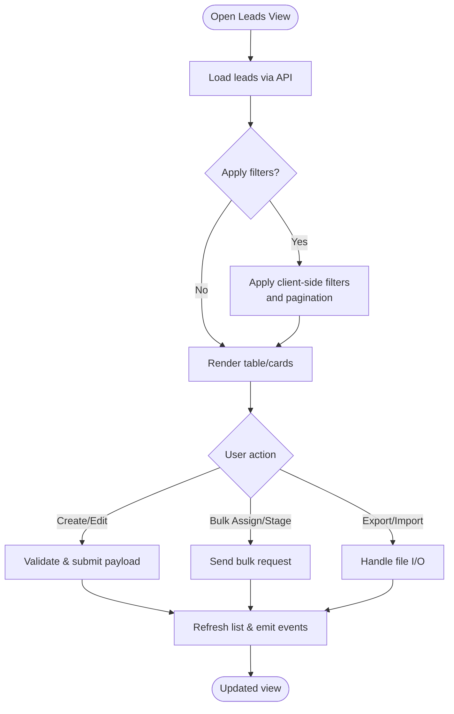
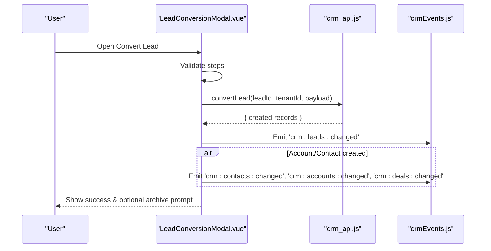
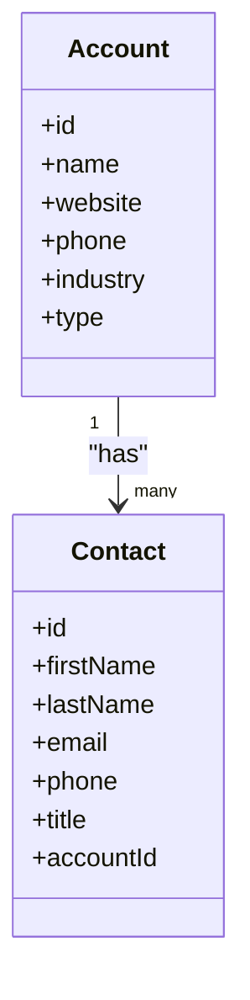
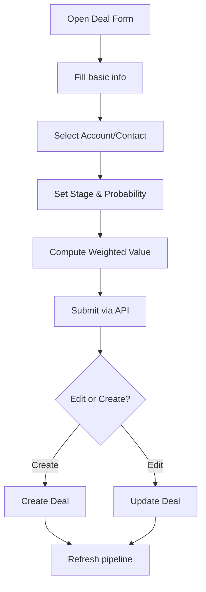
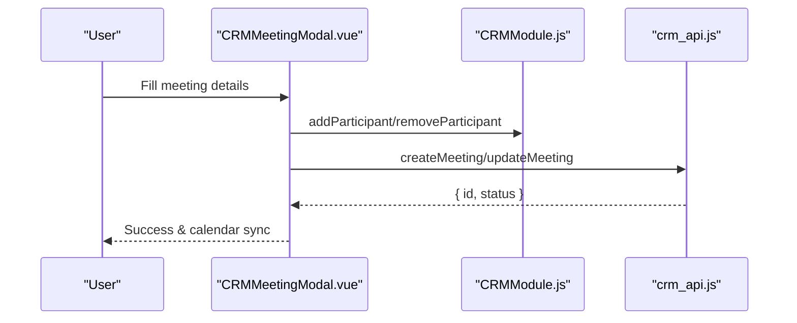
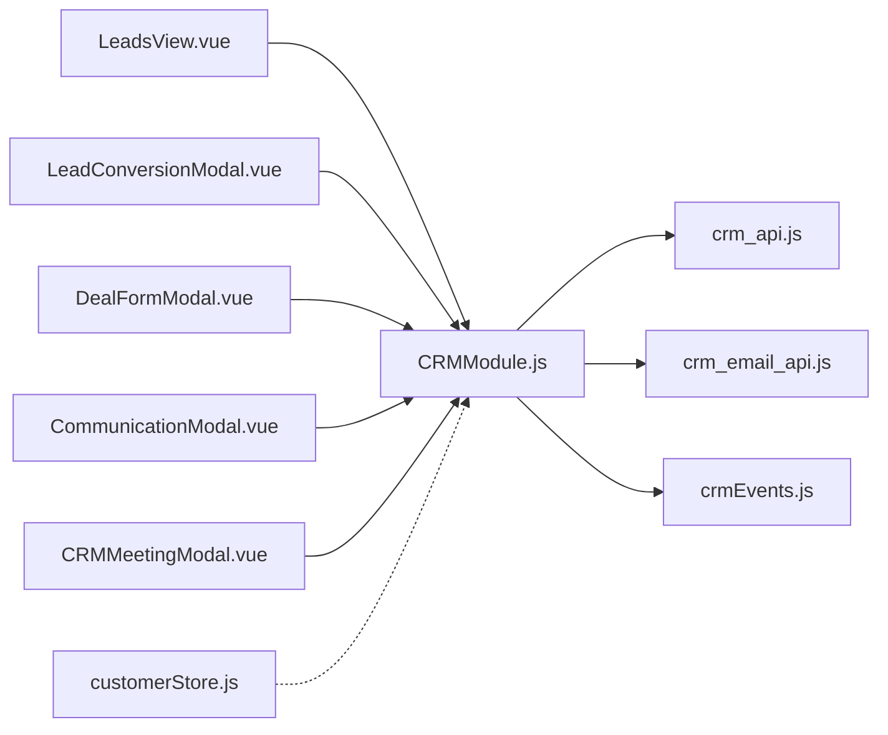

# CRM Module

<cite>
**Referenced Files in This Document**
- [CRMModule.vue](file://src/views/Modules/crm/CRMModule.vue)
- [LeadsView.vue](file://src/views/Modules/crm/components/LeadsView.vue)
- [LeadConversionModal.vue](file://src/views/Modules/crm/components/LeadConversionModal.vue)
- [DealFormModal.vue](file://src/views/Modules/crm/components/DealFormModal.vue)
- [CommunicationModal.vue](file://src/views/Modules/crm/components/CommunicationModal.vue)
- [CRMMeetingModal.vue](file://src/views/Modules/crm/components/CRMMeetingModal.vue)
- [CRMModule.js](file://src/views/Modules/crm/composables/CRMModule.js)
- [crm_api.js](file://src/services/crm_api.js)
- [crm_email_api.js](file://src/services/crm_email_api.js)
- [crmEvents.js](file://src/events/crmEvents.js)
- [customerStore.js](file://src/stores/customerStore.js)
</cite>

## Table of Contents
1. Introduction
2. Project Structure
3. Core Components
4. Architecture Overview
5. Detailed Component Analysis
6. Dependency Analysis
7. Performance Considerations
8. Troubleshooting Guide
9. Conclusion
10. Appendices

## Introduction
This document explains the Customer Relationship Management (CRM) module, focusing on the lead-to-deal workflow: lead management, contact tracking, account organization, and deal pipeline management. It also documents communication tools (email, calls, meetings, WhatsApp), relationships with AI agents and strategic modules, common workflows (lead conversion, contact enrichment, deal progression, customer lifecycle), and guidance for extending functionality and integrating external systems.

## Project Structure
The CRM module is implemented as a set of Vue components and composables under src/views/Modules/crm, with services in src/services that wrap backend APIs. A shared composable centralizes state and orchestration across CRM pages.

**Diagram sources**
- [CRMModule.vue:1-411](file://src/views/Modules/crm/CRMModule.vue#L1-L411)
- [CRMModule.js:1-800](file://src/views/Modules/crm/composables/CRMModule.js#L1-L800)
- [crm_api.js:1-800](file://src/services/crm_api.js#L1-L800)
- [crm_email_api.js:1-313](file://src/services/crm_email_api.js#L1-L313)
- [crmEvents.js:1-31](file://src/events/crmEvents.js#L1-L31)

**Section sources**
- [CRMModule.vue:1-411](file://src/views/Modules/crm/CRMModule.vue#L1-L411)
- [CRMModule.js:1-800](file://src/views/Modules/crm/composables/CRMModule.js#L1-L800)

## Core Components
- CRMModule.vue: Dashboard entry point with KPIs, navigation cards, analytics modal, and branch context.
- LeadsView.vue: Lead list with filters, bulk actions, Excel-like inline editing, and quick stats.
- LeadConversionModal.vue: Step-by-step wizard to convert a lead into contact/account/deal.
- DealFormModal.vue: Create/edit deals with associated accounts/contacts and weighted value calculation.
- CommunicationModal.vue: Unified message composer for email, call, WhatsApp, meeting.
- CRMMeetingModal.vue: Meeting scheduler with location search, participant management, reminders, and linked records.
- CRMModule.js: Shared state, data loading, pipeline stages, communications, visits, emails, meetings, and cross-module integrations.

Key responsibilities:
- Data binding between UI forms and API payloads
- Validation rules enforced in modals and forms
- Event-driven updates via crmEvents
- Branch-scoped filtering and tenant-aware operations

**Section sources**
- [CRMModule.vue:1-411](file://src/views/Modules/crm/CRMModule.vue#L1-L411)
- [LeadsView.vue:1-800](file://src/views/Modules/crm/components/LeadsView.vue#L1-L800)
- [LeadConversionModal.vue:1-654](file://src/views/Modules/crm/components/LeadConversionModal.vue#L1-L654)
- [DealFormModal.vue:1-415](file://src/views/Modules/crm/components/DealFormModal.vue#L1-L415)
- [CommunicationModal.vue:1-66](file://src/views/Modules/crm/components/CommunicationModal.vue#L1-L66)
- [CRMMeetingModal.vue:1-600](file://src/views/Modules/crm/components/CRMMeetingModal.vue#L1-L600)
- [CRMModule.js:1-800](file://src/views/Modules/crm/composables/CRMModule.js#L1-L800)

## Architecture Overview
The CRM module follows a layered architecture:
- UI Layer: Vue components render dashboards, lists, and modals.
- State/Orchestration: A shared composable manages global CRM state, event subscriptions, and cross-feature coordination.
- Services: Thin HTTP clients wrap backend endpoints for leads, contacts, accounts, deals, activities, meetings, emails, and more.
- Events: A simple event bus decouples components and triggers refreshes after mutations.

**Diagram sources**
- [LeadsView.vue:1-800](file://src/views/Modules/crm/components/LeadsView.vue#L1-L800)
- [CRMModule.js:1-800](file://src/views/Modules/crm/composables/CRMModule.js#L1-L800)
- [crm_api.js:1-800](file://src/services/crm_api.js#L1-L800)

**Section sources**
- [CRMModule.js:1-800](file://src/views/Modules/crm/composables/CRMModule.js#L1-L800)
- [crm_api.js:1-800](file://src/services/crm_api.js#L1-L800)

## Detailed Component Analysis

### Lead Management
- Features: Search, priority/activity/stage/source/group/tag filters, date range, assignee filter, bulk select, bulk assign, stage change, archive/restore, export/import, Excel-like inline editing.
- Data binding: Form fields map to lead properties; changes tracked for batch save.
- Validation: Required fields enforced before submission; stage and priority validated.
- API integration: Uses crm_api.js for listing, creating, updating, deleting leads; supports bulk operations and import/export.

**Diagram sources**
- [LeadsView.vue:1-800](file://src/views/Modules/crm/components/LeadsView.vue#L1-L800)
- [crm_api.js:1-800](file://src/services/crm_api.js#L1-L800)

**Section sources**
- [LeadsView.vue:1-800](file://src/views/Modules/crm/components/LeadsView.vue#L1-L800)
- [crm_api.js:1-800](file://src/services/crm_api.js#L1-L800)

### Lead Conversion Workflow
- Steps: Contact creation/linking/skip → Account creation/linking/skip → Deal edit → Review & confirm.
- Business logic: Validates required fields per step; constructs conversion payload; calls convert endpoint; optionally archives converted lead; emits events to refresh related entities.
- Data binding: Pre-fills from lead data; dynamic options based on selections.

**Diagram sources**
- [LeadConversionModal.vue:1-654](file://src/views/Modules/crm/components/LeadConversionModal.vue#L1-L654)
- [crm_api.js:1-800](file://src/services/crm_api.js#L1-L800)
- [crmEvents.js:1-31](file://src/events/crmEvents.js#L1-L31)

**Section sources**
- [LeadConversionModal.vue:1-654](file://src/views/Modules/crm/components/LeadConversionModal.vue#L1-L654)
- [crm_api.js:1-800](file://src/services/crm_api.js#L1-L800)
- [crmEvents.js:1-31](file://src/events/crmEvents.js#L1-L31)

### Accounts and Contacts
- Accounts: Create/update/delete; link contacts; fetch account-specific activities and deals.
- Contacts: Create/update/delete; associate with accounts; fetch activities.
- Data binding: Forms bind to account/contact fields; validation ensures required fields.
- API integration: crm_api.js provides CRUD and relationship endpoints.

**Diagram sources**
- [crm_api.js:1-800](file://src/services/crm_api.js#L1-L800)

**Section sources**
- [crm_api.js:1-800](file://src/services/crm_api.js#L1-L800)

### Deals and Pipeline
- Deal form: Basic info (name, amount, stage, probability, expected close date), associated account/contact, assignment, description/next steps, weighted value display, document linkage.
- Pipeline: Stage definitions are configurable; default stages include New, Contacted, Qualified, Proposal Sent, Negotiation, Closed Won/Lost; custom stages supported.
- API integration: Create/update/delete deals; fetch activities; retrieve account-related deals.

**Diagram sources**
- [DealFormModal.vue:1-415](file://src/views/Modules/crm/components/DealFormModal.vue#L1-L415)
- [CRMModule.js:1-800](file://src/views/Modules/crm/composables/CRMModule.js#L1-L800)
- [crm_api.js:1-800](file://src/services/crm_api.js#L1-L800)

**Section sources**
- [DealFormModal.vue:1-415](file://src/views/Modules/crm/components/DealFormModal.vue#L1-L415)
- [CRMModule.js:1-800](file://src/views/Modules/crm/composables/CRMModule.js#L1-L800)
- [crm_api.js:1-800](file://src/services/crm_api.js#L1-L800)

### Communications: Email, Calls, Meetings, WhatsApp
- Email: Send, schedule, list, track opens/clicks/replies/bounces; manage configurations per tenant.
- Calls: Initiate call logging; capture outcome, duration, notes; update latest communication; log activity on lead.
- Meetings: Schedule with type/location, participants, reminders; link to lead/contact/account; geolocation search and distance calculation; create/update/delete via API.
- WhatsApp: Quick helpers open WhatsApp web/app and log communication entries.

**Diagram sources**
- [CRMMeetingModal.vue:1-600](file://src/views/Modules/crm/components/CRMMeetingModal.vue#L1-L600)
- [CRMModule.js:1-800](file://src/views/Modules/crm/composables/CRMModule.js#L1-L800)
- [crm_api.js:1-800](file://src/services/crm_api.js#L1-L800)

**Section sources**
- [crm_email_api.js:1-313](file://src/services/crm_email_api.js#L1-L313)
- [CommunicationModal.vue:1-66](file://src/views/Modules/crm/components/CommunicationModal.vue#L1-L66)
- [CRMMeetingModal.vue:1-600](file://src/views/Modules/crm/components/CRMMeetingModal.vue#L1-L600)
- [crm_api.js:1-800](file://src/services/crm_api.js#L1-L800)

### CRM Dashboard and Analytics
- KPIs: Conversion rate, average days to convert, stale leads count, totals for leads/accounts/deals, pipeline value.
- Analytics modal: Aggregates stats, performance, activities, and pipeline data; supports auto-assign and refresh.
- Branch context: Filters data by selected branch; updates metrics accordingly.

**Section sources**
- [CRMModule.vue:1-411](file://src/views/Modules/crm/CRMModule.vue#L1-L411)
- [CRMModule.js:1-800](file://src/views/Modules/crm/composables/CRMModule.js#L1-L800)

## Dependency Analysis
- Components depend on the shared composable for state and orchestration.
- The composable depends on crm_api.js and crm_email_api.js for backend interactions.
- Event bus (crmEvents.js) enables loose coupling between components for real-time updates.
- Stores like customerStore.js provide portfolio-level insights and timelines for customers.

**Diagram sources**
- [CRMModule.js:1-800](file://src/views/Modules/crm/composables/CRMModule.js#L1-L800)
- [crm_api.js:1-800](file://src/services/crm_api.js#L1-L800)
- [crm_email_api.js:1-313](file://src/services/crm_email_api.js#L1-L313)
- [crmEvents.js:1-31](file://src/events/crmEvents.js#L1-L31)
- [customerStore.js:1-187](file://src/stores/customerStore.js#L1-L187)

**Section sources**
- [CRMModule.js:1-800](file://src/views/Modules/crm/composables/CRMModule.js#L1-L800)
- [crm_api.js:1-800](file://src/services/crm_api.js#L1-L800)
- [crm_email_api.js:1-313](file://src/services/crm_email_api.js#L1-L313)
- [crmEvents.js:1-31](file://src/events/crmEvents.js#L1-L31)
- [customerStore.js:1-187](file://src/stores/customerStore.js#L1-L187)

## Performance Considerations
- Use pagination and per-page limits in list views to reduce payload size.
- Debounce search inputs (e.g., participant search) to avoid excessive requests.
- Cache results where appropriate (e.g., location search cache).
- Batch operations (bulk assign/update/delete) to minimize network calls.
- Prefer computed properties for derived data to avoid recomputation.

[No sources needed since this section provides general guidance]

## Troubleshooting Guide
- Authentication errors: Ensure token is present in headers; check _headers helper in crm_api.js.
- Validation errors: Backend returns structured errors; UI surfaces messages via error handling in services.
- Missing tenant ID: Many endpoints require tenant_id; ensure it is extracted from JWT and passed.
- Event not firing: Verify crmEvents listeners are registered and emitted correctly after mutations.
- Email send failures: Check configuration endpoints and test configuration flow.

**Section sources**
- [crm_api.js:1-800](file://src/services/crm_api.js#L1-L800)
- [crm_email_api.js:1-313](file://src/services/crm_email_api.js#L1-L313)
- [crmEvents.js:1-31](file://src/events/crmEvents.js#L1-L31)

## Conclusion
The CRM module provides a comprehensive lead-to-deal workflow with robust lead management, contact and account organization, deal pipeline control, and integrated communications. The shared composable centralizes state and orchestrates interactions with backend services, while the event bus ensures consistent UI updates. Extensibility points include custom pipeline stages, additional communication types, and modular stores for advanced analytics.

[No sources needed since this section summarizes without analyzing specific files]

## Appendices

### Common Workflows
- Lead conversion: Use the multi-step modal to create/link contact and account, then finalize deal creation and optionally archive the lead.
- Contact enrichment: Update contact details and link to an account; attach activities and communications.
- Deal progression: Move deals through stages; update probability and expected close dates; compute weighted values.
- Customer lifecycle: Track activities across leads, contacts, accounts, and deals; use timeline and portfolio insights.

**Section sources**
- [LeadConversionModal.vue:1-654](file://src/views/Modules/crm/components/LeadConversionModal.vue#L1-L654)
- [crm_api.js:1-800](file://src/services/crm_api.js#L1-L800)
- [customerStore.js:1-187](file://src/stores/customerStore.js#L1-L187)

### Extending CRM Functionality
- Add custom fields: Extend form models in modals and ensure API payloads include new fields; validate on both frontend and backend.
- Integrate external systems: Add new service wrappers similar to crm_api.js and crm_email_api.js; expose methods in the shared composable.
- Custom pipeline stages: Configure via metadata endpoints; update visible stages in the composable.
- Additional communications: Implement new subtype handlers (e.g., SMS) in communication flows and log activities.

**Section sources**
- [CRMModule.js:1-800](file://src/views/Modules/crm/composables/CRMModule.js#L1-L800)
- [crm_api.js:1-800](file://src/services/crm_api.js#L1-L800)
- [crm_email_api.js:1-313](file://src/services/crm_email_api.js#L1-L313)