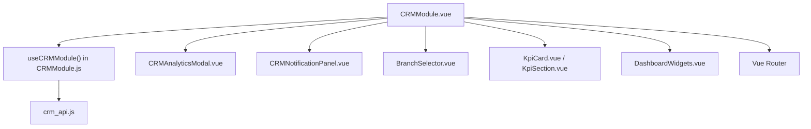
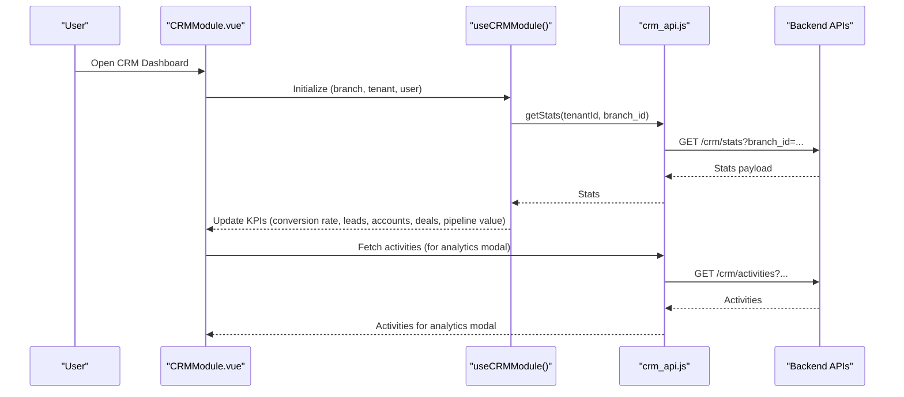
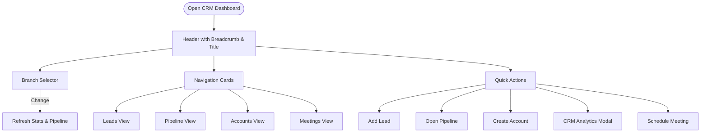
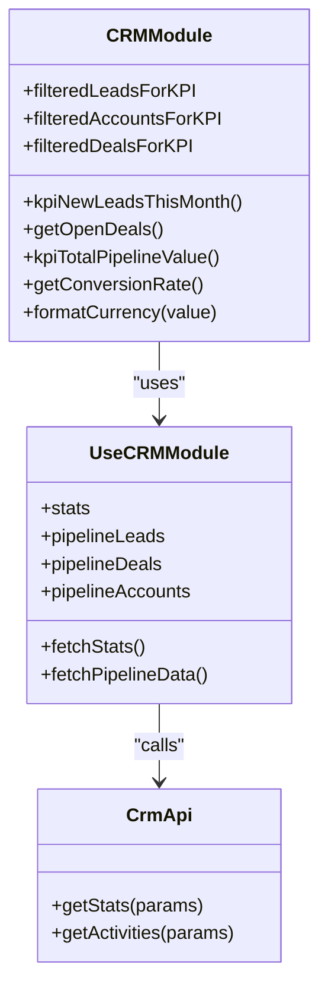
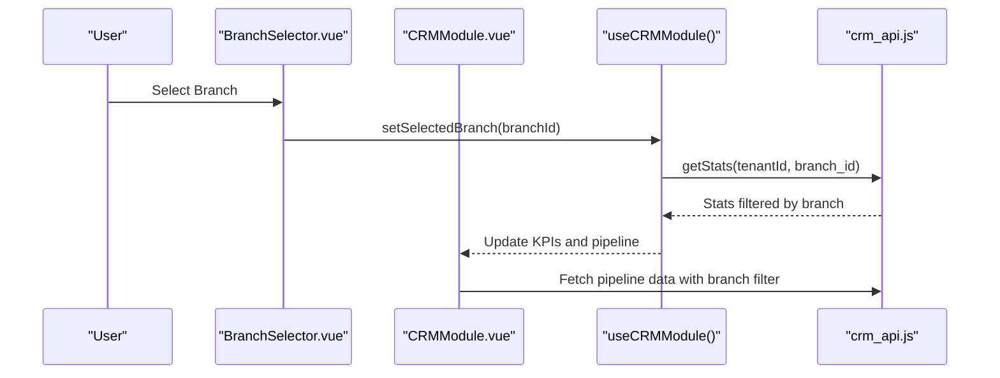
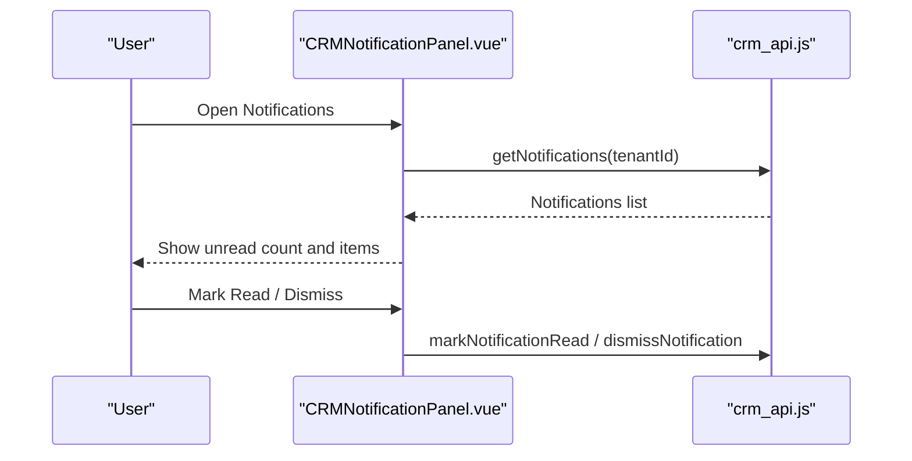
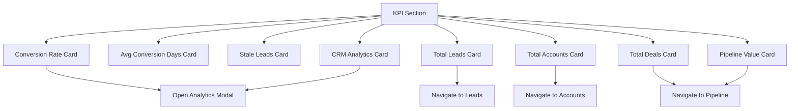
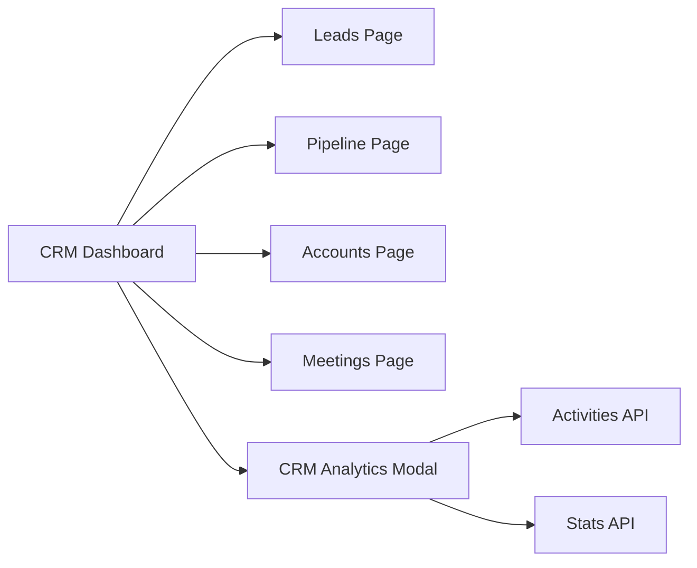
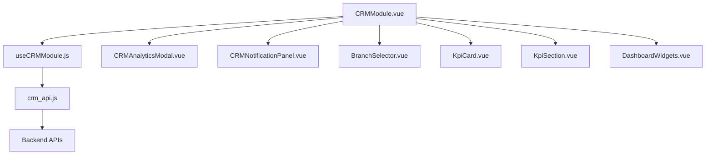

# CRM Overview & Dashboard

<cite>
**Referenced Files in This Document**
- [CRMModule.vue](file://src/views/Modules/crm/CRMModule.vue)
- [DashboardHome.vue](file://src/views/DashboardHome.vue)
- [BranchSelector.vue](file://src/components/BranchSelector.vue)
- [KpiCard.vue](file://src/components/ui/KpiCard.vue)
- [KpiSection.vue](file://src/components/ui/KpiSection.vue)
- [DashboardWidgets.vue](file://src/components/ui/DashboardWidgets.vue)
- [CRMModule.js](file://src/views/Modules/crm/composables/CRMModule.js)
- [crm_api.js](file://src/services/crm_api.js)
- [CRMAnalyticsModal.vue](file://src/views/Modules/crm/components/CRMAnalyticsModal.vue)
- [CRMNotificationPanel.vue](file://src/views/Modules/crm/components/CRMNotificationPanel.vue)
- [dashboard.js](file://src/stores/dashboard.js)
</cite>

## Table of Contents
1. [Introduction](#introduction)
2. [Project Structure](#project-structure)
3. [Core Components](#core-components)
4. [Architecture Overview](#architecture-overview)
5. [Detailed Component Analysis](#detailed-component-analysis)
6. [Dependency Analysis](#dependency-analysis)
7. [Performance Considerations](#performance-considerations)
8. [Troubleshooting Guide](#troubleshooting-guide)
9. [Conclusion](#conclusion)

## Introduction
This document explains the CRM module overview and dashboard, focusing on:
- The main CRM entry point and navigation structure
- Key performance indicators (KPIs): conversion rates, lead counts, account metrics, pipeline values
- Branch selector for multi-tenant filtering
- User context display and notification system integration
- Dashboard layout with KPI cards and quick action shortcuts
- How the dashboard aggregates data from CRM entities and relates to other CRM sub-modules

## Project Structure
The CRM feature is centered around a dedicated module view that renders the CRM dashboard, KPI cards, navigation shortcuts, and analytics modal. Supporting components provide reusable UI elements like KPI cards, sections, widgets, and branch selection. Data fetching and business logic are encapsulated in a composable and service layer.

**Diagram sources**
- [CRMModule.vue:1-411](file://src/views/Modules/crm/CRMModule.vue#L1-L411)
- [CRMModule.js:1-800](file://src/views/Modules/crm/composables/CRMModule.js#L1-L800)
- [crm_api.js:1-800](file://src/services/crm_api.js#L1-L800)
- [CRMAnalyticsModal.vue:1-200](file://src/views/Modules/crm/components/CRMAnalyticsModal.vue#L1-L200)
- [CRMNotificationPanel.vue:1-200](file://src/views/Modules/crm/components/CRMNotificationPanel.vue#L1-L200)
- [BranchSelector.vue:1-103](file://src/components/BranchSelector.vue#L1-L103)
- [KpiCard.vue:1-130](file://src/components/ui/KpiCard.vue#L1-L130)
- [KpiSection.vue:1-69](file://src/components/ui/KpiSection.vue#L1-L69)
- [DashboardWidgets.vue:1-71](file://src/components/ui/DashboardWidgets.vue#L1-L71)

**Section sources**
- [CRMModule.vue:1-411](file://src/views/Modules/crm/CRMModule.vue#L1-L411)
- [CRMModule.js:1-800](file://src/views/Modules/crm/composables/CRMModule.js#L1-L800)
- [crm_api.js:1-800](file://src/services/crm_api.js#L1-L800)

## Core Components
- CRMModule.vue: Main CRM dashboard view with header, branch selector, user context, KPI cards, navigation shortcuts, quick actions, and analytics modal.
- useCRMModule (CRMModule.js): Centralized state and logic for CRM data (leads, accounts, deals), stats, pipeline stages, branch filtering, and event handling.
- crm_api.js: Service layer for all CRM endpoints (leads, accounts, deals, activities, notifications, stats).
- CRMAnalyticsModal.vue: Detailed analytics dashboard with tabs for conversion, pipeline, and more.
- CRMNotificationPanel.vue: In-app notification panel with unread count, filters, and actions.
- BranchSelector.vue: Multi-tenant branch filter component used across views.
- KpiCard.vue and KpiSection.vue: Reusable KPI card and section components used by dashboards.
- DashboardWidgets.vue: Configurable widget grid for dashboard extensions.

**Section sources**
- [CRMModule.vue:1-411](file://src/views/Modules/crm/CRMModule.vue#L1-L411)
- [CRMModule.js:1-800](file://src/views/Modules/crm/composables/CRMModule.js#L1-L800)
- [crm_api.js:1-800](file://src/services/crm_api.js#L1-L800)
- [CRMAnalyticsModal.vue:1-200](file://src/views/Modules/crm/components/CRMAnalyticsModal.vue#L1-L200)
- [CRMNotificationPanel.vue:1-200](file://src/views/Modules/crm/components/CRMNotificationPanel.vue#L1-L200)
- [BranchSelector.vue:1-103](file://src/components/BranchSelector.vue#L1-L103)
- [KpiCard.vue:1-130](file://src/components/ui/KpiCard.vue#L1-L130)
- [KpiSection.vue:1-69](file://src/components/ui/KpiSection.vue#L1-L69)
- [DashboardWidgets.vue:1-71](file://src/components/ui/DashboardWidgets.vue#L1-L71)

## Architecture Overview
The CRM dashboard follows a layered architecture:
- Presentation Layer: Vue components render the CRM dashboard, KPI cards, navigation, and modals.
- Business Logic Layer: useCRMModule composable manages state, computes KPIs, handles branch changes, and orchestrates API calls.
- Service Layer: crm_api.js provides typed functions to fetch leads, accounts, deals, activities, notifications, and stats.
- External Integrations: Notifications via notification endpoints; analytics via stats and team performance endpoints.

**Diagram sources**
- [CRMModule.vue:319-392](file://src/views/Modules/crm/CRMModule.vue#L319-L392)
- [CRMModule.js:82-102](file://src/views/Modules/crm/composables/CRMModule.js#L82-L102)
- [crm_api.js:748-760](file://src/services/crm_api.js#L748-L760)
- [crm_api.js:481-486](file://src/services/crm_api.js#L481-L486)

## Detailed Component Analysis

### CRM Module Entry Point and Navigation
- Header displays breadcrumb “Sales // CRM” and title “CRM System”.
- Branch selector allows filtering by branch or all branches; changing branch triggers data refresh and events.
- User context shows current user email badge.
- Navigation shortcuts: Leads, Events Pipeline, Accounts, Calendar & Activities.
- Quick Action Shortcuts: Add Lead, Open Events Pipeline, Create Account, CRM Analytics, Schedule Meeting.

**Diagram sources**
- [CRMModule.vue:6-45](file://src/views/Modules/crm/CRMModule.vue#L6-L45)
- [CRMModule.vue:173-292](file://src/views/Modules/crm/CRMModule.vue#L173-L292)

**Section sources**
- [CRMModule.vue:6-45](file://src/views/Modules/crm/CRMModule.vue#L6-L45)
- [CRMModule.vue:173-292](file://src/views/Modules/crm/CRMModule.vue#L173-L292)

### KPIs Display: Conversion Rates, Lead Counts, Account Metrics, Pipeline Values
- Row 0 KPIs: Conversion Rate (%), Average Conversion Days, Stale Leads Count, CRM Analytics access.
- Row 1 KPIs: Total Leads, Total Accounts, Total Deals (with open deals count), Pipeline Value (formatted currency).
- Clicking KPI cards navigates to relevant sub-pages or opens analytics modal.
- Data sources:
  - Stats fetched via getStats with branch filter.
  - Aggregations computed in composable (leads, accounts, deals, pipeline value, conversion rate).
  - Activities loaded for analytics modal when opened.

**Diagram sources**
- [CRMModule.vue:50-170](file://src/views/Modules/crm/CRMModule.vue#L50-L170)
- [CRMModule.js:73-102](file://src/views/Modules/crm/composables/CRMModule.js#L73-L102)
- [crm_api.js:748-760](file://src/services/crm_api.js#L748-L760)

**Section sources**
- [CRMModule.vue:50-170](file://src/views/Modules/crm/CRMModule.vue#L50-L170)
- [CRMModule.js:73-102](file://src/views/Modules/crm/composables/CRMModule.js#L73-L102)
- [crm_api.js:748-760](file://src/services/crm_api.js#L748-L760)

### Branch Selector Functionality for Multi-Tenant Filtering
- BranchSelector.vue loads branches from localStorage or backend endpoint.
- Emits change events to update selected branch and trigger data refresh.
- CRMModule.vue integrates branch selection into header and uses it to filter stats and pipeline data.

**Diagram sources**
- [BranchSelector.vue:58-95](file://src/components/BranchSelector.vue#L58-L95)
- [CRMModule.vue:23-38](file://src/views/Modules/crm/CRMModule.vue#L23-L38)
- [CRMModule.js:46-67](file://src/views/Modules/crm/composables/CRMModule.js#L46-L67)
- [crm_api.js:748-760](file://src/services/crm_api.js#L748-L760)

**Section sources**
- [BranchSelector.vue:1-103](file://src/components/BranchSelector.vue#L1-L103)
- [CRMModule.vue:23-38](file://src/views/Modules/crm/CRMModule.vue#L23-L38)
- [CRMModule.js:46-67](file://src/views/Modules/crm/composables/CRMModule.js#L46-L67)

### User Context Display
- Header displays current user email badge using getUserEmail from decodeJWT.
- Activity tracking is initialized with userId and tenantId for audit purposes.

**Section sources**
- [CRMModule.vue:21-43](file://src/views/Modules/crm/CRMModule.vue#L21-L43)
- [CRMModule.vue:347-351](file://src/views/Modules/crm/CRMModule.vue#L347-L351)

### Notification System Integration
- CRMNotificationPanel.vue provides a bell icon with unread count badge.
- Panel supports tabs (all/unread), type filters, mark read, dismiss, clear all, and auto-refresh.
- Integrated into CRMModule header to show notifications per tenant.

**Diagram sources**
- [CRMNotificationPanel.vue:1-200](file://src/views/Modules/crm/components/CRMNotificationPanel.vue#L1-L200)
- [crm_api.js:228-274](file://src/services/crm_api.js#L228-L274)

**Section sources**
- [CRMNotificationPanel.vue:1-200](file://src/views/Modules/crm/components/CRMNotificationPanel.vue#L1-L200)
- [crm_api.js:228-274](file://src/services/crm_api.js#L228-L274)

### Dashboard Layout with KPI Cards and Analytics Access
- KPI cards are displayed in two rows:
  - Row 0: Conversion Rate, Avg Conversion Days, Stale Leads, CRM Analytics.
  - Row 1: Total Leads, Total Accounts, Total Deals, Pipeline Value.
- Each card is clickable to navigate to related pages or open analytics modal.
- KpiCard.vue supports formatting, trends, actions, and navigation.
- KpiSection.vue wraps KPIs with toggle controls.

**Diagram sources**
- [CRMModule.vue:50-170](file://src/views/Modules/crm/CRMModule.vue#L50-L170)
- [KpiCard.vue:1-130](file://src/components/ui/KpiCard.vue#L1-L130)
- [KpiSection.vue:1-69](file://src/components/ui/KpiSection.vue#L1-L69)

**Section sources**
- [CRMModule.vue:50-170](file://src/views/Modules/crm/CRMModule.vue#L50-L170)
- [KpiCard.vue:1-130](file://src/components/ui/KpiCard.vue#L1-L130)
- [KpiSection.vue:1-69](file://src/components/ui/KpiSection.vue#L1-L69)

### Data Aggregation Examples and Quick Actions
- Aggregation examples:
  - Conversion rate derived from stats and pipeline data.
  - Lead counts aggregated from filtered leads for KPI.
  - Account metrics from filtered accounts for KPI.
  - Pipeline value computed from deals and weighted values.
- Quick actions:
  - Add Lead: navigates to leads page.
  - Open Events Pipeline: navigates to pipeline page.
  - Create Account: navigates to accounts page.
  - CRM Analytics: opens analytics modal.
  - Schedule Meeting: navigates to meetings page.

**Section sources**
- [CRMModule.vue:173-292](file://src/views/Modules/crm/CRMModule.vue#L173-L292)
- [CRMModule.js:270-309](file://src/views/Modules/crm/composables/CRMModule.js#L270-L309)

### Relationship Between Dashboard and Other CRM Sub-Modules
- Navigation links connect dashboard to Leads, Pipeline, Accounts, Meetings.
- useCRMModule coordinates loading data for each sub-module when navigating.
- Analytics modal pulls activities and pipeline data to provide cross-entity insights.

**Diagram sources**
- [CRMModule.vue:173-292](file://src/views/Modules/crm/CRMModule.vue#L173-L292)
- [CRMModule.js:270-309](file://src/views/Modules/crm/composables/CRMModule.js#L270-L309)
- [crm_api.js:481-486](file://src/services/crm_api.js#L481-L486)
- [crm_api.js:748-760](file://src/services/crm_api.js#L748-L760)

**Section sources**
- [CRMModule.vue:173-292](file://src/views/Modules/crm/CRMModule.vue#L173-L292)
- [CRMModule.js:270-309](file://src/views/Modules/crm/composables/CRMModule.js#L270-L309)

## Dependency Analysis
- CRMModule.vue depends on:
  - useCRMModule composable for state and logic
  - crm_api.js for data fetching
  - CRMAnalyticsModal.vue for detailed analytics
  - CRMNotificationPanel.vue for notifications
  - BranchSelector.vue for branch filtering
  - KpiCard.vue and KpiSection.vue for KPI presentation
  - DashboardWidgets.vue for configurable widgets
- useCRMModule depends on:
  - crm_api.js for all CRM endpoints
  - decodeJWT for tenant and user info
  - useRBAC for permissions
  - useAudit for activity logging
- crm_api.js depends on:
  - API_BASE_URL for backend endpoints
  - Authorization headers from local storage

**Diagram sources**
- [CRMModule.vue:1-411](file://src/views/Modules/crm/CRMModule.vue#L1-L411)
- [CRMModule.js:1-800](file://src/views/Modules/crm/composables/CRMModule.js#L1-L800)
- [crm_api.js:1-800](file://src/services/crm_api.js#L1-L800)

**Section sources**
- [CRMModule.vue:1-411](file://src/views/Modules/crm/CRMModule.vue#L1-L411)
- [CRMModule.js:1-800](file://src/views/Modules/crm/composables/CRMModule.js#L1-L800)
- [crm_api.js:1-800](file://src/services/crm_api.js#L1-L800)

## Performance Considerations
- Batch fetching: Analytics modal fetches activities for leads and accounts concurrently to reduce latency.
- Debounced searches: Participant search uses debounce to avoid excessive API calls.
- Local caching: BranchSelector caches branches in localStorage before fetching fresh data.
- Error handling: crm_api.js centralizes error handling with structured messages and status codes.
- Loading states: KPI cards and sections support loading skeletons to improve perceived performance.

[No sources needed since this section provides general guidance]

## Troubleshooting Guide
- If KPIs do not update after branch change:
  - Ensure onBranchChange triggers fetchStats and fetchPipelineData.
  - Verify safeBranchId computation and tenant ID presence.
- If notifications are not showing:
  - Check tenantId prop passed to CRMNotificationPanel.
  - Confirm getNotifications endpoint returns data and authorization header is set.
- If analytics modal activities are missing:
  - Verify getActivities calls include correct tenantId and related_type filters.
  - Check error handling in watch(showAnalyticsModal) to ensure fallback behavior.

**Section sources**
- [CRMModule.js:46-67](file://src/views/Modules/crm/composables/CRMModule.js#L46-L67)
- [CRMNotificationPanel.vue:197-200](file://src/views/Modules/crm/components/CRMNotificationPanel.vue#L197-L200)
- [CRMModule.vue:356-392](file://src/views/Modules/crm/CRMModule.vue#L356-L392)

## Conclusion
The CRM dashboard provides a comprehensive overview of key metrics, navigation shortcuts, and analytics capabilities. It integrates branch filtering, user context, and notifications to deliver a cohesive multi-tenant experience. The modular architecture ensures scalability and maintainability, while performance optimizations enhance responsiveness. The dashboard serves as a central hub connecting to CRM sub-modules and enabling efficient workflows through quick actions and detailed analytics.

[No sources needed since this section summarizes without analyzing specific files]