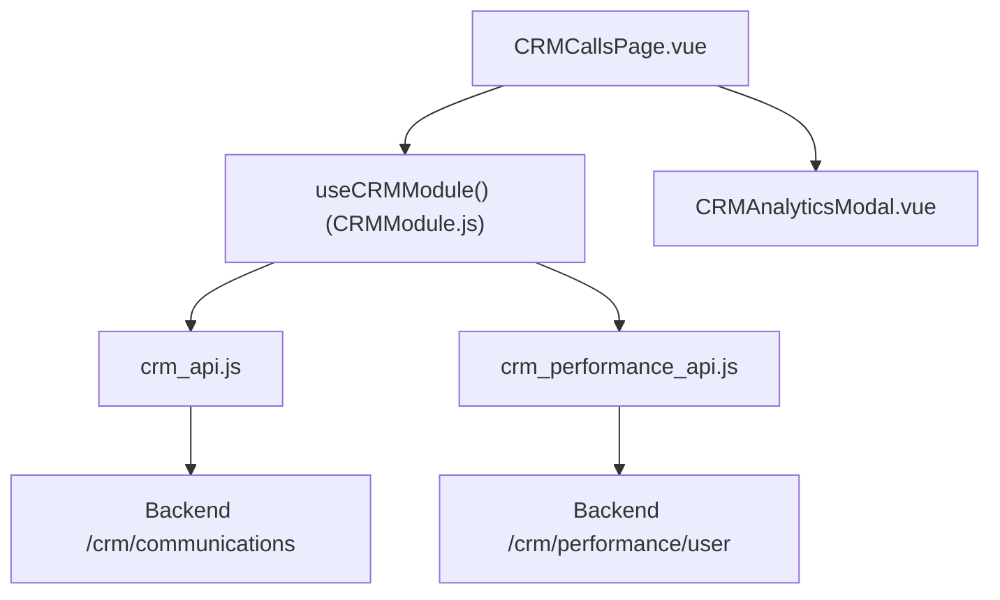
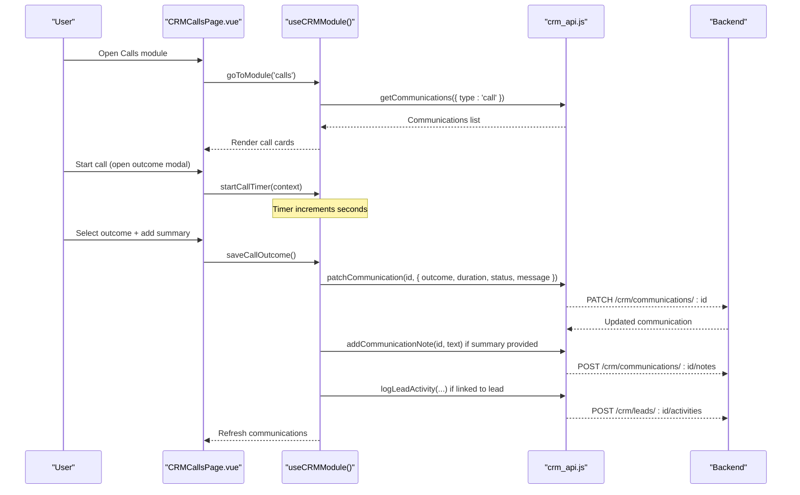
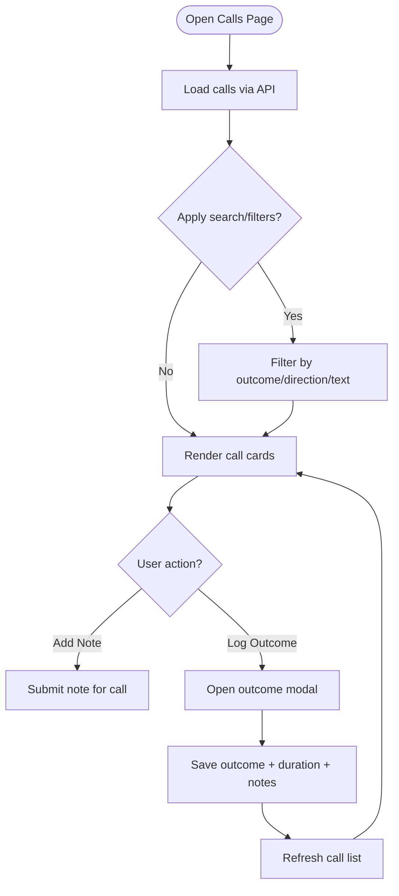
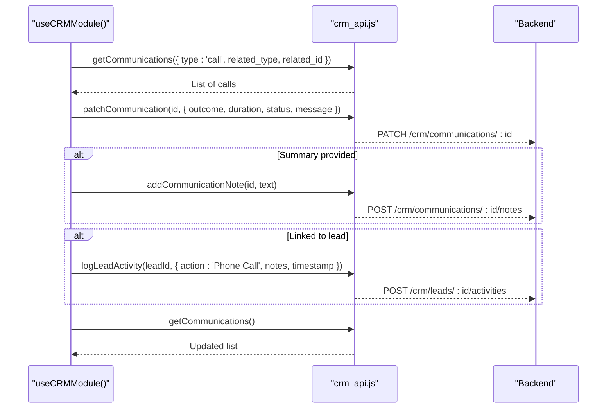
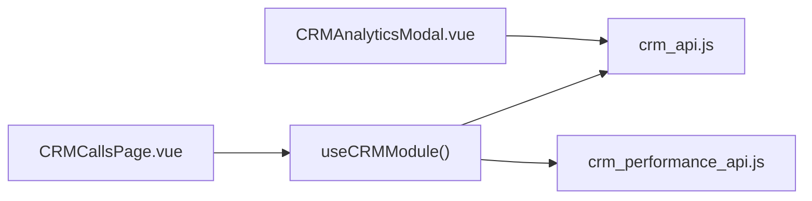

# Call Logging

<cite>
**Referenced Files in This Document**
- [CRMCallsPage.vue](file://src/views/Modules/crm/CRMCallsPage.vue)
- [CRMModule.js](file://src/views/Modules/crm/composables/CRMModule.js)
- [crm_api.js](file://src/services/crm_api.js)
- [CRMAnalyticsModal.vue](file://src/views/Modules/crm/components/CRMAnalyticsModal.vue)
- [crm_performance_api.js](file://src/services/crm_performance_api.js)
</cite>

## Table of Contents
1. Introduction
2. Project Structure
3. Core Components
4. Architecture Overview
5. Detailed Component Analysis
6. Dependency Analysis
7. Performance Considerations
8. Troubleshooting Guide
9. Conclusion
10. Appendices

## Introduction
This document explains the call logging system within the CRM, focusing on how calls are captured, tracked, and analyzed. It covers inbound/outbound call tracking, duration monitoring, outcome/disposition capture, notes, and how to associate calls with contacts, accounts, or deals. It also outlines analytics available for call volume, average duration, and agent performance, along with guidance for integrating telephony systems, call forwarding, and voicemail handling.

## Project Structure
The call logging feature is implemented as a dedicated CRM module page that lists call records, allows filtering/searching, and provides an outcome modal to finalize call details. The core logic resides in a shared composable that manages state, timers, and API interactions. API services encapsulate HTTP calls to backend endpoints for communications, notes, activities, and analytics.

**Diagram sources**
- [CRMCallsPage.vue:291-347](file://src/views/Modules/crm/CRMCallsPage.vue#L291-L347)
- [CRMModule.js:283-309](file://src/views/Modules/crm/composables/CRMModule.js#L283-L309)
- [crm_api.js:146-215](file://src/services/crm_api.js#L146-L215)
- [crm_performance_api.js:8-18](file://src/services/crm_performance_api.js#L8-L18)
- [CRMAnalyticsModal.vue:622-692](file://src/views/Modules/crm/components/CRMAnalyticsModal.vue#L622-L692)

**Section sources**
- [CRMCallsPage.vue:1-370](file://src/views/Modules/crm/CRMCallsPage.vue#L1-L370)
- [CRMModule.js:283-309](file://src/views/Modules/crm/composables/CRMModule.js#L283-L309)
- [crm_api.js:146-215](file://src/services/crm_api.js#L146-L215)
- [CRMAnalyticsModal.vue:622-692](file://src/views/Modules/crm/components/CRMAnalyticsModal.vue#L622-L692)

## Core Components
- CRMCallsPage.vue: Displays call logs, search/filter by outcome/direction, pagination, inline notes, and opens the call outcome modal.
- useCRMModule(): Central state and workflow for calls, including timer, outcome submission, note management, and linking to lead activities.
- crm_api.js: HTTP client functions for communications, notes, activities, and analytics endpoints.
- CRMAnalyticsModal.vue: Analytics dashboard including activity timeline where call-related activities appear.
- crm_performance_api.js: Endpoint to fetch user performance metrics.

Key capabilities exposed:
- Inbound/outbound direction display and filtering
- Outcome/disposition selection (connected, no-answer, voicemail, busy, failed)
- Duration tracking via a live timer during call outcome entry
- Notes capture per call record
- Linking saved calls to lead/contact/account/deal activities

**Section sources**
- [CRMCallsPage.vue:32-69](file://src/views/Modules/crm/CRMCallsPage.vue#L32-L69)
- [CRMCallsPage.vue:84-189](file://src/views/Modules/crm/CRMCallsPage.vue#L84-L189)
- [CRMModule.js:321-383](file://src/views/Modules/crm/composables/CRMModule.js#L321-L383)
- [crm_api.js:146-215](file://src/services/crm_api.js#L146-L215)

## Architecture Overview
The call flow begins when a user initiates a call context from the CRM. A timer starts, and upon completion, the user selects an outcome and adds notes. The system updates the communication record and optionally logs an activity against the related entity.

**Diagram sources**
- [CRMModule.js:283-309](file://src/views/Modules/crm/composables/CRMModule.js#L283-L309)
- [CRMModule.js:321-383](file://src/views/Modules/crm/composables/CRMModule.js#L321-L383)
- [crm_api.js:146-215](file://src/services/crm_api.js#L146-L215)

## Detailed Component Analysis

### CRMCallsPage.vue
- Lists all call records filtered by type=call, supports search across contact name, phone, outcome, direction, and message.
- Provides quick filters for outcomes: connected, no-answer, voicemail, busy, failed.
- Shows direction (inbound/outbound), duration in seconds, and timestamp.
- Allows adding inline notes per call and deleting records.
- Opens a modal to finalize call outcome, capture duration, and summary.

**Diagram sources**
- [CRMCallsPage.vue:32-69](file://src/views/Modules/crm/CRMCallsPage.vue#L32-L69)
- [CRMCallsPage.vue:84-189](file://src/views/Modules/crm/CRMCallsPage.vue#L84-L189)
- [CRMCallsPage.vue:223-287](file://src/views/Modules/crm/CRMCallsPage.vue#L223-L287)

**Section sources**
- [CRMCallsPage.vue:32-69](file://src/views/Modules/crm/CRMCallsPage.vue#L32-L69)
- [CRMCallsPage.vue:84-189](file://src/views/Modules/crm/CRMCallsPage.vue#L84-L189)
- [CRMCallsPage.vue:223-287](file://src/views/Modules/crm/CRMCallsPage.vue#L223-L287)
- [CRMCallsPage.vue:291-347](file://src/views/Modules/crm/CRMCallsPage.vue#L291-L347)

### useCRMModule() — Call Workflow
- Manages call outcome modal state, timer, and context (related_type, related_id).
- On save:
  - Finds latest call for the context and patches it with outcome, duration, status, and optional message.
  - If a summary was provided, appends a note to the communication.
  - If linked to a lead, logs an activity so the call appears in the Activity tab.
- Provides helpers to ensure call notes are loaded and submitted.

**Diagram sources**
- [CRMModule.js:321-383](file://src/views/Modules/crm/composables/CRMModule.js#L321-L383)
- [crm_api.js:146-215](file://src/services/crm_api.js#L146-L215)

**Section sources**
- [CRMModule.js:321-383](file://src/views/Modules/crm/composables/CRMModule.js#L321-L383)
- [CRMModule.js:745-762](file://src/views/Modules/crm/composables/CRMModule.js#L745-L762)

### crm_api.js — Communications and Notes
- Endpoints used:
  - GET /crm/communications with filters (type, related_type, related_id)
  - PATCH /crm/communications/:id to update outcome/duration/status/message
  - GET /crm/communications/:id/notes to retrieve notes
  - POST /crm/communications/:id/notes to add notes
  - POST /crm/leads/:id/activities to log call activity

**Section sources**
- [crm_api.js:146-215](file://src/services/crm_api.js#L146-L215)

### CRMAnalyticsModal.vue — Call Analytics
- Includes an Activities tab that shows a timeline of actions, including calls, with fields like duration and outcome visible in activity entries.
- Supports filtering by activity type (including calls) and by user/source.

**Section sources**
- [CRMAnalyticsModal.vue:622-692](file://src/views/Modules/crm/components/CRMAnalyticsModal.vue#L622-L692)

## Dependency Analysis
- CRMCallsPage.vue depends on useCRMModule() for state and actions.
- useCRMModule() depends on crm_api.js for data operations and on crm_performance_api.js for performance metrics.
- crm_api.js centralizes all HTTP requests to backend endpoints for communications, notes, and activities.
- CRMAnalyticsModal.vue consumes activity data to visualize call-related events.

**Diagram sources**
- [CRMCallsPage.vue:291-347](file://src/views/Modules/crm/CRMCallsPage.vue#L291-L347)
- [CRMModule.js:283-309](file://src/views/Modules/crm/composables/CRMModule.js#L283-L309)
- [crm_api.js:146-215](file://src/services/crm_api.js#L146-L215)
- [crm_performance_api.js:8-18](file://src/services/crm_performance_api.js#L8-L18)
- [CRMAnalyticsModal.vue:622-692](file://src/views/Modules/crm/components/CRMAnalyticsModal.vue#L622-L692)

**Section sources**
- [CRMModule.js:283-309](file://src/views/Modules/crm/composables/CRMModule.js#L283-L309)
- [crm_api.js:146-215](file://src/services/crm_api.js#L146-L215)
- [crm_performance_api.js:8-18](file://src/services/crm_performance_api.js#L8-L18)

## Performance Considerations
- Use pagination and filtering to reduce payload sizes when listing calls.
- Debounce search inputs to avoid excessive network calls.
- Batch or cache frequently accessed metadata (e.g., tenant users) to minimize repeated requests.
- Ensure efficient queries on the backend for communications and activities to support real-time dashboards.

[No sources needed since this section provides general guidance]

## Troubleshooting Guide
Common issues and resolutions:
- No calls displayed:
  - Verify the module loads calls with type='call'.
  - Check filters and search terms; reset to default view.
- Cannot save call outcome:
  - Ensure a valid communication record exists for the context; otherwise, the system will warn that the call log was not found.
  - Confirm tenant ID availability; missing tenant context prevents saving.
- Notes not appearing:
  - Ensure notes are fetched when opening the notes panel; re-fetch on open to avoid stale data.
- Activity not updated:
  - When linked to a lead, confirm that the activity endpoint is called and the activity list refreshes afterward.

**Section sources**
- [CRMModule.js:321-383](file://src/views/Modules/crm/composables/CRMModule.js#L321-L383)
- [CRMModule.js:745-762](file://src/views/Modules/crm/composables/CRMModule.js#L745-L762)

## Conclusion
The CRM’s call logging system provides a streamlined interface to track inbound/outbound calls, capture outcomes and durations, and attach notes. Calls can be associated with leads/contacts/accounts/deals through activity logging, enabling comprehensive visibility in the analytics dashboard. While telephony integration is not implemented in the frontend code examined, the architecture supports future integrations by leveraging the existing communications and activities APIs.

[No sources needed since this section summarizes without analyzing specific files]

## Appendices

### How to Log Calls Against Specific Entities
- From any CRM entity detail (contact, account, deal), initiate a call context so the system associates the call with that entity.
- After completing the call, select the outcome and add notes; the system will update the communication record and, if applicable, log an activity tied to the entity.

**Section sources**
- [CRMModule.js:321-383](file://src/views/Modules/crm/composables/CRMModule.js#L321-L383)

### Call Categorization, Priority, and Outcome Tracking
- Outcomes supported: connected, no-answer, voicemail, busy, failed.
- Direction indicators: inbound/outbound.
- Duration is tracked via a timer during outcome entry.
- Notes provide additional categorization and context.

**Section sources**
- [CRMCallsPage.vue:223-287](file://src/views/Modules/crm/CRMCallsPage.vue#L223-L287)
- [CRMModule.js:321-383](file://src/views/Modules/crm/composables/CRMModule.js#L321-L383)

### Integration with Telephony Systems, Call Forwarding, and Voicemail Handling
- The current frontend does not include direct telephony SDKs or webRTC signaling.
- To integrate:
  - Implement a telephony provider (e.g., SIP/WebRTC) that emits events for call start/end, direction, and duration.
  - Map provider events to create/update communications via crm_api.js endpoints.
  - For voicemail detection, rely on provider callbacks or post-call analysis to set outcome to voicemail.
  - For call forwarding, configure provider-level rules and ensure outcomes reflect forwarded vs. direct calls.

[No sources needed since this section provides general guidance]

### Call Analytics Examples
- View call-related activities in the CRM Analytics modal under the Activities tab, filtering by type=call.
- Use team performance endpoints to correlate call volumes with staff performance metrics.

**Section sources**
- [CRMAnalyticsModal.vue:622-692](file://src/views/Modules/crm/components/CRMAnalyticsModal.vue#L622-L692)
- [crm_performance_api.js:8-18](file://src/services/crm_performance_api.js#L8-L18)