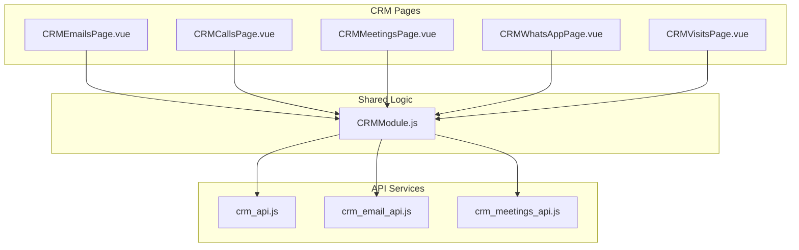
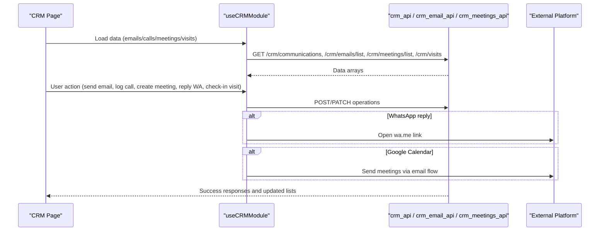
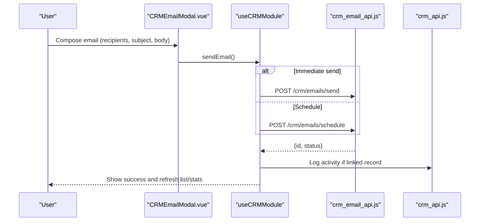
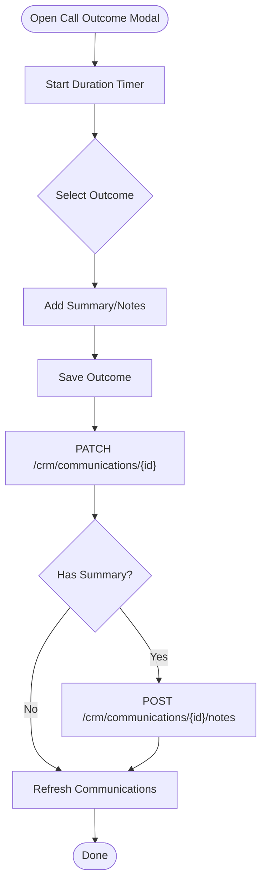
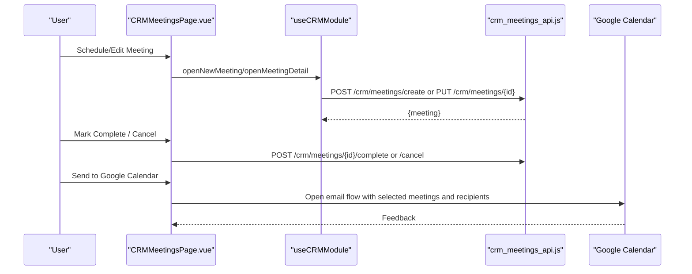
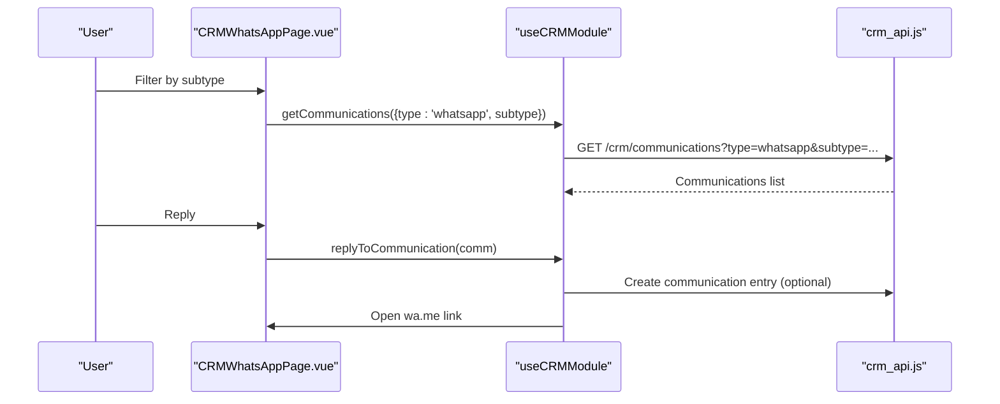
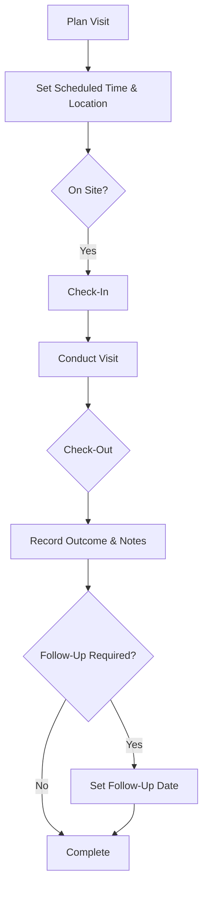
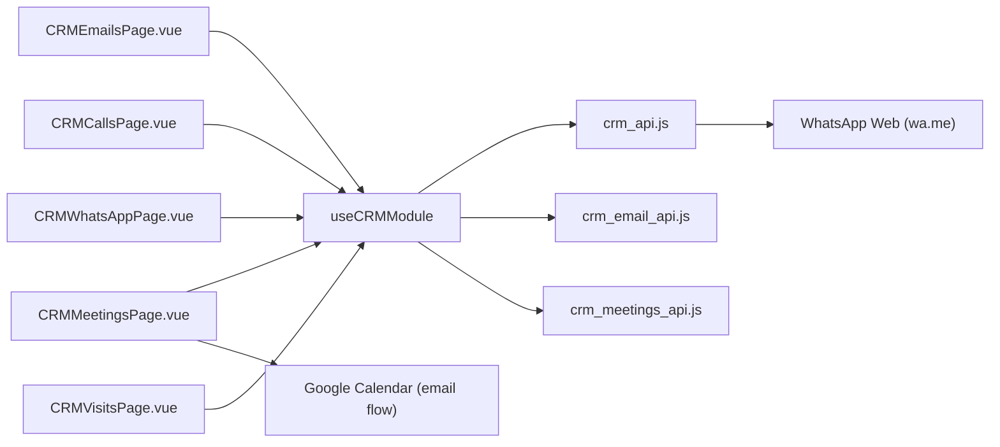

# Communication Tools

<cite>
**Referenced Files in This Document**
- [CRMEmailsPage.vue](file://src/views/Modules/crm/CRMEmailsPage.vue)
- [CRMCallsPage.vue](file://src/views/Modules/crm/CRMCallsPage.vue)
- [CRMMeetingsPage.vue](file://src/views/Modules/crm/CRMMeetingsPage.vue)
- [CRMWhatsAppPage.vue](file://src/views/Modules/crm/CRMWhatsAppPage.vue)
- [CRMVisitsPage.vue](file://src/views/Modules/crm/CRMVisitsPage.vue)
- [CRMModule.js](file://src/views/Modules/crm/composables/CRMModule.js)
- [crm_api.js](file://src/services/crm_api.js)
- [crm_email_api.js](file://src/services/crm_email_api.js)
- [crm_meetings_api.js](file://src/services/crm_meetings_api.js)
- [CRMEmailModal.vue](file://src/views/Modules/crm/components/CRMEmailModal.vue)
</cite>

## Table of Contents
1. Introduction
2. Project Structure
3. Core Components
4. Architecture Overview
5. Detailed Component Analysis
6. Dependency Analysis
7. Performance Considerations
8. Troubleshooting Guide
9. Conclusion

## Introduction
This document explains the CRM communication tools implemented in the frontend: email integration, call logging with outcomes and notes, meeting scheduling with calendar sync, WhatsApp messaging, and visit planning with check-in/out and outcome tracking. It also covers template management for emails, automated follow-up scheduling via meetings, and guidance for customizing templates and integrating external platforms.

## Project Structure
The CRM communication features are organized as Vue pages under src/views/Modules/crm, each delegating shared state and business logic to a composable (useCRMModule). API calls are centralized in services under src/services.

**Diagram sources**
- [CRMEmailsPage.vue:1-186](file://src/views/Modules/crm/CRMEmailsPage.vue#L1-L186)
- [CRMCallsPage.vue:1-370](file://src/views/Modules/crm/CRMCallsPage.vue#L1-L370)
- [CRMMeetingsPage.vue:1-800](file://src/views/Modules/crm/CRMMeetingsPage.vue#L1-L800)
- [CRMWhatsAppPage.vue:1-285](file://src/views/Modules/crm/CRMWhatsAppPage.vue#L1-L285)
- [CRMVisitsPage.vue:1-372](file://src/views/Modules/crm/CRMVisitsPage.vue#L1-L372)
- [CRMModule.js:1-800](file://src/views/Modules/crm/composables/CRMModule.js#L1-L800)
- [crm_api.js:145-226](file://src/services/crm_api.js#L145-L226)
- [crm_email_api.js:1-313](file://src/services/crm_email_api.js#L1-L313)
- [crm_meetings_api.js:1-322](file://src/services/crm_meetings_api.js#L1-L322)

**Section sources**
- [CRMEmailsPage.vue:1-186](file://src/views/Modules/crm/CRMEmailsPage.vue#L1-L186)
- [CRMCallsPage.vue:1-370](file://src/views/Modules/crm/CRMCallsPage.vue#L1-L370)
- [CRMMeetingsPage.vue:1-800](file://src/views/Modules/crm/CRMMeetingsPage.vue#L1-L800)
- [CRMWhatsAppPage.vue:1-285](file://src/views/Modules/crm/CRMWhatsAppPage.vue#L1-L285)
- [CRMVisitsPage.vue:1-372](file://src/views/Modules/crm/CRMVisitsPage.vue#L1-L372)
- [CRMModule.js:1-800](file://src/views/Modules/crm/composables/CRMModule.js#L1-L800)

## Core Components
- Email Center: List, compose, send, schedule, and view stats; supports CC/BCC and personal routing toggle.
- Call Logs: Filter/search by outcome/direction, log outcomes with duration and summary, add per-call notes.
- Meetings: Create/edit/list/calendar views, mark complete or cancel, add notes, sync/send to Google Calendar, Excel import/export.
- WhatsApp: Unified stream of communications with subtype filters, reply actions, and appended notes.
- Visits: Plan visits, geolocation/address, check-in/out, outcomes, follow-ups, and notes.

Key shared capabilities:
- Unified communication list and filtering across channels.
- Notes attached to communications and visits.
- Module navigation and loading states managed centrally.

**Section sources**
- [CRMEmailsPage.vue:1-186](file://src/views/Modules/crm/CRMEmailsPage.vue#L1-L186)
- [CRMCallsPage.vue:1-370](file://src/views/Modules/crm/CRMCallsPage.vue#L1-L370)
- [CRMMeetingsPage.vue:1-800](file://src/views/Modules/crm/CRMMeetingsPage.vue#L1-L800)
- [CRMWhatsAppPage.vue:1-285](file://src/views/Modules/crm/CRMWhatsAppPage.vue#L1-L285)
- [CRMVisitsPage.vue:1-372](file://src/views/Modules/crm/CRMVisitsPage.vue#L1-L372)
- [CRMModule.js:270-309](file://src/views/Modules/crm/composables/CRMModule.js#L270-L309)

## Architecture Overview
The UI pages consume useCRMModule for state and actions. The module orchestrates API calls to crm_api, crm_email_api, and crm_meetings_api. External integrations include WhatsApp web links and Google Calendar sending flows.

**Diagram sources**
- [CRMModule.js:270-309](file://src/views/Modules/crm/composables/CRMModule.js#L270-L309)
- [crm_api.js:145-226](file://src/services/crm_api.js#L145-L226)
- [crm_email_api.js:13-64](file://src/services/crm_email_api.js#L13-L64)
- [crm_meetings_api.js:13-74](file://src/services/crm_meetings_api.js#L13-L74)
- [CRMMeetingsPage.vue:683-800](file://src/views/Modules/crm/CRMMeetingsPage.vue#L683-L800)

## Detailed Component Analysis

### Email Integration
- Composition: Recipients (To/Cc/Bcc), subject, body, attachments placeholder, personal routing toggle.
- Threading: Emails are listed with folders (inbox/sent/scheduled/drafts) and preview content; detail opens a modal.
- Template Management: Default templates are provided in the module state for quick insertion.
- Scheduling: Dedicated endpoint for scheduling emails; stats reflect sent today, open rate, click rate, scheduled count.

**Diagram sources**
- [CRMEmailModal.vue:171-215](file://src/views/Modules/crm/components/CRMEmailModal.vue#L171-L215)
- [crm_email_api.js:13-64](file://src/services/crm_email_api.js#L13-L64)
- [CRMModule.js:618-636](file://src/views/Modules/crm/composables/CRMModule.js#L618-L636)

**Section sources**
- [CRMEmailsPage.vue:1-186](file://src/views/Modules/crm/CRMEmailsPage.vue#L1-L186)
- [CRMEmailModal.vue:1-242](file://src/views/Modules/crm/components/CRMEmailModal.vue#L1-L242)
- [CRMModule.js:618-636](file://src/views/Modules/crm/composables/CRMModule.js#L618-L636)
- [crm_email_api.js:13-64](file://src/services/crm_email_api.js#L13-L64)

### Call Logging
- Outcome tracking: Select outcome (connected/no-answer/voicemail/busy/failed), capture duration via timer, add summary.
- Notes: Per-call notes can be appended and reloaded on demand.
- Activity linkage: Saving a call outcome updates the communication record and logs an activity for the related lead/contact.

**Diagram sources**
- [CRMCallsPage.vue:223-307](file://src/views/Modules/crm/CRMCallsPage.vue#L223-L307)
- [CRMModule.js:321-383](file://src/views/Modules/crm/composables/CRMModule.js#L321-L383)
- [crm_api.js:196-215](file://src/services/crm_api.js#L196-L215)

**Section sources**
- [CRMCallsPage.vue:1-370](file://src/views/Modules/crm/CRMCallsPage.vue#L1-L370)
- [CRMModule.js:321-383](file://src/views/Modules/crm/composables/CRMModule.js#L321-L383)
- [crm_api.js:196-215](file://src/services/crm_api.js#L196-L215)

### Meeting Scheduling
- Creation and editing: Title, type, description, start/end times, location/virtual URL, participants, reminders.
- Views: List and calendar grid; upcoming meetings panel; KPIs for pipeline value, won revenue, CAC, maintenance.
- Actions: Complete, cancel (with reason), delete, add to Google Calendar, send meetings via email to recipients.
- Notes: Add notes per meeting.

**Diagram sources**
- [CRMMeetingsPage.vue:596-800](file://src/views/Modules/crm/CRMMeetingsPage.vue#L596-L800)
- [crm_meetings_api.js:13-74](file://src/services/crm_meetings_api.js#L13-L74)
- [crm_meetings_api.js:166-222](file://src/services/crm_meetings_api.js#L166-L222)

**Section sources**
- [CRMMeetingsPage.vue:1-800](file://src/views/Modules/crm/CRMMeetingsPage.vue#L1-L800)
- [crm_meetings_api.js:13-74](file://src/services/crm_meetings_api.js#L13-L74)
- [crm_meetings_api.js:166-222](file://src/services/crm_meetings_api.js#L166-L222)

### WhatsApp Messaging
- Stream view: Chronological list of communications filtered by type and subtype (text/audio_call/video_call).
- Actions: Reply to a message (opens WhatsApp web), delete record, append notes.
- Integration: Uses wa.me links to initiate chats or calls; records a communication entry for traceability.

**Diagram sources**
- [CRMWhatsAppPage.vue:199-237](file://src/views/Modules/crm/CRMWhatsAppPage.vue#L199-L237)
- [CRMModule.js:288-295](file://src/views/Modules/crm/composables/CRMModule.js#L288-L295)
- [crm_api.js:167-190](file://src/services/crm_api.js#L167-L190)

**Section sources**
- [CRMWhatsAppPage.vue:1-285](file://src/views/Modules/crm/CRMWhatsAppPage.vue#L1-L285)
- [CRMModule.js:288-295](file://src/views/Modules/crm/composables/CRMModule.js#L288-L295)
- [crm_api.js:167-190](file://src/services/crm_api.js#L167-L190)

### Visit Planning and Field Service Coordination
- Planning: Select target lead, set title, address/location, scheduled time, description.
- Execution: Check-in/check-out with timestamps, compute actual duration, mark completed.
- Outcomes: Successful, no-show, rescheduled, other; optional follow-up date and notes.
- Navigation: Directions link using coordinates; distance and estimated duration shown.

**Diagram sources**
- [CRMVisitsPage.vue:156-291](file://src/views/Modules/crm/CRMVisitsPage.vue#L156-L291)
- [CRMVisitsPage.vue:297-338](file://src/views/Modules/crm/CRMVisitsPage.vue#L297-L338)
- [CRMModule.js:764-800](file://src/views/Modules/crm/composables/CRMModule.js#L764-L800)
- [crm_api.js:492-529](file://src/services/crm_api.js#L492-L529)

**Section sources**
- [CRMVisitsPage.vue:1-372](file://src/views/Modules/crm/CRMVisitsPage.vue#L1-L372)
- [CRMModule.js:764-800](file://src/views/Modules/crm/composables/CRMModule.js#L764-L800)
- [crm_api.js:492-529](file://src/services/crm_api.js#L492-L529)

## Dependency Analysis
- Pages depend on useCRMModule for shared state and actions (navigation, loading, data fetching, and cross-module utilities).
- useCRMModule depends on:
  - crm_api for communications, activities, visits, and generic module records.
  - crm_email_api for email send/schedule/list/stats/configurations.
  - crm_meetings_api for meeting CRUD, completion, cancellation, notes, and stats.
- External integrations:
  - WhatsApp: wa.me links opened from crm_api helpers.
  - Google Calendar: Email-based send flow initiated from CRMMeetingsPage.

**Diagram sources**
- [CRMEmailsPage.vue:1-186](file://src/views/Modules/crm/CRMEmailsPage.vue#L1-L186)
- [CRMCallsPage.vue:1-370](file://src/views/Modules/crm/CRMCallsPage.vue#L1-L370)
- [CRMMeetingsPage.vue:1-800](file://src/views/Modules/crm/CRMMeetingsPage.vue#L1-L800)
- [CRMWhatsAppPage.vue:1-285](file://src/views/Modules/crm/CRMWhatsAppPage.vue#L1-L285)
- [CRMVisitsPage.vue:1-372](file://src/views/Modules/crm/CRMVisitsPage.vue#L1-L372)
- [CRMModule.js:1-800](file://src/views/Modules/crm/composables/CRMModule.js#L1-L800)
- [crm_api.js:145-226](file://src/services/crm_api.js#L145-L226)
- [crm_email_api.js:1-313](file://src/services/crm_email_api.js#L1-L313)
- [crm_meetings_api.js:1-322](file://src/services/crm_meetings_api.js#L1-L322)

**Section sources**
- [CRMModule.js:1-800](file://src/views/Modules/crm/composables/CRMModule.js#L1-L800)
- [crm_api.js:145-226](file://src/services/crm_api.js#L145-L226)
- [crm_email_api.js:1-313](file://src/services/crm_email_api.js#L1-L313)
- [crm_meetings_api.js:1-322](file://src/services/crm_meetings_api.js#L1-L322)

## Performance Considerations
- Debounced searches and filters reduce unnecessary network calls (e.g., participant search).
- Pagination and “show all” toggles control rendering load for large datasets.
- Local caching for location search results improves responsiveness.
- Lazy loading of notes and details minimizes initial payload size.

[No sources needed since this section provides general guidance]

## Troubleshooting Guide
- Authentication errors: Ensure token is present; API layer attaches Authorization header automatically.
- Network failures: API wrappers throw structured errors with status and data; UI surfaces toast messages or alerts.
- Missing tenant context: Some endpoints require tenant_id; ensure it is available before calling.
- WhatsApp links not opening: Verify phone number formatting and browser permissions for popups.
- Google Calendar send disabled: Confirm recipients and selected meetings are provided before sending.

**Section sources**
- [crm_api.js:11-32](file://src/services/crm_api.js#L11-L32)
- [crm_email_api.js:13-64](file://src/services/crm_email_api.js#L13-L64)
- [CRMModule.js:321-383](file://src/views/Modules/crm/composables/CRMModule.js#L321-L383)
- [CRMMeetingsPage.vue:683-800](file://src/views/Modules/crm/CRMMeetingsPage.vue#L683-L800)

## Conclusion
The CRM communication suite integrates email, calls, meetings, WhatsApp, and visits into a cohesive workflow. Shared state in useCRMModule centralizes data access and actions, while dedicated API services encapsulate backend interactions. Users can compose and schedule emails, log calls with outcomes and notes, plan and manage meetings with calendar sync, communicate via WhatsApp, and coordinate field visits with robust check-in/out and outcome tracking. Templates and follow-up scheduling streamline repetitive tasks, and extensibility points exist for additional integrations.

[No sources needed since this section summarizes without analyzing specific files]