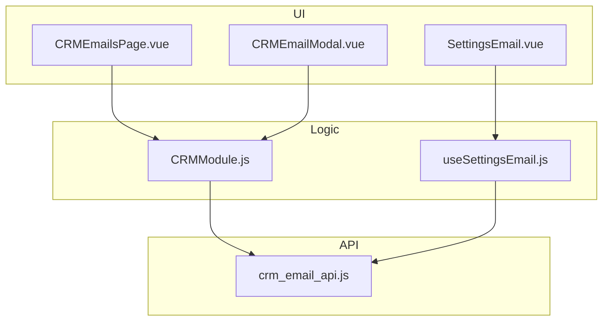
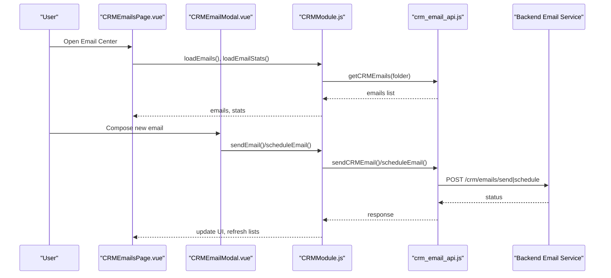
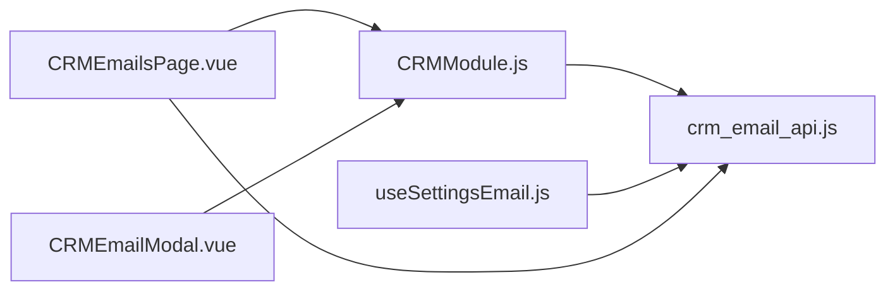
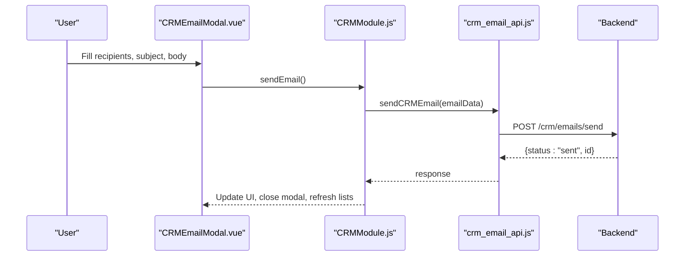
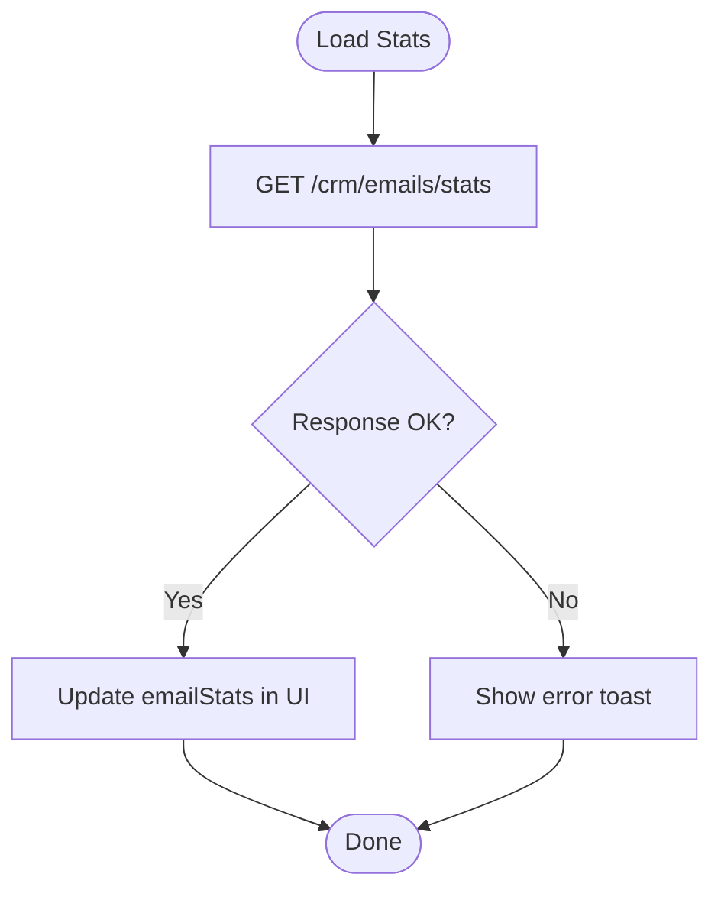

# Email Integration

<cite>
**Referenced Files in This Document**
- [CRMEmailsPage.vue](file://src/views/Modules/crm/CRMEmailsPage.vue)
- [CRMEmailModal.vue](file://src/views/Modules/crm/components/CRMEmailModal.vue)
- [CRMModule.js](file://src/views/Modules/crm/composables/CRMModule.js)
- [crm_email_api.js](file://src/services/crm_email_api.js)
- [useSettingsEmail.js](file://src/composables/settings/useSettingsEmail.js)
- [SettingsEmail.vue](file://src/views/Modules/settings/components/SettingsEmail.vue)
</cite>

## Table of Contents
1. [Introduction](#introduction)
2. [Project Structure](#project-structure)
3. [Core Components](#core-components)
4. [Architecture Overview](#architecture-overview)
5. [Detailed Component Analysis](#detailed-component-analysis)
6. [Dependency Analysis](#dependency-analysis)
7. [Performance Considerations](#performance-considerations)
8. [Troubleshooting Guide](#troubleshooting-guide)
9. [Conclusion](#conclusion)
10. [Appendices](#appendices)

## Introduction
This document explains the CRM email integration system implemented in the frontend. It covers how users compose, send, schedule, and track emails from contacts, accounts, or deals; how email templates are managed; and how email statistics (sent counts, open rates, click-through rates, scheduled emails) are displayed. It also documents the email modal functionality for recipient selection, subject handling, body formatting, and attachment support, as well as filtering by folders (inbox, sent, scheduled, drafts), search capabilities, and bulk operations where applicable. Finally, it outlines integration points with external email services via SMTP configuration management.

## Project Structure
The email feature spans several layers:
- UI views and modals for composing and listing emails
- A shared composable that centralizes state and actions for CRM modules including email
- An API service layer that calls backend endpoints for sending, scheduling, listing, tracking, and configuration
- Settings composables and components for managing SMTP/email configurations

**Diagram sources**
- [CRMEmailsPage.vue:1-186](file://src/views/Modules/crm/CRMEmailsPage.vue#L1-L186)
- [CRMEmailModal.vue:1-242](file://src/views/Modules/crm/components/CRMEmailModal.vue#L1-L242)
- [CRMModule.js:618-636](file://src/views/Modules/crm/composables/CRMModule.js#L618-L636)
- [CRMModule.js:2173-2196](file://src/views/Modules/crm/composables/CRMModule.js#L2173-L2196)
- [crm_email_api.js:1-313](file://src/services/crm_email_api.js#L1-L313)
- [useSettingsEmail.js:1-240](file://src/composables/settings/useSettingsEmail.js#L1-L240)
- [SettingsEmail.vue:1-53](file://src/views/Modules/settings/components/SettingsEmail.vue#L1-L53)

**Section sources**
- [CRMEmailsPage.vue:1-186](file://src/views/Modules/crm/CRMEmailsPage.vue#L1-L186)
- [CRMEmailModal.vue:1-242](file://src/views/Modules/crm/components/CRMEmailModal.vue#L1-L242)
- [CRMModule.js:618-636](file://src/views/Modules/crm/composables/CRMModule.js#L618-L636)
- [CRMModule.js:2173-2196](file://src/views/Modules/crm/composables/CRMModule.js#L2173-L2196)
- [crm_email_api.js:1-313](file://src/services/crm_email_api.js#L1-L313)
- [useSettingsEmail.js:1-240](file://src/composables/settings/useSettingsEmail.js#L1-L240)
- [SettingsEmail.vue:1-53](file://src/views/Modules/settings/components/SettingsEmail.vue#L1-L53)

## Core Components
- CRMEmailsPage.vue: Displays the email center, stats cards (sent today, open rate, click rate, scheduled), folder tabs (inbox, sent, scheduled, drafts), and opens the compose modal.
- CRMEmailModal.vue: Provides the compose interface with recipients (To/Cc/Bcc), subject, body, attachments placeholder, personal vs authenticated sender toggle, and send/schedule actions.
- CRMModule.js: Central state and logic for emails including templates, recipient search/linking, send, schedule, load emails/stats, and computed filters.
- crm_email_api.js: HTTP client functions to call backend endpoints for sending, scheduling, listing, tracking, and email configuration management.
- useSettingsEmail.js: Manages SMTP/email configurations, including create/update/delete/test flows and notification frequency metadata.
- SettingsEmail.vue: Placeholder UI for email settings (migration note indicates future expansion).

**Section sources**
- [CRMEmailsPage.vue:47-100](file://src/views/Modules/crm/CRMEmailsPage.vue#L47-L100)
- [CRMEmailModal.vue:29-118](file://src/views/Modules/crm/components/CRMEmailModal.vue#L29-L118)
- [CRMModule.js:618-636](file://src/views/Modules/crm/composables/CRMModule.js#L618-L636)
- [CRMModule.js:2173-2196](file://src/views/Modules/crm/composables/CRMModule.js#L2173-L2196)
- [crm_email_api.js:13-159](file://src/services/crm_email_api.js#L13-L159)
- [useSettingsEmail.js:67-118](file://src/composables/settings/useSettingsEmail.js#L67-L118)

## Architecture Overview
The email flow integrates UI, shared state, and API services:

**Diagram sources**
- [CRMEmailsPage.vue:154-164](file://src/views/Modules/crm/CRMEmailsPage.vue#L154-L164)
- [CRMEmailModal.vue:198-215](file://src/views/Modules/crm/components/CRMEmailModal.vue#L198-L215)
- [CRMModule.js:2173-2196](file://src/views/Modules/crm/composables/CRMModule.js#L2173-L2196)
- [crm_email_api.js:13-64](file://src/services/crm_email_api.js#L13-L64)

## Detailed Component Analysis

### Email Center View (CRMEmailsPage.vue)
- Displays header, user badge, and a “Compose Message” button.
- Shows four stat cards: Sent Today, Open Rate, Click Rate, Scheduled.
- Provides folder tabs: inbox, sent, scheduled, drafts with counts.
- Lists emails with preview and date formatting.
- Teleports the compose modal into the root target.

Key behaviors:
- On mount, sets active tab to emails and loads emails and stats.
- Filters emails by selected folder using a computed property in the module.

**Section sources**
- [CRMEmailsPage.vue:6-26](file://src/views/Modules/crm/CRMEmailsPage.vue#L6-L26)
- [CRMEmailsPage.vue:47-84](file://src/views/Modules/crm/CRMEmailsPage.vue#L47-L84)
- [CRMEmailsPage.vue:86-132](file://src/views/Modules/crm/CRMEmailsPage.vue#L86-L132)
- [CRMEmailsPage.vue:154-164](file://src/views/Modules/crm/CRMEmailsPage.vue#L154-L164)

### Compose Modal (CRMEmailModal.vue)
- Recipients: To input with Enter-to-add behavior, Cc/Bcc toggles, and tag-style chips for added recipients.
- Subject line input.
- Body textarea with toolbar buttons for bold, italic, list, and an attachment button placeholder.
- Footer actions:
  - Toggle to route via personal node (personal vs authenticated domain).
  - Abort and Execute Transmit buttons; loading spinner during send.

Validation and submission:
- Validates at least one recipient before sending.
- Calls sendEmail from the module and handles errors.

**Section sources**
- [CRMEmailModal.vue:29-118](file://src/views/Modules/crm/components/CRMEmailModal.vue#L29-L118)
- [CRMEmailModal.vue:123-165](file://src/views/Modules/crm/components/CRMEmailModal.vue#L123-L165)
- [CRMEmailModal.vue:198-215](file://src/views/Modules/crm/components/CRMEmailModal.vue#L198-L215)

### Shared State and Logic (CRMModule.js)
State and features relevant to email:
- Email state: showEmailModal, emailListFilter, emails, emailStats, emailForm, recipientSearch, filteredRecipients, showCc, showBcc, showLinkRecord, showTemplates, emailTemplates.
- Templates: predefined templates with name/description/body placeholders.
- Recipient linking: when adding first recipient, links to the corresponding CRM record (lead/contact/account/deal).
- Send/Schedule:
  - sendEmail constructs payload and calls sendCRMEmail; updates local emails and stats on success.
  - scheduleEmail prompts for time, builds payload with scheduled_time, calls scheduleEmail, updates stats and reloads.
- Load data:
  - loadEmails fetches emails by folder and tenant context.
  - loadEmailStats fetches stats for current user.
- Filtering:
  - filteredEmails computed to filter by folder.
  - canSendEmail computed ensures recipients, subject, and body are valid.

Integration points:
- Uses getUserEmail/getTenantId for context.
- Emits toast notifications for success/error.

**Section sources**
- [CRMModule.js:618-636](file://src/views/Modules/crm/composables/CRMModule.js#L618-L636)
- [CRMModule.js:2147-2196](file://src/views/Modules/crm/composables/CRMModule.js#L2147-L2196)
- [CRMModule.js:2200-2201](file://src/views/Modules/crm/composables/CRMModule.js#L2200-L2201)

### API Service Layer (crm_email_api.js)
Endpoints and responsibilities:
- sendCRMEmail: POST /crm/emails/send
- scheduleEmail: POST /crm/emails/schedule
- getCRMEmails: GET /crm/emails/list with folder, linked_record_id, limit, skip
- getEmailStats: GET /crm/emails/stats with optional user_email
- trackEmailAction: POST /crm/emails/track
- getEmailDetail: GET /crm/emails/{emailId}
- Email configuration management:
  - getEmailConfigurations: GET /email-configurations/?tenant_id=...
  - saveEmailConfiguration: POST/PUT /email-configurations
  - deleteEmailConfiguration: DELETE /email-configurations/{id}
  - testEmailConfiguration: POST /email-configurations/{id}/test

Error handling:
- Throws descriptive errors on non-ok responses.
- Logs errors to console.

**Section sources**
- [crm_email_api.js:13-64](file://src/services/crm_email_api.js#L13-L64)
- [crm_email_api.js:75-99](file://src/services/crm_email_api.js#L75-L99)
- [crm_email_api.js:107-131](file://src/services/crm_email_api.js#L107-L131)
- [crm_email_api.js:138-159](file://src/services/crm_email_api.js#L138-L159)
- [crm_email_api.js:166-184](file://src/services/crm_email_api.js#L166-L184)
- [crm_email_api.js:191-312](file://src/services/crm_email_api.js#L191-L312)

### Email Configuration Management (useSettingsEmail.js)
Capabilities:
- Create/update/delete SMTP/email configurations per tenant.
- Test configuration by sending a test email to a specified address.
- Store notification frequencies and enabled flags as metadata.
- Normalize backend field names to frontend template fields.

Workflow highlights:
- Validation of required fields before saving.
- Toast feedback for success/failure.
- Refresh configurations after save/delete.

**Section sources**
- [useSettingsEmail.js:67-118](file://src/composables/settings/useSettingsEmail.js#L67-L118)
- [useSettingsEmail.js:142-152](file://src/composables/settings/useSettingsEmail.js#L142-L152)
- [useSettingsEmail.js:154-199](file://src/composables/settings/useSettingsEmail.js#L154-L199)
- [useSettingsEmail.js:201-216](file://src/composables/settings/useSettingsEmail.js#L201-L216)

### Settings UI Placeholder (SettingsEmail.vue)
- Placeholder card indicating migration from legacy settings module.
- Future expansion expected to integrate with useSettingsEmail composable.

**Section sources**
- [SettingsEmail.vue:1-53](file://src/views/Modules/settings/components/SettingsEmail.vue#L1-L53)

## Dependency Analysis
The following diagram shows key dependencies between components and services:

**Diagram sources**
- [CRMEmailsPage.vue:154-164](file://src/views/Modules/crm/CRMEmailsPage.vue#L154-L164)
- [CRMEmailModal.vue:176-178](file://src/views/Modules/crm/components/CRMEmailModal.vue#L176-L178)
- [CRMModule.js:2173-2196](file://src/views/Modules/crm/composables/CRMModule.js#L2173-L2196)
- [useSettingsEmail.js:1-4](file://src/composables/settings/useSettingsEmail.js#L1-L4)
- [crm_email_api.js:1-313](file://src/services/crm_email_api.js#L1-L313)

**Section sources**
- [CRMEmailsPage.vue:154-164](file://src/views/Modules/crm/CRMEmailsPage.vue#L154-L164)
- [CRMEmailModal.vue:176-178](file://src/views/Modules/crm/components/CRMEmailModal.vue#L176-L178)
- [CRMModule.js:2173-2196](file://src/views/Modules/crm/composables/CRMModule.js#L2173-L2196)
- [useSettingsEmail.js:1-4](file://src/composables/settings/useSettingsEmail.js#L1-L4)
- [crm_email_api.js:1-313](file://src/services/crm_email_api.js#L1-L313)

## Performance Considerations
- Pagination and limits: The email list API supports limit and skip parameters to avoid large payloads. Ensure appropriate defaults and consider infinite scroll or pagination UI if needed.
- Debouncing recipient search: Implement debounced searches when scaling recipient suggestions to reduce network calls.
- Optimistic UI: For send/schedule actions, consider optimistic updates to improve perceived performance while awaiting server confirmation.
- Caching: Cache email stats and frequently accessed templates locally to reduce redundant requests.
- Error resilience: Wrap API calls with retries and user-friendly error messages to handle transient failures gracefully.

[No sources needed since this section provides general guidance]

## Troubleshooting Guide
Common issues and resolutions:
- Failed to send email: Check network connectivity, token validity, and backend endpoint availability. Review error thrown by sendCRMEmail.
- Failed to schedule email: Validate scheduled_time format and timezone considerations. Confirm backend scheduling service is operational.
- Failed to fetch emails: Verify folder parameter and tenant context. Inspect API response for error details.
- Failed to fetch stats: Ensure user_email parameter matches current user context.
- Tracking not updating: Confirm trackEmailAction is invoked for open/click events and backend is recording them.
- SMTP configuration errors: Validate host, port, username, password, TLS/SSL settings. Use testEmailConfiguration to verify connectivity.

**Section sources**
- [crm_email_api.js:13-64](file://src/services/crm_email_api.js#L13-L64)
- [crm_email_api.js:75-99](file://src/services/crm_email_api.js#L75-L99)
- [crm_email_api.js:107-131](file://src/services/crm_email_api.js#L107-L131)
- [crm_email_api.js:138-159](file://src/services/crm_email_api.js#L138-L159)
- [useSettingsEmail.js:67-118](file://src/composables/settings/useSettingsEmail.js#L67-L118)
- [useSettingsEmail.js:154-199](file://src/composables/settings/useSettingsEmail.js#L154-L199)

## Conclusion
The CRM email integration provides a cohesive workflow for composing, sending, scheduling, and tracking emails directly from CRM records. The UI surfaces essential metrics and folder-based navigation, while the shared composable centralizes state and actions. The API service abstracts backend interactions, including robust configuration management for external email services. With proper validation, error handling, and performance optimizations, the system offers a reliable foundation for CRM email operations.

[No sources needed since this section summarizes without analyzing specific files]

## Appendices

### Email Composition Flow (Sequence Diagram)

**Diagram sources**
- [CRMEmailModal.vue:198-215](file://src/views/Modules/crm/components/CRMEmailModal.vue#L198-L215)
- [CRMModule.js:2173-2183](file://src/views/Modules/crm/composables/CRMModule.js#L2173-L2183)
- [crm_email_api.js:13-35](file://src/services/crm_email_api.js#L13-L35)

### Email Statistics Flow (Flowchart)

**Diagram sources**
- [crm_email_api.js:107-131](file://src/services/crm_email_api.js#L107-L131)
- [CRMModule.js:2195-2196](file://src/views/Modules/crm/composables/CRMModule.js#L2195-L2196)

### Email Template Examples
Predefined templates available in the module include:
- Introduction: Welcome message to new leads
- Follow-up: Continuation of prior conversation
- Quotation: Proposal with pricing details
- Meeting Request: Scheduling a meeting

These templates provide structured bodies with placeholders for dynamic content such as lead name, product name, quote amount, and topic.

**Section sources**
- [CRMModule.js:631-636](file://src/views/Modules/crm/composables/CRMModule.js#L631-L636)

### Automated Email Workflows
While the frontend supports scheduling individual emails, automated workflows typically rely on backend triggers. The system exposes:
- Schedule endpoint for delayed delivery
- Tracking endpoint for open/click/bounce/reply events
- Configuration endpoints to manage SMTP providers

Automated sequences can be orchestrated by backend services using these APIs, with the frontend providing user initiation and monitoring.

**Section sources**
- [crm_email_api.js:42-64](file://src/services/crm_email_api.js#L42-L64)
- [crm_email_api.js:138-159](file://src/services/crm_email_api.js#L138-L159)
- [crm_email_api.js:191-312](file://src/services/crm_email_api.js#L191-L312)

### External Email Services Integration
SMTP/email configurations are managed via:
- Create/update configurations with host, port, credentials, TLS/SSL flags
- Test configuration by sending a test email
- Delete configurations as needed

This enables integration with various external email providers through standardized SMTP settings.

**Section sources**
- [useSettingsEmail.js:67-118](file://src/composables/settings/useSettingsEmail.js#L67-L118)
- [useSettingsEmail.js:154-199](file://src/composables/settings/useSettingsEmail.js#L154-L199)
- [crm_email_api.js:191-312](file://src/services/crm_email_api.js#L191-L312)