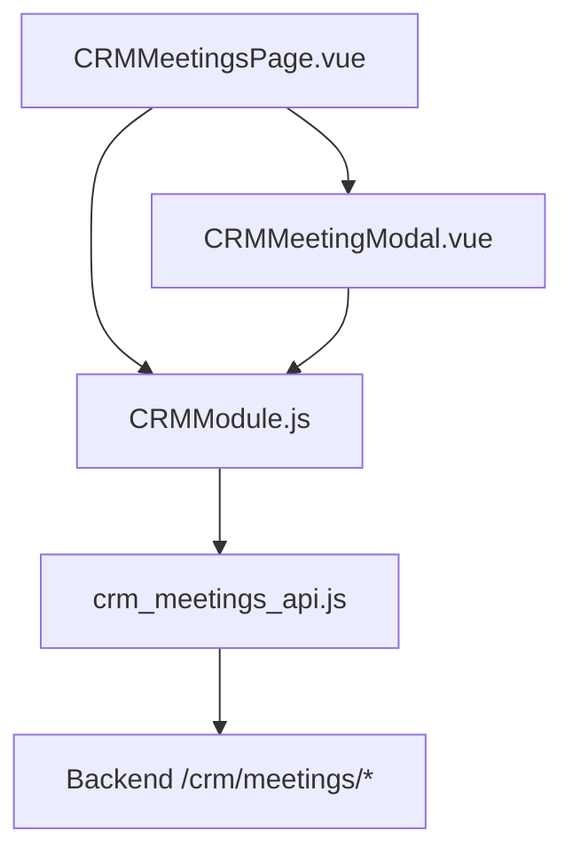
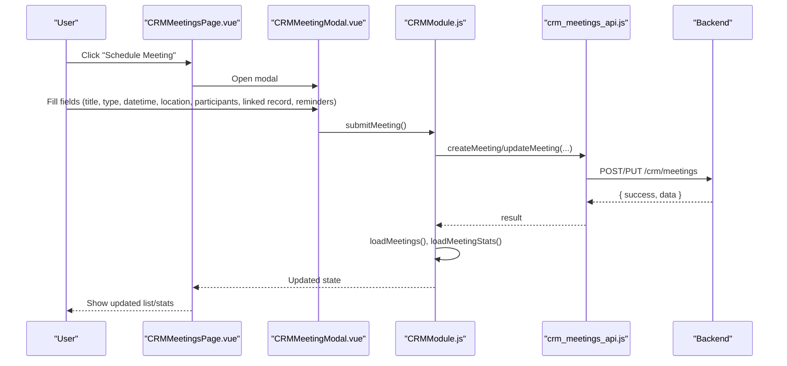
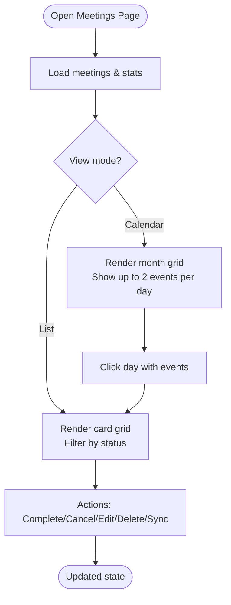
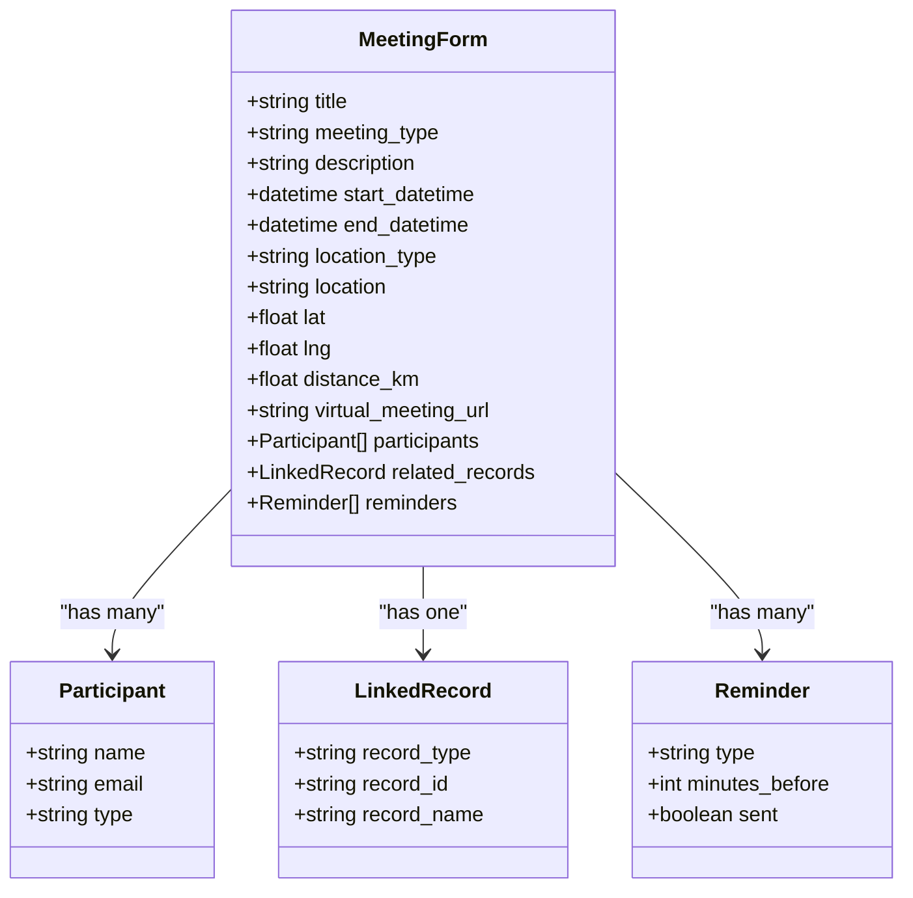
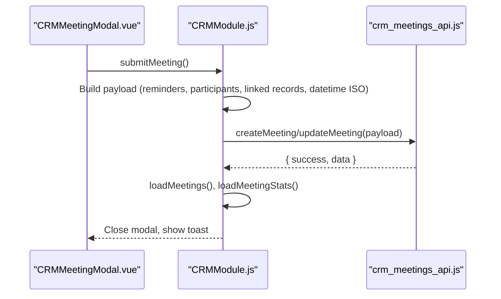
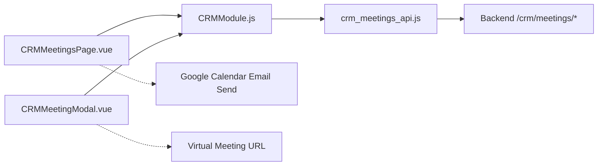

# Meeting Scheduling

<cite>
**Referenced Files in This Document**
- [CRMMeetingsPage.vue](file://src/views/Modules/crm/CRMMeetingsPage.vue)
- [CRMMeetingModal.vue](file://src/views/Modules/crm/components/CRMMeetingModal.vue)
- [CRMModule.js](file://src/views/Modules/crm/composables/CRMModule.js)
- [crm_meetings_api.js](file://src/services/crm_meetings_api.js)
</cite>

## Table of Contents
1. Introduction
2. Project Structure
3. Core Components
4. Architecture Overview
5. Detailed Component Analysis
6. Dependency Analysis
7. Performance Considerations
8. Troubleshooting Guide
9. Conclusion

## Introduction
This document explains the meeting scheduling system integrated with the CRM. It covers calendar integration, video conferencing link handling, attendee management, and how to schedule meetings directly from CRM records. It also describes the meeting modal workflow (date/time selection, location management, agenda setting, and meeting type classification), recurring meetings and templates, automated reminders, conflict detection, resource availability checks, calendar synchronization, analytics, and guidance for integrating with popular calendar platforms and video tools such as Zoom, Teams, or Google Meet.

## Project Structure
The meeting scheduling feature is implemented across a few key files:
- A page that renders the calendar view, list view, stats, and actions (schedule, sync, cancel, complete).
- A modal that collects all meeting details including participants, linked CRM records, location, and reminders.
- A composable that centralizes state, data loading, and business logic for meetings and other CRM features.
- An API service layer that calls backend endpoints for CRUD operations on meetings and statistics.

**Diagram sources**
- [CRMMeetingsPage.vue:1-120](file://src/views/Modules/crm/CRMMeetingsPage.vue#L1-L120)
- [CRMMeetingModal.vue:1-60](file://src/views/Modules/crm/components/CRMMeetingModal.vue#L1-L60)
- [CRMModule.js:2220-2365](file://src/views/Modules/crm/composables/CRMModule.js#L2220-L2365)
- [crm_meetings_api.js:1-120](file://src/services/crm_meetings_api.js#L1-L120)

**Section sources**
- [CRMMeetingsPage.vue:1-120](file://src/views/Modules/crm/CRMMeetingsPage.vue#L1-L120)
- [CRMMeetingModal.vue:1-60](file://src/views/Modules/crm/components/CRMMeetingModal.vue#L1-L60)
- [CRMModule.js:2220-2365](file://src/views/Modules/crm/composables/CRMModule.js#L2220-L2365)
- [crm_meetings_api.js:1-120](file://src/services/crm_meetings_api.js#L1-L120)

## Core Components
- Meetings Page: Displays KPIs, filters, list/calendar views, upcoming meetings, and actions like scheduling, syncing to Google Calendar, and editing.
- Meeting Modal: Step-by-step form for title, type, location, date/time, participants, linked CRM record, notes, and reminder triggers.
- Composable (CRMModule): Holds shared state for meetings, orchestrates load/save flows, computes calendar days, formats dates/times, and exposes helpers for linking records and managing participants.
- API Service: Provides typed functions to create, list, update, delete, complete, cancel meetings, and fetch stats/upcoming/today’s meetings.

Key responsibilities:
- Schedule/edit/delete meetings and mark them completed or cancelled.
- Link meetings to leads, contacts, accounts, or deals.
- Manage participants and optional virtual links.
- Compute and display stats and upcoming meetings.
- Provide a UI to send selected meetings via email (for calendar invites).

**Section sources**
- [CRMMeetingsPage.vue:55-132](file://src/views/Modules/crm/CRMMeetingsPage.vue#L55-L132)
- [CRMMeetingModal.vue:30-343](file://src/views/Modules/crm/components/CRMMeetingModal.vue#L30-L343)
- [CRMModule.js:2220-2365](file://src/views/Modules/crm/composables/CRMModule.js#L2220-L2365)
- [crm_meetings_api.js:13-322](file://src/services/crm_meetings_api.js#L13-L322)

## Architecture Overview
The flow starts at the Meetings Page, which opens the Meeting Modal to collect data. The modal delegates submission to the composable, which validates and calls the API service to persist changes. Stats and lists are refreshed afterward.

**Diagram sources**
- [CRMMeetingsPage.vue:66-75](file://src/views/Modules/crm/CRMMeetingsPage.vue#L66-L75)
- [CRMMeetingModal.vue:346-369](file://src/views/Modules/crm/components/CRMMeetingModal.vue#L346-L369)
- [CRMModule.js:2257-2332](file://src/views/Modules/crm/composables/CRMModule.js#L2257-L2332)
- [crm_meetings_api.js:13-36](file://src/services/crm_meetings_api.js#L13-L36)

## Detailed Component Analysis

### Meetings Page (Calendar/List/KPIs)
- View modes: List cards and a month calendar grid with navigation.
- Filters: All/Scheduled/Completed/Cancelled.
- KPIs: Scheduled count, today’s count, completed this week, total, plus financial KPIs derived from pipeline data.
- Actions:
  - Schedule new meeting (opens modal).
  - Sync to Google Calendar (opens a modal to select meetings and recipients).
  - Excel edit/import (UI present; import handler exists).
  - Per-meeting actions: complete, cancel, add to Google Calendar, delete, edit, review.

**Diagram sources**
- [CRMMeetingsPage.vue:190-364](file://src/views/Modules/crm/CRMMeetingsPage.vue#L190-L364)
- [CRMModule.js:2203-2219](file://src/views/Modules/crm/composables/CRMModule.js#L2203-L2219)

**Section sources**
- [CRMMeetingsPage.vue:55-132](file://src/views/Modules/crm/CRMMeetingsPage.vue#L55-L132)
- [CRMMeetingsPage.vue:190-364](file://src/views/Modules/crm/CRMMeetingsPage.vue#L190-L364)
- [CRMModule.js:2203-2219](file://src/views/Modules/crm/composables/CRMModule.js#L2203-L2219)

### Meeting Modal (Date/Time, Location, Agenda, Type, Participants, Linked Records)
- Primary information: Title, meeting type (call/virtual/physical/other), location type (virtual/physical/phone), optional virtual meeting URL.
- Physical location: Search and set your location, optionally use current device location, manual lat/lng input, distance calculation vs linked record location.
- Date & time: Start and end datetimes.
- Participants: Add/remove participants with name/email/type.
- Linked records: Choose lead/contact/account/deal and search/select by name; updates linked record location if available.
- Documentation: Notes/agenda textarea.
- Notification triggers: Checkboxes for 15 minutes, 1 hour, and 24 hours before reminders.

**Diagram sources**
- [CRMMeetingModal.vue:30-343](file://src/views/Modules/crm/components/CRMMeetingModal.vue#L30-L343)
- [CRMModule.js:2257-2332](file://src/views/Modules/crm/composables/CRMModule.js#L2257-L2332)

**Section sources**
- [CRMMeetingModal.vue:30-343](file://src/views/Modules/crm/components/CRMMeetingModal.vue#L30-L343)
- [CRMModule.js:2220-2332](file://src/views/Modules/crm/composables/CRMModule.js#L2220-L2332)

### Data Flow and Business Logic (Composable)
- State: Shared refs for meetings, stats, filters, modal visibility, and form data.
- Loading: Fetches meetings and stats using the API service; computes calendar days and filters.
- Submission: Builds payload (including timezone, organizer info, participants, linked records, reminders), then calls create/update APIs. Refreshes lists and stats on success.
- Utilities: Formats times/dates, maps record names to IDs, handles linked record selection and location updates.

**Diagram sources**
- [CRMModule.js:2257-2332](file://src/views/Modules/crm/composables/CRMModule.js#L2257-L2332)
- [crm_meetings_api.js:13-36](file://src/services/crm_meetings_api.js#L13-L36)

**Section sources**
- [CRMModule.js:2220-2365](file://src/views/Modules/crm/composables/CRMModule.js#L2220-L2365)
- [crm_meetings_api.js:13-322](file://src/services/crm_meetings_api.js#L13-L322)

### API Surface
- Create meeting: POST /crm/meetings/create
- List meetings: GET /crm/meetings/list (supports tenant_id, status, meeting_type, date range, organizer, related_record_id, pagination)
- Get meeting: GET /crm/meetings/{id}
- Update meeting: PUT /crm/meetings/{id}
- Delete meeting: DELETE /crm/meetings/{id}?tenant_id=...
- Complete meeting: POST /crm/meetings/{id}/complete?outcome=...
- Cancel meeting: POST /crm/meetings/{id}/cancel?reason=...
- Stats: GET /crm/meetings/stats/{tenantId}
- Upcoming/Todays: Helpers that call list with appropriate filters

**Section sources**
- [crm_meetings_api.js:13-322](file://src/services/crm_meetings_api.js#L13-L322)

## Dependency Analysis
- CRMMeetingsPage depends on CRMModule for state and actions, and on CRMMeetingModal for the scheduling UI.
- CRMMeetingModal uses CRMModule to access shared state and submission logic.
- CRMModule consumes crm_meetings_api for all backend interactions and provides computed views (calendar days, filtered lists).
- External integrations:
  - Google Calendar: UI to send meetings via email invitations; direct calendar sync buttons exist but server-side sync is not shown here.
  - Video tools: Placeholders for Zoom/Google Meet link generation; currently manual entry is supported.

**Diagram sources**
- [CRMMeetingsPage.vue:66-75](file://src/views/Modules/crm/CRMMeetingsPage.vue#L66-L75)
- [CRMMeetingModal.vue:79-87](file://src/views/Modules/crm/components/CRMMeetingModal.vue#L79-L87)
- [CRMModule.js:2220-2365](file://src/views/Modules/crm/composables/CRMModule.js#L2220-L2365)
- [crm_meetings_api.js:13-322](file://src/services/crm_meetings_api.js#L13-L322)

**Section sources**
- [CRMMeetingsPage.vue:66-75](file://src/views/Modules/crm/CRMMeetingsPage.vue#L66-L75)
- [CRMMeetingModal.vue:79-87](file://src/views/Modules/crm/components/CRMMeetingModal.vue#L79-L87)
- [CRMModule.js:2220-2365](file://src/views/Modules/crm/composables/CRMModule.js#L2220-L2365)
- [crm_meetings_api.js:13-322](file://src/services/crm_meetings_api.js#L13-L322)

## Performance Considerations
- Client-side filtering and calendar rendering are efficient for typical CRM datasets; large lists rely on limit/skip parameters from the API.
- Debounced location searches reduce unnecessary network calls when geocoding addresses.
- Avoid excessive re-renders by keeping heavy computations within computed properties where possible.
- Use pagination and limits when listing meetings to keep initial loads fast.

[No sources needed since this section provides general guidance]

## Troubleshooting Guide
Common issues and resolutions:
- Save fails: Ensure start/end datetimes are provided; check browser timezone conversion; verify token and network connectivity.
- Cannot complete/cancel: Confirm meeting status allows the action; check backend response for error details.
- No meetings showing: Verify tenant_id and branch filters; ensure user has permissions to view meetings.
- Geolocation errors: Browser may block location; allow permissions or enter coordinates manually.
- Video link missing: Currently requires manual entry; paste the correct URL in the virtual meeting field.

**Section sources**
- [CRMModule.js:2257-2332](file://src/views/Modules/crm/composables/CRMModule.js#L2257-L2332)
- [CRMMeetingsPage.vue:645-661](file://src/views/Modules/crm/CRMMeetingsPage.vue#L645-L661)
- [crm_meetings_api.js:13-322](file://src/services/crm_meetings_api.js#L13-L322)

## Conclusion
The CRM-integrated meeting scheduler provides a robust UI for creating, viewing, and managing meetings, with strong linkage to CRM entities, flexible location handling, and reminder configuration. While native calendar sync and automated video link generation are partially implemented, the system supports sending meeting invites via email and can be extended to integrate deeply with external calendars and video platforms. Analytics are exposed through stats and upcoming lists, enabling basic attendance and productivity insights.

[No sources needed since this section summarizes without analyzing specific files]

## Appendices

### How to Schedule Meetings from CRM Records
- From any CRM record (lead, contact, account, deal), open the Meetings module and click “Schedule Meeting.”
- In the modal, select the linked record type and choose the specific record.
- Set title, type, location, date/time, participants, agenda, and reminders.
- Submit to create or update the meeting; it will appear in both list and calendar views.

**Section sources**
- [CRMMeetingModal.vue:276-306](file://src/views/Modules/crm/components/CRMMeetingModal.vue#L276-L306)
- [CRMModule.js:2220-2332](file://src/views/Modules/crm/composables/CRMModule.js#L2220-L2332)

### Recurring Meetings and Templates
- Recurring meetings: Not explicitly implemented in the UI; you can create multiple instances manually or extend the backend to support recurrence rules.
- Meeting templates: Not present in the current codebase; consider adding template storage and quick-fill functionality in the modal.

[No sources needed since this section provides general guidance]

### Automated Reminders
- Configure reminders via checkboxes (15 minutes, 1 hour, 24 hours before). These are stored with the meeting and can be processed by a background job on the server.

**Section sources**
- [CRMMeetingModal.vue:324-343](file://src/views/Modules/crm/components/CRMMeetingModal.vue#L324-L343)
- [CRMModule.js:2257-2332](file://src/views/Modules/crm/composables/CRMModule.js#L2257-L2332)

### Conflict Detection and Resource Availability
- Conflict detection: Not implemented client-side; consider comparing start/end times against existing meetings for the same organizer/participants.
- Resource availability: Not implemented; could be added by checking room/resource calendars or tool availability.

[No sources needed since this section provides general guidance]

### Calendar Synchronization
- Google Calendar: The page includes a “Sync_Google_Cal” button and an email-based send modal to distribute meetings to recipients. Direct two-way sync would require additional backend integration.

**Section sources**
- [CRMMeetingsPage.vue:66-75](file://src/views/Modules/crm/CRMMeetingsPage.vue#L66-L75)
- [CRMMeetingsPage.vue:397-558](file://src/views/Modules/crm/CRMMeetingsPage.vue#L397-L558)

### Integrating with Video Conferencing Tools
- Zoom/Teams/Google Meet: The modal accepts a virtual meeting URL. Placeholder functions exist for generating links; implement server-side or third-party API calls to generate meeting links automatically.

**Section sources**
- [CRMMeetingModal.vue:79-87](file://src/views/Modules/crm/components/CRMMeetingModal.vue#L79-L87)
- [CRMModule.js:2366-2367](file://src/views/Modules/crm/composables/CRMModule.js#L2366-L2367)

### Analytics: Attendance, Duration, Productivity
- Current analytics include counts (scheduled, today, completed this week, total) and upcoming lists.
- For attendance tracking and duration analysis, capture actual start/end times and outcomes upon completion; compute average durations and no-show rates from stored data.

**Section sources**
- [CRMMeetingsPage.vue:78-188](file://src/views/Modules/crm/CRMMeetingsPage.vue#L78-L188)
- [CRMModule.js:2363-2365](file://src/views/Modules/crm/composables/CRMModule.js#L2363-L2365)