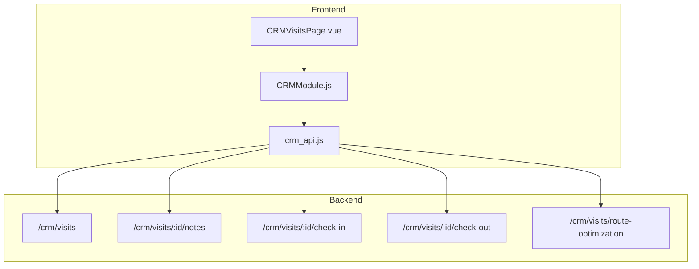
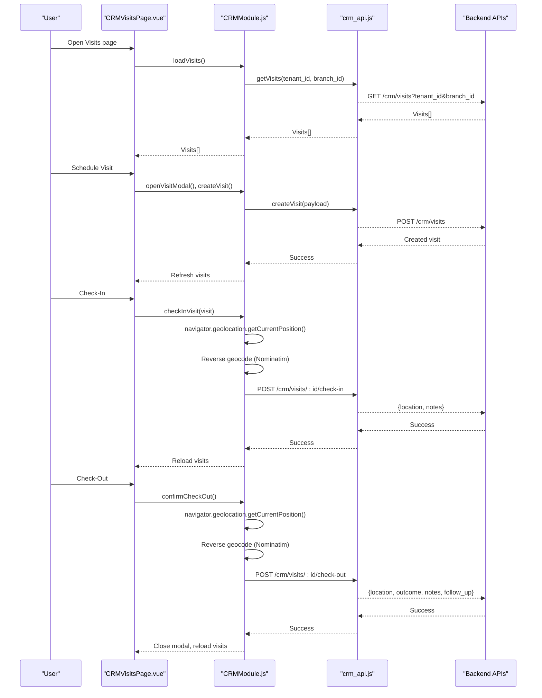
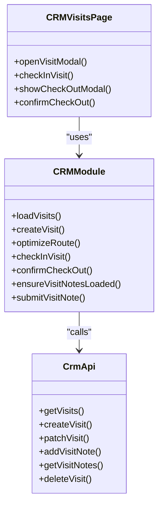

# Visit Tracking

<cite>
**Referenced Files in This Document**
- [CRMVisitsPage.vue](file://src/views/Modules/crm/CRMVisitsPage.vue)
- [CRMModule.js](file://src/views/Modules/crm/composables/CRMModule.js)
- [crm_api.js](file://src/services/crm_api.js)
</cite>

## Table of Contents
1. [Introduction](#introduction)
2. [Project Structure](#project-structure)
3. [Core Components](#core-components)
4. [Architecture Overview](#architecture-overview)
5. [Detailed Component Analysis](#detailed-component-analysis)
6. [Dependency Analysis](#dependency-analysis)
7. [Performance Considerations](#performance-considerations)
8. [Troubleshooting Guide](#troubleshooting-guide)
9. [Conclusion](#conclusion)
10. [Appendices](#appendices)

## Introduction
This document explains the visit tracking and field service coordination system implemented in the CRM module. It covers how to plan visits, optimize routes, manage field agents, schedule client visits, track visit history, and coordinate field activities. It also details the visit scheduling interface with location mapping, travel time estimation, resource allocation, status tracking, completion reporting, follow-up task generation, GPS integration for check-in/check-out, and analytics considerations such as visit frequency analysis, travel cost optimization, and agent performance metrics.

## Project Structure
The visit tracking feature is primarily implemented in:
- A dedicated page component that renders the visit list, scheduling modal, and check-in/out flows.
- A composable that encapsulates all visit-related state and logic (CRUD, route optimization, geolocation, notes).
- An API service layer that calls backend endpoints for visits, notes, and route optimization.

**Diagram sources**
- [CRMVisitsPage.vue:1-372](file://src/views/Modules/crm/CRMVisitsPage.vue#L1-L372)
- [CRMModule.js:764-928](file://src/views/Modules/crm/composables/CRMModule.js#L764-L928)
- [crm_api.js:489-537](file://src/services/crm_api.js#L489-L537)

**Section sources**
- [CRMVisitsPage.vue:1-372](file://src/views/Modules/crm/CRMVisitsPage.vue#L1-L372)
- [CRMModule.js:764-928](file://src/views/Modules/crm/composables/CRMModule.js#L764-L928)
- [crm_api.js:489-537](file://src/services/crm_api.js#L489-L537)

## Core Components
- Visit List and Actions: Displays planned, in-progress, completed, and canceled visits with actions to edit, complete, delete, check-in, and check-out.
- Visit Scheduler Modal: Create or edit visits, select a lead target, set scheduled time, add description, and optionally compute route and distance.
- Check-In/Check-Out Flows: Capture GPS coordinates and address via browser geolocation and reverse geocoding; submit outcomes and optional follow-ups.
- Route Optimization: Compute driving route between current location and destination to estimate distance and duration.
- Visit Notes: Add and view per-visit notes for auditability and context.
- API Integration: Centralized functions to create, update, fetch, and annotate visits, plus route optimization endpoint.

**Section sources**
- [CRMVisitsPage.vue:30-151](file://src/views/Modules/crm/CRMVisitsPage.vue#L30-L151)
- [CRMVisitsPage.vue:156-291](file://src/views/Modules/crm/CRMVisitsPage.vue#L156-L291)
- [CRMModule.js:764-928](file://src/views/Modules/crm/composables/CRMModule.js#L764-L928)
- [crm_api.js:489-537](file://src/services/crm_api.js#L489-L537)

## Architecture Overview
The visit tracking flow integrates UI, business logic, and backend services:

**Diagram sources**
- [CRMVisitsPage.vue:30-151](file://src/views/Modules/crm/CRMVisitsPage.vue#L30-L151)
- [CRMModule.js:809-928](file://src/views/Modules/crm/composables/CRMModule.js#L809-L928)
- [crm_api.js:489-537](file://src/services/crm_api.js#L489-L537)

## Detailed Component Analysis

### Visit List and Status Management
- Displays visits with color-coded borders by status: planned, in-progress, completed, canceled.
- Shows lead name, address, scheduled time, distance, estimated duration, and links to maps.
- Timeline section shows check-in and check-out timestamps and total actual duration.
- Outcome display includes success/no-show/rescheduled/other with optional notes and follow-up flags.

Key behaviors:
- Edit existing visits.
- Mark visits as completed directly.
- Delete visits.
- Check-in when planned; check-out when in-progress.

**Section sources**
- [CRMVisitsPage.vue:30-151](file://src/views/Modules/crm/CRMVisitsPage.vue#L30-L151)
- [CRMModule.js:846-873](file://src/views/Modules/crm/composables/CRMModule.js#L846-L873)

### Visit Scheduler Modal
- Select target lead from searchable dropdown; auto-populate destination if lead has location data.
- Set visit title, scheduled date/time, and internal description.
- Optional route optimization: compute driving route from current device location to destination to estimate distance and duration.
- Save creates or updates a visit record.

Location features:
- Use current device location via geolocation API.
- Manual coordinate entry option.
- Reverse geocoding to human-readable address.

Route optimization:
- Calls backend route optimization endpoint with origin and destination coordinates and mode.
- Stores route data, distance, and estimated duration on the visit form.

**Section sources**
- [CRMVisitsPage.vue:156-233](file://src/views/Modules/crm/CRMVisitsPage.vue#L156-L233)
- [CRMModule.js:764-844](file://src/views/Modules/crm/composables/CRMModule.js#L764-L844)
- [crm_api.js:489-537](file://src/services/crm_api.js#L489-L537)

### Check-In Flow
- Validates geolocation support.
- Captures high-accuracy GPS position.
- Reverse geocodes to an address string using Nominatim.
- Submits check-in payload including location and notes to backend.
- On success, refreshes visit list and notifies user.

Error handling:
- Alerts if geolocation is unsupported or fails.
- Warns on reverse geocoding failures but continues with raw coordinates.

**Section sources**
- [CRMModule.js:890-905](file://src/views/Modules/crm/composables/CRMModule.js#L890-L905)
- [crm_api.js:489-537](file://src/services/crm_api.js#L489-L537)

### Check-Out Flow
- Opens modal to capture visit outcome, notes, and optional follow-up requirement and date.
- Captures GPS position and reverse geocodes address.
- Submits check-out payload including outcome, notes, and follow-up fields.
- On success, closes modal, refreshes visits, and notifies user.

Validation:
- Requires selecting an outcome before submission.
- Disables submit while processing.

**Section sources**
- [CRMVisitsPage.vue:235-291](file://src/views/Modules/crm/CRMVisitsPage.vue#L235-L291)
- [CRMModule.js:885-928](file://src/views/Modules/crm/composables/CRMModule.js#L885-L928)

### Visit Notes
- Each visit supports adding and viewing notes.
- Notes are loaded on demand and appended after successful creation.
- Provides a simple input and send action to log notes.

**Section sources**
- [CRMVisitsPage.vue:122-148](file://src/views/Modules/crm/CRMVisitsPage.vue#L122-L148)
- [CRMModule.js:850-883](file://src/views/Modules/crm/composables/CRMModule.js#L850-L883)
- [crm_api.js:517-529](file://src/services/crm_api.js#L517-L529)

### Route Optimization and Travel Time Estimation
- Computes driving route between current device location and destination.
- Sends origin and destination coordinates plus mode to backend.
- Receives route data, distance, and estimated duration; stores them on the visit form for display and planning.

Use cases:
- Estimate travel time before scheduling.
- Plan efficient daily routes by comparing multiple destinations.

**Section sources**
- [CRMModule.js:833-844](file://src/views/Modules/crm/composables/CRMModule.js#L833-L844)

### Field Agent Management Capabilities
- Branch scoping: Visits can be filtered by selected branch to align with organizational structure.
- Lead association: Visits link to leads to identify target clients.
- Status lifecycle: Planned → In-Progress (via check-in) → Completed (via check-out or direct mark); Canceled supported.
- Follow-up tasks: Check-out supports marking follow-up required with a target date, enabling subsequent task generation workflows.

**Section sources**
- [CRMModule.js:59-67](file://src/views/Modules/crm/composables/CRMModule.js#L59-L67)
- [CRMModule.js:885-928](file://src/views/Modules/crm/composables/CRMModule.js#L885-L928)

## Dependency Analysis
- CRMVisitsPage.vue depends on useCRMModule composable for state and methods.
- CRMModule.js orchestrates geolocation, reverse geocoding, API calls, and local state.
- crm_api.js centralizes HTTP requests and error handling for visit operations.

**Diagram sources**
- [CRMVisitsPage.vue:297-338](file://src/views/Modules/crm/CRMVisitsPage.vue#L297-L338)
- [CRMModule.js:764-928](file://src/views/Modules/crm/composables/CRMModule.js#L764-L928)
- [crm_api.js:489-537](file://src/services/crm_api.js#L489-L537)

**Section sources**
- [CRMVisitsPage.vue:297-338](file://src/views/Modules/crm/CRMVisitsPage.vue#L297-L338)
- [CRMModule.js:764-928](file://src/views/Modules/crm/composables/CRMModule.js#L764-L928)
- [crm_api.js:489-537](file://src/services/crm_api.js#L489-L537)

## Performance Considerations
- Geolocation calls should be throttled and cached where appropriate to reduce battery usage and network overhead.
- Reverse geocoding uses a public service; consider caching results per coordinate pair to avoid repeated calls.
- Route optimization calls are server-side; batch planning multiple stops to minimize API calls.
- Display large visit lists efficiently by lazy-loading notes and avoiding unnecessary re-renders.

[No sources needed since this section provides general guidance]

## Troubleshooting Guide
Common issues and resolutions:
- Geolocation not supported: Ensure browser permissions allow location access; fallback to manual coordinates.
- Reverse geocoding failure: Address will default to raw coordinates; continue with check-in/check-out.
- Route optimization failure: Proceed without route data; visit can still be created.
- Network errors: Retry operations; verify authentication token and tenant/branch parameters.

**Section sources**
- [CRMModule.js:809-823](file://src/views/Modules/crm/composables/CRMModule.js#L809-L823)
- [CRMModule.js:833-844](file://src/views/Modules/crm/composables/CRMModule.js#L833-L844)
- [CRMModule.js:890-928](file://src/views/Modules/crm/composables/CRMModule.js#L890-L928)

## Conclusion
The visit tracking system provides a robust workflow for planning, executing, and closing field visits with integrated GPS-based check-in/check-out, route optimization, and note-taking. It supports branch-scoped operations, lead-linked visits, and follow-up task generation. The modular architecture separates UI, business logic, and API concerns, enabling maintainability and extensibility for future enhancements such as advanced analytics and geofencing.

[No sources needed since this section summarizes without analyzing specific files]

## Appendices

### Visit Workflow Examples
- Sales Visit:
  - Schedule visit with lead target and destination.
  - Optimize route to estimate travel time.
  - Check-in at site; log notes during visit.
  - Check-out with outcome “successful” and optional follow-up date.
- Service Call:
  - Create visit linked to account/contact.
  - Use current location for quick check-in.
  - Record detailed notes and outcome; mark follow-up if additional work is needed.
- Customer Support Interaction:
  - Plan visit based on priority and location clustering.
  - Execute check-in/check-out with outcome “rescheduled” or “other”.
  - Generate follow-up tasks for escalation or next steps.

[No sources needed since this section provides conceptual examples]

### Analytics Guidance
- Visit Frequency Analysis:
  - Aggregate visits by lead/account over time to identify hotspots and recurring needs.
- Travel Cost Optimization:
  - Use route optimization data (distance and duration) to cluster visits geographically and reduce travel costs.
- Field Agent Performance Metrics:
  - Track check-in/check-out times to compute actual durations and compare against estimates.
  - Measure completion rates and follow-up adherence per agent or branch.

[No sources needed since this section provides general guidance]