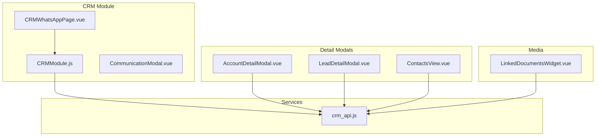
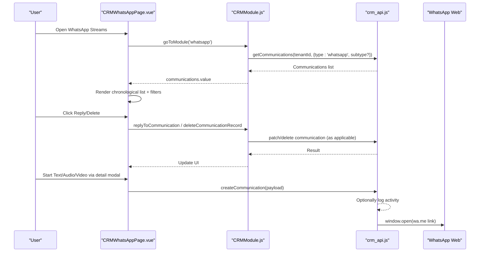
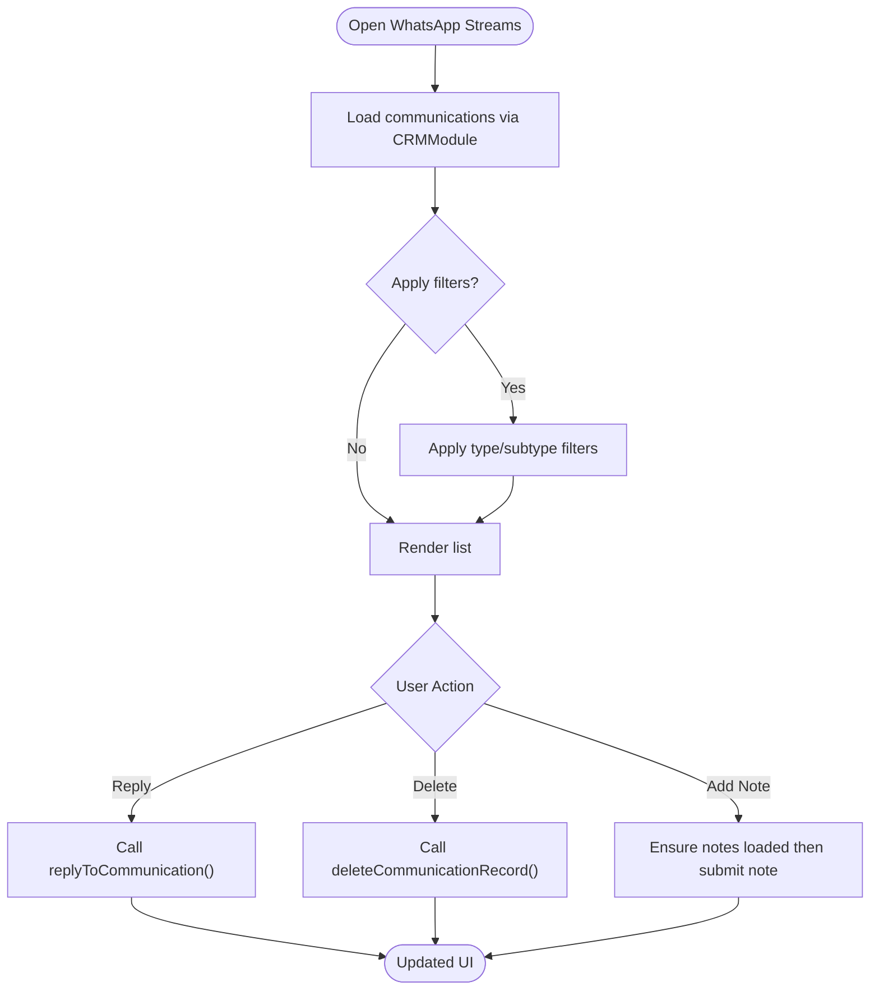
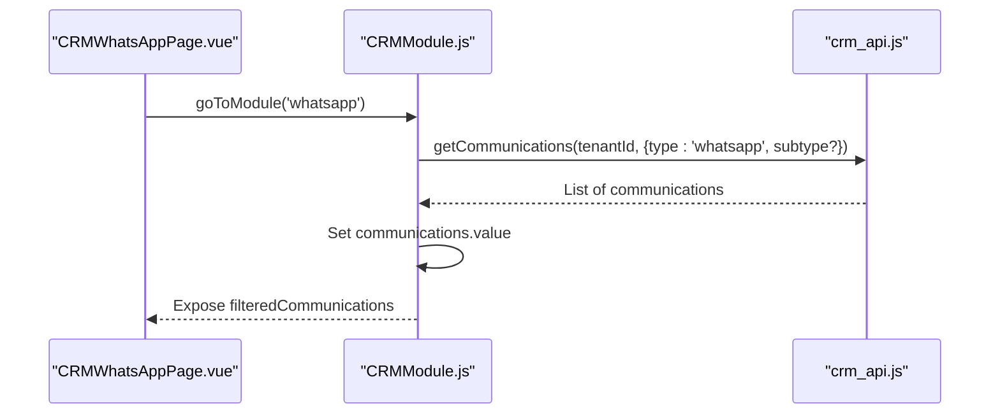
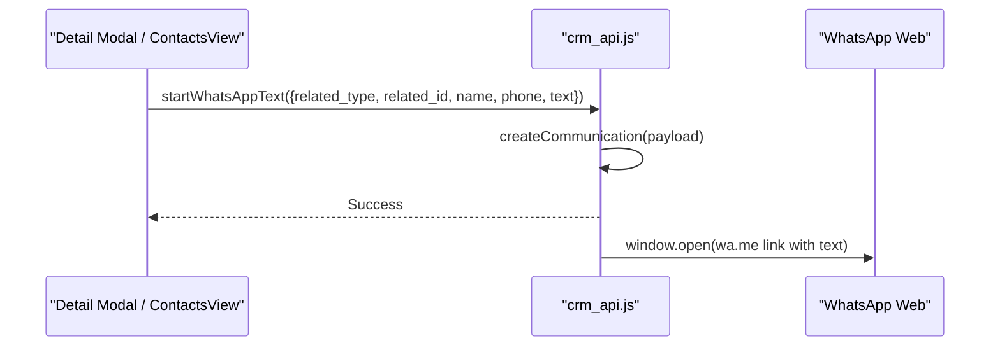
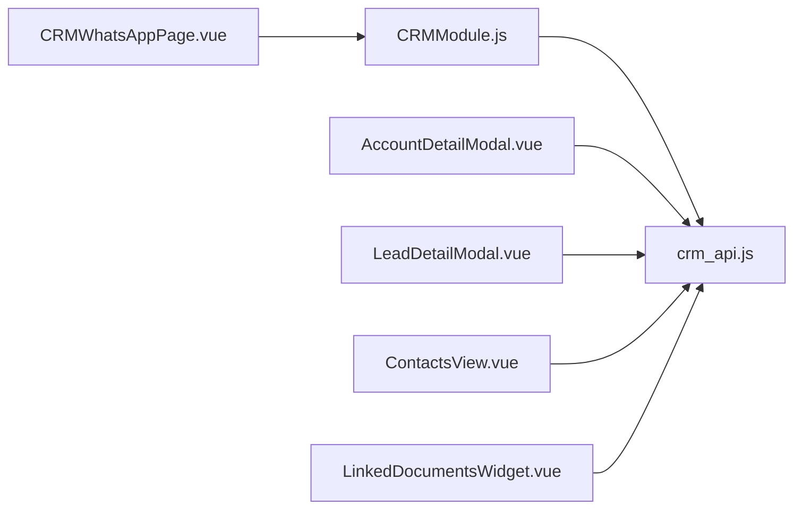

# WhatsApp Messaging

<cite>
**Referenced Files in This Document**
- [CRMWhatsAppPage.vue](file://src/views/Modules/crm/CRMWhatsAppPage.vue)
- [CRMModule.js](file://src/views/Modules/crm/composables/CRMModule.js)
- [crm_api.js](file://src/services/crm_api.js)
- [CommunicationModal.vue](file://src/views/Modules/crm/components/CommunicationModal.vue)
- [ContactsView.vue](file://src/views/Modules/crm/components/ContactsView.vue)
- [AccountDetailModal.vue](file://src/views/Modules/crm/components/AccountDetailModal.vue)
- [LeadDetailModal.vue](file://src/views/Modules/crm/components/LeadDetailModal.vue)
- [LinkedDocumentsWidget.vue](file://src/views/Modules/crm/components/LinkedDocumentsWidget.vue)
</cite>

## Table of Contents
1. [Introduction](#introduction)
2. [Project Structure](#project-structure)
3. [Core Components](#core-components)
4. [Architecture Overview](#architecture-overview)
5. [Detailed Component Analysis](#detailed-component-analysis)
6. [Dependency Analysis](#dependency-analysis)
7. [Performance Considerations](#performance-considerations)
8. [Troubleshooting Guide](#troubleshooting-guide)
9. [Conclusion](#conclusion)
10. [Appendices](#appendices)

## Introduction
This document explains how the CRM platform integrates with WhatsApp for messaging, conversation tracking, and communication management. It covers sending and receiving messages from contact or account records, message history, filtering by subtype (text, audio call, video call), notes per communication, and how the UI orchestrates these flows. It also outlines current capabilities and limitations based on the frontend codebase, including media handling via linked documents and compliance considerations.

## Project Structure
The WhatsApp integration is implemented as part of the CRM module:
- A dedicated page lists WhatsApp communications with filters and chronological display.
- A shared composable centralizes data fetching, state, and actions across CRM modules.
- API helpers provide convenience functions to log and open WhatsApp interactions.
- Detail modals expose quick ways to start a WhatsApp message from contacts/accounts/leads.
- Linked documents support media attachments that can be associated with records and potentially shared via WhatsApp.

**Diagram sources**
- [CRMWhatsAppPage.vue:1-285](file://src/views/Modules/crm/CRMWhatsAppPage.vue#L1-L285)
- [CRMModule.js:270-309](file://src/views/Modules/crm/composables/CRMModule.js#L270-L309)
- [crm_api.js:147-190](file://src/services/crm_api.js#L147-L190)
- [CommunicationModal.vue:1-66](file://src/views/Modules/crm/components/CommunicationModal.vue#L1-L66)
- [ContactsView.vue:145-155](file://src/views/Modules/crm/components/ContactsView.vue#L145-L155)
- [AccountDetailModal.vue:1134-1169](file://src/views/Modules/crm/components/AccountDetailModal.vue#L1134-L1169)
- [LeadDetailModal.vue:825-856](file://src/views/Modules/crm/components/LeadDetailModal.vue#L825-L856)
- [LinkedDocumentsWidget.vue:233-269](file://src/views/Modules/crm/components/LinkedDocumentsWidget.vue#L233-L269)

**Section sources**
- [CRMWhatsAppPage.vue:1-285](file://src/views/Modules/crm/CRMWhatsAppPage.vue#L1-L285)
- [CRMModule.js:270-309](file://src/views/Modules/crm/composables/CRMModule.js#L270-L309)
- [crm_api.js:147-190](file://src/services/crm_api.js#L147-L190)

## Core Components
- WhatsApp Streams Page: Displays filtered WhatsApp communications, supports subtype filters (text, audio_call, video_call), shows status, and allows replies and deletion. Notes can be appended per communication.
- CRM Module Composable: Centralizes loading of WhatsApp communications when navigating to the WhatsApp module, applies filters, and exposes helper methods used across views.
- API Helpers: Provide convenience functions to log a WhatsApp communication and open WhatsApp web links for text, audio calls, and video calls.
- Communication Modal: Generic modal to send messages (including WhatsApp type) and associate them with a contact.
- Detail Modals and Contact Views: Provide quick entry points to start a WhatsApp message directly from a lead, contact, or account record.
- Linked Documents Widget: Enables capturing and uploading images/documents which can be attached to records; while not sent directly through WhatsApp APIs here, they represent media assets available within the CRM context.

**Section sources**
- [CRMWhatsAppPage.vue:37-71](file://src/views/Modules/crm/CRMWhatsAppPage.vue#L37-L71)
- [CRMModule.js:288-295](file://src/views/Modules/crm/composables/CRMModule.js#L288-L295)
- [crm_api.js:152-190](file://src/services/crm_api.js#L152-L190)
- [CommunicationModal.vue:10-43](file://src/views/Modules/crm/components/CommunicationModal.vue#L10-L43)
- [ContactsView.vue:145-155](file://src/views/Modules/crm/components/ContactsView.vue#L145-L155)
- [AccountDetailModal.vue:1134-1169](file://src/views/Modules/crm/components/AccountDetailModal.vue#L1134-L1169)
- [LeadDetailModal.vue:825-856](file://src/views/Modules/crm/components/LeadDetailModal.vue#L825-L856)
- [LinkedDocumentsWidget.vue:233-269](file://src/views/Modules/crm/components/LinkedDocumentsWidget.vue#L233-L269)

## Architecture Overview
The WhatsApp flow combines UI actions, centralized state management, and API calls to log communications and open WhatsApp web interfaces. The system does not implement direct WhatsApp Business API inbound/outbound messaging in this frontend; instead, it logs activities and uses wa.me links to initiate conversations.

**Diagram sources**
- [CRMWhatsAppPage.vue:213-236](file://src/views/Modules/crm/CRMWhatsAppPage.vue#L213-L236)
- [CRMModule.js:288-295](file://src/views/Modules/crm/composables/CRMModule.js#L288-L295)
- [crm_api.js:152-190](file://src/services/crm_api.js#L152-L190)

## Detailed Component Analysis

### WhatsApp Streams Page
- Purpose: Provides a chat-like view of WhatsApp communications with filters by source and subtype, chronological ordering, status badges, and actions like reply and delete.
- Key behaviors:
  - Filters: Source filter includes email, call, whatsapp, meeting; WhatsApp subtype filter includes text, audio_call, video_call.
  - Chronological order: Reverses backend results so newest appears at bottom.
  - Notes: Per communication notes can be loaded and appended.
  - Auto-scroll: Scrolls to bottom on data changes.

**Diagram sources**
- [CRMWhatsAppPage.vue:50-71](file://src/views/Modules/crm/CRMWhatsAppPage.vue#L50-L71)
- [CRMWhatsAppPage.vue:213-236](file://src/views/Modules/crm/CRMWhatsAppPage.vue#L213-L236)
- [CRMModule.js:745-762](file://src/views/Modules/crm/composables/CRMModule.js#L745-L762)

**Section sources**
- [CRMWhatsAppPage.vue:37-71](file://src/views/Modules/crm/CRMWhatsAppPage.vue#L37-L71)
- [CRMWhatsAppPage.vue:89-150](file://src/views/Modules/crm/CRMWhatsAppPage.vue#L89-L150)
- [CRMWhatsAppPage.vue:213-236](file://src/views/Modules/crm/CRMWhatsAppPage.vue#L213-L236)

### CRM Module Composable (WhatsApp Integration)
- Responsibilities:
  - Navigating to the WhatsApp module and loading communications with optional subtype filters.
  - Managing global state for communications, filters, and UI interactions.
  - Exposing helper methods for replies, notes, and formatting.
- Data flow:
  - When entering the WhatsApp tab, fetches communications with type 'whatsapp' and optional subtype.
  - Stores results in a shared communications array for other components to consume.

**Diagram sources**
- [CRMModule.js:288-295](file://src/views/Modules/crm/composables/CRMModule.js#L288-L295)
- [crm_api.js:147-151](file://src/services/crm_api.js#L147-L151)

**Section sources**
- [CRMModule.js:288-295](file://src/views/Modules/crm/composables/CRMModule.js#L288-L295)
- [CRMModule.js:745-762](file://src/views/Modules/crm/composables/CRMModule.js#L745-L762)

### API Helpers for WhatsApp
- Functions:
  - startWhatsAppText: Logs a WhatsApp text communication and opens wa.me with pre-filled text.
  - startWhatsAppAudioCall: Logs an audio call communication and opens wa.me to initiate a call.
  - startWhatsAppVideoCall: Logs a video call communication and opens wa.me to initiate a call.
- Behavior:
  - Creates a communication record with type 'whatsapp' and appropriate subtype.
  - Opens WhatsApp web in a new tab using normalized phone numbers.

**Diagram sources**
- [crm_api.js:167-173](file://src/services/crm_api.js#L167-L173)
- [crm_api.js:175-190](file://src/services/crm_api.js#L175-L190)

**Section sources**
- [crm_api.js:152-190](file://src/services/crm_api.js#L152-L190)

### Communication Modal
- Purpose: Generic modal to send messages across types, including WhatsApp.
- Fields: Contact selection, message type (email, call, whatsapp, meeting), subject, message body.
- Usage: Can be integrated into workflows to log and optionally trigger external actions.

**Section sources**
- [CommunicationModal.vue:10-43](file://src/views/Modules/crm/components/CommunicationModal.vue#L10-L43)

### Quick Entry Points from Records
- Contacts View: Hover actions include a WhatsApp button to start messaging.
- Account Detail Modal: Includes a WhatsApp message dialog with save and open options.
- Lead Detail Modal: Similar WhatsApp message dialog for leads.

These entry points streamline initiating WhatsApp conversations from CRM records and logging the action.

**Section sources**
- [ContactsView.vue:145-155](file://src/views/Modules/crm/components/ContactsView.vue#L145-L155)
- [AccountDetailModal.vue:1134-1169](file://src/views/Modules/crm/components/AccountDetailModal.vue#L1134-L1169)
- [LeadDetailModal.vue:825-856](file://src/views/Modules/crm/components/LeadDetailModal.vue#L825-L856)

### Media Sharing and Attachments
- Linked Documents Widget: Supports capturing photos via camera and uploading documents, associating them with CRM records. While not directly sent via WhatsApp APIs in this frontend, these assets are part of the CRM’s media ecosystem and can be referenced or shared externally as needed.

**Section sources**
- [LinkedDocumentsWidget.vue:233-269](file://src/views/Modules/crm/components/LinkedDocumentsWidget.vue#L233-L269)

## Dependency Analysis
- CRMWhatsAppPage depends on CRMModule for data loading and utilities.
- CRMModule depends on crm_api for fetching communications and performing updates.
- Detail modals depend on crm_api for creating communications and opening WhatsApp links.
- LinkedDocumentsWidget depends on crm_api for document operations.

**Diagram sources**
- [CRMWhatsAppPage.vue:200-209](file://src/views/Modules/crm/CRMWhatsAppPage.vue#L200-L209)
- [CRMModule.js:288-295](file://src/views/Modules/crm/composables/CRMModule.js#L288-L295)
- [crm_api.js:147-190](file://src/services/crm_api.js#L147-L190)
- [LinkedDocumentsWidget.vue:233-269](file://src/views/Modules/crm/components/LinkedDocumentsWidget.vue#L233-L269)

**Section sources**
- [CRMWhatsAppPage.vue:200-209](file://src/views/Modules/crm/CRMWhatsAppPage.vue#L200-L209)
- [CRMModule.js:288-295](file://src/views/Modules/crm/composables/CRMModule.js#L288-L295)
- [crm_api.js:147-190](file://src/services/crm_api.js#L147-L190)

## Performance Considerations
- Filtering and sorting: Subtype filters reduce payload size and improve rendering performance.
- Chronological reversal: Reversing large lists may impact performance; consider pagination or virtual scrolling if datasets grow significantly.
- Debounced operations: Location search and similar features use debouncing to limit network calls; apply similar patterns where appropriate for WhatsApp queries.
- Network calls: Batch operations should minimize redundant requests; reuse fetched communications where possible.

[No sources needed since this section provides general guidance]

## Troubleshooting Guide
- No WhatsApp communications displayed:
  - Verify filters are set correctly (source and subtype).
  - Ensure tenant ID is present and API calls succeed.
- Cannot open WhatsApp:
  - Check phone number normalization and URL construction in API helpers.
  - Confirm browser allows pop-ups for new tabs.
- Notes not saving:
  - Ensure notes endpoint is reachable and tenant ID is valid.
  - Validate input text is non-empty before submission.

**Section sources**
- [CRMWhatsAppPage.vue:50-71](file://src/views/Modules/crm/CRMWhatsAppPage.vue#L50-L71)
- [CRMModule.js:745-762](file://src/views/Modules/crm/composables/CRMModule.js#L745-L762)
- [crm_api.js:167-190](file://src/services/crm_api.js#L167-L190)

## Conclusion
The CRM platform integrates WhatsApp primarily through activity logging and wa.me link initiation, providing a streamlined way to track and manage WhatsApp communications alongside other CRM activities. Users can view, filter, and respond to WhatsApp interactions, attach notes, and quickly open WhatsApp from contact or account records. Media sharing is supported via linked documents within the CRM, enabling richer context around communications. Future enhancements could include deeper WhatsApp Business API integration for automated responses, templated messages, and delivery confirmations.

[No sources needed since this section summarizes without analyzing specific files]

## Appendices

### Message Templating and Automated Responses
- Current state: No template engine or automation logic for WhatsApp is evident in the frontend. Templates and automation would typically be handled server-side or via external services.
- Recommendation: Integrate a backend service that manages WhatsApp templates and triggers automated responses based on CRM events.

[No sources needed since this section provides general guidance]

### Broadcast Messaging Capabilities
- Current state: No broadcast functionality for WhatsApp is implemented in the frontend. Bulk messaging would require server-side orchestration and compliance checks.
- Recommendation: Implement a broadcast service that respects opt-in preferences and rate limits, integrating with CRM campaigns.

[No sources needed since this section provides general guidance]

### Conversation Threading and Search
- Threading: Communications are listed individually; threading would require grouping by conversation identifiers.
- Search: Basic filters exist; advanced search could be added to query message content, timestamps, and metadata.

[No sources needed since this section provides general guidance]

### Compliance, Privacy, and Data Retention
- Compliance: Ensure all WhatsApp communications adhere to consent and privacy regulations. Log user consent and preferences.
- Privacy: Restrict access to sensitive communications based on roles and permissions.
- Retention: Define retention policies for communication logs and notes; implement archival and deletion workflows.

[No sources needed since this section provides general guidance]