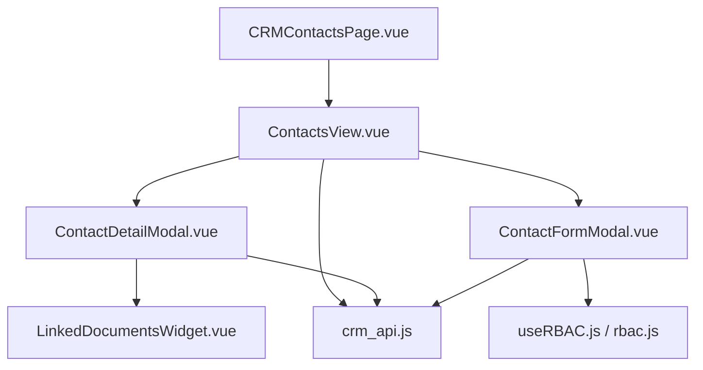
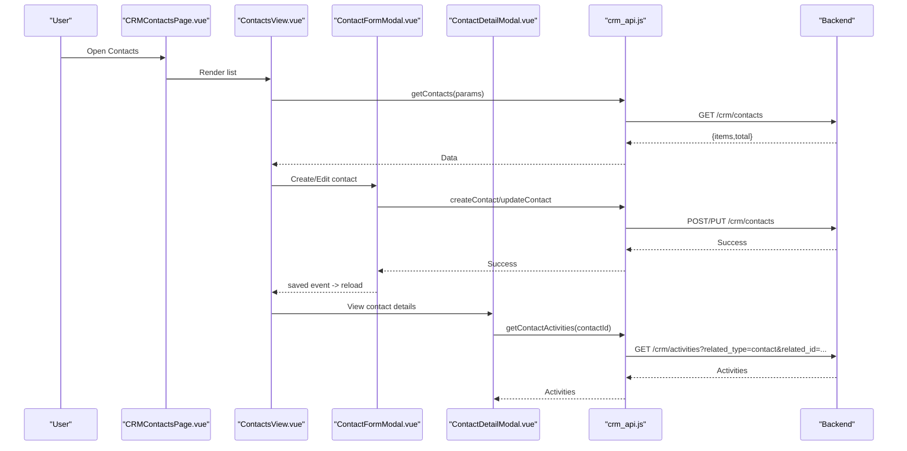
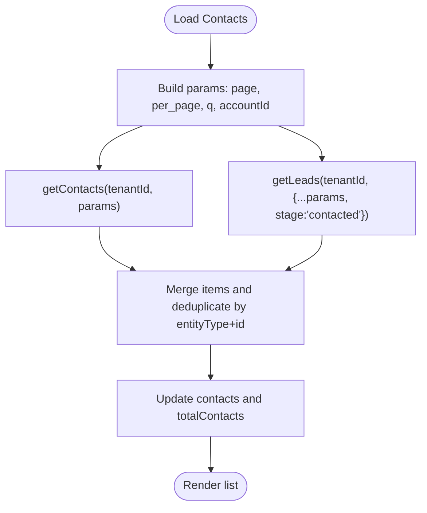
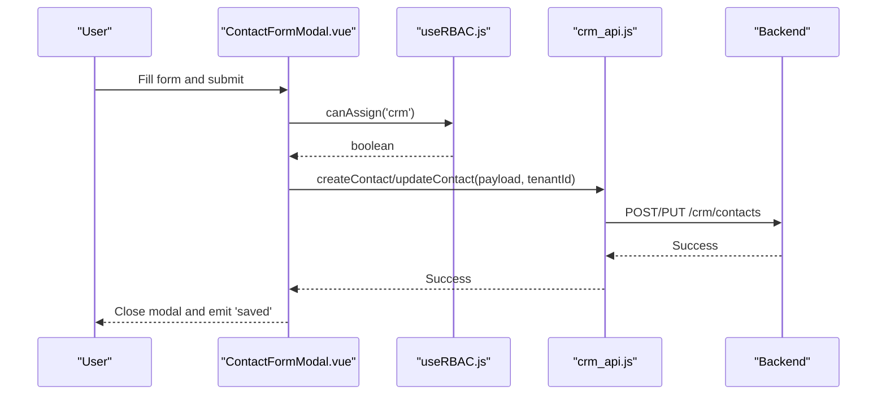
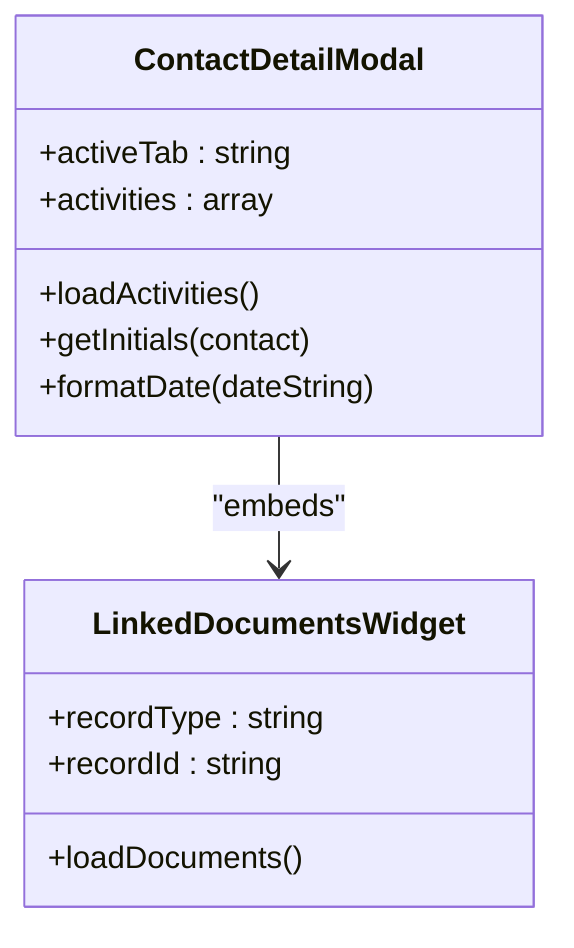
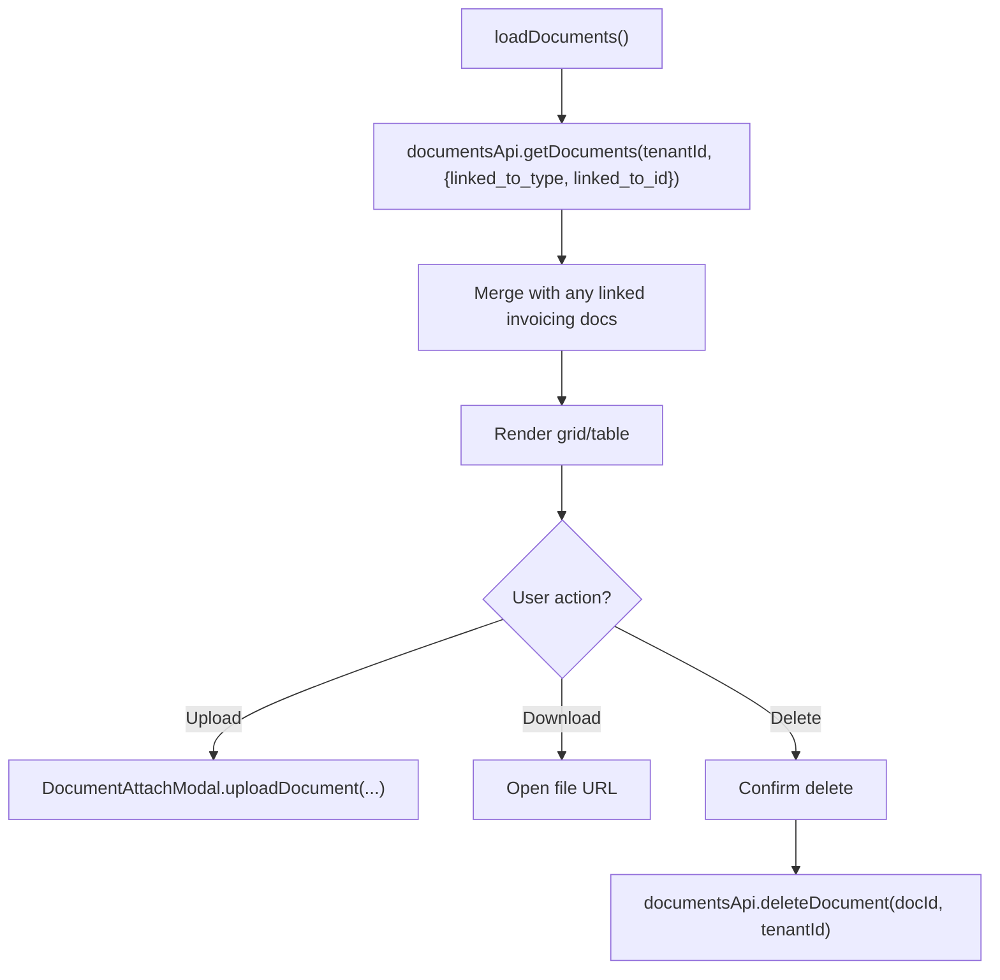
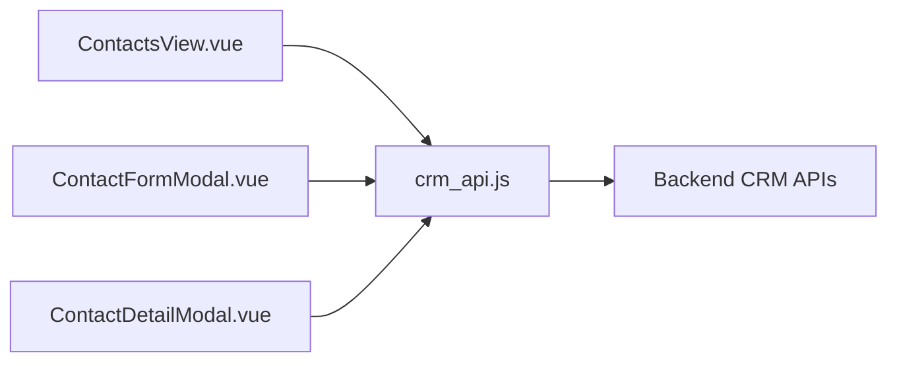
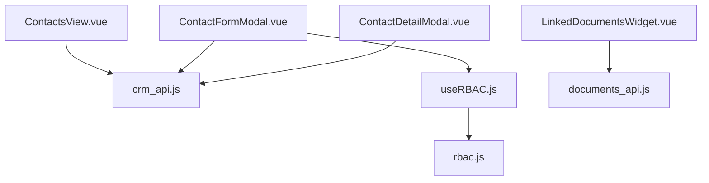

# Contact Management

<cite>
**Referenced Files in This Document**
- [CRMContactsPage.vue](file://src/views/Modules/crm/CRMContactsPage.vue)
- [ContactsView.vue](file://src/views/Modules/crm/components/ContactsView.vue)
- [ContactDetailModal.vue](file://src/views/Modules/crm/components/ContactDetailModal.vue)
- [ContactFormModal.vue](file://src/views/Modules/crm/components/ContactFormModal.vue)
- [LinkedDocumentsWidget.vue](file://src/views/Modules/crm/components/LinkedDocumentsWidget.vue)
- [crm_api.js](file://src/services/crm_api.js)
- [useRBAC.js](file://src/composables/useRBAC.js)
- [rbac.js](file://src/config/rbac.js)
</cite>

## Table of Contents
1. [Introduction](#introduction)
2. [Project Structure](#project-structure)
3. [Core Components](#core-components)
4. [Architecture Overview](#architecture-overview)
5. [Detailed Component Analysis](#detailed-component-analysis)
6. [Dependency Analysis](#dependency-analysis)
7. [Performance Considerations](#performance-considerations)
8. [Troubleshooting Guide](#troubleshooting-guide)
9. [Conclusion](#conclusion)
10. [Appendices](#appendices)

## Introduction
This document explains the contact management functionality implemented in the CRM module. It covers how contacts are created, edited, and organized within accounts; what fields are supported and validated; how relationships map to accounts and activities; how detail views present communication history, linked documents, and related entities; and how search, filtering, and bulk operations work. It also addresses permissions, visibility controls, data privacy considerations, and guidance for extending models with custom fields and integrating with external contact databases.

## Project Structure
The contact management feature is centered around a page-level view and several modal components that handle listing, creation/editing, detailed inspection, and document linkage. The service layer abstracts API calls for contacts, accounts, activities, and communications. RBAC configuration governs role-based access across modules including CRM.

**Diagram sources**
- [CRMContactsPage.vue:1-73](file://src/views/Modules/crm/CRMContactsPage.vue#L1-L73)
- [ContactsView.vue:1-506](file://src/views/Modules/crm/components/ContactsView.vue#L1-L506)
- [ContactDetailModal.vue:1-430](file://src/views/Modules/crm/components/ContactDetailModal.vue#L1-L430)
- [ContactFormModal.vue:1-543](file://src/views/Modules/crm/components/ContactFormModal.vue#L1-L543)
- [LinkedDocumentsWidget.vue:1-541](file://src/views/Modules/crm/components/LinkedDocumentsWidget.vue#L1-L541)
- [crm_api.js:1-801](file://src/services/crm_api.js#L1-L801)
- [useRBAC.js:1-783](file://src/composables/useRBAC.js#L1-L783)
- [rbac.js:1-753](file://src/config/rbac.js#L1-L753)

**Section sources**
- [CRMContactsPage.vue:1-73](file://src/views/Modules/crm/CRMContactsPage.vue#L1-L73)
- [ContactsView.vue:1-506](file://src/views/Modules/crm/components/ContactsView.vue#L1-L506)
- [ContactDetailModal.vue:1-430](file://src/views/Modules/crm/components/ContactDetailModal.vue#L1-L430)
- [ContactFormModal.vue:1-543](file://src/views/Modules/crm/components/ContactFormModal.vue#L1-L543)
- [LinkedDocumentsWidget.vue:1-541](file://src/views/Modules/crm/components/LinkedDocumentsWidget.vue#L1-L541)
- [crm_api.js:1-801](file://src/services/crm_api.js#L1-L801)
- [useRBAC.js:1-783](file://src/composables/useRBAC.js#L1-L783)
- [rbac.js:1-753](file://src/config/rbac.js#L1-L753)

## Core Components
- Contacts list and navigation: Provides grid/list views, search, account filter, pagination, and quick actions (call, WhatsApp, edit, delete).
- Contact form: Creates or updates contacts with validation and assignment logic.
- Contact detail: Shows overview, activities, related account, and linked documents.
- Linked documents: Uploads, previews, downloads, and deletes documents associated with a contact.
- Service layer: Encapsulates all backend interactions for contacts, accounts, activities, and communications.
- RBAC: Controls who can assign, edit, delete, or export CRM records.

**Section sources**
- [ContactsView.vue:1-506](file://src/views/Modules/crm/components/ContactsView.vue#L1-L506)
- [ContactFormModal.vue:1-543](file://src/views/Modules/crm/components/ContactFormModal.vue#L1-L543)
- [ContactDetailModal.vue:1-430](file://src/views/Modules/crm/components/ContactDetailModal.vue#L1-L430)
- [LinkedDocumentsWidget.vue:1-541](file://src/views/Modules/crm/components/LinkedDocumentsWidget.vue#L1-L541)
- [crm_api.js:1-801](file://src/services/crm_api.js#L1-L801)
- [useRBAC.js:1-783](file://src/composables/useRBAC.js#L1-L783)

## Architecture Overview
The UI follows a component-driven architecture with clear separation between presentation (Vue components), state handling (component refs and composable hooks), and data persistence (API service).

**Diagram sources**
- [ContactsView.vue:401-424](file://src/views/Modules/crm/components/ContactsView.vue#L401-L424)
- [ContactFormModal.vue:495-521](file://src/views/Modules/crm/components/ContactFormModal.vue#L495-L521)
- [ContactDetailModal.vue:344-359](file://src/views/Modules/crm/components/ContactDetailModal.vue#L344-L359)
- [crm_api.js:329-364](file://src/services/crm_api.js#L329-L364)

## Detailed Component Analysis

### Contacts List (ContactsView)
- Search and filters: Debounced text search and account filter; pagination with per-page control.
- Views: Grid and list modes with consistent contact cards/table rows.
- Actions: Call, WhatsApp, edit, delete; emits events for call/whatsapp to parent.
- Data loading: Combines contacts and contacted leads into a unified list with deduplication by entity type + id.

**Diagram sources**
- [ContactsView.vue:401-424](file://src/views/Modules/crm/components/ContactsView.vue#L401-L424)

**Section sources**
- [ContactsView.vue:65-100](file://src/views/Modules/crm/components/ContactsView.vue#L65-L100)
- [ContactsView.vue:122-268](file://src/views/Modules/crm/components/ContactsView.vue#L122-L268)
- [ContactsView.vue:270-293](file://src/views/Modules/crm/components/ContactsView.vue#L270-L293)
- [ContactsView.vue:401-424](file://src/views/Modules/crm/components/ContactsView.vue#L401-L424)
- [ContactsView.vue:449-464](file://src/views/Modules/crm/components/ContactsView.vue#L449-L464)

### Contact Creation and Editing (ContactFormModal)
- Fields: First name, last name, email, phone, mobile, birthday, job title, department, lead source, mailing address (street, city, state/province, postal code, country), social links (LinkedIn, Twitter, Facebook), description, assigned user.
- Validation: HTML5 required constraints on first name, last name, and email; optional fields for others.
- Assignment: Uses RBAC to determine if current user can assign; otherwise locks assignment to current user scope.
- Save flow: Calls create or update via crm_api; emits saved event to refresh list.

**Diagram sources**
- [ContactFormModal.vue:374-384](file://src/views/Modules/crm/components/ContactFormModal.vue#L374-L384)
- [ContactFormModal.vue:495-521](file://src/views/Modules/crm/components/ContactFormModal.vue#L495-L521)
- [crm_api.js:134-137](file://src/services/crm_api.js#L134-L137)
- [crm_api.js:341-349](file://src/services/crm_api.js#L341-L349)

**Section sources**
- [ContactFormModal.vue:24-360](file://src/views/Modules/crm/components/ContactFormModal.vue#L24-L360)
- [ContactFormModal.vue:389-442](file://src/views/Modules/crm/components/ContactFormModal.vue#L389-L442)
- [ContactFormModal.vue:495-521](file://src/views/Modules/crm/components/ContactFormModal.vue#L495-L521)

### Contact Detail View (ContactDetailModal)
- Tabs: Overview (identity, title, email, phone, address, description, metadata), Activities (timeline of actions), Related (parent account link), Documents (linked assets).
- Activities: Loads activities for the contact using the activities endpoint filtered by related_type and related_id.
- Account link: Navigates to the parent account when available.
- Documents: Integrates LinkedDocumentsWidget to show and manage files attached to the contact.

**Diagram sources**
- [ContactDetailModal.vue:318-323](file://src/views/Modules/crm/components/ContactDetailModal.vue#L318-L323)
- [ContactDetailModal.vue:344-359](file://src/views/Modules/crm/components/ContactDetailModal.vue#L344-L359)
- [LinkedDocumentsWidget.vue:200-214](file://src/views/Modules/crm/components/LinkedDocumentsWidget.vue#L200-L214)

**Section sources**
- [ContactDetailModal.vue:86-191](file://src/views/Modules/crm/components/ContactDetailModal.vue#L86-L191)
- [ContactDetailModal.vue:193-268](file://src/views/Modules/crm/components/ContactDetailModal.vue#L193-L268)
- [ContactDetailModal.vue:344-359](file://src/views/Modules/crm/components/ContactDetailModal.vue#L344-L359)

### Linked Documents Widget
- Capabilities: Upload via file picker or camera capture; view thumbnails or icons; download; unlink or delete (with confirmation); merge with invoicing-related documents where applicable.
- Filtering: Loads documents linked to the specific record type and ID; optionally merges results from other subsystems based on matching criteria.

**Diagram sources**
- [LinkedDocumentsWidget.vue:272-307](file://src/views/Modules/crm/components/LinkedDocumentsWidget.vue#L272-L307)
- [LinkedDocumentsWidget.vue:433-466](file://src/views/Modules/crm/components/LinkedDocumentsWidget.vue#L433-L466)

**Section sources**
- [LinkedDocumentsWidget.vue:1-180](file://src/views/Modules/crm/components/LinkedDocumentsWidget.vue#L1-L180)
- [LinkedDocumentsWidget.vue:272-307](file://src/views/Modules/crm/components/LinkedDocumentsWidget.vue#L272-L307)
- [LinkedDocumentsWidget.vue:389-407](file://src/views/Modules/crm/components/LinkedDocumentsWidget.vue#L389-L407)
- [LinkedDocumentsWidget.vue:433-466](file://src/views/Modules/crm/components/LinkedDocumentsWidget.vue#L433-L466)

### API Layer (crm_api.js)
- Contacts CRUD: getContacts, getContact, createContact, updateContact, deleteContact.
- Activities: getContactActivities uses related_type=contact and related_id query parameters.
- Communications: createCommunication logs activity for a contact when contactId is provided; includes WhatsApp helpers.
- Accounts: getAccounts used for filtering and linking.

**Diagram sources**
- [crm_api.js:329-364](file://src/services/crm_api.js#L329-L364)
- [crm_api.js:145-164](file://src/services/crm_api.js#L145-L164)
- [crm_api.js:370-375](file://src/services/crm_api.js#L370-L375)

**Section sources**
- [crm_api.js:329-364](file://src/services/crm_api.js#L329-L364)
- [crm_api.js:145-164](file://src/services/crm_api.js#L145-L164)
- [crm_api.js:370-375](file://src/services/crm_api.js#L370-L375)

## Dependency Analysis
- ContactsView depends on crm_api for data retrieval and emits events to parent page.
- ContactFormModal depends on useRBAC to enforce assignment rules and crm_api for persistence.
- ContactDetailModal depends on crm_api for activities and embeds LinkedDocumentsWidget for asset management.
- LinkedDocumentsWidget depends on documents_api and decodeJWT for tenant context.
- RBAC configuration defines default roles and permission sets for CRM and other modules.

**Diagram sources**
- [ContactsView.vue:341-352](file://src/views/Modules/crm/components/ContactsView.vue#L341-L352)
- [ContactFormModal.vue:367-384](file://src/views/Modules/crm/components/ContactFormModal.vue#L367-L384)
- [ContactDetailModal.vue:294-303](file://src/views/Modules/crm/components/ContactDetailModal.vue#L294-L303)
- [LinkedDocumentsWidget.vue:183-195](file://src/views/Modules/crm/components/LinkedDocumentsWidget.vue#L183-L195)
- [useRBAC.js:1-783](file://src/composables/useRBAC.js#L1-L783)
- [rbac.js:1-753](file://src/config/rbac.js#L1-L753)

**Section sources**
- [ContactsView.vue:341-352](file://src/views/Modules/crm/components/ContactsView.vue#L341-L352)
- [ContactFormModal.vue:367-384](file://src/views/Modules/crm/components/ContactFormModal.vue#L367-L384)
- [ContactDetailModal.vue:294-303](file://src/views/Modules/crm/components/ContactDetailModal.vue#L294-L303)
- [LinkedDocumentsWidget.vue:183-195](file://src/views/Modules/crm/components/LinkedDocumentsWidget.vue#L183-L195)
- [useRBAC.js:1-783](file://src/composables/useRBAC.js#L1-L783)
- [rbac.js:1-753](file://src/config/rbac.js#L1-L753)

## Performance Considerations
- Debounced search reduces repeated API calls during typing.
- Pagination limits data transferred per request; adjust per_page as needed.
- Combined loading of contacts and contacted leads minimizes round trips but should be monitored for large datasets.
- Activity loading is lazy per tab to avoid unnecessary requests until the Activities tab is opened.
- Document widget loads both uploaded and linked invoicing documents concurrently; ensure backend endpoints support efficient filtering.

[No sources needed since this section provides general guidance]

## Troubleshooting Guide
- Loading errors: Check network responses and error messages returned by _handleRes in the API service; verify token and tenant context.
- Missing activities: Ensure contact.id exists and activities endpoint supports related_type=contact; confirm backend indexing.
- Assignment locked: If assignment cannot be changed, verify RBAC permissions for CRM; users without assign permission will see locked assignment.
- Duplicate detection: For bulk imports, duplicate checks compare name, email, and phone; ensure these fields are populated to detect duplicates reliably.
- Document operations: Confirm tenant_id is included in requests; validate file URLs and permissions for downloads and deletions.

**Section sources**
- [crm_api.js:11-32](file://src/services/crm_api.js#L11-L32)
- [ContactDetailModal.vue:344-359](file://src/views/Modules/crm/components/ContactDetailModal.vue#L344-L359)
- [ContactFormModal.vue:500-503](file://src/views/Modules/crm/components/ContactFormModal.vue#L500-L503)
- [BulkUploadLeadsModal.vue:845-890](file://src/views/Modules/crm/components/BulkUploadLeadsModal.vue#L845-L890)
- [LinkedDocumentsWidget.vue:272-307](file://src/views/Modules/crm/components/LinkedDocumentsWidget.vue#L272-L307)

## Conclusion
The contact management system provides a robust set of features for creating, editing, viewing, and organizing contacts within accounts. It integrates communication tracking, activity timelines, and document linkage while enforcing role-based access controls. The modular design allows for future enhancements such as advanced duplicate detection, enrichment workflows, and deeper integrations with external systems.

[No sources needed since this section summarizes without analyzing specific files]

## Appendices

### Field Definitions and Validation Rules
- Identity: firstName (required), lastName (required), email (required, validated by browser), phone, mobile, birthday.
- Professional: title, department, accountId/accountName, leadSource.
- Address: mailingStreet, mailingCity, mailingState, mailingPostalCode, mailingCountry.
- Social: linkedin, twitter, facebook.
- Notes: description.
- Assignment: assignedTo (subject to RBAC).

Validation is primarily enforced through HTML5 attributes and RBAC checks for assignment. Backend validation may add additional constraints not visible in the frontend.

**Section sources**
- [ContactFormModal.vue:32-113](file://src/views/Modules/crm/components/ContactFormModal.vue#L32-L113)
- [ContactFormModal.vue:115-183](file://src/views/Modules/crm/components/ContactFormModal.vue#L115-L183)
- [ContactFormModal.vue:185-252](file://src/views/Modules/crm/components/ContactFormModal.vue#L185-L252)
- [ContactFormModal.vue:254-315](file://src/views/Modules/crm/components/ContactFormModal.vue#L254-L315)
- [ContactFormModal.vue:331-340](file://src/views/Modules/crm/components/ContactFormModal.vue#L331-L340)

### Relationship Mapping
- Contact to Account: Via accountId; detail view shows parent entity and provides navigation to account.
- Contact to Activities: Activities are fetched using related_type=contact and related_id.
- Contact to Documents: LinkedDocumentsWidget associates files with recordType='contact' and recordId.

**Section sources**
- [ContactDetailModal.vue:232-258](file://src/views/Modules/crm/components/ContactDetailModal.vue#L232-L258)
- [crm_api.js:359-364](file://src/services/crm_api.js#L359-L364)
- [LinkedDocumentsWidget.vue:200-214](file://src/views/Modules/crm/components/LinkedDocumentsWidget.vue#L200-L214)

### Search, Filtering, and Bulk Operations
- Search: Debounced text search across contacts and contacted leads.
- Filters: By account; pagination with configurable per_page.
- Bulk operations: While explicit bulk contact operations are not shown here, bulk import and duplicate detection exist for leads; similar patterns can be extended to contacts.

**Section sources**
- [ContactsView.vue:65-100](file://src/views/Modules/crm/components/ContactsView.vue#L65-L100)
- [ContactsView.vue:270-293](file://src/views/Modules/crm/components/ContactsView.vue#L270-L293)
- [BulkUploadLeadsModal.vue:845-890](file://src/views/Modules/crm/components/BulkUploadLeadsModal.vue#L845-L890)

### Permissions, Visibility Controls, and Data Privacy
- RBAC: Roles define permissions per entity; CRM has read/write/edit permissions in default roles.
- Assignment: Controlled by canAssign('crm'); non-assigned users see locked assignment.
- Privacy: Tenant isolation via tenant_id; JWT-based authorization headers; sensitive operations require valid tokens.

**Section sources**
- [rbac.js:119-145](file://src/config/rbac.js#L119-L145)
- [useRBAC.js:55-114](file://src/composables/useRBAC.js#L55-L114)
- [ContactFormModal.vue:374-384](file://src/views/Modules/crm/components/ContactFormModal.vue#L374-L384)
- [crm_api.js:3-9](file://src/services/crm_api.js#L3-L9)

### Extending Contact Models with Custom Fields
- Add new fields to the form template and bind them to the form object.
- Include new fields in save payload and ensure backend supports them.
- Update display logic in list and detail views to render new fields.
- Adjust validation rules accordingly.

[No sources needed since this section provides general guidance]

### Integrating with External Contact Databases
- Use the existing service pattern to add new endpoints for syncing or enriching contacts.
- Leverage activities to log enrichment events for auditability.
- Ensure tenant isolation and proper authorization for external calls.

[No sources needed since this section provides general guidance]