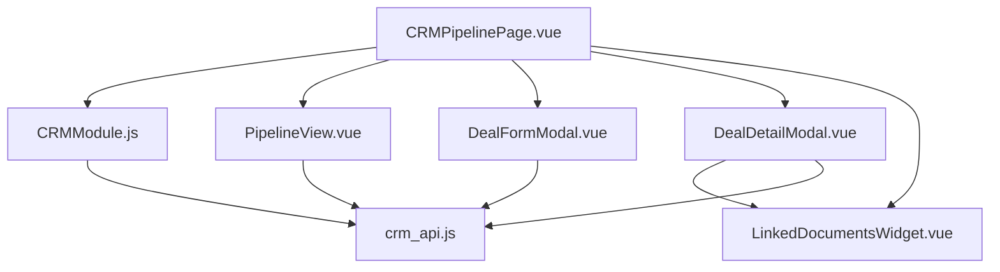
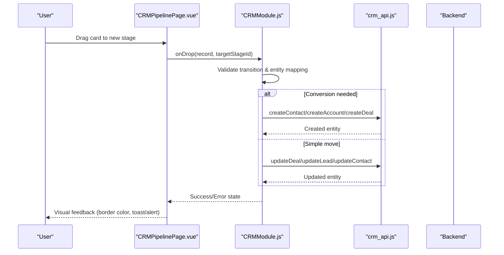
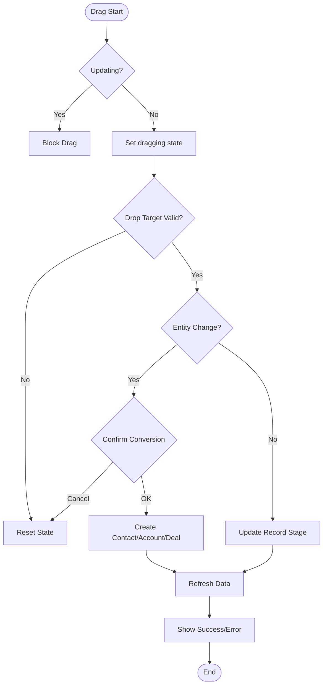
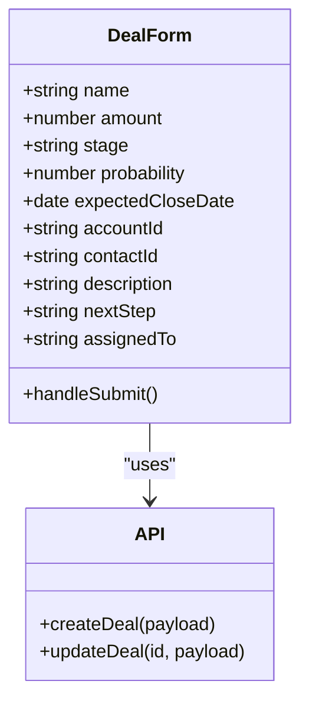
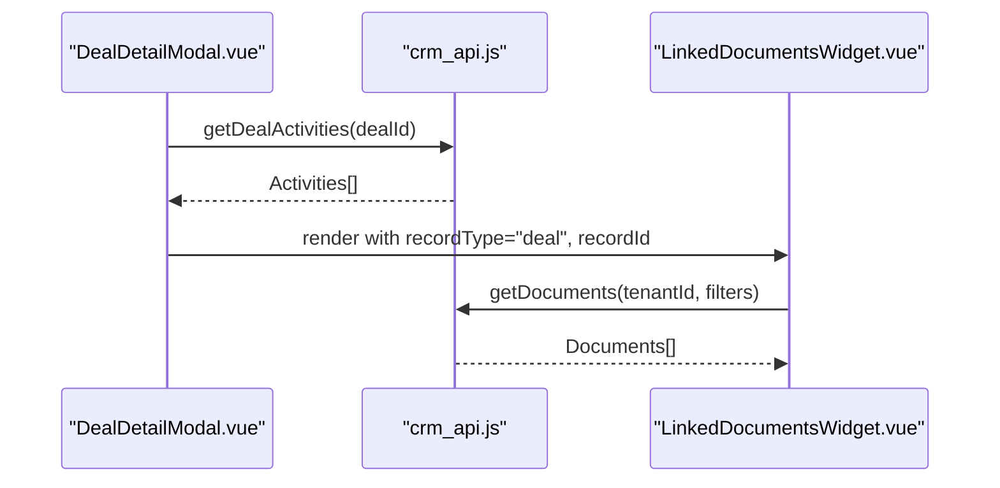
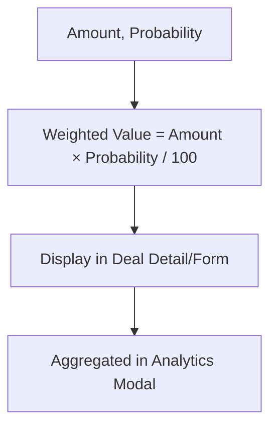
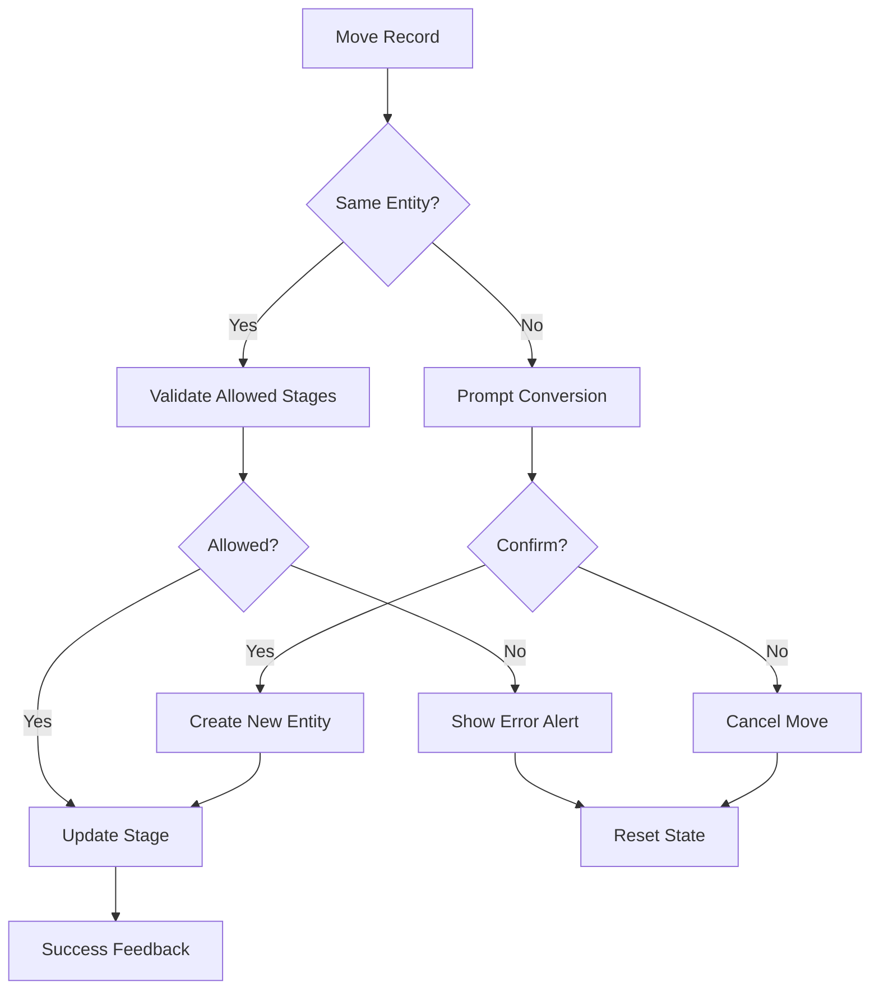
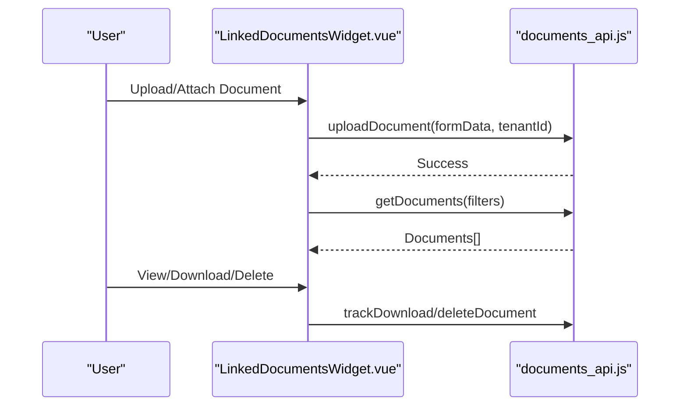
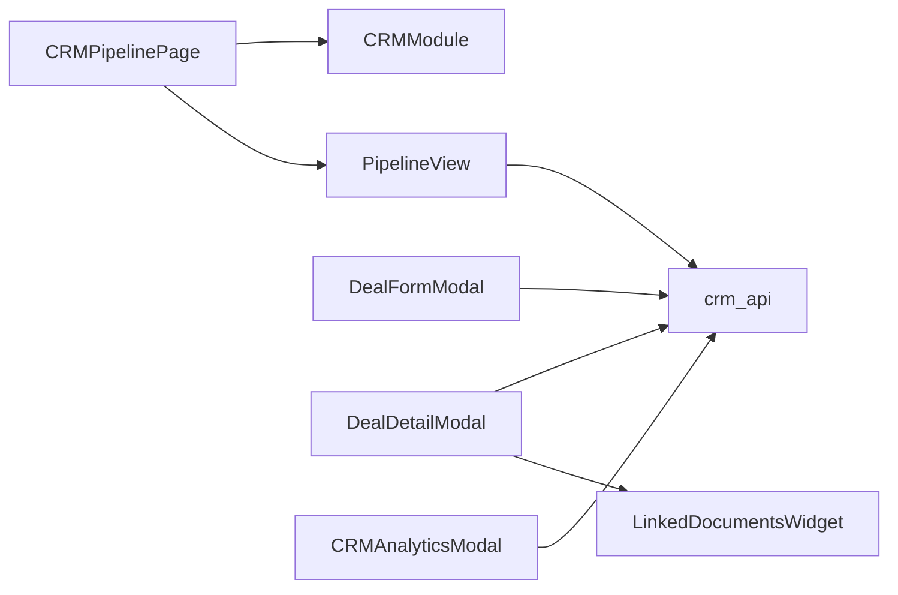

# Deal Pipeline Management

<cite>
**Referenced Files in This Document**
- [CRMPipelinePage.vue](file://src/views/Modules/crm/CRMPipelinePage.vue)
- [PipelineView.vue](file://src/views/Modules/crm/components/PipelineView.vue)
- [DealDetailModal.vue](file://src/views/Modules/crm/components/DealDetailModal.vue)
- [DealFormModal.vue](file://src/views/Modules/crm/components/DealFormModal.vue)
- [CRMDealsPage.vue](file://src/views/Modules/crm/CRMDealsPage.vue)
- [CRMModule.js](file://src/views/Modules/crm/composables/CRMModule.js)
- [crm_api.js](file://src/services/crm_api.js)
- [LinkedDocumentsWidget.vue](file://src/views/Modules/crm/components/LinkedDocumentsWidget.vue)
- [LeadDetailModal.vue](file://src/views/Modules/crm/components/LeadDetailModal.vue)
- [CRMAnalyticsModal.vue](file://src/views/Modules/crm/components/CRMAnalyticsModal.vue)
</cite>

## Table of Contents
1. [Introduction](#introduction)
2. [Project Structure](#project-structure)
3. [Core Components](#core-components)
4. [Architecture Overview](#architecture-overview)
5. [Detailed Component Analysis](#detailed-component-analysis)
6. [Dependency Analysis](#dependency-analysis)
7. [Performance Considerations](#performance-considerations)
8. [Troubleshooting Guide](#troubleshooting-guide)
9. [Conclusion](#conclusion)
10. [Appendices](#appendices)

## Introduction
This document explains the deal pipeline management and Kanban board functionality implemented in the CRM module. It covers deal creation, stage progression via drag-and-drop, visualization, forecasting with probability and weighted values, automation rules for conversions and transitions, collaboration features (activities, documents), permissions and ownership, customization of stages, templates, and integration points to external tools.

## Project Structure
The CRM pipeline is primarily implemented across a few key views and components:
- CRMPipelinePage.vue: Main pipeline view with Kanban board, search, filters, stage settings, and modals.
- PipelineView.vue: Reusable pipeline component with add-stage modal and KPIs.
- CRMModule.js: Composable that centralizes data fetching, drag-and-drop logic, conversion workflows, and alerts.
- crm_api.js: API client for leads, contacts, accounts, deals, activities, metadata, and analytics.
- DealFormModal.vue and DealDetailModal.vue: Create/edit deals and view details including activities and documents.
- LinkedDocumentsWidget.vue: Attach/view/download documents linked to deals.
- LeadDetailModal.vue: Lead profile with quick actions and conversion flows.
- CRMAnalyticsModal.vue: Analytics including weighted pipeline value and stage probabilities.

**Diagram sources**
- [CRMPipelinePage.vue:162-286](file://src/views/Modules/crm/CRMPipelinePage.vue#L162-L286)
- [CRMModule.js:1387-1665](file://src/views/Modules/crm/composables/CRMModule.js#L1387-L1665)
- [PipelineView.vue:215-356](file://src/views/Modules/crm/components/PipelineView.vue#L215-L356)
- [DealFormModal.vue:330-374](file://src/views/Modules/crm/components/DealFormModal.vue#L330-L374)
- [DealDetailModal.vue:247-357](file://src/views/Modules/crm/components/DealDetailModal.vue#L247-L357)
- [LinkedDocumentsWidget.vue:272-307](file://src/views/Modules/crm/components/LinkedDocumentsWidget.vue#L272-L307)
- [crm_api.js:418-461](file://src/services/crm_api.js#L418-L461)

**Section sources**
- [CRMPipelinePage.vue:1-338](file://src/views/Modules/crm/CRMPipelinePage.vue#L1-L338)
- [PipelineView.vue:1-441](file://src/views/Modules/crm/components/PipelineView.vue#L1-L441)
- [CRMModule.js:1387-1665](file://src/views/Modules/crm/composables/CRMModule.js#L1387-L1665)
- [crm_api.js:418-461](file://src/services/crm_api.js#L418-L461)

## Core Components
- Pipeline Board: Horizontal Kanban with columns per stage; supports drag-and-drop, mobile list view, search, assigned user filter, branch filter, and stage visibility toggles.
- Stage Customization: Add custom stages, rename inline, reorder, toggle auto-convert to account on specific stages, delete custom stages.
- Deal Creation and Editing: Dedicated form with amount, stage, probability, expected close date, associated account/contact, assignment, description, next steps, and weighted value preview.
- Deal Detail: Overview, activities tab, related entities placeholder, documents tab integrated with LinkedDocumentsWidget.
- Activities and Documents: Activity timeline per deal; attach/view/download/delete documents; camera capture support.
- Forecasting: Weighted value computed as amount × probability / 100; analytics modal shows pipeline value, weighted pipeline value, won/lost counts, and stage breakdown.

**Section sources**
- [CRMPipelinePage.vue:94-160](file://src/views/Modules/crm/CRMPipelinePage.vue#L94-L160)
- [CRMPipelinePage.vue:176-286](file://src/views/Modules/crm/CRMPipelinePage.vue#L176-L286)
- [PipelineView.vue:105-156](file://src/views/Modules/crm/components/PipelineView.vue#L105-L156)
- [DealFormModal.vue:31-168](file://src/views/Modules/crm/components/DealFormModal.vue#L31-L168)
- [DealDetailModal.vue:63-212](file://src/views/Modules/crm/components/DealDetailModal.vue#L63-L212)
- [CRMAnalyticsModal.vue:153-168](file://src/views/Modules/crm/components/CRMAnalyticsModal.vue#L153-L168)

## Architecture Overview
The pipeline UI orchestrates state and interactions through a composable that encapsulates data loading, drag-and-drop handling, conversion logic, and error states. The API layer provides CRUD operations for leads, contacts, accounts, deals, activities, and metadata.

**Diagram sources**
- [CRMPipelinePage.vue:176-286](file://src/views/Modules/crm/CRMPipelinePage.vue#L176-L286)
- [CRMModule.js:1387-1665](file://src/views/Modules/crm/composables/CRMModule.js#L1387-L1665)
- [crm_api.js:418-461](file://src/services/crm_api.js#L418-L461)

## Detailed Component Analysis

### Pipeline Board and Drag-and-Drop
- Columns represent pipeline stages; each column displays records filtered by stage and entity type.
- Drag-and-drop triggers validation:
  - Prevents invalid transitions between entities unless conversion is intended.
  - Supports touch events for mobile.
  - Shows visual states: dragging, updating, success, error.
- Conversion flows:
  - Leads → Contacts or Accounts when crossing entity boundaries.
  - Accounts/Contacts → Deals when dropped into deal stages.
  - Reverse conversion supported for undo scenarios.

**Diagram sources**
- [CRMModule.js:1387-1665](file://src/views/Modules/crm/composables/CRMModule.js#L1387-L1665)
- [CRMPipelinePage.vue:176-286](file://src/views/Modules/crm/CRMPipelinePage.vue#L176-L286)

**Section sources**
- [CRMModule.js:1387-1665](file://src/views/Modules/crm/composables/CRMModule.js#L1387-L1665)
- [CRMPipelinePage.vue:176-286](file://src/views/Modules/crm/CRMPipelinePage.vue#L176-L286)

### Deal Creation and Editing
- Fields include name, amount, stage, probability, expected close date, associated account/contact, assignment, description, next steps.
- Weighted value preview updates live based on amount and probability.
- Assignment respects RBAC; if not allowed, defaults to current user.
- Saves via API endpoints for creating or updating deals.

**Diagram sources**
- [DealFormModal.vue:31-168](file://src/views/Modules/crm/components/DealFormModal.vue#L31-L168)
- [crm_api.js:430-446](file://src/services/crm_api.js#L430-L446)

**Section sources**
- [DealFormModal.vue:31-168](file://src/views/Modules/crm/components/DealFormModal.vue#L31-L168)
- [DealFormModal.vue:330-374](file://src/views/Modules/crm/components/DealFormModal.vue#L330-L374)
- [crm_api.js:430-446](file://src/services/crm_api.js#L430-L446)

### Deal Detail and Activities
- Overview tab shows core information, associated account/contact, description, next steps, and metadata.
- Activities tab loads activity history for the deal via API.
- Documents tab integrates LinkedDocumentsWidget for attachments.

**Diagram sources**
- [DealDetailModal.vue:247-357](file://src/views/Modules/crm/components/DealDetailModal.vue#L247-L357)
- [crm_api.js:456-461](file://src/services/crm_api.js#L456-L461)
- [LinkedDocumentsWidget.vue:272-307](file://src/views/Modules/crm/components/LinkedDocumentsWidget.vue#L272-L307)

**Section sources**
- [DealDetailModal.vue:63-212](file://src/views/Modules/crm/components/DealDetailModal.vue#L63-L212)
- [DealDetailModal.vue:247-357](file://src/views/Modules/crm/components/DealDetailModal.vue#L247-L357)
- [LinkedDocumentsWidget.vue:272-307](file://src/views/Modules/crm/components/LinkedDocumentsWidget.vue#L272-L307)

### Forecasting, Probability, and Revenue Projections
- Weighted value displayed in deal detail and form: amount × probability / 100.
- Analytics modal aggregates pipeline value and weighted pipeline value, plus won/lost counts.
- Stage probabilities are mapped for default stages; custom stages receive progressive probabilities based on order.

**Diagram sources**
- [DealDetailModal.vue:23-35](file://src/views/Modules/crm/components/DealDetailModal.vue#L23-L35)
- [DealFormModal.vue:138-153](file://src/views/Modules/crm/components/DealFormModal.vue#L138-L153)
- [CRMAnalyticsModal.vue:153-168](file://src/views/Modules/crm/components/CRMAnalyticsModal.vue#L153-L168)
- [CRMAnalyticsModal.vue:1006-1017](file://src/views/Modules/crm/components/CRMAnalyticsModal.vue#L1006-L1017)

**Section sources**
- [DealDetailModal.vue:23-35](file://src/views/Modules/crm/components/DealDetailModal.vue#L23-L35)
- [DealFormModal.vue:138-153](file://src/views/Modules/crm/components/DealFormModal.vue#L138-L153)
- [CRMAnalyticsModal.vue:153-168](file://src/views/Modules/crm/components/CRMAnalyticsModal.vue#L153-L168)
- [CRMAnalyticsModal.vue:1006-1017](file://src/views/Modules/crm/components/CRMAnalyticsModal.vue#L1006-L1017)

### Automation Rules and Stage Transitions
- Auto-convert to account when dropping leads into configured stages.
- Conversion from accounts/contacts to deals when dropped into deal stages.
- Validation prevents invalid cross-entity moves without conversion.
- Alerts inform users about invalid moves and conversion prompts.

**Diagram sources**
- [CRMModule.js:1498-1665](file://src/views/Modules/crm/composables/CRMModule.js#L1498-L1665)
- [CRMPipelinePage.vue:215-221](file://src/views/Modules/crm/CRMPipelinePage.vue#L215-L221)

**Section sources**
- [CRMModule.js:1498-1665](file://src/views/Modules/crm/composables/CRMModule.js#L1498-L1665)
- [CRMPipelinePage.vue:215-221](file://src/views/Modules/crm/CRMPipelinePage.vue#L215-L221)

### Collaboration, Activity Tracking, and Document Attachments
- Activities tab lists all recorded activities for a deal with timestamps and icons.
- Documents widget supports grid/table views, camera capture, upload, download, unlink, and delete.
- Integration with invoicing documents where applicable.

**Diagram sources**
- [LinkedDocumentsWidget.vue:247-269](file://src/views/Modules/crm/components/LinkedDocumentsWidget.vue#L247-L269)
- [LinkedDocumentsWidget.vue:389-407](file://src/views/Modules/crm/components/LinkedDocumentsWidget.vue#L389-L407)
- [DealDetailModal.vue:205-212](file://src/views/Modules/crm/components/DealDetailModal.vue#L205-L212)

**Section sources**
- [DealDetailModal.vue:167-212](file://src/views/Modules/crm/components/DealDetailModal.vue#L167-L212)
- [LinkedDocumentsWidget.vue:247-269](file://src/views/Modules/crm/components/LinkedDocumentsWidget.vue#L247-L269)
- [LinkedDocumentsWidget.vue:389-407](file://src/views/Modules/crm/components/LinkedDocumentsWidget.vue#L389-L407)

### Permissions, Team Assignments, and Ownership Transfer
- Assignment fields respect RBAC; if not permitted, assignment is locked to current user scope.
- Ownership transfer can be managed via deal edit forms and backend updates (handled by API).
- Branch filtering and user email display provide context for team-level views.

**Section sources**
- [DealFormModal.vue:100-115](file://src/views/Modules/crm/components/DealFormModal.vue#L100-L115)
- [CRMDealsPage.vue:22-33](file://src/views/Modules/crm/CRMDealsPage.vue#L22-L33)
- [crm_api.js:430-446](file://src/services/crm_api.js#L430-L446)

### Customizing Pipeline Stages and Templates
- Add custom stages with entity type restriction and position control.
- Inline rename of stage names; reorder left/right; delete custom stages.
- Toggle visibility of stages in settings panel.
- Templates: While no explicit template UI is shown here, the form structure supports consistent field sets for creating deals; templates could be implemented by pre-filling forms with saved configurations.

**Section sources**
- [PipelineView.vue:3-79](file://src/views/Modules/crm/components/PipelineView.vue#L3-L79)
- [CRMPipelinePage.vue:97-122](file://src/views/Modules/crm/CRMPipelinePage.vue#L97-L122)
- [CRMPipelinePage.vue:186-221](file://src/views/Modules/crm/CRMPipelinePage.vue#L186-L221)

### Integrating with External Sales Tools
- WhatsApp integration helpers open chat links and log communications.
- Email and call actions available from lead profiles and pipeline cards.
- Invoicing documents can be linked and viewed within the CRM context.

**Section sources**
- [crm_api.js:166-190](file://src/services/crm_api.js#L166-L190)
- [LeadDetailModal.vue:48-78](file://src/views/Modules/crm/components/LeadDetailModal.vue#L48-L78)
- [LinkedDocumentsWidget.vue:309-371](file://src/views/Modules/crm/components/LinkedDocumentsWidget.vue#L309-L371)

## Dependency Analysis
- CRMPipelinePage depends on CRMModule for data and drag-and-drop logic, and renders PipelineView for reusable UI.
- DealFormModal and DealDetailModal depend on crm_api for persistence and retrieval.
- LinkedDocumentsWidget depends on documents_api for file operations and merges invoicing documents.
- CRMAnalyticsModal computes metrics using pipeline stages and stats.

**Diagram sources**
- [CRMPipelinePage.vue:162-286](file://src/views/Modules/crm/CRMPipelinePage.vue#L162-L286)
- [CRMModule.js:1387-1665](file://src/views/Modules/crm/composables/CRMModule.js#L1387-L1665)
- [DealFormModal.vue:330-374](file://src/views/Modules/crm/components/DealFormModal.vue#L330-L374)
- [DealDetailModal.vue:247-357](file://src/views/Modules/crm/components/DealDetailModal.vue#L247-L357)
- [LinkedDocumentsWidget.vue:272-307](file://src/views/Modules/crm/components/LinkedDocumentsWidget.vue#L272-L307)
- [crm_api.js:418-461](file://src/services/crm_api.js#L418-L461)

**Section sources**
- [CRMPipelinePage.vue:162-286](file://src/views/Modules/crm/CRMPipelinePage.vue#L162-L286)
- [CRMModule.js:1387-1665](file://src/views/Modules/crm/composables/CRMModule.js#L1387-L1665)
- [crm_api.js:418-461](file://src/services/crm_api.js#L418-L461)

## Performance Considerations
- Use virtualized lists for large pipelines if needed to improve rendering performance.
- Debounce search and filters to reduce re-renders.
- Batch API calls where possible (e.g., fetching accounts and contacts together).
- Avoid unnecessary re-computation of analytics by caching results until data changes.

[No sources needed since this section provides general guidance]

## Troubleshooting Guide
- Invalid stage transitions: Ensure entity types match or use conversion flows; check alerts for guidance.
- Drag-and-drop stuck in updating state: Verify network requests and API responses; reset state after errors.
- Missing documents: Confirm tenant ID and linked_to_type/linked_to_id filters; check API responses for items.
- Permission issues: Verify RBAC configuration; assignment may be locked to current user scope.

**Section sources**
- [CRMModule.js:1498-1555](file://src/views/Modules/crm/composables/CRMModule.js#L1498-L1555)
- [LinkedDocumentsWidget.vue:272-307](file://src/views/Modules/crm/components/LinkedDocumentsWidget.vue#L272-L307)
- [DealFormModal.vue:100-115](file://src/views/Modules/crm/components/DealFormModal.vue#L100-L115)

## Conclusion
The CRM module provides a robust deal pipeline with Kanban-style visualization, flexible stage customization, and comprehensive deal management features. Drag-and-drop interactions are validated and support conversions across entities. Forecasting leverages probability and weighted values, while collaboration is enabled through activities and document attachments. Permissions and assignments ensure secure and scoped operations. The architecture cleanly separates UI, composable logic, and API concerns, enabling extensibility for templates and integrations.

[No sources needed since this section summarizes without analyzing specific files]

## Appendices
- Example workflows:
  - Create a deal: Open DealFormModal, fill required fields, save via API.
  - Move a deal: Drag card to target stage; confirm conversion if needed; observe success feedback.
  - Attach documents: Use LinkedDocumentsWidget to upload or link files; view/download as needed.
  - Forecast revenue: Review weighted values in deal detail and analytics modal.

[No sources needed since this section provides general guidance]