# Document Management

<cite>
**Referenced Files in This Document**
- [documents_api.js](file://src/services/documents_api.js)
- [api.js](file://src/services/api.js)
- [DocumentsView.vue](file://src/views/Modules/crm/components/DocumentsView.vue)
- [DocumentUploadModal.vue](file://src/views/Modules/crm/components/DocumentUploadModal.vue)
- [DocumentDetailModal.vue](file://src/views/Modules/crm/components/DocumentDetailModal.vue)
- [DocumentShareModal.vue](file://src/views/Modules/crm/components/DocumentShareModal.vue)
- [DocumentEditModal.vue](file://src/views/Modules/crm/components/DocumentEditModal.vue)
- [LinkedDocumentsWidget.vue](file://src/views/Modules/crm/components/LinkedDocumentsWidget.vue)
- [DocumentAttachModal.vue](file://src/views/Modules/crm/components/DocumentAttachModal.vue)
- [DocumentQuickViewModal.vue](file://src/views/Modules/crm/components/DocumentQuickViewModal.vue)
</cite>

## Table of Contents
1. Introduction
2. Project Structure
3. Core Components
4. Architecture Overview
5. Detailed Component Analysis
6. Dependency Analysis
7. Performance Considerations
8. Troubleshooting Guide
9. Conclusion
10. Appendices

## Introduction
This document explains the CRM document management system implemented in the frontend codebase. It covers how documents are uploaded, stored, organized, and linked to CRM entities (leads, contacts, accounts, deals). It also details preview capabilities, versioning endpoints, sharing mechanisms, search/tagging/categorization, security and access controls, and guidance for integrating with external systems or custom workflows.

## Project Structure
The document management feature is centered around a set of Vue components under the CRM module and a dedicated API service layer:
- Service layer: HTTP client and endpoints for listing, uploading, updating, deleting, sharing, tracking downloads, and managing versions/folders/stats.
- UI layer: A main Documents view with filters, grid/list views, pagination, and modals for upload, detail, edit, share, quick view, and linking existing documents to CRM records.
- Integration: The LinkedDocumentsWidget aggregates both directly uploaded documents and references from an invoicing subsystem, enabling unified access within CRM entity pages.

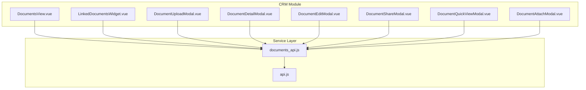

**Diagram sources**
- [DocumentsView.vue:416-722](file://src/views/Modules/crm/components/DocumentsView.vue#L416-L722)
- [LinkedDocumentsWidget.vue:183-518](file://src/views/Modules/crm/components/LinkedDocumentsWidget.vue#L183-L518)
- [DocumentUploadModal.vue:189-343](file://src/views/Modules/crm/components/DocumentUploadModal.vue#L189-L343)
- [DocumentDetailModal.vue:169-272](file://src/views/Modules/crm/components/DocumentDetailModal.vue#L169-L272)
- [DocumentEditModal.vue:73-121](file://src/views/Modules/crm/components/DocumentEditModal.vue#L73-L121)
- [DocumentShareModal.vue:91-173](file://src/views/Modules/crm/components/DocumentShareModal.vue#L91-L173)
- [DocumentQuickViewModal.vue:91-160](file://src/views/Modules/crm/components/DocumentQuickViewModal.vue#L91-L160)
- [DocumentAttachModal.vue:233-430](file://src/views/Modules/crm/components/DocumentAttachModal.vue#L233-L430)
- [documents_api.js:1-182](file://src/services/documents_api.js#L1-L182)
- [api.js:1-209](file://src/services/api.js#L1-L209)

**Section sources**
- [DocumentsView.vue:1-769](file://src/views/Modules/crm/components/DocumentsView.vue#L1-L769)
- [documents_api.js:1-182](file://src/services/documents_api.js#L1-L182)
- [api.js:1-209](file://src/services/api.js#L1-L209)

## Core Components
- DocumentsView: Central hub for browsing, filtering, searching, paginating, and performing actions on documents. Supports grid/list modes, category/folder/link-to-entity filters, and quick filters for leads, contacts, accounts, and deals.
- DocumentUploadModal: Uploads files with metadata (name, category, folder, description, tags), and optional linkage to CRM entities.
- DocumentDetailModal: Displays file preview (images, PDFs, text), metadata, and download/open-in-new-tab actions.
- DocumentShareModal: Toggles public link access and provides a copyable direct link.
- DocumentEditModal: Updates document metadata (name, category, description).
- LinkedDocumentsWidget: Embeds within CRM entity pages to show attached documents and integrates with an invoicing subsystem to display related invoices/quotes/proposals/contracts.
- DocumentAttachModal: Provides two modes—upload new or link existing—to attach documents to a specific CRM record.
- DocumentQuickViewModal: Lightweight preview with download and open-in-new-tab actions.

Key capabilities exposed by the service layer:
- List documents with filters (search, folder, category, linked_to_type).
- Upload documents via multipart form data.
- Update metadata and unlink links.
- Delete documents.
- Share documents with public link toggling.
- Track downloads.
- Create and list versions.
- Retrieve folders and stats.
- Handle invoice/quote references and PDF downloads.

**Section sources**
- [DocumentsView.vue:416-722](file://src/views/Modules/crm/components/DocumentsView.vue#L416-L722)
- [DocumentUploadModal.vue:189-343](file://src/views/Modules/crm/components/DocumentUploadModal.vue#L189-L343)
- [DocumentDetailModal.vue:169-272](file://src/views/Modules/crm/components/DocumentDetailModal.vue#L169-L272)
- [DocumentShareModal.vue:91-173](file://src/views/Modules/crm/components/DocumentShareModal.vue#L91-L173)
- [DocumentEditModal.vue:73-121](file://src/views/Modules/crm/components/DocumentEditModal.vue#L73-L121)
- [LinkedDocumentsWidget.vue:183-518](file://src/views/Modules/crm/components/LinkedDocumentsWidget.vue#L183-L518)
- [DocumentAttachModal.vue:233-430](file://src/views/Modules/crm/components/DocumentAttachModal.vue#L233-L430)
- [DocumentQuickViewModal.vue:91-160](file://src/views/Modules/crm/components/DocumentQuickViewModal.vue#L91-L160)
- [documents_api.js:22-182](file://src/services/documents_api.js#L22-L182)

## Architecture Overview
The system uses a layered architecture:
- UI components manage user interactions and local state.
- The documents_api service encapsulates HTTP calls using axios with base URL configuration and auth token injection.
- The api service centralizes authentication handling, token refresh, and base URL resolution.

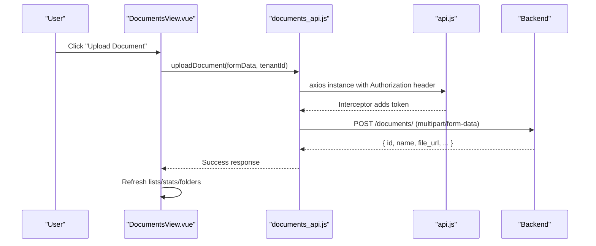

**Diagram sources**
- [DocumentsView.vue:474-497](file://src/views/Modules/crm/components/DocumentsView.vue#L474-L497)
- [DocumentUploadModal.vue:246-297](file://src/views/Modules/crm/components/DocumentUploadModal.vue#L246-L297)
- [documents_api.js:45-59](file://src/services/documents_api.js#L45-L59)
- [api.js:64-76](file://src/services/api.js#L64-L76)

**Section sources**
- [documents_api.js:1-182](file://src/services/documents_api.js#L1-L182)
- [api.js:1-209](file://src/services/api.js#L1-L209)

## Detailed Component Analysis

### Upload Workflow
- User selects a file and fills metadata (name, category, optional folder/description/tags).
- For CRM-linked uploads, the modal can pre-populate linked_to_type and linked_to_id from context.
- The upload sends multipart/form-data to the backend; progress is tracked visually.
- On success, the parent view refreshes lists, stats, and folders.

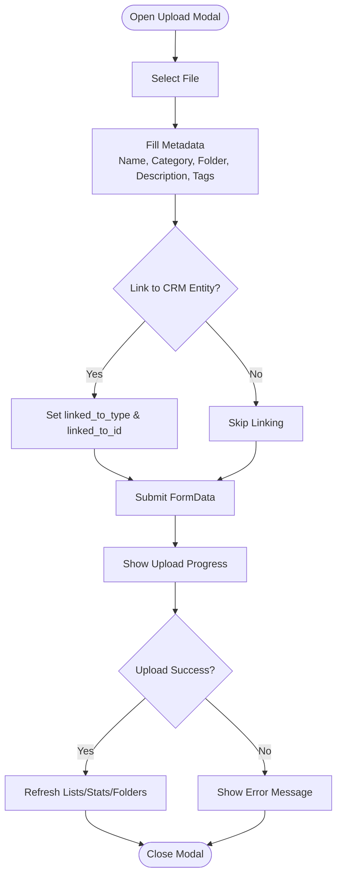

**Diagram sources**
- [DocumentUploadModal.vue:22-186](file://src/views/Modules/crm/components/DocumentUploadModal.vue#L22-L186)
- [DocumentUploadModal.vue:246-297](file://src/views/Modules/crm/components/DocumentUploadModal.vue#L246-L297)
- [documents_api.js:45-59](file://src/services/documents_api.js#L45-L59)

**Section sources**
- [DocumentUploadModal.vue:189-343](file://src/views/Modules/crm/components/DocumentUploadModal.vue#L189-L343)
- [documents_api.js:45-59](file://src/services/documents_api.js#L45-L59)

### Document Preview Capabilities
- Images render inline.
- PDFs render via iframe.
- Text-based files (txt, csv, json, log, md, xml, html) render via iframe.
- Other formats show a placeholder with a download action.
- Invoice/quote references indicate opening via the invoicing module.

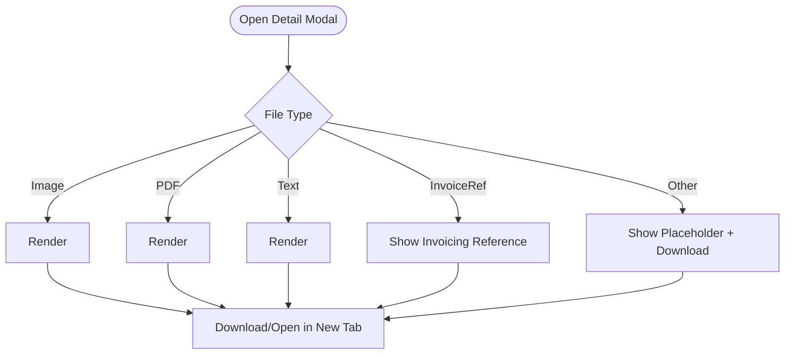

**Diagram sources**
- [DocumentDetailModal.vue:47-104](file://src/views/Modules/crm/components/DocumentDetailModal.vue#L47-L104)
- [DocumentDetailModal.vue:189-212](file://src/views/Modules/crm/components/DocumentDetailModal.vue#L189-L212)

**Section sources**
- [DocumentDetailModal.vue:169-272](file://src/views/Modules/crm/components/DocumentDetailModal.vue#L169-L272)

### Version Control
- The service exposes endpoints to create a new version and list all versions for a document.
- While no dedicated UI is present in the analyzed files, these endpoints enable versioning workflows on the backend.

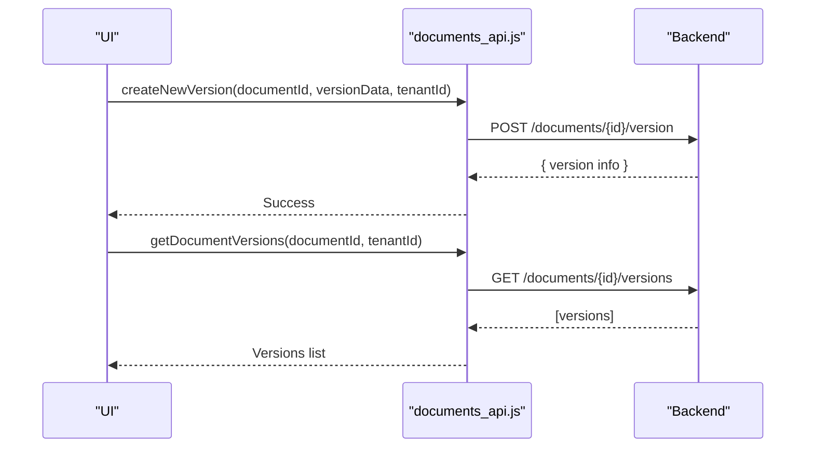

**Diagram sources**
- [documents_api.js:101-119](file://src/services/documents_api.js#L101-L119)

**Section sources**
- [documents_api.js:101-119](file://src/services/documents_api.js#L101-L119)

### Collaborative Editing
- No collaborative editing UI or real-time editing features were found in the analyzed files.
- The system supports creating new versions and editing metadata, which can be extended to support collaborative workflows on the backend.

[No sources needed since this section summarizes absence of features]

### Sharing Mechanisms and Permission-Based Access
- Public link toggle: Users can enable/disable public access per document. When enabled, a direct link is generated and can be copied.
- Authentication: All requests include an Authorization Bearer token injected by the axios interceptor.
- Tenant isolation: Most endpoints accept a tenant_id parameter to scope access.

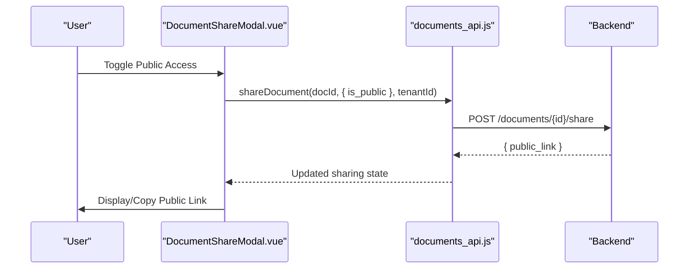

**Diagram sources**
- [DocumentShareModal.vue:127-145](file://src/views/Modules/crm/components/DocumentShareModal.vue#L127-L145)
- [documents_api.js:81-89](file://src/services/documents_api.js#L81-L89)
- [api.js:64-76](file://src/services/api.js#L64-L76)

**Section sources**
- [DocumentShareModal.vue:91-173](file://src/views/Modules/crm/components/DocumentShareModal.vue#L91-L173)
- [documents_api.js:81-89](file://src/services/documents_api.js#L81-L89)
- [api.js:64-76](file://src/services/api.js#L64-L76)

### Automatic Linking to CRM Entities
- During upload, users can select a CRM entity type (lead, contact, account, deal, campaign) and provide the record ID.
- The LinkedDocumentsWidget fetches documents linked to a specific CRM record and merges them with relevant invoicing documents for a unified view.
- The Attach modal supports linking existing unlinked documents to a CRM record.

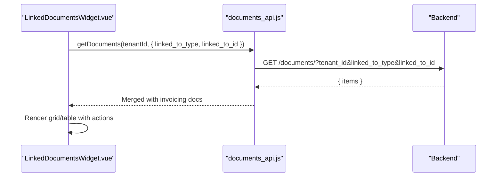

**Diagram sources**
- [LinkedDocumentsWidget.vue:272-307](file://src/views/Modules/crm/components/LinkedDocumentsWidget.vue#L272-L307)
- [documents_api.js:22-33](file://src/services/documents_api.js#L22-L33)

**Section sources**
- [LinkedDocumentsWidget.vue:183-518](file://src/views/Modules/crm/components/LinkedDocumentsWidget.vue#L183-L518)
- [DocumentAttachModal.vue:345-401](file://src/views/Modules/crm/components/DocumentAttachModal.vue#L345-L401)

### Search, Tagging, and Categorization
- Search: Debounced search input triggers filtered document retrieval.
- Filters: Folder, category, and quick filters for linked-to types.
- Tags: Uploaded documents can have comma-separated tags parsed and sent to the backend.
- Categories: Standardized categories like contract, invoice, proposal, quotation, presentation, other/report/agreement/id_document/other.

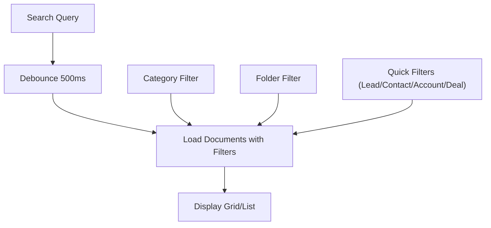

**Diagram sources**
- [DocumentsView.vue:85-157](file://src/views/Modules/crm/components/DocumentsView.vue#L85-L157)
- [DocumentsView.vue:521-534](file://src/views/Modules/crm/components/DocumentsView.vue#L521-L534)
- [DocumentUploadModal.vue:153-163](file://src/views/Modules/crm/components/DocumentUploadModal.vue#L153-L163)

**Section sources**
- [DocumentsView.vue:85-157](file://src/views/Modules/crm/components/DocumentsView.vue#L85-L157)
- [DocumentsView.vue:521-534](file://src/views/Modules/crm/components/DocumentsView.vue#L521-L534)
- [DocumentUploadModal.vue:153-163](file://src/views/Modules/crm/components/DocumentUploadModal.vue#L153-L163)

### Security, Encryption, and Compliance
- Authentication: Requests include Authorization Bearer tokens via axios interceptors; token refresh is handled automatically on 401 responses.
- Tenant scoping: Most endpoints pass tenant_id to isolate data across tenants.
- Public sharing: Controlled per document via a toggle; generates a direct link when enabled.
- Compliance: The codebase includes compliance-related settings elsewhere, but document-specific encryption/compliance policies are not visible in the analyzed files. Backend enforcement is assumed for secure storage and access control.

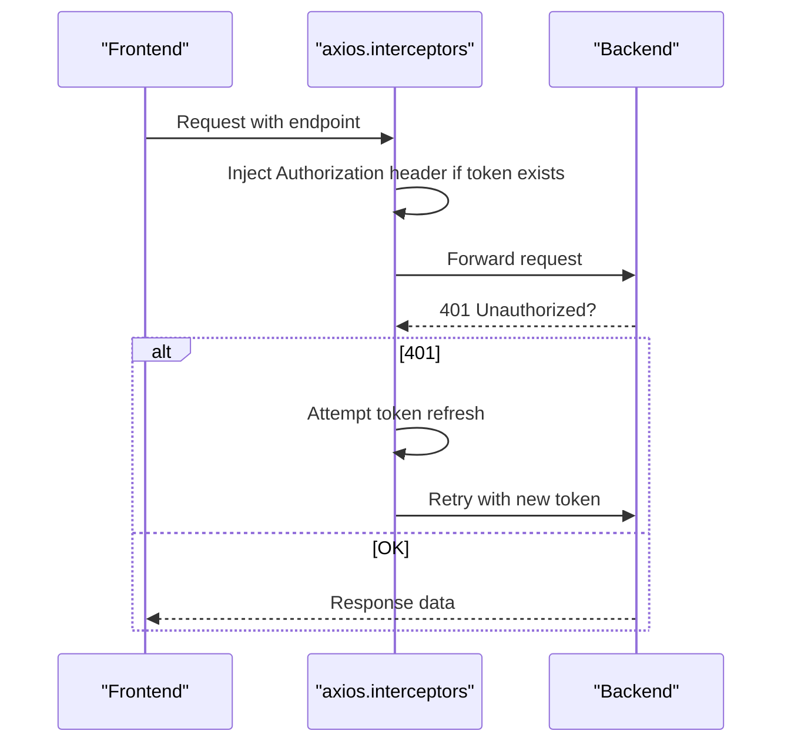

**Diagram sources**
- [api.js:64-146](file://src/services/api.js#L64-L146)
- [documents_api.js:13-20](file://src/services/documents_api.js#L13-L20)

**Section sources**
- [api.js:64-146](file://src/services/api.js#L64-L146)
- [documents_api.js:13-20](file://src/services/documents_api.js#L13-L20)

### Integrating with External Systems and Custom Workflows
- Invoicing integration: The LinkedDocumentsWidget fetches invoices, quotations, proposals, contracts, and progress reports from external endpoints and merges them into the CRM view.
- Invoice references: Some documents act as references without actual files; downloading triggers redirection to the invoicing module or direct PDF generation endpoint.
- Extensibility: Additional endpoints exist for folders, stats, and versioning that can be leveraged for advanced workflows.

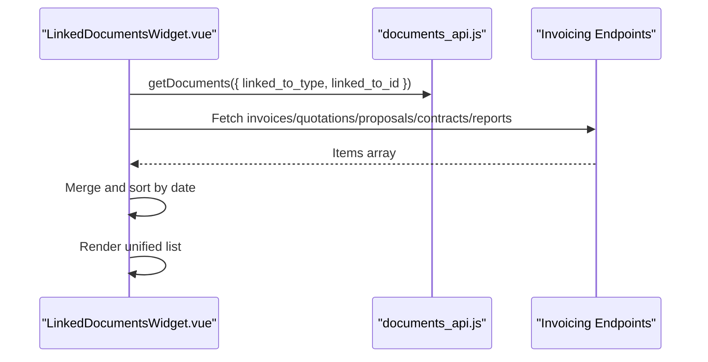

**Diagram sources**
- [LinkedDocumentsWidget.vue:272-371](file://src/views/Modules/crm/components/LinkedDocumentsWidget.vue#L272-L371)
- [documents_api.js:22-33](file://src/services/documents_api.js#L22-L33)

**Section sources**
- [LinkedDocumentsWidget.vue:272-371](file://src/views/Modules/crm/components/LinkedDocumentsWidget.vue#L272-L371)
- [documents_api.js:141-159](file://src/services/documents_api.js#L141-L159)

## Dependency Analysis
- DocumentsView depends on:
  - documents_api for data operations.
  - Modals for upload, detail, edit, share, quick view, and invoice creation.
  - decodeJWT for tenant extraction.
- LinkedDocumentsWidget depends on:
  - documents_api for linked documents.
  - Direct fetch calls to invoicing endpoints for additional documents.
- DocumentUploadModal and DocumentAttachModal depend on:
  - documents_api.uploadDocument for file uploads.
- DocumentDetailModal and DocumentQuickViewModal depend on:
  - documents_api.trackDownload and file_url resolution.
- DocumentShareModal depends on:
  - documents_api.shareDocument for toggling public access.

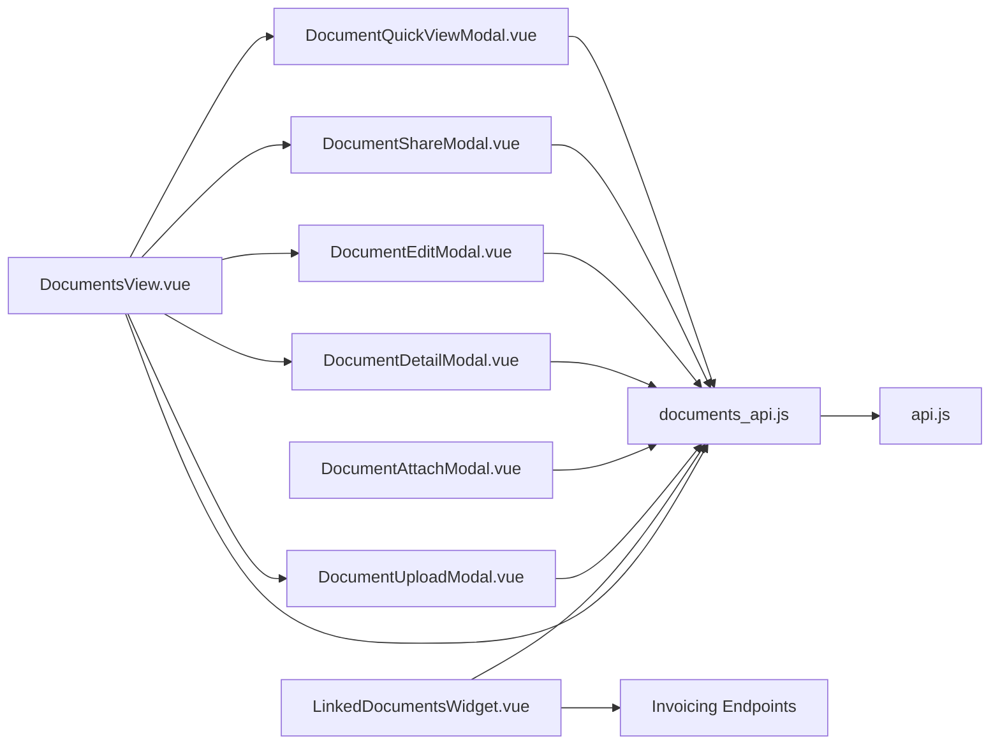

**Diagram sources**
- [DocumentsView.vue:416-722](file://src/views/Modules/crm/components/DocumentsView.vue#L416-L722)
- [LinkedDocumentsWidget.vue:183-518](file://src/views/Modules/crm/components/LinkedDocumentsWidget.vue#L183-L518)
- [DocumentUploadModal.vue:189-343](file://src/views/Modules/crm/components/DocumentUploadModal.vue#L189-L343)
- [DocumentAttachModal.vue:233-430](file://src/views/Modules/crm/components/DocumentAttachModal.vue#L233-L430)
- [DocumentDetailModal.vue:169-272](file://src/views/Modules/crm/components/DocumentDetailModal.vue#L169-L272)
- [DocumentEditModal.vue:73-121](file://src/views/Modules/crm/components/DocumentEditModal.vue#L73-L121)
- [DocumentShareModal.vue:91-173](file://src/views/Modules/crm/components/DocumentShareModal.vue#L91-L173)
- [DocumentQuickViewModal.vue:91-160](file://src/views/Modules/crm/components/DocumentQuickViewModal.vue#L91-L160)
- [documents_api.js:1-182](file://src/services/documents_api.js#L1-L182)
- [api.js:1-209](file://src/services/api.js#L1-L209)

**Section sources**
- [DocumentsView.vue:416-722](file://src/views/Modules/crm/components/DocumentsView.vue#L416-L722)
- [LinkedDocumentsWidget.vue:183-518](file://src/views/Modules/crm/components/LinkedDocumentsWidget.vue#L183-L518)
- [documents_api.js:1-182](file://src/services/documents_api.js#L1-L182)
- [api.js:1-209](file://src/services/api.js#L1-L209)

## Performance Considerations
- Debounced search reduces unnecessary API calls during typing.
- Pagination limits data transfer and improves rendering performance.
- Merging remote invoicing documents is done asynchronously; consider caching strategies for frequently accessed entities.
- Avoid large file previews in memory; rely on browser-native rendering for images/PDFs/text.

[No sources needed since this section provides general guidance]

## Troubleshooting Guide
- Upload failures: Ensure file selection, required fields (name, category), and network connectivity. Check console errors and verify tenant_id presence.
- Missing file URL: If preview/download fails, confirm file_url is returned by the backend and accessible.
- Token expiration: The axios interceptor handles 401 by refreshing tokens; if refresh fails, users are redirected to login.
- Public link not working: Verify sharing toggle was successful and the generated link is correct.

**Section sources**
- [DocumentUploadModal.vue:246-297](file://src/views/Modules/crm/components/DocumentUploadModal.vue#L246-L297)
- [DocumentDetailModal.vue:224-245](file://src/views/Modules/crm/components/DocumentDetailModal.vue#L224-L245)
- [api.js:90-146](file://src/services/api.js#L90-L146)
- [DocumentShareModal.vue:127-145](file://src/views/Modules/crm/components/DocumentShareModal.vue#L127-L145)

## Conclusion
The CRM document management system provides a robust foundation for uploading, organizing, previewing, and sharing documents, with strong integration points to CRM entities and external invoicing resources. It supports search, tagging, categorization, and basic versioning endpoints. Security is enforced via authentication and tenant scoping, with controlled public sharing. Future enhancements could include richer collaborative editing, advanced encryption controls, and deeper integrations with enterprise DMS solutions.

[No sources needed since this section summarizes without analyzing specific files]

## Appendices

### API Surface Summary
- List documents with filters: GET /documents/
- Get document: GET /documents/{id}
- Upload document: POST /documents/ (multipart/form-data)
- Update metadata: PUT /documents/{id}
- Delete document: DELETE /documents/{id}
- Share document: POST /documents/{id}/share
- Track download: POST /documents/{id}/download
- Create version: POST /documents/{id}/version
- List versions: GET /documents/{id}/versions
- Folders list: GET /documents/folders/list
- Stats: GET /documents/stats
- Invoice reference: POST /documents/invoice-reference
- Download invoice PDF: GET /documents/{id}/download-invoice-pdf

**Section sources**
- [documents_api.js:22-182](file://src/services/documents_api.js#L22-L182)