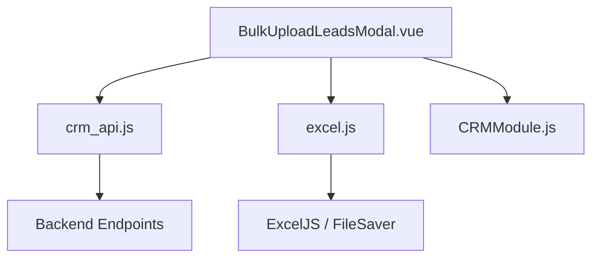
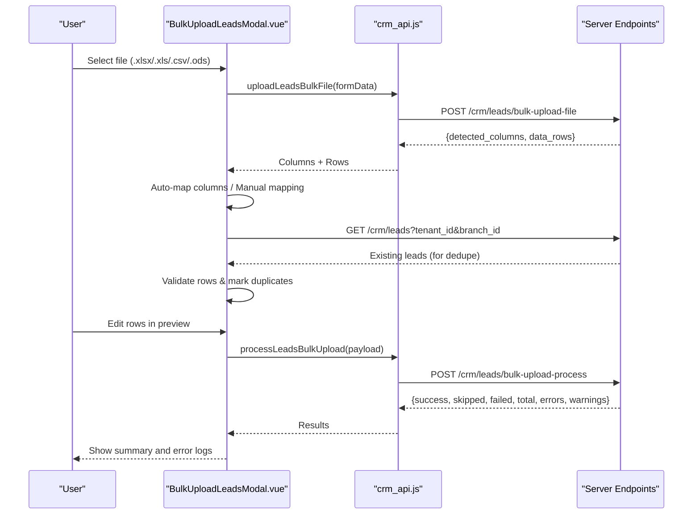
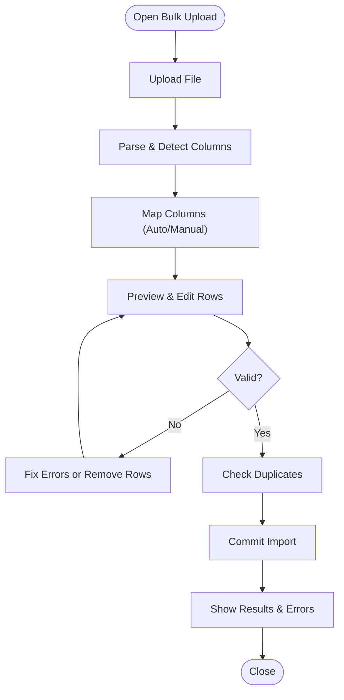
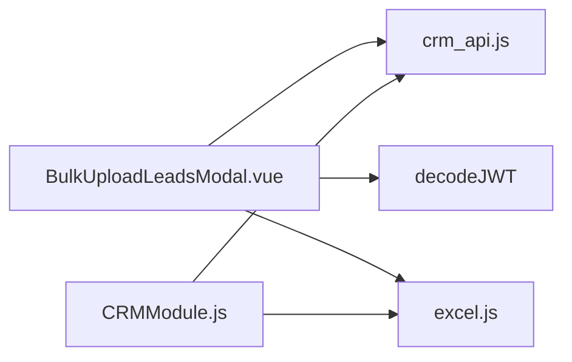

# Bulk Lead Operations

<cite>
**Referenced Files in This Document**
- [BulkUploadLeadsModal.vue](file://src/views/Modules/crm/components/BulkUploadLeadsModal.vue)
- [ImportLeadsModal.vue](file://src/views/Modules/crm/components/ImportLeadsModal.vue)
- [CRMModule.js](file://src/views/Modules/crm/composables/CRMModule.js)
- [crm_api.js](file://src/services/crm_api.js)
- [excel.js](file://src/utils/excel.js)
</cite>

## Table of Contents
1. [Introduction](#introduction)
2. [Project Structure](#project-structure)
3. [Core Components](#core-components)
4. [Architecture Overview](#architecture-overview)
5. [Detailed Component Analysis](#detailed-component-analysis)
6. [Dependency Analysis](#dependency-analysis)
7. [Performance Considerations](#performance-considerations)
8. [Troubleshooting Guide](#troubleshooting-guide)
9. [Conclusion](#conclusion)
10. [Appendices](#appendices)

## Introduction
This document explains the bulk lead import and upload capabilities implemented in the CRM module. It covers the multi-step modal workflow for uploading files, mapping columns to system fields, previewing and validating data, deduplication checks, and committing imports. It also documents supported file formats, field mappings, validation rules, error handling, progress feedback, and performance considerations for large datasets. Guidance is provided for implementing custom templates, extending validation rules, and integrating with external lead generation systems.

## Project Structure
The bulk lead operations are centered around a multi-step modal that orchestrates file processing, column mapping, preview/edit, and final import. Supporting utilities handle Excel/CSV parsing and export, while API services provide endpoints for file upload, template download, and bulk processing.

**Diagram sources**
- [BulkUploadLeadsModal.vue:495-773](file://src/views/Modules/crm/components/BulkUploadLeadsModal.vue#L495-L773)
- [crm_api.js:539-585](file://src/services/crm_api.js#L539-L585)
- [excel.js:49-74](file://src/utils/excel.js#L49-L74)
- [CRMModule.js:2505-2540](file://src/views/Modules/crm/composables/CRMModule.js#L2505-L2540)

**Section sources**
- [BulkUploadLeadsModal.vue:1-493](file://src/views/Modules/crm/components/BulkUploadLeadsModal.vue#L1-L493)
- [crm_api.js:539-585](file://src/services/crm_api.js#L539-L585)
- [excel.js:1-221](file://src/utils/excel.js#L1-L221)
- [CRMModule.js:2505-2540](file://src/views/Modules/crm/composables/CRMModule.js#L2505-L2540)

## Core Components
- BulkUploadLeadsModal.vue: Multi-step modal for file upload, column mapping, editable preview, duplicate detection, and import commit.
- ImportLeadsModal.vue: Generic modal wrapper used by other import flows.
- CRMModule.js: Legacy/import flow logic including file reading, validation, and batch import via API.
- crm_api.js: HTTP client functions for bulk upload endpoints and template download.
- excel.js: Utilities for reading/writing Excel/CSV using ExcelJS and exporting workbooks.

Key responsibilities:
- File ingestion and format support (XLSX, XLS, CSV, ODS).
- Column auto-mapping and manual mapping to system fields.
- Row-level validation and inline editing.
- Duplicate detection against existing leads.
- Batch processing and result reporting.

**Section sources**
- [BulkUploadLeadsModal.vue:495-773](file://src/views/Modules/crm/components/BulkUploadLeadsModal.vue#L495-L773)
- [ImportLeadsModal.vue:1-23](file://src/views/Modules/crm/components/ImportLeadsModal.vue#L1-L23)
- [CRMModule.js:2505-2540](file://src/views/Modules/crm/composables/CRMModule.js#L2505-L2540)
- [crm_api.js:539-585](file://src/services/crm_api.js#L539-L585)
- [excel.js:49-74](file://src/utils/excel.js#L49-L74)

## Architecture Overview
The bulk import follows a four-step sequence:
1. Upload file (server-side parse and return detected columns + sample rows).
2. Map source columns to system fields (auto-detect or manual).
3. Preview and edit rows; run duplicate checks and validate data.
4. Commit import; display results and errors.

**Diagram sources**
- [BulkUploadLeadsModal.vue:622-773](file://src/views/Modules/crm/components/BulkUploadLeadsModal.vue#L622-L773)
- [crm_api.js:539-585](file://src/services/crm_api.js#L539-L585)

## Detailed Component Analysis

### BulkUploadLeadsModal.vue
- Step 1: File Upload
  - Accepts .xlsx, .xls, .csv, .ods via drag-and-drop or file picker.
  - Sends multipart/form-data to server endpoint to parse and return metadata.
- Step 2: Column Mapping
  - Displays detected columns with sample snippets.
  - Provides auto-detection based on common column names and allows manual mapping to system fields.
  - Shows mapping warnings when required fields are not mapped.
- Step 3: Preview & Edit
  - Renders an editable table for mapped fields.
  - Validates rows inline (e.g., email format) and highlights invalid entries.
  - Supports duplicate checking against existing leads; marks duplicates and offers bulk removal.
  - Computes stats: total, valid non-duplicate count, duplicates, invalid count.
- Step 4: Results
  - Displays success, skipped, failed, and total counts.
  - Lists critical errors and warnings per row.

Supported file formats:
- XLSX, XLS, CSV, ODS (as accepted by the file input).

Field mapping configuration:
- System fields include name, email, phone, company, position, priority, stage, value, source, assignedTo, notes, dateCreated, city, country, address, website, industry, areaName, lat, lng, linkedin, twitter, facebook, instagram.

Data transformation rules:
- Auto-mapping matches source column names to system fields using normalized comparisons.
- Email validation ensures presence of “@” and “.” if provided.
- Priority values normalized to hot/warm/cold.
- Stage normalization to allowed pipeline stages.
- Numeric value coercion where applicable.

Error handling:
- Network and parsing errors surfaced via alerts and console logs.
- Validation errors shown inline; invalid rows can be removed before commit.
- Duplicate rows flagged and removable.

Progress tracking:
- Uploading and importing states disable actions and show spinners.
- Step indicators and footer status text guide users through the workflow.

Batch processing workflow:
- Filters out invalid and duplicate rows.
- Reconstructs original column structure from mapped data.
- Sends payload with column_mapping, data_rows, skip_duplicates flag, and branch_id.

Memory management strategies:
- The modal loads parsed rows into memory for preview and editing; consider limiting preview size for very large files.
- Avoid loading entire datasets beyond what is necessary for user review.

Asynchronous patterns:
- Uses async/await for file upload, duplicate checks, and import processing.
- Debounced or throttled updates could be added for large previews.

**Diagram sources**
- [BulkUploadLeadsModal.vue:622-773](file://src/views/Modules/crm/components/BulkUploadLeadsModal.vue#L622-L773)

**Section sources**
- [BulkUploadLeadsModal.vue:1-493](file://src/views/Modules/crm/components/BulkUploadLeadsModal.vue#L1-L493)
- [BulkUploadLeadsModal.vue:495-773](file://src/views/Modules/crm/components/BulkUploadLeadsModal.vue#L495-L773)

### ImportLeadsModal.vue
- A generic modal container used to wrap import content.
- Emits update:modelValue to control visibility.
- Used by other import flows to present consistent UI chrome.

**Section sources**
- [ImportLeadsModal.vue:1-23](file://src/views/Modules/crm/components/ImportLeadsModal.vue#L1-L23)

### CRMModule.js (Legacy Import Flow)
- Reads file via FileReader and parses with ExcelJS-compatible utilities.
- Validates records:
  - Required fields: name, email.
  - Email format validation.
  - Allowed values for priority and stage.
  - Numeric value for deal size.
  - Website URL validation.
- Builds normalized record objects and separates valid/invalid records.
- Calls bulkImportLeads API to commit valid records.
- Handles success/failure and shows toast notifications.

Validation rules:
- Name and email required.
- Email must match standard pattern.
- Priority must be one of hot/warm/cold.
- Stage must be one of new/contacted/proposal/negotiation/closed-won/closed-lost.
- Value must be numeric.
- Website must be a valid URL.

Batch processing:
- Maps validated records to backend schema and sends array of records.
- Aggregates results into success/failed/errors.

**Section sources**
- [CRMModule.js:2505-2540](file://src/views/Modules/crm/composables/CRMModule.js#L2505-L2540)

### crm_api.js (Bulk Upload Endpoints)
- uploadLeadsBulkFile: Multipart upload to server for parsing and returning detected columns and rows.
- processLeadsBulkUpload: JSON payload with column mapping and data rows for server-side processing.
- downloadLeadTemplate: Downloads a template workbook for users to fill.

Endpoints:
- POST /crm/leads/bulk-upload-file
- POST /crm/leads/bulk-upload-process
- GET /crm/leads/download-template

Error handling:
- Centralized response handler normalizes error messages and attaches status codes.

**Section sources**
- [crm_api.js:539-585](file://src/services/crm_api.js#L539-L585)

### excel.js (Utilities)
- readWorkbook: Loads workbook buffers into ExcelJS instances.
- sheetToJson: Converts sheets to JSON arrays with header-based keys.
- workbookToBuffer/downloadWorkbook: Export utilities for saving workbooks.
- XLSXCompat: Compatibility layer mimicking SheetJS APIs for broader integration.

Usage in bulk operations:
- Parsing uploaded files to extract headers and rows.
- Generating templates and exports.

**Section sources**
- [excel.js:49-74](file://src/utils/excel.js#L49-L74)
- [excel.js:165-221](file://src/utils/excel.js#L165-L221)

## Dependency Analysis
- BulkUploadLeadsModal depends on:
  - crm_api for file upload, duplicate checks, and import processing.
  - excel.js indirectly via server responses and template downloads.
  - decodeJWT for tenant context.
- CRMModule uses:
  - excel.js for local file parsing and validation.
  - crm_api for bulk import and export.
- Shared utilities:
  - excel.js provides cross-cutting file I/O and conversion.

**Diagram sources**
- [BulkUploadLeadsModal.vue:495-773](file://src/views/Modules/crm/components/BulkUploadLeadsModal.vue#L495-L773)
- [CRMModule.js:2505-2540](file://src/views/Modules/crm/composables/CRMModule.js#L2505-L2540)
- [crm_api.js:539-585](file://src/services/crm_api.js#L539-L585)
- [excel.js:49-74](file://src/utils/excel.js#L49-L74)

**Section sources**
- [BulkUploadLeadsModal.vue:495-773](file://src/views/Modules/crm/components/BulkUploadLeadsModal.vue#L495-L773)
- [CRMModule.js:2505-2540](file://src/views/Modules/crm/composables/CRMModule.js#L2505-L2540)
- [crm_api.js:539-585](file://src/services/crm_api.js#L539-L585)
- [excel.js:49-74](file://src/utils/excel.js#L49-L74)

## Performance Considerations
- Large dataset handling:
  - Prefer server-side parsing for large files to avoid browser memory pressure.
  - Limit preview rows to a manageable subset for interactive editing.
  - Use pagination or chunking if displaying large tables.
- Memory management:
  - Clear references after import completion.
  - Avoid retaining full raw datasets longer than needed.
- Asynchronous processing:
  - Use async/await to keep UI responsive during uploads and processing.
  - Provide progress indicators and disable controls during long operations.
- Deduplication:
  - Fetch only necessary fields for comparison; normalize strings before matching.
- Validation:
  - Perform lightweight client-side validation to reduce server load.
  - Rely on server-side validation for authoritative checks.

[No sources needed since this section provides general guidance]

## Troubleshooting Guide
Common issues and resolutions:
- File parsing failures:
  - Ensure file is a supported format (.xlsx, .xls, .csv, .ods).
  - Verify first row contains headers; empty files will fail.
- Column mapping errors:
  - Use auto-detect to map common columns; manually adjust mismatches.
  - Confirm required fields are mapped if enforced by business rules.
- Validation errors:
  - Check email format; ensure presence of “@” and domain suffix.
  - Normalize priority and stage values to allowed sets.
  - Validate numeric fields like value.
- Duplicate detection:
  - Ensure name, email, and phone are present for accurate matching.
  - Review flagged duplicates and remove or resolve conflicts.
- Import failures:
  - Inspect error logs in results view for row-specific messages.
  - Retry with corrected data; check network connectivity and authentication.

**Section sources**
- [BulkUploadLeadsModal.vue:622-773](file://src/views/Modules/crm/components/BulkUploadLeadsModal.vue#L622-L773)
- [CRMModule.js:2505-2540](file://src/views/Modules/crm/composables/CRMModule.js#L2505-L2540)
- [crm_api.js:11-32](file://src/services/crm_api.js#L11-L32)

## Conclusion
The bulk lead operations provide a robust, user-friendly workflow for importing large datasets with flexible column mapping, real-time validation, duplicate detection, and clear error reporting. The architecture leverages server-side parsing for scalability and client-side interactivity for usability. Teams can extend templates, add validation rules, and integrate with external systems by following the established patterns and endpoints.

[No sources needed since this section summarizes without analyzing specific files]

## Appendices

### Supported File Formats
- XLSX, XLS, CSV, ODS

**Section sources**
- [BulkUploadLeadsModal.vue:46-66](file://src/views/Modules/crm/components/BulkUploadLeadsModal.vue#L46-L66)

### Field Mapping Configuration
- System fields available for mapping include name, email, phone, company, position, priority, stage, value, source, assignedTo, notes, dateCreated, city, country, address, website, industry, areaName, lat, lng, linkedin, twitter, facebook, instagram.

**Section sources**
- [BulkUploadLeadsModal.vue:532-558](file://src/views/Modules/crm/components/BulkUploadLeadsModal.vue#L532-L558)

### Data Transformation Rules
- Auto-mapping normalizes column names to system fields.
- Email validation requires “@” and “.” if provided.
- Priority normalized to hot/warm/cold.
- Stage normalized to allowed pipeline stages.
- Numeric coercion for value fields.

**Section sources**
- [BulkUploadLeadsModal.vue:645-680](file://src/views/Modules/crm/components/BulkUploadLeadsModal.vue#L645-L680)
- [CRMModule.js:2513-2529](file://src/views/Modules/crm/composables/CRMModule.js#L2513-L2529)

### Batch Processing Workflows
- Filter invalid and duplicate rows.
- Reconstruct original column structure from mapped data.
- Send payload with column_mapping, data_rows, skip_duplicates, and branch_id.

**Section sources**
- [BulkUploadLeadsModal.vue:735-773](file://src/views/Modules/crm/components/BulkUploadLeadsModal.vue#L735-L773)

### Progress Tracking and Error Reporting
- Uploading/importing states with spinners and disabled controls.
- Step indicators and footer status text.
- Results view displays success, skipped, failed, total counts and detailed error/warning logs.

**Section sources**
- [BulkUploadLeadsModal.vue:442-490](file://src/views/Modules/crm/components/BulkUploadLeadsModal.vue#L442-L490)
- [BulkUploadLeadsModal.vue:382-439](file://src/views/Modules/crm/components/BulkUploadLeadsModal.vue#L382-L439)

### Custom Import Templates
- Download template via API endpoint to ensure correct format adherence.
- Follow header conventions and required fields for smooth auto-mapping.

**Section sources**
- [crm_api.js:562-585](file://src/services/crm_api.js#L562-L585)

### Integration with External Lead Generation Systems
- Use bulk upload endpoints to ingest leads from external sources.
- Map external fields to system fields using column mapping.
- Implement retry logic and error handling for network failures.

**Section sources**
- [crm_api.js:539-585](file://src/services/crm_api.js#L539-L585)