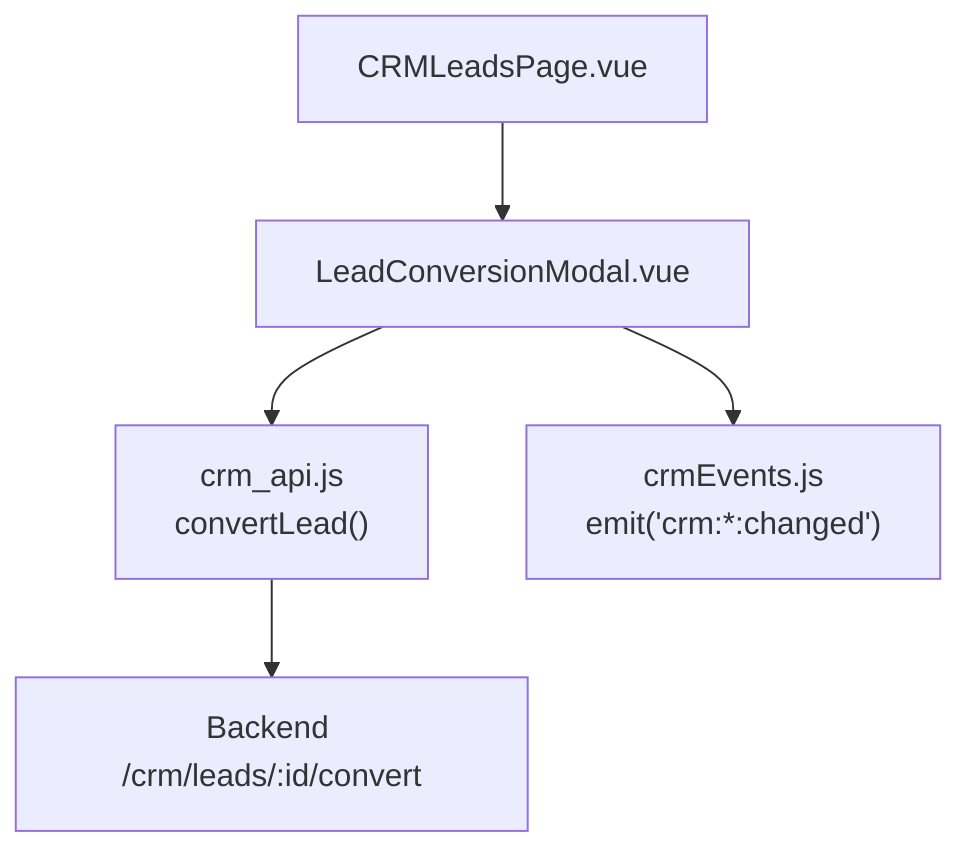
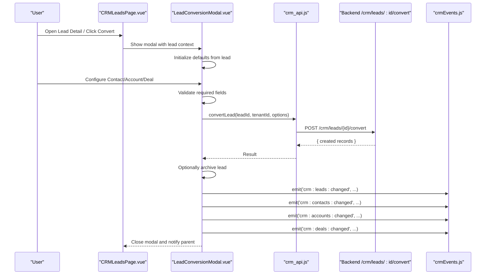
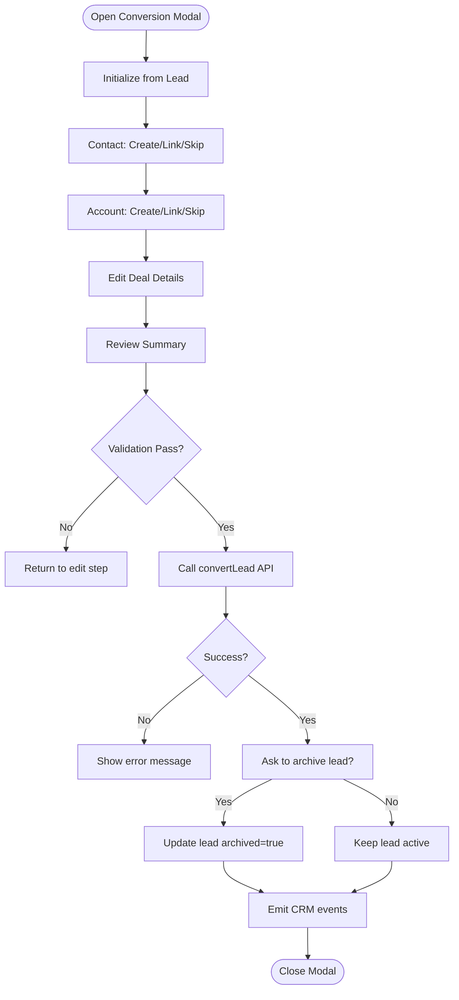
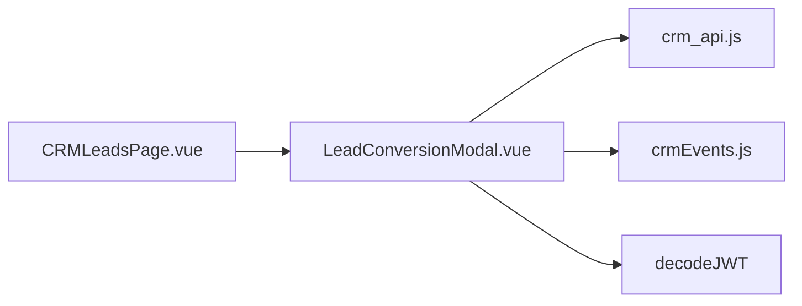

# Lead Conversion Process

<cite>
**Referenced Files in This Document**
- [LeadConversionModal.vue](file://src/views/Modules/crm/components/LeadConversionModal.vue)
- [CRMLeadsPage.vue](file://src/views/Modules/crm/CRMLeadsPage.vue)
- [crm_api.js](file://src/services/crm_api.js)
- [crmEvents.js](file://src/events/crmEvents.js)
</cite>

## Table of Contents
1. [Introduction](#introduction)
2. [Project Structure](#project-structure)
3. [Core Components](#core-components)
4. [Architecture Overview](#architecture-overview)
5. [Detailed Component Analysis](#detailed-component-analysis)
6. [Dependency Analysis](#dependency-analysis)
7. [Performance Considerations](#performance-considerations)
8. [Troubleshooting Guide](#troubleshooting-guide)
9. [Conclusion](#conclusion)
10. [Appendices](#appendices)

## Introduction
This document explains the end-to-end lead conversion process to contacts, accounts, and deals within the CRM module. It covers the conversion modal implementation, data mapping between lead and target entities, validation checks, relationship establishment, post-conversion actions (notifications and optional archiving), and guidance for customizing conversion mappings and workflows.

## Project Structure
The conversion flow is implemented primarily in the CRM Leads page and a dedicated conversion modal:
- The Leads page hosts the conversion modal and triggers conversion from the lead detail view or list actions.
- The conversion modal orchestrates user choices for contact, account, and deal creation, validates inputs, builds a conversion payload, calls the backend API, and emits events to refresh related views.

**Diagram sources**
- [CRMLeadsPage.vue:101-112](file://src/views/Modules/crm/CRMLeadsPage.vue#L101-L112)
- [LeadConversionModal.vue:400-633](file://src/views/Modules/crm/components/LeadConversionModal.vue#L400-L633)
- [crm_api.js:139-143](file://src/services/crm_api.js#L139-L143)
- [crmEvents.js:18-28](file://src/events/crmEvents.js#L18-L28)

**Section sources**
- [CRMLeadsPage.vue:101-112](file://src/views/Modules/crm/CRMLeadsPage.vue#L101-L112)
- [LeadConversionModal.vue:400-633](file://src/views/Modules/crm/components/LeadConversionModal.vue#L400-L633)
- [crm_api.js:139-143](file://src/services/crm_api.js#L139-L143)
- [crmEvents.js:18-28](file://src/events/crmEvents.js#L18-L28)

## Core Components
- LeadConversionModal: Multi-step wizard to create/link Contact, Account, and Deal; validates required fields; builds conversion payload; calls backend convert endpoint; optionally archives the converted lead; emits events to refresh UI.
- CRMLeadsPage: Hosts the conversion modal and wires up the “Convert” action from the lead detail modal.
- crm_api.convertLead: HTTP client that POSTs to the backend conversion endpoint with options controlling what to create or link.
- crmEvents: Lightweight event bus used to broadcast changes across CRM modules after conversion.

Key responsibilities:
- Data mapping from lead to contact/account/deal fields.
- Conditional logic based on user selections (create new, link existing, skip).
- Validation before submission.
- Post-conversion actions (archive prompt, event emissions).

**Section sources**
- [LeadConversionModal.vue:400-633](file://src/views/Modules/crm/components/LeadConversionModal.vue#L400-L633)
- [CRMLeadsPage.vue:101-112](file://src/views/Modules/crm/CRMLeadsPage.vue#L101-L112)
- [crm_api.js:139-143](file://src/services/crm_api.js#L139-L143)
- [crmEvents.js:18-28](file://src/events/crmEvents.js#L18-L28)

## Architecture Overview
The conversion workflow follows a clear sequence:
1. User opens the conversion modal from the leads interface.
2. Modal initializes default values from the selected lead.
3. User selects whether to create or link Contact and Account, and edits Deal details.
4. On confirmation, the modal validates inputs and constructs a conversion payload.
5. The payload is sent via crm_api.convertLead to the backend endpoint.
6. After success, the modal optionally archives the lead and emits events to refresh related lists.

**Diagram sources**
- [CRMLeadsPage.vue:101-112](file://src/views/Modules/crm/CRMLeadsPage.vue#L101-L112)
- [LeadConversionModal.vue:459-633](file://src/views/Modules/crm/components/LeadConversionModal.vue#L459-L633)
- [crm_api.js:139-143](file://src/services/crm_api.js#L139-L143)
- [crmEvents.js:18-28](file://src/events/crmEvents.js#L18-L28)

## Detailed Component Analysis

### LeadConversionModal: Step-by-Step Workflow
- Initialization: When opened, the modal reads the lead object and pre-fills contact, account, and deal fields. Name splitting populates first/last name; company maps to account name; website, phone, industry, notes, and value are carried over where applicable.
- Step 1 – Contact:
  - Options: Create New, Link Existing, Skip.
  - Create New: Requires first name, last name, email.
  - Link Existing: Search contacts by name/email and select one.
- Step 2 – Account:
  - Options: Create New, Link Existing, Skip.
  - Create New: Requires account name.
  - Link Existing: Search accounts by company name and select one.
- Step 3 – Deal:
  - Always shown for editing. Defaults include stage and probability; name/value can be edited.
- Step 4 – Review & Confirm:
  - Summarizes selections for contact, account, and deal.
  - Validates required fields before proceeding.
- Submission:
  - Builds a conversion payload with flags and data for each entity.
  - Calls crm_api.convertLead with lead id, tenant id, and options.
  - Prompts to archive the converted lead; if confirmed, updates the lead record to archived.
  - Emits CRM events to refresh affected lists.

**Diagram sources**
- [LeadConversionModal.vue:459-633](file://src/views/Modules/crm/components/LeadConversionModal.vue#L459-L633)

**Section sources**
- [LeadConversionModal.vue:459-633](file://src/views/Modules/crm/components/LeadConversionModal.vue#L459-L633)

### Data Mapping and Field Transformations
- Contact mapping:
  - Lead name split into first and last name.
  - Email and phone copied from lead.
  - Title remains empty unless set by user.
- Account mapping:
  - Company becomes account name.
  - Website, phone, industry copied from lead.
  - Type defaults to Prospect.
- Deal mapping:
  - Name derived from lead company/name.
  - Value and amount taken from lead value.
  - Stage defaults to closed-won; probability set to 100.
  - Expected close date defaults to current date if not provided.
  - Description includes auto-generated note referencing the original lead.

These mappings ensure minimal friction while preserving key lead information in downstream entities.

**Section sources**
- [LeadConversionModal.vue:472-508](file://src/views/Modules/crm/components/LeadConversionModal.vue#L472-L508)
- [LeadConversionModal.vue:568-587](file://src/views/Modules/crm/components/LeadConversionModal.vue#L568-L587)

### Relationship Establishment
- Contact linkage:
  - If linking an existing contact, the selected contact id is included in the payload.
  - If creating a new contact, contactData is passed to the backend.
- Account linkage:
  - If linking an existing account, the selected account id is included.
  - If creating a new account, accountData is passed to the backend.
- Deal association:
  - Deal data is always included; backend associates it with the created or linked account/contact per business rules.

The modal’s payload structure communicates intent clearly to the backend, which performs the actual relationship setup.

**Section sources**
- [LeadConversionModal.vue:568-587](file://src/views/Modules/crm/components/LeadConversionModal.vue#L568-L587)

### Validation Rules and Data Integrity
- Required fields enforced:
  - Contact: First name, last name, email when creating new.
  - Account: Name when creating new.
- Validation occurs before submission to prevent incomplete conversions.
- Errors are surfaced via alerts; loading state prevents duplicate submissions.

**Section sources**
- [LeadConversionModal.vue:552-563](file://src/views/Modules/crm/components/LeadConversionModal.vue#L552-L563)

### Post-Conversion Actions
- Optional archiving:
  - After successful conversion, the user is prompted to archive the lead to remove it from active lists.
  - If confirmed, the lead is updated with archived flag.
- Event broadcasting:
  - Emits events for leads, contacts, accounts, and deals to refresh all relevant views without manual reload.

**Section sources**
- [LeadConversionModal.vue:592-624](file://src/views/Modules/crm/components/LeadConversionModal.vue#L592-L624)

### Integration Points
- Backend API:
  - convertLead endpoint receives lead id, tenant id, and options controlling creation/linking behavior.
- Event Bus:
  - CRM events enable decoupled UI updates across components listening for changes.

**Section sources**
- [crm_api.js:139-143](file://src/services/crm_api.js#L139-L143)
- [crmEvents.js:18-28](file://src/events/crmEvents.js#L18-L28)

## Dependency Analysis
- LeadConversionModal depends on:
  - crm_api.convertLead for conversion execution.
  - crm_api.getContacts and getAccounts for search functionality.
  - crmEvents.emit to broadcast changes.
  - decodeJWT utility to obtain tenant id.
- CRMLeadsPage depends on:
  - LeadConversionModal component to host the conversion wizard.
  - LeadDetailModal to trigger conversion from the lead detail view.

**Diagram sources**
- [LeadConversionModal.vue:400-633](file://src/views/Modules/crm/components/LeadConversionModal.vue#L400-L633)
- [CRMLeadsPage.vue:101-112](file://src/views/Modules/crm/CRMLeadsPage.vue#L101-L112)
- [crm_api.js:139-143](file://src/services/crm_api.js#L139-L143)
- [crmEvents.js:18-28](file://src/events/crmEvents.js#L18-L28)

**Section sources**
- [LeadConversionModal.vue:400-633](file://src/views/Modules/crm/components/LeadConversionModal.vue#L400-L633)
- [CRMLeadsPage.vue:101-112](file://src/views/Modules/crm/CRMLeadsPage.vue#L101-L112)
- [crm_api.js:139-143](file://src/services/crm_api.js#L139-L143)
- [crmEvents.js:18-28](file://src/events/crmEvents.js#L18-L28)

## Performance Considerations
- Debounce search inputs for contacts/accounts to reduce API calls during typing.
- Limit search results to a small page size to keep UI responsive.
- Avoid redundant re-renders by minimizing state churn in the modal.
- Use event-driven updates to avoid full-page reloads after conversion.

[No sources needed since this section provides general guidance]

## Troubleshooting Guide
Common issues and resolutions:
- Validation errors:
  - Ensure required fields are filled before submitting.
  - Check for missing email or names when creating a contact; missing account name when creating an account.
- API failures:
  - Inspect network requests to the convert endpoint for status codes and error messages.
  - Verify tenant id extraction and authorization headers.
- Archiving fails silently:
  - Archive update is wrapped in try/catch; check console warnings if archiving does not apply.
- UI not refreshing:
  - Confirm CRM events are emitted for affected entities.
  - Ensure listeners are registered in relevant views.

**Section sources**
- [LeadConversionModal.vue:552-633](file://src/views/Modules/crm/components/LeadConversionModal.vue#L552-L633)
- [crm_api.js:11-32](file://src/services/crm_api.js#L11-L32)

## Conclusion
The lead conversion process is implemented as a guided, multi-step modal that maps lead data to contact, account, and deal entities, enforces validation, and coordinates post-conversion actions including optional archiving and event-driven UI updates. The architecture cleanly separates concerns: the modal handles user interaction and payload construction, the API service manages HTTP communication, and the event bus ensures consistent state across the CRM module. Customization points exist at the mapping layer and payload construction, enabling business-specific workflows while preserving data integrity.

[No sources needed since this section summarizes without analyzing specific files]

## Appendices

### Conversion Payload Structure
The conversion payload includes:
- Flags indicating whether to create or link Contact and Account.
- IDs for linking existing records.
- Data objects for creating new records.
- Deal data with name, value, stage, probability, expected close date, and description.
- Converted status to keep the lead visible with an updated state.

**Section sources**
- [LeadConversionModal.vue:568-587](file://src/views/Modules/crm/components/LeadConversionModal.vue#L568-L587)

### Example Scenarios
- Scenario 1: Create new contact, link existing account, create deal
  - Select “Create New” for contact and fill required fields.
  - Select “Link Existing” for account and choose from search results.
  - Edit deal details and confirm conversion.
- Scenario 2: Skip contact, create new account, create deal
  - Choose “Skip” for contact.
  - Choose “Create New” for account and provide required fields.
  - Edit deal details and confirm conversion.
- Scenario 3: Link both contact and account, create deal
  - Use search to link existing contact and account.
  - Edit deal details and confirm conversion.

[No sources needed since this section describes conceptual usage patterns]

### Customization Guidance
- Adjust field mappings:
  - Modify initialization logic to map additional lead fields to contact/account/deal properties.
- Extend validation:
  - Add domain-specific required fields or format checks before submission.
- Customize post-conversion actions:
  - Integrate notifications or audit logging hooks after successful conversion.
- Enhance search UX:
  - Implement debounced search and richer result previews for contacts/accounts.

[No sources needed since this section provides general guidance]