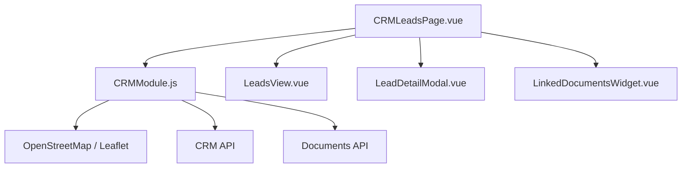
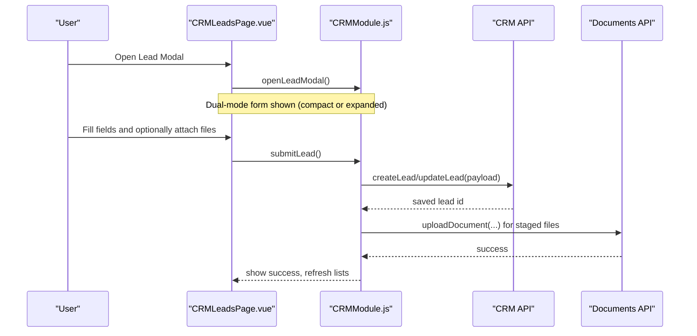
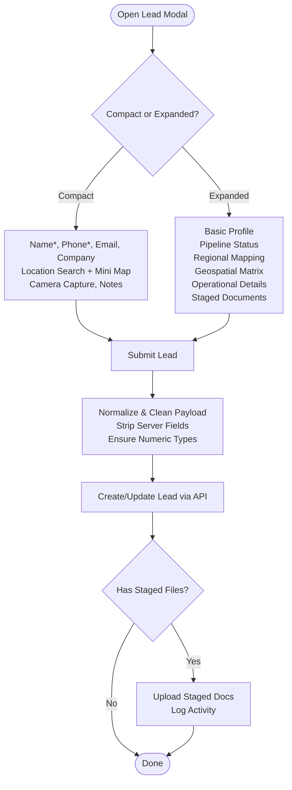
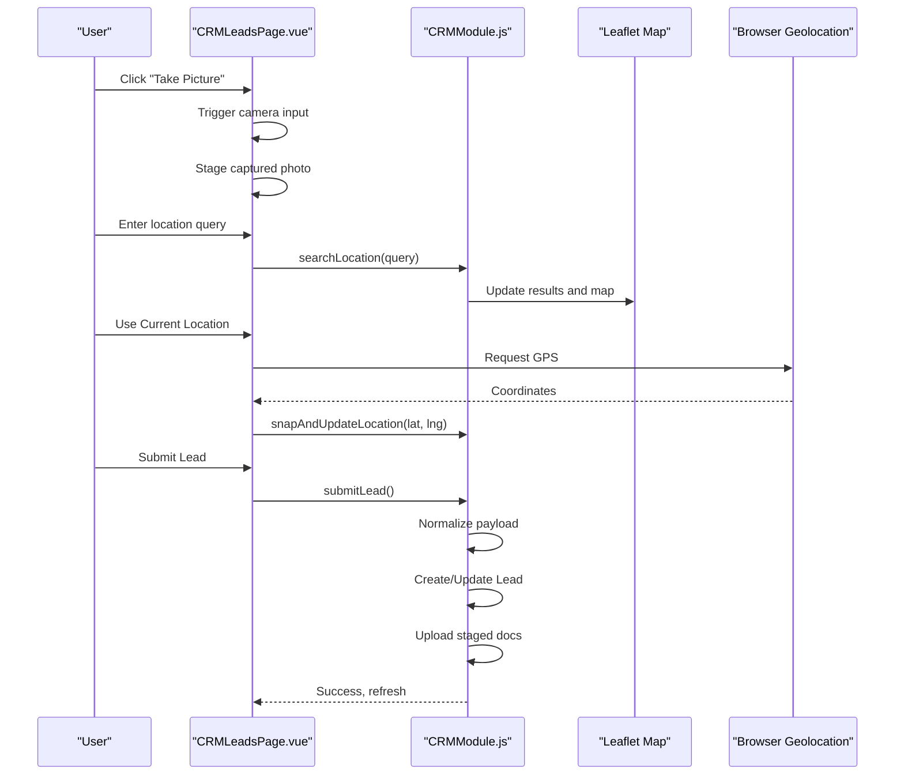
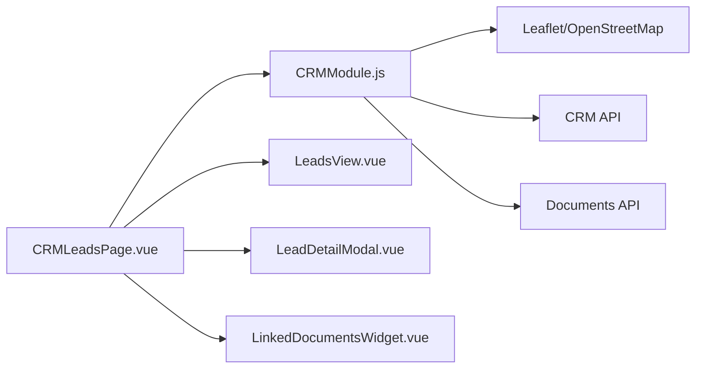

# Lead Creation Workflow

<cite>
**Referenced Files in This Document**
- [CRMLeadsPage.vue](file://src/views/Modules/crm/CRMLeadsPage.vue)
- [LeadDetailModal.vue](file://src/views/Modules/crm/components/LeadDetailModal.vue)
- [LeadsView.vue](file://src/views/Modules/crm/components/LeadsView.vue)
- [CRMModule.js](file://src/views/Modules/crm/composables/CRMModule.js)
- [LinkedDocumentsWidget.vue](file://src/views/Modules/crm/components/LinkedDocumentsWidget.vue)
</cite>

## Table of Contents
1. [Introduction](#introduction)
2. [Project Structure](#project-structure)
3. [Core Components](#core-components)
4. [Architecture Overview](#architecture-overview)
5. [Detailed Component Analysis](#detailed-component-analysis)
6. [Dependency Analysis](#dependency-analysis)
7. [Performance Considerations](#performance-considerations)
8. [Troubleshooting Guide](#troubleshooting-guide)
9. [Conclusion](#conclusion)

## Introduction
This document explains the lead creation workflow with a dual-mode form system: a compact quick-add mode for fast entry and an expanded detailed form for comprehensive data capture. It covers field validation rules, data binding patterns, user interaction flows, location mapping with interactive geospatial features, operational details (source, assignment, notes), file attachment staging, camera capture on mobile, and integration points for external services such as OpenStreetMap-based location search.

## Project Structure
The lead creation flow spans several components and a shared composable that centralizes state and API interactions:
- CRMLeadsPage.vue orchestrates modals, dialogs, and the dual-mode form UI.
- LeadsView.vue provides list views, filters, bulk actions, and inline spreadsheet editing.
- LeadDetailModal.vue shows lead details, activities, meetings, assets, and notes.
- CRMModule.js is the shared composable providing state, map initialization, location search, submission logic, and pending document handling.
- LinkedDocumentsWidget.vue handles document listing and uploads for existing leads.

**Diagram sources**
- [CRMLeadsPage.vue:117-650](file://src/views/Modules/crm/CRMLeadsPage.vue#L117-L650)
- [CRMModule.js:186-200](file://src/views/Modules/crm/composables/CRMModule.js#L186-L200)
- [CRMModule.js:2447-2461](file://src/views/Modules/crm/composables/CRMModule.js#L2447-L2461)
- [CRMModule.js:1957-2105](file://src/views/Modules/crm/composables/CRMModule.js#L1957-L2105)

**Section sources**
- [CRMLeadsPage.vue:117-650](file://src/views/Modules/crm/CRMLeadsPage.vue#L117-L650)
- [CRMModule.js:186-200](file://src/views/Modules/crm/composables/CRMModule.js#L186-L200)
- [CRMModule.js:2447-2461](file://src/views/Modules/crm/composables/CRMModule.js#L2447-L2461)
- [CRMModule.js:1957-2105](file://src/views/Modules/crm/composables/CRMModule.js#L1957-L2105)

## Core Components
- CRMLeadsPage.vue: Hosts the dual-mode lead form modal, call/WhatsApp dialogs, and integrates with the composable for submission and state.
- CRMModule.js: Centralized state and logic for lead CRUD, pipeline stages, location search, map initialization, and pending documents upload after save.
- LeadsView.vue: List view with filters, bulk operations, and inline spreadsheet editing to update fields like name, company, email, phone, priority, stage, value, source, and more.
- LeadDetailModal.vue: Detailed view with overview, activities timeline, contacts, meetings scheduling, assets, and notes.
- LinkedDocumentsWidget.vue: Displays linked documents and supports direct camera capture uploads for existing records.

**Section sources**
- [CRMLeadsPage.vue:117-650](file://src/views/Modules/crm/CRMLeadsPage.vue#L117-L650)
- [CRMModule.js:186-200](file://src/views/Modules/crm/composables/CRMModule.js#L186-L200)
- [CRMModule.js:1957-2105](file://src/views/Modules/crm/composables/CRMModule.js#L1957-L2105)
- [LeadsView.vue:1694-1714](file://src/views/Modules/crm/components/LeadsView.vue#L1694-L1714)
- [LeadDetailModal.vue:1-800](file://src/views/Modules/crm/components/LeadDetailModal.vue#L1-L800)
- [LinkedDocumentsWidget.vue:227-271](file://src/views/Modules/crm/components/LinkedDocumentsWidget.vue#L227-L271)

## Architecture Overview
The lead creation workflow uses a composable-driven architecture:
- The page component renders the dual-mode form and delegates business logic to the composable.
- The composable manages map instances, location search, form payload preparation, and submission to APIs.
- After saving a new lead, staged files are uploaded and activity logs are recorded.

**Diagram sources**
- [CRMLeadsPage.vue:117-650](file://src/views/Modules/crm/CRMLeadsPage.vue#L117-L650)
- [CRMModule.js:1957-2105](file://src/views/Modules/crm/composables/CRMModule.js#L1957-L2105)

## Detailed Component Analysis

### Dual-Mode Form System
- Compact Quick-Add Mode:
  - Fields: Name*, Phone*, Email (optional), Company (optional), Location search, Camera capture, Notes.
  - Behavior: Minimal friction for rapid entry; expandable to full form via “More fields”.
  - Validation: HTML required attributes enforce Name and Phone; optional fields remain flexible.
  - Location: Search box triggers debounced search; results list selectable; mini map preview updates coordinates.
  - Camera Capture: Uses device camera input; captures image and previews it; staged for later upload.

- Expanded Detailed Form:
  - Sections: Basic Profile (name, phone, email, TPIN, company, position), Pipeline Status (priority, stage, value, created_at override), Regional Mapping (city, country, website, social links), Geospatial Interactive Matrix (search, current location, lat/lng inputs), Operational Information (source, assignee, notes), Digital Footprint (staged documents).
  - Validation: Required fields enforced by HTML; numeric fields normalized to numbers; timestamps parsed to ISO strings; server-managed fields stripped before submission.
  - Data Binding: v-model binds directly to leadForm object; hidden inputs store lat/lng; watchers ensure map marker syncs with coordinates.
  - Assignment: Auto-assigns to current user if not allowed to reassign; otherwise defaults to owner or selected user.

**Diagram sources**
- [CRMLeadsPage.vue:143-627](file://src/views/Modules/crm/CRMLeadsPage.vue#L143-L627)
- [CRMModule.js:1985-2105](file://src/views/Modules/crm/composables/CRMModule.js#L1985-L2105)
- [CRMModule.js:1957-1983](file://src/views/Modules/crm/composables/CRMModule.js#L1957-L1983)

**Section sources**
- [CRMLeadsPage.vue:143-627](file://src/views/Modules/crm/CRMLeadsPage.vue#L143-L627)
- [CRMModule.js:1985-2105](file://src/views/Modules/crm/composables/CRMModule.js#L1985-L2105)
- [CRMModule.js:1957-1983](file://src/views/Modules/crm/composables/CRMModule.js#L1957-L1983)

### Field Validation Rules
- Required fields: Name and Phone are marked required in both modes.
- Optional fields: Email, Company, Website, Social links, Notes.
- Numeric normalization: Value and CAC converted to numbers; empty values default to 0.
- Timestamp handling: created_at parsed to ISO string when provided.
- Server field stripping: Internal fields like _id, last_modified_at, etc., removed before submission.
- Assignment enforcement: If reassignment disabled, assignedTo forced to current user or preserved on edit.

**Section sources**
- [CRMModule.js:1985-2105](file://src/views/Modules/crm/composables/CRMModule.js#L1985-L2105)
- [CRMLeadsPage.vue:143-627](file://src/views/Modules/crm/CRMLeadsPage.vue#L143-L627)

### Data Binding Patterns
- v-model bindings across all inputs bind directly to leadForm properties.
- Hidden inputs for lat/lng ensure numeric precision and rounding on blur.
- Watchers synchronize map markers with coordinate changes.
- Pending documents array holds staged files until lead is saved.

**Section sources**
- [CRMModule.js:2447-2461](file://src/views/Modules/crm/composables/CRMModule.js#L2447-L2461)
- [CRMLeadsPage.vue:203-204](file://src/views/Modules/crm/CRMLeadsPage.vue#L203-L204)
- [CRMLeadsPage.vue:556-622](file://src/views/Modules/crm/CRMLeadsPage.vue#L556-L622)

### User Interaction Flows
- Opening the modal: Triggers map initialization and sets up listeners.
- Location search: Debounced search returns ranked results; selecting a result updates coordinates and map view.
- Current location: Uses browser geolocation to set coordinates.
- Camera capture: Opens device camera; captured image previewed and staged for upload.
- Submission: Validates and normalizes payload; creates/updates lead; uploads staged docs; logs activity; refreshes lists.

**Diagram sources**
- [CRMLeadsPage.vue:207-221](file://src/views/Modules/crm/CRMLeadsPage.vue#L207-L221)
- [CRMModule.js:691-721](file://src/views/Modules/crm/composables/CRMModule.js#L691-L721)
- [CRMModule.js:2447-2461](file://src/views/Modules/crm/composables/CRMModule.js#L2447-L2461)
- [CRMModule.js:1957-2105](file://src/views/Modules/crm/composables/CRMModule.js#L1957-L2105)

**Section sources**
- [CRMLeadsPage.vue:207-221](file://src/views/Modules/crm/CRMLeadsPage.vue#L207-L221)
- [CRMModule.js:691-721](file://src/views/Modules/crm/composables/CRMModule.js#L691-L721)
- [CRMModule.js:2447-2461](file://src/views/Modules/crm/composables/CRMModule.js#L2447-L2461)
- [CRMModule.js:1957-2105](file://src/views/Modules/crm/composables/CRMModule.js#L1957-L2105)

### Lead Form Structure
- Basic Information:
  - Name*, Phone*, Email, TPIN/Tax ID, Company, Position.
- Pipeline Status:
  - Priority (hot/warm/cold), Stage (from configured pipeline), Projected Valuation, Submission Timestamp (backdate override).
- Location Mapping:
  - City Zone, Jurisdiction, Digital Asset URL, Professional Networks (LinkedIn, Twitter/X, Facebook).
  - Geospatial Interactive Matrix: Search place/road/suburb/city, use current location, manual lat/lng inputs, interactive map with draggable marker.
- Operational Details:
  - Acquisition Source (with datalist suggestions), Resource Assignment (user search dropdown), Qualitative Notes.
- Historical Assets:
  - In edit mode: LinkedDocumentsWidget for viewing/downloading/unlinking.
  - In create mode: Staged assets section with category selection and size display; uploads occur after lead is saved.

**Section sources**
- [CRMLeadsPage.vue:253-627](file://src/views/Modules/crm/CRMLeadsPage.vue#L253-L627)

### File Attachment Staging and Camera Capture
- Staging:
  - Pending documents array stores files with metadata (name, category) until lead save.
  - On save, staged files are uploaded via Documents API and activity logged.
- Camera Capture:
  - Mobile-friendly capture using accept="image/*" and capture="environment".
  - Preview displayed; removal supported; staged for post-save upload.
- Existing Lead Attachments:
  - LinkedDocumentsWidget supports direct camera capture and immediate upload for existing records.

**Section sources**
- [CRMModule.js:1957-1983](file://src/views/Modules/crm/composables/CRMModule.js#L1957-L1983)
- [CRMLeadsPage.vue:556-622](file://src/views/Modules/crm/CRMLeadsPage.vue#L556-L622)
- [LinkedDocumentsWidget.vue:227-271](file://src/views/Modules/crm/components/LinkedDocumentsWidget.vue#L227-L271)

### Integration with External Services
- Location Services:
  - Uses OpenStreetMap tiles via Leaflet for map rendering.
  - Forward geocoding search returns ranked results based on type and importance; errors handled with alerts.
  - Browser geolocation used for current location capture.
- Maps Interaction:
  - Draggable marker updates coordinates on drag end; click-to-place supported.
  - Coordinates rounded on blur to maintain precision.

**Section sources**
- [CRMModule.js:186-200](file://src/views/Modules/crm/composables/CRMModule.js#L186-L200)
- [CRMModule.js:691-721](file://src/views/Modules/crm/composables/CRMModule.js#L691-L721)
- [CRMModule.js:2447-2461](file://src/views/Modules/crm/composables/CRMModule.js#L2447-L2461)

### Error Handling and State Management
- Submission Errors:
  - try/catch around API calls; console logging for failures; toast notifications for success/failure.
- Validation Errors:
  - HTML required attributes prevent submission without mandatory fields.
  - Numeric normalization prevents backend rejection due to type mismatches.
- State Management:
  - Shared composable state ensures consistency across components.
  - Watchers keep map and coordinates synchronized.
  - Pending documents cleared after successful upload.

**Section sources**
- [CRMModule.js:1985-2105](file://src/views/Modules/crm/composables/CRMModule.js#L1985-L2105)
- [CRMModule.js:691-721](file://src/views/Modules/crm/composables/CRMModule.js#L691-L721)

## Dependency Analysis
- CRMLeadsPage.vue depends on CRMModule.js for state and logic, and on child components for modals and widgets.
- CRMModule.js depends on Leaflet for maps, CRM API for lead operations, Documents API for file uploads, and utilities for currency formatting and preferences.
- LeadsView.vue interacts with CRMModule.js for list operations and inline edits.
- LeadDetailModal.vue displays data and actions but relies on CRMModule.js for underlying operations.

**Diagram sources**
- [CRMLeadsPage.vue:800-918](file://src/views/Modules/crm/CRMLeadsPage.vue#L800-L918)
- [CRMModule.js:1-20](file://src/views/Modules/crm/composables/CRMModule.js#L1-L20)

**Section sources**
- [CRMLeadsPage.vue:800-918](file://src/views/Modules/crm/CRMLeadsPage.vue#L800-L918)
- [CRMModule.js:1-20](file://src/views/Modules/crm/composables/CRMModule.js#L1-L20)

## Performance Considerations
- Debounced location search reduces API calls during typing.
- Map instance reuse avoids unnecessary recreations; markers updated efficiently.
- Staged documents batch upload after lead save minimizes network overhead.
- Inline spreadsheet editing allows bulk updates without full page reloads.

[No sources needed since this section provides general guidance]

## Troubleshooting Guide
- Location search fails:
  - Check network connectivity and ensure search term includes city or country.
  - Verify browser geolocation permissions for current location feature.
- Map not updating:
  - Ensure map element exists and is initialized; check for DOM readiness.
  - Confirm coordinates are valid numbers and watcher triggers correctly.
- File upload issues:
  - Verify staged files have names and categories; check Documents API responses.
  - Review console errors for upload failures and retry as needed.
- Submission errors:
  - Inspect payload for missing required fields or invalid types.
  - Confirm tenant_id and branch_id are included; strip server-managed fields.

**Section sources**
- [CRMModule.js:691-721](file://src/views/Modules/crm/composables/CRMModule.js#L691-L721)
- [CRMModule.js:1957-2105](file://src/views/Modules/crm/composables/CRMModule.js#L1957-L2105)
- [CRMModule.js:2447-2461](file://src/views/Modules/crm/composables/CRMModule.js#L2447-L2461)

## Conclusion
The lead creation workflow provides a streamlined dual-mode form experience with robust validation, interactive geospatial features, and efficient file attachment staging. The composable-driven architecture ensures consistent state management and clean separation of concerns, enabling scalable enhancements and reliable performance. Users can quickly add leads with minimal friction or dive into detailed forms for comprehensive data capture, while integrated location services and document handling enhance productivity and accuracy.