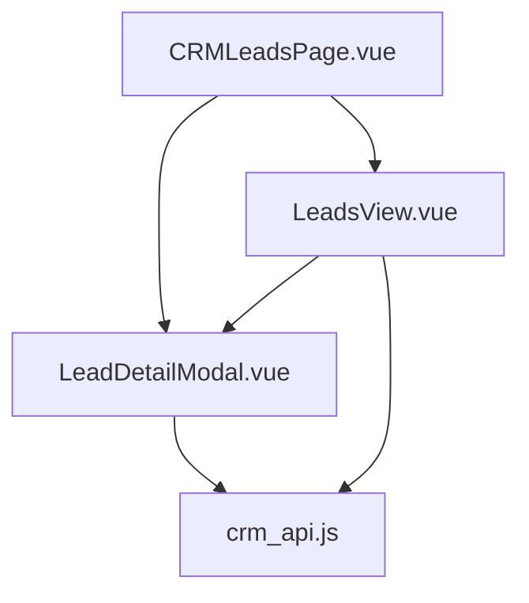
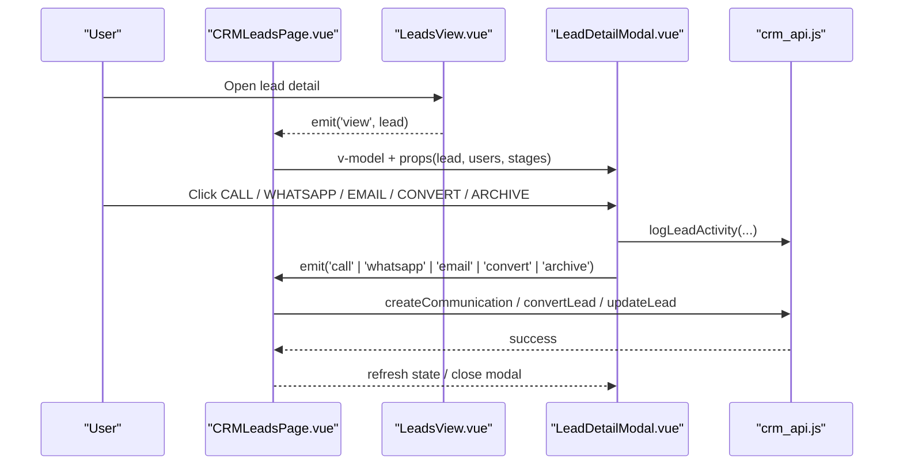
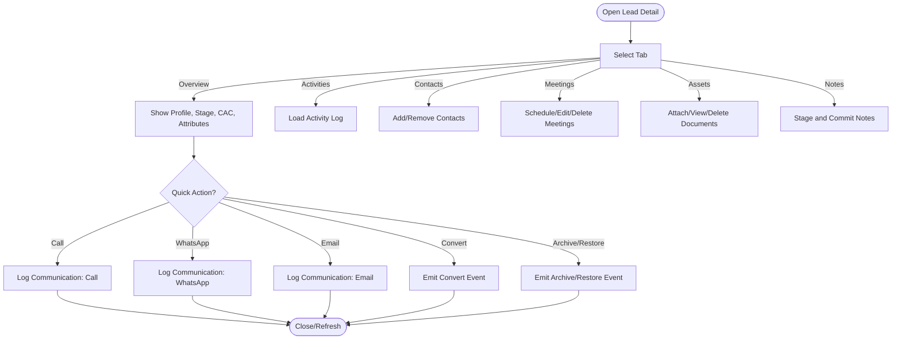
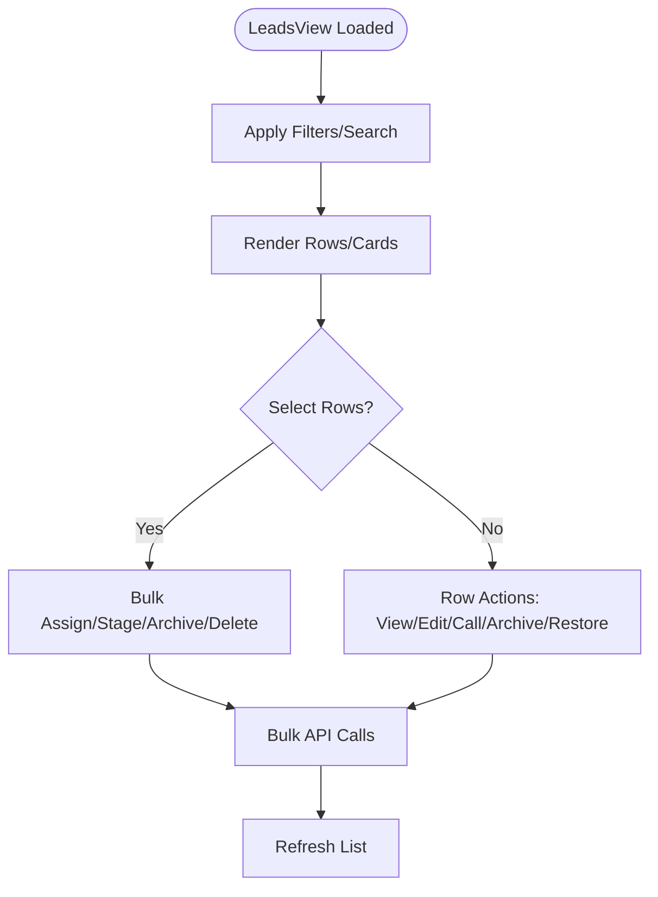
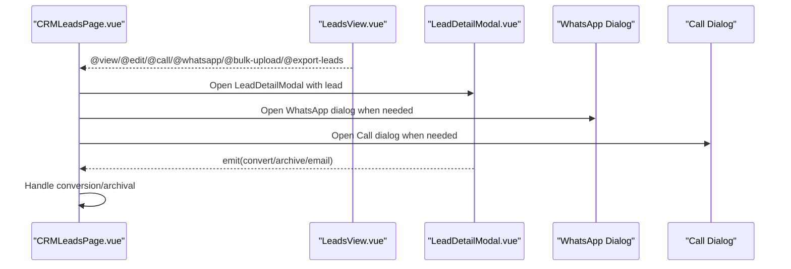
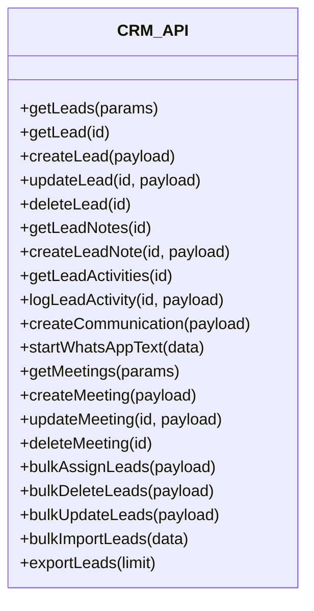

# Lead Detail Management

<cite>
**Referenced Files in This Document**
- [LeadDetailModal.vue](file://src/views/Modules/crm/components/LeadDetailModal.vue)
- [LeadsView.vue](file://src/views/Modules/crm/components/LeadsView.vue)
- [CRMLeadsPage.vue](file://src/views/Modules/crm/CRMLeadsPage.vue)
- [crm_api.js](file://src/services/crm_api.js)
</cite>

## Table of Contents
1. Introduction
2. Project Structure
3. Core Components
4. Architecture Overview
5. Detailed Component Analysis
6. Dependency Analysis
7. Performance Considerations
8. Troubleshooting Guide
9. Conclusion

## Introduction
This document explains the lead detail management capabilities in the CRM module, focusing on the lead detail modal interface and its view, edit, delete, and archive operations. It also covers the lead lifecycle from active to archived states, status transitions, data persistence patterns, communication integrations (call, WhatsApp, email), bulk operations, lead scoring and qualification cues, automated status updates via business rules, customization of lead fields, managing lead history, and guidance for implementing quality scoring algorithms.

## Project Structure
The lead detail experience is composed of:
- A page-level container that hosts views and modals
- A list view with filtering, selection, and bulk actions
- A detail modal with tabs for overview, activities, contacts, meetings, assets, and notes
- An API service layer for CRUD, communications, activities, meetings, and bulk operations

**Diagram sources**
- [CRMLeadsPage.vue:85-112](file://src/views/Modules/crm/CRMLeadsPage.vue#L85-L112)
- [LeadsView.vue:103-146](file://src/views/Modules/crm/components/LeadsView.vue#L103-L146)
- [LeadDetailModal.vue:881-888](file://src/views/Modules/crm/components/LeadDetailModal.vue#L881-L888)
- [crm_api.js:46-108](file://src/services/crm_api.js#L46-L108)

**Section sources**
- [CRMLeadsPage.vue:85-112](file://src/views/Modules/crm/CRMLeadsPage.vue#L85-L112)
- [LeadsView.vue:103-146](file://src/views/Modules/crm/components/LeadsView.vue#L103-L146)
- [LeadDetailModal.vue:881-888](file://src/views/Modules/crm/components/LeadDetailModal.vue#L881-L888)
- [crm_api.js:46-108](file://src/services/crm_api.js#L46-L108)

## Core Components
- LeadDetailModal: Central UI for viewing and editing a single lead, managing activities, notes, documents, meetings, contacts, and performing quick actions like call, WhatsApp, email, convert, archive/restore.
- LeadsView: List/table/card view of leads with search, filters, KPIs, bulk assign, stage changes, archive/restore, delete, export, and Excel-style inline editing.
- CRMLeadsPage: Orchestrates routing, global state, and modals; wires events from LeadsView and LeadDetailModal to handlers for conversion, calling, messaging, and archival.
- crm_api.js: HTTP client wrappers for leads, communications, activities, meetings, notes, bulk operations, import/export, and metadata.

Key responsibilities:
- View/Edit/Delete/Archive: Supported by modal and list actions emitting events handled at the page level and persisted via API calls.
- Lifecycle: Active vs Archived toggles in the page header and list; restore and archive flows are exposed in both places.
- Communications: Call, WhatsApp, Email quick actions log activities and open external channels or dialogs.
- Meetings: Schedule, edit, delete meetings linked to a lead with location and distance features.
- Notes & Documents: Staged notes and files can be committed together; documents are linked to the lead record.
- Bulk Operations: Assign, stage, archive/restore, delete, and update multiple leads at once.

**Section sources**
- [LeadDetailModal.vue:1-120](file://src/views/Modules/crm/components/LeadDetailModal.vue#L1-L120)
- [LeadDetailModal.vue:762-783](file://src/views/Modules/crm/components/LeadDetailModal.vue#L762-L783)
- [LeadsView.vue:103-146](file://src/views/Modules/crm/components/LeadsView.vue#L103-L146)
- [LeadsView.vue:498-590](file://src/views/Modules/crm/components/LeadsView.vue#L498-L590)
- [CRMLeadsPage.vue:85-112](file://src/views/Modules/crm/CRMLeadsPage.vue#L85-L112)
- [crm_api.js:46-108](file://src/services/crm_api.js#L46-L108)

## Architecture Overview
The flow starts in the page component, which renders the list and conditionally opens the detail modal. The modal emits events for user actions; the page handles them and delegates to the API service for persistence. Activities and communications are logged to maintain an auditable history.

**Diagram sources**
- [CRMLeadsPage.vue:85-112](file://src/views/Modules/crm/CRMLeadsPage.vue#L85-L112)
- [LeadDetailModal.vue:1104-1168](file://src/views/Modules/crm/components/LeadDetailModal.vue#L1104-L1168)
- [crm_api.js:145-194](file://src/services/crm_api.js#L145-L194)
- [crm_api.js:217-226](file://src/services/crm_api.js#L217-L226)

## Detailed Component Analysis

### LeadDetailModal: View, Edit, Delete, Archive, Convert
- Tabs: Overview, Activities, Contacts, Meetings, Assets, Notes.
- Quick Actions: Call, WhatsApp, Mail, Convert (when not archived), Restore (when archived).
- Stage Progress: Visualized using pipeline stages passed as props; progress computed from current stage index.
- CAC (Customer Acquisition Cost): Inline editable with save and adjust (+/-) operations; logs activity on change.
- Notes: Staging and batch commit; each note saved individually and activity logged.
- Documents: Linked via a widget; upload and deletion trigger activity logging.
- Meetings: Create/edit/delete with location search and distance calculation; supports in-person meetings and directions.
- Export: Generates PDF/DOCX/XLSX reports consolidating lead profile, timeline, activities, communications, documents, meetings, and CAC summary.

**Diagram sources**
- [LeadDetailModal.vue:48-78](file://src/views/Modules/crm/components/LeadDetailModal.vue#L48-L78)
- [LeadDetailModal.vue:98-272](file://src/views/Modules/crm/components/LeadDetailModal.vue#L98-L272)
- [LeadDetailModal.vue:274-364](file://src/views/Modules/crm/components/LeadDetailModal.vue#L274-L364)
- [LeadDetailModal.vue:426-691](file://src/views/Modules/crm/components/LeadDetailModal.vue#L426-L691)
- [LeadDetailModal.vue:693-757](file://src/views/Modules/crm/components/LeadDetailModal.vue#L693-L757)
- [LeadDetailModal.vue:1104-1168](file://src/views/Modules/crm/components/LeadDetailModal.vue#L1104-L1168)

**Section sources**
- [LeadDetailModal.vue:48-78](file://src/views/Modules/crm/components/LeadDetailModal.vue#L48-L78)
- [LeadDetailModal.vue:98-272](file://src/views/Modules/crm/components/LeadDetailModal.vue#L98-L272)
- [LeadDetailModal.vue:274-364](file://src/views/Modules/crm/components/LeadDetailModal.vue#L274-L364)
- [LeadDetailModal.vue:426-691](file://src/views/Modules/crm/components/LeadDetailModal.vue#L426-L691)
- [LeadDetailModal.vue:693-757](file://src/views/Modules/crm/components/LeadDetailModal.vue#L693-L757)
- [LeadDetailModal.vue:1104-1168](file://src/views/Modules/crm/components/LeadDetailModal.vue#L1104-L1168)

### LeadsView: Filtering, Selection, Bulk Operations, Excel Editing
- Filters: Search, priority (hot/warm/cold), activity status (touched/untouched), stage, date range, assignee, source, group, tag.
- KPIs: Total, hot, warm, cold counts; auto-assign card showing stale/unassigned count.
- Bulk Actions: Select all, assign to user, change stage, archive/restore, delete permanently.
- Excel Edit Mode: Inline cell editing for key fields; save-all commits changes.
- Export: Triggers export handler to the page.

**Diagram sources**
- [LeadsView.vue:103-146](file://src/views/Modules/crm/components/LeadsView.vue#L103-L146)
- [LeadsView.vue:234-488](file://src/views/Modules/crm/components/LeadsView.vue#L234-L488)
- [LeadsView.vue:498-590](file://src/views/Modules/crm/components/LeadsView.vue#L498-L590)
- [LeadsView.vue:631-800](file://src/views/Modules/crm/components/LeadsView.vue#L631-L800)

**Section sources**
- [LeadsView.vue:103-146](file://src/views/Modules/crm/components/LeadsView.vue#L103-L146)
- [LeadsView.vue:234-488](file://src/views/Modules/crm/components/LeadsView.vue#L234-L488)
- [LeadsView.vue:498-590](file://src/views/Modules/crm/components/LeadsView.vue#L498-L590)
- [LeadsView.vue:631-800](file://src/views/Modules/crm/components/LeadsView.vue#L631-L800)

### CRMLeadsPage: Orchestration and Modals
- Hosts LeadsView and passes users, branch context, and event handlers.
- Manages modals: LeadDetailModal, BulkUploadLeadsModal, LeadConversionModal, DocumentUploadModal.
- Wires events: view, edit, call, whatsapp, lead-changed, add-lead, bulk-upload, export-leads.
- Provides call and WhatsApp dialog UIs with talking points and outcome logging.

**Diagram sources**
- [CRMLeadsPage.vue:85-112](file://src/views/Modules/crm/CRMLeadsPage.vue#L85-L112)
- [CRMLeadsPage.vue:653-793](file://src/views/Modules/crm/CRMLeadsPage.vue#L653-L793)

**Section sources**
- [CRMLeadsPage.vue:85-112](file://src/views/Modules/crm/CRMLeadsPage.vue#L85-L112)
- [CRMLeadsPage.vue:653-793](file://src/views/Modules/crm/CRMLeadsPage.vue#L653-L793)

### Data Persistence and APIs
- Lead CRUD: getLeads, getLead, createLead, updateLead, deleteLead.
- Communications: createCommunication, startWhatsAppText/Audio/Video, patch/delete communication.
- Activities: getLeadActivities, logLeadActivity.
- Notes: getLeadNotes, createLeadNote, deleteLeadNote.
- Meetings: getMeetings, createMeeting, updateMeeting, deleteMeeting.
- Bulk: bulkAssignLeads, bulkDeleteLeads, bulkUpdateLeads.
- Import/Export: bulkImportLeads, exportLeads, uploadLeadsBulkFile, processLeadsBulkUpload, downloadLeadTemplate.
- Metadata: getCRMMetadata, updateCRMMetadata.

**Diagram sources**
- [crm_api.js:46-108](file://src/services/crm_api.js#L46-L108)
- [crm_api.js:145-194](file://src/services/crm_api.js#L145-L194)
- [crm_api.js:217-226](file://src/services/crm_api.js#L217-L226)
- [crm_api.js:587-620](file://src/services/crm_api.js#L587-L620)
- [crm_api.js:622-645](file://src/services/crm_api.js#L622-L645)
- [crm_api.js:718-746](file://src/services/crm_api.js#L718-L746)
- [crm_api.js:305-319](file://src/services/crm_api.js#L305-L319)

**Section sources**
- [crm_api.js:46-108](file://src/services/crm_api.js#L46-L108)
- [crm_api.js:145-194](file://src/services/crm_api.js#L145-L194)
- [crm_api.js:217-226](file://src/services/crm_api.js#L217-L226)
- [crm_api.js:587-620](file://src/services/crm_api.js#L587-L620)
- [crm_api.js:622-645](file://src/services/crm_api.js#L622-L645)
- [crm_api.js:718-746](file://src/services/crm_api.js#L718-L746)
- [crm_api.js:305-319](file://src/services/crm_api.js#L305-L319)

## Dependency Analysis
- LeadDetailModal depends on:
  - crm_api.js for activities, notes, communications, and lead updates
  - documents_api.js for linked documents
  - decodeJWT and usePreferences/useRBAC for tenant/user context and permissions
- LeadsView depends on:
  - crm_api.js for bulk operations and metadata
  - Emits events to CRMLeadsPage for orchestration
- CRMLeadsPage depends on:
  - All child components and modals
  - Handles cross-cutting concerns like routing and global state

Potential coupling:
- Heavy reliance on crm_api.js for all backend interactions; centralizing error handling here reduces duplication.
- Modal-to-page event emission pattern keeps UI decoupled but requires careful prop/event contracts.

Circular dependencies:
- None observed; clear separation between page, view, modal, and service layers.

External integrations:
- WhatsApp web links opened via window.open
- PDF/DOCX/XLSX exports generated client-side

**Section sources**
- [LeadDetailModal.vue:873-879](file://src/views/Modules/crm/components/LeadDetailModal.vue#L873-L879)
- [LeadDetailModal.vue:1104-1168](file://src/views/Modules/crm/components/LeadDetailModal.vue#L1104-L1168)
- [crm_api.js:166-190](file://src/services/crm_api.js#L166-L190)

## Performance Considerations
- Lazy loading: Activities and notes load on tab activation to reduce initial payload.
- Pagination and per-page controls in LeadsView improve rendering performance for large datasets.
- Client-side report generation uses dynamic imports for heavy libraries (e.g., jsPDF) to avoid blocking.
- Debouncing or throttling could be added to search/filter inputs if latency becomes noticeable.
- Batch operations minimize network round-trips for bulk updates.

[No sources needed since this section provides general guidance]

## Troubleshooting Guide
Common issues and resolutions:
- Failed to save CAC or notes: Check network errors and ensure tenant_id is present; verify API endpoints return success.
- Activities not updating: Ensure logLeadActivity is called before refreshing the activities list; confirm activeTab is set to activities when reloading.
- WhatsApp link not opening: Validate phone number formatting; ensure no invalid characters remain.
- Meeting creation fails: Verify required fields (title, start/end datetime) and location coordinates if applicable.
- Bulk operations fail: Confirm selected lead IDs and tenant context; check server responses for validation errors.

Error handling patterns:
- API wrapper normalizes errors and includes status codes and response payloads.
- Modal confirm dialogs prevent accidental destructive actions.

**Section sources**
- [crm_api.js:11-32](file://src/services/crm_api.js#L11-L32)
- [LeadDetailModal.vue:896-923](file://src/views/Modules/crm/components/LeadDetailModal.vue#L896-L923)
- [LeadDetailModal.vue:1037-1067](file://src/views/Modules/crm/components/LeadDetailModal.vue#L1037-L1067)
- [LeadDetailModal.vue:1172-1559](file://src/views/Modules/crm/components/LeadDetailModal.vue#L1172-L1559)

## Conclusion
The lead detail management system provides a comprehensive interface for viewing and editing leads, tracking activities, scheduling meetings, linking documents, and communicating via call, WhatsApp, and email. It supports full lifecycle management from active to archived states, robust bulk operations, and detailed reporting. The architecture cleanly separates concerns across page, view, modal, and service layers, enabling extensibility for custom fields, scoring algorithms, and automated status updates based on business rules.

[No sources needed since this section summarizes without analyzing specific files]