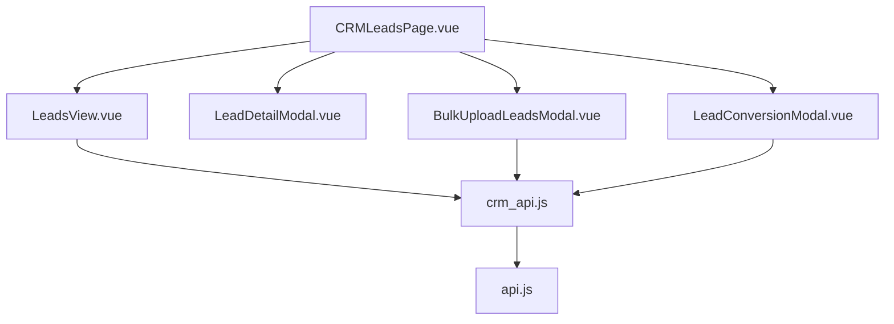
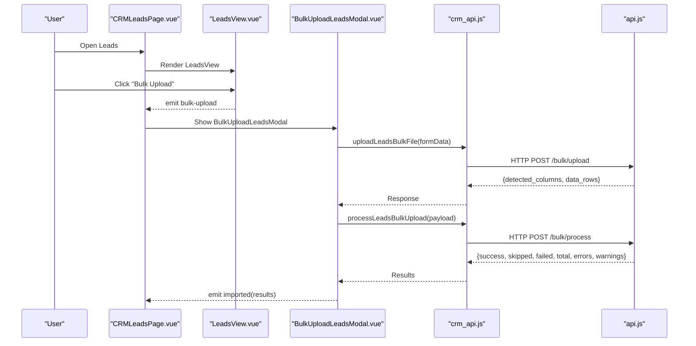
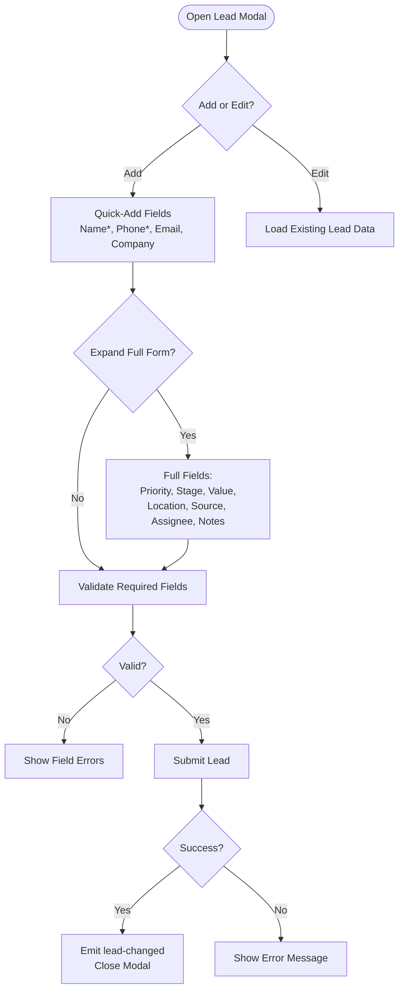
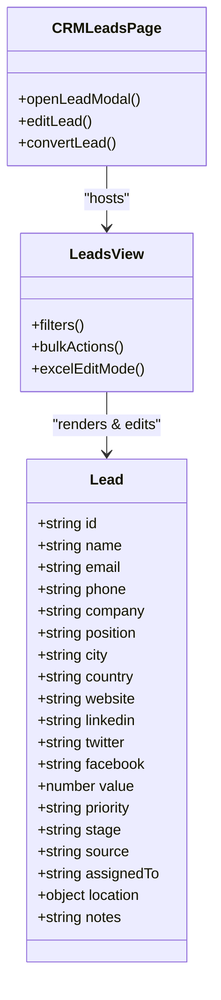
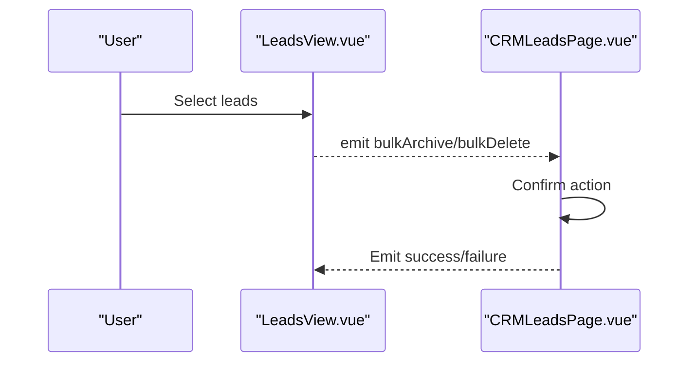
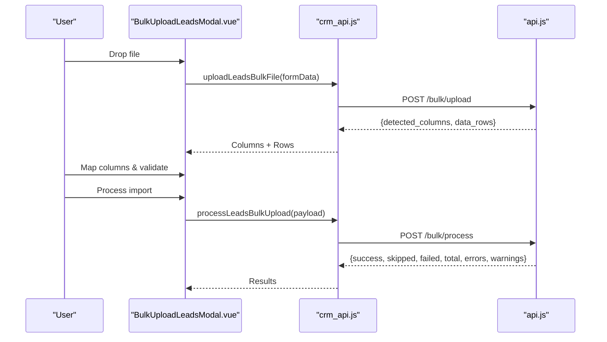
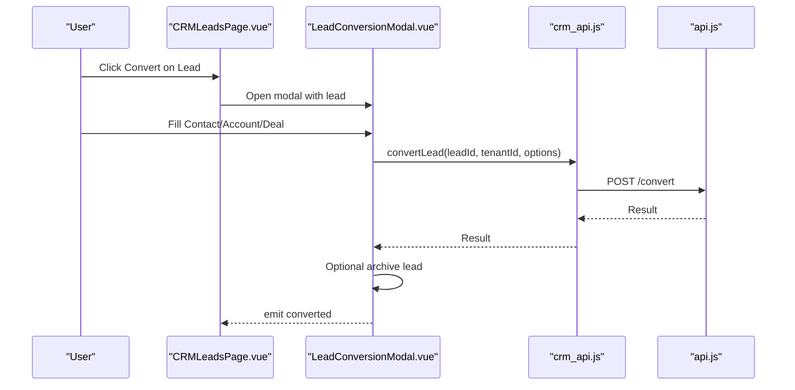
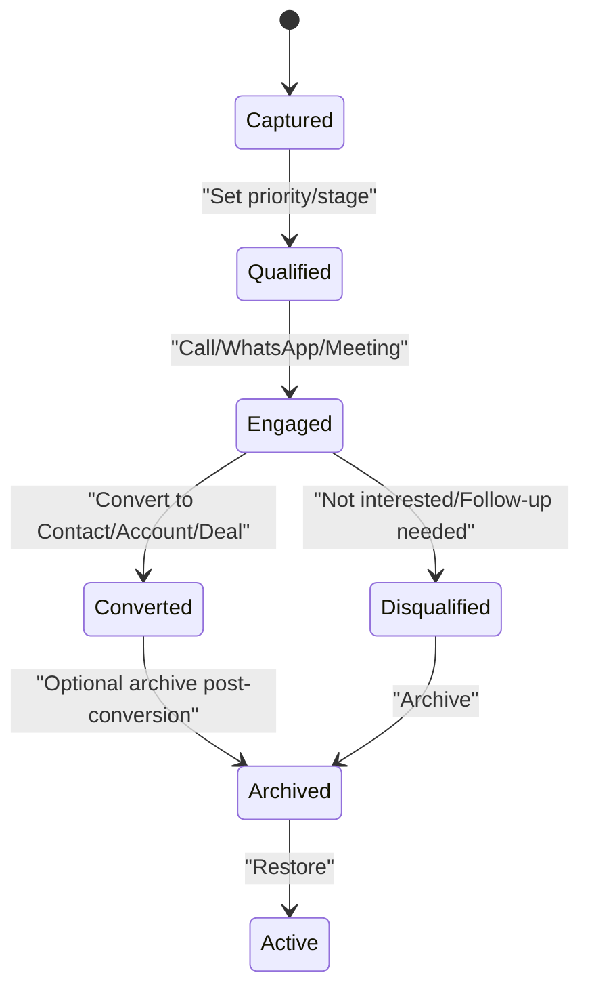
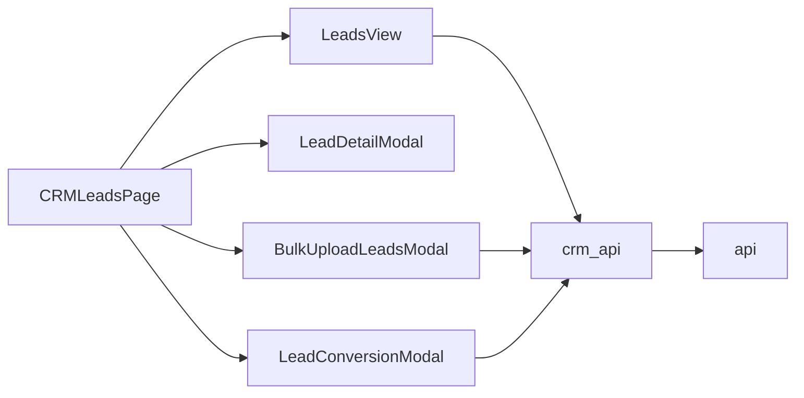

# Lead Management

<cite>
**Referenced Files in This Document**
- [CRMLeadsPage.vue](file://src/views/Modules/crm/CRMLeadsPage.vue)
- [LeadsView.vue](file://src/views/Modules/crm/components/LeadsView.vue)
- [LeadDetailModal.vue](file://src/views/Modules/crm/components/LeadDetailModal.vue)
- [BulkUploadLeadsModal.vue](file://src/views/Modules/crm/components/BulkUploadLeadsModal.vue)
- [ImportLeadsModal.vue](file://src/views/Modules/crm/components/ImportLeadsModal.vue)
- [LeadConversionModal.vue](file://src/views/Modules/crm/components/LeadConversionModal.vue)
- [crm_api.js](file://src/services/crm_api.js)
- [api.js](file://src/services/api.js)
</cite>

## Table of Contents
1. Introduction
2. Project Structure
3. Core Components
4. Architecture Overview
5. Detailed Component Analysis
6. Dependency Analysis
7. Performance Considerations
8. Troubleshooting Guide
9. Conclusion
10. Appendices

## Introduction
This document explains the lead management system implemented in the CRM module. It covers how leads are created, edited, and deleted; form validation and field definitions; data binding patterns; status and assignment workflows; conversion to contacts, accounts, and deals; bulk upload and import capabilities; and lifecycle management from capture through conversion or disqualification. Concrete examples reference actual components and services used in the codebase.

## Project Structure
The lead management feature is centered around a page-level view and several reusable components:
- Page orchestration and modal wiring: CRMLeadsPage.vue
- Lead list, filters, bulk actions, and Excel edit mode: LeadsView.vue
- Lead detail view with activities, meetings, notes, and assets: LeadDetailModal.vue
- Bulk upload wizard with column mapping and preview: BulkUploadLeadsModal.vue
- Generic import modal wrapper: ImportLeadsModal.vue
- Conversion wizard to create contact/account/deal: LeadConversionModal.vue
- API integration for CRM operations: crm_api.js and api.js

**Diagram sources**
- [CRMLeadsPage.vue:85-112](file://src/views/Modules/crm/CRMLeadsPage.vue#L85-L112)
- [LeadsView.vue:112-145](file://src/views/Modules/crm/components/LeadsView.vue#L112-L145)
- [BulkUploadLeadsModal.vue:622-643](file://src/views/Modules/crm/components/BulkUploadLeadsModal.vue#L622-L643)
- [LeadConversionModal.vue:552-590](file://src/views/Modules/crm/components/LeadConversionModal.vue#L552-L590)
- [crm_api.js:1-200](file://src/services/crm_api.js#L1-L200)
- [api.js:1-200](file://src/services/api.js#L1-L200)

**Section sources**
- [CRMLeadsPage.vue:1-112](file://src/views/Modules/crm/CRMLeadsPage.vue#L1-L112)
- [LeadsView.vue:1-145](file://src/views/Modules/crm/components/LeadsView.vue#L1-L145)
- [BulkUploadLeadsModal.vue:1-115](file://src/views/Modules/crm/components/BulkUploadLeadsModal.vue#L1-L115)
- [LeadConversionModal.vue:1-77](file://src/views/Modules/crm/components/LeadConversionModal.vue#L1-L77)
- [crm_api.js:1-200](file://src/services/crm_api.js#L1-L200)
- [api.js:1-200](file://src/services/api.js#L1-L200)

## Core Components
- CRMLeadsPage.vue: Hosts the Leads view, opens modals for add/edit, detail, bulk upload, and conversion, and wires events like view, edit, call, whatsapp, export, and lead-changed.
- LeadsView.vue: Provides search, filters (priority, stage, source, assignee, date range), KPIs, bulk actions (assign, stage, archive/restore, delete), Excel inline editing, and export.
- LeadDetailModal.vue: Shows overview, attributes, map, notes, activities timeline, meetings scheduling, and asset linkage. Supports edit, convert, archive, and delete via emitted events.
- BulkUploadLeadsModal.vue: Step-by-step wizard for file upload, column mapping, preview/edit, duplicate detection, and final import.
- ImportLeadsModal.vue: Simple container modal for embedding import flows.
- LeadConversionModal.vue: Four-step wizard to create/link Contact, Account, and Deal, then confirm conversion.

Key responsibilities and interactions are demonstrated by event emissions and API calls within these files.

**Section sources**
- [CRMLeadsPage.vue:85-112](file://src/views/Modules/crm/CRMLeadsPage.vue#L85-L112)
- [LeadsView.vue:112-145](file://src/views/Modules/crm/components/LeadsView.vue#L112-L145)
- [LeadDetailModal.vue:48-78](file://src/views/Modules/crm/components/LeadDetailModal.vue#L48-L78)
- [BulkUploadLeadsModal.vue:22-115](file://src/views/Modules/crm/components/BulkUploadLeadsModal.vue#L22-L115)
- [LeadConversionModal.vue:53-77](file://src/views/Modules/crm/components/LeadConversionModal.vue#L53-L77)

## Architecture Overview
The lead management UI follows a component-driven architecture with clear separation between presentation and data flow:
- The page orchestrates user actions and modal visibility.
- Views handle filtering, selection, and bulk operations.
- Modals encapsulate complex workflows (detail, upload, conversion).
- Services abstract API calls to backend endpoints.

**Diagram sources**
- [CRMLeadsPage.vue:95-109](file://src/views/Modules/crm/CRMLeadsPage.vue#L95-L109)
- [LeadsView.vue:121-128](file://src/views/Modules/crm/components/LeadsView.vue#L121-L128)
- [BulkUploadLeadsModal.vue:622-643](file://src/views/Modules/crm/components/BulkUploadLeadsModal.vue#L622-L643)
- [crm_api.js:1-200](file://src/services/crm_api.js#L1-L200)
- [api.js:1-200](file://src/services/api.js#L1-L200)

## Detailed Component Analysis

### Lead Creation and Editing Workflow
- Entry points:
  - Add lead: LeadsView emits add-lead; CRMLeadsPage opens an inline modal with a compact quick-add form that expands to full fields.
  - Edit lead: Detail modal triggers edit; same modal reuses the form pre-populated with existing data.
- Form fields include identity, contact, organization, pipeline status, valuation, location, acquisition source, assignment, and notes. Data binding uses v-model on a leadForm object.
- Validation:
  - Required fields enforced at the UI level (e.g., name and phone required in quick-add; email validated if provided).
  - Location coordinates rounded on blur; optional map search and current location capture supported.
- Submission:
  - Submit handler persists changes via service layer (not shown here) and emits lead-changed to refresh lists.

**Diagram sources**
- [CRMLeadsPage.vue:117-648](file://src/views/Modules/crm/CRMLeadsPage.vue#L117-L648)

**Section sources**
- [CRMLeadsPage.vue:117-648](file://src/views/Modules/crm/CRMLeadsPage.vue#L117-L648)

### Lead Status Management and Assignment Rules
- Status and priority:
  - Priority options: hot, warm, cold.
  - Stage selection driven by available pipeline stages.
  - Filters allow quick filtering by priority, stage, source, assignee, and date range.
- Assignment:
  - In-form assignment dropdown with search and role display.
  - Bulk assignment via LeadsView’s “Assign To” dropdown with user search.
- Auto-assign:
  - A dedicated card invites users to auto-assign unassigned leads and escalate stale ones using round-robin logic (UI entry point present).

**Diagram sources**
- [CRMLeadsPage.vue:85-112](file://src/views/Modules/crm/CRMLeadsPage.vue#L85-L112)
- [LeadsView.vue:234-488](file://src/views/Modules/crm/components/LeadsView.vue#L234-L488)

**Section sources**
- [LeadsView.vue:153-232](file://src/views/Modules/crm/components/LeadsView.vue#L153-L232)
- [LeadsView.vue:234-488](file://src/views/Modules/crm/components/LeadsView.vue#L234-L488)
- [CRMLeadsPage.vue:485-533](file://src/views/Modules/crm/CRMLeadsPage.vue#L485-L533)

### Lead Deletion and Archiving
- Single record:
  - Detail modal supports Archive and Delete actions via emitted events handled by the parent page.
- Bulk operations:
  - LeadsView provides bulk Archive, Restore (for archived view), and Delete actions with confirmation flows.

**Diagram sources**
- [LeadsView.vue:518-588](file://src/views/Modules/crm/components/LeadsView.vue#L518-L588)
- [CRMLeadsPage.vue:103-105](file://src/views/Modules/crm/CRMLeadsPage.vue#L103-L105)

**Section sources**
- [LeadsView.vue:518-588](file://src/views/Modules/crm/components/LeadsView.vue#L518-L588)
- [CRMLeadsPage.vue:103-105](file://src/views/Modules/crm/CRMLeadsPage.vue#L103-L105)

### Bulk Upload and Import Capabilities
- File upload:
  - Drag-and-drop or browse for .xlsx/.xls/.csv/.ods.
  - Template download available to ensure correct format.
- Column mapping:
  - Detected columns displayed with sample data.
  - Auto-detect mapping based on common column names; manual override supported.
- Preview and validation:
  - Editable table shows mapped values with row-level validation (email format, presence checks).
  - Duplicate detection highlights potential duplicates; invalid rows flagged.
- Import execution:
  - Sends payload with column_mapping, data_rows, skip_duplicates flag, and branch_id to backend.
  - Displays results summary including successes, skips, failures, and error/warning logs.

**Diagram sources**
- [BulkUploadLeadsModal.vue:22-115](file://src/views/Modules/crm/components/BulkUploadLeadsModal.vue#L22-L115)
- [BulkUploadLeadsModal.vue:116-207](file://src/views/Modules/crm/components/BulkUploadLeadsModal.vue#L116-L207)
- [BulkUploadLeadsModal.vue:209-380](file://src/views/Modules/crm/components/BulkUploadLeadsModal.vue#L209-L380)
- [BulkUploadLeadsModal.vue:622-643](file://src/views/Modules/crm/components/BulkUploadLeadsModal.vue#L622-L643)
- [crm_api.js:1-200](file://src/services/crm_api.js#L1-L200)
- [api.js:1-200](file://src/services/api.js#L1-L200)

**Section sources**
- [BulkUploadLeadsModal.vue:22-115](file://src/views/Modules/crm/components/BulkUploadLeadsModal.vue#L22-L115)
- [BulkUploadLeadsModal.vue:116-207](file://src/views/Modules/crm/components/BulkUploadLeadsModal.vue#L116-L207)
- [BulkUploadLeadsModal.vue:209-380](file://src/views/Modules/crm/components/BulkUploadLeadsModal.vue#L209-L380)
- [BulkUploadLeadsModal.vue:622-643](file://src/views/Modules/crm/components/BulkUploadLeadsModal.vue#L622-L643)
- [ImportLeadsModal.vue:1-23](file://src/views/Modules/crm/components/ImportLeadsModal.vue#L1-L23)

### Lead Conversion to Contacts, Accounts, and Deals
- Conversion modal steps:
  1) Contact: Create new, link existing, or skip.
  2) Account: Create new, link existing, or skip.
  3) Deal: Edit auto-created deal details (name, value, stage, probability, close date, description).
  4) Review & Confirm: Summary of selections and final conversion.
- Data binding:
  - Pre-fills contact/account/deal data from lead properties.
  - Validates required fields before submission.
- Conversion execution:
  - Calls convertLead API with options to create/link entities and set convertedStatus.
  - Optionally archives the converted lead after successful conversion.
  - Emits CRM events to refresh related views.

**Diagram sources**
- [CRMLeadsPage.vue:103-112](file://src/views/Modules/crm/CRMLeadsPage.vue#L103-L112)
- [LeadConversionModal.vue:53-77](file://src/views/Modules/crm/components/LeadConversionModal.vue#L53-L77)
- [LeadConversionModal.vue:459-508](file://src/views/Modules/crm/components/LeadConversionModal.vue#L459-L508)
- [LeadConversionModal.vue:552-590](file://src/views/Modules/crm/components/LeadConversionModal.vue#L552-L590)
- [crm_api.js:1-200](file://src/services/crm_api.js#L1-L200)
- [api.js:1-200](file://src/services/api.js#L1-L200)

**Section sources**
- [LeadConversionModal.vue:53-77](file://src/views/Modules/crm/components/LeadConversionModal.vue#L53-L77)
- [LeadConversionModal.vue:459-508](file://src/views/Modules/crm/components/LeadConversionModal.vue#L459-L508)
- [LeadConversionModal.vue:552-590](file://src/views/Modules/crm/components/LeadConversionModal.vue#L552-L590)

### Lead Lifecycle Management
- Capture:
  - Quick-add and expanded forms support rapid capture with location and photo capture features.
- Qualification:
  - Priority and stage fields enable qualification and pipeline movement.
  - Filters and KPIs help identify hot/warm/cold leads and activity status.
- Engagement:
  - Call and WhatsApp dialogs log outcomes and durations into lead activity.
  - Meetings tab allows scheduling and geolocation planning.
- Conversion or Disqualification:
  - Conversion creates contact/account/deal and optionally archives the lead.
  - Archiving moves leads out of active scope; restore available in archived view.

[No sources needed since this diagram shows conceptual workflow, not actual code structure]

### Customizing Lead Fields, Sources, and Integrations
- Field customization:
  - The lead form includes many standard fields (identity, contact, org, pipeline, location, social links). Additional fields can be added by extending the form bindings and validation logic in the lead modal.
- Lead sources:
  - Acquisition source field supports predefined suggestions via datalist; additional sources can be typed directly.
- External integrations:
  - Integration points exist via crm_api.js for uploading templates, processing bulk imports, converting leads, and managing leads/accounts/contacts/deals. Extend with new endpoints as needed.

**Section sources**
- [CRMLeadsPage.vue:467-483](file://src/views/Modules/crm/CRMLeadsPage.vue#L467-L483)
- [BulkUploadLeadsModal.vue:533-558](file://src/views/Modules/crm/components/BulkUploadLeadsModal.vue#L533-L558)
- [crm_api.js:1-200](file://src/services/crm_api.js#L1-L200)

## Dependency Analysis
- Component coupling:
  - CRMLeadsPage depends on LeadsView for list operations and on modals for detailed workflows.
  - LeadsView depends on crm_api for data operations and exports.
  - BulkUploadLeadsModal depends on crm_api for upload and processing.
  - LeadConversionModal depends on crm_api for conversion and optional archiving.
- External dependencies:
  - Service layer abstracts HTTP requests to backend endpoints defined in api.js.

**Diagram sources**
- [CRMLeadsPage.vue:85-112](file://src/views/Modules/crm/CRMLeadsPage.vue#L85-L112)
- [LeadsView.vue:112-145](file://src/views/Modules/crm/components/LeadsView.vue#L112-L145)
- [BulkUploadLeadsModal.vue:622-643](file://src/views/Modules/crm/components/BulkUploadLeadsModal.vue#L622-L643)
- [LeadConversionModal.vue:552-590](file://src/views/Modules/crm/components/LeadConversionModal.vue#L552-L590)
- [crm_api.js:1-200](file://src/services/crm_api.js#L1-L200)
- [api.js:1-200](file://src/services/api.js#L1-L200)

**Section sources**
- [CRMLeadsPage.vue:85-112](file://src/views/Modules/crm/CRMLeadsPage.vue#L85-L112)
- [LeadsView.vue:112-145](file://src/views/Modules/crm/components/LeadsView.vue#L112-L145)
- [BulkUploadLeadsModal.vue:622-643](file://src/views/Modules/crm/components/BulkUploadLeadsModal.vue#L622-L643)
- [LeadConversionModal.vue:552-590](file://src/views/Modules/crm/components/LeadConversionModal.vue#L552-L590)
- [crm_api.js:1-200](file://src/services/crm_api.js#L1-L200)
- [api.js:1-200](file://src/services/api.js#L1-L200)

## Performance Considerations
- Filtering and pagination:
  - Use server-side filters where possible; client-side filters in LeadsView improve responsiveness for small datasets.
- Bulk uploads:
  - Limit file size and leverage template downloads to reduce mapping errors.
  - Preview step allows removing invalid/duplicate rows before committing to minimize backend load.
- Excel edit mode:
  - Batch updates reduce multiple API calls; save all changes in one operation when possible.
- Maps and media:
  - Defer map initialization until needed; compress images captured via camera to reduce payload sizes.

[No sources needed since this section provides general guidance]

## Troubleshooting Guide
- Bulk upload issues:
  - Ensure file format matches template; verify column mapping; check duplicate detection results; review error/warning logs in the results step.
- Conversion failures:
  - Validate required fields in Contact and Account steps; confirm API responses; check optional archive step errors.
- Assignment problems:
  - Verify user search returns results; ensure permissions allow assignment; check role-based restrictions in the UI.
- Data binding errors:
  - Check v-model bindings for required fields; ensure types match (numbers for value, dates for timestamps); validate email formats.

**Section sources**
- [BulkUploadLeadsModal.vue:193-207](file://src/views/Modules/crm/components/BulkUploadLeadsModal.vue#L193-L207)
- [BulkUploadLeadsModal.vue:382-439](file://src/views/Modules/crm/components/BulkUploadLeadsModal.vue#L382-L439)
- [LeadConversionModal.vue:552-590](file://src/views/Modules/crm/components/LeadConversionModal.vue#L552-L590)
- [CRMLeadsPage.vue:485-533](file://src/views/Modules/crm/CRMLeadsPage.vue#L485-L533)

## Conclusion
The lead management system provides a comprehensive workflow for capturing, qualifying, engaging, converting, and retiring leads. It supports rich data entry, robust filtering, bulk operations, and seamless conversion to downstream CRM entities. Extensibility points exist for custom fields, sources, and integrations via the service layer.

[No sources needed since this section summarizes without analyzing specific files]

## Appendices

### Lead Field Definitions (from UI)
- Identity and contact: name, email, phone, tpin/tax id, company, position
- Pipeline: priority (hot/warm/cold), stage, value, created_at backdate override
- Regional and digital: city, country, website, linkedin, twitter, facebook
- Operational: source (with suggestions), assignedTo, notes
- Geospatial: lat/lng with interactive map and location search

**Section sources**
- [CRMLeadsPage.vue:265-345](file://src/views/Modules/crm/CRMLeadsPage.vue#L265-L345)
- [CRMLeadsPage.vue:349-450](file://src/views/Modules/crm/CRMLeadsPage.vue#L349-L450)
- [CRMLeadsPage.vue:467-533](file://src/views/Modules/crm/CRMLeadsPage.vue#L467-L533)

### Bulk Upload Field Mapping (from Wizard)
- Supported mapped fields include name, email, phone, company, position, priority, stage, value, source, assignedTo, notes, dateCreated, city, country, address, website, industry, areaName, lat, lng, linkedin, twitter, facebook, instagram.

**Section sources**
- [BulkUploadLeadsModal.vue:533-558](file://src/views/Modules/crm/components/BulkUploadLeadsModal.vue#L533-L558)