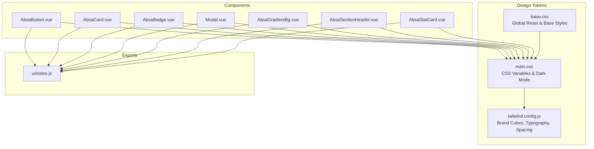
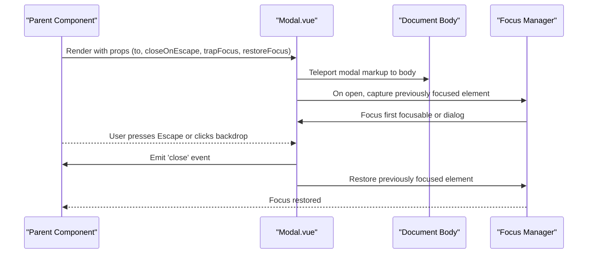
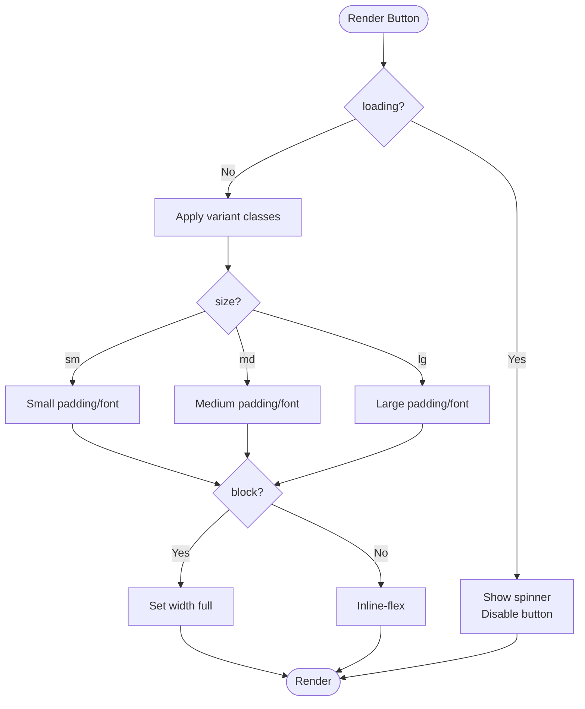
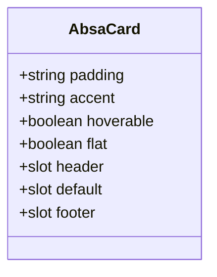
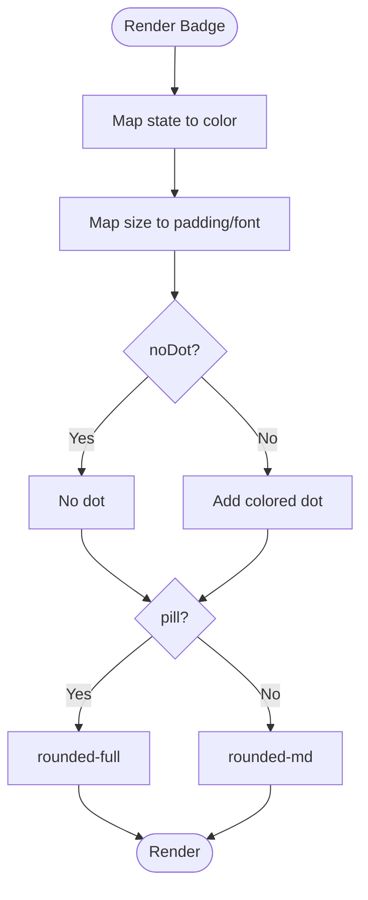
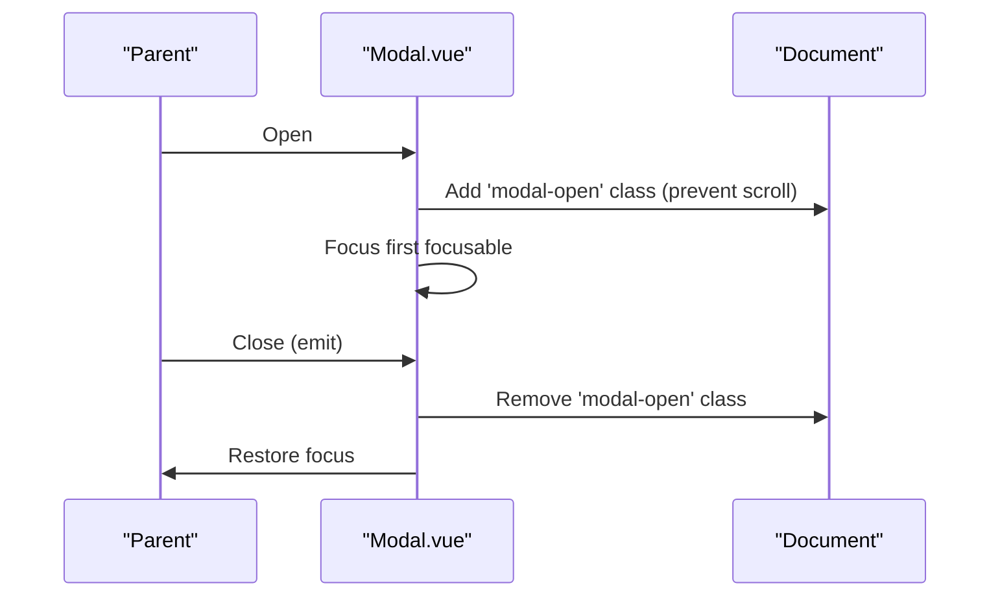
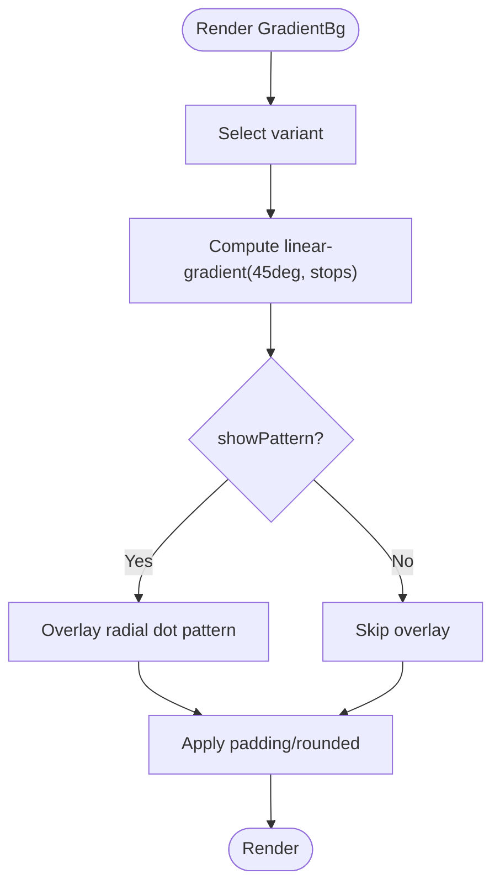
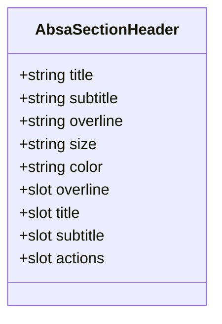
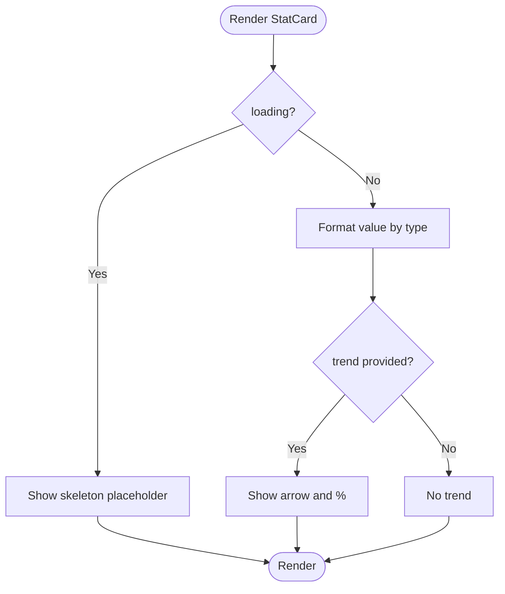
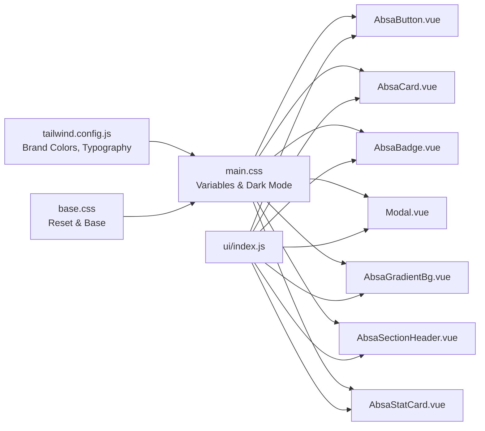

# Component Library

<cite>
**Referenced Files in This Document**
- [AbsaButton.vue](file://src/components/ui/AbsaButton.vue)
- [AbsaCard.vue](file://src/components/ui/AbsaCard.vue)
- [AbsaBadge.vue](file://src/components/ui/AbsaBadge.vue)
- [Modal.vue](file://src/components/ui/Modal.vue)
- [AbsaGradientBg.vue](file://src/components/ui/AbsaGradientBg.vue)
- [AbsaSectionHeader.vue](file://src/components/ui/AbsaSectionHeader.vue)
- [AbsaStatCard.vue](file://src/components/ui/AbsaStatCard.vue)
- [index.js](file://src/components/ui/index.js)
- [main.css](file://src/assets/main.css)
- [base.css](file://src/assets/base.css)
- [tailwind.config.js](file://tailwind.config.js)
- [Absa_colour_guideline (1).md](file://docs/Absa_colour_guideline (1).md)
</cite>

## Table of Contents
1. [Introduction](#introduction)
2. [Project Structure](#project-structure)
3. [Core Components](#core-components)
4. [Architecture Overview](#architecture-overview)
5. [Detailed Component Analysis](#detailed-component-analysis)
6. [Dependency Analysis](#dependency-analysis)
7. [Performance Considerations](#performance-considerations)
8. [Troubleshooting Guide](#troubleshooting-guide)
9. [Conclusion](#conclusion)
10. [Appendices](#appendices)

## Introduction
This document provides comprehensive documentation for the ABSA Design System component library implemented in this Vue 3 project. It covers visual appearance, behavior, and user interaction patterns for key UI components: AbsaButton, AbsaCard, AbsaBadge, Modal, and related design primitives such as AbsaGradientBg, AbsaSectionHeader, and AbsaStatCard. It also documents props, events, slots, customization options, brand color usage, typography, spacing, accessibility compliance, composition patterns with the Vue 3 Composition API, extension guidelines, cross-browser compatibility, performance optimization, and testing strategies.

## Project Structure
The design system is organized under src/components/ui with a central index that re-exports all public components. Global tokens (colors, spacing, radii, shadows, z-index) are defined in CSS variables and extended via Tailwind configuration. Brand colors and gradients are aligned to the official ABSA color guideline.

**Diagram sources**
- [AbsaButton.vue:1-101](file://src/components/ui/AbsaButton.vue#L1-L101)
- [AbsaCard.vue:1-90](file://src/components/ui/AbsaCard.vue#L1-L90)
- [AbsaBadge.vue:1-81](file://src/components/ui/AbsaBadge.vue#L1-L81)
- [Modal.vue:1-258](file://src/components/ui/Modal.vue#L1-L258)
- [AbsaGradientBg.vue:1-120](file://src/components/ui/AbsaGradientBg.vue#L1-L120)
- [AbsaSectionHeader.vue:1-83](file://src/components/ui/AbsaSectionHeader.vue#L1-L83)
- [AbsaStatCard.vue:1-87](file://src/components/ui/AbsaStatCard.vue#L1-L87)
- [index.js:1-22](file://src/components/ui/index.js#L1-L22)
- [main.css:6-87](file://src/assets/main.css#L6-L87)
- [tailwind.config.js:6-181](file://tailwind.config.js#L6-L181)
- [base.css:1-87](file://src/assets/base.css#L1-L87)

**Section sources**
- [index.js:1-22](file://src/components/ui/index.js#L1-L22)
- [main.css:6-87](file://src/assets/main.css#L6-L87)
- [tailwind.config.js:6-181](file://tailwind.config.js#L6-L181)
- [base.css:1-87](file://src/assets/base.css#L1-L87)

## Core Components
This section summarizes each core component’s purpose, props, events, slots, and behavior.

- AbsaButton
  - Purpose: Primary interactive element with brand variants, sizes, loading state, and full-width option.
  - Props: variant (absa/power/hope/outline/ghost/energy/danger), size (sm/md/lg), disabled, loading, block.
  - Events: none (uses native button behavior; emits any bound handlers via $attrs).
  - Slots: default content, icon-left, icon-right.
  - Behavior: Shows spinner when loading; disables when disabled or loading; applies focus ring using brand color; supports hover/active states per variant.

- AbsaCard
  - Purpose: Content container with accent bar, optional hover effect, header/footer slots, and flat mode.
  - Props: padding (sm/md/lg), accent (passion/power/hope/energy/none), hoverable, flat.
  - Events: none.
  - Slots: header, default content, footer.
  - Behavior: Adds subtle lift on hover unless flat; accent bar uses brand colors; accessible with aria-hidden decorative elements.

- AbsaBadge
  - Purpose: Status indicator with dot and pill/rounded styles.
  - Props: state (active/at-risk/dormant/churned/info/success/warning/error/completed/running/failed), size (sm/md), noDot, pill.
  - Events: none.
  - Slots: default content.
  - Behavior: Maps state to background/text colors; optional colored dot; pill vs rounded style.

- Modal
  - Purpose: Accessible dialog with focus management, keyboard handling, backdrop, sticky header/footer, and scroll prevention.
  - Props: to (teleport target), closeOnEscape, trapFocus, restoreFocus.
  - Events: close (emitted on backdrop click or Escape).
  - Slots: title, content, footer.
  - Behavior: Teleports to body; traps focus; restores focus on close; prevents body scroll; includes fade-in animation and custom scrollbar styling.

- AbsaGradientBg
  - Purpose: Brand-aligned gradient backgrounds with optional pattern overlay and configurable padding/rounding.
  - Props: variant (multiple predefined gradients), showPattern, padding (none/md/lg), rounded (none/md/lg/xl).
  - Events: none.
  - Slots: default content.
  - Behavior: Applies 45-degree gradients per brand guide; overlays subtle dot pattern if enabled.

- AbsaSectionHeader
  - Purpose: Section heading with vertical accent bar, overline/title/subtitle, and actions slot.
  - Props: title, subtitle, overline, size (sm/md/lg), color (passion/power/energy/hope).
  - Events: none.
  - Slots: overline, title, subtitle, actions.
  - Behavior: Dynamic heading tag based on size; accent bar width/height varies by size; color maps to brand palette.

- AbsaStatCard
  - Purpose: Metric card with label, formatted value, trend indicator, and accent bar.
  - Props: label, value, subLabel, trend, loading, accentColor, format (number/currency/percentage/raw).
  - Events: none.
  - Slots: none.
  - Behavior: Formats values per locale; shows trend arrow and percentage; skeleton loader when loading.

**Section sources**
- [AbsaButton.vue:23-99](file://src/components/ui/AbsaButton.vue#L23-L99)
- [AbsaCard.vue:38-88](file://src/components/ui/AbsaCard.vue#L38-L88)
- [AbsaBadge.vue:13-79](file://src/components/ui/AbsaBadge.vue#L13-L79)
- [Modal.vue:55-207](file://src/components/ui/Modal.vue#L55-L207)
- [AbsaGradientBg.vue:25-118](file://src/components/ui/AbsaGradientBg.vue#L25-L118)
- [AbsaSectionHeader.vue:37-81](file://src/components/ui/AbsaSectionHeader.vue#L37-L81)
- [AbsaStatCard.vue:46-85](file://src/components/ui/AbsaStatCard.vue#L46-L85)

## Architecture Overview
The design system leverages Vue 3 Composition API within single-file components, global CSS variables for theming, and Tailwind utilities for layout and styling. Brand colors are centralized in both CSS variables and Tailwind config, ensuring consistency across components. Accessibility features like focus trapping and ARIA attributes are embedded in complex components like Modal.

**Diagram sources**
- [Modal.vue:1-47](file://src/components/ui/Modal.vue#L1-L47)
- [Modal.vue:55-207](file://src/components/ui/Modal.vue#L55-L207)

## Detailed Component Analysis

### AbsaButton
- Visual Appearance:
  - Variants map to brand colors: absa (Passion), power (Power), hope (Hope), outline (Passion border), ghost (transparent with hover), energy (Energy), danger (red).
  - Sizes: sm/md/lg with consistent padding and font sizing.
  - Full-width support via block prop.
- Behavior:
  - Loading state shows spinner and disables interactions.
  - Focus ring uses brand color variable for accessibility.
- Customization:
  - Use slots for icons; pass additional attributes via $attrs.
- Usage Example Paths:
  - See component template and script setup for implementation details.

**Diagram sources**
- [AbsaButton.vue:23-99](file://src/components/ui/AbsaButton.vue#L23-L99)

**Section sources**
- [AbsaButton.vue:1-101](file://src/components/ui/AbsaButton.vue#L1-L101)

### AbsaCard
- Visual Appearance:
  - Accent bar at top using brand colors; optional hover gradient overlay; shadow and border styling.
- Behavior:
  - Hoverable adds lift and gradient; flat removes shadow and lightens border.
- Customization:
  - Padding levels; accent color selection; header/footer slots for structured layouts.
- Usage Example Paths:
  - Refer to component template and computed classes.

**Diagram sources**
- [AbsaCard.vue:38-88](file://src/components/ui/AbsaCard.vue#L38-L88)

**Section sources**
- [AbsaCard.vue:1-90](file://src/components/ui/AbsaCard.vue#L1-L90)

### AbsaBadge
- Visual Appearance:
  - Pill or rounded shape with optional colored dot; state-driven colors.
- Behavior:
  - Maps state to semantic colors; supports small and medium sizes.
- Customization:
  - Toggle dot visibility; choose pill vs rounded.
- Usage Example Paths:
  - See state mapping and size classes.

**Diagram sources**
- [AbsaBadge.vue:13-79](file://src/components/ui/AbsaBadge.vue#L13-L79)

**Section sources**
- [AbsaBadge.vue:1-81](file://src/components/ui/AbsaBadge.vue#L1-L81)

### Modal
- Visual Appearance:
  - Backdrop with dimming; sticky header/footer; top accent bar; subtle dotted pattern overlay; fade-in animation.
- Behavior:
  - Teleports to body; traps focus; handles Escape to close; restores focus on close; prevents body scroll while open.
- Customization:
  - Configure teleport target; enable/disable focus trapping and escape-to-close; provide title/content/footer slots.
- Accessibility:
  - role="dialog", aria-modal="true", tabindex="-1", focus management, keyboard navigation.
- Usage Example Paths:
  - See event handling and lifecycle hooks.

**Diagram sources**
- [Modal.vue:1-47](file://src/components/ui/Modal.vue#L1-L47)
- [Modal.vue:55-207](file://src/components/ui/Modal.vue#L55-L207)

**Section sources**
- [Modal.vue:1-258](file://src/components/ui/Modal.vue#L1-L258)

### AbsaGradientBg
- Visual Appearance:
  - Predefined brand-aligned gradients; optional subtle pattern overlay; configurable padding and rounding.
- Behavior:
  - Applies 45-degree gradients per brand guide; overlays radial dot pattern when enabled.
- Customization:
  - Choose gradient variant; toggle pattern; adjust padding and border radius.
- Usage Example Paths:
  - See gradient definitions and computed styles.

**Diagram sources**
- [AbsaGradientBg.vue:25-118](file://src/components/ui/AbsaGradientBg.vue#L25-L118)

**Section sources**
- [AbsaGradientBg.vue:1-120](file://src/components/ui/AbsaGradientBg.vue#L1-L120)

### AbsaSectionHeader
- Visual Appearance:
  - Vertical accent bar with brand color; dynamic heading tag based on size; overline/title/subtitle structure.
- Behavior:
  - Adjusts bar width/height and heading tag based on size prop; supports actions slot.
- Customization:
  - Title/subtitle/overline text; size and color variants; actions slot for controls.
- Usage Example Paths:
  - See computed classes and slot bindings.

**Diagram sources**
- [AbsaSectionHeader.vue:37-81](file://src/components/ui/AbsaSectionHeader.vue#L37-L81)

**Section sources**
- [AbsaSectionHeader.vue:1-83](file://src/components/ui/AbsaSectionHeader.vue#L1-L83)

### AbsaStatCard
- Visual Appearance:
  - Top accent bar; label with uppercase tracking; large value display; trend indicator with arrow; sub-label.
- Behavior:
  - Formats values based on locale and format type; shows skeleton loader when loading; displays trend percentage and direction.
- Customization:
  - Label/value/subLabel; trend; loading state; accentColor; format type.
- Usage Example Paths:
  - See formatting logic and computed wrapper class.

**Diagram sources**
- [AbsaStatCard.vue:46-85](file://src/components/ui/AbsaStatCard.vue#L46-L85)

**Section sources**
- [AbsaStatCard.vue:1-87](file://src/components/ui/AbsaStatCard.vue#L1-L87)

## Dependency Analysis
Components depend on global CSS variables for colors, spacing, and radii, and on Tailwind utilities for layout and responsive behavior. The Modal component depends on DOM APIs for focus management and event handling. All components are exported via a central index for easy consumption.

**Diagram sources**
- [main.css:6-87](file://src/assets/main.css#L6-L87)
- [tailwind.config.js:6-181](file://tailwind.config.js#L6-L181)
- [base.css:1-87](file://src/assets/base.css#L1-L87)
- [index.js:1-22](file://src/components/ui/index.js#L1-L22)

**Section sources**
- [main.css:6-87](file://src/assets/main.css#L6-L87)
- [tailwind.config.js:6-181](file://tailwind.config.js#L6-L181)
- [base.css:1-87](file://src/assets/base.css#L1-L87)
- [index.js:1-22](file://src/components/ui/index.js#L1-L22)

## Performance Considerations
- Prefer using Tailwind utilities and CSS variables to minimize runtime computations.
- Avoid heavy animations; use subtle transitions and transforms for better performance.
- In Modal, ensure focus management only runs when necessary and clean up listeners on unmount.
- Use lazy rendering for modals and dialogs to reduce initial bundle size.
- Optimize gradient backgrounds by limiting complexity and avoiding excessive pattern overlays.

[No sources needed since this section provides general guidance]

## Troubleshooting Guide
- Modal not closing on Escape:
  - Ensure closeOnEscape is enabled and keydown listener is attached.
  - Verify that the modal has focusable elements and proper role/aria attributes.
- Focus not trapped inside Modal:
  - Confirm trapFocus is true and getFocusableElements returns visible elements.
  - Check that focusable selectors match interactive elements.
- Brand colors not applying:
  - Verify CSS variables are defined and Tailwind config includes brand colors.
  - Ensure components reference correct variables and classes.
- Responsive issues:
  - Use Tailwind responsive utilities and verify breakpoints in tailwind.config.js.
  - Check for fixed positioning conflicts in Modal and other overlays.

**Section sources**
- [Modal.vue:55-207](file://src/components/ui/Modal.vue#L55-L207)
- [tailwind.config.js:6-181](file://tailwind.config.js#L6-L181)
- [main.css:6-87](file://src/assets/main.css#L6-L87)

## Conclusion
The ABSA Design System provides a cohesive set of reusable UI components built with Vue 3 Composition API, global CSS variables, and Tailwind utilities. Components adhere to brand guidelines for colors, typography, and spacing, while offering robust accessibility features and flexible customization through props, slots, and events. By following the documented patterns and guidelines, teams can maintain consistency, improve performance, and deliver accessible, responsive interfaces across applications.

[No sources needed since this section summarizes without analyzing specific files]

## Appendices

### Brand Colors, Typography, Spacing, and Accessibility Guidelines
- Brand Colors:
  - Primary and secondary reds: Passion, Power, Hope, Inspire; accents: Energy, Uplift, Enrich, Serene.
  - Defined in CSS variables and Tailwind config; used consistently across components.
- Typography:
  - Font families and sizes defined in Tailwind config; headings and body text follow brand scale.
- Spacing:
  - Consistent spacing tokens via CSS variables and Tailwind spacing utilities.
- Accessibility:
  - Focus management, keyboard navigation, ARIA attributes, and screen reader-friendly labels.
  - Modal implements focus trapping, Escape handling, and focus restoration.

**Section sources**
- [Absa_colour_guideline (1).md:52-137](file://docs/Absa_colour_guideline (1).md#L52-L137)
- [tailwind.config.js:6-181](file://tailwind.config.js#L6-L181)
- [main.css:6-87](file://src/assets/main.css#L6-L87)
- [Modal.vue:55-207](file://src/components/ui/Modal.vue#L55-L207)

### Extending the Design System and Creating Custom Components
- Follow existing patterns:
  - Use props for configuration, slots for content, and computed classes for dynamic styling.
  - Leverage CSS variables and Tailwind utilities for consistency.
- Maintain accessibility:
  - Include ARIA attributes, keyboard support, and focus management where applicable.
- Test thoroughly:
  - Validate visual consistency, behavior, and accessibility across devices and browsers.

[No sources needed since this section provides general guidance]

### Cross-Browser Compatibility
- Use standard CSS and JavaScript features supported by modern browsers.
- Test Modal focus management and animations on different browsers.
- Ensure Tailwind utilities and CSS variables render correctly across platforms.

[No sources needed since this section provides general guidance]

### Testing Strategies for UI Components
- Unit tests:
  - Verify props validation, computed classes, and slot rendering.
- Interaction tests:
  - Simulate user actions (clicks, keyboard) and assert expected outcomes.
- Accessibility tests:
  - Check ARIA attributes, focus order, and keyboard navigation.
- Snapshot tests:
  - Capture rendered output to detect unintended changes.

[No sources needed since this section provides general guidance]