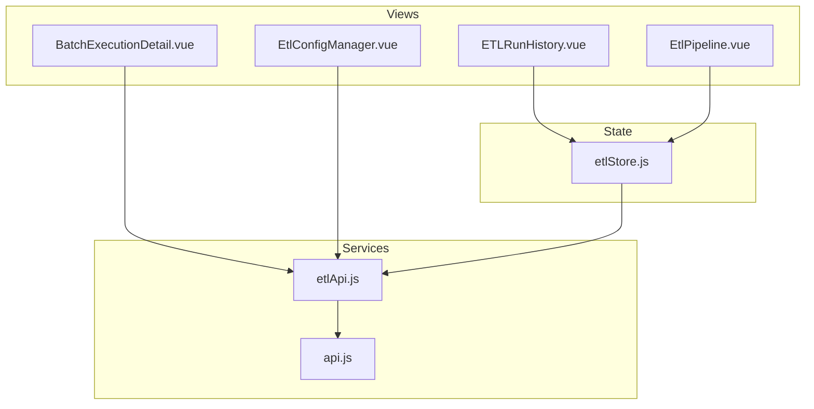
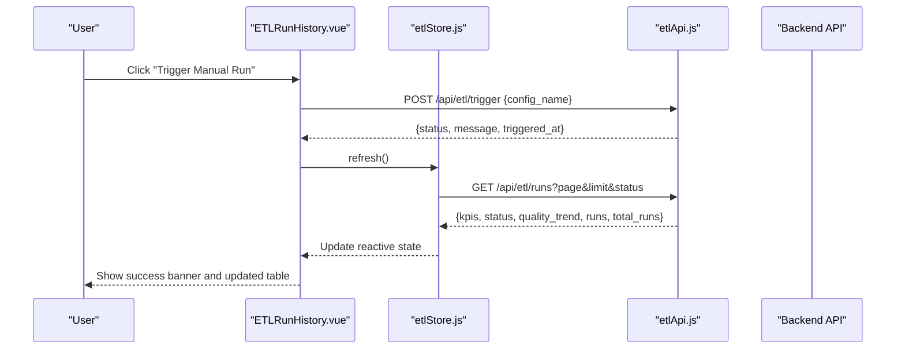
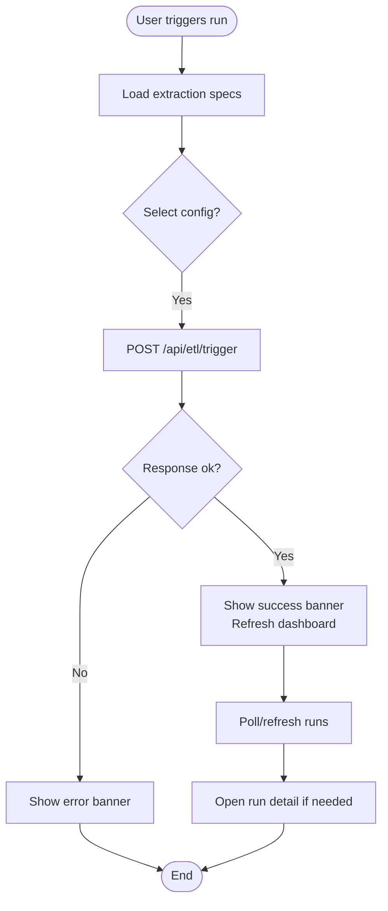
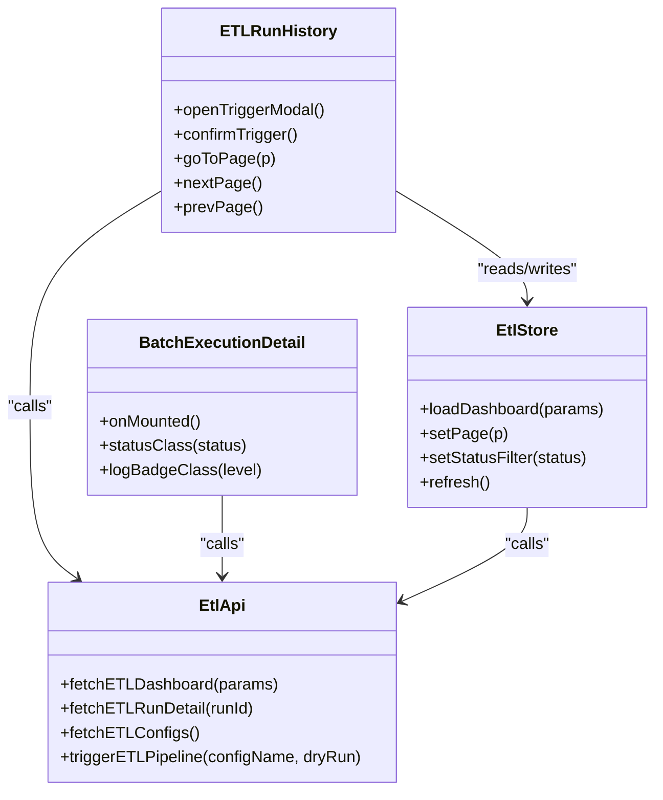
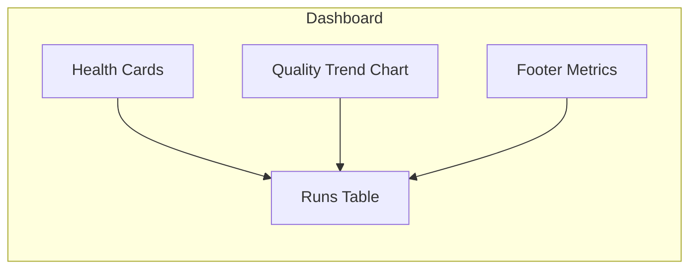
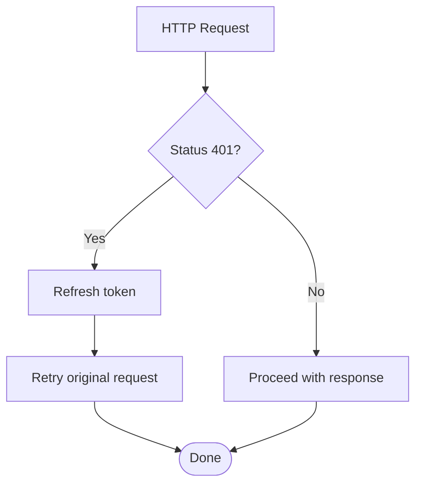
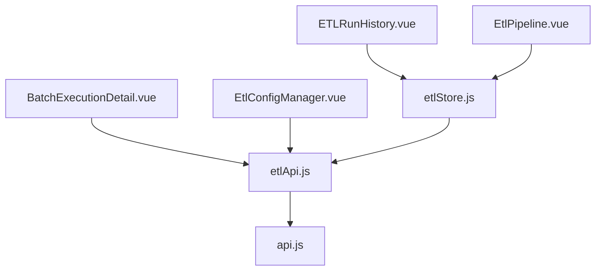

# Batch Execution & Orchestration

<cite>
**Referenced Files in This Document**
- [BatchExecutionDetail.vue](file://src/views/Modules/datapipeline/BatchExecutionDetail.vue)
- [ETLRunHistory.vue](file://src/views/Modules/datapipeline/ETLRunHistory.vue)
- [EtlConfigManager.vue](file://src/views/Modules/datapipeline/EtlConfigManager.vue)
- [EtlPipeline.vue](file://src/views/Modules/datapipeline/EtlPipeline.vue)
- [etlApi.js](file://src/services/etlApi.js)
- [api.js](file://src/services/api.js)
- [etlStore.js](file://src/stores/etlStore.js)
</cite>

## Table of Contents
1. [Introduction](#introduction)
2. [Project Structure](#project-structure)
3. [Core Components](#core-components)
4. [Architecture Overview](#architecture-overview)
5. [Detailed Component Analysis](#detailed-component-analysis)
6. [Dependency Analysis](#dependency-analysis)
7. [Performance Considerations](#performance-considerations)
8. [Troubleshooting Guide](#troubleshooting-guide)
9. [Conclusion](#conclusion)
10. [Appendices](#appendices)

## Introduction
This document explains the Batch Execution and Orchestration system as implemented in the frontend. It covers:
- Batch lifecycle management: job queuing, execution tracking, completion notifications
- Orchestration engine concepts: parallel execution, dependency resolution, failure recovery (as exposed by UI state and backend contracts)
- Execution dashboard: real-time status, progress indicators, resource utilization metrics
- Implementation specifics visible in the UI: retry logic, timeout handling, graceful shutdown signals
- Practical usage: triggering manual runs, monitoring batch progress, handling failures, scaling considerations
- Performance optimization techniques, resource management, and debugging strategies

## Project Structure
The batch orchestration UI is organized around a few key views and services:
- Views for dashboards and details: ETLRunHistory, BatchExecutionDetail, EtlPipeline, EtlConfigManager
- Services for API calls: etlApi.js (ETL endpoints), api.js (auth and base URL)
- State store: etlStore.js (reactive dashboard data and pagination)

**Diagram sources**
- [ETLRunHistory.vue:1-601](file://src/views/Modules/datapipeline/ETLRunHistory.vue#L1-L601)
- [BatchExecutionDetail.vue:1-501](file://src/views/Modules/datapipeline/BatchExecutionDetail.vue#L1-L501)
- [EtlPipeline.vue:1-438](file://src/views/Modules/datapipeline/EtlPipeline.vue#L1-L438)
- [EtlConfigManager.vue:1-341](file://src/views/Modules/datapipeline/EtlConfigManager.vue#L1-L341)
- [etlStore.js:1-96](file://src/stores/etlStore.js#L1-L96)
- [etlApi.js:1-115](file://src/services/etlApi.js#L1-L115)
- [api.js:1-209](file://src/services/api.js#L1-L209)

**Section sources**
- [ETLRunHistory.vue:1-601](file://src/views/Modules/datapipeline/ETLRunHistory.vue#L1-L601)
- [BatchExecutionDetail.vue:1-501](file://src/views/Modules/datapipeline/BatchExecutionDetail.vue#L1-L501)
- [EtlPipeline.vue:1-438](file://src/views/Modules/datapipeline/EtlPipeline.vue#L1-L438)
- [EtlConfigManager.vue:1-341](file://src/views/Modules/datapipeline/EtlConfigManager.vue#L1-L341)
- [etlStore.js:1-96](file://src/stores/etlStore.js#L1-L96)
- [etlApi.js:1-115](file://src/services/etlApi.js#L1-L115)
- [api.js:1-209](file://src/services/api.js#L1-L209)

## Core Components
- ETLRunHistory.vue: Dashboard listing recent runs, health cards, quality trend, trigger modal, pagination, and footer metrics.
- BatchExecutionDetail.vue: Detailed view of a single run with timeline, logs, audit trail, rejection analysis, and config snapshot.
- EtlPipeline.vue: Alternative dashboard layout showing health, quality trend, execution history, and stats.
- EtlConfigManager.vue: Configuration editor and list for extraction specs; used to select configs for triggering runs.
- etlStore.js: Reactive Pinia store that loads dashboard KPIs, status panel, quality trend, and paginated runs.
- etlApi.js: HTTP client functions for ETL endpoints: fetch dashboard, fetch run detail, list configs, trigger pipeline.
- api.js: Base URL configuration, auth headers, token refresh interceptor, and shared request helpers.

Key responsibilities:
- Job queuing: Triggering via POST /api/etl/trigger returns a message indicating queued or started execution.
- Execution tracking: GET /api/etl/runs provides paginated runs with status, duration, row counts, and quality score.
- Completion notifications: UI updates after trigger and on subsequent refreshes; status transitions are reflected in tables and timelines.

**Section sources**
- [ETLRunHistory.vue:267-398](file://src/views/Modules/datapipeline/ETLRunHistory.vue#L267-L398)
- [BatchExecutionDetail.vue:113-151](file://src/views/Modules/datapipeline/BatchExecutionDetail.vue#L113-L151)
- [EtlPipeline.vue:217-289](file://src/views/Modules/datapipeline/EtlPipeline.vue#L217-L289)
- [EtlConfigManager.vue:83-131](file://src/views/Modules/datapipeline/EtlConfigManager.vue#L83-L131)
- [etlStore.js:33-72](file://src/stores/etlStore.js#L33-L72)
- [etlApi.js:51-114](file://src/services/etlApi.js#L51-L114)
- [api.js:20-38](file://src/services/api.js#L20-L38)

## Architecture Overview
The frontend orchestrates batch jobs through a clear separation of concerns:
- Views render dashboards and details, consuming reactive state from the store.
- The store centralizes dashboard data and pagination, calling the API service.
- The API service encapsulates HTTP requests, error handling, and authentication.
- The base API module manages base URL and token refresh.

**Diagram sources**
- [ETLRunHistory.vue:342-391](file://src/views/Modules/datapipeline/ETLRunHistory.vue#L342-L391)
- [etlStore.js:33-72](file://src/stores/etlStore.js#L33-L72)
- [etlApi.js:90-114](file://src/services/etlApi.js#L90-L114)

## Detailed Component Analysis

### Batch Lifecycle Management
- Job Queuing:
  - Trigger modal in ETLRunHistory.vue lists available configs fetched from /api/etl/configs and submits a POST to /api/etl/trigger with config_name and optional dry_run flag.
  - On success, a banner shows confirmation and the store refreshes to reflect new runs.
- Execution Tracking:
  - ETLRunHistory.vue displays a paginated table of runs with status, duration, rows received/valid/loaded/rejected, and quality score.
  - BatchExecutionDetail.vue fetches a specific run via /api/etl/runs/{runId}, populating timeline, logs, audit trail, and validation breakdown.
- Completion Notifications:
  - After trigger, the UI shows a success banner and refreshes the dashboard to include the new run.
  - Status transitions (RUNNING → COMPLETED/FAILED) are reflected in both the history table and detail timeline.

**Diagram sources**
- [ETLRunHistory.vue:342-391](file://src/views/Modules/datapipeline/ETLRunHistory.vue#L342-L391)
- [etlApi.js:90-114](file://src/services/etlApi.js#L90-L114)

**Section sources**
- [ETLRunHistory.vue:267-398](file://src/views/Modules/datapipeline/ETLRunHistory.vue#L267-L398)
- [BatchExecutionDetail.vue:113-151](file://src/views/Modules/datapipeline/BatchExecutionDetail.vue#L113-L151)
- [etlApi.js:51-114](file://src/services/etlApi.js#L51-L114)

### Orchestration Engine Concepts (UI Exposure)
- Parallel Execution:
  - The UI does not implement concurrency control directly; it relies on backend orchestration. Health cards and status panels indicate system components’ states, which may imply parallel processing at the backend.
- Dependency Resolution:
  - Not explicitly modeled in the UI; however, the detail view’s timeline reflects ordered steps (Extract → Validate Schema → Transform → Validate Quality → Load → Complete).
- Failure Recovery:
  - Footer metrics show failed retries count; detail view includes error messages and status transitions to FAILED/ERROR.

**Diagram sources**
- [ETLRunHistory.vue:267-398](file://src/views/Modules/datapipeline/ETLRunHistory.vue#L267-L398)
- [BatchExecutionDetail.vue:113-151](file://src/views/Modules/datapipeline/BatchExecutionDetail.vue#L113-L151)
- [etlStore.js:33-72](file://src/stores/etlStore.js#L33-L72)
- [etlApi.js:51-114](file://src/services/etlApi.js#L51-L114)

**Section sources**
- [ETLRunHistory.vue:100-172](file://src/views/Modules/datapipeline/ETLRunHistory.vue#L100-L172)
- [BatchExecutionDetail.vue:19-82](file://src/views/Modules/datapipeline/BatchExecutionDetail.vue#L19-L82)
- [EtlPipeline.vue:225-289](file://src/views/Modules/datapipeline/EtlPipeline.vue#L225-L289)

### Execution Dashboard
- Real-Time Status:
  - Health cards display current_status for PostgreSQL Cluster, Redis Cache, and API Gateway.
  - Runs table shows status per run with color-coded indicators and animated dot for RUNNING.
- Progress Indicators:
  - Timeline in BatchExecutionDetail.vue visualizes step-by-step execution with timestamps and durations.
  - Quality Score trend chart shows integrity over time.
- Resource Utilization Metrics:
  - Footer metrics include storage growth, average quality, failed retries, and gateway latency.
  - EtlPipeline.vue shows additional stats like total runs, average quality, failed retries, and query latency.

**Diagram sources**
- [ETLRunHistory.vue:52-221](file://src/views/Modules/datapipeline/ETLRunHistory.vue#L52-L221)
- [BatchExecutionDetail.vue:196-261](file://src/views/Modules/datapipeline/BatchExecutionDetail.vue#L196-L261)
- [EtlPipeline.vue:31-211](file://src/views/Modules/datapipeline/EtlPipeline.vue#L31-L211)

**Section sources**
- [ETLRunHistory.vue:52-221](file://src/views/Modules/datapipeline/ETLRunHistory.vue#L52-L221)
- [BatchExecutionDetail.vue:196-261](file://src/views/Modules/datapipeline/BatchExecutionDetail.vue#L196-L261)
- [EtlPipeline.vue:31-211](file://src/views/Modules/datapipeline/EtlPipeline.vue#L31-L211)

### Retry Logic, Timeout Handling, Graceful Shutdown
- Retry Logic:
  - Token refresh retry mechanism exists in api.js for 401 responses, ensuring authenticated requests continue seamlessly.
  - Failed retries count is surfaced in footer metrics to indicate backend-side retry attempts.
- Timeout Handling:
  - Some views create axios instances with explicit timeouts; ETL API uses fetch without explicit timeouts in etlApi.js.
- Graceful Shutdown:
  - No explicit graceful shutdown handling is present in the UI; however, the dashboard gracefully handles empty states and errors.

**Diagram sources**
- [api.js:90-145](file://src/services/api.js#L90-L145)

**Section sources**
- [api.js:90-145](file://src/services/api.js#L90-L145)
- [ETLRunHistory.vue:174-221](file://src/views/Modules/datapipeline/ETLRunHistory.vue#L174-L221)

### Practical Examples
- Triggering Manual Executions:
  - Open Trigger Pipeline modal, select an extraction spec, and confirm to start a run.
  - Success banner appears; dashboard refreshes to show the new run.
- Monitoring Batch Progress:
  - Use the Runs table to observe status transitions and quality scores.
  - Navigate to BatchExecutionDetail to inspect timeline, logs, and audit trail.
- Handling Execution Failures:
  - Inspect error messages in the detail view’s timeline and logs.
  - Review rejected records and failing rules to diagnose issues.
- Scaling Batch Processes:
  - Scale backend workers based on observed throughput and latency metrics.
  - Adjust pagination limits and polling frequency in the UI to balance responsiveness and load.

**Section sources**
- [ETLRunHistory.vue:342-391](file://src/views/Modules/datapipeline/ETLRunHistory.vue#L342-L391)
- [BatchExecutionDetail.vue:113-151](file://src/views/Modules/datapipeline/BatchExecutionDetail.vue#L113-L151)

## Dependency Analysis
The system exhibits clear layering and minimal coupling:
- Views depend on the store for dashboard state.
- Store depends on the API service for data fetching.
- API service depends on base API utilities for headers and base URL.
- Authentication and token refresh are centralized in api.js.

**Diagram sources**
- [ETLRunHistory.vue:267-398](file://src/views/Modules/datapipeline/ETLRunHistory.vue#L267-L398)
- [BatchExecutionDetail.vue:113-151](file://src/views/Modules/datapipeline/BatchExecutionDetail.vue#L113-L151)
- [EtlPipeline.vue:217-289](file://src/views/Modules/datapipeline/EtlPipeline.vue#L217-L289)
- [EtlConfigManager.vue:83-131](file://src/views/Modules/datapipeline/EtlConfigManager.vue#L83-L131)
- [etlStore.js:33-72](file://src/stores/etlStore.js#L33-L72)
- [etlApi.js:51-114](file://src/services/etlApi.js#L51-L114)
- [api.js:20-38](file://src/services/api.js#L20-L38)

**Section sources**
- [etlStore.js:33-72](file://src/stores/etlStore.js#L33-L72)
- [etlApi.js:51-114](file://src/services/etlApi.js#L51-L114)
- [api.js:20-38](file://src/services/api.js#L20-L38)

## Performance Considerations
- Pagination:
  - The store supports page and limit parameters to reduce payload size and improve rendering performance.
- Efficient Rendering:
  - Computed properties derive UI values from store state to minimize re-renders.
- Network Efficiency:
  - Centralized error handling reduces duplicate logic across views.
  - Token refresh prevents repeated 401 errors and unnecessary retries.
- Observability:
  - Quality trend and footer metrics help identify bottlenecks and optimize backend resources.

[No sources needed since this section provides general guidance]

## Troubleshooting Guide
Common issues and resolutions:
- Failed to load dashboard:
  - Check network connectivity and backend availability; review console errors from etlStore.
- Trigger pipeline fails:
  - Verify selected config exists and is valid; check error banners and backend responses.
- Run detail not loading:
  - Ensure runId is correct; inspect network tab for 404 or 5xx errors.
- Token expiration:
  - Confirm refresh_token exists; rely on api.js interceptor to handle 401 flows.

**Section sources**
- [etlStore.js:33-72](file://src/stores/etlStore.js#L33-L72)
- [ETLRunHistory.vue:342-391](file://src/views/Modules/datapipeline/ETLRunHistory.vue#L342-L391)
- [BatchExecutionDetail.vue:113-151](file://src/views/Modules/datapipeline/BatchExecutionDetail.vue#L113-L151)
- [api.js:90-145](file://src/services/api.js#L90-L145)

## Conclusion
The frontend implements a robust interface for batch execution and orchestration:
- Clear separation between views, store, and services ensures maintainability.
- Dashboards provide comprehensive visibility into batch lifecycles, quality trends, and system health.
- Triggering, monitoring, and diagnosing batches are streamlined through intuitive UI patterns and reliable API integrations.
- While advanced orchestration features like parallel execution and dependency resolution are managed by the backend, the UI exposes their outcomes effectively for operational use.

[No sources needed since this section summarizes without analyzing specific files]

## Appendices
- API Endpoints Used:
  - GET /api/etl/runs — Dashboard data and paginated runs
  - GET /api/etl/runs/{runId} — Single run detail
  - GET /api/etl/configs — List extraction specs
  - POST /api/etl/trigger — Trigger pipeline with config_name and dry_run

- Key UI States:
  - Loading, error, and empty states are handled consistently across views.
  - Status colors and badges aid quick identification of run outcomes.

[No sources needed since this section provides general guidance]