# Execution Monitoring & Dashboard

<cite>
**Referenced Files in This Document**
- [ETLRunHistory.vue](file://src/views/Modules/datapipeline/ETLRunHistory.vue)
- [BatchExecutionDetail.vue](file://src/views/Modules/datapipeline/BatchExecutionDetail.vue)
- [etlStore.js](file://src/stores/etlStore.js)
- [etlApi.js](file://src/services/etlApi.js)
- [system_traces_api.js](file://src/services/system_traces_api.js)
- [useDashboardWidgets.js](file://src/composables/useDashboardWidgets.js)
- [DashboardWidgets.vue](file://src/components/ui/DashboardWidgets.vue)
- [useAudit.js](file://src/config/useAudit.js)
- [requestLogger.js](file://src/utils/requestLogger.js)
</cite>

## Table of Contents
1. [Introduction](#introduction)
2. [Project Structure](#project-structure)
3. [Core Components](#core-components)
4. [Architecture Overview](#architecture-overview)
5. [Detailed Component Analysis](#detailed-component-analysis)
6. [Dependency Analysis](#dependency-analysis)
7. [Performance Considerations](#performance-considerations)
8. [Troubleshooting Guide](#troubleshooting-guide)
9. [Conclusion](#conclusion)
10. [Appendices](#appendices)

## Introduction
This document explains the Execution Monitoring and Dashboard system implemented in the frontend. It covers real-time monitoring capabilities, dashboard components for execution timelines, quality scores, row processing statistics, error analysis, log aggregation with filtering and search, audit trail generation, execution history tracking, performance benchmarking, alert setup, custom dashboards, pattern analysis, troubleshooting failed runs, scalability considerations, and log retention policies.

## Project Structure
The monitoring and dashboard features are centered around:
- Views for the ETL run history and batch detail pages
- A Pinia store to manage dashboard state and pagination
- API services to fetch dashboard data, run details, configs, and trigger pipeline runs
- System traces API for low-level timing breakdowns
- Composable-based widget registry for customizable dashboards
- Audit logging and request logging utilities

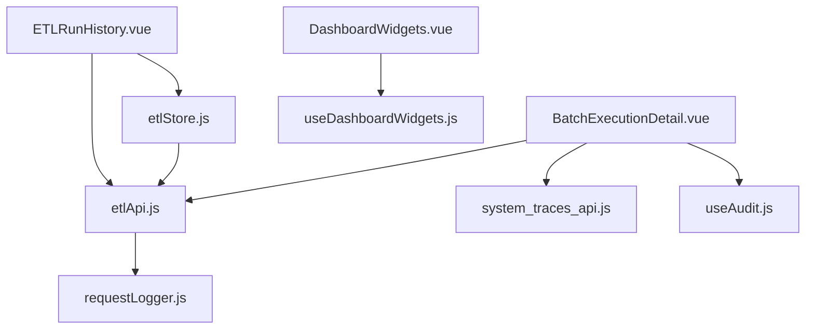

**Diagram sources**
- [ETLRunHistory.vue:1-601](file://src/views/Modules/datapipeline/ETLRunHistory.vue#L1-L601)
- [BatchExecutionDetail.vue:1-501](file://src/views/Modules/datapipeline/BatchExecutionDetail.vue#L1-L501)
- [etlStore.js:1-96](file://src/stores/etlStore.js#L1-L96)
- [etlApi.js:1-115](file://src/services/etlApi.js#L1-L115)
- [system_traces_api.js:1-40](file://src/services/system_traces_api.js#L1-L40)
- [useDashboardWidgets.js:1-88](file://src/composables/useDashboardWidgets.js#L1-L88)
- [DashboardWidgets.vue:1-71](file://src/components/ui/DashboardWidgets.vue#L1-L71)
- [useAudit.js:1-76](file://src/config/useAudit.js#L1-L76)
- [requestLogger.js:1-34](file://src/utils/requestLogger.js#L1-L34)

**Section sources**
- [ETLRunHistory.vue:1-601](file://src/views/Modules/datapipeline/ETLRunHistory.vue#L1-L601)
- [BatchExecutionDetail.vue:1-501](file://src/views/Modules/datapipeline/BatchExecutionDetail.vue#L1-L501)
- [etlStore.js:1-96](file://src/stores/etlStore.js#L1-L96)
- [etlApi.js:1-115](file://src/services/etlApi.js#L1-L115)
- [system_traces_api.js:1-40](file://src/services/system_traces_api.js#L1-L40)
- [useDashboardWidgets.js:1-88](file://src/composables/useDashboardWidgets.js#L1-L88)
- [DashboardWidgets.vue:1-71](file://src/components/ui/DashboardWidgets.vue#L1-L71)
- [useAudit.js:1-76](file://src/config/useAudit.js#L1-L76)
- [requestLogger.js:1-34](file://src/utils/requestLogger.js#L1-L34)

## Core Components
- ETL Run History page: Displays health cards, quality score trend, execution history table with status indicators, pagination, and manual trigger modal.
- Batch Execution Detail page: Shows run snapshot (quality score, duration, rows processed, data quality), execution timeline, rejection analysis, investigation tabs (rejected records, logs, audit trail), and config snapshot.
- ETL Store: Centralized state for runs, KPIs, status panel, quality trend, pagination, and filters.
- ETL API Service: Fetches dashboard data, run details, extraction configs, and triggers pipeline runs.
- System Traces API: Provides recent traces and per-trace timing breakdowns.
- Widget Registry: Enables registering, enabling/disabling, and persisting dashboard widgets.
- Audit Logging: Captures user actions and modules for compliance and traceability.
- Request Logger: Logs HTTP requests/responses for diagnostics.

**Section sources**
- [ETLRunHistory.vue:1-601](file://src/views/Modules/datapipeline/ETLRunHistory.vue#L1-L601)
- [BatchExecutionDetail.vue:1-501](file://src/views/Modules/datapipeline/BatchExecutionDetail.vue#L1-L501)
- [etlStore.js:1-96](file://src/stores/etlStore.js#L1-L96)
- [etlApi.js:1-115](file://src/services/etlApi.js#L1-L115)
- [system_traces_api.js:1-40](file://src/services/system_traces_api.js#L1-L40)
- [useDashboardWidgets.js:1-88](file://src/composables/useDashboardWidgets.js#L1-L88)
- [DashboardWidgets.vue:1-71](file://src/components/ui/DashboardWidgets.vue#L1-L71)
- [useAudit.js:1-76](file://src/config/useAudit.js#L1-L76)
- [requestLogger.js:1-34](file://src/utils/requestLogger.js#L1-L34)

## Architecture Overview
The dashboard is a Vue application that pulls metrics and run data from backend endpoints via the ETL API service. The store manages reactive state and pagination. The detail view enriches run data into logs, audit trails, and timeline entries. System traces provide granular timing insights. A widget system allows users to compose their own dashboards.

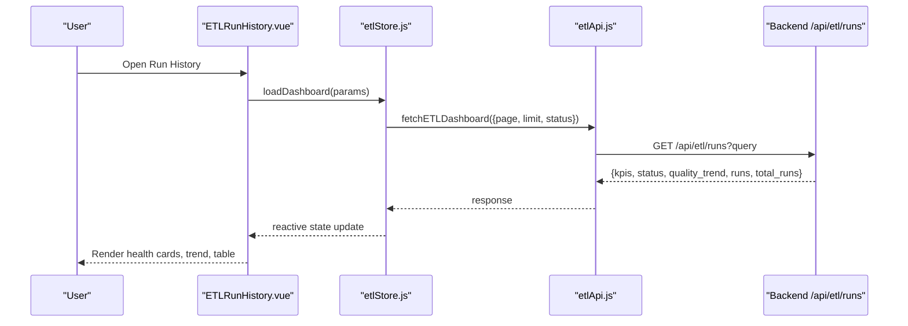

**Diagram sources**
- [ETLRunHistory.vue:267-397](file://src/views/Modules/datapipeline/ETLRunHistory.vue#L267-L397)
- [etlStore.js:33-57](file://src/stores/etlStore.js#L33-L57)
- [etlApi.js:68-75](file://src/services/etlApi.js#L68-L75)

**Section sources**
- [ETLRunHistory.vue:1-601](file://src/views/Modules/datapipeline/ETLRunHistory.vue#L1-L601)
- [etlStore.js:1-96](file://src/stores/etlStore.js#L1-L96)
- [etlApi.js:1-115](file://src/services/etlApi.js#L1-L115)

## Detailed Component Analysis

### ETL Run History Page
- Health cards show component statuses and key metrics.
- Quality Score Trend visualizes recent integrity scores.
- Execution History table lists runs with status, duration, row counts, and quality bars.
- Pagination controls drive store state and re-fetching.
- Trigger Manual Run modal loads available configs and starts a pipeline run.

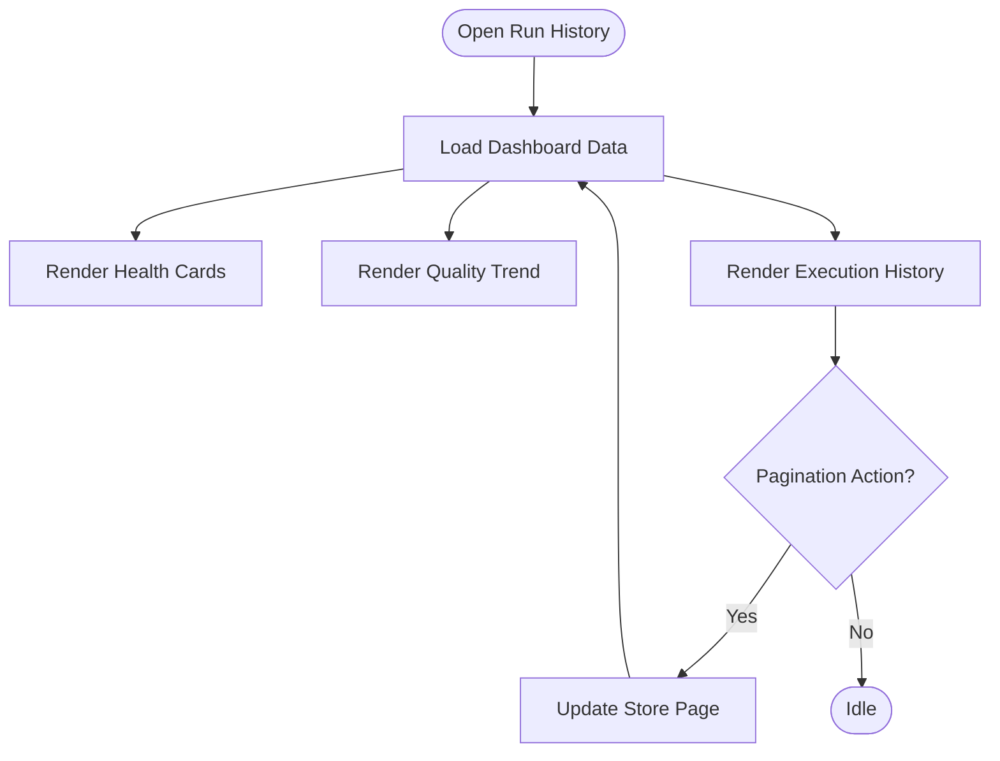

**Diagram sources**
- [ETLRunHistory.vue:278-340](file://src/views/Modules/datapipeline/ETLRunHistory.vue#L278-L340)
- [etlStore.js:33-72](file://src/stores/etlStore.js#L33-L72)

**Section sources**
- [ETLRunHistory.vue:1-601](file://src/views/Modules/datapipeline/ETLRunHistory.vue#L1-L601)
- [etlStore.js:1-96](file://src/stores/etlStore.js#L1-L96)

### Batch Execution Detail Page
- Run Snapshot displays quality score with SLA thresholds, duration, rows received/valid/loaded/rejected, duplicates, warnings, errors, skipped.
- Execution Timeline shows step-by-step progress and timestamps; updated based on run status.
- Rejection Analysis provides category breakdown and top failing rules.
- Investigation Tabs include:
  - Rejected Records (placeholder until backend populates)
  - Execution Logs derived from run metadata
  - Audit Trail derived from run lifecycle events
- Config Snapshot shows configuration used by the run.

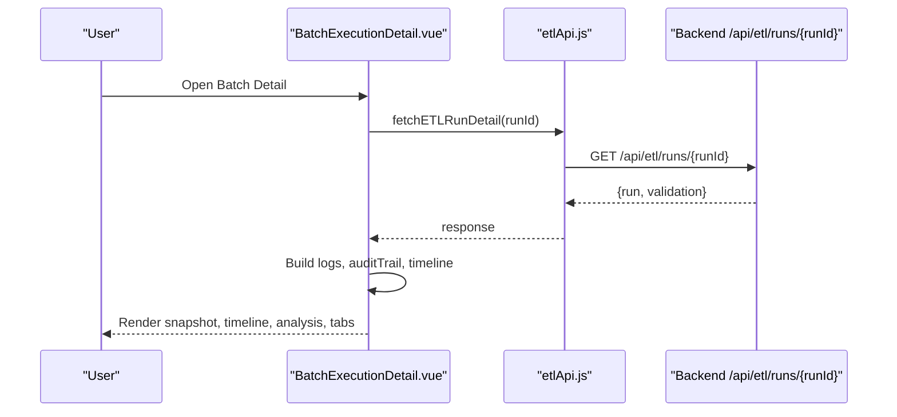

**Diagram sources**
- [BatchExecutionDetail.vue:113-151](file://src/views/Modules/datapipeline/BatchExecutionDetail.vue#L113-L151)
- [BatchExecutionDetail.vue:49-82](file://src/views/Modules/datapipeline/BatchExecutionDetail.vue#L49-L82)
- [etlApi.js:83-88](file://src/services/etlApi.js#L83-L88)

**Section sources**
- [BatchExecutionDetail.vue:1-501](file://src/views/Modules/datapipeline/BatchExecutionDetail.vue#L1-L501)
- [etlApi.js:1-115](file://src/services/etlApi.js#L1-L115)

### ETL Store
- Manages runs, KPIs, status panel, quality trend, pagination, and filters.
- Provides actions to load dashboard, set page, set status filter, and refresh.

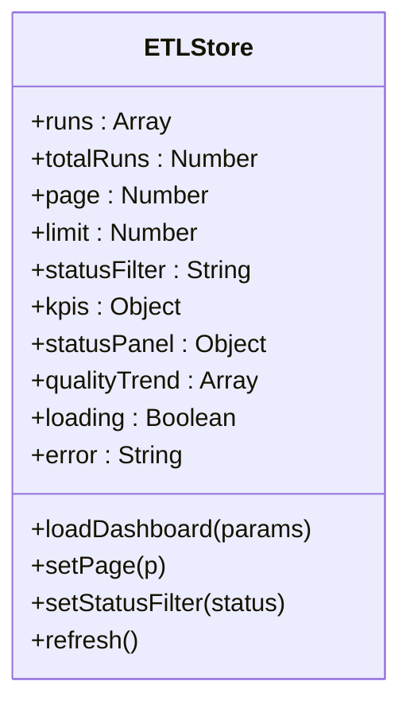

**Diagram sources**
- [etlStore.js:12-94](file://src/stores/etlStore.js#L12-L94)

**Section sources**
- [etlStore.js:1-96](file://src/stores/etlStore.js#L1-L96)

### ETL API Service
- Normalizes headers and handles responses with error mapping.
- Exposes functions for dashboard data, run detail, configs listing, and triggering pipelines.

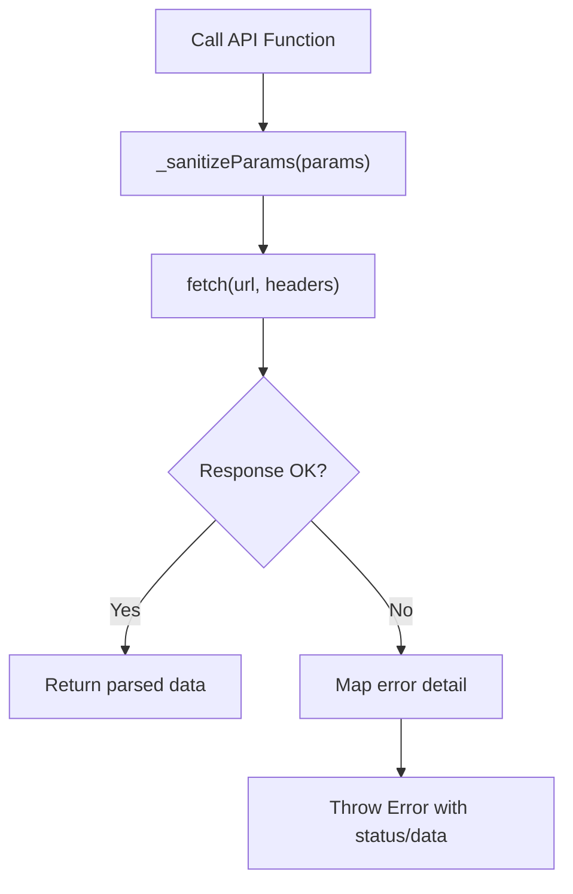

**Diagram sources**
- [etlApi.js:10-49](file://src/services/etlApi.js#L10-L49)
- [etlApi.js:68-114](file://src/services/etlApi.js#L68-L114)

**Section sources**
- [etlApi.js:1-115](file://src/services/etlApi.js#L1-L115)

### System Traces API
- Provides recent traces and detailed timing breakdowns for specific traces.

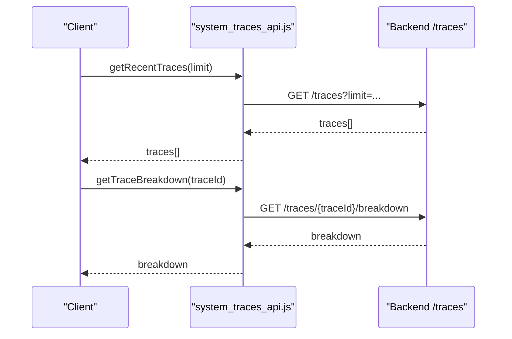

**Diagram sources**
- [system_traces_api.js:17-39](file://src/services/system_traces_api.js#L17-L39)

**Section sources**
- [system_traces_api.js:1-40](file://src/services/system_traces_api.js#L1-L40)

### Customizable Dashboards via Widgets
- Widget registry supports registration, toggling, persistence, and rendering active widgets.

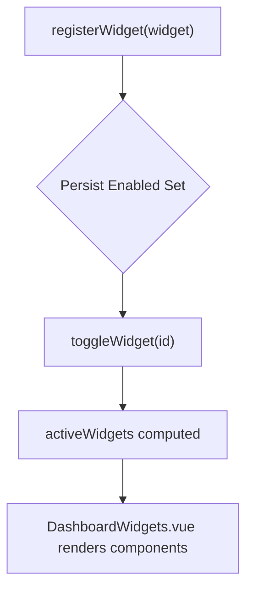

**Diagram sources**
- [useDashboardWidgets.js:24-86](file://src/composables/useDashboardWidgets.js#L24-L86)
- [DashboardWidgets.vue:1-71](file://src/components/ui/DashboardWidgets.vue#L1-L71)

**Section sources**
- [useDashboardWidgets.js:1-88](file://src/composables/useDashboardWidgets.js#L1-L88)
- [DashboardWidgets.vue:1-71](file://src/components/ui/DashboardWidgets.vue#L1-L71)

### Audit Trail Generation
- The detail view constructs an audit trail from run metadata (triggered by, start/end times, outcomes).
- A shared composable posts user actions to the backend audit endpoint for broader audit coverage.

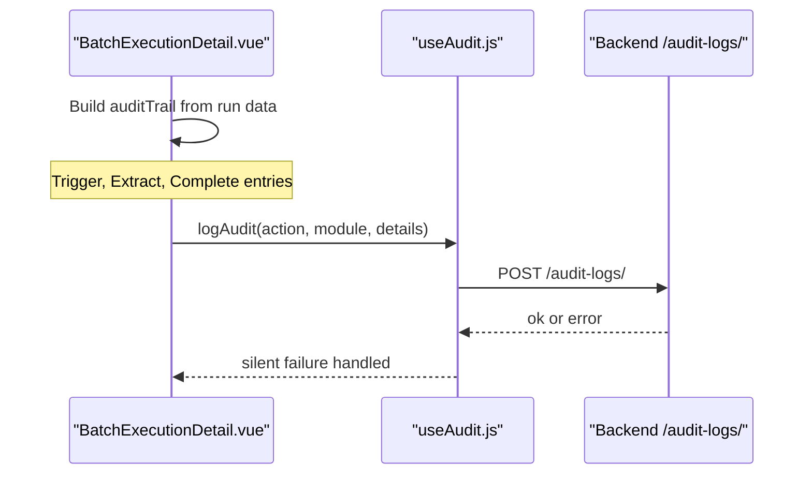

**Diagram sources**
- [BatchExecutionDetail.vue:73-82](file://src/views/Modules/datapipeline/BatchExecutionDetail.vue#L73-L82)
- [useAudit.js:43-72](file://src/config/useAudit.js#L43-L72)

**Section sources**
- [BatchExecutionDetail.vue:1-501](file://src/views/Modules/datapipeline/BatchExecutionDetail.vue#L1-L501)
- [useAudit.js:1-76](file://src/config/useAudit.js#L1-L76)

### Log Aggregation and Filtering
- Execution logs are derived from run metadata and displayed in a table with level badges and component labels.
- Filtering by level (INFO, WARN, ERROR) and component can be implemented client-side using the logs array.
- Search functionality can be added by filtering messages against a query string.

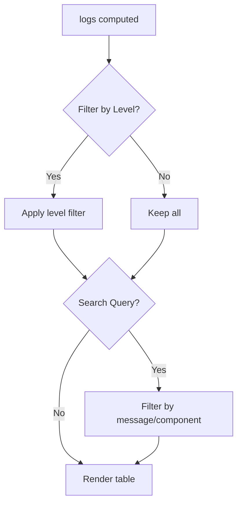

**Diagram sources**
- [BatchExecutionDetail.vue:49-71](file://src/views/Modules/datapipeline/BatchExecutionDetail.vue#L49-L71)

**Section sources**
- [BatchExecutionDetail.vue:1-501](file://src/views/Modules/datapipeline/BatchExecutionDetail.vue#L1-L501)

### Performance Benchmarking
- Duration and average duration are surfaced in footer metrics and KPIs.
- System traces provide per-request timing breakdowns for deeper performance analysis.

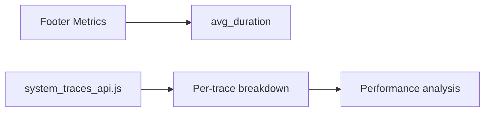

**Diagram sources**
- [ETLRunHistory.vue:329-335](file://src/views/Modules/datapipeline/ETLRunHistory.vue#L329-L335)
- [system_traces_api.js:17-39](file://src/services/system_traces_api.js#L17-L39)

**Section sources**
- [ETLRunHistory.vue:1-601](file://src/views/Modules/datapipeline/ETLRunHistory.vue#L1-L601)
- [system_traces_api.js:1-40](file://src/services/system_traces_api.js#L1-L40)

## Dependency Analysis
- Views depend on the store for dashboard state and on API services for data fetching.
- The store depends on etlApi.js for network calls.
- The detail view uses both etlApi.js and system_traces_api.js for rich diagnostics.
- The widget system is decoupled and persists enabled widgets locally.
- Audit and request logging are cross-cutting concerns used across modules.

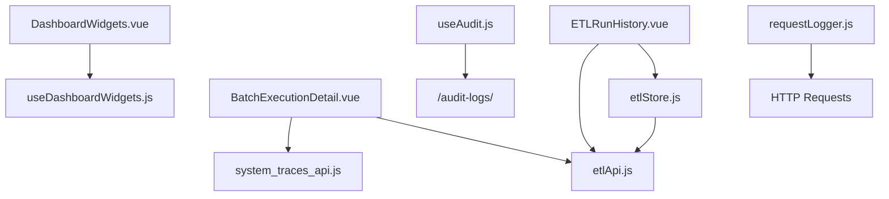

**Diagram sources**
- [ETLRunHistory.vue:267-397](file://src/views/Modules/datapipeline/ETLRunHistory.vue#L267-L397)
- [BatchExecutionDetail.vue:113-151](file://src/views/Modules/datapipeline/BatchExecutionDetail.vue#L113-L151)
- [etlStore.js:33-72](file://src/stores/etlStore.js#L33-L72)
- [etlApi.js:68-114](file://src/services/etlApi.js#L68-L114)
- [system_traces_api.js:17-39](file://src/services/system_traces_api.js#L17-L39)
- [useDashboardWidgets.js:24-86](file://src/composables/useDashboardWidgets.js#L24-L86)
- [useAudit.js:43-72](file://src/config/useAudit.js#L43-L72)
- [requestLogger.js:1-34](file://src/utils/requestLogger.js#L1-L34)

**Section sources**
- [ETLRunHistory.vue:1-601](file://src/views/Modules/datapipeline/ETLRunHistory.vue#L1-L601)
- [BatchExecutionDetail.vue:1-501](file://src/views/Modules/datapipeline/BatchExecutionDetail.vue#L1-L501)
- [etlStore.js:1-96](file://src/stores/etlStore.js#L1-L96)
- [etlApi.js:1-115](file://src/services/etlApi.js#L1-L115)
- [system_traces_api.js:1-40](file://src/services/system_traces_api.js#L1-L40)
- [useDashboardWidgets.js:1-88](file://src/composables/useDashboardWidgets.js#L1-L88)
- [useAudit.js:1-76](file://src/config/useAudit.js#L1-L76)
- [requestLogger.js:1-34](file://src/utils/requestLogger.js#L1-L34)

## Performance Considerations
- Use pagination to avoid loading large datasets at once; the store exposes page and limit parameters.
- Debounce search inputs when implementing client-side log search to reduce re-renders.
- Prefer server-side filtering for logs and runs if dataset grows significantly.
- Cache dashboard KPIs and trends briefly to reduce repeated network calls.
- Use system traces sparingly; they may be expensive to compute on the backend.

[No sources needed since this section provides general guidance]

## Troubleshooting Guide
- Failed runs: Check the run status and errorMessage in the detail view; timeline steps will reflect failures.
- Missing data: Verify API responses and handle empty states gracefully in views.
- Authentication issues: Ensure Authorization header is present; the API service reads token from localStorage.
- Network errors: Inspect console logs via requestLogger to see payloads and responses.
- Audit failures: Audit logging is resilient; failures are logged but do not block operations.

**Section sources**
- [BatchExecutionDetail.vue:113-151](file://src/views/Modules/datapipeline/BatchExecutionDetail.vue#L113-L151)
- [etlApi.js:18-38](file://src/services/etlApi.js#L18-L38)
- [requestLogger.js:1-34](file://src/utils/requestLogger.js#L1-L34)
- [useAudit.js:64-72](file://src/config/useAudit.js#L64-L72)

## Conclusion
The Execution Monitoring and Dashboard system provides comprehensive visibility into pipeline executions through interactive dashboards, detailed run analysis, and robust logging. It supports real-time updates via paginated data, performance benchmarking through durations and traces, and extensibility via a widget system. With audit trails and diagnostic tools, teams can monitor, analyze, and troubleshoot effectively while planning for scalability and retention.

[No sources needed since this section summarizes without analyzing specific files]

## Appendices

### Practical Examples

- Setting up monitoring alerts
  - Define thresholds for quality score and latency in your operational processes.
  - Use the dashboard’s quality trend and footer metrics to identify anomalies.
  - Integrate external alerting by polling the dashboard endpoints or subscribing to backend notifications.

- Creating custom dashboards
  - Register widgets using the widget composable to add new panels.
  - Enable/disable widgets via the settings panel; preferences are persisted locally.
  - Compose multiple widgets to tailor the dashboard to specific roles or use cases.

- Analyzing execution patterns
  - Review the execution timeline to identify bottlenecks and failure points.
  - Examine rejection categories and failing rules to improve data quality.
  - Correlate durations and gateway latency with run outcomes.

- Troubleshooting failed runs
  - Inspect the run snapshot for quality and row metrics.
  - Check logs and audit trail for context around failures.
  - Use system traces to drill into timing breakdowns for slow steps.

- Scalability considerations
  - Implement server-side pagination and filtering for large datasets.
  - Limit the number of concurrent trace breakdowns requested.
  - Consider caching strategies for frequently accessed KPIs and trends.

- Log retention policies
  - Define retention windows for logs and traces on the backend.
  - Archive older runs periodically to keep the dashboard responsive.
  - Provide export functionality for long-term storage and compliance.

[No sources needed since this section provides general guidance]