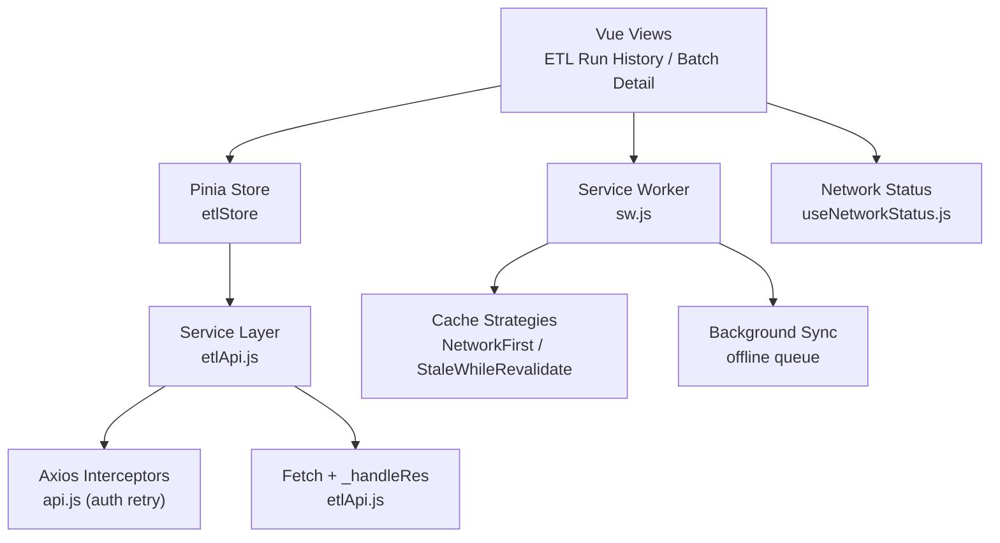
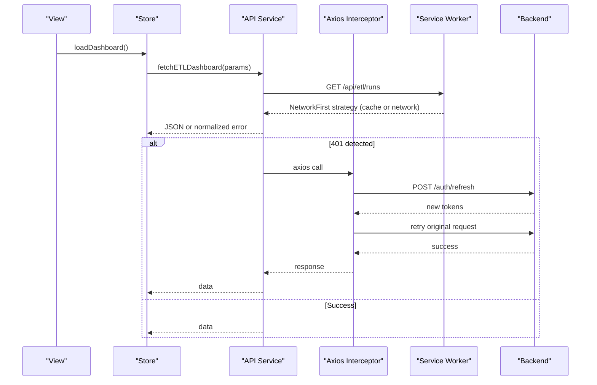
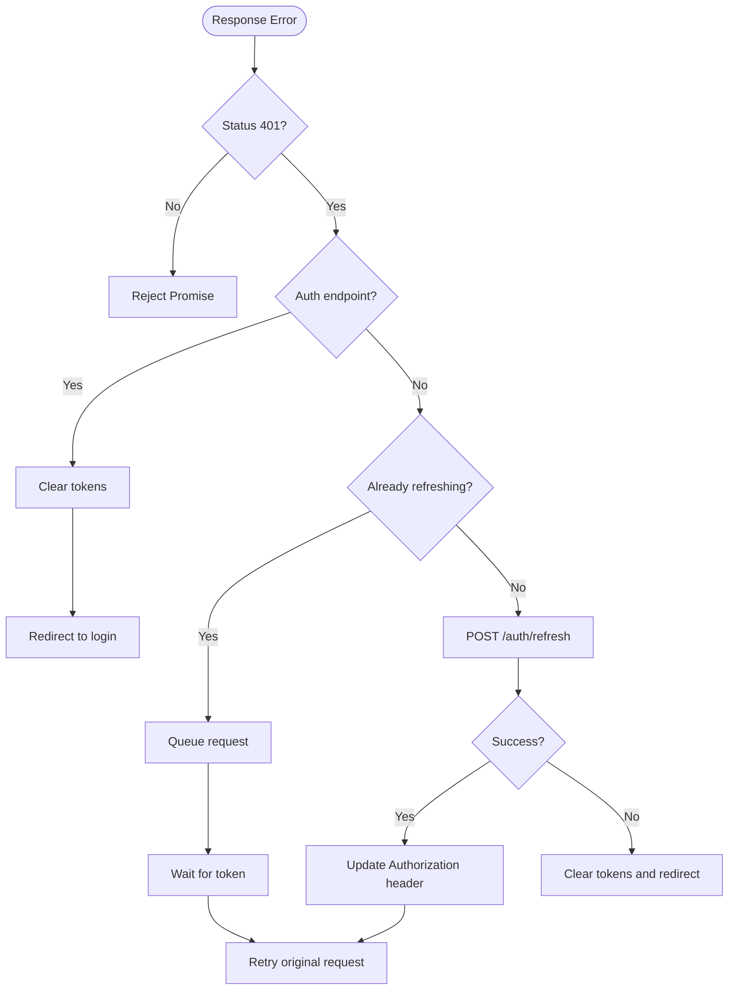
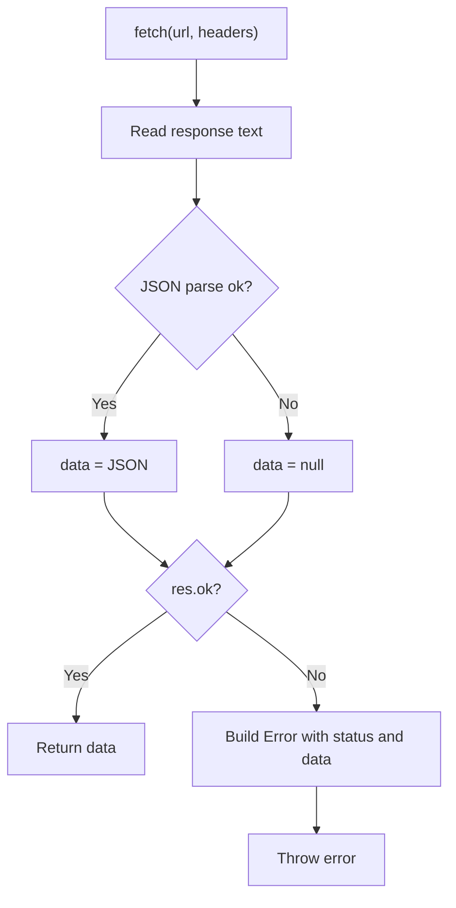
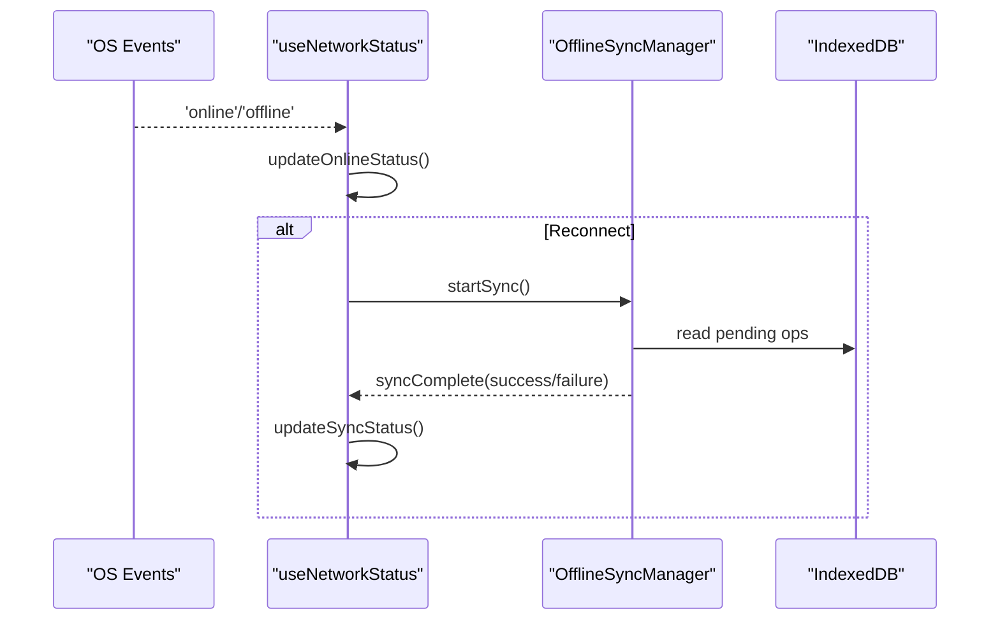
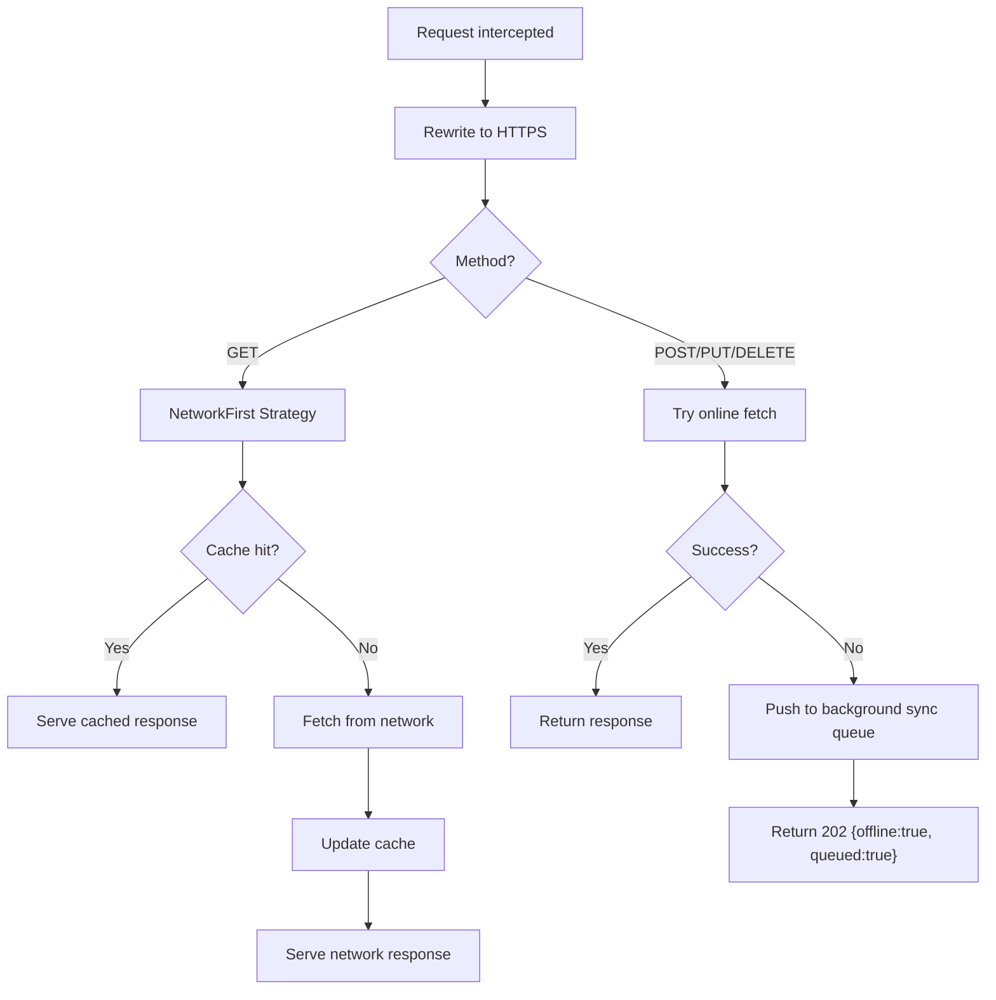
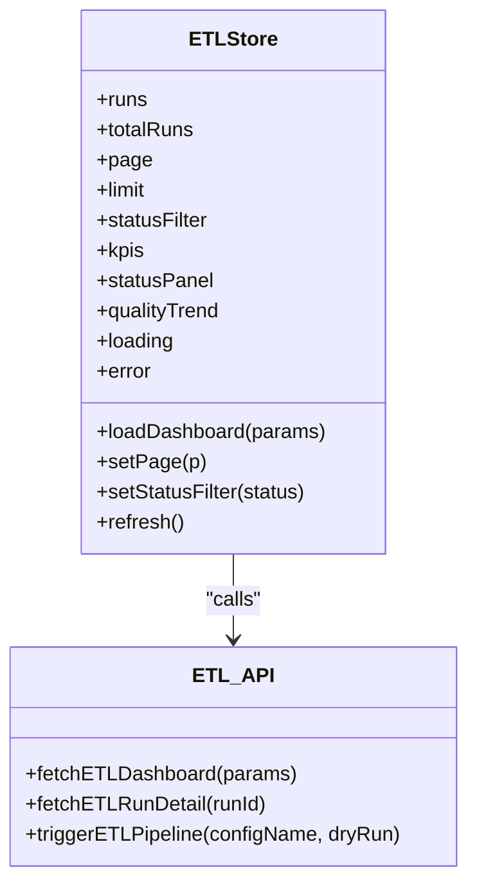
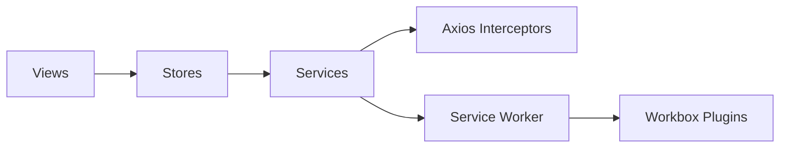

# Failure Recovery & Retry Logic

<cite>
**Referenced Files in This Document**
- [api.js](file://src/services/api.js)
- [etlApi.js](file://src/services/etlApi.js)
- [useNetworkStatus.js](file://src/composables/useNetworkStatus.js)
- [sw.js](file://src/sw.js)
- [etlStore.js](file://src/stores/etlStore.js)
- [BatchExecutionDetail.vue](file://src/views/Modules/datapipeline/BatchExecutionDetail.vue)
- [EtlPipeline.vue](file://src/views/Modules/datapipeline/EtlPipeline.vue)
- [system_traces_api.js](file://src/services/system_traces_api.js)
</cite>

## Table of Contents
1. Introduction
2. Project Structure
3. Core Components
4. Architecture Overview
5. Detailed Component Analysis
6. Dependency Analysis
7. Performance Considerations
8. Troubleshooting Guide
9. Conclusion

## Introduction
This document explains the Failure Recovery and Retry Logic implemented in the frontend to ensure resilient user experiences during network outages, transient backend errors, and long-running ETL operations. It covers:
- Automatic retry mechanisms with token refresh and request queuing
- Offline detection, background sync, and cache strategies
- Error categorization and recovery workflows for different failure types
- Graceful degradation via fallbacks and offline queues
- Timeouts, circuit breaker-like patterns, and alerting for persistent failures
- Distributed execution considerations, idempotency, and data consistency guarantees

## Project Structure
The resilience features are implemented across several layers:
- HTTP client interceptors for authentication retries and token refresh
- Service layer utilities that normalize responses and errors
- Composables that detect online/offline status and trigger synchronization
- A service worker that enforces HTTPS, caches API responses, and queues mutations when offline
- Stores and views that present run history, quality metrics, and error categories

**Diagram sources**
- [api.js:64-146](file://src/services/api.js#L64-L146)
- [etlApi.js:18-38](file://src/services/etlApi.js#L18-L38)
- [useNetworkStatus.js:30-91](file://src/composables/useNetworkStatus.js#L30-L91)
- [sw.js:38-118](file://src/sw.js#L38-L118)

**Section sources**
- [api.js:64-146](file://src/services/api.js#L64-L146)
- [etlApi.js:18-38](file://src/services/etlApi.js#L18-L38)
- [useNetworkStatus.js:30-91](file://src/composables/useNetworkStatus.js#L30-L91)
- [sw.js:38-118](file://src/sw.js#L38-L118)

## Core Components
- Axios response interceptor: handles 401 by refreshing tokens, queues concurrent requests, and prevents infinite retries on auth endpoints.
- ETL API service: normalizes HTTP responses into typed errors with status and payload; sanitizes query parameters.
- Network status composable: tracks online/offline events, triggers force sync on reconnect, and exposes sync state.
- Service worker: rewrites HTTP to HTTPS, applies caching strategies, and queues POST/PUT/DELETE when offline for later replay.
- ETL store and views: surface run statuses, quality trends, and error categories to support recovery workflows.

Key responsibilities:
- Detect failures early and classify them (network, auth, server, validation).
- Apply appropriate recovery (retry with backoff where applicable, offline queue, token refresh).
- Provide observability (error messages, run history, trace endpoints).

**Section sources**
- [api.js:64-146](file://src/services/api.js#L64-L146)
- [etlApi.js:18-38](file://src/services/etlApi.js#L18-L38)
- [useNetworkStatus.js:30-91](file://src/composables/useNetworkStatus.js#L30-L91)
- [sw.js:38-118](file://src/sw.js#L38-L118)
- [etlStore.js:33-57](file://src/stores/etlStore.js#L33-L57)

## Architecture Overview
The system combines multiple resilience patterns:
- Token refresh with request coalescing to avoid thundering herds on 401
- Network-first caching for GETs with short timeout and expiration
- Background sync for write operations when offline
- Online/offline event handling with automatic sync on reconnect
- Centralized error normalization to enable consistent handling and alerting

**Diagram sources**
- [etlStore.js:33-57](file://src/stores/etlStore.js#L33-L57)
- [etlApi.js:68-75](file://src/services/etlApi.js#L68-L75)
- [api.js:90-146](file://src/services/api.js#L90-L146)
- [sw.js:76-94](file://src/sw.js#L76-L94)

## Detailed Component Analysis

### Authentication Retry and Token Refresh (Circuit Breaker-like Behavior)
- On 401, the interceptor avoids retrying login/refresh endpoints and marks the request to prevent loops.
- If a refresh is already in progress, subsequent failing requests are queued and retried after token renewal.
- On refresh failure, tokens are cleared and the user is redirected to login.

**Diagram sources**
- [api.js:90-146](file://src/services/api.js#L90-L146)

**Section sources**
- [api.js:90-146](file://src/services/api.js#L90-L146)

### ETL API Error Normalization and Handling
- The service layer reads raw text, attempts JSON parse, and constructs a standardized error object with status and parsed data.
- Query parameters are sanitized to remove empty or undefined values before building URLs.
- Successful responses return parsed JSON; failures throw with enriched context for consumers.

**Diagram sources**
- [etlApi.js:18-38](file://src/services/etlApi.js#L18-L38)
- [etlApi.js:40-49](file://src/services/etlApi.js#L40-L49)

**Section sources**
- [etlApi.js:18-38](file://src/services/etlApi.js#L18-L38)
- [etlApi.js:40-49](file://src/services/etlApi.js#L40-L49)

### Offline Detection, Auto-Sync, and Partial Execution Recovery
- Listens to online/offline events and debounces rapid toggles.
- On reconnect, triggers a forced sync if there are pending operations.
- Exposes sync status including counts of pending transactions, stock changes, inventory items, and customers.
- Provides a simple offline toast notification mechanism.

**Diagram sources**
- [useNetworkStatus.js:30-91](file://src/composables/useNetworkStatus.js#L30-L91)
- [useNetworkStatus.js:163-197](file://src/composables/useNetworkStatus.js#L163-L197)

**Section sources**
- [useNetworkStatus.js:30-91](file://src/composables/useNetworkStatus.js#L30-L91)
- [useNetworkStatus.js:163-197](file://src/composables/useNetworkStatus.js#L163-L197)

### Service Worker Caching, HTTPS Enforcement, and Background Sync
- Rewrites all backend requests to HTTPS to eliminate mixed content issues.
- Applies NetworkFirst for GET requests with a short network timeout and cache expiration.
- For non-GET methods, attempts online execution; on failure, queues the request for background sync and returns a 202 with an offline indicator.
- Cleans up old caches on activation and supports manual cache clearing via messages.

**Diagram sources**
- [sw.js:22-26](file://src/sw.js#L22-L26)
- [sw.js:38-118](file://src/sw.js#L38-L118)
- [sw.js:155-161](file://src/sw.js#L155-L161)
- [sw.js:202-212](file://src/sw.js#L202-L212)
- [sw.js:218-222](file://src/sw.js#L218-L222)

**Section sources**
- [sw.js:38-118](file://src/sw.js#L38-L118)
- [sw.js:155-161](file://src/sw.js#L155-L161)
- [sw.js:202-212](file://src/sw.js#L202-L212)
- [sw.js:218-222](file://src/sw.js#L218-L222)

### ETL Dashboard and Run History Integration
- The store loads dashboard data (KPIs, status panel, quality trend, paginated runs) and surfaces loading/error states.
- Views render run statuses, quality scores, and derived metrics such as failed retries.
- Batch detail view computes rejection categories and failing rules to aid root cause analysis.

**Diagram sources**
- [etlStore.js:12-95](file://src/stores/etlStore.js#L12-L95)
- [etlApi.js:68-114](file://src/services/etlApi.js#L68-L114)

**Section sources**
- [etlStore.js:33-57](file://src/stores/etlStore.js#L33-L57)
- [BatchExecutionDetail.vue:19-33](file://src/views/Modules/datapipeline/BatchExecutionDetail.vue#L19-L33)
- [EtlPipeline.vue:264-288](file://src/views/Modules/datapipeline/EtlPipeline.vue#L264-L288)

### Timeout Handling and Fallbacks
- Axios instances created per store include explicit timeouts to fail fast under slow networks.
- The service worker uses a short network timeout for GET requests to prefer cached data when the network is slow.
- Fallbacks include cached responses, offline queue for writes, and user-facing notifications.

Practical notes:
- Configure timeouts at the store level based on operation criticality.
- Use the service worker’s NetworkFirst strategy to reduce perceived latency.
- Surface user feedback via offline notifications and run history status updates.

**Section sources**
- [sw.js:76-94](file://src/sw.js#L76-L94)

### Alerting and Observability
- System traces API provides recent traces and breakdowns for performance diagnostics.
- ETL run history and batch details expose error categories and rule-level failures to guide remediation.
- Network status composable exposes last sync attempt/success timestamps and error messages for monitoring.

**Section sources**
- [system_traces_api.js:17-39](file://src/services/system_traces_api.js#L17-L39)
- [BatchExecutionDetail.vue:19-33](file://src/views/Modules/datapipeline/BatchExecutionDetail.vue#L19-L33)
- [useNetworkStatus.js:46-91](file://src/composables/useNetworkStatus.js#L46-L91)

## Dependency Analysis
- Views depend on stores for state and actions.
- Stores depend on service APIs for data fetching and mutation.
- Services rely on Axios interceptors for auth retry and on the service worker for caching and offline behavior.
- The service worker depends on Workbox plugins for caching, expiration, and background sync.

**Diagram sources**
- [etlStore.js:33-57](file://src/stores/etlStore.js#L33-L57)
- [etlApi.js:68-114](file://src/services/etlApi.js#L68-L114)
- [api.js:64-146](file://src/services/api.js#L64-L146)
- [sw.js:7-12](file://src/sw.js#L7-L12)

**Section sources**
- [etlStore.js:33-57](file://src/stores/etlStore.js#L33-L57)
- [etlApi.js:68-114](file://src/services/etlApi.js#L68-L114)
- [api.js:64-146](file://src/services/api.js#L64-L146)
- [sw.js:7-12](file://src/sw.js#L7-L12)

## Performance Considerations
- Prefer cached GET responses via NetworkFirst to reduce latency and bandwidth.
- Avoid excessive retries on auth endpoints to prevent lockouts; use the built-in queue to serialize refresh attempts.
- Debounce network status updates to minimize churn during flaky connections.
- Keep background sync payloads small and idempotent to improve reliability.

[No sources needed since this section provides general guidance]

## Troubleshooting Guide
Common scenarios and how to diagnose:
- Intermittent 401 errors: Verify token refresh flow and check that auth endpoints are not retried. Inspect interceptor logs and ensure tokens are stored correctly.
- Slow or failing GET requests: Confirm service worker NetworkFirst strategy and cache expiration settings; clear caches if necessary.
- Write operations failing offline: Ensure background sync queue exists and will replay when online; check 202 responses indicating queued operations.
- ETL failures: Use run history and batch detail to identify error categories and failing rules; leverage system traces for timing insights.

Operational tips:
- Use the offline toast and sync status to inform users about connectivity and pending operations.
- Monitor last successful sync timestamps and error messages exposed by the network status composable.
- Leverage ETL KPIs and quality trends to detect regressions early.

**Section sources**
- [api.js:90-146](file://src/services/api.js#L90-L146)
- [sw.js:76-118](file://src/sw.js#L76-L118)
- [useNetworkStatus.js:46-91](file://src/composables/useNetworkStatus.js#L46-L91)
- [BatchExecutionDetail.vue:19-33](file://src/views/Modules/datapipeline/BatchExecutionDetail.vue#L19-L33)
- [system_traces_api.js:17-39](file://src/services/system_traces_api.js#L17-L39)

## Conclusion
The frontend implements a robust set of failure recovery and retry mechanisms:
- Token refresh with request coalescing protects against concurrent 401 storms.
- Service worker caching and background sync provide resilience against network interruptions and enforce HTTPS.
- Centralized error normalization and rich ETL run history enable effective diagnosis and recovery.
- Network status tracking and offline notifications keep users informed and maintain productivity.

These patterns collectively deliver a resilient user experience while preserving data consistency and enabling efficient troubleshooting.

[No sources needed since this section summarizes without analyzing specific files]