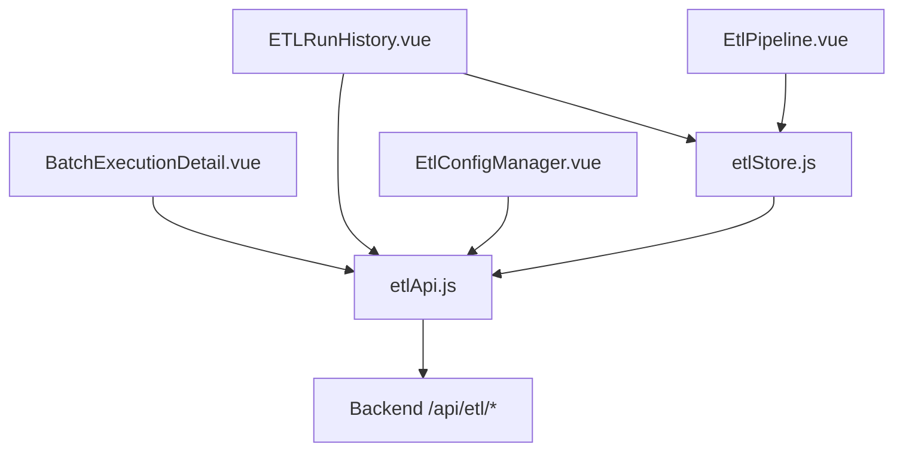
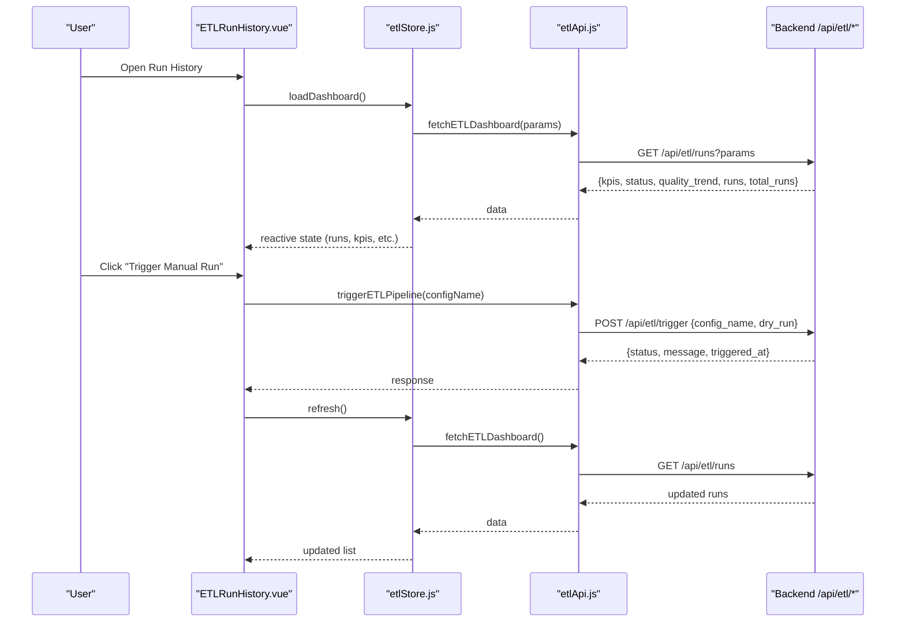
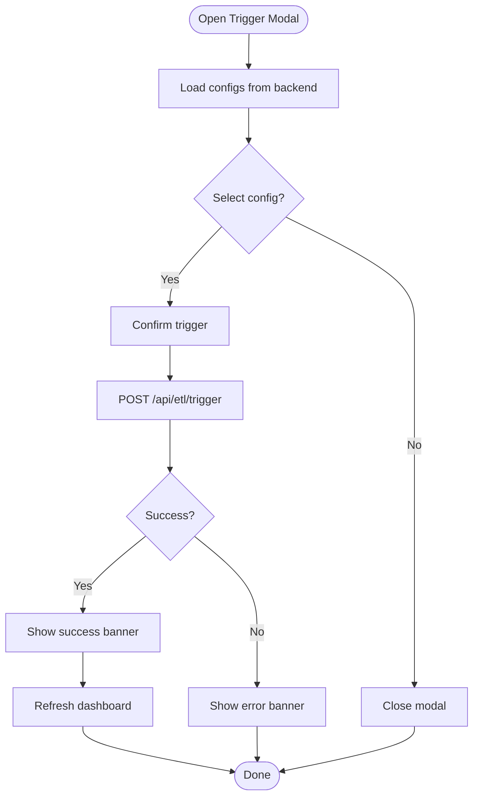
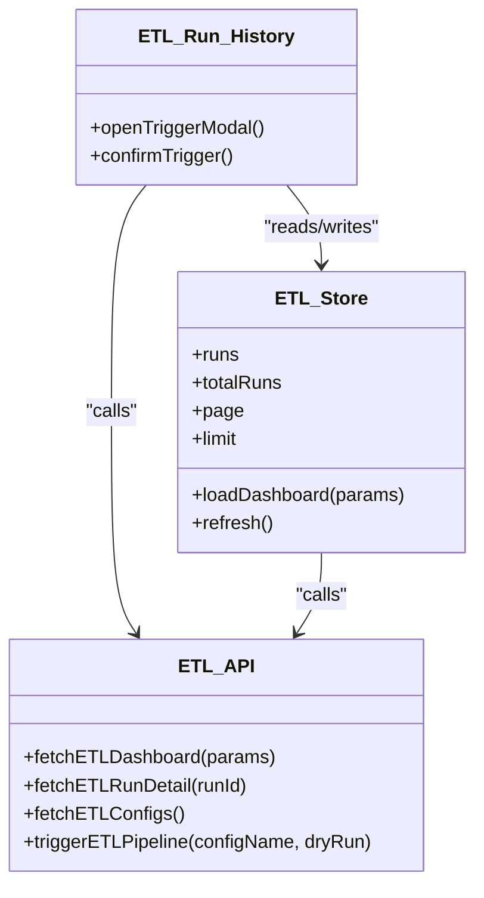
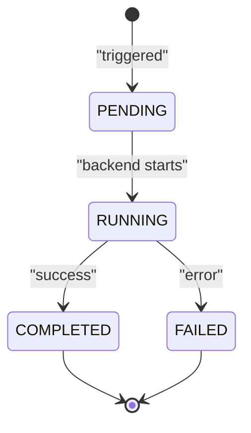
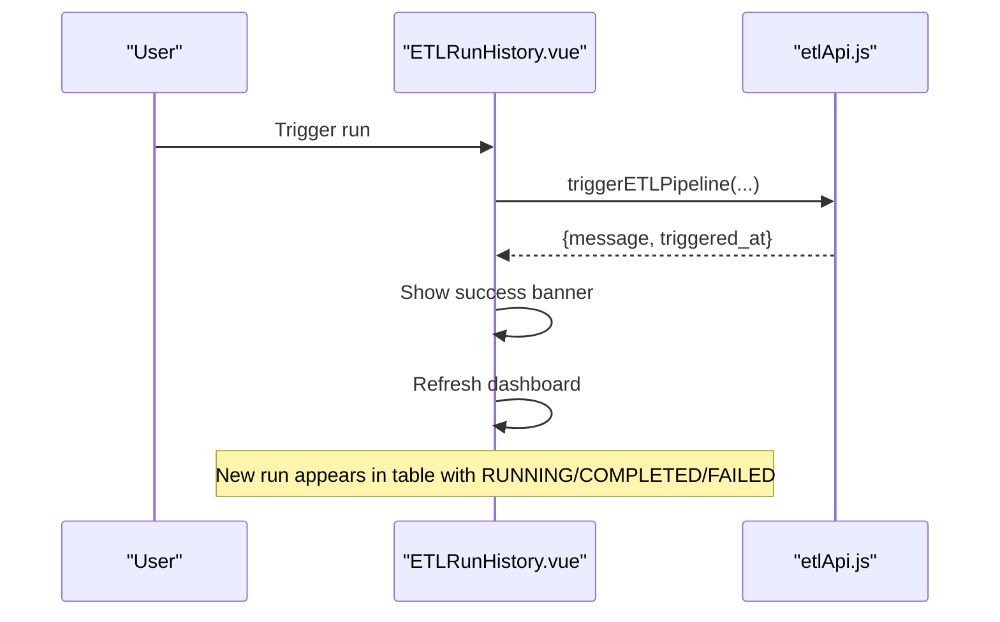
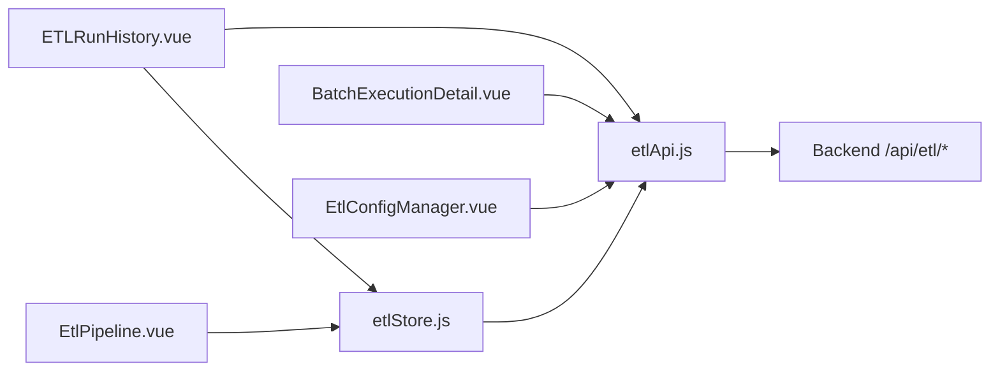

# Job Lifecycle Management

<cite>
**Referenced Files in This Document**
- [BatchExecutionDetail.vue](file://src/views/Modules/datapipeline/BatchExecutionDetail.vue)
- [ETLRunHistory.vue](file://src/views/Modules/datapipeline/ETLRunHistory.vue)
- [EtlConfigManager.vue](file://src/views/Modules/datapipeline/EtlConfigManager.vue)
- [EtlPipeline.vue](file://src/views/Modules/datapipeline/EtlPipeline.vue)
- [etlApi.js](file://src/services/etlApi.js)
- [etlStore.js](file://src/stores/etlStore.js)
</cite>

## Table of Contents
1. [Introduction](#introduction)
2. [Project Structure](#project-structure)
3. [Core Components](#core-components)
4. [Architecture Overview](#architecture-overview)
5. [Detailed Component Analysis](#detailed-component-analysis)
6. [Dependency Analysis](#dependency-analysis)
7. [Performance Considerations](#performance-considerations)
8. [Troubleshooting Guide](#troubleshooting-guide)
9. [Conclusion](#conclusion)

## Introduction
This document explains the Job Lifecycle Management system implemented in the frontend for the ETL pipeline. It covers how jobs are created, scheduled, executed, monitored, and completed from the user interface perspective. The system exposes:
- Manual job triggering via a configuration selector
- A dashboard with KPIs, quality trends, and execution history
- Detailed batch run inspection including logs, audit trail, and validation results
- State persistence through backend APIs that return run metadata and status

The UI reflects job states such as RUNNING, COMPLETED, and FAILED, and provides navigation to detailed views for troubleshooting and progress monitoring.

## Project Structure
The job lifecycle is primarily implemented across these files:
- API service layer for fetching runs, details, configs, and triggering pipelines
- Pinia store for dashboard state and pagination
- Views for run history, batch detail, config management, and an alternate pipeline view

**Diagram sources**
- [ETLRunHistory.vue:267-397](file://src/views/Modules/datapipeline/ETLRunHistory.vue#L267-L397)
- [BatchExecutionDetail.vue:1-151](file://src/views/Modules/datapipeline/BatchExecutionDetail.vue#L1-L151)
- [EtlConfigManager.vue:1-148](file://src/views/Modules/datapipeline/EtlConfigManager.vue#L1-L148)
- [EtlPipeline.vue:217-288](file://src/views/Modules/datapipeline/EtlPipeline.vue#L217-L288)
- [etlStore.js:1-96](file://src/stores/etlStore.js#L1-L96)
- [etlApi.js:1-115](file://src/services/etlApi.js#L1-L115)

**Section sources**
- [ETLRunHistory.vue:1-601](file://src/views/Modules/datapipeline/ETLRunHistory.vue#L1-L601)
- [BatchExecutionDetail.vue:1-501](file://src/views/Modules/datapipeline/BatchExecutionDetail.vue#L1-L501)
- [EtlConfigManager.vue:1-341](file://src/views/Modules/datapipeline/EtlConfigManager.vue#L1-L341)
- [EtlPipeline.vue:1-438](file://src/views/Modules/datapipeline/EtlPipeline.vue#L1-L438)
- [etlStore.js:1-96](file://src/stores/etlStore.js#L1-L96)
- [etlApi.js:1-115](file://src/services/etlApi.js#L1-L115)

## Core Components
- etlApi.js: HTTP client functions for dashboard data, run details, config listing, and triggering pipelines
- etlStore.js: Pinia store managing dashboard state, pagination, and refresh actions
- ETLRunHistory.vue: Main dashboard showing health cards, quality trend, execution table, and manual trigger modal
- BatchExecutionDetail.vue: Detailed view for a single run with timeline, logs, audit trail, and validation breakdown
- EtlConfigManager.vue: Configuration editor/listing for extraction specs (used by trigger flow)
- EtlPipeline.vue: Alternate visualization of pipeline health and execution history

Key responsibilities:
- Triggering: User selects a config and triggers a run; the UI calls the trigger endpoint and updates the dashboard
- Monitoring: Dashboard fetches paginated runs and KPIs; users can filter by status and navigate to details
- Detail inspection: Run detail view shows derived logs and audit entries based on backend-provided fields

**Section sources**
- [etlApi.js:51-115](file://src/services/etlApi.js#L51-L115)
- [etlStore.js:12-96](file://src/stores/etlStore.js#L12-L96)
- [ETLRunHistory.vue:267-397](file://src/views/Modules/datapipeline/ETLRunHistory.vue#L267-L397)
- [BatchExecutionDetail.vue:14-151](file://src/views/Modules/datapipeline/BatchExecutionDetail.vue#L14-L151)

## Architecture Overview
The frontend orchestrates job lifecycle interactions via a small set of services and stores:

**Diagram sources**
- [ETLRunHistory.vue:352-397](file://src/views/Modules/datapipeline/ETLRunHistory.vue#L352-L397)
- [etlStore.js:33-72](file://src/stores/etlStore.js#L33-L72)
- [etlApi.js:68-115](file://src/services/etlApi.js#L68-L115)

## Detailed Component Analysis

### Job Creation and Triggering
- Users open the Run History page and click “Trigger Manual Run”
- A modal lists available extraction specs fetched from the backend
- On confirmation, the UI calls the trigger endpoint with the selected config name
- After successful trigger, the dashboard refreshes to show the new run

**Diagram sources**
- [ETLRunHistory.vue:352-397](file://src/views/Modules/datapipeline/ETLRunHistory.vue#L352-L397)
- [etlApi.js:94-115](file://src/services/etlApi.js#L94-L115)

**Section sources**
- [ETLRunHistory.vue:224-263](file://src/views/Modules/datapipeline/ETLRunHistory.vue#L224-L263)
- [ETLRunHistory.vue:352-397](file://src/views/Modules/datapipeline/ETLRunHistory.vue#L352-L397)
- [etlApi.js:94-115](file://src/services/etlApi.js#L94-L115)

### Job Queuing and Execution Context
- The UI does not implement its own queue; it delegates execution to the backend via the trigger endpoint
- Execution context includes:
  - Config name and optional dry-run flag
  - Authentication token passed via headers
- The backend returns a response indicating the trigger was accepted and when it occurred

**Diagram sources**
- [etlApi.js:51-115](file://src/services/etlApi.js#L51-L115)
- [etlStore.js:12-96](file://src/stores/etlStore.js#L12-L96)
- [ETLRunHistory.vue:267-397](file://src/views/Modules/datapipeline/ETLRunHistory.vue#L267-L397)

**Section sources**
- [etlApi.js:10-16](file://src/services/etlApi.js#L10-L16)
- [etlApi.js:101-115](file://src/services/etlApi.js#L101-L115)

### Status Transitions and Persistence
- The UI displays statuses returned by the backend: RUNNING, COMPLETED, FAILED (and UNKNOWN if missing)
- Status transitions are reflected in:
  - Run history table rows with colored badges and icons
  - Batch detail header and timeline updates
- Persistence is handled by the backend; the UI reads and renders the latest state via API calls

Notes:
- PENDING is conceptual in this UI; the first visible state shown is RUNNING or COMPLETED/FAILED depending on backend responses
- The UI maps backend status values to visual indicators

**Diagram sources**
- [ETLRunHistory.vue:117-154](file://src/views/Modules/datapipeline/ETLRunHistory.vue#L117-L154)
- [BatchExecutionDetail.vue:183-188](file://src/views/Modules/datapipeline/BatchExecutionDetail.vue#L183-L188)

**Section sources**
- [ETLRunHistory.vue:117-154](file://src/views/Modules/datapipeline/ETLRunHistory.vue#L117-L154)
- [BatchExecutionDetail.vue:183-188](file://src/views/Modules/datapipeline/BatchExecutionDetail.vue#L183-L188)

### Job Metadata Structure
The UI consumes and displays the following metadata from the backend:
- Run identifiers: runId, batchId
- Timing: startedAt, completedAt, duration
- Source info: sourceName, sourceType, pipelineName
- Processing metrics: rowsReceived, rowsValid, rowsLoaded, rowsRejected, duplicatesDetected, warningsCount, errorsCount, rowsSkipped
- Quality: qualityScore, slaThreshold
- Outcome: status, errorMessage

These fields are used to render:
- KPIs and footer metrics
- Quality trend bars
- Execution timeline steps
- Logs and audit trail entries
- Validation breakdowns (rejected records, failing rules)

**Section sources**
- [BatchExecutionDetail.vue:50-82](file://src/views/Modules/datapipeline/BatchExecutionDetail.vue#L50-L82)
- [BatchExecutionDetail.vue:196-260](file://src/views/Modules/datapipeline/BatchExecutionDetail.vue#L196-L260)
- [ETLRunHistory.vue:304-319](file://src/views/Modules/datapipeline/ETLRunHistory.vue#L304-L319)

### Progress Monitoring and Completion Notifications
- Progress: The dashboard shows current status per run; running runs have animated indicators
- Completion: After triggering, a success banner appears briefly; the dashboard refreshes to include the new run
- Errors: Error banners appear for failed triggers; the store captures and displays errors during dashboard loads

**Diagram sources**
- [ETLRunHistory.vue:375-397](file://src/views/Modules/datapipeline/ETLRunHistory.vue#L375-L397)
- [etlApi.js:101-115](file://src/services/etlApi.js#L101-L115)

**Section sources**
- [ETLRunHistory.vue:43-51](file://src/views/Modules/datapipeline/ETLRunHistory.vue#L43-L51)
- [ETLRunHistory.vue:375-397](file://src/views/Modules/datapipeline/ETLRunHistory.vue#L375-L397)

### Practical Examples
- Trigger a manual execution:
  - Open Run History, click “Trigger Manual Run”, select a config, confirm
  - Observe success banner and refreshed run list
- Monitor job status:
  - Use the execution history table to see status, duration, row counts, and quality score
  - Filter by status using the dropdown
- Handle failures:
  - View error banners for trigger failures
  - Navigate to batch detail to inspect logs and audit trail
- Implement custom handlers:
  - Extend ETLRunHistory.vue to add additional trigger parameters or post-trigger actions
  - Add custom columns or filters in the execution table based on backend fields

**Section sources**
- [ETLRunHistory.vue:224-263](file://src/views/Modules/datapipeline/ETLRunHistory.vue#L224-L263)
- [ETLRunHistory.vue:352-397](file://src/views/Modules/datapipeline/ETLRunHistory.vue#L352-L397)
- [BatchExecutionDetail.vue:113-151](file://src/views/Modules/datapipeline/BatchExecutionDetail.vue#L113-L151)

### Prioritization, Resource Allocation, and Concurrency
- The current frontend implementation does not expose explicit priority, resource allocation, or concurrency controls
- These capabilities would be managed by the backend; the UI passes only the config name and optional dry-run flag
- To support prioritization or concurrency limits, extend the trigger payload and UI controls accordingly

[No sources needed since this section summarizes observed behavior without analyzing specific files]

## Dependency Analysis
The components interact through a clear dependency chain:

Observations:
- Low coupling between views; they depend on shared services/store
- Centralized API handling simplifies error management and auth header injection
- Store encapsulates pagination and dashboard state, reducing duplication

**Diagram sources**
- [ETLRunHistory.vue:267-397](file://src/views/Modules/datapipeline/ETLRunHistory.vue#L267-L397)
- [BatchExecutionDetail.vue:1-151](file://src/views/Modules/datapipeline/BatchExecutionDetail.vue#L1-L151)
- [EtlConfigManager.vue:1-148](file://src/views/Modules/datapipeline/EtlConfigManager.vue#L1-L148)
- [EtlPipeline.vue:217-288](file://src/views/Modules/datapipeline/EtlPipeline.vue#L217-L288)
- [etlStore.js:12-96](file://src/stores/etlStore.js#L12-L96)
- [etlApi.js:51-115](file://src/services/etlApi.js#L51-L115)

**Section sources**
- [etlStore.js:12-96](file://src/stores/etlStore.js#L12-L96)
- [etlApi.js:51-115](file://src/services/etlApi.js#L51-L115)

## Performance Considerations
- Pagination: The store supports page and limit parameters to reduce payload size
- Re-renders: Computed properties derive display data efficiently from store state
- Network: All requests include authentication headers; ensure token validity to avoid retries
- UI responsiveness: Loading skeletons and disabled buttons prevent redundant triggers

Recommendations:
- Debounce rapid refreshes after trigger
- Cache config listings locally until invalidated
- Add retry logic for transient network failures

[No sources needed since this section provides general guidance]

## Troubleshooting Guide
Common issues and resolutions:
- Failed to load dashboard:
  - Check network connectivity and token validity
  - Inspect store.error and console logs
- Trigger fails:
  - Review error banner message
  - Verify selected config exists and is valid
- No runs displayed:
  - Ensure backend returns at least one run
  - Adjust pagination or filters

Diagnostic steps:
- Open browser dev tools to inspect API requests/responses
- Validate response shapes against expected fields (run, validation, kpis, status, quality_trend)
- For batch detail, verify runId matches backend identifiers

**Section sources**
- [etlApi.js:18-38](file://src/services/etlApi.js#L18-L38)
- [etlStore.js:51-56](file://src/stores/etlStore.js#L51-L56)
- [ETLRunHistory.vue:375-397](file://src/views/Modules/datapipeline/ETLRunHistory.vue#L375-L397)

## Conclusion
The Job Lifecycle Management system in this frontend provides a complete user-facing workflow for creating, monitoring, and investigating ETL pipeline jobs. It integrates with backend APIs to trigger runs, retrieve dashboard metrics, and display detailed run information. While advanced features like prioritization and concurrency control are not exposed in the UI, the architecture allows straightforward extension to support them.