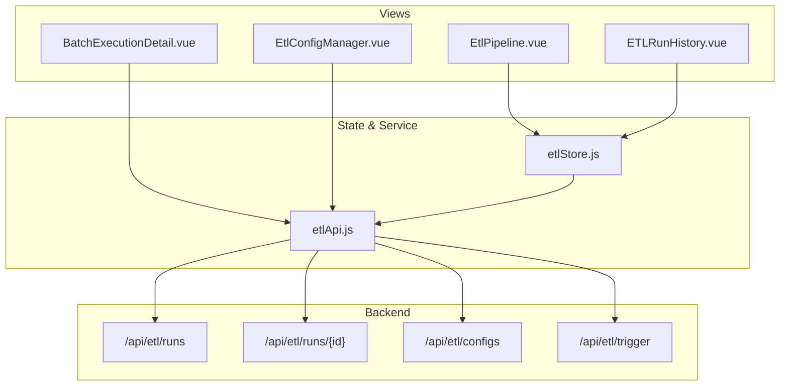
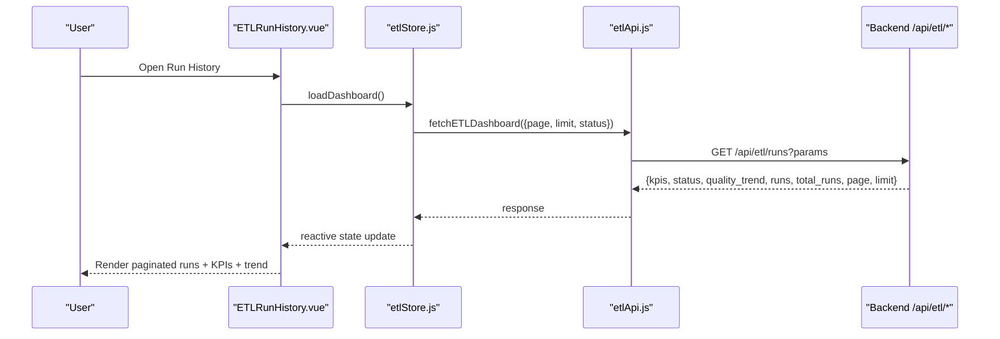
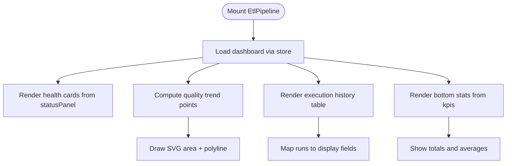
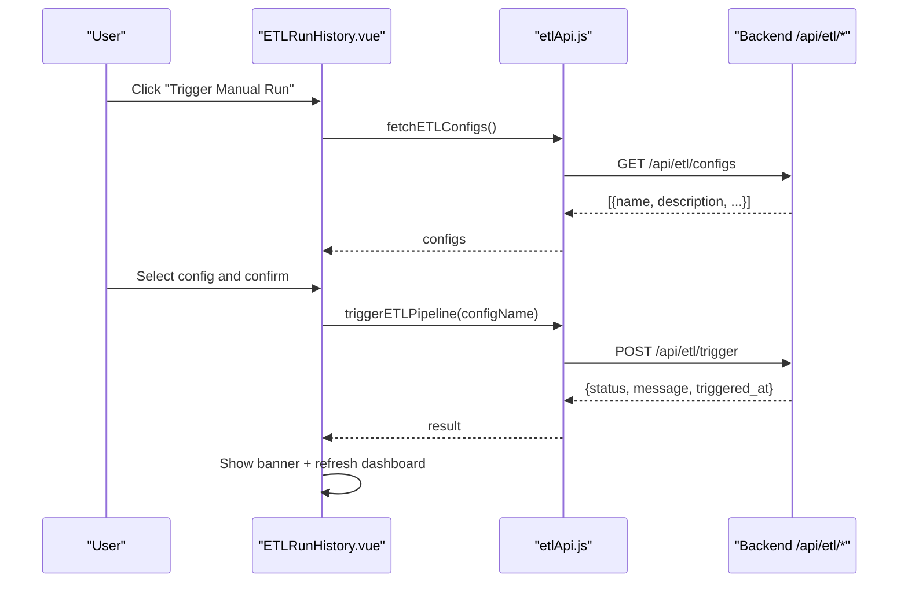
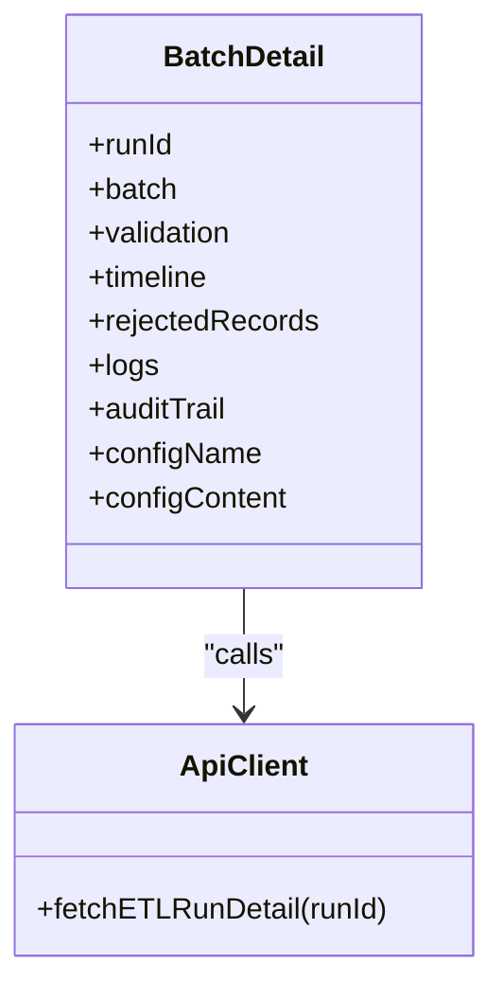
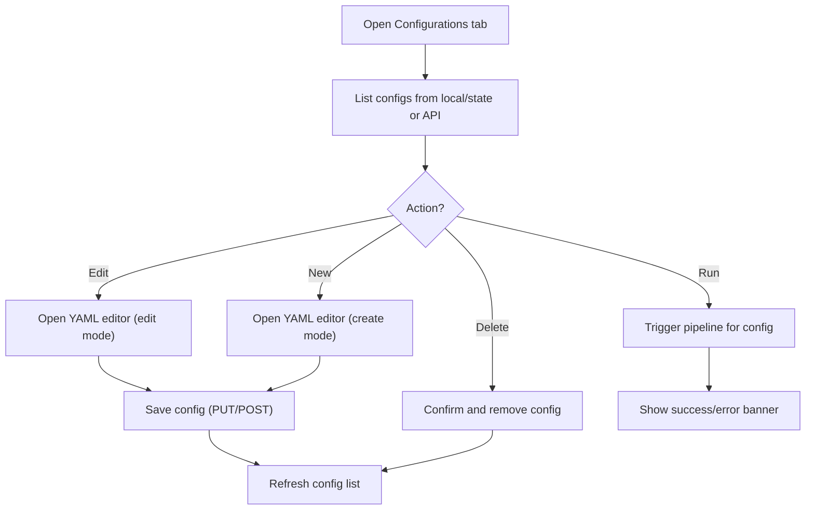
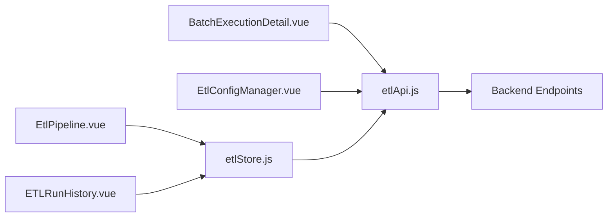

# Data Pipeline Module

<cite>
**Referenced Files in This Document**
- [EtlPipeline.vue](file://src/views/Modules/datapipeline/EtlPipeline.vue)
- [ETLRunHistory.vue](file://src/views/Modules/datapipeline/ETLRunHistory.vue)
- [BatchExecutionDetail.vue](file://src/views/Modules/datapipeline/BatchExecutionDetail.vue)
- [EtlConfigManager.vue](file://src/views/Modules/datapipeline/EtlConfigManager.vue)
- [etlApi.js](file://src/services/etlApi.js)
- [etlStore.js](file://src/stores/etlStore.js)
- [ETL-CONFIG-MANAGER-REQUIREMENTS.md](file://docs/ETL-CONFIG-MANAGER-REQUIREMENTS.md)
- [ETL-CONFIG-MANAGER-REQUIREMENTS-V2.md](file://docs/ETL-CONFIG-MANAGER-REQUIREMENTS-V2.md)
</cite>

## Table of Contents
1. [Introduction](#introduction)
2. [Project Structure](#project-structure)
3. [Core Components](#core-components)
4. [Architecture Overview](#architecture-overview)
5. [Detailed Component Analysis](#detailed-component-analysis)
6. [Dependency Analysis](#dependency-analysis)
7. [Performance Considerations](#performance-considerations)
8. [Troubleshooting Guide](#troubleshooting-guide)
9. [Conclusion](#conclusion)
10. [Appendices](#appendices)

## Introduction
This document provides comprehensive documentation for the Data Pipeline module, focusing on ETL orchestration, batch execution, run history tracking, and configuration management. It also covers data quality monitoring features visible in the UI (completeness indicators via row counts, freshness via timestamps, accuracy via quality scores, and anomaly detection through rejection analysis). The module exposes a dashboard for pipeline health, an execution history viewer with pagination, a detailed batch inspector with logs and audit trails, and a configuration manager for creating and editing extraction specs. Integration points to AI agents and strategic modules are addressed conceptually based on available routes and component organization.

## Project Structure
The Data Pipeline module is implemented as a set of Vue components under the datapipeline feature folder, backed by a Pinia store and an API service layer:
- Views:
  - EtlPipeline.vue: Health dashboard with system status cards, quality trend chart, and execution history summary.
  - ETLRunHistory.vue: Paginated execution history, trigger modal, and footer metrics.
  - BatchExecutionDetail.vue: Detailed view of a single run including timeline, logs, audit trail, and rejection analysis.
  - EtlConfigManager.vue: Tabbed interface for configurations with YAML editor and run actions.
- Services:
  - etlApi.js: HTTP client for ETL endpoints (runs, configs, trigger).
- Store:
  - etlStore.js: Pinia store managing dashboard state, pagination, and KPIs.

**Diagram sources**
- [EtlPipeline.vue:217-288](file://src/views/Modules/datapipeline/EtlPipeline.vue#L217-L288)
- [ETLRunHistory.vue:267-397](file://src/views/Modules/datapipeline/ETLRunHistory.vue#L267-L397)
- [BatchExecutionDetail.vue:113-151](file://src/views/Modules/datapipeline/BatchExecutionDetail.vue#L113-L151)
- [EtlConfigManager.vue:150-337](file://src/views/Modules/datapipeline/EtlConfigManager.vue#L150-L337)
- [etlStore.js:33-57](file://src/stores/etlStore.js#L33-L57)
- [etlApi.js:68-114](file://src/services/etlApi.js#L68-L114)

**Section sources**
- [EtlPipeline.vue:1-215](file://src/views/Modules/datapipeline/EtlPipeline.vue#L1-L215)
- [ETLRunHistory.vue:1-266](file://src/views/Modules/datapipeline/ETLRunHistory.vue#L1-L266)
- [BatchExecutionDetail.vue:1-152](file://src/views/Modules/datapipeline/BatchExecutionDetail.vue#L1-L152)
- [EtlConfigManager.vue:1-148](file://src/views/Modules/datapipeline/EtlConfigManager.vue#L1-L148)
- [etlStore.js:1-96](file://src/stores/etlStore.js#L1-L96)
- [etlApi.js:1-115](file://src/services/etlApi.js#L1-L115)

## Core Components
- ETL Dashboard (EtlPipeline.vue): Displays system health cards (PostgreSQL, Redis, API Gateway), a quality score trend line chart, and a summary table of recent executions with quality bars and statuses.
- Run History (ETLRunHistory.vue): Paginated list of runs with filters, trigger modal to start pipelines using available configs, and footer metrics summarizing storage growth, average quality, failed retries, and gateway latency.
- Batch Detail (BatchExecutionDetail.vue): Deep dive into a specific run showing quality vs SLA, duration, rows processed, execution timeline, rejection categories, failing rules, logs, audit trail, and config snapshot.
- Config Manager (EtlConfigManager.vue): Lists extraction specs, opens a YAML editor for create/edit, supports search, save, delete, and run triggers per spec.

Key capabilities exposed:
- Pipeline orchestration: Trigger manual runs from UI; backend launches background processes per requirements.
- Batch execution: Paginated runs with durations, row counts, and quality scores.
- Run history tracking: Full history with pagination, status filtering, and detail drill-down.
- DAG visualization: Not implemented in current code; only linear timeline steps are shown in batch detail.
- Data quality monitoring: Completeness via row counts, freshness via timestamps, accuracy via quality scores, anomaly detection via rejection categories and failing rules.
- Configuration management: Create, edit, delete, and trigger extraction specs; YAML validation hints and save workflows.

**Section sources**
- [EtlPipeline.vue:31-212](file://src/views/Modules/datapipeline/EtlPipeline.vue#L31-L212)
- [ETLRunHistory.vue:100-222](file://src/views/Modules/datapipeline/ETLRunHistory.vue#L100-L222)
- [BatchExecutionDetail.vue:196-482](file://src/views/Modules/datapipeline/BatchExecutionDetail.vue#L196-L482)
- [EtlConfigManager.vue:195-337](file://src/views/Modules/datapipeline/EtlConfigManager.vue#L195-L337)
- [ETL-CONFIG-MANAGER-REQUIREMENTS.md:13-16](file://docs/ETL-CONFIG-MANAGER-REQUIREMENTS.md#L13-L16)
- [ETL-CONFIG-MANAGER-REQUIREMENTS-V2.md:13-16](file://docs/ETL-CONFIG-MANAGER-REQUIREMENTS-V2.md#L13-L16)

## Architecture Overview
The frontend architecture separates concerns across views, store, and services:
- Views render UI and handle user interactions.
- etlStore.js centralizes dashboard state, pagination, and KPIs, calling etlApi.js for data fetching.
- etlApi.js encapsulates HTTP calls to backend endpoints with error handling and parameter sanitization.
- Backend endpoints provide run history, run details, configuration listing, and trigger execution.

**Diagram sources**
- [ETLRunHistory.vue:394-397](file://src/views/Modules/datapipeline/ETLRunHistory.vue#L394-L397)
- [etlStore.js:33-57](file://src/stores/etlStore.js#L33-L57)
- [etlApi.js:68-75](file://src/services/etlApi.js#L68-L75)

**Section sources**
- [etlStore.js:12-28](file://src/stores/etlStore.js#L12-L28)
- [etlApi.js:10-49](file://src/services/etlApi.js#L10-L49)

## Detailed Component Analysis

### ETL Dashboard (EtlPipeline.vue)
- System health cards show PostgreSQL cluster, Redis cache, and API Gateway status and metrics.
- Quality Score Trend visualizes integrity score over time with a threshold line at 90%.
- Execution History table lists recent runs with run ID, batch ID, duration, row counts (received/valid/loaded/rejected), quality score bar, and status badges.
- Bottom stats summarize total runs, average quality, failed retries, and average query latency.

Implementation highlights:
- Uses Pinia store for reactive data binding (loading, kpis, statusPanel, qualityTrend, runs).
- Computes SVG area and polyline points for the quality trend chart.
- Maps run status and quality score to color classes for consistent visual cues.

**Diagram sources**
- [EtlPipeline.vue:225-288](file://src/views/Modules/datapipeline/EtlPipeline.vue#L225-L288)
- [EtlPipeline.vue:239-262](file://src/views/Modules/datapipeline/EtlPipeline.vue#L239-L262)

**Section sources**
- [EtlPipeline.vue:31-212](file://src/views/Modules/datapipeline/EtlPipeline.vue#L31-L212)
- [EtlPipeline.vue:217-288](file://src/views/Modules/datapipeline/EtlPipeline.vue#L217-L288)

### Run History (ETLRunHistory.vue)
- Provides a paginated table of runs with filter dropdowns and navigation controls.
- Includes a trigger modal that lists available extraction specs and starts a pipeline run.
- Footer metrics present storage growth, average quality, failed retries, and gateway latency.

Key flows:
- On mount, loads dashboard data via store.
- Opens trigger modal, fetches configs if needed, and triggers pipeline with selected config.
- Updates UI with success/error banners and refreshes data after trigger.

**Diagram sources**
- [ETLRunHistory.vue:352-391](file://src/views/Modules/datapipeline/ETLRunHistory.vue#L352-L391)
- [etlApi.js:94-114](file://src/services/etlApi.js#L94-L114)

**Section sources**
- [ETLRunHistory.vue:100-222](file://src/views/Modules/datapipeline/ETLRunHistory.vue#L100-L222)
- [ETLRunHistory.vue:321-340](file://src/views/Modules/datapipeline/ETLRunHistory.vue#L321-L340)
- [ETLRunHistory.vue:352-391](file://src/views/Modules/datapipeline/ETLRunHistory.vue#L352-L391)

### Batch Execution Detail (BatchExecutionDetail.vue)
- Shows a run snapshot with quality score vs SLA, duration, rows processed, and data quality metrics (duplicates, warnings, errors, skipped).
- Execution timeline displays step-by-step progress with timestamps and durations.
- Rejection analysis includes category breakdown and top failing rules.
- Investigation tabs expose rejected records, execution logs, and audit trail.
- Config snapshot shows the YAML used for the run.

**Diagram sources**
- [BatchExecutionDetail.vue:113-151](file://src/views/Modules/datapipeline/BatchExecutionDetail.vue#L113-L151)
- [BatchExecutionDetail.vue:196-482](file://src/views/Modules/datapipeline/BatchExecutionDetail.vue#L196-L482)

**Section sources**
- [BatchExecutionDetail.vue:18-47](file://src/views/Modules/datapipeline/BatchExecutionDetail.vue#L18-L47)
- [BatchExecutionDetail.vue:49-86](file://src/views/Modules/datapipeline/BatchExecutionDetail.vue#L49-L86)
- [BatchExecutionDetail.vue:113-151](file://src/views/Modules/datapipeline/BatchExecutionDetail.vue#L113-L151)
- [BatchExecutionDetail.vue:196-482](file://src/views/Modules/datapipeline/BatchExecutionDetail.vue#L196-L482)

### Config Manager (EtlConfigManager.vue)
- Tabbed interface with “Run History” and “Configurations”.
- Configurations panel lists extraction specs with name, status, last modified, size, and actions (edit, run, delete).
- Inline YAML editor supports edit and preview modes with line numbers and syntax highlighting hints.
- Save workflow persists changes and refreshes the list; delete removes entries without full reload.

**Diagram sources**
- [EtlConfigManager.vue:150-337](file://src/views/Modules/datapipeline/EtlConfigManager.vue#L150-L337)

**Section sources**
- [EtlConfigManager.vue:150-337](file://src/views/Modules/datapipeline/EtlConfigManager.vue#L150-L337)
- [ETL-CONFIG-MANAGER-REQUIREMENTS.md:79-137](file://docs/ETL-CONFIG-MANAGER-REQUIREMENTS.md#L79-L137)
- [ETL-CONFIG-MANAGER-REQUIREMENTS-V2.md:79-137](file://docs/ETL-CONFIG-MANAGER-REQUIREMENTS-V2.md#L79-L137)

## Dependency Analysis
- View-to-store coupling: EtlPipeline.vue and ETLRunHistory.vue consume etlStore.js for dashboard state and pagination.
- Store-to-service coupling: etlStore.js calls etlApi.js for all backend requests.
- Service-to-backend coupling: etlApi.js maps to REST endpoints (/api/etl/runs, /api/etl/runs/{id}, /api/etl/configs, /api/etl/trigger).
- Error handling: etlApi.js centralizes response parsing and error normalization; views handle user-facing messages and retry flows.

**Diagram sources**
- [EtlPipeline.vue:217-288](file://src/views/Modules/datapipeline/EtlPipeline.vue#L217-L288)
- [ETLRunHistory.vue:267-397](file://src/views/Modules/datapipeline/ETLRunHistory.vue#L267-L397)
- [BatchExecutionDetail.vue:113-151](file://src/views/Modules/datapipeline/BatchExecutionDetail.vue#L113-L151)
- [EtlConfigManager.vue:150-337](file://src/views/Modules/datapipeline/EtlConfigManager.vue#L150-L337)
- [etlStore.js:33-57](file://src/stores/etlStore.js#L33-L57)
- [etlApi.js:68-114](file://src/services/etlApi.js#L68-L114)

**Section sources**
- [etlApi.js:18-49](file://src/services/etlApi.js#L18-L49)
- [etlStore.js:33-57](file://src/stores/etlStore.js#L33-L57)

## Performance Considerations
- Pagination: Use store-managed page and limit to avoid loading large datasets at once.
- Reactive computations: Quality trend chart computes SVG points efficiently; ensure data arrays remain small for responsiveness.
- Network calls: Centralized error handling reduces redundant logic; consider caching strategies for static configs if frequently accessed.
- UI rendering: Avoid excessive re-renders by leveraging computed properties and minimal DOM updates.

[No sources needed since this section provides general guidance]

## Troubleshooting Guide
Common issues and resolutions:
- Dashboard fails to load: Check network connectivity and authentication token; verify /api/etl/runs responds with expected shape.
- Trigger modal empty: Ensure /api/etl/configs returns configs; inspect error banners and retry flow.
- Run detail not found: Validate runId passed to /api/etl/runs/{id}; check routing parameters.
- YAML save errors: Confirm required fields (name, source) per client-side validation; backend performs full schema validation.

Error handling patterns:
- etlApi.js normalizes errors and attaches status/data; views surface human-readable messages with retry options.
- Trigger modal shows dismissible banners for success and error states with auto-dismiss timers.

**Section sources**
- [etlApi.js:18-49](file://src/services/etlApi.js#L18-L49)
- [ETLRunHistory.vue:352-391](file://src/views/Modules/datapipeline/ETLRunHistory.vue#L352-L391)
- [BatchExecutionDetail.vue:145-151](file://src/views/Modules/datapipeline/BatchExecutionDetail.vue#L145-L151)
- [ETL-CONFIG-MANAGER-REQUIREMENTS.md:269-280](file://docs/ETL-CONFIG-MANAGER-REQUIREMENTS.md#L269-L280)

## Conclusion
The Data Pipeline module provides a robust frontend for monitoring and operating ETL pipelines. It offers clear visibility into pipeline health, execution history, and data quality metrics, along with configuration management for extraction specs. While DAG visualization is not currently implemented, the linear timeline and detailed batch inspection support effective troubleshooting. Integration with AI agents and strategic modules can be facilitated via shared data outputs and pipeline-triggered model training inputs.

[No sources needed since this section summarizes without analyzing specific files]

## Appendices

### Practical Examples
- Creating an ETL job:
  - Open Configurations tab, click New Config, fill YAML with source and output definitions, save, then trigger run.
  - Reference: [EtlConfigManager.vue:195-337](file://src/views/Modules/datapipeline/EtlConfigManager.vue#L195-L337)
- Monitoring pipeline performance:
  - Review dashboard health cards, quality trend, and footer metrics; drill into run history for duration and quality trends.
  - Reference: [EtlPipeline.vue:31-212](file://src/views/Modules/datapipeline/EtlPipeline.vue#L31-L212), [ETLRunHistory.vue:100-222](file://src/views/Modules/datapipeline/ETLRunHistory.vue#L100-L222)
- Troubleshooting data quality issues:
  - Inspect batch detail for rejection categories and failing rules; review logs and audit trail for root cause.
  - Reference: [BatchExecutionDetail.vue:288-456](file://src/views/Modules/datapipeline/BatchExecutionDetail.vue#L288-L456)

### Integration Patterns with AI Agents and Strategic Management
- Model training data:
  - Use extracted and validated datasets produced by ETL runs as inputs for AI agent training jobs; trigger pipelines before model training to ensure fresh data.
  - Reference: [ETL-CONFIG-MANAGER-REQUIREMENTS.md:295-303](file://docs/ETL-CONFIG-MANAGER-REQUIREMENTS.md#L295-L303)
- Analytics inputs:
  - Configure extraction specs targeting analytics-ready formats; monitor quality scores to ensure SLA compliance for downstream analytics.
  - Reference: [ETL-CONFIG-MANAGER-REQUIREMENTS-V2.md:295-303](file://docs/ETL-CONFIG-MANAGER-REQUIREMENTS-V2.md#L295-L303)

[No additional sources beyond those cited above]