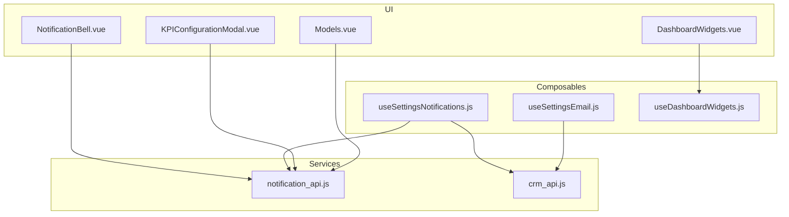
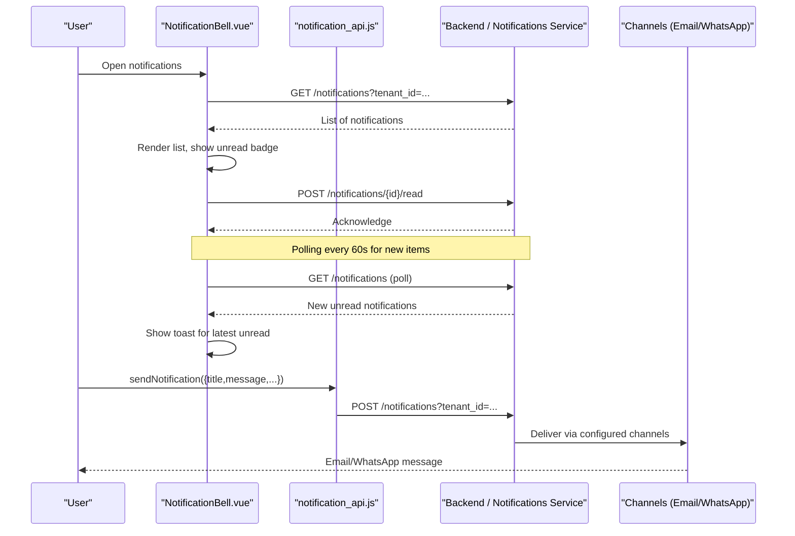
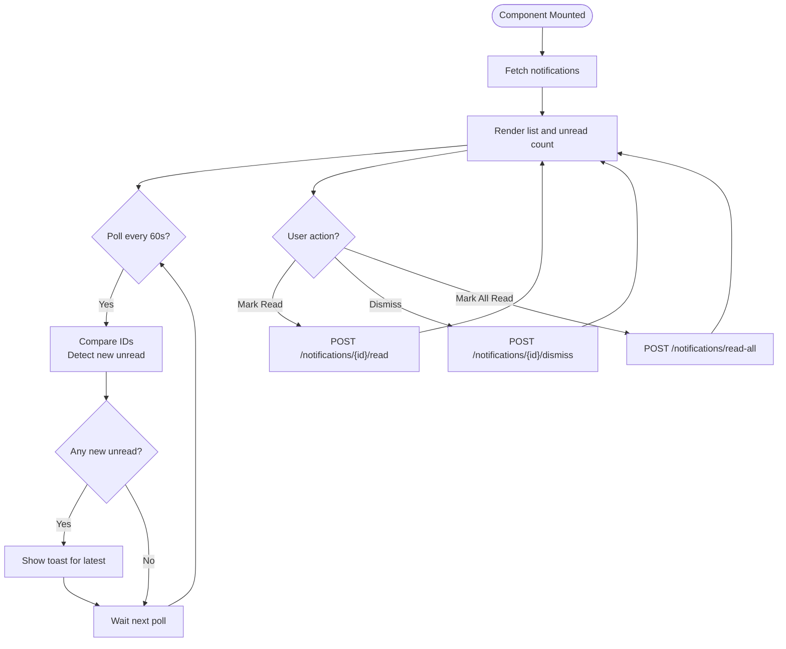
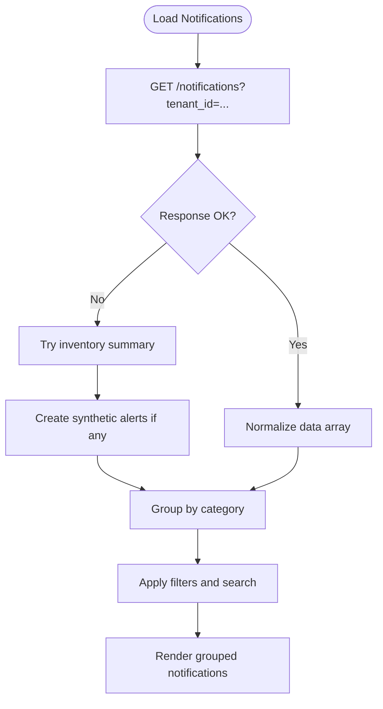
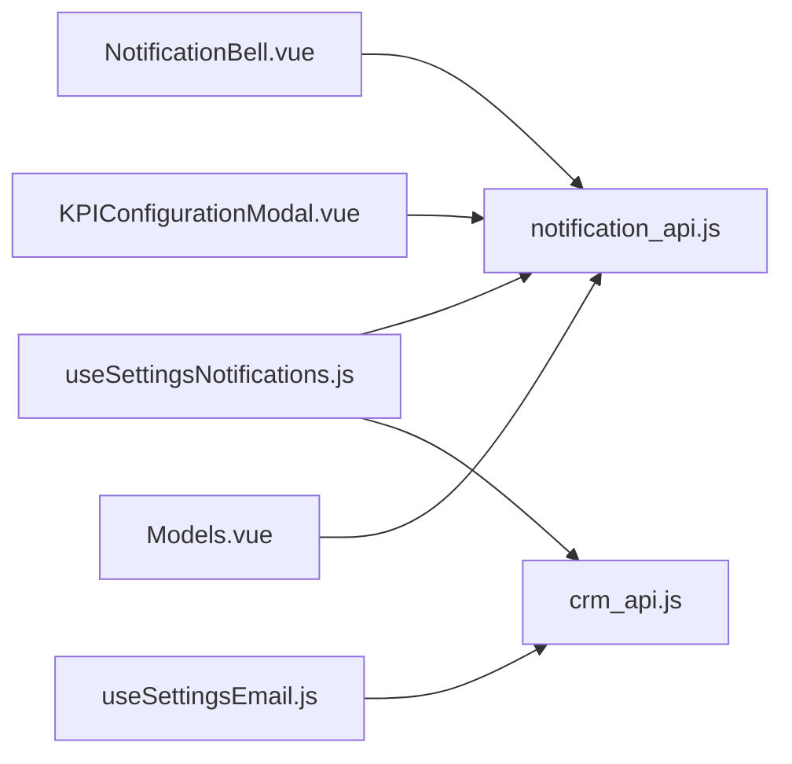

# Alerting System

<cite>
**Referenced Files in This Document**
- [NotificationBell.vue](file://src/components/NotificationBell.vue)
- [notification_api.js](file://src/services/notification_api.js)
- [useSettingsNotifications.js](file://src/composables/settings/useSettingsNotifications.js)
- [useSettingsEmail.js](file://src/composables/settings/useSettingsEmail.js)
- [KPIConfigurationModal.vue](file://src/views/Modules/strategic/modals/KPIConfigurationModal.vue)
- [Models.vue](file://src/views/Modules/aiagents/Models.vue)
- [DashboardWidgets.vue](file://src/components/ui/DashboardWidgets.vue)
- [useDashboardWidgets.js](file://src/composables/useDashboardWidgets.js)
- [crm_api.js](file://src/services/crm_api.js)
</cite>

## Table of Contents
1. Introduction
2. Project Structure
3. Core Components
4. Architecture Overview
5. Detailed Component Analysis
6. Dependency Analysis
7. Performance Considerations
8. Troubleshooting Guide
9. Conclusion
10. Appendices

## Introduction
This document explains the Alerting System implemented in the frontend application. It covers:
- Notification channels and delivery mechanisms (email, WhatsApp, in-app notifications; webhook/SMS are extensible via backend APIs)
- Escalation policies based on severity levels and business impact
- Incident response workflows that automate initial troubleshooting and notify appropriate teams
- Alert rule configuration, suppression, and deduplication strategies
- Practical examples for setting up custom alert rules, configuring escalation chains, and integrating with external monitoring tools
- Alert fatigue prevention, testing configurations, and monitoring effectiveness

## Project Structure
The alerting system spans UI components, composables for settings, and service integrations:
- In-app notification UI and polling: NotificationBell.vue
- Notification sending API client: notification_api.js
- Notification settings and management: useSettingsNotifications.js
- Email configuration and templates: useSettingsEmail.js
- KPI alert thresholds and visualization: KPIConfigurationModal.vue, Models.vue
- Dashboard widgets enabling alert visibility: DashboardWidgets.vue, useDashboardWidgets.js
- CRM-related notification helpers: crm_api.js

**Diagram sources**
- [NotificationBell.vue:121-159](file://src/components/NotificationBell.vue#L121-L159)
- [notification_api.js:18-59](file://src/services/notification_api.js#L18-L59)
- [useSettingsNotifications.js:188-216](file://src/composables/settings/useSettingsNotifications.js#L188-L216)
- [useSettingsEmail.js:67-118](file://src/composables/settings/useSettingsEmail.js#L67-L118)
- [DashboardWidgets.vue:1-71](file://src/components/ui/DashboardWidgets.vue#L1-L71)
- [useDashboardWidgets.js:24-51](file://src/composables/useDashboardWidgets.js#L24-L51)
- [crm_api.js:230-267](file://src/services/crm_api.js#L230-L267)

**Section sources**
- [NotificationBell.vue:121-159](file://src/components/NotificationBell.vue#L121-L159)
- [notification_api.js:18-59](file://src/services/notification_api.js#L18-L59)
- [useSettingsNotifications.js:188-216](file://src/composables/settings/useSettingsNotifications.js#L188-L216)
- [useSettingsEmail.js:67-118](file://src/composables/settings/useSettingsEmail.js#L67-L118)
- [DashboardWidgets.vue:1-71](file://src/components/ui/DashboardWidgets.vue#L1-L71)
- [useDashboardWidgets.js:24-51](file://src/composables/useDashboardWidgets.js#L24-L51)
- [crm_api.js:230-267](file://src/services/crm_api.js#L230-L267)

## Core Components
- In-app notifications and polling: The bell component fetches notifications from the backend, displays them, supports read/dismiss actions, and shows toast popups for new unread items during polling.
- Notification API client: A reusable function to send notifications to configured channels (email, WhatsApp) and store in-app notifications.
- Notification settings: Manage channels, scheduling, test sends, inventory-derived synthetic alerts, and per-item alert toggles.
- Email configuration: Configure SMTP, templates, frequency, and enable/disable specific notification types.
- KPI alert thresholds: Define critical and warning thresholds per KPI and associate notification emails.
- Model drift alerts: Display active alerts with severity, current value, threshold, and time since detection.

**Section sources**
- [NotificationBell.vue:121-159](file://src/components/NotificationBell.vue#L121-L159)
- [notification_api.js:18-59](file://src/services/notification_api.js#L18-L59)
- [useSettingsNotifications.js:188-216](file://src/composables/settings/useSettingsNotifications.js#L188-L216)
- [useSettingsEmail.js:67-118](file://src/composables/settings/useSettingsEmail.js#L67-L118)
- [KPIConfigurationModal.vue:197-236](file://src/views/Modules/strategic/modals/KPIConfigurationModal.vue#L197-L236)
- [Models.vue:556-589](file://src/views/Modules/aiagents/Models.vue#L556-L589)

## Architecture Overview
The alerting flow combines real-time in-app notifications with channel-based delivery:
- Frontend triggers or polls for notifications
- Backend persists notifications and routes them to configured channels
- Users interact with notifications to mark as read or dismiss
- Settings allow per-tenant configuration of channels and schedules

**Diagram sources**
- [NotificationBell.vue:121-159](file://src/components/NotificationBell.vue#L121-L159)
- [notification_api.js:18-59](file://src/services/notification_api.js#L18-L59)

## Detailed Component Analysis

### In-App Notification Bell
Responsibilities:
- Fetch notifications for the tenant
- Poll periodically to detect new unread items
- Mark individual or all notifications as read
- Dismiss notifications
- Show toast for newly arrived unread notifications
- Provide quick link to configure alert settings

Key behaviors:
- Polling interval set to 60 seconds
- “Small Pop” logic highlights newly arrived unread notifications
- Category icons help users quickly identify context

**Diagram sources**
- [NotificationBell.vue:121-159](file://src/components/NotificationBell.vue#L121-L159)
- [NotificationBell.vue:161-199](file://src/components/NotificationBell.vue#L161-L199)

**Section sources**
- [NotificationBell.vue:121-159](file://src/components/NotificationBell.vue#L121-L159)
- [NotificationBell.vue:161-199](file://src/components/NotificationBell.vue#L161-L199)

### Notification API Client
Responsibilities:
- Send notifications to the backend with tenant context
- Attach optional recipient overrides and channel selection
- Handle authentication headers and error responses

Usage patterns:
- Triggered by features to create in-app notifications and deliver via configured channels
- Supports metadata for routing and deep linking

**Section sources**
- [notification_api.js:18-59](file://src/services/notification_api.js#L18-L59)

### Notification Settings Composable
Responsibilities:
- Load and group notifications by category
- Filter by status and search text
- Manage global and per-item notification toggles
- Save notification settings including channels and schedule
- Send test notifications across enabled channels
- Export notifications to Excel/PDF

Key capabilities:
- Synthetic notifications derived from inventory summary when no backend notifications exist
- Per-item alert toggles for low/critical/empty stock
- Global stock thresholds configuration

**Diagram sources**
- [useSettingsNotifications.js:188-216](file://src/composables/settings/useSettingsNotifications.js#L188-L216)
- [useSettingsNotifications.js:276-292](file://src/composables/settings/useSettingsNotifications.js#L276-L292)

**Section sources**
- [useSettingsNotifications.js:188-216](file://src/composables/settings/useSettingsNotifications.js#L188-L216)
- [useSettingsNotifications.js:276-292](file://src/composables/settings/useSettingsNotifications.js#L276-L292)

### Email Configuration
Responsibilities:
- Create, edit, and delete email configurations
- Configure SMTP host, port, TLS/SSL, sender identity
- Set notification frequencies and enable/disable per type
- Test saved configurations with a recipient

Integration points:
- Uses CRM email API for CRUD operations and testing
- Stores frequency and enable flags as metadata for downstream processing

**Section sources**
- [useSettingsEmail.js:67-118](file://src/composables/settings/useSettingsEmail.js#L67-L118)
- [useSettingsEmail.js:154-199](file://src/composables/settings/useSettingsEmail.js#L154-L199)

### KPI Alert Thresholds
Responsibilities:
- Define target values and minimum/stretch goals
- Configure critical and warning thresholds
- Associate notification email for threshold breaches
- Visualize performance and trends

Operational notes:
- Thresholds drive alert generation on the backend or scheduled jobs
- Emails can be targeted per KPI for focused reporting

**Section sources**
- [KPIConfigurationModal.vue:153-236](file://src/views/Modules/strategic/modals/KPIConfigurationModal.vue#L153-L236)

### Model Drift Alerts
Responsibilities:
- Display active alerts with severity, feature/metric, current value, threshold, and duration
- Provide an “Investigate” action to navigate to deeper diagnostics

Operational notes:
- Severity classes map to visual indicators
- Alerts are surfaced in AI agents module for model stability monitoring

**Section sources**
- [Models.vue:556-589](file://src/views/Modules/aiagents/Models.vue#L556-L589)

### Dashboard Widgets
Responsibilities:
- Enable/disable dashboard widgets persistently
- Dynamically render active widgets

Relevance to alerting:
- Dashboards can host alert widgets to provide at-a-glance visibility into system health and KPI breaches

**Section sources**
- [DashboardWidgets.vue:1-71](file://src/components/ui/DashboardWidgets.vue#L1-L71)
- [useDashboardWidgets.js:24-51](file://src/composables/useDashboardWidgets.js#L24-L51)

## Dependency Analysis
- NotificationBell depends on notification_api endpoints for listing and marking read/dismiss
- useSettingsNotifications composes multiple endpoints for loading, filtering, saving settings, and exporting reports
- useSettingsEmail integrates with CRM email API for template and SMTP management
- CRM API provides helper functions for notifications and communications

**Diagram sources**
- [NotificationBell.vue:121-159](file://src/components/NotificationBell.vue#L121-L159)
- [notification_api.js:18-59](file://src/services/notification_api.js#L18-L59)
- [useSettingsNotifications.js:188-216](file://src/composables/settings/useSettingsNotifications.js#L188-L216)
- [useSettingsEmail.js:67-118](file://src/composables/settings/useSettingsEmail.js#L67-L118)
- [crm_api.js:230-267](file://src/services/crm_api.js#L230-L267)

**Section sources**
- [NotificationBell.vue:121-159](file://src/components/NotificationBell.vue#L121-L159)
- [notification_api.js:18-59](file://src/services/notification_api.js#L18-L59)
- [useSettingsNotifications.js:188-216](file://src/composables/settings/useSettingsNotifications.js#L188-L216)
- [useSettingsEmail.js:67-118](file://src/composables/settings/useSettingsEmail.js#L67-L118)
- [crm_api.js:230-267](file://src/services/crm_api.js#L230-L267)

## Performance Considerations
- Polling interval is set to 60 seconds to balance freshness and server load
- Local state updates minimize re-renders after read/dismiss actions
- Grouping and filtering notifications client-side reduces unnecessary network calls
- Synthetic notifications avoid empty states when backend has no notifications yet

[No sources needed since this section provides general guidance]

## Troubleshooting Guide
Common issues and resolutions:
- No notifications appear: Ensure tenant ID is present and user is authenticated; verify backend endpoint returns data
- Test notification fails: Validate SMTP settings and recipient address; check channel toggles and schedule configuration
- Alerts not delivered: Confirm channels are enabled and recipients are set; review backend logs for delivery errors
- Duplicate notifications: Use deduplication keys (e.g., trigger_id or entity_id) on the backend; ensure unique identifiers per event
- Suppression needed: Implement cooldown windows and suppression rules based on severity and time windows

Operational tips:
- Use the test notification feature to validate channel connectivity
- Export notifications to Excel/PDF for audit and analysis
- Monitor unread counts and toast frequency to detect anomalies

**Section sources**
- [useSettingsNotifications.js:294-310](file://src/composables/settings/useSettingsNotifications.js#L294-L310)
- [useSettingsEmail.js:154-199](file://src/composables/settings/useSettingsEmail.js#L154-L199)

## Conclusion
The Alerting System provides a robust foundation for delivering timely, actionable alerts through in-app notifications and configured channels. It supports configurable thresholds, per-tenant settings, and practical tools for testing and auditing. By combining clear severity handling, channel flexibility, and user-friendly interfaces, it helps reduce alert fatigue while ensuring critical issues reach the right people promptly.

[No sources needed since this section summarizes without analyzing specific files]

## Appendices

### Implementation Specifics

#### Alert Rule Configuration
- Define KPI targets and thresholds (critical/warning)
- Associate notification emails per KPI
- Choose measurement frequency and data source
- Visualize trends and performance against targets

**Section sources**
- [KPIConfigurationModal.vue:153-236](file://src/views/Modules/strategic/modals/KPIConfigurationModal.vue#L153-L236)

#### Suppression Mechanisms
- Cooldown windows per alert type to prevent repeated notifications
- Severity-based suppression (e.g., suppress warnings during critical incidents)
- Time-window suppression to batch similar events

[No sources needed since this section provides general guidance]

#### Deduplication Strategies
- Use stable identifiers (trigger_id, entity_id) to deduplicate events
- Aggregate alerts by key fields and time buckets
- Maintain last-seen timestamps per alert key

[No sources needed since this section provides general guidance]

### Practical Examples

#### Setting Up Custom Alert Rules
- Create a KPI with measurement unit, frequency, and data source
- Set target, minimum, stretch goals
- Configure critical and warning thresholds
- Assign notification email for breaches

**Section sources**
- [KPIConfigurationModal.vue:153-236](file://src/views/Modules/strategic/modals/KPIConfigurationModal.vue#L153-L236)

#### Configuring Escalation Chains
- Define severity levels (info, warning, critical)
- Route critical alerts to primary responders; escalate to secondary if unresolved
- Use channels (email, WhatsApp) based on urgency and team preferences

[No sources needed since this section provides general guidance]

#### Integrating with External Monitoring Tools
- Use webhook endpoints exposed by the backend to forward alerts
- Map external tool events to internal categories and severities
- Enrich payloads with metadata for routing and context

[No sources needed since this section provides general guidance]

### Alert Fatigue Prevention
- Limit noise by suppressing low-priority alerts during high-severity events
- Batch notifications and enforce cooldowns
- Provide clear actions and context in messages
- Allow users to customize channels and frequencies per role

[No sources needed since this section provides general guidance]

### Testing Alert Configurations
- Use the test notification feature to validate channels
- Verify SMTP settings and recipient addresses
- Confirm schedule and channel toggles are applied correctly

**Section sources**
- [useSettingsNotifications.js:294-310](file://src/composables/settings/useSettingsNotifications.js#L294-L310)
- [useSettingsEmail.js:154-199](file://src/composables/settings/useSettingsEmail.js#L154-L199)

### Monitoring Alert Effectiveness
- Track open/read rates and response times
- Analyze alert volume and severity distribution
- Review false positives and adjust thresholds accordingly

[No sources needed since this section provides general guidance]