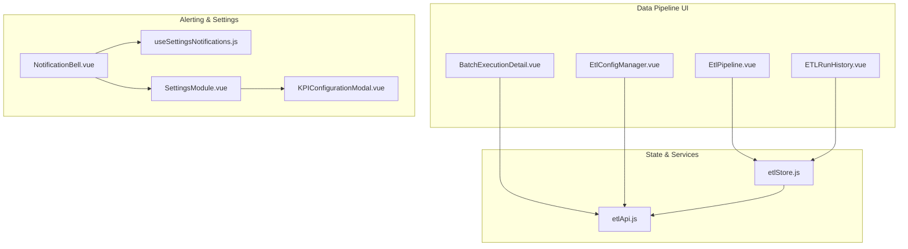
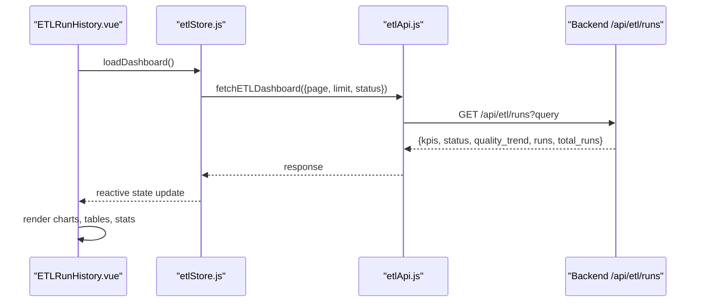
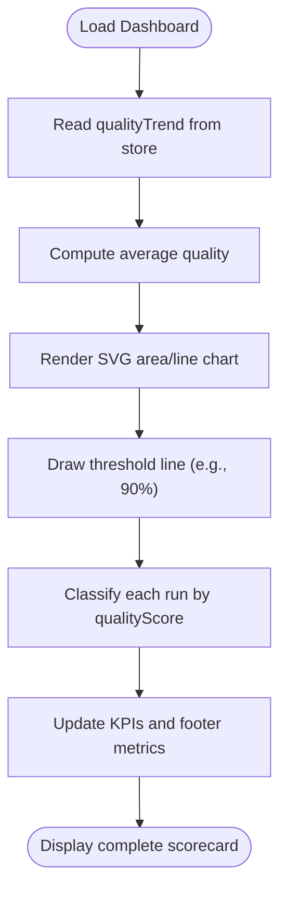
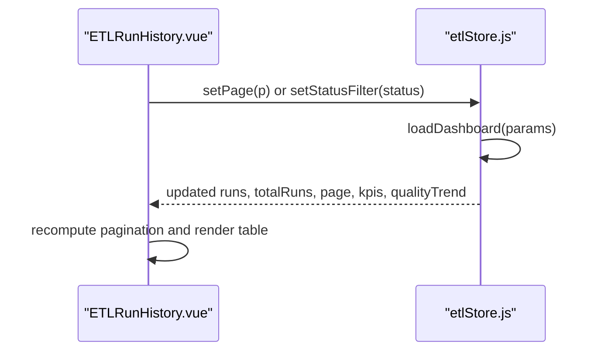
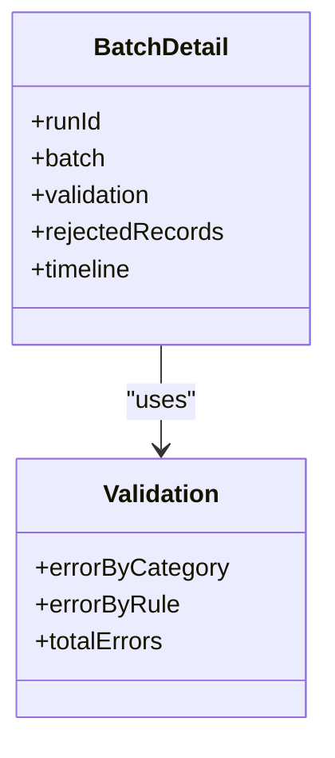
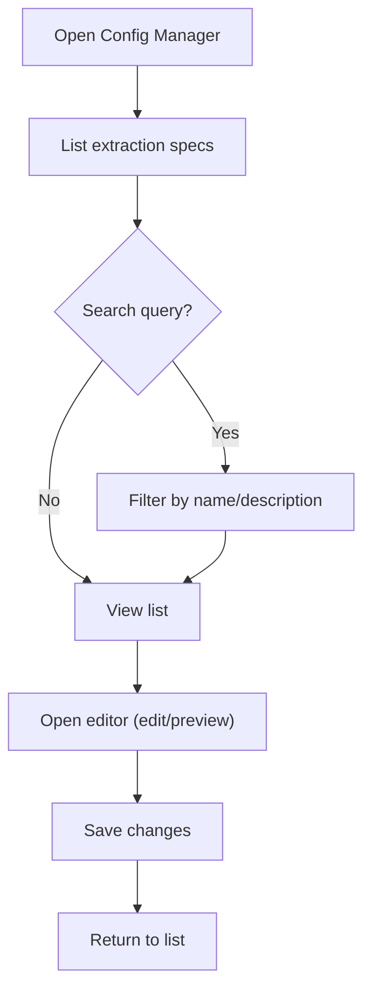
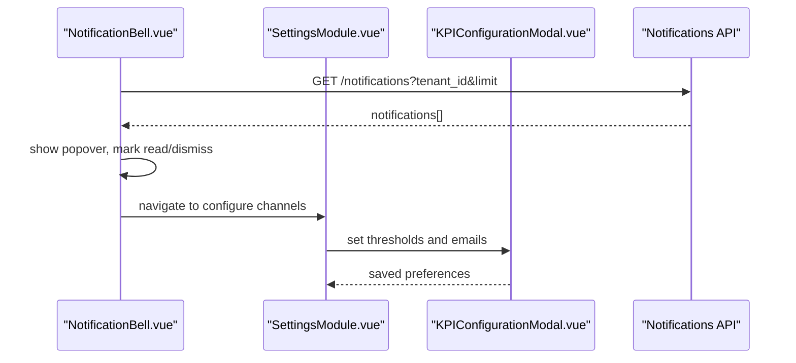
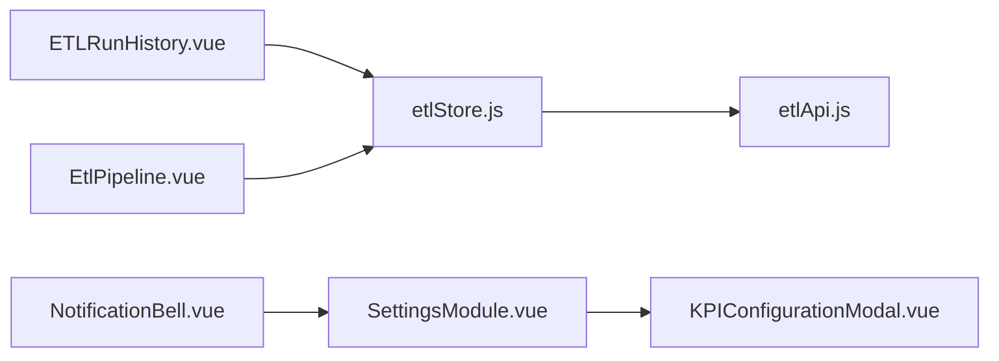

# Data Quality Monitoring

<cite>
**Referenced Files in This Document**
- [EtlPipeline.vue](file://src/views/Modules/datapipeline/EtlPipeline.vue)
- [ETLRunHistory.vue](file://src/views/Modules/datapipeline/ETLRunHistory.vue)
- [BatchExecutionDetail.vue](file://src/views/Modules/datapipeline/BatchExecutionDetail.vue)
- [EtlConfigManager.vue](file://src/views/Modules/datapipeline/EtlConfigManager.vue)
- [etlStore.js](file://src/stores/etlStore.js)
- [etlApi.js](file://src/services/etlApi.js)
- [NotificationBell.vue](file://src/components/NotificationBell.vue)
- [useSettingsNotifications.js](file://src/composables/settings/useSettingsNotifications.js)
- [SettingsModule.vue](file://src/views/Modules/settings/SettingsModule.vue)
- [KPIConfigurationModal.vue](file://src/views/Modules/strategic/modals/KPIConfigurationModal.vue)
</cite>

## Table of Contents
1. Introduction
2. Project Structure
3. Core Components
4. Architecture Overview
5. Detailed Component Analysis
6. Dependency Analysis
7. Performance Considerations
8. Troubleshooting Guide
9. Conclusion
10. Appendices

## Introduction
This document explains the Data Quality Monitoring system implemented in the frontend. It covers the quality scorecard, health scoring algorithm, alerting and notification channels, data profiling and validation views, configuration management for extraction specs, and integration points with backend APIs. It also provides practical guidance for configuring quality rules, monitoring health scores, investigating issues, and implementing corrective actions.

## Project Structure
The data quality monitoring feature is centered around the Data Pipeline module:
- ETL dashboard and trend visualization
- Execution history and pagination
- Batch execution detail with validation breakdowns
- Configuration manager for extraction specs
- Store and API service for fetching runs, KPIs, status panel, and quality trends
- Notification bell and settings for alert preferences

**Diagram sources**
- [EtlPipeline.vue:1-438](file://src/views/Modules/datapipeline/EtlPipeline.vue#L1-L438)
- [ETLRunHistory.vue:1-601](file://src/views/Modules/datapipeline/ETLRunHistory.vue#L1-L601)
- [BatchExecutionDetail.vue:1-357](file://src/views/Modules/datapipeline/BatchExecutionDetail.vue#L1-L357)
- [EtlConfigManager.vue:1-341](file://src/views/Modules/datapipeline/EtlConfigManager.vue#L1-L341)
- [etlStore.js:1-96](file://src/stores/etlStore.js#L1-L96)
- [etlApi.js:1-115](file://src/services/etlApi.js#L1-L115)
- [NotificationBell.vue:1-272](file://src/components/NotificationBell.vue#L1-L272)
- [useSettingsNotifications.js:77-110](file://src/composables/settings/useSettingsNotifications.js#L77-L110)
- [SettingsModule.vue:208-390](file://src/views/Modules/settings/SettingsModule.vue#L208-L390)
- [KPIConfigurationModal.vue:200-230](file://src/views/Modules/strategic/modals/KPIConfigurationModal.vue#L200-L230)

**Section sources**
- [EtlPipeline.vue:1-438](file://src/views/Modules/datapipeline/EtlPipeline.vue#L1-L438)
- [ETLRunHistory.vue:1-601](file://src/views/Modules/datapipeline/ETLRunHistory.vue#L1-L601)
- [BatchExecutionDetail.vue:1-357](file://src/views/Modules/datapipeline/BatchExecutionDetail.vue#L1-L357)
- [EtlConfigManager.vue:1-341](file://src/views/Modules/datapipeline/EtlConfigManager.vue#L1-L341)
- [etlStore.js:1-96](file://src/stores/etlStore.js#L1-L96)
- [etlApi.js:1-115](file://src/services/etlApi.js#L1-L115)
- [NotificationBell.vue:1-272](file://src/components/NotificationBell.vue#L1-L272)
- [useSettingsNotifications.js:77-110](file://src/composables/settings/useSettingsNotifications.js#L77-L110)
- [SettingsModule.vue:208-390](file://src/views/Modules/settings/SettingsModule.vue#L208-L390)
- [KPIConfigurationModal.vue:200-230](file://src/views/Modules/strategic/modals/KPIConfigurationModal.vue#L200-L230)

## Core Components
- ETL Dashboard (Quality Score Trend, System Health Cards, Execution History): Displays aggregated quality metrics, a trend line chart, and a paginated table of runs with per-run quality bars and statuses.
- Run History: Provides filters, pagination, and quick access to batch details; shows average quality, failed retries, and gateway latency.
- Batch Execution Detail: Shows validation breakdown by category and rule, timeline steps, and investigation tabs for rejected records.
- Config Manager: Lists, edits, previews, and triggers extraction specifications (YAML).
- Store and API: Centralized state for runs, KPIs, status panel, and quality trend; fetches from backend endpoints with error handling and parameter sanitization.
- Alerting and Notifications: Bell component polls notifications, supports mark-as-read/dismiss, and links to settings where channels and thresholds can be configured.

**Section sources**
- [EtlPipeline.vue:31-211](file://src/views/Modules/datapipeline/EtlPipeline.vue#L31-L211)
- [ETLRunHistory.vue:17-222](file://src/views/Modules/datapipeline/ETLRunHistory.vue#L17-L222)
- [BatchExecutionDetail.vue:18-347](file://src/views/Modules/datapipeline/BatchExecutionDetail.vue#L18-L347)
- [EtlConfigManager.vue:150-337](file://src/views/Modules/datapipeline/EtlConfigManager.vue#L150-L337)
- [etlStore.js:12-95](file://src/stores/etlStore.js#L12-L95)
- [etlApi.js:51-114](file://src/services/etlApi.js#L51-L114)
- [NotificationBell.vue:105-255](file://src/components/NotificationBell.vue#L105-L255)
- [useSettingsNotifications.js:77-110](file://src/composables/settings/useSettingsNotifications.js#L77-L110)
- [SettingsModule.vue:208-390](file://src/views/Modules/settings/SettingsModule.vue#L208-L390)
- [KPIConfigurationModal.vue:200-230](file://src/views/Modules/strategic/modals/KPIConfigurationModal.vue#L200-L230)

## Architecture Overview
The frontend composes multiple Vue components that consume a Pinia store. The store calls the ETL API service to fetch dashboard data (runs, KPIs, status panel, quality trend). The UI renders charts, tables, and detail views. Alerts are surfaced via a notification bell that polls a notifications endpoint and integrates with settings for channel preferences.

**Diagram sources**
- [ETLRunHistory.vue:267-397](file://src/views/Modules/datapipeline/ETLRunHistory.vue#L267-L397)
- [etlStore.js:32-57](file://src/stores/etlStore.js#L32-L57)
- [etlApi.js:68-75](file://src/services/etlApi.js#L68-L75)

**Section sources**
- [ETLRunHistory.vue:267-397](file://src/views/Modules/datapipeline/ETLRunHistory.vue#L267-L397)
- [etlStore.js:32-57](file://src/stores/etlStore.js#L32-L57)
- [etlApi.js:68-75](file://src/services/etlApi.js#L68-L75)

## Detailed Component Analysis

### Quality Scorecard and Health Scoring Algorithm
- Quality Score Trend: Computed from the store’s qualityTrend array; an SVG area/line chart visualizes recent values with a threshold line at 90%.
- Average Quality: Derived from the mean of qualityTrend values; displayed as a KPI and in the footer metrics.
- Per-Run Quality: Each run includes a qualityScore used to colorize a progress bar and classify into green/amber/red bands.
- Thresholds: A visible threshold line indicates a target (e.g., 90%); classification logic uses >=95% as good, >=80% as warning, else poor.

**Diagram sources**
- [EtlPipeline.vue:239-262](file://src/views/Modules/datapipeline/EtlPipeline.vue#L239-L262)
- [ETLRunHistory.vue:289-335](file://src/views/Modules/datapipeline/ETLRunHistory.vue#L289-L335)

**Section sources**
- [EtlPipeline.vue:73-105](file://src/views/Modules/datapipeline/EtlPipeline.vue#L73-L105)
- [EtlPipeline.vue:239-262](file://src/views/Modules/datapipeline/EtlPipeline.vue#L239-L262)
- [ETLRunHistory.vue:289-335](file://src/views/Modules/datapipeline/ETLRunHistory.vue#L289-L335)

### Execution History and Pagination
- Paginated Runs: The store holds runs, totalRuns, page, and limit; UI computes from/to indices and renders page controls.
- Filtering: Status filter updates page and reloads dashboard data.
- Row Metrics: Displays received/valid/loaded/rejected counts and per-run quality bars.

**Diagram sources**
- [ETLRunHistory.vue:321-340](file://src/views/Modules/datapipeline/ETLRunHistory.vue#L321-L340)
- [etlStore.js:59-68](file://src/stores/etlStore.js#L59-L68)

**Section sources**
- [ETLRunHistory.vue:99-171](file://src/views/Modules/datapipeline/ETLRunHistory.vue#L99-L171)
- [ETLRunHistory.vue:321-340](file://src/views/Modules/datapipeline/ETLRunHistory.vue#L321-L340)
- [etlStore.js:59-68](file://src/stores/etlStore.js#L59-L68)

### Batch Execution Detail: Validation and Investigation
- Validation Breakdown: Aggregates errors by category and by rule; displays top failing rules and percentages.
- Timeline: Step-wise execution timeline with durations and timestamps.
- Investigation Tabs: Focus on rejected records for root cause analysis.

**Diagram sources**
- [BatchExecutionDetail.vue:18-33](file://src/views/Modules/datapipeline/BatchExecutionDetail.vue#L18-L33)
- [BatchExecutionDetail.vue:323-347](file://src/views/Modules/datapipeline/BatchExecutionDetail.vue#L323-L347)

**Section sources**
- [BatchExecutionDetail.vue:18-33](file://src/views/Modules/datapipeline/BatchExecutionDetail.vue#L18-L33)
- [BatchExecutionDetail.vue:323-347](file://src/views/Modules/datapipeline/BatchExecutionDetail.vue#L323-L347)

### Configuration Management for Extraction Specs
- List and Search: Displays available YAML configs with search filtering.
- Editor: Inline editor with line numbers, edit/preview modes, and save action.
- Actions: Edit, run, delete operations per config.

**Diagram sources**
- [EtlConfigManager.vue:68-131](file://src/views/Modules/datapipeline/EtlConfigManager.vue#L68-L131)
- [EtlConfigManager.vue:197-331](file://src/views/Modules/datapipeline/EtlConfigManager.vue#L197-L331)

**Section sources**
- [EtlConfigManager.vue:68-131](file://src/views/Modules/datapipeline/EtlConfigManager.vue#L68-L131)
- [EtlConfigManager.vue:197-331](file://src/views/Modules/datapipeline/EtlConfigManager.vue#L197-L331)

### Alerting System: Channels, Escalation, and Incident Response
- Notification Bell: Polls notifications, shows unread count, supports mark-as-read/dismiss, and navigates to settings.
- Settings: Channel toggles (email/mobile) and categories for different alerts.
- Thresholds: Modal fields for critical/warning thresholds and email recipients.

**Diagram sources**
- [NotificationBell.vue:121-199](file://src/components/NotificationBell.vue#L121-L199)
- [SettingsModule.vue:208-233](file://src/views/Modules/settings/SettingsModule.vue#L208-L233)
- [KPIConfigurationModal.vue:200-230](file://src/views/Modules/strategic/modals/KPIConfigurationModal.vue#L200-L230)

**Section sources**
- [NotificationBell.vue:105-255](file://src/components/NotificationBell.vue#L105-L255)
- [useSettingsNotifications.js:77-110](file://src/composables/settings/useSettingsNotifications.js#L77-L110)
- [SettingsModule.vue:208-390](file://src/views/Modules/settings/SettingsModule.vue#L208-L390)
- [KPIConfigurationModal.vue:200-230](file://src/views/Modules/strategic/modals/KPIConfigurationModal.vue#L200-L230)

## Dependency Analysis
- Components depend on etlStore for reactive state (runs, KPIs, status panel, quality trend).
- etlStore depends on etlApi for HTTP requests to /api/etl/runs, /api/etl/runs/{id}, /api/etl/configs, /api/etl/trigger.
- NotificationBell depends on a notifications API and integrates with SettingsModule for channel preferences.
- ETLRunHistory and EtlPipeline both consume the same store but render different dashboards.

**Diagram sources**
- [ETLRunHistory.vue:267-397](file://src/views/Modules/datapipeline/ETLRunHistory.vue#L267-L397)
- [EtlPipeline.vue:217-288](file://src/views/Modules/datapipeline/EtlPipeline.vue#L217-L288)
- [etlStore.js:12-95](file://src/stores/etlStore.js#L12-L95)
- [etlApi.js:68-114](file://src/services/etlApi.js#L68-L114)
- [NotificationBell.vue:105-255](file://src/components/NotificationBell.vue#L105-L255)
- [SettingsModule.vue:208-390](file://src/views/Modules/settings/SettingsModule.vue#L208-L390)
- [KPIConfigurationModal.vue:200-230](file://src/views/Modules/strategic/modals/KPIConfigurationModal.vue#L200-L230)

**Section sources**
- [ETLRunHistory.vue:267-397](file://src/views/Modules/datapipeline/ETLRunHistory.vue#L267-L397)
- [EtlPipeline.vue:217-288](file://src/views/Modules/datapipeline/EtlPipeline.vue#L217-L288)
- [etlStore.js:12-95](file://src/stores/etlStore.js#L12-L95)
- [etlApi.js:68-114](file://src/services/etlApi.js#L68-L114)
- [NotificationBell.vue:105-255](file://src/components/NotificationBell.vue#L105-L255)
- [SettingsModule.vue:208-390](file://src/views/Modules/settings/SettingsModule.vue#L208-L390)
- [KPIConfigurationModal.vue:200-230](file://src/views/Modules/strategic/modals/KPIConfigurationModal.vue#L200-L230)

## Performance Considerations
- Pagination: Use page and limit to avoid loading large datasets; UI computes from/to indices and renders only current page.
- Chart Rendering: SVG-based charts compute points based on length of qualityTrend; keep dataset size reasonable to maintain responsiveness.
- Error Handling: API service centralizes error parsing and throws structured errors; store sets error state and stops loading.
- Polling: Notification polling interval is set to 60 seconds; adjust if needed to balance freshness and load.

[No sources needed since this section provides general guidance]

## Troubleshooting Guide
- Dashboard Load Failures: Check store.error and console logs; verify backend availability and token presence in headers.
- Empty Trends or Runs: Confirm backend returns quality_trend and runs; ensure parameters (page, limit, status) are sanitized.
- Notification Issues: Verify tenant_id in queries; check network responses and polling interval; use mark-all-as-read fallback.
- Config Trigger Errors: Validate selected config exists; inspect trigger modal error messages; refresh dashboard after trigger.

**Section sources**
- [etlApi.js:18-38](file://src/services/etlApi.js#L18-L38)
- [etlStore.js:32-57](file://src/stores/etlStore.js#L32-L57)
- [NotificationBell.vue:121-199](file://src/components/NotificationBell.vue#L121-L199)
- [ETLRunHistory.vue:375-391](file://src/views/Modules/datapipeline/ETLRunHistory.vue#L375-L391)

## Conclusion
The Data Quality Monitoring system provides a comprehensive frontend experience for observing pipeline health, analyzing quality trends, investigating failures, and managing configurations. It integrates alerting and settings to support operational workflows. Extending it further involves adding more granular business rules, custom metrics, and deeper integrations with external monitoring tools.

[No sources needed since this section summarizes without analyzing specific files]

## Appendices

### Practical Examples

- Configure Quality Rules
  - Use the Config Manager to create/edit YAML extraction specs and preview content before saving.
  - Reference source and output definitions within the spec to align with downstream validation.

  **Section sources**
  - [EtlConfigManager.vue:15-66](file://src/views/Modules/datapipeline/EtlConfigManager.vue#L15-L66)
  - [EtlConfigManager.vue:197-331](file://src/views/Modules/datapipeline/EtlConfigManager.vue#L197-L331)

- Monitor Data Health Scores
  - Observe the Quality Score Trend and Average Quality KPIs on the ETL dashboard.
  - Review per-run quality bars and status badges in the Execution History table.

  **Section sources**
  - [EtlPipeline.vue:73-105](file://src/views/Modules/datapipeline/EtlPipeline.vue#L73-L105)
  - [EtlPipeline.vue:239-262](file://src/views/Modules/datapipeline/EtlPipeline.vue#L239-L262)
  - [ETLRunHistory.vue:99-171](file://src/views/Modules/datapipeline/ETLRunHistory.vue#L99-L171)

- Investigate Quality Issues
  - Navigate to Batch Execution Detail to view validation breakdowns by category and rule.
  - Use the Investigation tab to focus on rejected records and timelines.

  **Section sources**
  - [BatchExecutionDetail.vue:18-33](file://src/views/Modules/datapipeline/BatchExecutionDetail.vue#L18-L33)
  - [BatchExecutionDetail.vue:323-347](file://src/views/Modules/datapipeline/BatchExecutionDetail.vue#L323-L347)

- Implement Corrective Actions
  - Adjust thresholds and notification channels in Settings and KPI Configuration Modal.
  - Trigger manual runs via the Config Manager or Run History when necessary.

  **Section sources**
  - [SettingsModule.vue:208-233](file://src/views/Modules/settings/SettingsModule.vue#L208-L233)
  - [KPIConfigurationModal.vue:200-230](file://src/views/Modules/strategic/modals/KPIConfigurationModal.vue#L200-L230)
  - [ETLRunHistory.vue:375-391](file://src/views/Modules/datapipeline/ETLRunHistory.vue#L375-L391)

### Integration with External Monitoring Tools
- Notifications: The bell component polls a notifications endpoint and supports marking items as read/dismissed; integrate with external systems by extending the notifications API and mapping categories to external channels.
- Settings: Channel toggles and thresholds provide hooks for plugging into email/SMS/webhook providers.

**Section sources**
- [NotificationBell.vue:121-199](file://src/components/NotificationBell.vue#L121-L199)
- [SettingsModule.vue:208-233](file://src/views/Modules/settings/SettingsModule.vue#L208-L233)

### Custom Metric Definitions
- Extend the store to include additional KPIs beyond avg_duration and failed_runs.
- Add computed properties in components to derive new metrics from existing data (e.g., trend deltas, rolling averages).

**Section sources**
- [etlStore.js:20-24](file://src/stores/etlStore.js#L20-L24)
- [EtlPipeline.vue:239-262](file://src/views/Modules/datapipeline/EtlPipeline.vue#L239-L262)