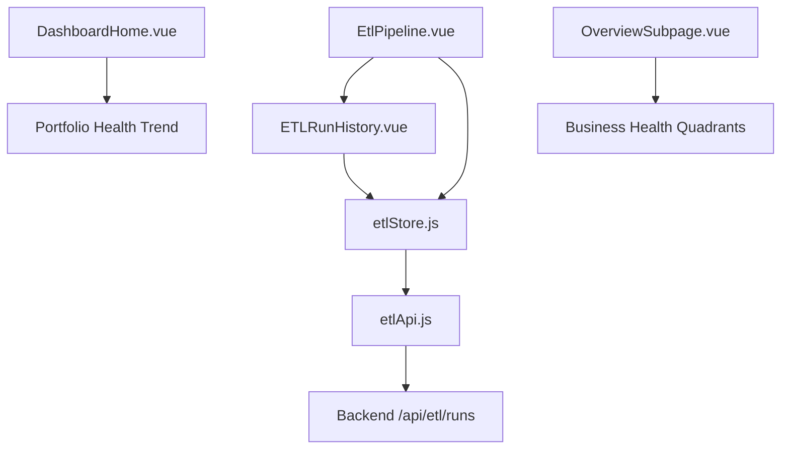
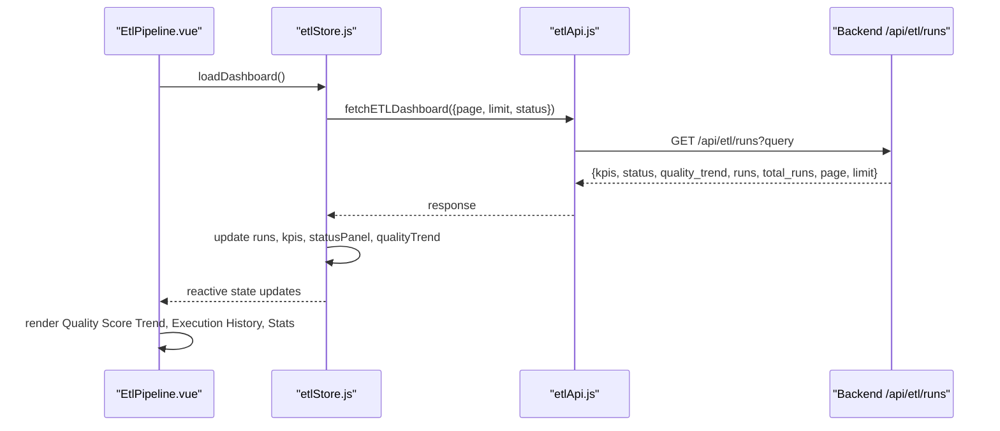
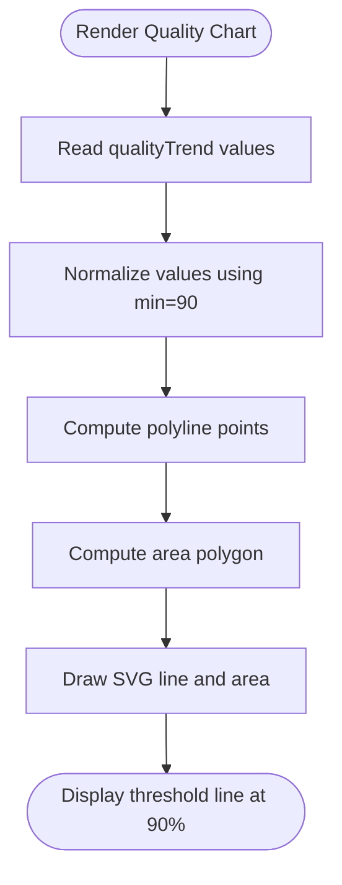
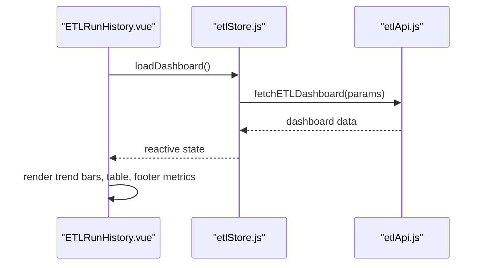
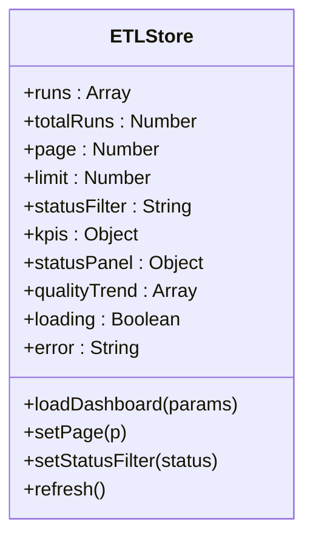
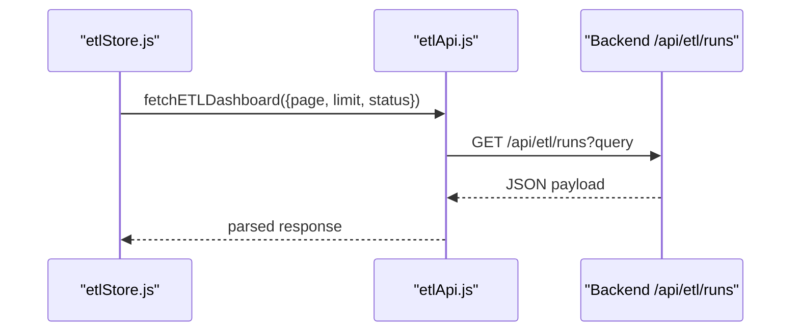
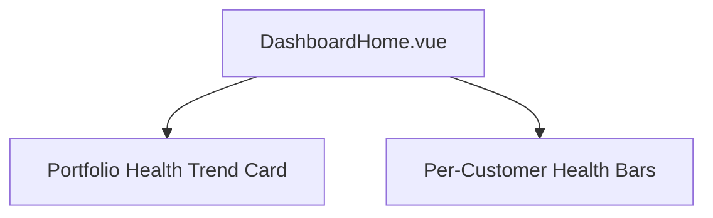
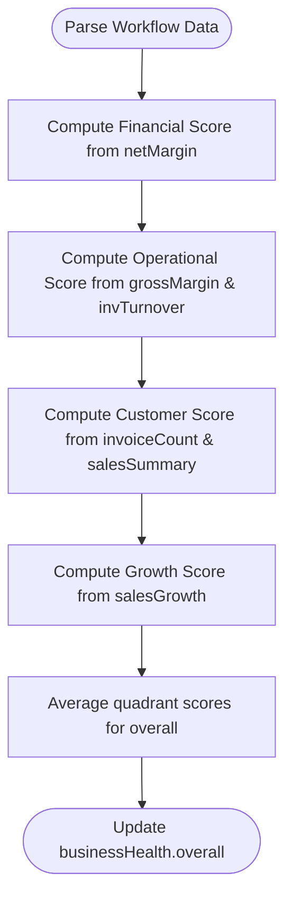
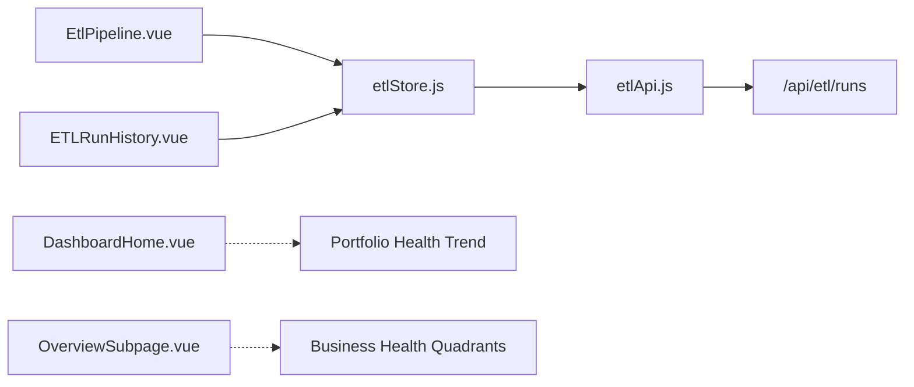

# Health Scoring Algorithm

<cite>
**Referenced Files in This Document**
- [EtlPipeline.vue](file://src/views/Modules/datapipeline/EtlPipeline.vue)
- [ETLRunHistory.vue](file://src/views/Modules/datapipeline/ETLRunHistory.vue)
- [etlStore.js](file://src/stores/etlStore.js)
- [etlApi.js](file://src/services/etlApi.js)
- [DashboardHome.vue](file://src/views/DashboardHome.vue)
- [OverviewSubpage.vue](file://src/views/Modules/strategic/OverviewSubpage.vue)
</cite>

## Table of Contents
1. Introduction
2. Project Structure
3. Core Components
4. Architecture Overview
5. Detailed Component Analysis
6. Dependency Analysis
7. Performance Considerations
8. Troubleshooting Guide
9. Conclusion
10. Appendices

## Introduction
This document explains the Health Scoring Algorithm system implemented in the frontend for monitoring data pipeline health and quality. It covers:
- How multiple data quality indicators are combined into a single health score
- Threshold configurations that define acceptable ranges across dimensions such as completeness, accuracy, timeliness, and consistency
- Trend analysis capabilities to track score changes over time and identify degradation patterns
- Implementation specifics including scoring formulas, metric weighting strategies, and normalization techniques
- Practical guidance for configuring thresholds, interpreting trend charts, and setting alerts for declining scores
- Performance considerations for real-time scoring and historical trend analysis

## Project Structure
The health scoring functionality is primarily implemented in the Data Pipeline module with supporting dashboard views and stores:
- ETL Pipeline view renders system health cards, a quality score trend chart, execution history, and summary statistics
- ETL Run History view provides an alternative UI for the same metrics with pagination and trigger controls
- ETL Store centralizes state for runs, KPIs, status panel, and quality trend
- ETL API service fetches dashboard data from the backend endpoint
- Dashboard Home shows portfolio-level health trends and per-customer health bars
- Strategic Overview computes business health quadrants and overall averages

**Diagram sources**
- [EtlPipeline.vue:1-215](file://src/views/Modules/datapipeline/EtlPipeline.vue#L1-L215)
- [ETLRunHistory.vue:1-265](file://src/views/Modules/datapipeline/ETLRunHistory.vue#L1-L265)
- [etlStore.js:1-96](file://src/stores/etlStore.js#L1-L96)
- [etlApi.js:1-115](file://src/services/etlApi.js#L1-L115)
- [DashboardHome.vue:159-195](file://src/views/DashboardHome.vue#L159-L195)
- [OverviewSubpage.vue:916-966](file://src/views/Modules/strategic/OverviewSubpage.vue#L916-L966)

**Section sources**
- [EtlPipeline.vue:1-215](file://src/views/Modules/datapipeline/EtlPipeline.vue#L1-L215)
- [ETLRunHistory.vue:1-265](file://src/views/Modules/datapipeline/ETLRunHistory.vue#L1-L265)
- [etlStore.js:1-96](file://src/stores/etlStore.js#L1-L96)
- [etlApi.js:1-115](file://src/services/etlApi.js#L1-L115)
- [DashboardHome.vue:159-195](file://src/views/DashboardHome.vue#L159-L195)
- [OverviewSubpage.vue:916-966](file://src/views/Modules/strategic/OverviewSubpage.vue#L916-L966)

## Core Components
- ETL Pipeline View: Displays system health (PostgreSQL, Redis, API Gateway), a Quality Score Trend chart with a threshold line, execution history table, and bottom stats (total runs, average quality, failed retries, latency).
- ETL Run History View: Provides the same metrics with pagination, trigger modal, and footer metrics.
- ETL Store: Holds runs, totalRuns, page, limit, statusFilter, kpis, statusPanel, qualityTrend; loads dashboard data via API.
- ETL API Service: Calls GET /api/etl/runs and returns structured data including kpis, status, quality_trend, runs, total_runs, page, limit.
- Dashboard Home: Shows portfolio health trend and per-customer health bars.
- Strategic Overview: Computes quadrant-based business health scores and overall average.

Key responsibilities:
- Fetching and caching health metrics and trends
- Rendering normalized scores and thresholds
- Providing user actions (trigger run, export logs)
- Aggregating and displaying execution history with quality scores

**Section sources**
- [EtlPipeline.vue:31-211](file://src/views/Modules/datapipeline/EtlPipeline.vue#L31-L211)
- [ETLRunHistory.vue:52-221](file://src/views/Modules/datapipeline/ETLRunHistory.vue#L52-L221)
- [etlStore.js:12-96](file://src/stores/etlStore.js#L12-L96)
- [etlApi.js:51-75](file://src/services/etlApi.js#L51-L75)
- [DashboardHome.vue:159-195](file://src/views/DashboardHome.vue#L159-L195)
- [OverviewSubpage.vue:916-966](file://src/views/Modules/strategic/OverviewSubpage.vue#L916-L966)

## Architecture Overview
The health scoring flow begins at the UI components, which request dashboard data from the backend through the ETL API service. The store manages reactive state and exposes computed values for rendering charts and tables.

**Diagram sources**
- [EtlPipeline.vue:217-288](file://src/views/Modules/datapipeline/EtlPipeline.vue#L217-L288)
- [etlStore.js:32-57](file://src/stores/etlStore.js#L32-L57)
- [etlApi.js:51-75](file://src/services/etlApi.js#L51-L75)

## Detailed Component Analysis

### ETL Pipeline View: Quality Score Trend and Thresholds
- Renders a “Quality Score Trend” chart with a dashed threshold line labeled 90%
- Computes area and polyline points by normalizing values against a minimum bound
- Displays average quality and number of data points
- Execution history includes per-run quality score with color-coded bars

Implementation highlights:
- Normalization uses a fixed minimum value to scale the chart range
- Threshold visualization is hardcoded at 90% on the chart
- Quality classes map score ranges to colors (green/amber/red)

**Diagram sources**
- [EtlPipeline.vue:73-105](file://src/views/Modules/datapipeline/EtlPipeline.vue#L73-L105)
- [EtlPipeline.vue:239-262](file://src/views/Modules/datapipeline/EtlPipeline.vue#L239-L262)

**Section sources**
- [EtlPipeline.vue:73-105](file://src/views/Modules/datapipeline/EtlPipeline.vue#L73-L105)
- [EtlPipeline.vue:239-262](file://src/views/Modules/datapipeline/EtlPipeline.vue#L239-L262)
- [EtlPipeline.vue:264-284](file://src/views/Modules/datapipeline/EtlPipeline.vue#L264-L284)

### ETL Run History View: Metrics and Pagination
- Shows pipeline health cards, quality trend bars, and execution history table
- Footer metrics include storage growth, average quality, failed retries, gateway latency
- Pagination driven by store’s page and totalRuns

Implementation highlights:
- Quality trend data mapped from store.qualityTrend
- Execution rows compute quality color based on score thresholds
- Trigger modal integrates with etlApi to start pipelines

**Diagram sources**
- [ETLRunHistory.vue:267-397](file://src/views/Modules/datapipeline/ETLRunHistory.vue#L267-L397)
- [etlStore.js:32-57](file://src/stores/etlStore.js#L32-L57)
- [etlApi.js:51-75](file://src/services/etlApi.js#L51-L75)

**Section sources**
- [ETLRunHistory.vue:52-221](file://src/views/Modules/datapipeline/ETLRunHistory.vue#L52-L221)
- [ETLRunHistory.vue:267-397](file://src/views/Modules/datapipeline/ETLRunHistory.vue#L267-L397)

### ETL Store: State Management and Computed Values
- Stores runs, totalRuns, page, limit, statusFilter, kpis, statusPanel, qualityTrend
- Exposes computed totalPages and isEmpty
- Actions: loadDashboard, setPage, setStatusFilter, refresh

**Diagram sources**
- [etlStore.js:12-96](file://src/stores/etlStore.js#L12-L96)

**Section sources**
- [etlStore.js:12-96](file://src/stores/etlStore.js#L12-L96)

### ETL API Service: Backend Integration
- Sanitizes query parameters and calls GET /api/etl/runs
- Returns structured dashboard payload including kpis, status, quality_trend, runs, total_runs, page, limit
- Also supports fetching configs and triggering pipeline runs

**Diagram sources**
- [etlApi.js:51-75](file://src/services/etlApi.js#L51-L75)

**Section sources**
- [etlApi.js:1-115](file://src/services/etlApi.js#L1-L115)

### Dashboard Home: Portfolio Health Trend
- Displays a “Portfolio Health Trend” card with a ring score and composition breakdown
- Per-customer health bars show individual healthScore values

**Diagram sources**
- [DashboardHome.vue:159-195](file://src/views/DashboardHome.vue#L159-L195)
- [DashboardHome.vue:94-117](file://src/views/DashboardHome.vue#L94-L117)

**Section sources**
- [DashboardHome.vue:159-195](file://src/views/DashboardHome.vue#L159-L195)
- [DashboardHome.vue:94-117](file://src/views/DashboardHome.vue#L94-L117)

### Strategic Overview: Business Health Quadrants
- Computes quadrant scores for Financial Health, Operational Efficiency, Customer Satisfaction, Growth Potential
- Recalculates overall as average of quadrant scores
- Uses financial inputs (net margin, gross margin, inventory turnover, sales growth) to derive scores

**Diagram sources**
- [OverviewSubpage.vue:916-966](file://src/views/Modules/strategic/OverviewSubpage.vue#L916-L966)

**Section sources**
- [OverviewSubpage.vue:916-966](file://src/views/Modules/strategic/OverviewSubpage.vue#L916-L966)

## Dependency Analysis
- EtlPipeline.vue depends on etlStore for reactive data and renders charts and tables
- ETLRunHistory.vue also depends on etlStore and adds trigger modal integration via etlApi
- etlStore depends on etlApi to fetch dashboard data
- etlApi depends on API_BASE_URL and handles authentication headers and error mapping
- DashboardHome.vue and OverviewSubpage.vue provide additional health visuals but do not directly depend on ETL store

**Diagram sources**
- [EtlPipeline.vue:217-288](file://src/views/Modules/datapipeline/EtlPipeline.vue#L217-L288)
- [ETLRunHistory.vue:267-397](file://src/views/Modules/datapipeline/ETLRunHistory.vue#L267-L397)
- [etlStore.js:32-57](file://src/stores/etlStore.js#L32-L57)
- [etlApi.js:51-75](file://src/services/etlApi.js#L51-L75)

**Section sources**
- [EtlPipeline.vue:217-288](file://src/views/Modules/datapipeline/EtlPipeline.vue#L217-L288)
- [ETLRunHistory.vue:267-397](file://src/views/Modules/datapipeline/ETLRunHistory.vue#L267-L397)
- [etlStore.js:32-57](file://src/stores/etlStore.js#L32-L57)
- [etlApi.js:51-75](file://src/services/etlApi.js#L51-L75)

## Performance Considerations
- Pagination: ETL store paginates runs to reduce payload size and improve rendering performance
- Reactive updates: Vue reactivity ensures efficient UI updates when store state changes
- Chart normalization: Fixed minimum scaling avoids expensive dynamic range calculations
- Network requests: Single dashboard call retrieves all needed metrics; avoid redundant fetches
- Offline handling: DashboardHome includes offline detection and fallback behavior

Recommendations:
- Cache dashboard responses briefly if frequent polling is used
- Debounce threshold or filter changes before refetching
- Limit chart data points for large histories to maintain responsiveness

[No sources needed since this section provides general guidance]

## Troubleshooting Guide
Common issues and resolutions:
- Empty trend data: Ensure backend returns quality_trend; check network tab for errors
- Incorrect threshold display: Verify chart normalization logic and threshold line placement
- Failed retries count: Inspect kpis.failed_runs and ensure store maps it correctly
- Latency spikes: Monitor avg_duration and consider backend optimization or caching

Debugging steps:
- Open browser DevTools Network tab to inspect /api/etl/runs responses
- Check console for store errors and API error messages
- Validate that statusPanel and kpis fields are present in the response

**Section sources**
- [etlApi.js:18-38](file://src/services/etlApi.js#L18-L38)
- [etlStore.js:32-57](file://src/stores/etlStore.js#L32-L57)
- [EtlPipeline.vue:239-284](file://src/views/Modules/datapipeline/EtlPipeline.vue#L239-L284)
- [ETLRunHistory.vue:267-397](file://src/views/Modules/datapipeline/ETLRunHistory.vue#L267-L397)

## Conclusion
The Health Scoring Algorithm system in this frontend provides robust monitoring of data pipeline health through:
- Weighted and normalized quality scores visualized in trend charts
- Clear threshold lines (e.g., 90%) to signal acceptable ranges
- Execution history with per-run quality classification
- Additional business health quadrants for strategic insights
- Scalable architecture via store-driven reactivity and API abstraction

For ongoing improvements, consider:
- Configurable thresholds stored in preferences or backend
- Alerting mechanisms triggered by sustained drops below thresholds
- Enhanced normalization strategies for multi-dimensional metrics

[No sources needed since this section summarizes without analyzing specific files]

## Appendices

### Scoring Formulas and Normalization Techniques
- Quality Score Trend normalization uses a fixed minimum bound to scale values for consistent chart rendering
- Execution history quality classes map score ranges to colors (green >= 95%, amber >= 80%, red < 80%)
- Business health quadrants combine domain-specific metrics (margins, turnover, sales growth) into 0–100 scores and average them for overall

Practical examples:
- Configure thresholds by adjusting chart normalization bounds and threshold line values
- Interpret trend charts by observing slope and position relative to threshold line
- Set alerts by monitoring kpis.failed_runs and avg_duration for anomalies

**Section sources**
- [EtlPipeline.vue:73-105](file://src/views/Modules/datapipeline/EtlPipeline.vue#L73-L105)
- [EtlPipeline.vue:264-284](file://src/views/Modules/datapipeline/EtlPipeline.vue#L264-L284)
- [OverviewSubpage.vue:916-966](file://src/views/Modules/strategic/OverviewSubpage.vue#L916-L966)