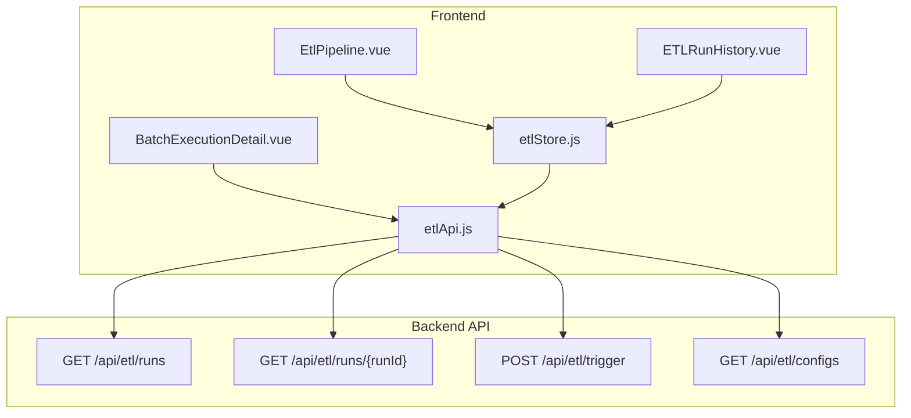
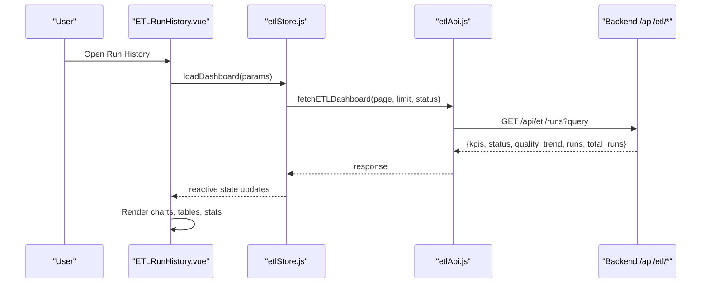
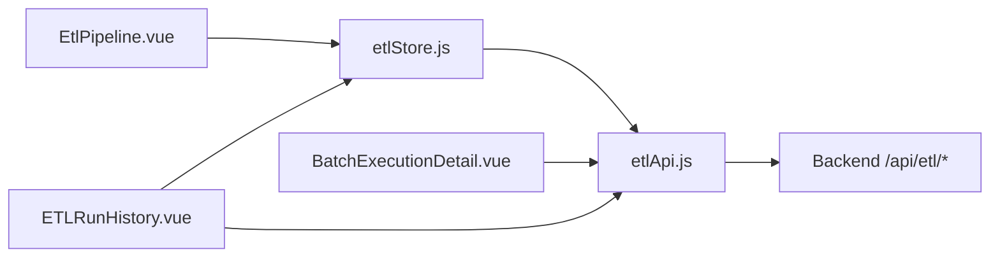

# Quality Scorecard

<cite>
**Referenced Files in This Document**
- [etlApi.js](file://src/services/etlApi.js)
- [etlStore.js](file://src/stores/etlStore.js)
- [EtlPipeline.vue](file://src/views/Modules/datapipeline/EtlPipeline.vue)
- [ETLRunHistory.vue](file://src/views/Modules/datapipeline/ETLRunHistory.vue)
- [BatchExecutionDetail.vue](file://src/views/Modules/datapipeline/BatchExecutionDetail.vue)
- [FRONTEND-REQUIREMENTS.md](file://docs/FRONTEND-REQUIREMENTS.md)
- [ETL-CONFIG-MANAGER-REQUIREMENTS.md](file://docs/ETL-CONFIG-MANAGER-REQUIREMENTS.md)
</cite>

## Table of Contents
1. [Introduction](#introduction)
2. [Project Structure](#project-structure)
3. [Core Components](#core-components)
4. [Architecture Overview](#architecture-overview)
5. [Detailed Component Analysis](#detailed-component-analysis)
6. [Dependency Analysis](#dependency-analysis)
7. [Performance Considerations](#performance-considerations)
8. [Troubleshooting Guide](#troubleshooting-guide)
9. [Conclusion](#conclusion)
10. [Appendices](#appendices)

## Introduction
This document explains the Quality Scorecard system as implemented in the frontend for monitoring ETL data quality and pipeline health. It covers:
- Automated completeness checks surfaced via run metrics (received, valid, loaded, rejected rows)
- Freshness monitoring through timestamps and status panels
- Accuracy validation indicators via error categories and failing rules
- Anomaly detection signals such as sudden drops in quality scores and SLA breaches
- Score calculation and threshold visualization on dashboards
- Practical guidance to configure rules, interpret results, and investigate low-quality runs
- Integration points with external sources and custom rule configuration via ETL configs

The system is a frontend-facing observability layer that consumes backend ETL audit and validation endpoints to present actionable insights.

## Project Structure
Quality scorecard UI spans three primary views and supporting services:
- Services: API client for fetching dashboard, run detail, and config triggers
- Store: Centralized state for pagination, KPIs, status panel, and quality trend
- Views: Pipeline overview, run history, and batch execution detail

**Diagram sources**
- [EtlPipeline.vue:217-288](file://src/views/Modules/datapipeline/EtlPipeline.vue#L217-L288)
- [ETLRunHistory.vue:267-397](file://src/views/Modules/datapipeline/ETLRunHistory.vue#L267-L397)
- [BatchExecutionDetail.vue:113-151](file://src/views/Modules/datapipeline/BatchExecutionDetail.vue#L113-L151)
- [etlStore.js:33-57](file://src/stores/etlStore.js#L33-L57)
- [etlApi.js:68-114](file://src/services/etlApi.js#L68-L114)

**Section sources**
- [EtlPipeline.vue:217-288](file://src/views/Modules/datapipeline/EtlPipeline.vue#L217-L288)
- [ETLRunHistory.vue:267-397](file://src/views/Modules/datapipeline/ETLRunHistory.vue#L267-L397)
- [BatchExecutionDetail.vue:113-151](file://src/views/Modules/datapipeline/BatchExecutionDetail.vue#L113-L151)
- [etlStore.js:33-57](file://src/stores/etlStore.js#L33-L57)
- [etlApi.js:68-114](file://src/services/etlApi.js#L68-L114)

## Core Components
- etlApi.js: HTTP client for ETL endpoints; sanitizes params, handles errors, exposes functions for dashboard, run detail, configs, and trigger.
- etlStore.js: Pinia store aggregating runs, totalRuns, page/limit, filters, KPIs, statusPanel, and qualityTrend; provides loadDashboard and pagination actions.
- EtlPipeline.vue: Dashboard view showing system health cards, quality score trend chart, execution history table, and summary stats.
- ETLRunHistory.vue: Run history view with health cards, quality trend bars, execution table, pagination, and trigger modal.
- BatchExecutionDetail.vue: Detailed run view including quality score vs SLA, timeline, rejection analysis by category and rule, logs, audit trail, and config snapshot.

Key responsibilities:
- Fetching and presenting quality metrics per run
- Visualizing trends and thresholds
- Enabling manual pipeline triggers and viewing configurations
- Drilling into failures with categorized rejections and failing rules

**Section sources**
- [etlApi.js:68-114](file://src/services/etlApi.js#L68-L114)
- [etlStore.js:33-57](file://src/stores/etlStore.js#L33-L57)
- [EtlPipeline.vue:217-288](file://src/views/Modules/datapipeline/EtlPipeline.vue#L217-L288)
- [ETLRunHistory.vue:267-397](file://src/views/Modules/datapipeline/ETLRunHistory.vue#L267-L397)
- [BatchExecutionDetail.vue:113-151](file://src/views/Modules/datapipeline/BatchExecutionDetail.vue#L113-L151)

## Architecture Overview
The Quality Scorecard follows a clear separation:
- UI components render charts, tables, and details
- Store coordinates pagination and aggregates dashboard data
- Service layer calls backend endpoints and normalizes responses
- Backend computes quality scores, validates data, and returns structured results

**Diagram sources**
- [ETLRunHistory.vue:267-397](file://src/views/Modules/datapipeline/ETLRunHistory.vue#L267-L397)
- [etlStore.js:33-57](file://src/stores/etlStore.js#L33-L57)
- [etlApi.js:68-75](file://src/services/etlApi.js#L68-L75)

## Detailed Component Analysis

### ETL Dashboard (EtlPipeline.vue)
- Displays system health cards (PostgreSQL, Redis, API Gateway) using statusPanel from store
- Shows quality score trend with area/line SVG and a threshold line at 90%
- Execution history table includes row counts (received/valid/loaded/rejected), quality score bar, and status
- Summary stats include total runs, average quality, failed retries, and avg query latency

Implementation highlights:
- Quality trend computed from store.qualityTrend values
- Average quality derived from trend array
- Status classes map run statuses to colors
- Threshold line visually indicates target quality

**Section sources**
- [EtlPipeline.vue:217-288](file://src/views/Modules/datapipeline/EtlPipeline.vue#L217-L288)

### Run History (ETLRunHistory.vue)
- Health cards sourced from statusPanel
- Quality trend bars rendered from store.qualityTrend
- Data integrity score from kpis.avg_quality
- Last scan time from statusPanel.current_status_since
- Execution table with clickable rows to drill into batch detail
- Pagination driven by store.page and store.totalPages
- Trigger modal lists configs via fetchETLConfigs and triggers runs via triggerETLPipeline

Operational flow:
- On mount, loadDashboard populates state
- User can filter by status and navigate pages
- Manual trigger opens modal, selects config, and posts trigger request

**Section sources**
- [ETLRunHistory.vue:267-397](file://src/views/Modules/datapipeline/ETLRunHistory.vue#L267-L397)

### Batch Execution Detail (BatchExecutionDetail.vue)
- Loads run detail and validation via fetchETLRunDetail
- Computes rejection categories and top failing rules from validation.errorByCategory and validation.errorByRule
- Builds logs and audit trail from run metadata
- Displays quality score vs slaThreshold with color coding
- Timeline reflects step statuses and timestamps based on run fields

Investigation aids:
- Rejection breakdown by category and rule
- Logs with severity badges
- Audit trail capturing trigger, extract, and completion events
- Config snapshot toggle for inspection

**Section sources**
- [BatchExecutionDetail.vue:113-151](file://src/views/Modules/datapipeline/BatchExecutionDetail.vue#L113-L151)
- [BatchExecutionDetail.vue:18-33](file://src/views/Modules/datapipeline/BatchExecutionDetail.vue#L18-L33)

### API Service (etlApi.js)
- _handleRes centralizes error handling and message extraction
- fetchETLDashboard supports pagination and status filtering
- fetchETLRunDetail retrieves single run with optional validation payload
- fetchETLConfigs lists available extraction specs
- triggerETLPipeline sends POST with config_name and dry_run flag

Error handling:
- Non-OK responses throw Error with status and parsed detail
- Sanitized params avoid sending empty or undefined values

**Section sources**
- [etlApi.js:18-49](file://src/services/etlApi.js#L18-L49)
- [etlApi.js:68-114](file://src/services/etlApi.js#L68-L114)

### Store (etlStore.js)
- State holds runs, totalRuns, page, limit, statusFilter, kpis, statusPanel, qualityTrend
- loadDashboard calls API and maps response to state
- setPage and setStatusFilter manage pagination and filtering
- refresh triggers reload

Reactive consumption:
- Views bind to store properties for rendering
- Computed totals and pages derived from state

**Section sources**
- [etlStore.js:12-57](file://src/stores/etlStore.js#L12-L57)
- [etlStore.js:59-72](file://src/stores/etlStore.js#L59-L72)

## Dependency Analysis
- EtlPipeline.vue depends on etlStore for dashboard data
- ETLRunHistory.vue depends on etlStore and etlApi for run history and triggering
- BatchExecutionDetail.vue depends on etlApi for run detail and validation
- etlStore depends on etlApi for data fetching
- All components rely on consistent backend contract for runs, kpis, status, and quality_trend

**Diagram sources**
- [EtlPipeline.vue:217-288](file://src/views/Modules/datapipeline/EtlPipeline.vue#L217-L288)
- [ETLRunHistory.vue:267-397](file://src/views/Modules/datapipeline/ETLRunHistory.vue#L267-L397)
- [BatchExecutionDetail.vue:113-151](file://src/views/Modules/datapipeline/BatchExecutionDetail.vue#L113-L151)
- [etlStore.js:33-57](file://src/stores/etlStore.js#L33-L57)
- [etlApi.js:68-114](file://src/services/etlApi.js#L68-L114)

**Section sources**
- [EtlPipeline.vue:217-288](file://src/views/Modules/datapipeline/EtlPipeline.vue#L217-L288)
- [ETLRunHistory.vue:267-397](file://src/views/Modules/datapipeline/ETLRunHistory.vue#L267-L397)
- [BatchExecutionDetail.vue:113-151](file://src/views/Modules/datapipeline/BatchExecutionDetail.vue#L113-L151)
- [etlStore.js:33-57](file://src/stores/etlStore.js#L33-L57)
- [etlApi.js:68-114](file://src/services/etlApi.js#L68-L114)

## Performance Considerations
- Pagination reduces payload size for large run histories
- Reactive store minimizes redundant API calls when navigating pages or filters
- Lightweight client-side computations for charts and summaries
- Avoid heavy processing in templates; use computed properties where possible
- Ensure backend endpoints support efficient queries and caching for KPIs and trends

[No sources needed since this section provides general guidance]

## Troubleshooting Guide
Common issues and resolutions:
- No data displayed: Check store.loading and error states; verify API connectivity and authentication headers
- Empty quality trend: Confirm backend returns quality_trend; ensure pagination parameters are correct
- Trigger fails: Validate selected config exists; check network errors and response messages; retry after resolving backend issues
- Low quality score: Inspect BatchExecutionDetail for errorByCategory and errorByRule; review logs and audit trail; adjust validation rules if necessary
- SLA breach: Compare qualityScore against slaThreshold; investigate root causes in failing rules and categories

Diagnostic steps:
- Use BatchExecutionDetail tabs to switch between rejected records, logs, and audit trail
- Filter runs by status to isolate failures
- Export logs for offline analysis when needed

**Section sources**
- [BatchExecutionDetail.vue:113-151](file://src/views/Modules/datapipeline/BatchExecutionDetail.vue#L113-L151)
- [ETLRunHistory.vue:352-391](file://src/views/Modules/datapipeline/ETLRunHistory.vue#L352-L391)

## Conclusion
The Quality Scorecard provides a comprehensive frontend view of ETL data quality and pipeline health. It surfaces automated completeness checks via row metrics, freshness through timestamps and status panels, accuracy via validation categories and failing rules, and anomaly signals through quality trends and SLA breaches. Operators can configure pipelines via YAML specs, trigger runs, and investigate low-quality data points with detailed breakdowns and logs.

[No sources needed since this section summarizes without analyzing specific files]

## Appendices

### Automated Completeness Checks
- Row-level coverage tracked via received, valid, loaded, and rejected counts per run
- Quality score reflects proportion of valid to received rows
- Rejection categories highlight missing or invalid fields

Visualization and interpretation:
- Execution history table shows row counts and quality bars
- Batch detail displays rejection categories and percentages

**Section sources**
- [EtlPipeline.vue:265-280](file://src/views/Modules/datapipeline/EtlPipeline.vue#L265-L280)
- [BatchExecutionDetail.vue:18-33](file://src/views/Modules/datapipeline/BatchExecutionDetail.vue#L18-L33)

### Freshness Monitoring
- Timestamps captured in run.startedAt and run.completedAt
- Status panel includes current_status_since for last successful run
- Quality trend shows recent performance over time

Operational usage:
- Monitor last scan time and duration
- Alert if runs exceed expected frequency or duration

**Section sources**
- [ETLRunHistory.vue:294-302](file://src/views/Modules/datapipeline/ETLRunHistory.vue#L294-L302)
- [BatchExecutionDetail.vue:113-151](file://src/views/Modules/datapipeline/BatchExecutionDetail.vue#L113-L151)

### Accuracy Validation Processes
- Error categories and failing rules provided by backend validation payload
- Severity levels help prioritize investigation
- Logs capture component-level messages during processing

Investigation workflow:
- Review top failing rules and category breakdown
- Correlate with logs and audit trail
- Adjust validation rules or source data as needed

**Section sources**
- [BatchExecutionDetail.vue:18-33](file://src/views/Modules/datapipeline/BatchExecutionDetail.vue#L18-L33)
- [BatchExecutionDetail.vue:113-151](file://src/views/Modules/datapipeline/BatchExecutionDetail.vue#L113-L151)

### Anomaly Detection Signals
- Quality score drops below threshold indicate anomalies
- Sudden increases in rejected rows or failing rules suggest drift or upstream changes
- SLA breaches highlight non-compliance with targets

Detection approach:
- Visual threshold lines on charts
- Color-coded status and alerts in UI
- Trend analysis across runs

**Section sources**
- [EtlPipeline.vue:243-262](file://src/views/Modules/datapipeline/EtlPipeline.vue#L243-L262)
- [BatchExecutionDetail.vue:103-111](file://src/views/Modules/datapipeline/BatchExecutionDetail.vue#L103-L111)

### Score Calculation Formulas, Thresholds, and Weights
- Quality score is presented per run and averaged across trend points
- Threshold line set at 90% on charts; SLA threshold used in detail view for pass/fail indication
- Weights and formulas are computed on the backend; frontend visualizes results and compares against thresholds

Configuration references:
- Frontend requirements specify alert threshold line at configured minimum (90%)
- Detail view uses slaThreshold to determine quality color and compliance

**Section sources**
- [EtlPipeline.vue:243-262](file://src/views/Modules/datapipeline/EtlPipeline.vue#L243-L262)
- [BatchExecutionDetail.vue:103-111](file://src/views/Modules/datapipeline/BatchExecutionDetail.vue#L103-L111)
- [FRONTEND-REQUIREMENTS.md:165-179](file://docs/FRONTEND-REQUIREMENTS.md#L165-L179)

### Practical Examples
- Configure quality rules: Edit YAML specs to define validation constraints; save via Config Manager; trigger runs to apply changes
- Interpret scorecard results: Use trend charts, execution table, and batch detail to assess completeness, freshness, and accuracy
- Investigate low-quality data: Focus on top failing rules and categories; review logs and audit trail; adjust rules or source data accordingly

Operational steps:
- Open trigger modal, select config, and run pipeline
- Navigate to batch detail for deep dive
- Export logs for further analysis

**Section sources**
- [ETL-CONFIG-MANAGER-REQUIREMENTS.md:117-181](file://docs/ETL-CONFIG-MANAGER-REQUIREMENTS.md#L117-L181)
- [ETLRunHistory.vue:352-391](file://src/views/Modules/datapipeline/ETLRunHistory.vue#L352-L391)
- [BatchExecutionDetail.vue:113-151](file://src/views/Modules/datapipeline/BatchExecutionDetail.vue#L113-L151)

### Integration with External Sources and Custom Rules
- Extraction specs define connectors, schemas, tables, and outputs
- Backend validates YAML and enforces safety for untrusted configs
- Custom rules can be added via spec definitions and validated server-side

Integration points:
- Source connector configuration in YAML
- Output destination and mode settings
- Trigger mechanism launches backend processes to execute pipelines

**Section sources**
- [ETL-CONFIG-MANAGER-REQUIREMENTS.md:183-200](file://docs/ETL-CONFIG-MANAGER-REQUIREMENTS.md#L183-L200)
- [ETL-CONFIG-MANAGER-REQUIREMENTS.md:295-304](file://docs/ETL-CONFIG-MANAGER-REQUIREMENTS.md#L295-L304)