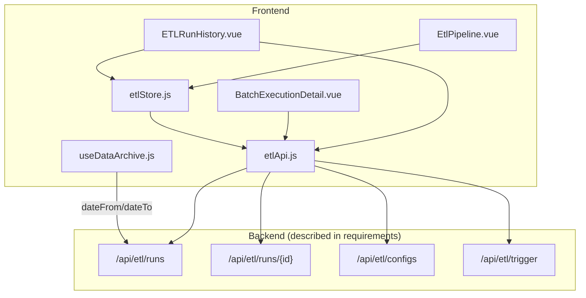
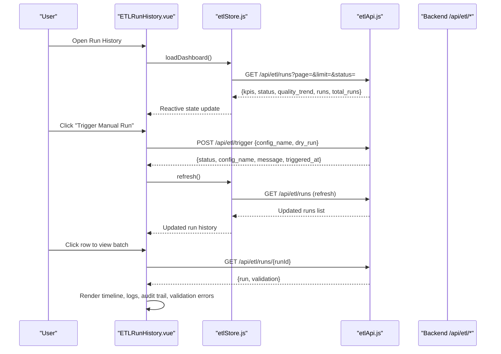
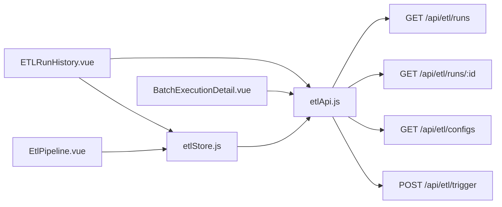

# Backfill & Reprocessing Workflows

<cite>
**Referenced Files in This Document**
- [etlApi.js](file://src/services/etlApi.js)
- [etlStore.js](file://src/stores/etlStore.js)
- [EtlPipeline.vue](file://src/views/Modules/datapipeline/EtlPipeline.vue)
- [ETLRunHistory.vue](file://src/views/Modules/datapipeline/ETLRunHistory.vue)
- [BatchExecutionDetail.vue](file://src/views/Modules/datapipeline/BatchExecutionDetail.vue)
- [useDataArchive.js](file://src/composables/useDataArchive.js)
- [ETL-CONFIG-MANAGER-REQUIREMENTS.md](file://docs/ETL-CONFIG-MANAGER-REQUIREMENTS.md)
- [ETL-CONFIG-MANAGER-REQUIREMENTS-V2.md](file://docs/ETL-CONFIG-MANAGER-REQUIREMENTS-V2.md)
</cite>

## Table of Contents
1. [Introduction](#introduction)
2. [Project Structure](#project-structure)
3. [Core Components](#core-components)
4. [Architecture Overview](#architecture-overview)
5. [Detailed Component Analysis](#detailed-component-analysis)
6. [Dependency Analysis](#dependency-analysis)
7. [Performance Considerations](#performance-considerations)
8. [Troubleshooting Guide](#troubleshooting-guide)
9. [Conclusion](#conclusion)
10. [Appendices](#appendices)

## Introduction
This document explains how the ETL system supports backfilling historical data and reprocessing workflows through its frontend interfaces and API integrations. It focuses on:
- Conceptual backfilling: selecting date ranges, incremental processing, and consistency guarantees
- Reprocessing workflows: correcting data issues by selectively reprocessing specific records or time periods
- Job creation and configuration: triggering runs via the UI and configuring extraction specs
- Progress monitoring: viewing run history, execution timelines, quality metrics, and audit trails
- Implementation details visible in the codebase: pagination, filtering, error handling, and resource-aware UX patterns
- Practical scenarios: data migration, schema changes, and error correction
- Performance considerations and best practices for production operations

The scope is limited to what is observable in the frontend code and requirements documents provided.

## Project Structure
The ETL-related functionality is implemented across a small set of focused files:
- Services layer: HTTP client functions for dashboard, run detail, configs, and trigger
- Store: Pinia store for paginated run history and dashboard state
- Views: Dashboard, Run History, Config Manager, and Batch Execution Detail
- Composables: reusable utilities including date range selection helpers
- Requirements docs: functional specifications for config management and triggers

**Diagram sources**
- [EtlPipeline.vue:1-438](file://src/views/Modules/datapipeline/EtlPipeline.vue#L1-L438)
- [ETLRunHistory.vue:1-601](file://src/views/Modules/datapipeline/ETLRunHistory.vue#L1-L601)
- [BatchExecutionDetail.vue:1-141](file://src/views/Modules/datapipeline/BatchExecutionDetail.vue#L1-L141)
- [etlStore.js:1-96](file://src/stores/etlStore.js#L1-L96)
- [etlApi.js:1-115](file://src/services/etlApi.js#L1-L115)
- [useDataArchive.js:1-48](file://src/composables/useDataArchive.js#L1-L48)

**Section sources**
- [EtlPipeline.vue:1-438](file://src/views/Modules/datapipeline/EtlPipeline.vue#L1-L438)
- [ETLRunHistory.vue:1-601](file://src/views/Modules/datapipeline/ETLRunHistory.vue#L1-L601)
- [BatchExecutionDetail.vue:1-141](file://src/views/Modules/datapipeline/BatchExecutionDetail.vue#L1-L141)
- [etlStore.js:1-96](file://src/stores/etlStore.js#L1-L96)
- [etlApi.js:1-115](file://src/services/etlApi.js#L1-L115)
- [useDataArchive.js:1-48](file://src/composables/useDataArchive.js#L1-L48)

## Core Components
- ETL API Service: Encapsulates HTTP calls to fetch dashboard data, run details, configurations, and trigger pipeline runs. Includes robust error handling and parameter sanitization.
- ETL Store: Manages reactive state for run history, pagination, filters, KPIs, status panel, and quality trends. Provides actions to load, filter, and refresh data.
- ETL Pipeline View: Displays system health cards, quality trend chart, execution history table, and bottom stats. Integrates with the store for live metrics.
- Run History View: Provides a rich UI for execution history, trigger modal, pagination, and navigation to batch details.
- Batch Execution Detail: Shows per-run timeline, logs, audit trail, validation errors by category/rule, and quality score indicators.
- Data Archive Composable: Offers date range selection and search parameters that can be used to scope queries for backfills or selective reprocessing.

Key responsibilities:
- Triggering runs: The UI exposes a “Trigger Manual Run” flow that calls the backend trigger endpoint with a selected config name.
- Monitoring: The dashboard and run history views present KPIs, quality trends, and detailed logs for each run.
- Filtering and scoping: Pagination and status filters are supported; date range selection is available via composable utilities.

**Section sources**
- [etlApi.js:1-115](file://src/services/etlApi.js#L1-L115)
- [etlStore.js:1-96](file://src/stores/etlStore.js#L1-L96)
- [EtlPipeline.vue:1-438](file://src/views/Modules/datapipeline/EtlPipeline.vue#L1-L438)
- [ETLRunHistory.vue:1-601](file://src/views/Modules/datapipeline/ETLRunHistory.vue#L1-L601)
- [BatchExecutionDetail.vue:1-141](file://src/views/Modules/datapipeline/BatchExecutionDetail.vue#L1-L141)
- [useDataArchive.js:1-48](file://src/composables/useDataArchive.js#L1-L48)

## Architecture Overview
The ETL workflow in this frontend is orchestrated around three primary flows:
- Dashboard and Run History: Fetches aggregated metrics and paginated runs from the backend.
- Trigger Pipeline: Opens a modal to select an extraction spec and triggers a background run.
- Batch Detail: Loads detailed information about a specific run, including validation results and logs.

**Diagram sources**
- [ETLRunHistory.vue:1-601](file://src/views/Modules/datapipeline/ETLRunHistory.vue#L1-L601)
- [etlStore.js:1-96](file://src/stores/etlStore.js#L1-L96)
- [etlApi.js:1-115](file://src/services/etlApi.js#L1-L115)

## Detailed Component Analysis

### ETL API Service
Responsibilities:
- Sanitize query parameters to avoid empty or undefined values
- Handle non-OK responses by extracting human-readable messages
- Provide functions for dashboard, run detail, configs listing, and trigger

Backfill relevance:
- Dashboard and run detail endpoints support inspection of runs, which is essential for validating backfill outcomes and progress
- Trigger endpoint enables initiating backfill jobs via configured extraction specs

Error handling:
- Centralized response handler normalizes error payloads and attaches status codes

**Section sources**
- [etlApi.js:1-115](file://src/services/etlApi.js#L1-L115)

### ETL Store
Responsibilities:
- Manage pagination, status filters, and dashboard state
- Load and refresh run history data
- Expose computed properties for total pages and emptiness checks

Backfill relevance:
- Pagination allows efficient browsing of large backfill histories
- Status filtering helps isolate failed or running backfills for remediation

**Section sources**
- [etlStore.js:1-96](file://src/stores/etlStore.js#L1-L96)

### ETL Pipeline View
Responsibilities:
- Display system health cards, quality trend chart, execution history table, and bottom stats
- Integrate with the store to reflect current metrics and trends

Backfill relevance:
- Quality trend and average quality provide visibility into backfill data integrity over time
- Execution history table shows rows received/valid/loaded/rejected, enabling assessment of backfill throughput and quality

**Section sources**
- [EtlPipeline.vue:1-438](file://src/views/Modules/datapipeline/EtlPipeline.vue#L1-L438)

### Run History View
Responsibilities:
- Present execution history with pagination and status filters
- Provide a trigger modal to start new runs using available configs
- Navigate to batch detail for deeper inspection

Backfill relevance:
- Trigger modal is the primary interface for starting backfill jobs
- Pagination and filters help manage large volumes of backfill runs
- Navigation to batch detail supports targeted investigation of backfill outcomes

**Section sources**
- [ETLRunHistory.vue:1-601](file://src/views/Modules/datapipeline/ETLRunHistory.vue#L1-L601)

### Batch Execution Detail
Responsibilities:
- Load run detail and validation results
- Render timeline steps, logs, audit trail, and rejection categories/rules
- Compute quality score color based on thresholds

Backfill relevance:
- Timeline and logs show step-by-step progress of a backfill run
- Validation results expose quality issues that may require corrective reprocessing
- Audit trail provides traceability for operational accountability

**Section sources**
- [BatchExecutionDetail.vue:1-141](file://src/views/Modules/datapipeline/BatchExecutionDetail.vue#L1-L141)

### Data Archive Composable
Responsibilities:
- Manage date range selection and search parameters
- Support pagination and loading states

Backfill relevance:
- Date range selection is foundational for scoping backfills to specific time windows
- Search parameters enable targeted retrieval for selective reprocessing

**Section sources**
- [useDataArchive.js:1-48](file://src/composables/useDataArchive.js#L1-L48)

## Dependency Analysis
The frontend components depend on the API service for all backend interactions. The store centralizes state and coordinates data fetching. Views compose UI logic and user interactions around these abstractions.

**Diagram sources**
- [ETLRunHistory.vue:1-601](file://src/views/Modules/datapipeline/ETLRunHistory.vue#L1-L601)
- [EtlPipeline.vue:1-438](file://src/views/Modules/datapipeline/EtlPipeline.vue#L1-L438)
- [BatchExecutionDetail.vue:1-141](file://src/views/Modules/datapipeline/BatchExecutionDetail.vue#L1-L141)
- [etlStore.js:1-96](file://src/stores/etlStore.js#L1-L96)
- [etlApi.js:1-115](file://src/services/etlApi.js#L1-L115)

**Section sources**
- [ETLRunHistory.vue:1-601](file://src/views/Modules/datapipeline/ETLRunHistory.vue#L1-L601)
- [EtlPipeline.vue:1-438](file://src/views/Modules/datapipeline/EtlPipeline.vue#L1-L438)
- [BatchExecutionDetail.vue:1-141](file://src/views/Modules/datapipeline/BatchExecutionDetail.vue#L1-L141)
- [etlStore.js:1-96](file://src/stores/etlStore.js#L1-L96)
- [etlApi.js:1-115](file://src/services/etlApi.js#L1-L115)

## Performance Considerations
- Pagination: The store and views implement pagination to handle large datasets efficiently, reducing memory footprint and improving responsiveness during backfill history browsing.
- Filtering: Status filters allow narrowing down runs to relevant subsets, aiding performance when investigating failures or active backfills.
- Error handling: Centralized error normalization prevents excessive retries and improves user experience during transient backend issues.
- Resource awareness: The UI uses loading skeletons and disabled states during network requests to prevent redundant operations and conserve resources.

[No sources needed since this section provides general guidance]

## Troubleshooting Guide
Common issues and resolutions visible in the codebase:
- Failed run detection: Batch detail marks FAILED/ERROR statuses and surfaces error messages in the timeline and logs.
- Quality issues: Validation results include error categories and rules; use these to identify problematic transformations or loads.
- Trigger failures: The trigger modal displays success or error banners with auto-dismiss behavior; retry options are available where applicable.
- Loading states: Skeleton loaders indicate ongoing data fetches; ensure backend endpoints are reachable if loading persists.

Operational tips:
- Use run detail to inspect logs and audit trails for root cause analysis.
- Filter runs by status to focus on failures or long-running backfills.
- Validate extraction specs via the Config Manager before triggering to reduce runtime errors.

**Section sources**
- [BatchExecutionDetail.vue:1-141](file://src/views/Modules/datapipeline/BatchExecutionDetail.vue#L1-L141)
- [ETLRunHistory.vue:1-601](file://src/views/Modules/datapipeline/ETLRunHistory.vue#L1-L601)
- [etlApi.js:1-115](file://src/services/etlApi.js#L1-L115)

## Conclusion
The frontend provides a comprehensive interface for managing backfill and reprocessing workflows:
- Backfill job creation is initiated via the trigger modal using configured extraction specs
- Progress monitoring is enabled through dashboard metrics, run history, and detailed batch views
- Selective reprocessing can be scoped using date range selection and search parameters
- Error handling and audit trails support troubleshooting and compliance

While advanced features like explicit checkpoint mechanisms and failure recovery are not directly exposed in the frontend, the available tools—pagination, filtering, validation insights, and audit trails—provide a solid foundation for operational control and observability.

[No sources needed since this section summarizes without analyzing specific files]

## Appendices

### Backfill Concepts and Workflows
- Date range selection: Use the data archive composable to define start and end dates for scoping backfills
- Incremental processing: Leverage status filters and pagination to process only new or changed segments
- Consistency guarantees: Monitor quality scores and validation results to ensure data integrity post-backfill

### Reprocessing Workflow
- Identify issues via validation errors and logs in batch detail
- Re-trigger the same extraction spec to reprocess affected time windows
- Validate outcomes by comparing quality trends and rejected record counts

### Job Creation and Configuration
- Configure extraction specs via the Config Manager
- Trigger runs manually from the Run History view
- Use dry run capabilities as described in requirements to validate configurations before full execution

### Monitoring and Auditing
- Track KPIs, quality trends, and system health in the dashboard
- Inspect per-run timelines, logs, and audit trails for accountability
- Export logs for offline analysis and reporting

**Section sources**
- [ETL-CONFIG-MANAGER-REQUIREMENTS.md:1-325](file://docs/ETL-CONFIG-MANAGER-REQUIREMENTS.md#L1-L325)
- [ETL-CONFIG-MANAGER-REQUIREMENTS-V2.md:1-325](file://docs/ETL-CONFIG-MANAGER-REQUIREMENTS-V2.md#L1-L325)
- [useDataArchive.js:1-48](file://src/composables/useDataArchive.js#L1-L48)
- [ETLRunHistory.vue:1-601](file://src/views/Modules/datapipeline/ETLRunHistory.vue#L1-L601)
- [BatchExecutionDetail.vue:1-141](file://src/views/Modules/datapipeline/BatchExecutionDetail.vue#L1-L141)