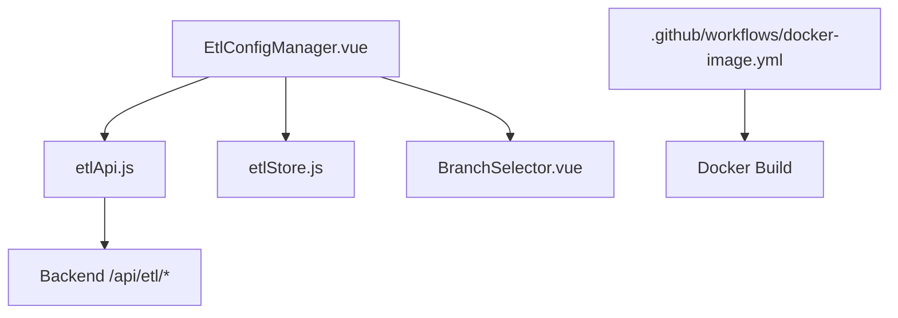
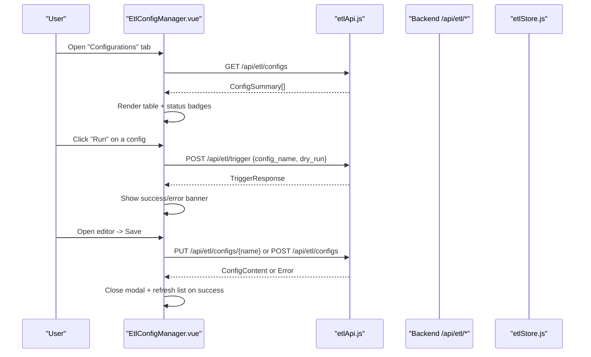
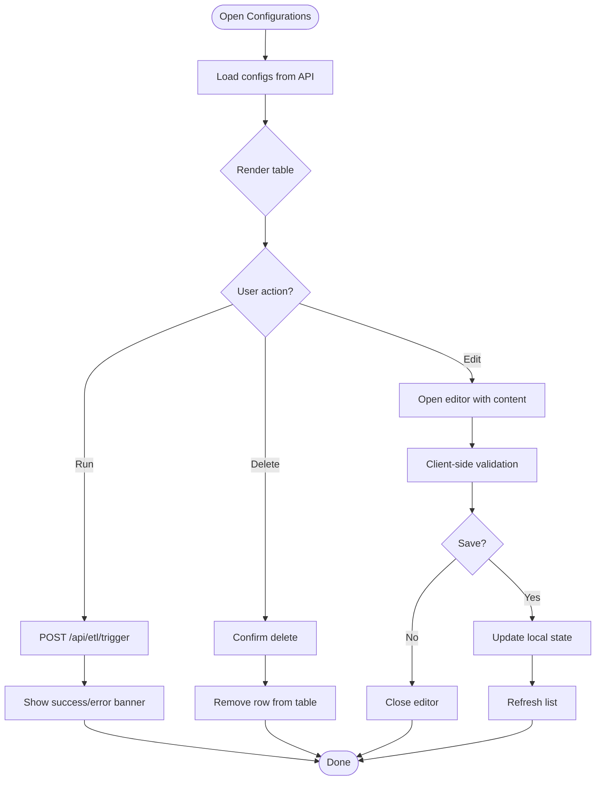
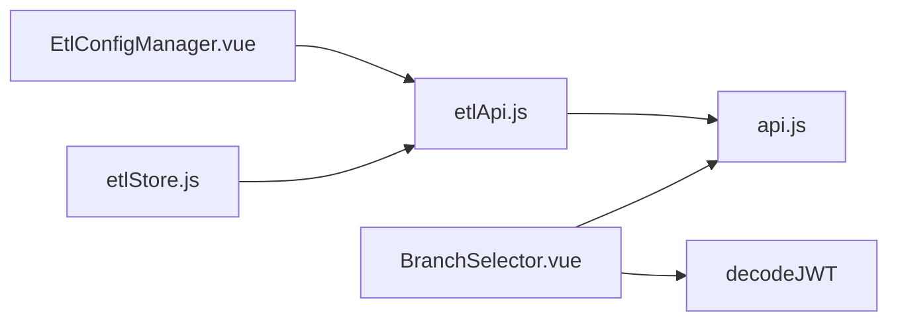

# Configuration Validation & Version Control

<cite>
**Referenced Files in This Document**
- [ETL-CONFIG-MANAGER-REQUIREMENTS.md](file://docs/ETL-CONFIG-MANAGER-REQUIREMENTS.md)
- [ETL-CONFIG-MANAGER-REQUIREMENTS-V2.md](file://docs/ETL-CONFIG-MANAGER-REQUIREMENTS-V2.md)
- [EtlConfigManager.vue](file://src/views/Modules/datapipeline/EtlConfigManager.vue)
- [etlApi.js](file://src/services/etlApi.js)
- [etlStore.js](file://src/stores/etlStore.js)
- [api.js](file://src/services/api.js)
- [BranchSelector.vue](file://src/components/BranchSelector.vue)
- [docker-image.yml](file://.github/workflows/docker-image.yml)
</cite>

## Table of Contents
1. [Introduction](#introduction)
2. [Project Structure](#project-structure)
3. [Core Components](#core-components)
4. [Architecture Overview](#architecture-overview)
5. [Detailed Component Analysis](#detailed-component-analysis)
6. [Dependency Analysis](#dependency-analysis)
7. [Performance Considerations](#performance-considerations)
8. [Troubleshooting Guide](#troubleshooting-guide)
9. [Conclusion](#conclusion)
10. [Appendices](#appendices)

## Introduction
This document explains the configuration validation and version control systems for ETL configurations in this project. It covers:
- The validation framework that checks ETL configuration syntax, semantic correctness, and business rule compliance.
- Version control integration including Git-based workflows, branching strategies, and merge conflict resolution.
- Environment-specific configuration management across development, staging, and production.
- Implementation details of the validation pipeline, error reporting, and automated testing of configurations.
- Practical examples for setting up validation rules, managing configuration versions, and implementing CI/CD pipelines for ETL configurations.
- Collaboration workflows, code review processes, and rollback strategies for configuration changes.

## Project Structure
The ETL configuration feature is centered around a dedicated UI component and supporting services:
- A tabbed interface with a “Configurations” panel to list, create, edit, delete, and trigger ETL extraction specs.
- A YAML editor modal with client-side validation indicators and save behavior.
- API service functions to interact with backend endpoints for listing configs, fetching content, creating/updating, deleting, and triggering runs.
- A Pinia store for run history and dashboard state (separate from config editing).
- Branch selection UI for tenant/branch context.
- GitHub Actions workflow for Docker image builds on push/pull requests to main.

**Diagram sources**
- [EtlConfigManager.vue:1-341](file://src/views/Modules/datapipeline/EtlConfigManager.vue#L1-L341)
- [etlApi.js:1-115](file://src/services/etlApi.js#L1-L115)
- [etlStore.js:1-96](file://src/stores/etlStore.js#L1-L96)
- [BranchSelector.vue:1-103](file://src/components/BranchSelector.vue#L1-L103)
- [docker-image.yml:1-19](file://.github/workflows/docker-image.yml#L1-L19)

**Section sources**
- [ETL-CONFIG-MANAGER-REQUIREMENTS.md:13-16](file://docs/ETL-CONFIG-MANAGER-REQUIREMENTS.md#L13-L16)
- [ETL-CONFIG-MANAGER-REQUIREMENTS.md:79-116](file://docs/ETL-CONFIG-MANAGER-REQUIREMENTS.md#L79-L116)
- [ETL-CONFIG-MANAGER-REQUIREMENTS.md:140-182](file://docs/ETL-CONFIG-MANAGER-REQUIREMENTS.md#L140-L182)
- [ETL-CONFIG-MANAGER-REQUIREMENTS.md:203-240](file://docs/ETL-CONFIG-MANAGER-REQUIREMENTS.md#L203-L240)
- [EtlConfigManager.vue:150-338](file://src/views/Modules/datapipeline/EtlConfigManager.vue#L150-L338)
- [etlApi.js:90-115](file://src/services/etlApi.js#L90-L115)
- [etlStore.js:12-95](file://src/stores/etlStore.js#L12-L95)
- [BranchSelector.vue:58-95](file://src/components/BranchSelector.vue#L58-L95)
- [docker-image.yml:1-19](file://.github/workflows/docker-image.yml#L1-L19)

## Core Components
- ETL Config Manager UI: Tabbed interface with a “Configurations” panel, search, inline editor, and actions (edit, run, delete).
- YAML Editor Modal: Create/edit mode with client-side validation indicator and save behavior.
- ETL API Service: Functions to fetch configs, trigger runs, and handle responses/errors consistently.
- ETL Store: Manages run history and dashboard state via Pinia.
- Branch Selector: UI to select tenant/branch context; integrates with JWT decoding and API.
- CI Workflow: GitHub Actions job to build Docker images on pushes and pull requests to main.

Key responsibilities:
- Validate YAML at the client level for required fields before saving.
- Delegate full schema and business rule validation to the backend.
- Provide clear error messages and retry options for failed operations.
- Support environment-specific base URLs for API calls.

**Section sources**
- [ETL-CONFIG-MANAGER-REQUIREMENTS.md:140-182](file://docs/ETL-CONFIG-MANAGER-REQUIREMENTS.md#L140-L182)
- [ETL-CONFIG-MANAGER-REQUIREMENTS.md:203-240](file://docs/ETL-CONFIG-MANAGER-REQUIREMENTS.md#L203-L240)
- [etlApi.js:18-49](file://src/services/etlApi.js#L18-L49)
- [etlStore.js:32-72](file://src/stores/etlStore.js#L32-L72)
- [BranchSelector.vue:26-95](file://src/components/BranchSelector.vue#L26-L95)
- [docker-image.yml:1-19](file://.github/workflows/docker-image.yml#L1-L19)

## Architecture Overview
The system follows a layered architecture:
- Presentation layer: Vue components render tabs, tables, and editors.
- Service layer: etlApi.js encapsulates HTTP calls and response handling.
- State layer: etlStore.js manages run history and dashboard data.
- Backend layer: REST endpoints manage YAML files, validate schemas, enforce safety rules, and trigger pipelines.
- DevOps: GitHub Actions triggers Docker builds on branch events.

**Diagram sources**
- [EtlConfigManager.vue:195-331](file://src/views/Modules/datapipeline/EtlConfigManager.vue#L195-L331)
- [etlApi.js:90-115](file://src/services/etlApi.js#L90-L115)
- [ETL-CONFIG-MANAGER-REQUIREMENTS.md:203-240](file://docs/ETL-CONFIG-MANAGER-REQUIREMENTS.md#L203-L240)

## Detailed Component Analysis

### ETL Config Manager UI
- Tabs: Run History and Configurations. Switching tabs does not reload the page.
- Configurations panel:
  - Header shows count and a “New Config” button.
  - Table lists configs with name, description, status, last modified, size, and actions.
  - Search filters by name/description.
  - Inline editor supports Edit/Preview modes with line numbers and monospace font.
  - Actions include Edit, Run, Delete.
- Editor view:
  - Opens existing config or new template.
  - Save updates local state and simulates persistence (in current implementation).
  - Relative timestamps for last modified.

Validation and UX:
- Client-side validation indicator ensures presence of required fields before save.
- Error states show inline messages with retry or dismiss options.

**Diagram sources**
- [EtlConfigManager.vue:150-338](file://src/views/Modules/datapipeline/EtlConfigManager.vue#L150-L338)
- [ETL-CONFIG-MANAGER-REQUIREMENTS.md:140-182](file://docs/ETL-CONFIG-MANAGER-REQUIREMENTS.md#L140-L182)

**Section sources**
- [EtlConfigManager.vue:150-338](file://src/views/Modules/datapipeline/EtlConfigManager.vue#L150-L338)
- [ETL-CONFIG-MANAGER-REQUIREMENTS.md:79-116](file://docs/ETL-CONFIG-MANAGER-REQUIREMENTS.md#L79-L116)
- [ETL-CONFIG-MANAGER-REQUIREMENTS.md:140-182](file://docs/ETL-CONFIG-MANAGER-REQUIREMENTS.md#L140-L182)

### ETL API Service
- Centralized request headers with Authorization token.
- Response handler normalizes errors and extracts detail/message fields.
- Parameter sanitizer removes empty/null values from query strings.
- Functions:
  - fetchETLDashboard: paginated runs and KPIs.
  - fetchETLRunDetail: single run detail.
  - fetchETLConfigs: list extraction specs.
  - triggerETLPipeline: trigger a run with optional dry run.

Error handling:
- Non-OK responses throw an Error with status and parsed data.
- Human-readable messages are surfaced to callers.

**Section sources**
- [etlApi.js:10-49](file://src/services/etlApi.js#L10-L49)
- [etlApi.js:68-115](file://src/services/etlApi.js#L68-L115)

### ETL Store (Run History)
- Pinia store manages runs, pagination, filters, KPIs, status panel, quality trend.
- Actions load dashboard data, set page, filter by status, and refresh.
- Computed properties calculate total pages and emptiness.

State management:
- Reactive state drives UI updates without reloading.
- Errors captured and exposed for UI display.

**Section sources**
- [etlStore.js:12-95](file://src/stores/etlStore.js#L12-L95)

### Branch Selector
- Dropdown to select branches within a tenant context.
- Fetches branches from API or localStorage cache.
- Emits change events and updates model value.

Integration:
- Uses JWT decoding utilities to get tenant ID and branch info.
- Calls subaccounts/branches/list endpoint.

**Section sources**
- [BranchSelector.vue:26-95](file://src/components/BranchSelector.vue#L26-L95)

### CI/CD Pipeline
- GitHub Actions workflow triggers on push/pull_request to main.
- Builds a Docker image using the repository’s Dockerfile.
- Tagged with timestamp for traceability.

**Section sources**
- [docker-image.yml:1-19](file://.github/workflows/docker-image.yml#L1-L19)

## Dependency Analysis
- EtlConfigManager.vue depends on:
  - etlApi.js for API interactions.
  - Local state for editor and table rendering.
- etlApi.js depends on:
  - api.js for base URL and auth headers.
- etlStore.js depends on:
  - etlApi.js for dashboard data.
- BranchSelector.vue depends on:
  - decodeJWT and API_BASE_URL for tenant/branch context.

**Diagram sources**
- [EtlConfigManager.vue:1-148](file://src/views/Modules/datapipeline/EtlConfigManager.vue#L1-L148)
- [etlApi.js:1-115](file://src/services/etlApi.js#L1-L115)
- [api.js:1-209](file://src/services/api.js#L1-L209)
- [etlStore.js:1-96](file://src/stores/etlStore.js#L1-L96)
- [BranchSelector.vue:1-103](file://src/components/BranchSelector.vue#L1-L103)

**Section sources**
- [etlApi.js:1-115](file://src/services/etlApi.js#L1-L115)
- [api.js:1-209](file://src/services/api.js#L1-L209)
- [etlStore.js:1-96](file://src/stores/etlStore.js#L1-L96)
- [BranchSelector.vue:1-103](file://src/components/BranchSelector.vue#L1-L103)

## Performance Considerations
- Client-side validation runs on every input event; keep it lightweight to avoid jank.
- Pagination and filtering reduce payload sizes for large datasets.
- Debounce search inputs if needed to limit re-renders.
- Use skeleton loaders during API calls to improve perceived performance.
- Cache branch lists locally to reduce network calls.

[No sources needed since this section provides general guidance]

## Troubleshooting Guide
Common issues and resolutions:
- Config list fails to load:
  - Show inline error message with Retry button.
  - Check API connectivity and authentication headers.
- YAML content fails to load in editor:
  - Display message inside modal body with Retry option.
  - Verify file name encoding and path traversal guards on backend.
- Save fails:
  - Keep modal open and show error in footer.
  - Validate file name and ensure .yaml extension.
- Trigger fails:
  - Show red error banner beneath table with auto-dismiss.
  - Inspect backend logs for subprocess launch issues.
- Delete fails:
  - Show inline error message with auto-dismiss.
  - Confirm permissions and file existence.

Error handling patterns:
- All API calls wrapped in try/catch with human-readable messages.
- Response handler extracts detail/message fields and sets status codes.

**Section sources**
- [ETL-CONFIG-MANAGER-REQUIREMENTS.md:269-280](file://docs/ETL-CONFIG-MANAGER-REQUIREMENTS.md#L269-L280)
- [etlApi.js:18-49](file://src/services/etlApi.js#L18-L49)

## Conclusion
The ETL configuration system combines a robust UI with clear validation and error handling, backed by well-defined API contracts and a Pinia store for state. Version control and CI/CD are supported through GitHub Actions for Docker builds, while branch selection enables multi-tenant workflows. The design emphasizes usability, safety, and maintainability, with clear separation between presentation, services, and backend responsibilities.

[No sources needed since this section summarizes without analyzing specific files]

## Appendices

### Validation Framework Details
- Client-side checks:
  - Presence of required fields such as name and source blocks.
  - Indicator updates on every keystroke.
- Backend validation:
  - Full schema validation via Pydantic models.
  - Safety checks for untrusted configs (e.g., rejecting raw SQL features).
  - Path traversal guards for file operations.

**Section sources**
- [ETL-CONFIG-MANAGER-REQUIREMENTS.md:158-182](file://docs/ETL-CONFIG-MANAGER-REQUIREMENTS.md#L158-L182)
- [ETL-CONFIG-MANAGER-REQUIREMENTS.md:295-303](file://docs/ETL-CONFIG-MANAGER-REQUIREMENTS.md#L295-L303)

### Version Control Integration
- Git-based workflows:
  - Main branch protected; PRs require review before merging.
  - Push to main triggers Docker image build.
- Branching strategy:
  - Feature branches per change; merge into main after approval.
  - Tenant/branch context managed via BranchSelector for runtime scoping.
- Merge conflict resolution:
  - Resolve conflicts in YAML configs carefully; validate syntax post-merge.
  - Use diff tools to compare changes; run client-side validation before committing.

**Section sources**
- [docker-image.yml:1-19](file://.github/workflows/docker-image.yml#L1-L19)
- [BranchSelector.vue:58-95](file://src/components/BranchSelector.vue#L58-L95)

### Environment-Specific Configuration Management
- Base URL resolution:
  - VITE_API_BASE_URL overrides default; fallback to localhost or hosted backend.
- Development flags:
  - DEV_BYPASS allows mock auth payloads and skips service worker registration.
- Production considerations:
  - Ensure secure tokens and proper CORS settings.
  - Validate environment variables for API endpoints and security policies.

**Section sources**
- [api.js:4-18](file://src/services/api.js#L4-L18)
- [devFlags.js:1-27](file://src/config/devFlags.js#L1-L27)

### Automated Testing of Configurations
- Unit tests:
  - Validate client-side regex checks for required fields.
  - Mock API responses to test error handling paths.
- Integration tests:
  - Simulate CRUD operations against backend endpoints.
  - Verify trigger flow and banner notifications.
- CI checks:
  - Add linting and unit test steps to GitHub Actions workflow.
  - Fail builds on validation errors or failing tests.

[No sources needed since this section provides general guidance]

### Collaboration Workflows and Code Review
- Pull requests:
  - Require reviews for changes to ETL configs and related UI/API code.
  - Enforce branch protection rules on main.
- Code review checklist:
  - Validate YAML syntax and schema compliance.
  - Ensure error handling and user feedback are present.
  - Confirm environment variable usage and security implications.

**Section sources**
- [docker-image.yml:1-19](file://.github/workflows/docker-image.yml#L1-L19)

### Rollback Strategies
- Configuration rollbacks:
  - Revert commits in Git to restore previous valid configs.
  - Use backend versioning or backups to revert YAML files if available.
- Deployment rollbacks:
  - Rebuild Docker image with previous commit tag and redeploy.
  - Monitor CI/CD artifacts for quick rollback capability.

[No sources needed since this section provides general guidance]