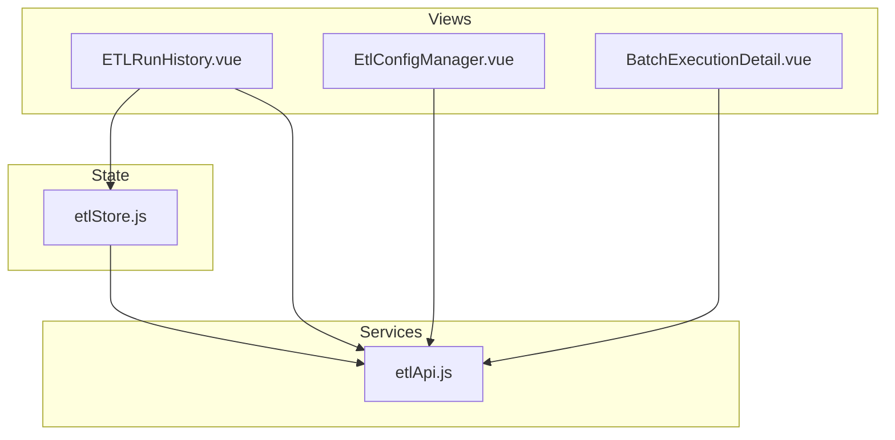
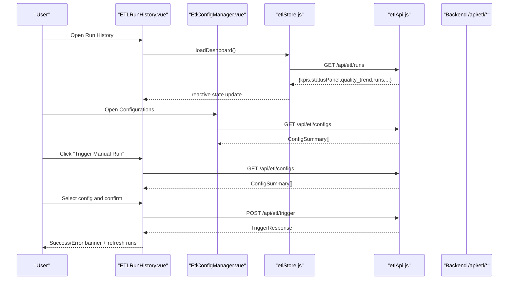
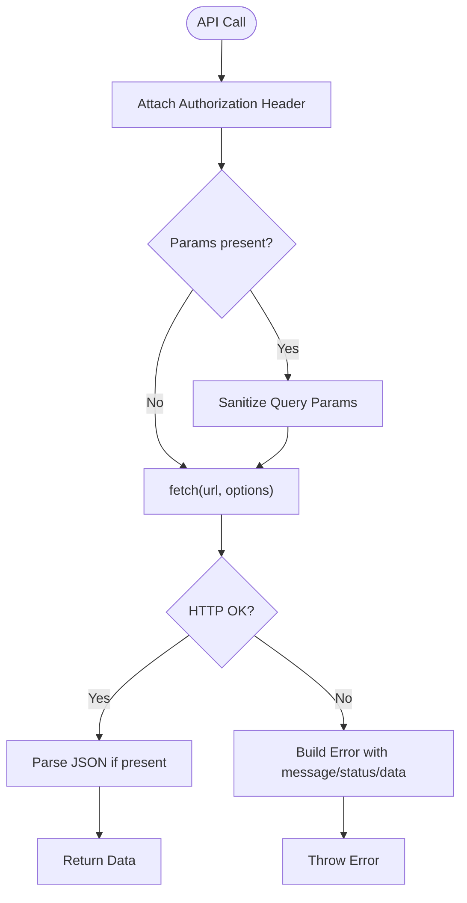
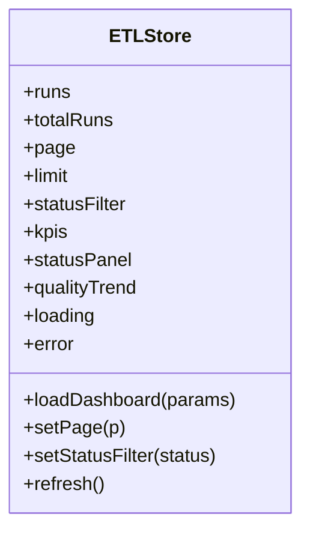
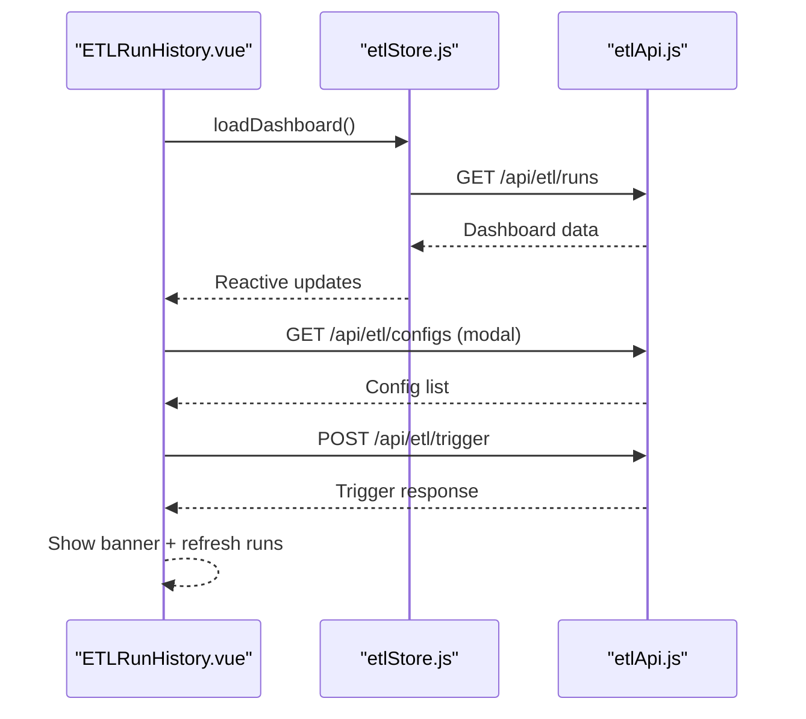
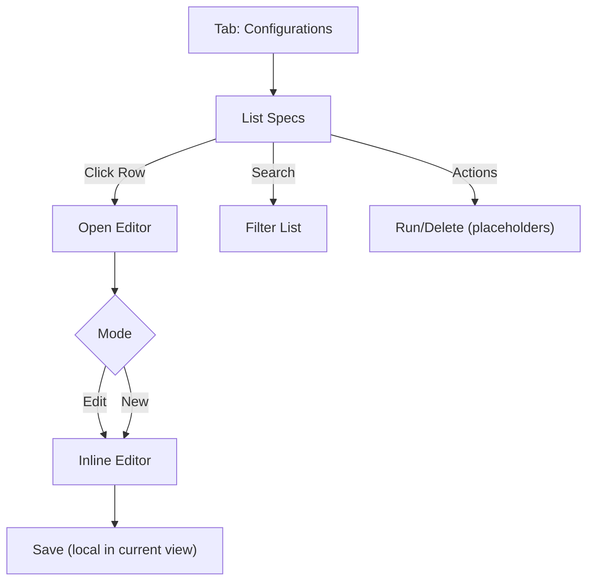
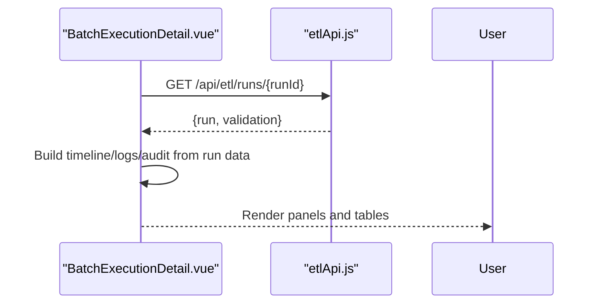
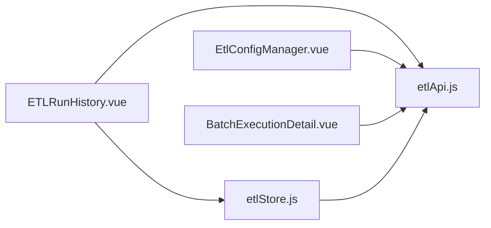

# ETL Configuration Management

<cite>
**Referenced Files in This Document**
- [ETL-CONFIG-MANAGER-REQUIREMENTS.md](file://docs/ETL-CONFIG-MANAGER-REQUIREMENTS.md)
- [ETL-CONFIG-MANAGER-REQUIREMENTS-V2.md](file://docs/ETL-CONFIG-MANAGER-REQUIREMENTS-V2.md)
- [etlApi.js](file://src/services/etlApi.js)
- [etlStore.js](file://src/stores/etlStore.js)
- [EtlConfigManager.vue](file://src/views/Modules/datapipeline/EtlConfigManager.vue)
- [ETLRunHistory.vue](file://src/views/Modules/datapipeline/ETLRunHistory.vue)
- [BatchExecutionDetail.vue](file://src/views/Modules/datapipeline/BatchExecutionDetail.vue)
</cite>

## Table of Contents
1. Introduction
2. Project Structure
3. Core Components
4. Architecture Overview
5. Detailed Component Analysis
6. Dependency Analysis
7. Performance Considerations
8. Troubleshooting Guide
9. Conclusion
10. Appendices

## Introduction
This document explains the ETL Configuration Management system implemented in the frontend. It covers:
- Job definition interface for extraction specs (source, transformation hints, destination mappings)
- Scheduling and execution controls exposed via UI (manual trigger, run history)
- Backfill/reprocessing workflows through configuration edits and re-triggering
- Validation, environment integration points, and deployment considerations
- Practical examples for creating jobs, configuring sources, setting up transformations, and managing deployments
- Best practices, error handling strategies, and monitoring setup

The system centers on a YAML-based configuration model stored on the backend and managed through a tabbed Configurations panel with an inline editor, plus a Run History dashboard to monitor executions and quality trends.

## Project Structure
The ETL feature spans services, stores, and views:
- Services: HTTP clients for ETL endpoints
- Stores: Reactive state for dashboard data
- Views: UI for run history, configuration management, and batch detail inspection

**Diagram sources**
- [ETLRunHistory.vue:1-601](file://src/views/Modules/datapipeline/ETLRunHistory.vue#L1-L601)
- [EtlConfigManager.vue:1-341](file://src/views/Modules/datapipeline/EtlConfigManager.vue#L1-L341)
- [BatchExecutionDetail.vue:1-501](file://src/views/Modules/datapipeline/BatchExecutionDetail.vue#L1-L501)
- [etlStore.js:1-96](file://src/stores/etlStore.js#L1-L96)
- [etlApi.js:1-115](file://src/services/etlApi.js#L1-L115)

**Section sources**
- [ETLRunHistory.vue:1-601](file://src/views/Modules/datapipeline/ETLRunHistory.vue#L1-L601)
- [EtlConfigManager.vue:1-341](file://src/views/Modules/datapipeline/EtlConfigManager.vue#L1-L341)
- [BatchExecutionDetail.vue:1-501](file://src/views/Modules/datapipeline/BatchExecutionDetail.vue#L1-L501)
- [etlStore.js:1-96](file://src/stores/etlStore.js#L1-L96)
- [etlApi.js:1-115](file://src/services/etlApi.js#L1-L115)

## Core Components
- ETL API Service: Centralized fetch wrapper with auth headers, parameter sanitization, and consistent error handling. Exposes functions for dashboard data, run details, config listing, and pipeline triggering.
- ETL Store: Pinia store that loads dashboard KPIs, status panel, quality trend, and paginated runs; provides pagination and filtering actions.
- Run History View: Displays health cards, quality trend chart, execution table, and a modal to trigger manual runs using available configs.
- Config Manager View: Tabbed interface with a Configurations panel that lists, creates, edits, and deletes YAML extraction specs; includes an inline GitHub-style editor and search.
- Batch Execution Detail View: Deep dive into a single run, including timeline, logs, audit trail, rejection analysis, and the exact config used.

**Section sources**
- [etlApi.js:1-115](file://src/services/etlApi.js#L1-L115)
- [etlStore.js:1-96](file://src/stores/etlStore.js#L1-L96)
- [ETLRunHistory.vue:1-601](file://src/views/Modules/datapipeline/ETLRunHistory.vue#L1-L601)
- [EtlConfigManager.vue:1-341](file://src/views/Modules/datapipeline/EtlConfigManager.vue#L1-L341)
- [BatchExecutionDetail.vue:1-501](file://src/views/Modules/datapipeline/BatchExecutionDetail.vue#L1-L501)

## Architecture Overview
The frontend orchestrates user interactions across three primary flows:
- Dashboard loading: Fetches KPIs, status, and runs; renders metrics and charts.
- Triggering pipelines: Lists configs, opens a modal, and triggers a run via the API.
- Managing configurations: Lists, creates, edits, and deletes YAML specs; validates content client-side and persists via API.

**Diagram sources**
- [ETLRunHistory.vue:224-398](file://src/views/Modules/datapipeline/ETLRunHistory.vue#L224-L398)
- [EtlConfigManager.vue:150-332](file://src/views/Modules/datapipeline/EtlConfigManager.vue#L150-L332)
- [etlStore.js:33-72](file://src/stores/etlStore.js#L33-L72)
- [etlApi.js:68-114](file://src/services/etlApi.js#L68-L114)

## Detailed Component Analysis

### ETL API Service
- Adds Authorization header from local token storage.
- Sanitizes query parameters to avoid empty or undefined values.
- Normalizes error responses into human-readable messages and attaches status/data for debugging.
- Provides typed functions for:
  - Dashboard data: GET /api/etl/runs
  - Run detail: GET /api/etl/runs/{runId}
  - Config list: GET /api/etl/configs
  - Trigger run: POST /api/etl/trigger

**Diagram sources**
- [etlApi.js:10-49](file://src/services/etlApi.js#L10-L49)
- [etlApi.js:68-114](file://src/services/etlApi.js#L68-L114)

**Section sources**
- [etlApi.js:1-115](file://src/services/etlApi.js#L1-L115)

### ETL Store (Pinia)
- Manages pagination, filters, and dashboard state.
- Loads KPIs, status panel, quality trend, and runs.
- Exposes actions for page changes, status filtering, and refresh.

**Diagram sources**
- [etlStore.js:12-95](file://src/stores/etlStore.js#L12-L95)

**Section sources**
- [etlStore.js:1-96](file://src/stores/etlStore.js#L1-L96)

### Run History View
- Displays health cards, quality trend, execution table, and footer metrics.
- Integrates a trigger modal to select a config and start a run.
- Uses the store for dashboard data and the API service for triggering runs.

Key behaviors:
- On mount, loads dashboard data via store.
- Opens trigger modal, fetches configs, and calls trigger endpoint.
- Shows success/error banners and refreshes runs after trigger.

**Diagram sources**
- [ETLRunHistory.vue:267-398](file://src/views/Modules/datapipeline/ETLRunHistory.vue#L267-L398)
- [etlStore.js:33-72](file://src/stores/etlStore.js#L33-L72)
- [etlApi.js:68-114](file://src/services/etlApi.js#L68-L114)

**Section sources**
- [ETLRunHistory.vue:1-601](file://src/views/Modules/datapipeline/ETLRunHistory.vue#L1-L601)

### Config Manager View
- Tabbed interface with “Run History” and “Configurations”.
- Configurations panel:
  - Lists extraction specs with name, description, status, last modified, size, and actions.
  - Inline GitHub-style editor with line numbers, edit/preview modes, spacing options, and soft wrap toggles.
  - Search filter by name/description.
  - Create new spec with default template; save updates locally (UI-only in current implementation).
- Actions include Edit, Run, Delete placeholders.

Notes:
- The current view uses local state for configs and does not call backend CRUD endpoints for configs.
- The requirements define full CRUD via /api/etl/configs and trigger via /api/etl/trigger.

**Diagram sources**
- [EtlConfigManager.vue:150-332](file://src/views/Modules/datapipeline/EtlConfigManager.vue#L150-L332)

**Section sources**
- [EtlConfigManager.vue:1-341](file://src/views/Modules/datapipeline/EtlConfigManager.vue#L1-L341)

### Batch Execution Detail View
- Loads run detail and validation data via API.
- Presents:
  - Quality score vs SLA threshold
  - Duration and timestamps
  - Rows received/valid/loaded/rejected
  - Execution timeline with step statuses
  - Rejection categories and top failing rules
  - Logs and audit trail tabs
  - Collapsible config snapshot used by the run

**Diagram sources**
- [BatchExecutionDetail.vue:113-151](file://src/views/Modules/datapipeline/BatchExecutionDetail.vue#L113-L151)
- [BatchExecutionDetail.vue:49-86](file://src/views/Modules/datapipeline/BatchExecutionDetail.vue#L49-L86)

**Section sources**
- [BatchExecutionDetail.vue:1-501](file://src/views/Modules/datapipeline/BatchExecutionDetail.vue#L1-L501)

## Dependency Analysis
- Views depend on etlStore for dashboard state and etlApi for network calls.
- etlApi centralizes authentication and error handling, reducing duplication across views.
- Requirements documents define the contract between frontend and backend APIs.

**Diagram sources**
- [ETLRunHistory.vue:267-398](file://src/views/Modules/datapipeline/ETLRunHistory.vue#L267-L398)
- [EtlConfigManager.vue:150-332](file://src/views/Modules/datapipeline/EtlConfigManager.vue#L150-L332)
- [BatchExecutionDetail.vue:113-151](file://src/views/Modules/datapipeline/BatchExecutionDetail.vue#L113-L151)
- [etlStore.js:33-72](file://src/stores/etlStore.js#L33-L72)
- [etlApi.js:68-114](file://src/services/etlApi.js#L68-L114)

**Section sources**
- [ETL-CONFIG-MANAGER-REQUIREMENTS.md:203-243](file://docs/ETL-CONFIG-MANAGER-REQUIREMENTS.md#L203-L243)
- [ETL-CONFIG-MANAGER-REQUIREMENTS-V2.md:203-243](file://docs/ETL-CONFIG-MANAGER-REQUIREMENTS-V2.md#L203-L243)

## Performance Considerations
- Pagination: Use store-managed pagination to limit payload sizes for runs.
- Debounce search: Add debouncing to the config search input to reduce re-renders.
- Lazy load details: Load batch detail only when navigating to the detail view.
- Minimize re-fetching: Cache config lists within modal lifecycle to avoid redundant calls.
- Optimize rendering: Virtualize long lists if config counts grow beyond typical thresholds.

[No sources needed since this section provides general guidance]

## Troubleshooting Guide
Common issues and resolutions:
- Dashboard fails to load: Check network errors in etlApi; ensure token is present; retry via store refresh.
- Trigger modal shows no configs: Verify GET /api/etl/configs returns data; handle error state with Retry button.
- Trigger fails: Inspect error banner; validate selected config exists; check backend subprocess launch behavior.
- Config editor save: In current view, saves are local; integrate backend PUT/POST per requirements if persistence is required.
- Batch detail missing fields: Some timeline/log fields are derived or mocked; rely on backend-provided fields where available.

Error handling patterns:
- All API calls wrapped with try/catch; errors surfaced as human-readable messages.
- UI displays inline errors with retry or dismiss options per requirements.

**Section sources**
- [ETL-CONFIG-MANAGER-REQUIREMENTS.md:269-280](file://docs/ETL-CONFIG-MANAGER-REQUIREMENTS.md#L269-L280)
- [ETL-CONFIG-MANAGER-REQUIREMENTS-V2.md:269-280](file://docs/ETL-CONFIG-MANAGER-REQUIREMENTS-V2.md#L269-L280)
- [etlApi.js:18-38](file://src/services/etlApi.js#L18-L38)
- [ETLRunHistory.vue:342-391](file://src/views/Modules/datapipeline/ETLRunHistory.vue#L342-L391)

## Conclusion
The ETL Configuration Management system provides a robust frontend for monitoring pipeline health, triggering runs, and managing YAML-based extraction specifications. While the Config Manager currently operates with local state for editing, the requirements define a complete backend contract for CRUD operations and triggering. Integration with the existing Run History and Batch Detail views enables comprehensive observability and troubleshooting.

[No sources needed since this section summarizes without analyzing specific files]

## Appendices

### Job Definition Interface
- Source configuration: connector type (e.g., PostgreSQL), schema/table or connection reference, optional query.
- Transformation hints: embedded in YAML content; can include field mappings, filters, and aggregation steps.
- Destination mapping: output destination (e.g., feature store, S3), mode (upsert/overwrite), key fields.

Example structure references:
- Default YAML template and fields are defined in requirements.

**Section sources**
- [ETL-CONFIG-MANAGER-REQUIREMENTS.md:183-199](file://docs/ETL-CONFIG-MANAGER-REQUIREMENTS.md#L183-L199)
- [ETL-CONFIG-MANAGER-REQUIREMENTS-V2.md:183-199](file://docs/ETL-CONFIG-MANAGER-REQUIREMENTS-V2.md#L183-L199)

### Scheduling System
- Cron expressions: Not implemented in the frontend; scheduling is typically handled by backend job schedulers.
- Dependency management: Not exposed in the current UI; dependencies should be modeled in backend orchestration.
- Execution windows: Backend-enforced constraints; frontend triggers respect configured windows.

[No sources needed since this section provides general guidance]

### Backfill Operations
- Reprocessing workflow: Edit the relevant YAML spec to adjust source queries or filters, then trigger a manual run to backfill historical data.
- Monitoring: Use Run History and Batch Execution Detail to verify backfill results and quality scores.

**Section sources**
- [ETLRunHistory.vue:342-391](file://src/views/Modules/datapipeline/ETLRunHistory.vue#L342-L391)
- [BatchExecutionDetail.vue:113-151](file://src/views/Modules/datapipeline/BatchExecutionDetail.vue#L113-L151)

### Configuration Validation
- Client-side validation: Lightweight checks for required fields (name, source) during editing.
- Server-side validation: Full schema validation performed by backend; errors returned via API responses.

**Section sources**
- [ETL-CONFIG-MANAGER-REQUIREMENTS.md:158-169](file://docs/ETL-CONFIG-MANAGER-REQUIREMENTS.md#L158-L169)
- [ETL-CONFIG-MANAGER-REQUIREMENTS-V2.md:158-169](file://docs/ETL-CONFIG-MANAGER-REQUIREMENTS-V2.md#L158-L169)

### Version Control Integration
- Config storage: YAML files stored under a dedicated directory on the backend; version control should be applied at the repository level for these files.
- Safety: Path traversal guards prevent unsafe file access.

**Section sources**
- [ETL-CONFIG-MANAGER-REQUIREMENTS.md:295-303](file://docs/ETL-CONFIG-MANAGER-REQUIREMENTS.md#L295-L303)
- [ETL-CONFIG-MANAGER-REQUIREMENTS-V2.md:295-303](file://docs/ETL-CONFIG-MANAGER-REQUIREMENTS-V2.md#L295-L303)

### Environment-Specific Settings
- Base URL: Configured via environment variable for API base path.
- Authentication: Token injected into requests; ensure correct environment tokens are set.

**Section sources**
- [ETL-CONFIG-MANAGER-REQUIREMENTS.md:203-205](file://docs/ETL-CONFIG-MANAGER-REQUIREMENTS.md#L203-L205)
- [etlApi.js:10-16](file://src/services/etlApi.js#L10-L16)

### Practical Examples
- Creating a new ETL job:
  - Open Configurations, click New Config, fill YAML with source (PostgreSQL, Redis, or API endpoint), transformations, and destination mapping.
  - Save per requirements (backend integration required for persistence).
- Configuring data sources:
  - PostgreSQL: specify connector, schema, table/query.
  - Redis: specify connector and keyspace/pattern.
  - API endpoints: specify connector and endpoint details.
- Setting up transformation pipelines:
  - Define field mappings, filters, and aggregations in YAML.
- Managing deployment across environments:
  - Maintain separate YAML specs per environment; use environment-specific base URLs and credentials via backend configuration.

**Section sources**
- [ETL-CONFIG-MANAGER-REQUIREMENTS.md:183-199](file://docs/ETL-CONFIG-MANAGER-REQUIREMENTS.md#L183-L199)
- [ETL-CONFIG-MANAGER-REQUIREMENTS-V2.md:183-199](file://docs/ETL-CONFIG-MANAGER-REQUIREMENTS-V2.md#L183-L199)

### Best Practices
- Keep YAML specs minimal and focused; reuse common patterns.
- Validate specs before saving; leverage client-side indicators and backend validation.
- Use descriptive names and comments in YAML for clarity.
- Monitor quality trends and reject rates; adjust transformations accordingly.
- Secure credentials via backend secrets; never embed sensitive data in YAML.

[No sources needed since this section provides general guidance]

### Error Handling Strategies
- Wrap all API calls with try/catch; surface user-friendly messages.
- Provide retry mechanisms for transient failures.
- Log detailed errors server-side; expose concise messages to users.

**Section sources**
- [ETL-CONFIG-MANAGER-REQUIREMENTS.md:269-280](file://docs/ETL-CONFIG-MANAGER-REQUIREMENTS.md#L269-L280)
- [etlApi.js:18-38](file://src/services/etlApi.js#L18-L38)

### Monitoring Setup
- Use Run History to track execution status, duration, rows processed, and quality scores.
- Inspect Batch Execution Detail for timelines, logs, audit trails, and rejection analysis.
- Set alerts on quality thresholds and failed retries based on dashboard metrics.

**Section sources**
- [ETLRunHistory.vue:52-221](file://src/views/Modules/datapipeline/ETLRunHistory.vue#L52-L221)
- [BatchExecutionDetail.vue:196-482](file://src/views/Modules/datapipeline/BatchExecutionDetail.vue#L196-L482)