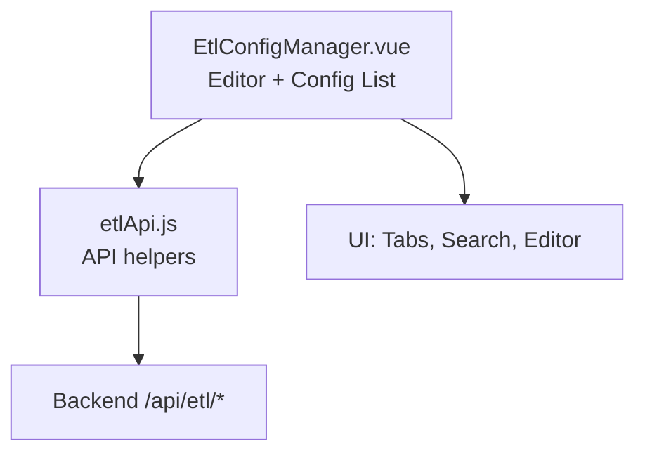
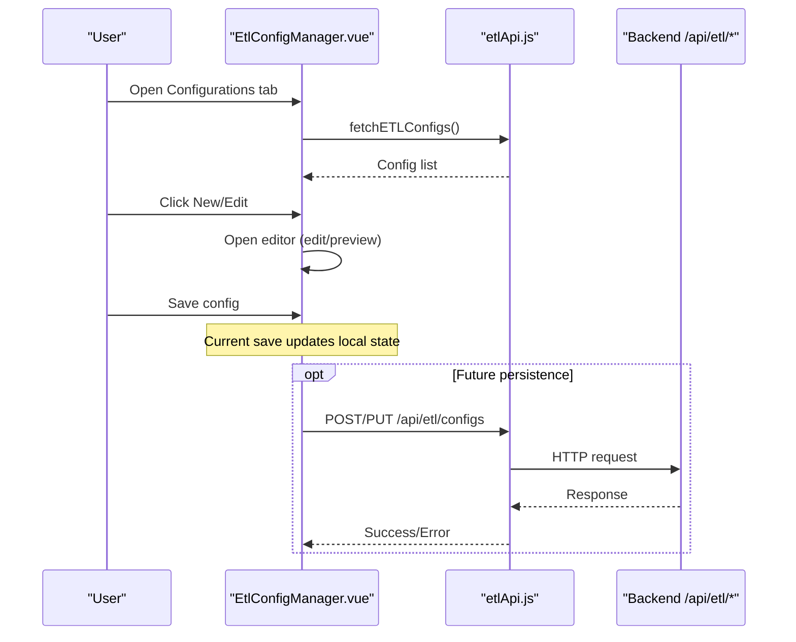
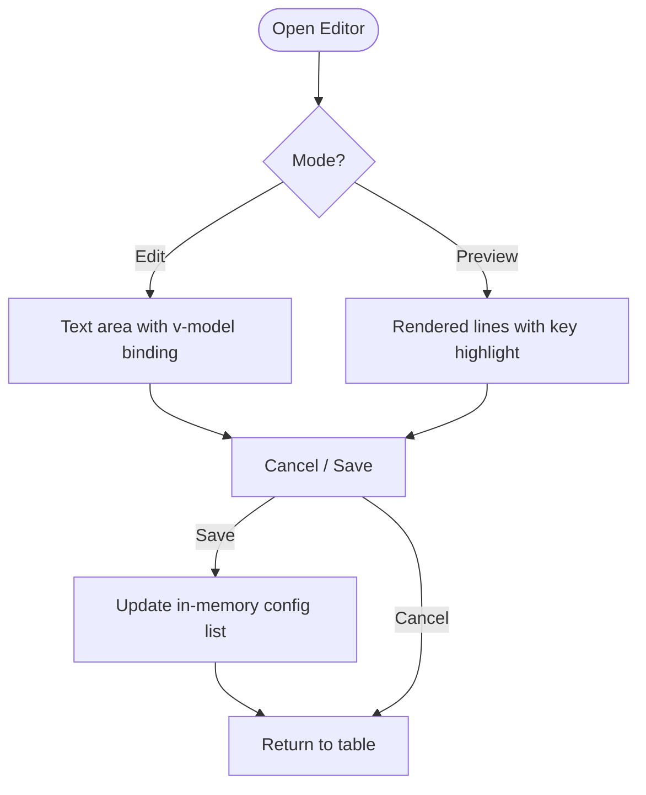
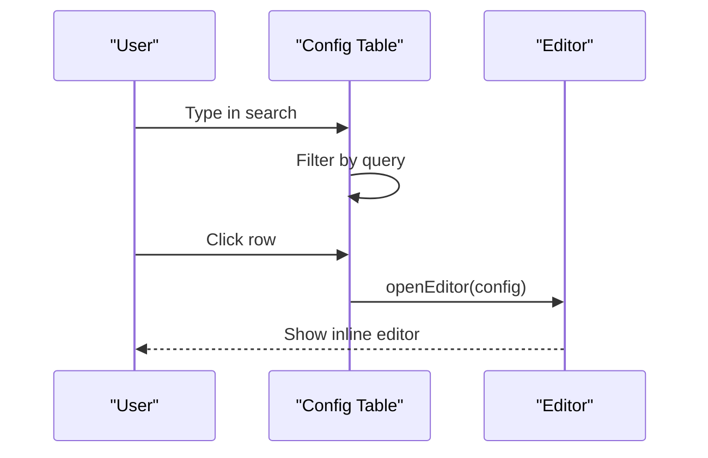
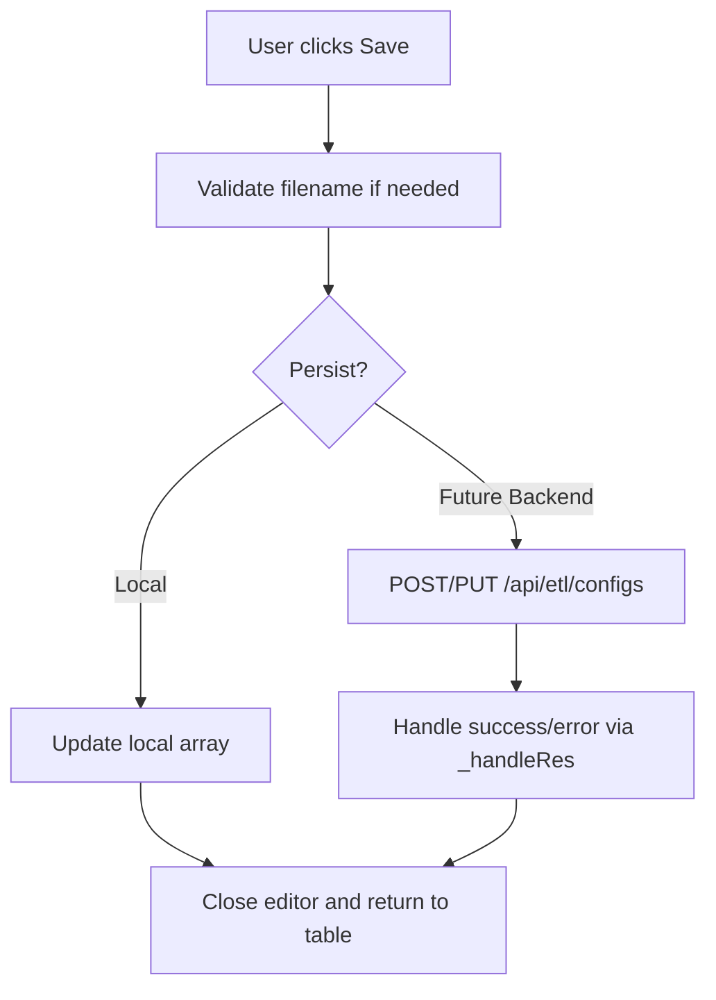
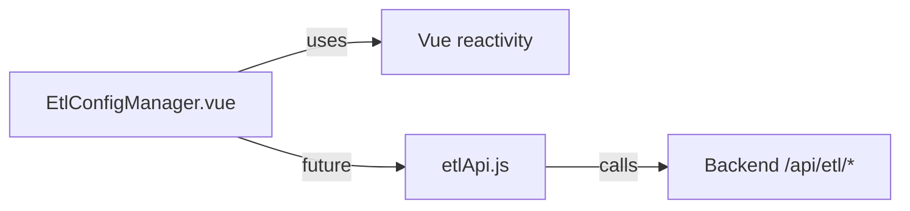

# Inline YAML Editor

<cite>
**Referenced Files in This Document**
- [EtlConfigManager.vue](file://src/views/Modules/datapipeline/EtlConfigManager.vue)
- [etlApi.js](file://src/services/etlApi.js)
- [ETL-CONFIG-MANAGER-REQUIREMENTS.md](file://docs/ETL-CONFIG-MANAGER-REQUIREMENTS.md)
</cite>

## Table of Contents
1. [Introduction](#introduction)
2. [Project Structure](#project-structure)
3. [Core Components](#core-components)
4. [Architecture Overview](#architecture-overview)
5. [Detailed Component Analysis](#detailed-component-analysis)
6. [Dependency Analysis](#dependency-analysis)
7. [Performance Considerations](#performance-considerations)
8. [Troubleshooting Guide](#troubleshooting-guide)
9. [Conclusion](#conclusion)
10. [Appendices](#appendices)

## Introduction
This document explains the inline YAML editor within the ETL Config Manager interface. It covers the GitHub-style editing experience with line numbers, edit and preview modes, indentation controls, soft wrap options, search functionality, save operations, validation feedback, error reporting, user workflows from creation to editing, accessibility considerations, keyboard shortcuts, and responsive design for different screen sizes.

## Project Structure
The inline YAML editor is implemented as part of the ETL Config Manager view under the Data Pipeline module. The configuration list and editor are contained in a single Vue component, while API integration for listing configurations and triggering runs is provided by a dedicated service.

**Diagram sources**
- [EtlConfigManager.vue:150-338](file://src/views/Modules/datapipeline/EtlConfigManager.vue#L150-L338)
- [etlApi.js:90-114](file://src/services/etlApi.js#L90-L114)

**Section sources**
- [EtlConfigManager.vue:1-148](file://src/views/Modules/datapipeline/EtlConfigManager.vue#L1-L148)
- [etlApi.js:1-115](file://src/services/etlApi.js#L1-L115)

## Core Components
- ETL Config Manager view: hosts tabs (Run History and Configurations), a searchable config table, and an inline GitHub-style YAML editor panel.
- Editor modes: Edit mode for direct YAML modification; Preview mode for formatted display with simple key highlighting.
- Editor features: Line numbers, indentation selection (2 or 4 spaces), soft wrap option (None or Word), and a search input to filter configs.
- Save workflow: Local save simulation updates the in-memory config list and returns to the table view.
- Integration points: API service exposes endpoints for listing configs and triggering pipeline runs; current editor uses local state but can be extended to call backend endpoints.

**Section sources**
- [EtlConfigManager.vue:150-338](file://src/views/Modules/datapipeline/EtlConfigManager.vue#L150-L338)
- [etlApi.js:90-114](file://src/services/etlApi.js#L90-L114)

## Architecture Overview
The editor integrates with the configuration management system through a tabbed UI that switches between Run History and Configurations. Within the Configurations tab, users can open the inline editor to create or modify YAML specs. While the current implementation saves locally, the architecture supports extension to persist changes via backend APIs exposed in the ETL service.

**Diagram sources**
- [EtlConfigManager.vue:195-331](file://src/views/Modules/datapipeline/EtlConfigManager.vue#L195-L331)
- [etlApi.js:90-114](file://src/services/etlApi.js#L90-L114)

## Detailed Component Analysis

### Inline YAML Editor Panel
- Layout: Header with file path-like title, Cancel and Save actions; sub-header with Edit/Preview toggles, indentation selector (2 or 4 spaces), and soft wrap selector (None or Word).
- Body: Left column shows line numbers; right column renders either a textarea (Edit) or a formatted block (Preview) with basic key highlighting.
- Modes:
  - Edit: Directly modifies the content string bound to the active config.
  - Preview: Displays lines with highlighted keys for readability.
- Validation: No real-time validation indicator is shown in this view; status badges appear in the config table based on stored values.

**Diagram sources**
- [EtlConfigManager.vue:197-256](file://src/views/Modules/datapipeline/EtlConfigManager.vue#L197-L256)

**Section sources**
- [EtlConfigManager.vue:197-256](file://src/views/Modules/datapipeline/EtlConfigManager.vue#L197-L256)

### Configuration Table and Search
- Displays columns: Name, Status, Last Modified, Size, Actions.
- Search input filters by name or description using a computed property.
- Row actions: Edit opens the inline editor; Run triggers a pipeline run via API; Delete removes the item from local state.

**Diagram sources**
- [EtlConfigManager.vue:258-331](file://src/views/Modules/datapipeline/EtlConfigManager.vue#L258-L331)

**Section sources**
- [EtlConfigManager.vue:258-331](file://src/views/Modules/datapipeline/EtlConfigManager.vue#L258-L331)

### Save Operations and Validation Feedback
- Save behavior: Updates the in-memory config list and closes the editor after a simulated delay.
- Validation feedback: Status badges reflect precomputed values; no client-side YAML validation is performed in this view.
- Error handling: Errors are not surfaced during save in this view; future integration should use the shared API error handler to present user-friendly messages.

**Diagram sources**
- [EtlConfigManager.vue:112-127](file://src/views/Modules/datapipeline/EtlConfigManager.vue#L112-L127)
- [etlApi.js:18-38](file://src/services/etlApi.js#L18-L38)

**Section sources**
- [EtlConfigManager.vue:112-127](file://src/views/Modules/datapipeline/EtlConfigManager.vue#L112-L127)
- [etlApi.js:18-38](file://src/services/etlApi.js#L18-L38)

### User Workflow Examples
- Create new configuration:
  - Navigate to Configurations tab.
  - Click “New Config” to open the inline editor in edit mode with default content.
  - Modify YAML, optionally switch to Preview to review formatting.
  - Click “save config” to update the local list and return to the table.
- Edit existing configuration:
  - Click a row or its Edit action to open the inline editor with existing content.
  - Make changes in Edit mode or review in Preview mode.
  - Save to apply changes locally.

[No sources needed since this section summarizes workflows without analyzing specific files]

### Accessibility Features and Keyboard Shortcuts
- Keyboard navigation:
  - Tab order includes inputs and buttons; focus styles are applied via outline utilities.
  - Textarea supports standard editing shortcuts (e.g., Ctrl/Cmd+Z, Ctrl/Cmd+C/V).
- Screen reader considerations:
  - Buttons have descriptive labels; icons are decorative and do not impede meaning.
- Limitations:
  - No explicit aria attributes or role annotations are present in the editor panel.
  - No custom keyboard shortcuts (e.g., Ctrl+S to save) are implemented.

[No sources needed since this section provides general guidance]

### Responsive Design Considerations
- The editor container adapts to available width and height, enabling vertical scrolling and horizontal overflow for long lines.
- Indentation and soft wrap controls allow users to optimize readability across devices.
- The surrounding layout uses responsive spacing and typography classes to maintain usability on smaller screens.

[No sources needed since this section provides general guidance]

## Dependency Analysis
- Component-level dependencies:
  - EtlConfigManager.vue depends on Vue reactivity for state and template rendering.
  - It does not directly import the ETL API service; however, the service defines the endpoints used elsewhere in the application for ETL operations.
- External integrations:
  - etlApi.js centralizes headers, parameter sanitization, and response handling for ETL endpoints.
  - The backend endpoints include listing configs and triggering runs; these can be integrated into the editor flow for persistence and execution.

**Diagram sources**
- [EtlConfigManager.vue:1-148](file://src/views/Modules/datapipeline/EtlConfigManager.vue#L1-L148)
- [etlApi.js:1-115](file://src/services/etlApi.js#L1-L115)

**Section sources**
- [EtlConfigManager.vue:1-148](file://src/views/Modules/datapipeline/EtlConfigManager.vue#L1-L148)
- [etlApi.js:1-115](file://src/services/etlApi.js#L1-L115)

## Performance Considerations
- Rendering performance:
  - Line number generation splits content by newline; for very large files, consider virtualized lists to avoid heavy DOM updates.
- Input responsiveness:
  - Using a native textarea ensures good performance for typing; avoid expensive computations on every keystroke.
- Search filtering:
  - Computed filtering runs on each change; ensure queries remain lightweight.

[No sources needed since this section provides general guidance]

## Troubleshooting Guide
- Editor does not show validation errors:
  - The current view does not perform real-time validation; rely on backend validation upon save and display errors via the shared API error handler.
- Save appears to succeed but changes are lost:
  - Saves are currently local; refresh will revert changes. Integrate with backend endpoints to persist edits.
- Search returns no results:
  - Verify the search query and ensure the config list contains matching entries.

**Section sources**
- [EtlConfigManager.vue:112-127](file://src/views/Modules/datapipeline/EtlConfigManager.vue#L112-L127)
- [etlApi.js:18-38](file://src/services/etlApi.js#L18-L38)

## Conclusion
The inline YAML editor in the ETL Config Manager provides a practical, GitHub-inspired editing experience with line numbers, edit and preview modes, indentation controls, soft wrap options, and search. While the current implementation saves locally, it is structured to integrate seamlessly with backend APIs for persistence and execution. Extending the editor with real-time validation, keyboard shortcuts, and enhanced accessibility will further improve usability and robustness.

[No sources needed since this section summarizes without analyzing specific files]

## Appendices

### API Endpoints Reference
- Listing configurations: GET /api/etl/configs
- Triggering a pipeline run: POST /api/etl/trigger
- Additional endpoints for CRUD operations are defined in requirements and can be integrated into the editor flow.

**Section sources**
- [etlApi.js:90-114](file://src/services/etlApi.js#L90-L114)
- [ETL-CONFIG-MANAGER-REQUIREMENTS.md:203-240](file://docs/ETL-CONFIG-MANAGER-REQUIREMENTS.md#L203-L240)