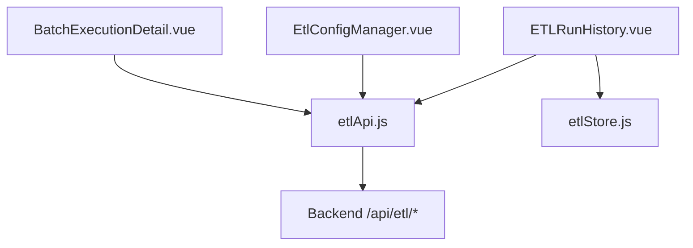
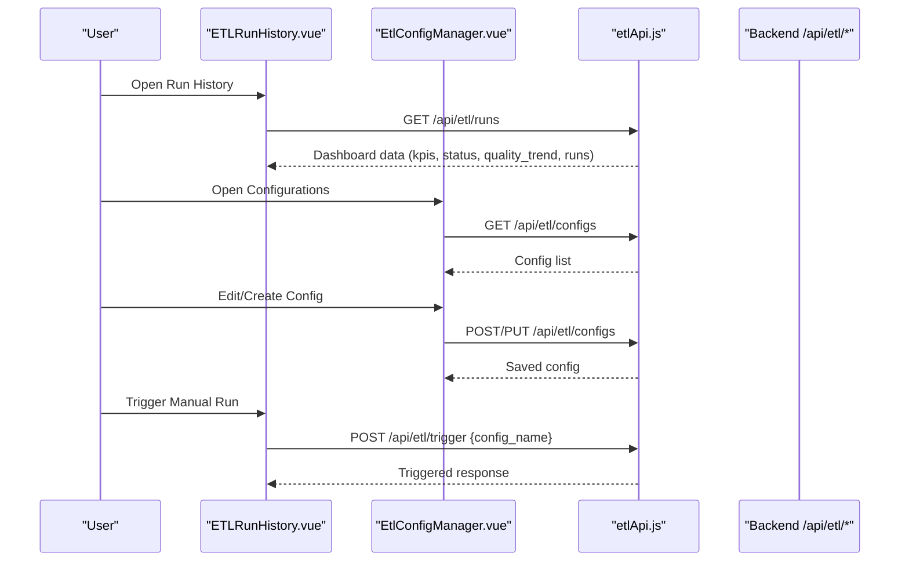
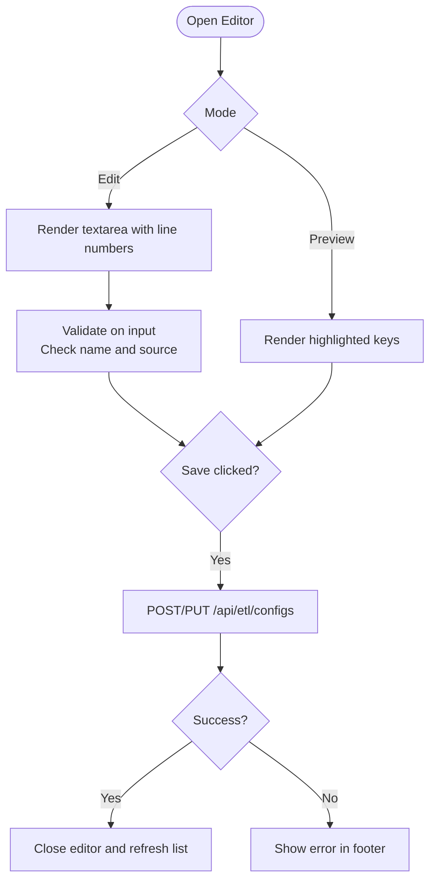
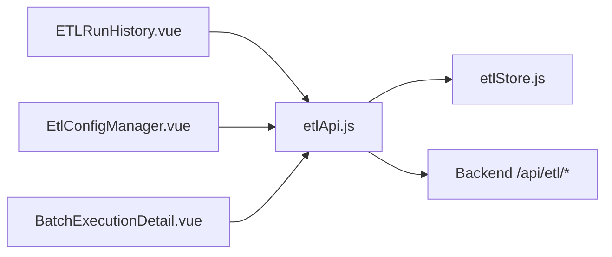

# Job Definitions & Configuration

<cite>
**Referenced Files in This Document**
- [EtlConfigManager.vue](file://src/views/Modules/datapipeline/EtlConfigManager.vue)
- [ETLRunHistory.vue](file://src/views/Modules/datapipeline/ETLRunHistory.vue)
- [BatchExecutionDetail.vue](file://src/views/Modules/datapipeline/BatchExecutionDetail.vue)
- [etlApi.js](file://src/services/etlApi.js)
- [etlStore.js](file://src/stores/etlStore.js)
- [ETL-CONFIG-MANAGER-REQUIREMENTS.md](file://docs/ETL-CONFIG-MANAGER-REQUIREMENTS.md)
- [ETL-CONFIG-MANAGER-REQUIREMENTS-V2.md](file://docs/ETL-CONFIG-MANAGER-REQUIREMENTS-V2.md)
</cite>

## Table of Contents
1. [Introduction](#introduction)
2. [Project Structure](#project-structure)
3. [Core Components](#core-components)
4. [Architecture Overview](#architecture-overview)
5. [Detailed Component Analysis](#detailed-component-analysis)
6. [Dependency Analysis](#dependency-analysis)
7. [Performance Considerations](#performance-considerations)
8. [Troubleshooting Guide](#troubleshooting-guide)
9. [Conclusion](#conclusion)
10. [Appendices](#appendices)

## Introduction
This document explains how ETL job definitions and configuration management are implemented in the frontend, focusing on YAML-based job specs, source and output configurations, inline editor behavior, validation rules, and integration with backend APIs for listing, creating, editing, deleting, and triggering jobs. It also provides practical guidance for creating new jobs, configuring data sources and outputs, setting up transformation pipelines, and managing deployments across environments.

## Project Structure
The ETL configuration UI is centered around a tabbed interface that includes:
- Run History: pipeline execution overview and monitoring
- Configurations: list, create, edit, delete, and trigger extraction specs stored as YAML files on the backend

Key files:
- Configuration manager view with inline YAML editor
- Run history view with trigger modal and dashboard metrics
- Batch detail view for run inspection and config snapshot
- API service for ETL endpoints
- Pinia store for run history state

**Diagram sources**
- [ETLRunHistory.vue:1-601](file://src/views/Modules/datapipeline/ETLRunHistory.vue#L1-L601)
- [EtlConfigManager.vue:1-341](file://src/views/Modules/datapipeline/EtlConfigManager.vue#L1-L341)
- [BatchExecutionDetail.vue:1-501](file://src/views/Modules/datapipeline/BatchExecutionDetail.vue#L1-L501)
- [etlApi.js:1-115](file://src/services/etlApi.js#L1-L115)
- [etlStore.js:1-96](file://src/stores/etlStore.js#L1-L96)

**Section sources**
- [ETLRunHistory.vue:1-601](file://src/views/Modules/datapipeline/ETLRunHistory.vue#L1-L601)
- [EtlConfigManager.vue:1-341](file://src/views/Modules/datapipeline/EtlConfigManager.vue#L1-L341)
- [BatchExecutionDetail.vue:1-501](file://src/views/Modules/datapipeline/BatchExecutionDetail.vue#L1-L501)
- [etlApi.js:1-115](file://src/services/etlApi.js#L1-L115)
- [etlStore.js:1-96](file://src/stores/etlStore.js#L1-L96)

## Core Components
- ETL Run History: displays KPIs, quality trend, execution table, and provides a “Trigger Manual Run” modal to select and run an extraction spec.
- ETL Config Manager: lists configs, opens an inline GitHub-style YAML editor (edit/preview), supports search, save, delete, and run actions.
- Batch Execution Detail: shows run timeline, quality metrics, rejected records, logs, audit trail, and a collapsible config snapshot used by the run.
- ETL API Service: centralizes HTTP calls to backend endpoints for runs, configs, and triggers with consistent error handling.
- ETL Store: manages pagination, filtering, and dashboard state for run history.

**Section sources**
- [ETLRunHistory.vue:1-601](file://src/views/Modules/datapipeline/ETLRunHistory.vue#L1-L601)
- [EtlConfigManager.vue:1-341](file://src/views/Modules/datapipeline/EtlConfigManager.vue#L1-L341)
- [BatchExecutionDetail.vue:1-501](file://src/views/Modules/datapipeline/BatchExecutionDetail.vue#L1-L501)
- [etlApi.js:1-115](file://src/services/etlApi.js#L1-L115)
- [etlStore.js:1-96](file://src/stores/etlStore.js#L1-L96)

## Architecture Overview
The frontend orchestrates user interactions through Vue components, which call the ETL API service to communicate with backend endpoints. The store maintains reactive state for the run history dashboard.

**Diagram sources**
- [ETLRunHistory.vue:224-398](file://src/views/Modules/datapipeline/ETLRunHistory.vue#L224-L398)
- [EtlConfigManager.vue:83-127](file://src/views/Modules/datapipeline/EtlConfigManager.vue#L83-L127)
- [etlApi.js:68-114](file://src/services/etlApi.js#L68-L114)

## Detailed Component Analysis

### YAML Schema and Job Definition Fields
The configuration schema uses YAML with top-level fields:
- spec_version: version identifier for the spec format
- name: unique job identifier
- description: human-readable summary
- source: defines data extraction settings
  - type: connector type (e.g., postgres)
  - connection_ref: named connection reference to a configured database
  - query: SQL or extraction query block
- output: defines destination and format
  - type: destination type (e.g., s3)
  - bucket: target storage bucket
  - prefix: path prefix within the bucket
  - format: output format (e.g., parquet, csv)

These fields appear in example configs embedded in the configuration manager and align with requirements for client-side validation and backend processing.

**Section sources**
- [EtlConfigManager.vue:15-66](file://src/views/Modules/datapipeline/EtlConfigManager.vue#L15-L66)
- [ETL-CONFIG-MANAGER-REQUIREMENTS.md:183-199](file://docs/ETL-CONFIG-MANAGER-REQUIREMENTS.md#L183-L199)
- [ETL-CONFIG-MANAGER-REQUIREMENTS-V2.md:183-199](file://docs/ETL-CONFIG-MANAGER-REQUIREMENTS-V2.md#L183-L199)

### Inline YAML Editor: Syntax Highlighting, Validation, Version Control
- Editor modes: edit and preview; preview renders keys with simple highlighting for readability.
- Line numbers: computed from content lines to aid navigation.
- Client-side validation: checks presence of required fields (name and source) on input events; full schema validation occurs on the backend during save.
- Save flow: creates or updates configs via API; refreshes list on success; errors remain visible without closing the editor.
- Version control integration: while not directly implemented in the frontend, the backend stores YAML files under a known directory and can be integrated with version control at the repository level.

**Diagram sources**
- [EtlConfigManager.vue:77-127](file://src/views/Modules/datapipeline/EtlConfigManager.vue#L77-L127)
- [ETL-CONFIG-MANAGER-REQUIREMENTS.md:158-181](file://docs/ETL-CONFIG-MANAGER-REQUIREMENTS.md#L158-L181)
- [ETL-CONFIG-MANAGER-REQUIREMENTS-V2.md:158-181](file://docs/ETL-CONFIG-MANAGER-REQUIREMENTS-V2.md#L158-L181)

**Section sources**
- [EtlConfigManager.vue:77-127](file://src/views/Modules/datapipeline/EtlConfigManager.vue#L77-L127)
- [ETL-CONFIG-MANAGER-REQUIREMENTS.md:158-181](file://docs/ETL-CONFIG-MANAGER-REQUIREMENTS.md#L158-L181)
- [ETL-CONFIG-MANAGER-REQUIREMENTS-V2.md:158-181](file://docs/ETL-CONFIG-MANAGER-REQUIREMENTS-V2.md#L158-L181)

### Source Configuration: PostgreSQL Connections and Queries
- Connection references: use connection_ref to point to a named database connection configured elsewhere in the system.
- Query specification: embed SQL or extraction queries using multi-line blocks.
- Extraction patterns: filter rows, select columns, and join tables as needed within the query block.

Best practices:
- Keep queries idempotent and parameterized where possible.
- Use indexes and appropriate WHERE clauses to limit data volume.
- Avoid heavy transformations in SQL; prefer moving logic to the pipeline layer when feasible.

**Section sources**
- [EtlConfigManager.vue:27-39](file://src/views/Modules/datapipeline/EtlConfigManager.vue#L27-L39)
- [ETL-CONFIG-MANAGER-REQUIREMENTS.md:183-199](file://docs/ETL-CONFIG-MANAGER-REQUIREMENTS.md#L183-L199)

### Output Configuration: S3 Destinations and Formats
- Destination type: set to s3 for cloud storage outputs.
- Bucket settings: specify the target bucket name.
- Prefix structure: organize files by domain and date/time prefixes for clarity and lifecycle policies.
- Format options: choose parquet for analytical workloads or csv for broad compatibility.

Recommendations:
- Use partitioned prefixes (e.g., year/month/day) to optimize query performance.
- Prefer parquet for large datasets due to compression and columnar benefits.
- Ensure IAM permissions allow write access to the specified bucket and prefix.

**Section sources**
- [EtlConfigManager.vue:35-39](file://src/views/Modules/datapipeline/EtlConfigManager.vue#L35-L39)
- [ETL-CONFIG-MANAGER-REQUIREMENTS.md:183-199](file://docs/ETL-CONFIG-MANAGER-REQUIREMENTS.md#L183-L199)

### Creating New ETL Jobs
Steps:
1. Open the Configurations tab and click “New Config”.
2. Fill in spec_version, name, description, source (type, connection_ref, query), and output (type, bucket, prefix, format).
3. Validate client-side indicators; then save to persist the config.
4. Optionally trigger a manual run from Run History to validate end-to-end.

**Section sources**
- [EtlConfigManager.vue:90-127](file://src/views/Modules/datapipeline/EtlConfigManager.vue#L90-L127)
- [ETL-CONFIG-MANAGER-REQUIREMENTS.md:171-181](file://docs/ETL-CONFIG-MANAGER-REQUIREMENTS.md#L171-L181)

### Configuring Data Sources and Transformation Pipelines
- Data sources: configure PostgreSQL connections via connection_ref and define extraction queries.
- Transformations: implement in the pipeline layer; keep SQL focused on extraction and filtering.
- Outputs: define S3 destinations with appropriate prefixes and formats.

**Section sources**
- [EtlConfigManager.vue:27-39](file://src/views/Modules/datapipeline/EtlConfigManager.vue#L27-L39)

### Managing Deployment Across Environments
- Environment-specific connection_ref values should be managed via backend configuration or environment variables.
- Use distinct buckets and prefixes per environment to avoid cross-environment data contamination.
- Integrate YAML configs into version control repositories for change tracking and CI/CD pipelines.

[No sources needed since this section provides general guidance]

### Monitoring Setup for ETL Jobs
- Run History dashboard: view KPIs, quality trends, and execution statuses.
- Batch Execution Detail: inspect timelines, quality scores, rejected records, logs, and audit trails.
- Alerts: integrate backend logging and metrics with monitoring systems (e.g., Prometheus/Grafana) for proactive alerts.

**Section sources**
- [ETLRunHistory.vue:17-221](file://src/views/Modules/datapipeline/ETLRunHistory.vue#L17-L221)
- [BatchExecutionDetail.vue:154-482](file://src/views/Modules/datapipeline/BatchExecutionDetail.vue#L154-L482)

## Dependency Analysis
The following diagram maps component dependencies and API usage:

**Diagram sources**
- [ETLRunHistory.vue:267-398](file://src/views/Modules/datapipeline/ETLRunHistory.vue#L267-L398)
- [EtlConfigManager.vue:1-127](file://src/views/Modules/datapipeline/EtlConfigManager.vue#L1-L127)
- [BatchExecutionDetail.vue:1-151](file://src/views/Modules/datapipeline/BatchExecutionDetail.vue#L1-L151)
- [etlApi.js:1-115](file://src/services/etlApi.js#L1-L115)
- [etlStore.js:1-96](file://src/stores/etlStore.js#L1-L96)

**Section sources**
- [ETLRunHistory.vue:267-398](file://src/views/Modules/datapipeline/ETLRunHistory.vue#L267-L398)
- [EtlConfigManager.vue:1-127](file://src/views/Modules/datapipeline/EtlConfigManager.vue#L1-L127)
- [BatchExecutionDetail.vue:1-151](file://src/views/Modules/datapipeline/BatchExecutionDetail.vue#L1-L151)
- [etlApi.js:1-115](file://src/services/etlApi.js#L1-L115)
- [etlStore.js:1-96](file://src/stores/etlStore.js#L1-L96)

## Performance Considerations
- Pagination: use page and limit parameters to reduce payload size for run history.
- Query optimization: ensure extraction queries leverage indexes and minimize result sets.
- Output format: prefer Parquet for large datasets to reduce storage and improve analytics performance.
- Caching: consider caching config listings if frequently accessed.

[No sources needed since this section provides general guidance]

## Troubleshooting Guide
Common issues and resolutions:
- Config list fails to load: display inline error with retry option; check network and backend availability.
- YAML content fails to load in editor: show message inside modal with retry; verify config exists and permissions.
- Save fails: show error in modal footer; keep modal open for corrections; review validation messages.
- Trigger fails: show red banner with auto-dismiss; check backend logs and config validity.
- Delete fails: show inline error with auto-dismiss; confirm permissions and file existence.

Error handling strategy:
- Centralized response handler normalizes error details and throws structured errors with status and data.
- UI surfaces human-readable messages and provides retry or dismiss actions.

**Section sources**
- [etlApi.js:18-49](file://src/services/etlApi.js#L18-L49)
- [ETL-CONFIG-MANAGER-REQUIREMENTS.md:269-280](file://docs/ETL-CONFIG-MANAGER-REQUIREMENTS.md#L269-L280)
- [ETL-CONFIG-MANAGER-REQUIREMENTS-V2.md:269-280](file://docs/ETL-CONFIG-MANAGER-REQUIREMENTS-V2.md#L269-L280)

## Conclusion
The ETL configuration system provides a robust, user-friendly interface for defining, validating, and managing YAML-based job specifications. With clear separation between extraction sources and output destinations, inline editing capabilities, and comprehensive monitoring tools, teams can efficiently build and operate data pipelines across environments. Adhering to best practices for query design, output organization, and error handling ensures reliable and scalable ETL operations.

[No sources needed since this section summarizes without analyzing specific files]

## Appendices

### API Endpoints Reference
- GET /api/etl/runs: fetch dashboard data (KPIs, status panel, quality trend, paginated runs)
- GET /api/etl/runs/{runId}: fetch single batch/run detail
- GET /api/etl/configs: list all extraction spec configs
- POST /api/etl/configs: create new config
- PUT /api/etl/configs/{name}: save edited config
- DELETE /api/etl/configs/{name}: delete config
- POST /api/etl/trigger: trigger pipeline run with optional dry run

**Section sources**
- [etlApi.js:68-114](file://src/services/etlApi.js#L68-L114)
- [ETL-CONFIG-MANAGER-REQUIREMENTS.md:203-240](file://docs/ETL-CONFIG-MANAGER-REQUIREMENTS.md#L203-L240)
- [ETL-CONFIG-MANAGER-REQUIREMENTS-V2.md:203-240](file://docs/ETL-CONFIG-MANAGER-REQUIREMENTS-V2.md#L203-L240)

### Practical Examples
- Create a new job:
  - Set spec_version, name, description
  - Configure source with type postgres, connection_ref, and query
  - Configure output with type s3, bucket, prefix, format parquet/csv
  - Save and trigger a test run
- Configure data sources:
  - Use connection_ref to abstract credentials and host details
  - Write efficient queries with filters and joins
- Set up transformation pipelines:
  - Keep SQL minimal; move complex transforms to pipeline layer
  - Use staging areas and incremental loads where applicable
- Manage deployment:
  - Version control YAML configs
  - Use environment-specific connection refs and buckets
  - Integrate CI/CD to validate and deploy changes

**Section sources**
- [EtlConfigManager.vue:15-66](file://src/views/Modules/datapipeline/EtlConfigManager.vue#L15-L66)
- [ETL-CONFIG-MANAGER-REQUIREMENTS.md:183-199](file://docs/ETL-CONFIG-MANAGER-REQUIREMENTS.md#L183-L199)