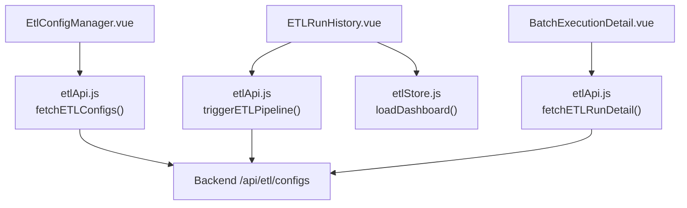
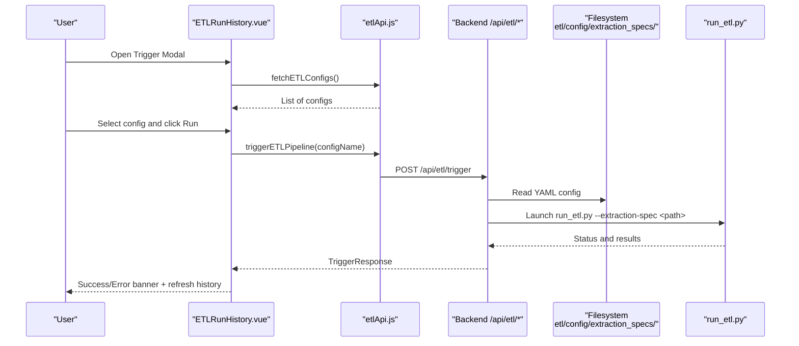
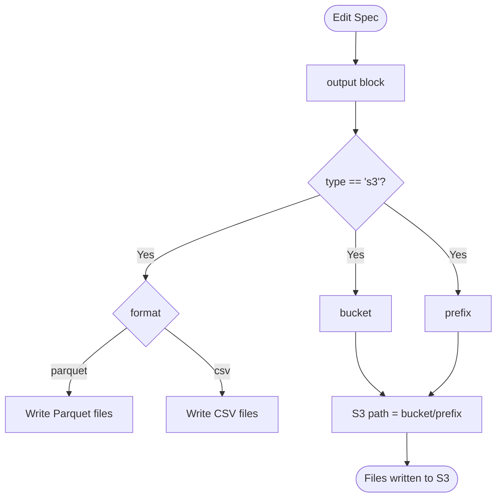
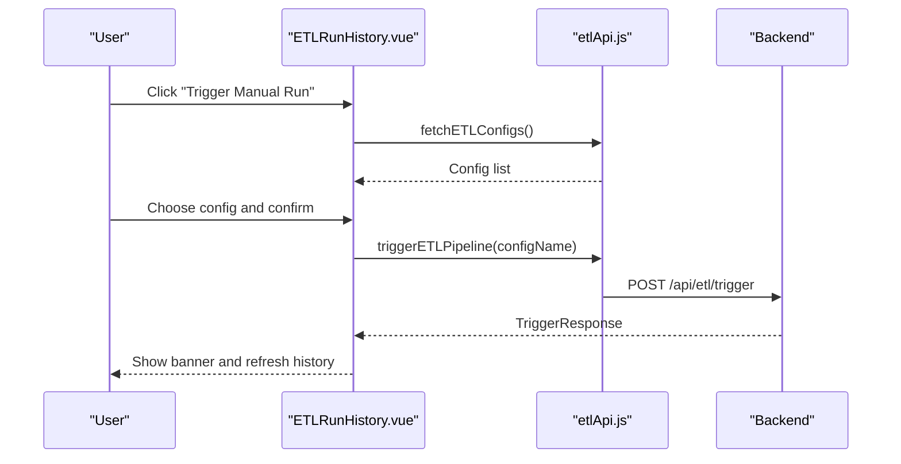
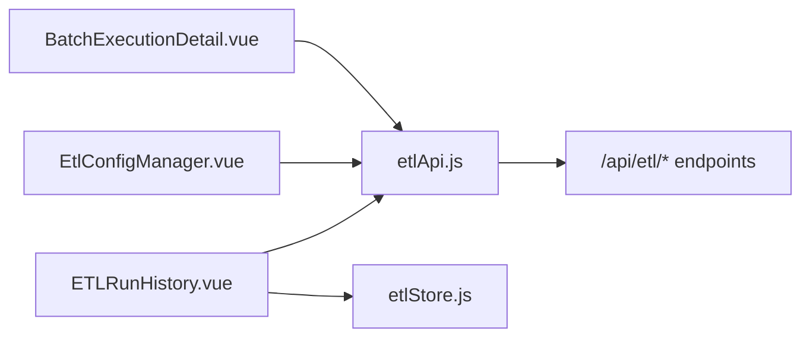

# Output Destination Configuration

<cite>
**Referenced Files in This Document**
- [ETL-CONFIG-MANAGER-REQUIREMENTS.md](file://docs/ETL-CONFIG-MANAGER-REQUIREMENTS.md)
- [ETL-CONFIG-MANAGER-REQUIREMENTS-V2.md](file://docs/ETL-CONFIG-MANAGER-REQUIREMENTS-V2.md)
- [EtlConfigManager.vue](file://src/views/Modules/datapipeline/EtlConfigManager.vue)
- [ETLRunHistory.vue](file://src/views/Modules/datapipeline/ETLRunHistory.vue)
- [BatchExecutionDetail.vue](file://src/views/Modules/datapipeline/BatchExecutionDetail.vue)
- [etlApi.js](file://src/services/etlApi.js)
- [etlStore.js](file://src/stores/etlStore.js)
</cite>

## Table of Contents
1. Introduction
2. Project Structure
3. Core Components
4. Architecture Overview
5. Detailed Component Analysis
6. Dependency Analysis
7. Performance Considerations
8. Troubleshooting Guide
9. Conclusion
10. Appendices

## Introduction
This document explains how to configure output destinations for ETL jobs in this project, with a focus on S3 destination configuration as represented in the frontend and its integration points. It covers bucket naming conventions, prefix structures, file formats (Parquet, CSV), storage optimization techniques, partitioning strategies, lifecycle policies, file naming conventions, metadata handling, data versioning, performance considerations, compression options, access control settings, error handling, retry logic, and monitoring capabilities for output operations.

The repository provides:
- A Config Manager UI for creating/editing extraction specs that include an output section targeting S3.
- A Run History UI to trigger pipelines and observe execution outcomes.
- An API service layer that lists configs and triggers runs.
- A store that loads dashboard metrics and run history.

Where backend implementation details are not present in this repository, guidance is provided based on the frontend’s configuration model and common best practices for S3 outputs.

## Project Structure
The ETL-related parts relevant to output configuration are concentrated under the Data Pipeline module and supporting services:
- Configuration editor and list: EtlConfigManager.vue
- Run history and trigger flow: ETLRunHistory.vue
- Batch detail view: BatchExecutionDetail.vue
- API client for ETL: etlApi.js
- Pinia store for dashboard state: etlStore.js
- Requirements documents describing the YAML spec structure and behavior: ETL-CONFIG-MANAGER-REQUIREMENTS.md and ETL-CONFIG-MANAGER-REQUIREMENTS-V2.md

**Diagram sources**
- [EtlConfigManager.vue:15-66](file://src/views/Modules/datapipeline/EtlConfigManager.vue#L15-L66)
- [ETLRunHistory.vue:224-263](file://src/views/Modules/datapipeline/ETLRunHistory.vue#L224-L263)
- [BatchExecutionDetail.vue:113-151](file://src/views/Modules/datapipeline/BatchExecutionDetail.vue#L113-L151)
- [etlApi.js:94-114](file://src/services/etlApi.js#L94-L114)
- [etlStore.js:33-57](file://src/stores/etlStore.js#L33-L57)

**Section sources**
- [EtlConfigManager.vue:15-66](file://src/views/Modules/datapipeline/EtlConfigManager.vue#L15-L66)
- [ETLRunHistory.vue:224-263](file://src/views/Modules/datapipeline/ETLRunHistory.vue#L224-L263)
- [BatchExecutionDetail.vue:113-151](file://src/views/Modules/datapipeline/BatchExecutionDetail.vue#L113-L151)
- [etlApi.js:94-114](file://src/services/etlApi.js#L94-L114)
- [etlStore.js:33-57](file://src/stores/etlStore.js#L33-L57)

## Core Components
- ETL Config Manager: Provides a tabbed interface with a YAML editor for defining extraction specs, including an output section targeting S3. The sample specs demonstrate S3 output fields such as type, bucket, prefix, and format.
- Run History: Displays pipeline health, quality trends, and execution history; includes a modal to select and trigger a config.
- Batch Execution Detail: Shows detailed run information, logs, audit trail, and the config used during the run.
- API Service: Encapsulates calls to list configs, trigger runs, and fetch run details.
- Store: Loads dashboard KPIs, status panel, quality trend, and paginated runs.

Key observations from the codebase:
- Output configuration uses an output block with fields like type, bucket, prefix, and format.
- Formats shown include Parquet; CSV usage exists elsewhere in the app for exports but not in the ETL output spec samples.
- The backend stores YAML files under etl/config/extraction_specs/*.yaml and launches run_etl.py via subprocess when triggered.

**Section sources**
- [EtlConfigManager.vue:15-66](file://src/views/Modules/datapipeline/EtlConfigManager.vue#L15-L66)
- [ETL-CONFIG-MANAGER-REQUIREMENTS.md:183-199](file://docs/ETL-CONFIG-MANAGER-REQUIREMENTS.md#L183-L199)
- [ETL-CONFIG-MANAGER-REQUIREMENTS-V2.md:183-199](file://docs/ETL-CONFIG-MANAGER-REQUIREMENTS-V2.md#L183-L199)
- [ETL-CONFIG-MANAGER-REQUIREMENTS.md:295-303](file://docs/ETL-CONFIG-MANAGER-REQUIREMENTS.md#L295-L303)

## Architecture Overview
The output configuration workflow spans UI editing, API invocation, and backend execution:

**Diagram sources**
- [ETLRunHistory.vue:352-391](file://src/views/Modules/datapipeline/ETLRunHistory.vue#L352-L391)
- [etlApi.js:94-114](file://src/services/etlApi.js#L94-L114)
- [ETL-CONFIG-MANAGER-REQUIREMENTS.md:295-303](file://docs/ETL-CONFIG-MANAGER-REQUIREMENTS.md#L295-L303)

## Detailed Component Analysis

### S3 Output Configuration Model
The YAML-based extraction specs define an output section that targets S3. Sample configurations show:
- type: s3
- bucket: e.g., pb-data-lake-raw
- prefix: e.g., customer_360/daily/ or transactions/eu/
- format: parquet

These fields map directly to where and how data is written to S3.

**Diagram sources**
- [EtlConfigManager.vue:23-39](file://src/views/Modules/datapipeline/EtlConfigManager.vue#L23-L39)
- [EtlConfigManager.vue:48-64](file://src/views/Modules/datapipeline/EtlConfigManager.vue#L48-L64)

**Section sources**
- [EtlConfigManager.vue:23-39](file://src/views/Modules/datapipeline/EtlConfigManager.vue#L23-L39)
- [EtlConfigManager.vue:48-64](file://src/views/Modules/datapipeline/EtlConfigManager.vue#L48-L64)

### Triggering Pipelines and Observing Outputs
Users can trigger a pipeline by selecting a config from the Run History page. The system:
- Lists available configs via API
- Triggers the pipeline with the selected config
- Displays success/error banners and refreshes run history

**Diagram sources**
- [ETLRunHistory.vue:352-391](file://src/views/Modules/datapipeline/ETLRunHistory.vue#L352-L391)
- [etlApi.js:94-114](file://src/services/etlApi.js#L94-L114)

**Section sources**
- [ETLRunHistory.vue:352-391](file://src/views/Modules/datapipeline/ETLRunHistory.vue#L352-L391)
- [etlApi.js:94-114](file://src/services/etlApi.js#L94-L114)

### Batch Detail and Config Snapshot
The batch detail view shows:
- Quality score, duration, rows processed, and quality metrics
- Execution timeline and logs
- Audit trail
- The exact config used during the run (config snapshot)

This enables operators to verify which output configuration was applied for a given run.

**Section sources**
- [BatchExecutionDetail.vue:113-151](file://src/views/Modules/datapipeline/BatchExecutionDetail.vue#L113-L151)
- [BatchExecutionDetail.vue:459-482](file://src/views/Modules/datapipeline/BatchExecutionDetail.vue#L459-L482)

### Dashboard Metrics and Monitoring
The store loads:
- KPIs (e.g., average quality)
- Status panel (current status, last successful duration/rows)
- Quality trend
- Paginated runs

These feed the Run History UI to monitor output operations indirectly through run outcomes and quality scores.

**Section sources**
- [etlStore.js:33-57](file://src/stores/etlStore.js#L33-L57)
- [ETLRunHistory.vue:278-335](file://src/views/Modules/datapipeline/ETLRunHistory.vue#L278-L335)

## Dependency Analysis
The following dependencies govern the output configuration and execution flow:

**Diagram sources**
- [ETLRunHistory.vue:267-276](file://src/views/Modules/datapipeline/ETLRunHistory.vue#L267-L276)
- [EtlConfigManager.vue:1-12](file://src/views/Modules/datapipeline/EtlConfigManager.vue#L1-L12)
- [BatchExecutionDetail.vue:1-8](file://src/views/Modules/datapipeline/BatchExecutionDetail.vue#L1-L8)
- [etlApi.js:1-16](file://src/services/etlApi.js#L1-L16)

**Section sources**
- [ETLRunHistory.vue:267-276](file://src/views/Modules/datapipeline/ETLRunHistory.vue#L267-L276)
- [EtlConfigManager.vue:1-12](file://src/views/Modules/datapipeline/EtlConfigManager.vue#L1-L12)
- [BatchExecutionDetail.vue:1-8](file://src/views/Modules/datapipeline/BatchExecutionDetail.vue#L1-L8)
- [etlApi.js:1-16](file://src/services/etlApi.js#L1-L16)

## Performance Considerations
Based on the configuration model and typical S3 output patterns:
- File format: Parquet is efficient for analytics workloads due to columnar storage and compression. CSV is more human-readable but less performant for large datasets.
- Partitioning: Use prefixes to partition by logical dimensions (e.g., date, region). Examples in the codebase include daily partitions and regional prefixes.
- Compression: Prefer compressed Parquet (e.g., Snappy or GZIP) for smaller file sizes and faster scans.
- Small files: Avoid excessive small files; consider coalescing or batching writes per partition.
- Lifecycle policies: Configure S3 lifecycle rules to transition older partitions to cheaper tiers or delete them after retention periods.
- Access control: Restrict bucket/prefix access using IAM policies and S3 bucket policies aligned with least privilege.

[No sources needed since this section provides general guidance]

## Troubleshooting Guide
Error handling and recovery mechanisms observed in the codebase:
- API responses are normalized; non-OK responses throw errors with messages extracted from response bodies.
- UI displays user-friendly error banners and inline messages with retry options where applicable.
- Triggering a pipeline shows success or error banners and refreshes run history upon completion.
- Batch detail surfaces logs and audit trails to help diagnose failures.

Recommended steps:
- If triggering fails, check the error banner and retry if transient.
- Inspect the batch detail logs and audit trail for failure context.
- Validate the YAML spec in the Config Manager; ensure required fields exist.
- Confirm backend availability and permissions to read configs and execute pipelines.

**Section sources**
- [etlApi.js:18-38](file://src/services/etlApi.js#L18-L38)
- [ETLRunHistory.vue:43-51](file://src/views/Modules/datapipeline/ETLRunHistory.vue#L43-L51)
- [ETLRunHistory.vue:375-391](file://src/views/Modules/datapipeline/ETLRunHistory.vue#L375-L391)
- [BatchExecutionDetail.vue:113-151](file://src/views/Modules/datapipeline/BatchExecutionDetail.vue#L113-L151)

## Conclusion
This project provides a clear, YAML-driven approach to configuring S3 output destinations for ETL jobs via a Config Manager UI and supports triggering runs and observing outcomes through Run History and Batch Detail views. While advanced S3 features (compression, lifecycle policies, access controls) are not implemented in the frontend, they can be configured at the infrastructure level and referenced through the output specification’s bucket and prefix fields. Operators should adopt partitioning by time and domain, choose Parquet for analytical efficiency, and apply lifecycle and access controls to optimize cost and security.

[No sources needed since this section summarizes without analyzing specific files]

## Appendices

### Example Output Configurations
Use cases and example configurations based on the repository’s samples and requirements:

- Data Lake Ingestion (Raw Layer)
  - type: s3
  - bucket: pb-data-lake-raw
  - prefix: raw/{domain}/{year}/{month}/{day}/
  - format: parquet
  - Notes: Partition by date for ingestion; use compression; apply lifecycle to move to cold storage after retention.

- Analytics Datasets (Curated Layer)
  - type: s3
  - bucket: pb-data-lake-raw
  - prefix: curated/{dataset}/{version}/
  - format: parquet
  - Notes: Versioned prefixes for dataset versions; enable partitioning by key columns for query performance.

- Archival Storage
  - type: s3
  - bucket: pb-data-lake-raw
  - prefix: archive/{source}/{year}/
  - format: csv or parquet
  - Notes: For long-term retention; apply lifecycle rules to Glacier; consider CSV for compatibility with legacy systems.

These examples align with the output blocks seen in the Config Manager samples and the default YAML template structure.

**Section sources**
- [EtlConfigManager.vue:23-39](file://src/views/Modules/datapipeline/EtlConfigManager.vue#L23-L39)
- [EtlConfigManager.vue:48-64](file://src/views/Modules/datapipeline/EtlConfigManager.vue#L48-L64)
- [ETL-CONFIG-MANAGER-REQUIREMENTS.md:183-199](file://docs/ETL-CONFIG-MANAGER-REQUIREMENTS.md#L183-L199)
- [ETL-CONFIG-MANAGER-REQUIREMENTS-V2.md:183-199](file://docs/ETL-CONFIG-MANAGER-REQUIREMENTS-V2.md#L183-L199)